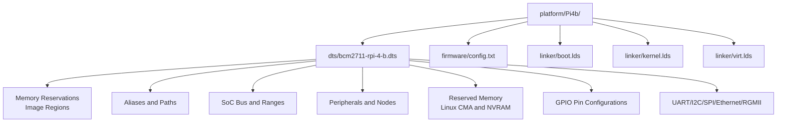
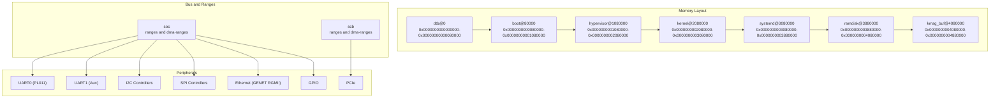
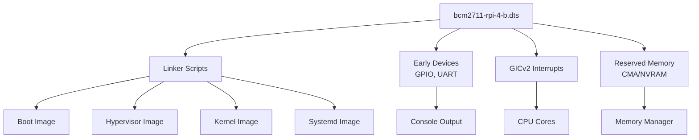

# Raspberry Pi 4B Platform

<cite>
**Referenced Files in This Document**
- [bcm2711-rpi-4-b.dts](file://platform/Pi4b/dts/bcm2711-rpi-4-b.dts)
- [config.txt](file://platform/Pi4b/firmware/config.txt)
- [boot.lds](file://platform/Pi4b/linker/boot.lds)
- [kernel.lds](file://platform/Pi4b/linker/kernel.lds)
- [virt.lds](file://platform/Pi4b/linker/virt.lds)
- [bcm2711_gpio.c](file://boot/drivers/rpi/bcm2711-gpio/bcm2711_gpio.c)
- [bcm2711_gpio.h](file://boot/drivers/rpi/bcm2711-gpio/bcm2711_gpio.h)
- [bcm2835_aux_uart.c](file://boot/drivers/rpi/bcm2835-aux-uart/bcm2835_aux_uart.c)
- [bcm2835_aux.h](file://boot/drivers/rpi/bcm2835-aux-uart/bcm2835_aux.h)
- [gicv2.c](file://kernel/drivers/arm-gic/gicv2.c)
- [bootmm.c](file://kernel/mm/bootmm.c)
- [memmgr.c](file://kernel/systemd/memmgr/memmgr.c)
</cite>

## Table of Contents
1. [Introduction](#introduction)
2. [Project Structure](#project-structure)
3. [Core Components](#core-components)
4. [Architecture Overview](#architecture-overview)
5. [Detailed Component Analysis](#detailed-component-analysis)
6. [Dependency Analysis](#dependency-analysis)
7. [Performance Considerations](#performance-considerations)
8. [Troubleshooting Guide](#troubleshooting-guide)
9. [Conclusion](#conclusion)

## Introduction
This document provides comprehensive documentation for Raspberry Pi 4B platform support in TranquilOS. It focuses on the BCM2711-based hardware configuration, memory layout, device tree structure, and platform-specific integrations. The content covers memory reservations, image placement regions, hardware alias mappings, SoC bus configuration, peripheral addresses, interrupt routing, reserved memory regions (including Linux CMA allocation and NVRAM), GPIO pin configurations, UART/I2C/SPI/Ethernet/RGMII setups, and platform optimizations with troubleshooting guidance.

## Project Structure
The Pi 4B platform is organized under the platform/Pi4b directory with three primary areas:
- Device Tree Source (DTS): Defines hardware topology, memory reservations, aliases, and peripheral nodes
- Firmware configuration: Bootloader and runtime settings
- Linker scripts: Memory placement for boot, kernel, hypervisor, and virtual images

**Diagram sources**
- [bcm2711-rpi-4-b.dts](file://platform/Pi4b/dts/bcm2711-rpi-4-b.dts#L1-L2763)
- [config.txt](file://platform/Pi4b/firmware/config.txt#L1-L14)
- [boot.lds](file://platform/Pi4b/linker/boot.lds#L1-L83)
- [kernel.lds](file://platform/Pi4b/linker/kernel.lds#L1-L73)
- [virt.lds](file://platform/Pi4b/linker/virt.lds#L1-L76)

**Section sources**
- [bcm2711-rpi-4-b.dts](file://platform/Pi4b/dts/bcm2711-rpi-4-b.dts#L1-L2763)
- [config.txt](file://platform/Pi4b/firmware/config.txt#L1-L14)
- [boot.lds](file://platform/Pi4b/linker/boot.lds#L1-L83)
- [kernel.lds](file://platform/Pi4b/linker/kernel.lds#L1-L73)
- [virt.lds](file://platform/Pi4b/linker/virt.lds#L1-L76)

## Core Components
- Device Tree Source (bcm2711-rpi-4-b.dts): Defines BCM2711 hardware, memory reservations, aliases, SoC ranges, peripheral nodes, and reserved memory regions
- Firmware config.txt: Enables ARM 64-bit, UART, GIC, and bootloader delays
- Linker scripts: Establish memory placement for boot (0x80000), hypervisor (0x1080000), kernel (0x2080000), systemd (0x3080000), ramdisk (0x3880000), kmsg buffer (0x4080000), and stacks
- GPIO driver: Initializes BCM2711 GPIO and sets UART alternate function pins
- Auxiliary UART driver: Initializes PL011-compatible mini UART via auxiliary peripherals
- Interrupt controller: GICv2 driver for interrupt distribution
- Memory manager: Boot memory allocator and system memory manager

**Section sources**
- [bcm2711-rpi-4-b.dts](file://platform/Pi4b/dts/bcm2711-rpi-4-b.dts#L1-L2763)
- [config.txt](file://platform/Pi4b/firmware/config.txt#L1-L14)
- [boot.lds](file://platform/Pi4b/linker/boot.lds#L1-L83)
- [kernel.lds](file://platform/Pi4b/linker/kernel.lds#L1-L73)
- [virt.lds](file://platform/Pi4b/linker/virt.lds#L1-L76)
- [bcm2711_gpio.c](file://boot/drivers/rpi/bcm2711-gpio/bcm2711_gpio.c#L1-L67)
- [bcm2835_aux_uart.c](file://boot/drivers/rpi/bcm2835-aux-uart/bcm2835_aux_uart.c#L1-L37)
- [gicv2.c](file://kernel/drivers/arm-gic/gicv2.c#L58-L165)
- [bootmm.c](file://kernel/mm/bootmm.c#L1-L24)
- [memmgr.c](file://kernel/systemd/memmgr/memmgr.c#L263-L300)

## Architecture Overview
The Pi 4B platform integrates a layered architecture:
- Boot stage loads the boot image at 0x80000 and initializes early devices
- Hypervisor image starts at 0x1080000
- Kernel image starts at 0x2080000
- Systemd image starts at 0x3080000
- Ramdisk starts at 0x3880000
- Kernel message buffer starts at 0x4080000
- SoC bus defines ranges for peripherals and DMA
- Reserved memory allocates Linux CMA and NVRAM regions
- Aliases provide standardized paths for UART, I2C, SPI, Ethernet, PCIe, and more

**Diagram sources**
- [bcm2711-rpi-4-b.dts](file://platform/Pi4b/dts/bcm2711-rpi-4-b.dts#L11-L51)
- [bcm2711-rpi-4-b.dts](file://platform/Pi4b/dts/bcm2711-rpi-4-b.dts#L178-L184)
- [bcm2711-rpi-4-b.dts](file://platform/Pi4b/dts/bcm2711-rpi-4-b.dts#L2214-L2220)

**Section sources**
- [bcm2711-rpi-4-b.dts](file://platform/Pi4b/dts/bcm2711-rpi-4-b.dts#L11-L51)
- [bcm2711-rpi-4-b.dts](file://platform/Pi4b/dts/bcm2711-rpi-4-b.dts#L178-L184)
- [bcm2711-rpi-4-b.dts](file://platform/Pi4b/dts/bcm2711-rpi-4-b.dts#L2214-L2220)

## Detailed Component Analysis

### Memory Reservations and Image Placement Regions
- dtb@0: 0x0000000000000000–0x00000000000080000 reserved for device tree blob
- boot@80000: 0x0000000000080000–0x00000000001080000 for boot image
- hypervisor@1080000: 0x0000000001080000–0x0000000002080000 for hypervisor
- kernel@2080000: 0x0000000002080000–0x0000000003080000 for kernel
- systemd@3080000: 0x0000000003080000–0x0000000003880000 for systemd
- ramdisk@3880000: 0x0000000003880000–0x0000000004080000 for ramdisk
- kmsg_buf@4080000: 0x0000000004080000–0x0000000004880000 for kernel messages

These regions align with linker script placements and ensure deterministic loading order.

**Section sources**
- [bcm2711-rpi-4-b.dts](file://platform/Pi4b/dts/bcm2711-rpi-4-b.dts#L11-L51)
- [boot.lds](file://platform/Pi4b/linker/boot.lds#L1-L83)
- [kernel.lds](file://platform/Pi4b/linker/kernel.lds#L1-L73)
- [virt.lds](file://platform/Pi4b/linker/virt.lds#L1-L76)

### Hardware Alias Mappings
Aliases define standardized paths for common peripherals:
- Serial: serial0 → /soc/serial@7e215040, serial1 → /soc/serial@fe201000
- I2C: i2c0 → /soc/i2c0mux/i2c@0, i2c1 → /soc/i2c@7e804000, i2c10 → /soc/i2c0mux/i2c@1, i2c → /soc/i2c@7e804000
- SPI: spi0 → /soc/spi@7e204000, spi1 → /soc/spi@7e215080, spi2 → /soc/spi@7e2150c0
- Ethernet: ethernet0 → /scb/ethernet@7d580000
- PCIe: pcie0 → /scb/pcie@7d500000
- NVRAM: blconfig → /reserved-memory/nvram@0, blpubkey → /reserved-memory/nvram@1
- Additional aliases for GPIO, watchdog, RNG, mailbox, sound, LEDs, HDMI, AXI perf, and more

These aliases simplify device access and cross-platform compatibility.

**Section sources**
- [bcm2711-rpi-4-b.dts](file://platform/Pi4b/dts/bcm2711-rpi-4-b.dts#L53-L109)

### SoC Bus Configuration and Peripheral Addresses
- soc node defines ranges and dma-ranges for peripheral access
- Peripheral base addresses include:
  - UART0 (PL011): 0xfe201000
  - UART1 (Aux UART): 0x7e215040
  - I2C controllers: 0x7e205000, 0x7e804000, and others
  - SPI controllers: 0x7e204000, 0x7e215080, 0x7e2150c0, and more
  - Ethernet (GENET): 0x7d580000
  - PCIe: 0x7d500000
  - GPIO: 0x7e200000
  - Watchdog: 0x7e100000
  - RNG: 0x7e104000
  - Mailbox/VCHIQ: 0x7e00b840
  - HDMI: 0x7ef00700/0x7ef05700
  - CSI/Unicam: 0x7e800000/0x7e801000
  - V3D: 0x7ec04000

**Section sources**
- [bcm2711-rpi-4-b.dts](file://platform/Pi4b/dts/bcm2711-rpi-4-b.dts#L178-L184)
- [bcm2711-rpi-4-b.dts](file://platform/Pi4b/dts/bcm2711-rpi-4-b.dts#L1243-L1267)
- [bcm2711-rpi-4-b.dts](file://platform/Pi4b/dts/bcm2711-rpi-4-b.dts#L1375-L1395)
- [bcm2711-rpi-4-b.dts](file://platform/Pi4b/dts/bcm2711-rpi-4-b.dts#L1469-L1481)
- [bcm2711-rpi-4-b.dts](file://platform/Pi4b/dts/bcm2711-rpi-4-b.dts#L1483-L1497)
- [bcm2711-rpi-4-b.dts](file://platform/Pi4b/dts/bcm2711-rpi-4-b.dts#L2254-L2279)
- [bcm2711-rpi-4-b.dts](file://platform/Pi4b/dts/bcm2711-rpi-4-b.dts#L2222-L2252)
- [bcm2711-rpi-4-b.dts](file://platform/Pi4b/dts/bcm2711-rpi-4-b.dts#L2000-L2010)
- [bcm2711-rpi-4-b.dts](file://platform/Pi4b/dts/bcm2711-rpi-4-b.dts#L2495-L2506)

### Interrupt Routing
- Local interrupt controller: 0x40000000
- GICv2: 0x40041000–0x40046000 with interrupts mapped
- Timer: Generic ARMv8 timer
- PMU: Cortex-A72 PMU interrupts
- Ethernet: GENET interrupts (two lines)
- PCIe: MSI and legacy interrupts
- DMA: L1 DMA controller and DMA40 controller
- GPIO: Two interrupt lines for GPIO controller

Interrupts are routed through GICv2 with appropriate targets and priorities.

**Section sources**
- [bcm2711-rpi-4-b.dts](file://platform/Pi4b/dts/bcm2711-rpi-4-b.dts#L1499-L1512)
- [bcm2711-rpi-4-b.dts](file://platform/Pi4b/dts/bcm2711-rpi-4-b.dts#L2127-L2131)
- [bcm2711-rpi-4-b.dts](file://platform/Pi4b/dts/bcm2711-rpi-4-b.dts#L1526-L1546)
- [bcm2711-rpi-4-b.dts](file://platform/Pi4b/dts/bcm2711-rpi-4-b.dts#L2281-L2289)
- [gicv2.c](file://kernel/drivers/arm-gic/gicv2.c#L58-L165)

### Reserved Memory Regions
- Linux CMA:
  - Region: 0x00–0x30000000
  - Size: 64 MiB
  - Flags: reusable, linux,cma-default
- NVRAM:
  - nvram@0: bootloader config region (disabled)
  - nvram@1: bootloader public key region (disabled)
- Thermal zones:
  - CPU thermal zone with polling delay, coefficients, and critical trip point

These regions ensure proper memory allocation for kernel DMA and secure bootloader data.

**Section sources**
- [bcm2711-rpi-4-b.dts](file://platform/Pi4b/dts/bcm2711-rpi-4-b.dts#L117-L151)
- [bcm2711-rpi-4-b.dts](file://platform/Pi4b/dts/bcm2711-rpi-4-b.dts#L153-L176)

### GPIO Pin Configurations
- GPIO controller: 0x7e200000 with two interrupt lines
- Pin functions include:
  - UART0 pins (TX/RX) configured via alternate functions
  - SPI0, SPI1, SPI2, SPI3, SPI4, SPI5, SPI6 with dedicated pin groups
  - I2C0, I2C1, I2C3, I2C4, I2C5, I2C6 with alternate function groups
  - PCM/I2S pins
  - SD host and eMMC pins
  - DPI and pixelvalve pins
  - RGMII MDIO/MDC and IRQ pins
  - JTAG pins
  - PWM pins
  - General-purpose pins for LEDs and regulators

GPIO driver sets UART alternate function during early initialization.

**Section sources**
- [bcm2711-rpi-4-b.dts](file://platform/Pi4b/dts/bcm2711-rpi-4-b.dts#L220-L230)
- [bcm2711_gpio.c](file://boot/drivers/rpi/bcm2711-gpio/bcm2711_gpio.c#L1-L67)
- [bcm2711_gpio.h](file://boot/drivers/rpi/bcm2711-gpio/bcm2711_gpio.h#L1-L98)

### UART Interfaces
- UART0 (PL011):
  - Address: 0xfe201000
  - Clocks: uartclk and apb_pclk
  - Status: enabled
  - Pins: configured via pinctrl defaults
  - Bluetooth: optional BT module present
- UART1 (Aux UART):
  - Address: 0x7e215040
  - Status: enabled
  - Pins: configured via pinctrl defaults
  - Bluetooth: optional BT module present

Auxiliary UART driver initializes baud rate and enables the mini UART.

**Section sources**
- [bcm2711-rpi-4-b.dts](file://platform/Pi4b/dts/bcm2711-rpi-4-b.dts#L1243-L1267)
- [bcm2711-rpi-4-b.dts](file://platform/Pi4b/dts/bcm2711-rpi-4-b.dts#L1375-L1395)
- [bcm2835_aux_uart.c](file://boot/drivers/rpi/bcm2835-aux-uart/bcm2835_aux_uart.c#L1-L37)
- [bcm2835_aux.h](file://boot/drivers/rpi/bcm2835-aux-uart/bcm2835_aux.h#L1-L33)

### I2C Buses
- I2C0: 0x7e205000 (auxiliary I2C)
- I2C1: 0x7e804000 (ARM I2C)
- I2C3–I2C6: Multiple controllers at various addresses
- I2C0 multiplexer: i2c0mux routes to CSI/DSI or I2C bus
- Pin groups for each bus are defined with alternate functions and pull configurations

**Section sources**
- [bcm2711-rpi-4-b.dts](file://platform/Pi4b/dts/bcm2711-rpi-4-b.dts#L1331-L1341)
- [bcm2711-rpi-4-b.dts](file://platform/Pi4b/dts/bcm2711-rpi-4-b.dts#L1469-L1481)
- [bcm2711-rpi-4-b.dts](file://platform/Pi4b/dts/bcm2711-rpi-4-b.dts#L1659-L1709)
- [bcm2711-rpi-4-b.dts](file://platform/Pi4b/dts/bcm2711-rpi-4-b.dts#L1923-L1947)

### SPI Connections
- SPI0: 0x7e204000 (primary SPI)
- SPI1: 0x7e215080 (aux SPI)
- SPI2: 0x7e2150c0 (aux SPI)
- SPI3–SPI6: Additional controllers
- Chip-select and pin groups defined per controller

**Section sources**
- [bcm2711-rpi-4-b.dts](file://platform/Pi4b/dts/bcm2711-rpi-4-b.dts#L1297-L1329)
- [bcm2711-rpi-4-b.dts](file://platform/Pi4b/dts/bcm2711-rpi-4-b.dts#L1397-L1417)
- [bcm2711-rpi-4-b.dts](file://platform/Pi4b/dts/bcm2711-rpi-4-b.dts#L1607-L1657)

### Ethernet and RGMII Configuration
- Ethernet controller: GENET v5 at 0x7d580000
- PHY mode: RGMII-RXID
- MDIO: 0x7d580000 + 0xe14
- PHY: ethernet-phy@1
- Interrupts: two lines for Ethernet events
- PCIe bridge: 0x7d500000 with MSI support

**Section sources**
- [bcm2711-rpi-4-b.dts](file://platform/Pi4b/dts/bcm2711-rpi-4-b.dts#L2254-L2279)
- [bcm2711-rpi-4-b.dts](file://platform/Pi4b/dts/bcm2711-rpi-4-b.dts#L2222-L2252)

### Platform-Specific Optimizations
- Firmware configuration enables ARM 64-bit, UART, GIC, and bootloader delays for stability
- Linker scripts place images at fixed offsets to streamline loading
- Early GPIO and UART initialization ensures reliable console output
- GICv2 driver provides efficient interrupt handling across cores
- Reserved memory regions allocate contiguous buffers for DMA and secure data

**Section sources**
- [config.txt](file://platform/Pi4b/firmware/config.txt#L1-L14)
- [boot.lds](file://platform/Pi4b/linker/boot.lds#L1-L83)
- [kernel.lds](file://platform/Pi4b/linker/kernel.lds#L1-L73)
- [virt.lds](file://platform/Pi4b/linker/virt.lds#L1-L76)
- [bcm2711_gpio.c](file://boot/drivers/rpi/bcm2711-gpio/bcm2711_gpio.c#L1-L67)
- [gicv2.c](file://kernel/drivers/arm-gic/gicv2.c#L58-L165)

## Dependency Analysis
The platform relies on coordinated components:
- Device tree defines memory regions and peripheral nodes
- Linker scripts enforce memory placement
- Boot and kernel stages depend on early device probing
- Interrupts traverse GICv2 to CPU cores
- Memory manager uses boot memory allocator initially, then transitions to system allocator

**Diagram sources**
- [bcm2711-rpi-4-b.dts](file://platform/Pi4b/dts/bcm2711-rpi-4-b.dts#L11-L51)
- [bcm2711-rpi-4-b.dts](file://platform/Pi4b/dts/bcm2711-rpi-4-b.dts#L117-L151)
- [boot.lds](file://platform/Pi4b/linker/boot.lds#L1-L83)
- [kernel.lds](file://platform/Pi4b/linker/kernel.lds#L1-L73)
- [virt.lds](file://platform/Pi4b/linker/virt.lds#L1-L76)
- [bcm2711_gpio.c](file://boot/drivers/rpi/bcm2711-gpio/bcm2711_gpio.c#L1-L67)
- [bcm2835_aux_uart.c](file://boot/drivers/rpi/bcm2835-aux-uart/bcm2835_aux_uart.c#L1-L37)
- [gicv2.c](file://kernel/drivers/arm-gic/gicv2.c#L58-L165)
- [bootmm.c](file://kernel/mm/bootmm.c#L1-L24)
- [memmgr.c](file://kernel/systemd/memmgr/memmgr.c#L263-L300)

**Section sources**
- [bcm2711-rpi-4-b.dts](file://platform/Pi4b/dts/bcm2711-rpi-4-b.dts#L11-L51)
- [bcm2711-rpi-4-b.dts](file://platform/Pi4b/dts/bcm2711-rpi-4-b.dts#L117-L151)
- [boot.lds](file://platform/Pi4b/linker/boot.lds#L1-L83)
- [kernel.lds](file://platform/Pi4b/linker/kernel.lds#L1-L73)
- [virt.lds](file://platform/Pi4b/linker/virt.lds#L1-L76)
- [bcm2711_gpio.c](file://boot/drivers/rpi/bcm2711-gpio/bcm2711_gpio.c#L1-L67)
- [bcm2835_aux_uart.c](file://boot/drivers/rpi/bcm2835-aux-uart/bcm2835_aux_uart.c#L1-L37)
- [gicv2.c](file://kernel/drivers/arm-gic/gicv2.c#L58-L165)
- [bootmm.c](file://kernel/mm/bootmm.c#L1-L24)
- [memmgr.c](file://kernel/systemd/memmgr/memmgr.c#L263-L300)

## Performance Considerations
- Use Linux CMA (64 MiB) for DMA allocations to reduce fragmentation
- Enable UART and GIC early to minimize boot latency
- Keep reserved memory regions minimal to avoid memory pressure
- Configure I2C and SPI speeds appropriately for peripherals
- Utilize PCIe and DMA controllers efficiently for high-throughput devices
- Monitor thermal zones to prevent throttling under load

[No sources needed since this section provides general guidance]

## Troubleshooting Guide
Common Pi 4B issues and resolutions:
- No console output:
  - Verify UART0/UART1 enabled in firmware config and GPIO alternate functions set
  - Confirm UART registers and clocks are configured
- I2C bus not responding:
  - Check I2C controller status and pin group alternate functions
  - Validate pull-up resistors and bus speed settings
- SPI communication errors:
  - Ensure chip-select and clock polarity/phase match device requirements
  - Verify SPI controller and pin groups are enabled
- Ethernet connectivity problems:
  - Confirm GENET RGMII mode and MDIO configuration
  - Check PHY presence and interrupts
- PCIe device detection issues:
  - Validate PCIe controller and MSI configuration
  - Ensure device tree ranges and DMA ranges are correct

**Section sources**
- [config.txt](file://platform/Pi4b/firmware/config.txt#L1-L14)
- [bcm2711-rpi-4-b.dts](file://platform/Pi4b/dts/bcm2711-rpi-4-b.dts#L1243-L1267)
- [bcm2711-rpi-4-b.dts](file://platform/Pi4b/dts/bcm2711-rpi-4-b.dts#L1375-L1395)
- [bcm2711-rpi-4-b.dts](file://platform/Pi4b/dts/bcm2711-rpi-4-b.dts#L1469-L1481)
- [bcm2711-rpi-4-b.dts](file://platform/Pi4b/dts/bcm2711-rpi-4-b.dts#L2254-L2279)
- [bcm2711-rpi-4-b.dts](file://platform/Pi4b/dts/bcm2711-rpi-4-b.dts#L2222-L2252)

## Conclusion
The Raspberry Pi 4B platform in TranquilOS leverages a well-defined device tree, precise memory reservations, and structured linker scripts to deliver robust hardware support. The BCM2711-based SoC integrates UART, I2C, SPI, Ethernet (RGMII), PCIe, and GPIO with clear alias mappings and interrupt routing. Early device initialization, GICv2 handling, and reserved memory regions ensure reliable operation. Following the documented configurations and troubleshooting steps will help maintain optimal performance and stability.