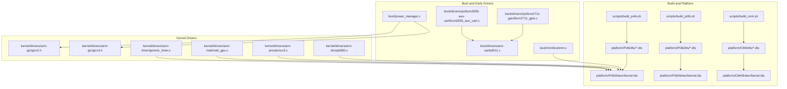
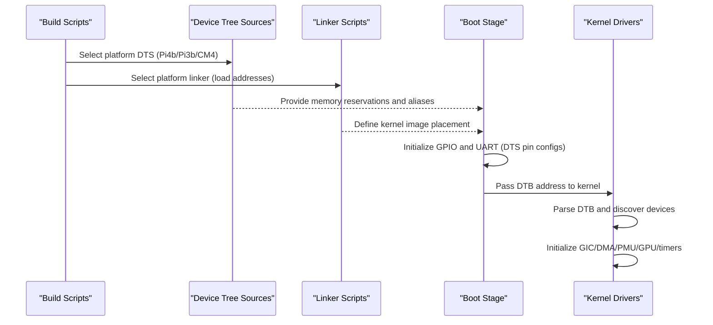
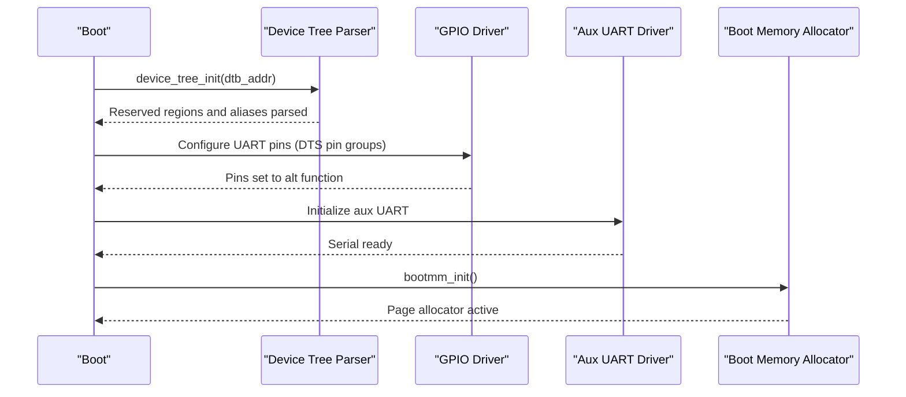
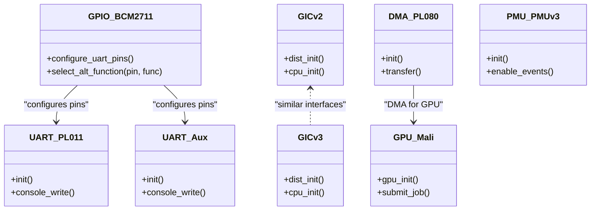
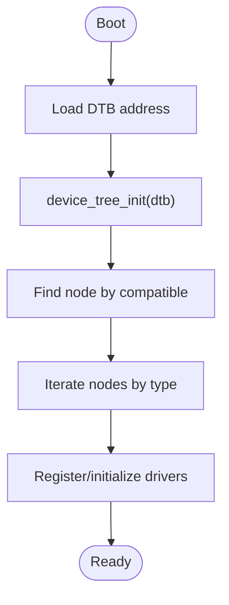
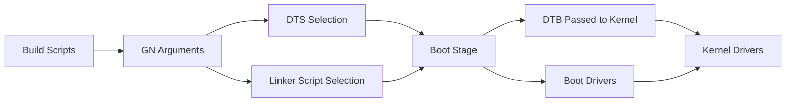

# Raspberry Pi Platforms

<cite>
**Referenced Files in This Document**
- [bcm2711-rpi-4-b.dts](file://platform/Pi4b/dts/bcm2711-rpi-4-b.dts)
- [bcm2710-rpi-3-b.dts](file://platform/Pi3b/dts/bcm2710-rpi-3-b.dts)
- [bcm2710-rpi-zero-2-w.dts](file://platform/Pi3b/dts/bcm2710-rpi-zero-2-w.dts)
- [bcm2711-rpi-cm4.dts](file://platform/CM4/dts/bcm2711-rpi-cm4.dts)
- [kernel.lds (Pi4b)](file://platform/Pi4b/linker/kernel.lds)
- [kernel.lds (Pi3b)](file://platform/Pi3b/linker/kernel.lds)
- [kernel.lds (CM4)](file://platform/CM4/linker/kernel.lds)
- [build_pi4b.sh](file://scripts/build_pi4b.sh)
- [build_pi3b.sh](file://scripts/build_pi3b.sh)
- [build_cm4.sh](file://scripts/build_cm4.sh)
- [device_tree.c](file://kernel/device/device_tree.c)
- [bootmm.c](file://boot/mm/bootmm.c)
- [power_manager.c](file://boot/power_manager.c)
- [bcm2711_gpio.c](file://boot/drivers/rpi/bcm2711-gpio/bcm2711_gpio.c)
- [bcm2835_aux_uart.c](file://boot/drivers/rpi/bcm2835-aux-uart/bcm2835_aux_uart.c)
- [pl011.h](file://boot/drivers/arm-uart/pl011.h)
- [pl011.c](file://boot/drivers/arm-uart/pl011.c)
- [gicv2.h](file://kernel/drivers/arm-gic/gicv2.h)
- [gicv3.h](file://kernel/drivers/arm-gic/gicv3.h)
- [pl080.h](file://kernel/drivers/arm-dma/pl080.h)
- [pl080.c](file://kernel/drivers/arm-dma/pl080.c)
- [pmuv3.h](file://kernel/drivers/arm-pmu/pmuv3.h)
- [pmuv3.c](file://kernel/drivers/arm-pmu/pmuv3.c)
- [mali_gpu.h](file://kernel/drivers/arm-mali/mali_gpu.h)
- [mali_gpu.c](file://kernel/drivers/arm-mali/mali_gpu.c)
- [mali_job.h](file://kernel/drivers/arm-mali/mali_job.h)
- [mali_job.c](file://kernel/drivers/arm-mali/mali_job.c)
- [mali_mmu.h](file://kernel/drivers/arm-mali/mali_mmu.h)
- [mali_mmu.c](file://kernel/drivers/arm-mali/mali_mmu.c)
- [bcm2711_fb.c](file://uapps/devmgr/drivers/rpi/rpi-fb/bcm2711_fb.c)
- [bcm2711_mailbox.c](file://uapps/devmgr/drivers/rpi/rpi-fb/bcm2711_mailbox.c)
- [bcm2711_gpio.h](file://boot/drivers/rpi/bcm2711-gpio/bcm2711_gpio.h)
- [bcm2835_aux.h](file://boot/drivers/rpi/bcm2835-aux-uart/bcm2835_aux.h)
- [generic_timer.h](file://kernel/drivers/arm-timer/generic_timer.h)
- [generic_timer.c](file://kernel/drivers/arm-timer/generic_timer.c)
- [README.md](file://README.md)
</cite>

## Table of Contents
1. [Introduction](#introduction)
2. [Project Structure](#project-structure)
3. [Core Components](#core-components)
4. [Architecture Overview](#architecture-overview)
5. [Detailed Component Analysis](#detailed-component-analysis)
6. [Dependency Analysis](#dependency-analysis)
7. [Performance Considerations](#performance-considerations)
8. [Troubleshooting Guide](#troubleshooting-guide)
9. [Conclusion](#conclusion)

## Introduction
This document explains Raspberry Pi platform support in TranquilOS, focusing on Raspberry Pi 4 Model B, Raspberry Pi 3 Model B, Raspberry Pi Zero 2W, and Compute Module 4. It covers device tree structures, memory layouts, hardware initialization sequences, platform-specific features, peripheral configurations, and optimization strategies. It also describes device tree compilation, platform detection, and the hardware abstraction layers used to interface with SoC peripherals.

## Project Structure
The Raspberry Pi support is organized per-platform under platform/<model>, with:
- Device Tree Sources (.dts) defining memory reservations, aliases, and peripheral nodes
- Linker scripts (.lds) controlling load addresses and memory layout
- Build scripts invoking GN/Ninja with platform-specific arguments
- Boot-time device drivers for GPIO pin control and auxiliary UART
- Kernel drivers for GIC, DMA, PMU, Mali GPU, and timers

**Diagram sources**
- [build_pi4b.sh](file://scripts/build_pi4b.sh#L1-L6)
- [build_pi3b.sh](file://scripts/build_pi3b.sh#L1-L6)
- [build_cm4.sh](file://scripts/build_cm4.sh#L1-L6)
- [bcm2711-rpi-4-b.dts](file://platform/Pi4b/dts/bcm2711-rpi-4-b.dts#L1-L120)
- [bcm2710-rpi-3-b.dts](file://platform/Pi3b/dts/bcm2710-rpi-3-b.dts#L1-L120)
- [bcm2710-rpi-zero-2-w.dts](file://platform/Pi3b/dts/bcm2710-rpi-zero-2-w.dts#L1-L120)
- [bcm2711-rpi-cm4.dts](file://platform/CM4/dts/bcm2711-rpi-cm4.dts#L1-L120)
- [kernel.lds (Pi4b)](file://platform/Pi4b/linker/kernel.lds#L1-L73)
- [kernel.lds (Pi3b)](file://platform/Pi3b/linker/kernel.lds#L1-L73)
- [kernel.lds (CM4)](file://platform/CM4/linker/kernel.lds#L1-L73)
- [bcm2711_gpio.c](file://boot/drivers/rpi/bcm2711-gpio/bcm2711_gpio.c#L1-L70)
- [bcm2835_aux_uart.c](file://boot/drivers/rpi/bcm2835-aux-uart/bcm2835_aux_uart.c#L1-L40)
- [pl011.c](file://boot/drivers/arm-uart/pl011.c#L1-L50)
- [bootmm.c](file://boot/mm/bootmm.c#L1-L29)
- [power_manager.c](file://boot/power_manager.c#L1-L27)
- [gicv2.h](file://kernel/drivers/arm-gic/gicv2.h#L1-L50)
- [gicv3.h](file://kernel/drivers/arm-gic/gicv3.h#L1-L50)
- [pl080.c](file://kernel/drivers/arm-dma/pl080.c#L1-L50)
- [pmuv3.c](file://kernel/drivers/arm-pmu/pmuv3.c#L1-L50)
- [mali_gpu.c](file://kernel/drivers/arm-mali/mali_gpu.c#L1-L50)
- [generic_timer.c](file://kernel/drivers/arm-timer/generic_timer.c#L1-L50)

**Section sources**
- [README.md](file://README.md#L1-L42)
- [build_pi4b.sh](file://scripts/build_pi4b.sh#L1-L6)
- [build_pi3b.sh](file://scripts/build_pi3b.sh#L1-L6)
- [build_cm4.sh](file://scripts/build_cm4.sh#L1-L6)

## Core Components
- Device Tree Sources define platform identity, reserved regions, aliases, and peripheral nodes for each model.
- Linker scripts set the kernel load address and memory layout for each platform.
- Boot-time drivers configure GPIO pin functions and auxiliary UART for serial output.
- Kernel drivers implement GIC, DMA, PMU, Mali GPU, and generic timer abstractions.
- Device tree parser enables runtime discovery of hardware resources.

Key implementation references:
- Device tree parsing and traversal: [device_tree.c](file://kernel/device/device_tree.c#L1-L95)
- Boot memory allocator: [bootmm.c](file://boot/mm/bootmm.c#L1-L29)
- Power management hooks: [power_manager.c](file://boot/power_manager.c#L1-L27)
- GPIO pin muxing for UART: [bcm2711_gpio.c](file://boot/drivers/rpi/bcm2711-gpio/bcm2711_gpio.c#L1-L70)
- Auxiliary UART initialization: [bcm2835_aux_uart.c](file://boot/drivers/rpi/bcm2835-aux-uart/bcm2835_aux_uart.c#L1-L40)
- PL011 UART driver: [pl011.c](file://boot/drivers/arm-uart/pl011.c#L1-L50)

**Section sources**
- [device_tree.c](file://kernel/device/device_tree.c#L1-L95)
- [bootmm.c](file://boot/mm/bootmm.c#L1-L29)
- [power_manager.c](file://boot/power_manager.c#L1-L27)
- [bcm2711_gpio.c](file://boot/drivers/rpi/bcm2711-gpio/bcm2711_gpio.c#L1-L70)
- [bcm2835_aux_uart.c](file://boot/drivers/rpi/bcm2835-aux-uart/bcm2835_aux_uart.c#L1-L40)
- [pl011.c](file://boot/drivers/arm-uart/pl011.c#L1-L50)

## Architecture Overview
The platform architecture integrates device tree-driven discovery with layered hardware abstraction:
- Device Tree Sources encode platform-specific memory maps and peripheral configurations.
- Build scripts select the appropriate DTS and linker script via GN arguments.
- At boot, early drivers initialize GPIO and UART based on DTS-provided pin mappings.
- The kernel initializes GIC, DMA, PMU, and GPU subsystems, using device tree nodes to locate hardware.

**Diagram sources**
- [build_pi4b.sh](file://scripts/build_pi4b.sh#L1-L6)
- [build_pi3b.sh](file://scripts/build_pi3b.sh#L1-L6)
- [build_cm4.sh](file://scripts/build_cm4.sh#L1-L6)
- [bcm2711-rpi-4-b.dts](file://platform/Pi4b/dts/bcm2711-rpi-4-b.dts#L1-L120)
- [bcm2710-rpi-3-b.dts](file://platform/Pi3b/dts/bcm2710-rpi-3-b.dts#L1-L120)
- [bcm2711-rpi-cm4.dts](file://platform/CM4/dts/bcm2711-rpi-cm4.dts#L1-L120)
- [kernel.lds (Pi4b)](file://platform/Pi4b/linker/kernel.lds#L1-L73)
- [kernel.lds (Pi3b)](file://platform/Pi3b/linker/kernel.lds#L1-L73)
- [kernel.lds (CM4)](file://platform/CM4/linker/kernel.lds#L1-L73)
- [device_tree.c](file://kernel/device/device_tree.c#L1-L95)
- [bcm2711_gpio.c](file://boot/drivers/rpi/bcm2711-gpio/bcm2711_gpio.c#L1-L70)
- [bcm2835_aux_uart.c](file://boot/drivers/rpi/bcm2835-aux-uart/bcm2835_aux_uart.c#L1-L40)

## Detailed Component Analysis

### Device Tree Structures and Memory Layouts
Each platform defines:
- Reserved memory regions for tranquil images and buffers
- Aliases for serial, GPIO, I2C, SPI, MMC, USB, and thermal sensors
- Clocks and interrupts for peripherals
- GPIO pin groups and alternate function assignments for UART, I2C, SPI, PCM, and Ethernet

Platform highlights:
- Pi 4B: Uses bcm2711-compatible nodes, extensive I2C/SPI variants, RGMII Ethernet pins, mailbox, and thermal zones.
- Pi 3B: Uses bcm2835-compatible nodes, includes SD host, I2S, and auxiliary UART.
- Zero 2W: Similar to Pi 3B but tailored for the smaller form factor and BT/Wi-Fi combo chip.
- CM4: Uses fe200000 GPIO base address, extended I2C/SPI sets, and RGMII Ethernet pins.

Memory layout anchors:
- Kernel load address is set in linker scripts to a fixed high address for each platform.

References:
- Pi 4B DTS: [bcm2711-rpi-4-b.dts](file://platform/Pi4b/dts/bcm2711-rpi-4-b.dts#L1-L200)
- Pi 3B DTS: [bcm2710-rpi-3-b.dts](file://platform/Pi3b/dts/bcm2710-rpi-3-b.dts#L1-L200)
- Zero 2W DTS: [bcm2710-rpi-zero-2-w.dts](file://platform/Pi3b/dts/bcm2710-rpi-zero-2-w.dts#L1-L200)
- CM4 DTS: [bcm2711-rpi-cm4.dts](file://platform/CM4/dts/bcm2711-rpi-cm4.dts#L1-L200)
- Linker scripts: [kernel.lds (Pi4b)](file://platform/Pi4b/linker/kernel.lds#L1-L73), [kernel.lds (Pi3b)](file://platform/Pi3b/linker/kernel.lds#L1-L73), [kernel.lds (CM4)](file://platform/CM4/linker/kernel.lds#L1-L73)

**Section sources**
- [bcm2711-rpi-4-b.dts](file://platform/Pi4b/dts/bcm2711-rpi-4-b.dts#L1-L200)
- [bcm2710-rpi-3-b.dts](file://platform/Pi3b/dts/bcm2710-rpi-3-b.dts#L1-L200)
- [bcm2710-rpi-zero-2-w.dts](file://platform/Pi3b/dts/bcm2710-rpi-zero-2-w.dts#L1-L200)
- [bcm2711-rpi-cm4.dts](file://platform/CM4/dts/bcm2711-rpi-cm4.dts#L1-L200)
- [kernel.lds (Pi4b)](file://platform/Pi4b/linker/kernel.lds#L1-L73)
- [kernel.lds (Pi3b)](file://platform/Pi3b/linker/kernel.lds#L1-L73)
- [kernel.lds (CM4)](file://platform/CM4/linker/kernel.lds#L1-L73)

### Hardware Initialization Sequences
Early boot sequence:
- Boot stage parses the DTB passed by the bootloader and discovers reserved memory and aliases.
- GPIO driver configures UART pins according to DTS pin groups and alternate functions.
- Auxiliary UART driver initializes the aux UART block for serial output.
- Boot memory allocator is initialized and becomes the active page allocator.

**Diagram sources**
- [device_tree.c](file://kernel/device/device_tree.c#L1-L95)
- [bcm2711_gpio.c](file://boot/drivers/rpi/bcm2711-gpio/bcm2711_gpio.c#L1-L70)
- [bcm2835_aux_uart.c](file://boot/drivers/rpi/bcm2835-aux-uart/bcm2835_aux_uart.c#L1-L40)
- [bootmm.c](file://boot/mm/bootmm.c#L1-L29)

**Section sources**
- [device_tree.c](file://kernel/device/device_tree.c#L1-L95)
- [bcm2711_gpio.c](file://boot/drivers/rpi/bcm2711-gpio/bcm2711_gpio.c#L1-L70)
- [bcm2835_aux_uart.c](file://boot/drivers/rpi/bcm2835-aux-uart/bcm2835_aux_uart.c#L1-L40)
- [bootmm.c](file://boot/mm/bootmm.c#L1-L29)

### Platform-Specific Hardware Features and Peripheral Configurations
- UART: PL011 and auxiliary UART nodes configured with clocks and pinctrl in DTS; early drivers set alt functions.
- GPIO: Extensive pin groups for UART, I2C, SPI, PCM, PWM, and Ethernet (RGMII) across platforms.
- I2C/SPI/I2S: Multiple buses exposed; pin groups selected via pinctrl in DTS.
- MMC/SD: SD host and SDHCI controllers present; bus widths and DMA configured in DTS.
- Mailbox: Used for framebuffer and audio on Pi platforms.
- Thermal: Thermal zones and trips defined in DTS for temperature monitoring.
- Interrupts: GICv2/v3 drivers manage IRQ distribution.

References:
- UART nodes and pinctrl: [bcm2711-rpi-4-b.dts](file://platform/Pi4b/dts/bcm2711-rpi-4-b.dts#L590-L760), [bcm2710-rpi-3-b.dts](file://platform/Pi3b/dts/bcm2710-rpi-3-b.dts#L590-L780), [bcm2711-rpi-cm4.dts](file://platform/CM4/dts/bcm2711-rpi-cm4.dts#L310-L800)
- GPIO pin groups: [bcm2711-rpi-4-b.dts](file://platform/Pi4b/dts/bcm2711-rpi-4-b.dts#L220-L800), [bcm2710-rpi-3-b.dts](file://platform/Pi3b/dts/bcm2710-rpi-3-b.dts#L178-L590), [bcm2711-rpi-cm4.dts](file://platform/CM4/dts/bcm2711-rpi-cm4.dts#L166-L800)
- Mailbox and framebuffer: [bcm2711-rpi-4-b.dts](file://platform/Pi4b/dts/bcm2711-rpi-4-b.dts#L212-L218), [bcm2711-rpi-cm4.dts](file://platform/CM4/dts/bcm2711-rpi-cm4.dts#L158-L164)
- Thermal zones: [bcm2711-rpi-4-b.dts](file://platform/Pi4b/dts/bcm2711-rpi-4-b.dts#L153-L176), [bcm2710-rpi-3-b.dts](file://platform/Pi3b/dts/bcm2710-rpi-3-b.dts#L111-L134), [bcm2711-rpi-cm4.dts](file://platform/CM4/dts/bcm2711-rpi-cm4.dts#L113-L122)

**Section sources**
- [bcm2711-rpi-4-b.dts](file://platform/Pi4b/dts/bcm2711-rpi-4-b.dts#L150-L800)
- [bcm2710-rpi-3-b.dts](file://platform/Pi3b/dts/bcm2710-rpi-3-b.dts#L110-L800)
- [bcm2711-rpi-cm4.dts](file://platform/CM4/dts/bcm2711-rpi-cm4.dts#L110-L800)

### Hardware Abstraction Layers and Driver Implementations
- GPIO: Pin selection and alternate function assignment for UART/I2C/SPI/PCM/RGMII.
- UART: PL011 driver and auxiliary UART driver; early drivers prepare pins.
- GIC: GICv2/GICv3 drivers handle interrupts.
- DMA: PL080 DMA controller driver.
- PMU: PMUv3 driver for performance counters.
- GPU: Mali GPU driver with job and MMU components.
- Timer: Generic timer driver for scheduling and timekeeping.

**Diagram sources**
- [bcm2711_gpio.c](file://boot/drivers/rpi/bcm2711-gpio/bcm2711_gpio.c#L1-L70)
- [pl011.c](file://boot/drivers/arm-uart/pl011.c#L1-L50)
- [bcm2835_aux_uart.c](file://boot/drivers/rpi/bcm2835-aux-uart/bcm2835_aux_uart.c#L1-L40)
- [gicv2.h](file://kernel/drivers/arm-gic/gicv2.h#L1-L50)
- [gicv3.h](file://kernel/drivers/arm-gic/gicv3.h#L1-L50)
- [pl080.c](file://kernel/drivers/arm-dma/pl080.c#L1-L50)
- [pmuv3.c](file://kernel/drivers/arm-pmu/pmuv3.c#L1-L50)
- [mali_gpu.c](file://kernel/drivers/arm-mali/mali_gpu.c#L1-L50)

**Section sources**
- [bcm2711_gpio.c](file://boot/drivers/rpi/bcm2711-gpio/bcm2711_gpio.c#L1-L70)
- [pl011.c](file://boot/drivers/arm-uart/pl011.c#L1-L50)
- [bcm2835_aux_uart.c](file://boot/drivers/rpi/bcm2835-aux-uart/bcm2835_aux_uart.c#L1-L40)
- [gicv2.h](file://kernel/drivers/arm-gic/gicv2.h#L1-L50)
- [gicv3.h](file://kernel/drivers/arm-gic/gicv3.h#L1-L50)
- [pl080.c](file://kernel/drivers/arm-dma/pl080.c#L1-L50)
- [pmuv3.c](file://kernel/drivers/arm-pmu/pmuv3.c#L1-L50)
- [mali_gpu.c](file://kernel/drivers/arm-mali/mali_gpu.c#L1-L50)

### Platform Detection Mechanisms
- Device Tree Parser: Provides functions to find nodes by compatible strings and iterate nodes.
- Build-time selection: GN arguments choose platform-specific DTS and linker scripts.
- Runtime identification: Compatible strings in DTS enable driver matching.

**Diagram sources**
- [device_tree.c](file://kernel/device/device_tree.c#L1-L95)
- [build_pi4b.sh](file://scripts/build_pi4b.sh#L1-L6)
- [build_pi3b.sh](file://scripts/build_pi3b.sh#L1-L6)
- [build_cm4.sh](file://scripts/build_cm4.sh#L1-L6)

**Section sources**
- [device_tree.c](file://kernel/device/device_tree.c#L1-L95)
- [build_pi4b.sh](file://scripts/build_pi4b.sh#L1-L6)
- [build_pi3b.sh](file://scripts/build_pi3b.sh#L1-L6)
- [build_cm4.sh](file://scripts/build_cm4.sh#L1-L6)

### Examples of Platform-Specific Hardware Utilization
- UART Console: Configure GPIO pins for UART0/UART1 and initialize PL011 or auxiliary UART for console output.
- Framebuffer: Use mailbox to set display mode and draw pixels via framebuffer driver.
- GPIO Alternate Functions: Select alt function for I2C, SPI, PCM, PWM, and RGMII Ethernet pins.

References:
- UART pin groups and alt functions: [bcm2711-rpi-4-b.dts](file://platform/Pi4b/dts/bcm2711-rpi-4-b.dts#L372-L444), [bcm2710-rpi-3-b.dts](file://platform/Pi3b/dts/bcm2710-rpi-3-b.dts#L564-L582), [bcm2711-rpi-cm4.dts](file://platform/CM4/dts/bcm2711-rpi-cm4.dts#L319-L391)
- Framebuffer and mailbox: [bcm2711_fb.c](file://uapps/devmgr/drivers/rpi/rpi-fb/bcm2711_fb.c#L1-L40), [bcm2711_mailbox.c](file://uapps/devmgr/drivers/rpi/rpi-fb/bcm2711_mailbox.c#L1-L50)

**Section sources**
- [bcm2711-rpi-4-b.dts](file://platform/Pi4b/dts/bcm2711-rpi-4-b.dts#L370-L450)
- [bcm2710-rpi-3-b.dts](file://platform/Pi3b/dts/bcm2710-rpi-3-b.dts#L560-L590)
- [bcm2711-rpi-cm4.dts](file://platform/CM4/dts/bcm2711-rpi-cm4.dts#L315-L395)
- [bcm2711_fb.c](file://uapps/devmgr/drivers/rpi/rpi-fb/bcm2711_fb.c#L1-L40)
- [bcm2711_mailbox.c](file://uapps/devmgr/drivers/rpi/rpi-fb/bcm2711_mailbox.c#L1-L50)

## Dependency Analysis
- Build scripts depend on GN/Ninja and pass platform argument to select DTS and linker.
- Device tree sources define memory reservations and aliases consumed by boot and kernel stages.
- Boot drivers depend on DTS pin groups to configure GPIO and UART.
- Kernel drivers depend on device tree nodes to locate and initialize hardware.

**Diagram sources**
- [build_pi4b.sh](file://scripts/build_pi4b.sh#L1-L6)
- [build_pi3b.sh](file://scripts/build_pi3b.sh#L1-L6)
- [build_cm4.sh](file://scripts/build_cm4.sh#L1-L6)
- [device_tree.c](file://kernel/device/device_tree.c#L1-L95)

**Section sources**
- [build_pi4b.sh](file://scripts/build_pi4b.sh#L1-L6)
- [build_pi3b.sh](file://scripts/build_pi3b.sh#L1-L6)
- [build_cm4.sh](file://scripts/build_cm4.sh#L1-L6)
- [device_tree.c](file://kernel/device/device_tree.c#L1-L95)

## Performance Considerations
- Use DTS-provided clock and DMA configurations to avoid PIO bottlenecks for MMC/I2C/SPI.
- Enable CMA pools via reserved memory to reduce fragmentation for graphics and DMA.
- Prefer GICv3 on platforms that support it for scalable interrupt handling.
- Utilize PMUv3 counters for profiling and tuning kernel and driver paths.
- Keep UART initialization minimal during boot to reduce latency.

[No sources needed since this section provides general guidance]

## Troubleshooting Guide
Common issues and remedies:
- UART console not appearing: Verify GPIO pin groups and alt functions in DTS match the early driver configuration; ensure auxiliary UART or PL011 is initialized.
- No display output: Confirm mailbox framebuffer configuration and pixel format in DTS; check framebuffer driver initialization.
- Interrupt storms or missing IRQs: Validate GICv2/v3 initialization and DTS interrupt wiring.
- DMA errors: Check DTS DMA names and channels; ensure PL080 driver is initialized before GPU transfers.
- Thermal throttling: Review thermal zones and trips in DTS; confirm PMU/thermal drivers are active.

**Section sources**
- [bcm2711_gpio.c](file://boot/drivers/rpi/bcm2711-gpio/bcm2711_gpio.c#L1-L70)
- [bcm2835_aux_uart.c](file://boot/drivers/rpi/bcm2835-aux-uart/bcm2835_aux_uart.c#L1-L40)
- [pl011.c](file://boot/drivers/arm-uart/pl011.c#L1-L50)
- [gicv2.h](file://kernel/drivers/arm-gic/gicv2.h#L1-L50)
- [gicv3.h](file://kernel/drivers/arm-gic/gicv3.h#L1-L50)
- [pl080.c](file://kernel/drivers/arm-dma/pl080.c#L1-L50)
- [pmuv3.c](file://kernel/drivers/arm-pmu/pmuv3.c#L1-L50)
- [bcm2711_fb.c](file://uapps/devmgr/drivers/rpi/rpi-fb/bcm2711_fb.c#L1-L40)

## Conclusion
TranquilOS provides robust Raspberry Pi platform support through device tree-driven discovery, platform-specific linker scripts, and layered hardware abstractions. The Pi 4B, Pi 3B, Zero 2W, and CM4 share common patterns while leveraging platform-specific pin groups, peripherals, and memory layouts. By following the documented initialization sequences, driver interfaces, and troubleshooting steps, developers can effectively utilize and optimize platform-specific hardware features.