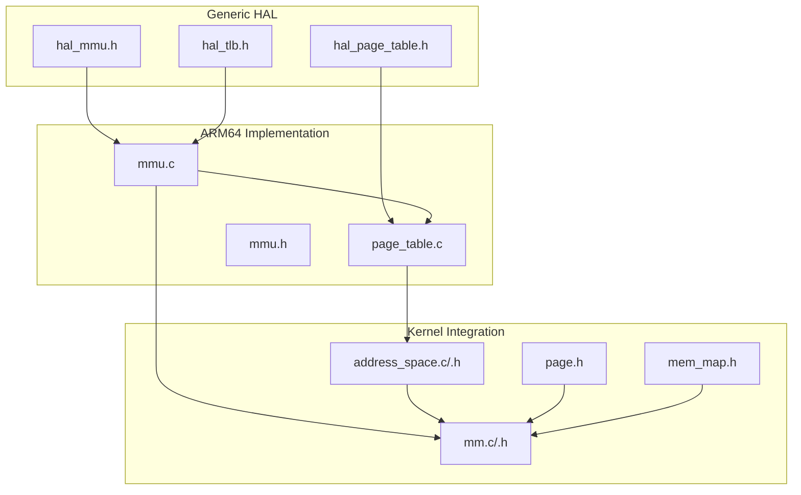
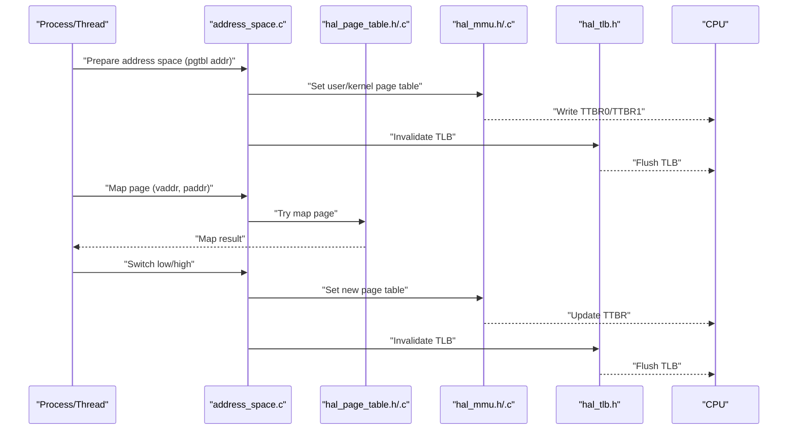
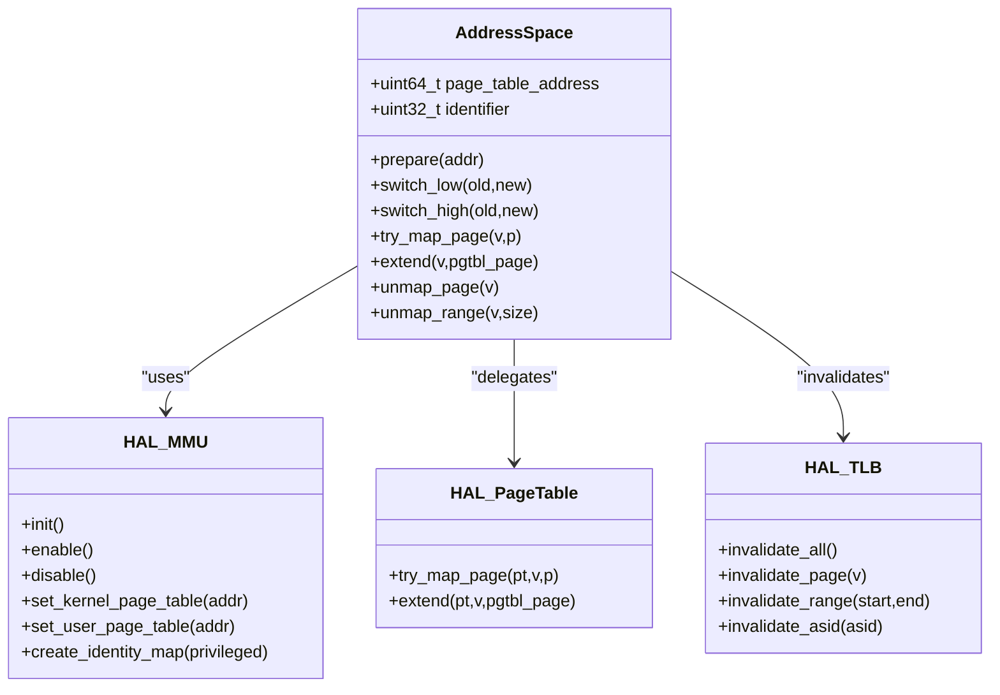
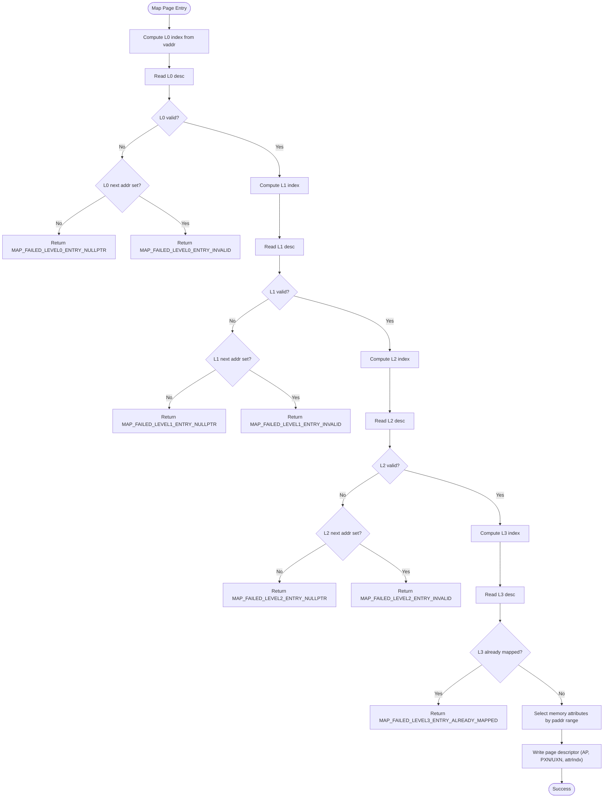
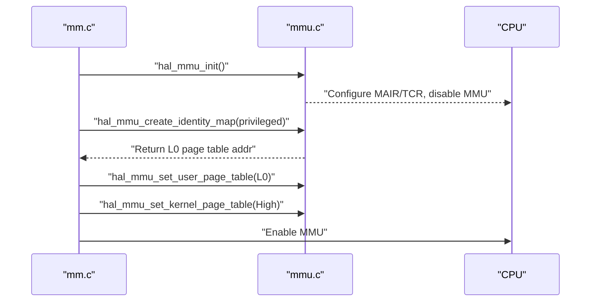
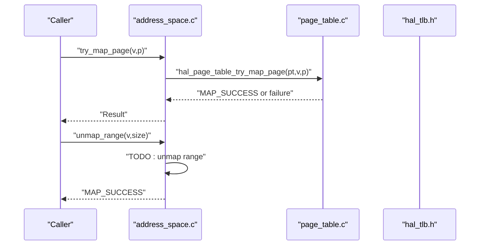
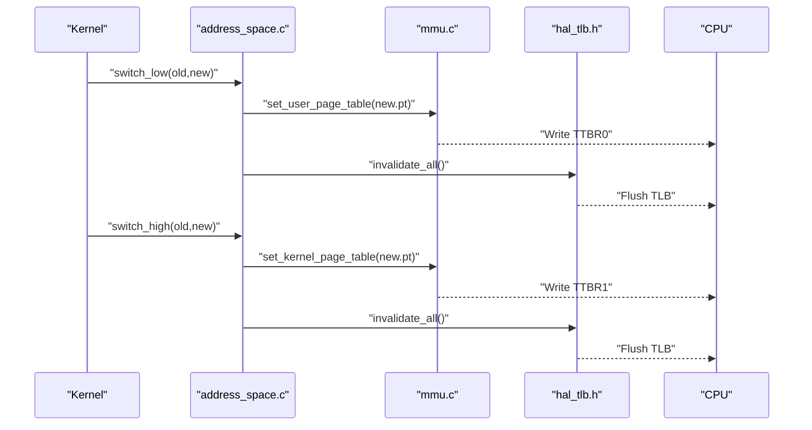
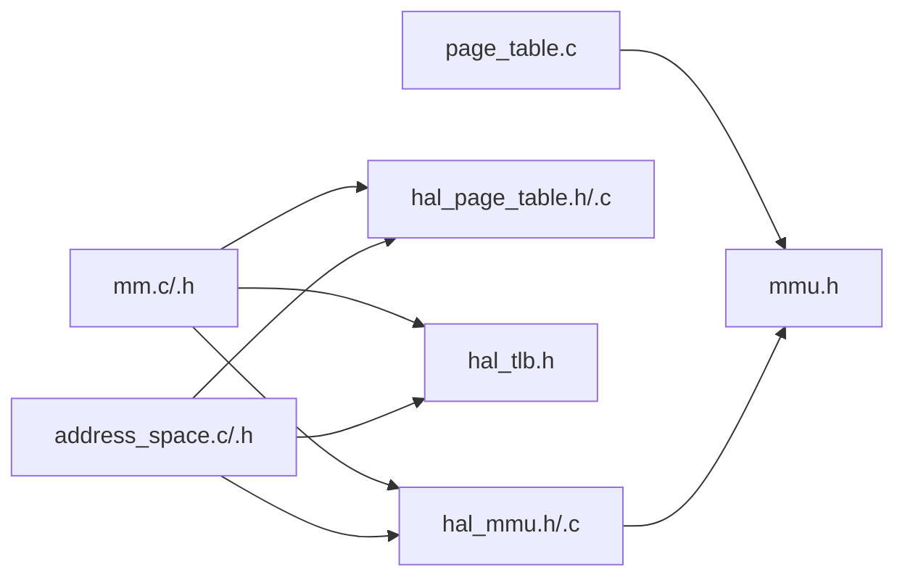

# Address Space Management

<cite>
**Referenced Files in This Document**
- [address_space.h](file://kernel/include/mm/address_space.h)
- [address_space.c](file://kernel/mm/address_space.c)
- [page_table.c](file://kernel/arch/arm64/page_table.c)
- [mmu.c](file://kernel/arch/arm64/mmu.c)
- [hal_mmu.h](file://kernel/include/arch/generic/hal_mmu.h)
- [hal_page_table.h](file://kernel/include/arch/generic/hal_page_table.h)
- [hal_tlb.h](file://kernel/include/arch/generic/hal_tlb.h)
- [mm.h](file://kernel/include/mm/mm.h)
- [mm.c](file://kernel/mm/mm.c)
- [mmu.h](file://kernel/include/arch/arm64/mmu.h)
- [page.h](file://kernel/include/mm/page.h)
- [mem_map.h](file://kernel/include/mm/mem_map.h)
</cite>

## Table of Contents
1. [Introduction](#introduction)
2. [Project Structure](#project-structure)
3. [Core Components](#core-components)
4. [Architecture Overview](#architecture-overview)
5. [Detailed Component Analysis](#detailed-component-analysis)
6. [Dependency Analysis](#dependency-analysis)
7. [Performance Considerations](#performance-considerations)
8. [Troubleshooting Guide](#troubleshooting-guide)
9. [Conclusion](#conclusion)

## Introduction
This document explains address space management in TranquilOS, focusing on virtual memory management, page table operations, and memory mapping for processes and threads. It covers address space creation, switching, mapping/unmapping, and memory protection via ARMv8-A page table descriptors. It also documents privilege levels, memory isolation between address spaces, and the current state of page fault handling and memory deallocation.

## Project Structure
The address space subsystem spans generic HAL abstractions and ARM64-specific implementations:
- Generic HAL interfaces define MMU initialization, TLB operations, and page table manipulation.
- ARM64 architecture files implement page table walking, mapping, and identity mapping.
- Kernel memory manager integrates HAL APIs to set up per-CPU page tables and enable translation.

**Diagram sources**
- [hal_mmu.h](file://kernel/include/arch/generic/hal_mmu.h#L1-L28)
- [hal_page_table.h](file://kernel/include/arch/generic/hal_page_table.h#L1-L12)
- [hal_tlb.h](file://kernel/include/arch/generic/hal_tlb.h#L1-L15)
- [mmu.c](file://kernel/arch/arm64/mmu.c#L1-L231)
- [page_table.c](file://kernel/arch/arm64/page_table.c#L1-L167)
- [mmu.h](file://kernel/include/arch/arm64/mmu.h#L1-L168)
- [address_space.c](file://kernel/mm/address_space.c#L1-L105)
- [address_space.h](file://kernel/include/mm/address_space.h#L1-L43)
- [mm.c](file://kernel/mm/mm.c#L1-L45)
- [mm.h](file://kernel/include/mm/mm.h)
- [page.h](file://kernel/include/mm/page.h#L1-L31)
- [mem_map.h](file://kernel/include/mm/mem_map.h#L1-L29)

**Section sources**
- [address_space.h](file://kernel/include/mm/address_space.h#L1-L43)
- [address_space.c](file://kernel/mm/address_space.c#L1-L105)
- [page_table.c](file://kernel/arch/arm64/page_table.c#L1-L167)
- [mmu.c](file://kernel/arch/arm64/mmu.c#L1-L231)
- [hal_mmu.h](file://kernel/include/arch/generic/hal_mmu.h#L1-L28)
- [hal_page_table.h](file://kernel/include/arch/generic/hal_page_table.h#L1-L12)
- [hal_tlb.h](file://kernel/include/arch/generic/hal_tlb.h#L1-L15)
- [mm.c](file://kernel/mm/mm.c#L1-L45)
- [mm.h](file://kernel/include/mm/mm.h)
- [mmu.h](file://kernel/include/arch/arm64/mmu.h#L1-L168)
- [page.h](file://kernel/include/mm/page.h#L1-L31)
- [mem_map.h](file://kernel/include/mm/mem_map.h#L1-L29)

## Core Components
- Address space abstraction: Holds a page table base address and an identifier, with helpers to switch and prepare page tables.
- HAL MMU: Initializes, enables/disables MMU, sets TTBR0/TTBR1, and creates identity maps.
- HAL Page Table: Implements mapping/unmapping and table extension for 4-level ARMv8 page tables.
- TLB HAL: Invalidates TLB entries after switching page tables.
- Memory manager integration: Sets up per-CPU user/kernel page tables and toggles translation.

Key responsibilities:
- Virtual memory setup and teardown
- Page table creation and extension
- Mapping pages and blocks
- Privilege-aware memory attributes
- TLB synchronization during switches

**Section sources**
- [address_space.h](file://kernel/include/mm/address_space.h#L19-L42)
- [address_space.c](file://kernel/mm/address_space.c#L9-L49)
- [hal_mmu.h](file://kernel/include/arch/generic/hal_mmu.h#L14-L27)
- [hal_page_table.h](file://kernel/include/arch/generic/hal_page_table.h#L8-L11)
- [hal_tlb.h](file://kernel/include/arch/generic/hal_tlb.h#L7-L14)
- [mmu.c](file://kernel/arch/arm64/mmu.c#L62-L126)
- [mm.c](file://kernel/mm/mm.c#L37-L45)

## Architecture Overview
The address space architecture separates concerns between generic HAL interfaces and ARM64-specific implementations. The kernel’s memory manager configures translation and selects page tables for user and kernel modes. Address space routines encapsulate mapping/unmapping and switching while delegating to HAL for hardware control.

**Diagram sources**
- [address_space.c](file://kernel/mm/address_space.c#L9-L49)
- [page_table.c](file://kernel/arch/arm64/page_table.c#L9-L94)
- [mmu.c](file://kernel/arch/arm64/mmu.c#L153-L159)
- [hal_tlb.h](file://kernel/include/arch/generic/hal_tlb.h#L7-L14)
- [hal_mmu.h](file://kernel/include/arch/generic/hal_mmu.h#L22-L24)

## Detailed Component Analysis

### Address Space Abstraction
The address space structure holds the base physical address of a page table and an identifier. It provides:
- Preparation: initializes the page table memory to zero.
- Switching: sets either user or kernel page table and invalidates TLB.
- Mapping: tries to map a single page; extends page table hierarchy when needed.

**Diagram sources**
- [address_space.h](file://kernel/include/mm/address_space.h#L19-L42)
- [address_space.c](file://kernel/mm/address_space.c#L51-L81)
- [hal_mmu.h](file://kernel/include/arch/generic/hal_mmu.h#L14-L27)
- [hal_page_table.h](file://kernel/include/arch/generic/hal_page_table.h#L8-L11)
- [hal_tlb.h](file://kernel/include/arch/generic/hal_tlb.h#L7-L14)

**Section sources**
- [address_space.h](file://kernel/include/mm/address_space.h#L19-L42)
- [address_space.c](file://kernel/mm/address_space.c#L9-L49)
- [address_space.c](file://kernel/mm/address_space.c#L51-L81)

### Page Table Operations (ARM64)
ARM64 page table operations implement a four-level translation scheme:
- Level 0–3 indices computed from virtual address bits.
- Descriptor unions encode block/table/page entries with attributes.
- Mapping sets memory attributes (device vs normal), access permissions (AP), and instruction/data execute-never bits (PXN/UXN).
- Extension allocates new table pages when intermediate entries are invalid.

**Diagram sources**
- [page_table.c](file://kernel/arch/arm64/page_table.c#L9-L94)
- [mmu.h](file://kernel/include/arch/arm64/mmu.h#L93-L114)

**Section sources**
- [page_table.c](file://kernel/arch/arm64/page_table.c#L9-L94)
- [mmu.h](file://kernel/include/arch/arm64/mmu.h#L69-L114)

### Memory Protection and Privilege Levels
Protection is encoded in page table descriptors:
- Access Permissions (AP): control EL0 read/write access.
- Privileged Execute-Never (PXN) and User Execute-Never (UXN): restrict instruction fetch by privilege level.
- Memory Attributes (attrIndx): choose device or normal memory policies.
- Shareability and Non-Global bits influence cache coherency and TLB behavior.

Identity mapping demonstrates privilege-aware configuration:
- Privileged mode disables UXN, enables PXN, and sets AP for kernel-only access.
- Unprivileged mode disables PXN, enables UXN, and sets AP for user access.

**Section sources**
- [page_table.c](file://kernel/arch/arm64/page_table.c#L84-L91)
- [mmu.c](file://kernel/arch/arm64/mmu.c#L176-L201)
- [mmu.c](file://kernel/arch/arm64/mmu.c#L203-L221)
- [mmu.h](file://kernel/include/arch/arm64/mmu.h#L93-L114)

### Address Space Creation and Setup
Creation and setup involve:
- Allocating and zeroing page table memory.
- Building identity mappings for privileged/unprivileged contexts.
- Writing TTBR0/TTBR1 and enabling translation.

**Diagram sources**
- [mm.c](file://kernel/mm/mm.c#L29-L45)
- [mmu.c](file://kernel/arch/arm64/mmu.c#L62-L126)
- [mmu.c](file://kernel/arch/arm64/mmu.c#L161-L222)

**Section sources**
- [mm.c](file://kernel/mm/mm.c#L29-L45)
- [mmu.c](file://kernel/arch/arm64/mmu.c#L62-L126)
- [mmu.c](file://kernel/arch/arm64/mmu.c#L161-L222)

### Memory Mapping and Unmapping
- Single-page mapping: validates and extends the four-level hierarchy as needed, then writes a page descriptor with appropriate attributes and permissions.
- Range unmapping: currently a placeholder with a success return; future work should iterate over affected entries and invalidate TLB ranges.

**Diagram sources**
- [address_space.c](file://kernel/mm/address_space.c#L59-L93)
- [page_table.c](file://kernel/arch/arm64/page_table.c#L9-L94)
- [hal_tlb.h](file://kernel/include/arch/generic/hal_tlb.h#L7-L14)

**Section sources**
- [address_space.c](file://kernel/mm/address_space.c#L59-L93)
- [page_table.c](file://kernel/arch/arm64/page_table.c#L9-L94)

### Address Space Switching and Isolation
Switching between address spaces updates TTBR0/TTBR1 and invalidates the TLB to ensure subsequent memory accesses use the new page table. This provides memory isolation between address spaces because distinct page tables translate the same virtual addresses to different physical addresses.

**Diagram sources**
- [address_space.c](file://kernel/mm/address_space.c#L25-L49)
- [mmu.c](file://kernel/arch/arm64/mmu.c#L153-L159)
- [hal_tlb.h](file://kernel/include/arch/generic/hal_tlb.h#L7-L14)

**Section sources**
- [address_space.c](file://kernel/mm/address_space.c#L25-L49)
- [mmu.c](file://kernel/arch/arm64/mmu.c#L153-L159)

### Page Fault Handling
Page faults are not implemented in the analyzed code. Mapping functions return explicit failure codes when encountering invalid or already-mapped entries, but there is no handler routine invoked on fault. A typical implementation would:
- Install exception handlers for synchronous faults.
- Determine fault type (permission vs not-present).
- Invoke allocation or mapping logic for demand paging.
- Update page table entries and retry access.

[No sources needed since this section describes missing functionality conceptually]

### Memory Allocation and Deallocation Within Address Spaces
- Allocation: Identity mapping and page table extension use the global page allocator to allocate new table pages.
- Deallocation: Unmapping functions are placeholders; proper deallocation should:
  - Walk the page table to locate entries.
  - Clear entries and free backing pages.
  - Invalidate affected TLB entries.

**Section sources**
- [mmu.c](file://kernel/arch/arm64/mmu.c#L165-L171)
- [address_space.c](file://kernel/mm/address_space.c#L83-L105)

## Dependency Analysis
The following diagram shows key dependencies among modules involved in address space management.

**Diagram sources**
- [mm.c](file://kernel/mm/mm.c#L1-L45)
- [address_space.c](file://kernel/mm/address_space.c#L1-L105)
- [page_table.c](file://kernel/arch/arm64/page_table.c#L1-L167)
- [mmu.c](file://kernel/arch/arm64/mmu.c#L1-L231)
- [hal_mmu.h](file://kernel/include/arch/generic/hal_mmu.h#L1-L28)
- [hal_page_table.h](file://kernel/include/arch/generic/hal_page_table.h#L1-L12)
- [hal_tlb.h](file://kernel/include/arch/generic/hal_tlb.h#L1-L15)
- [mmu.h](file://kernel/include/arch/arm64/mmu.h#L1-L168)

**Section sources**
- [mm.c](file://kernel/mm/mm.c#L1-L45)
- [address_space.c](file://kernel/mm/address_space.c#L1-L105)
- [page_table.c](file://kernel/arch/arm64/page_table.c#L1-L167)
- [mmu.c](file://kernel/arch/arm64/mmu.c#L1-L231)
- [hal_mmu.h](file://kernel/include/arch/generic/hal_mmu.h#L1-L28)
- [hal_page_table.h](file://kernel/include/arch/generic/hal_page_table.h#L1-L12)
- [hal_tlb.h](file://kernel/include/arch/generic/hal_tlb.h#L1-L15)
- [mmu.h](file://kernel/include/arch/arm64/mmu.h#L1-L168)

## Performance Considerations
- TLB invalidation occurs on every address space switch; minimize unnecessary switches to reduce overhead.
- Batch unmapping operations (range unmapping) can reduce repeated TLB flushes.
- Using appropriate memory attributes avoids cache coherency penalties for MMIO regions.
- Identity mapping reduces translation overhead for early boot and kernel mappings.

[No sources needed since this section provides general guidance]

## Troubleshooting Guide
Common issues and diagnostics:
- NULL pointer panics: ensure address space and page table addresses are valid before mapping/unmapping.
- Unprepared page table: initialize the page table before attempting mappings.
- Permission failures: verify AP and PXN/UXN bits match intended privilege and execution policy.
- TLB inconsistencies: after changing page tables, always invalidate TLB.

Operational checks:
- Verify translation is enabled before accessing user virtual addresses.
- Confirm TTBR0/TTBR1 reflect the intended page tables after switches.

**Section sources**
- [address_space.c](file://kernel/mm/address_space.c#L9-L23)
- [address_space.c](file://kernel/mm/address_space.c#L51-L57)
- [address_space.c](file://kernel/mm/address_space.c#L83-L105)
- [mm.c](file://kernel/mm/mm.c#L21-L27)
- [mmu.c](file://kernel/arch/arm64/mmu.c#L128-L151)

## Conclusion
TranquilOS implements a modular address space management stack with clear separation between generic HAL interfaces and ARM64-specific logic. It supports privilege-aware mapping, memory protection via page table descriptors, and TLB synchronization during switches. While mapping and unmapping are functional, unimplemented features such as page fault handling and robust range unmapping require further development to complete the address space lifecycle.