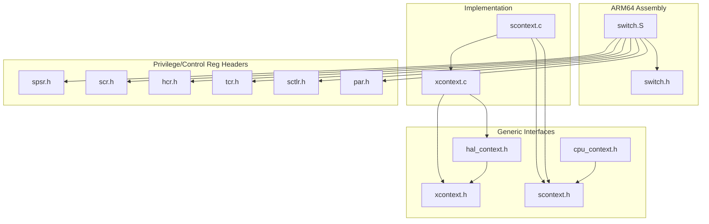
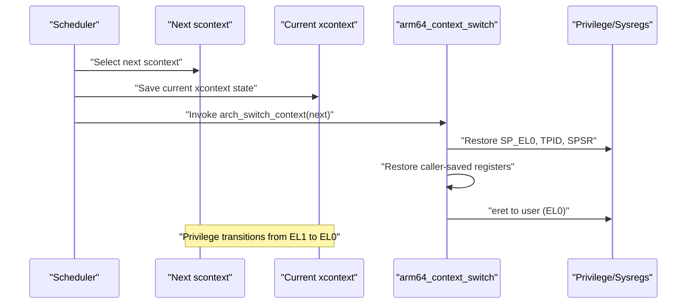
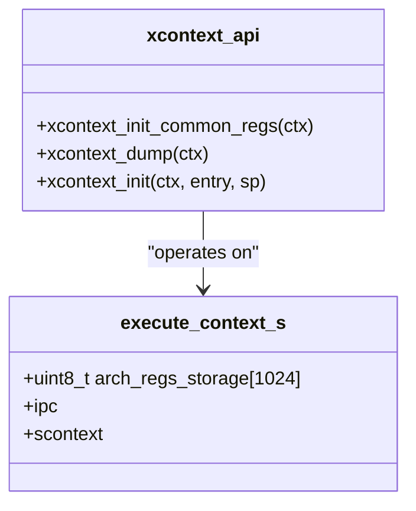
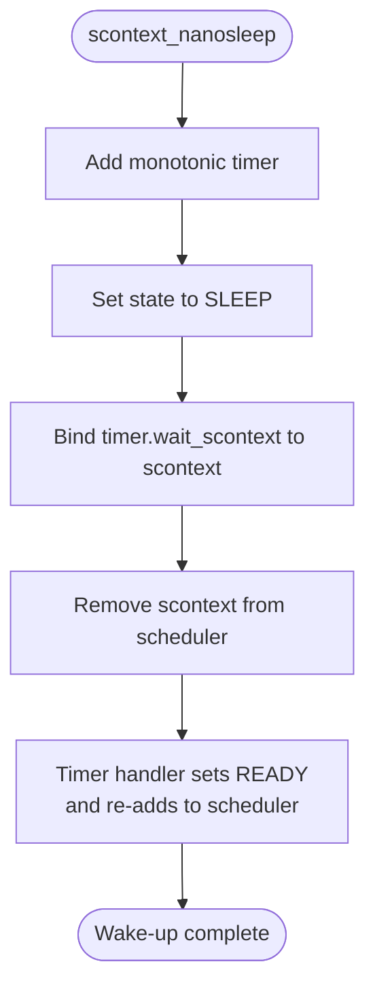
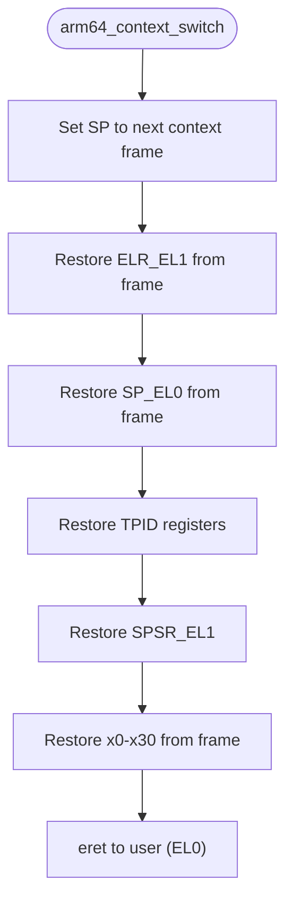
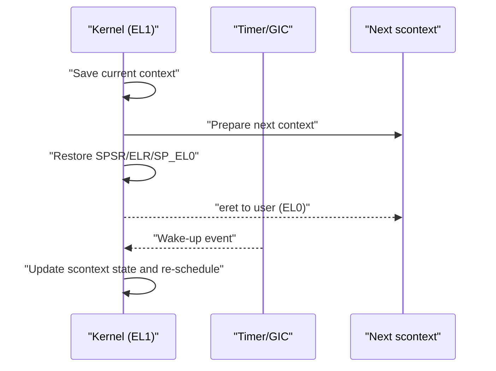
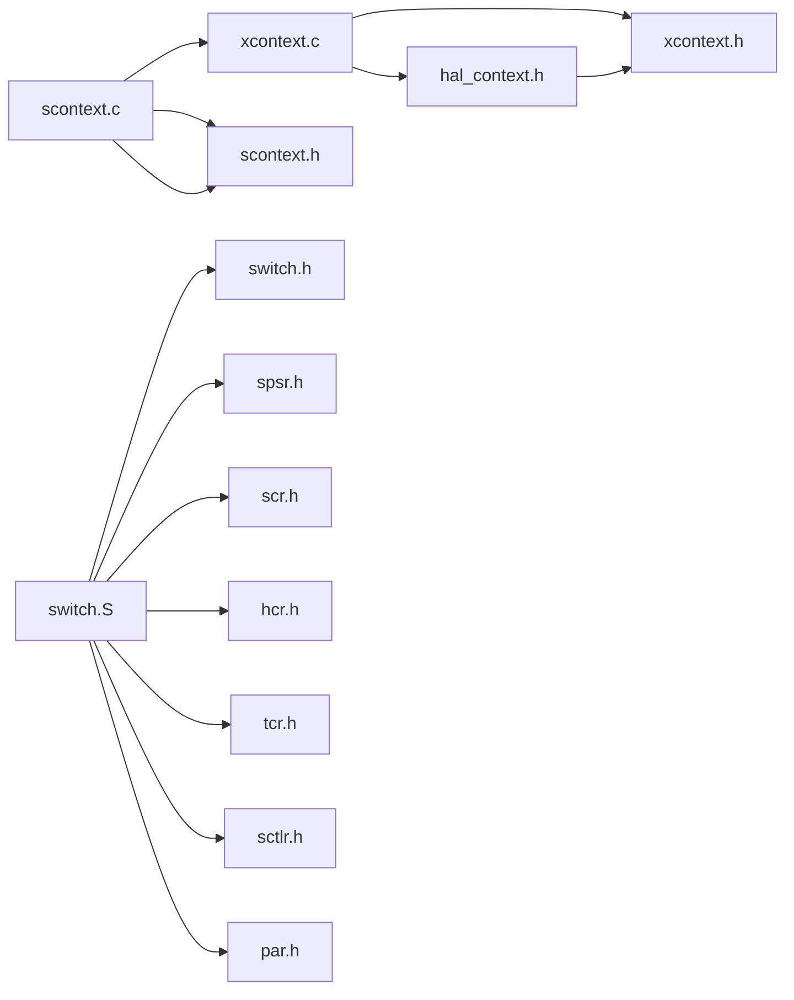

# Context Switching Mechanisms

<cite>
**Referenced Files in This Document**
- [xcontext.c](file://kernel/context/xcontext.c)
- [scontext.c](file://kernel/context/scontext.c)
- [xcontext.h](file://kernel/include/xcontext/xcontext.h)
- [scontext.h](file://kernel/include/scontext/scontext.h)
- [hal_context.h](file://kernel/include/arch/generic/hal_context.h)
- [switch.S](file://kernel/arch/arm64/switch/switch.S)
- [switch.h](file://kernel/include/arch/arm64/switch.h)
- [spsr.h](file://kernel/include/arch/arm64/registers/spsr.h)
- [hcr.h](file://kernel/include/arch/arm64/registers/hcr.h)
- [scr.h](file://kernel/include/arch/arm64/registers/scr.h)
- [tcr.h](file://kernel/include/arch/arm64/registers/tcr.h)
- [sctlr.h](file://kernel/include/arch/arm64/registers/sctlr.h)
- [par.h](file://kernel/include/arch/arm64/registers/par.h)
- [cpu_context.h](file://kernel/include/cpucontext/cpu_context.h)
</cite>

## Table of Contents
1. [Introduction](#introduction)
2. [Project Structure](#project-structure)
3. [Core Components](#core-components)
4. [Architecture Overview](#architecture-overview)
5. [Detailed Component Analysis](#detailed-component-analysis)
6. [Dependency Analysis](#dependency-analysis)
7. [Performance Considerations](#performance-considerations)
8. [Troubleshooting Guide](#troubleshooting-guide)
9. [Conclusion](#conclusion)
10. [Appendices](#appendices)

## Introduction
This document explains the context switching mechanisms in TranquilOS, focusing on transitions among processes, threads, and kernel mode execution. It documents the xcontext and scontext switching procedures, register preservation and state restoration, the assembly-level implementation, privilege level transitions, and interrupt handling during context switches. It also provides performance considerations, overhead analysis, optimization techniques, and practical examples for measuring and analyzing context-switch performance.

## Project Structure
The context switching subsystem spans several layers:
- Generic interfaces define the user-space context (xcontext) and scheduler-managed context (scontext).
- Architecture-specific assembly implements low-level register and privilege restoration.
- HAL bridges generic interfaces to architecture-specific implementations.
- CPU context integrates scheduling decisions with per-CPU state.

**Diagram sources**
- [xcontext.c](file://kernel/context/xcontext.c#L1-L15)
- [scontext.c](file://kernel/context/scontext.c#L1-L68)
- [xcontext.h](file://kernel/include/xcontext/xcontext.h#L1-L24)
- [scontext.h](file://kernel/include/scontext/scontext.h#L1-L50)
- [hal_context.h](file://kernel/include/arch/generic/hal_context.h#L1-L24)
- [switch.S](file://kernel/arch/arm64/switch/switch.S#L1-L37)
- [switch.h](file://kernel/include/arch/arm64/switch.h#L1-L29)
- [spsr.h](file://kernel/include/arch/arm64/registers/spsr.h#L1-L106)
- [scr.h](file://kernel/include/arch/arm64/registers/scr.h#L1-L52)
- [hcr.h](file://kernel/include/arch/arm64/registers/hcr.h#L1-L72)
- [tcr.h](file://kernel/include/arch/arm64/registers/tcr.h#L1-L56)
- [sctlr.h](file://kernel/include/arch/arm64/registers/sctlr.h#L1-L61)
- [par.h](file://kernel/include/arch/arm64/registers/par.h#L1-L21)
- [cpu_context.h](file://kernel/include/cpucontext/cpu_context.h#L1-L22)

**Section sources**
- [xcontext.c](file://kernel/context/xcontext.c#L1-L15)
- [scontext.c](file://kernel/context/scontext.c#L1-L68)
- [xcontext.h](file://kernel/include/xcontext/xcontext.h#L1-L24)
- [scontext.h](file://kernel/include/scontext/scontext.h#L1-L50)
- [hal_context.h](file://kernel/include/arch/generic/hal_context.h#L1-L24)
- [switch.S](file://kernel/arch/arm64/switch/switch.S#L1-L37)
- [switch.h](file://kernel/include/arch/arm64/switch.h#L1-L29)
- [cpu_context.h](file://kernel/include/cpucontext/cpu_context.h#L1-L22)

## Core Components
- xcontext: Represents a user-mode execution context with a dedicated storage area for architecture registers and IPC metadata. It exposes initialization helpers and dumping facilities.
- scontext: Scheduler-managed context that tracks state (ready, running, sleep, blocked, terminated), sleep timers, address space, capability node, and CPU context linkage.
- HAL context: Provides generic APIs to initialize common registers, set up user contexts, dump context state, and switch to user mode.
- ARM64 assembly switch: Implements register restoration, privilege register updates (SP_EL0, TPID registers), SPSR restoration, and return to user via eret.

Key responsibilities:
- xcontext: Initialize and maintain user context state and register layout.
- scontext: Manage lifecycle and scheduling state, integrate with timers and scheduler.
- HAL: Abstract architecture differences for context initialization and switching.
- Assembly: Perform precise register and privilege restoration for seamless EL0/EL1 transitions.

**Section sources**
- [xcontext.h](file://kernel/include/xcontext/xcontext.h#L7-L15)
- [scontext.h](file://kernel/include/scontext/scontext.h#L22-L43)
- [hal_context.h](file://kernel/include/arch/generic/hal_context.h#L8-L23)
- [switch.S](file://kernel/arch/arm64/switch/switch.S#L20-L37)

## Architecture Overview
The context switching pipeline connects user-space contexts (xcontext) with scheduler-managed contexts (scontext) and the architecture’s exception/privilege model.

**Diagram sources**
- [switch.S](file://kernel/arch/arm64/switch/switch.S#L20-L37)
- [switch.h](file://kernel/include/arch/arm64/switch.h#L27-L27)
- [spsr.h](file://kernel/include/arch/arm64/registers/spsr.h#L14-L22)

## Detailed Component Analysis

### xcontext Implementation
xcontext defines the user-space execution context and provides:
- Initialization helpers to prepare common registers and set up a user entry point and stack pointer.
- Dumping facilities for diagnostics.

**Diagram sources**
- [xcontext.h](file://kernel/include/xcontext/xcontext.h#L7-L15)
- [xcontext.c](file://kernel/context/xcontext.c#L4-L15)

**Section sources**
- [xcontext.h](file://kernel/include/xcontext/xcontext.h#L7-L15)
- [xcontext.c](file://kernel/context/xcontext.c#L4-L15)

### scontext Lifecycle and Sleep Handling
scontext manages scheduling state and sleep transitions:
- Initializes an scontext bound to an xcontext, sets up a sleep timer, and marks the scontext ready.
- Nanosleep schedules the scontext to sleep on a monotonic clock and removes it from the scheduler queue until the timer fires.

**Diagram sources**
- [scontext.c](file://kernel/context/scontext.c#L47-L68)
- [scontext.c](file://kernel/context/scontext.c#L9-L30)

**Section sources**
- [scontext.c](file://kernel/context/scontext.c#L32-L45)
- [scontext.c](file://kernel/context/scontext.c#L47-L68)
- [scontext.h](file://kernel/include/scontext/scontext.h#L12-L20)

### Assembly-Level Context Switch (arm64_context_switch)
The assembly routine performs:
- Stack pointer setup for the new context.
- Restoration of exception return address (ELR_EL1), user stack pointer (SP_EL0), and thread pointer registers (TPIDR_EL0, TPIDRRO_EL0).
- SPSR restoration and caller-saved register recovery.
- Return to user mode via eret.

**Diagram sources**
- [switch.S](file://kernel/arch/arm64/switch/switch.S#L20-L37)
- [spsr.h](file://kernel/include/arch/arm64/registers/spsr.h#L14-L22)

**Section sources**
- [switch.S](file://kernel/arch/arm64/switch/switch.S#L20-L37)
- [switch.h](file://kernel/include/arch/arm64/switch.h#L6-L27)

### Privilege Level Transitions and Interrupt Handling
Privilege transitions occur when returning to user mode after saving the current context:
- SPSR_EL1 is restored to control interrupt masks and exception level.
- ELR_EL1 points to the user instruction to resume.
- SP_EL0 is switched to the target user stack.
- Thread pointer registers are restored to maintain per-thread state.

Interrupt handling during context switches:
- The SPSR mask bits govern whether interrupts are enabled/disabled upon eret.
- The GIC and timer subsystems trigger wake-ups and reschedules, which may preempt the next context before it executes.

**Diagram sources**
- [spsr.h](file://kernel/include/arch/arm64/registers/spsr.h#L18-L22)
- [switch.S](file://kernel/arch/arm64/switch/switch.S#L24-L33)

**Section sources**
- [spsr.h](file://kernel/include/arch/arm64/registers/spsr.h#L18-L22)
- [switch.S](file://kernel/arch/arm64/switch/switch.S#L24-L33)

### HAL Context Abstraction
HAL provides generic APIs to:
- Initialize common registers for a context.
- Construct a user context with entry point and stack pointer.
- Dump context state for debugging.
- Switch to user mode safely.

These abstractions decouple architecture-specific details from higher-level code.

**Section sources**
- [hal_context.h](file://kernel/include/arch/generic/hal_context.h#L8-L23)

### CPU Context Integration
Per-CPU scheduling and context binding:
- cpu_context links a scheduler to a specific CPU and exposes callbacks for scheduling in/out.
- scontext holds a pointer to cpu_context for CPU-local scheduling decisions.

**Section sources**
- [cpu_context.h](file://kernel/include/cpucontext/cpu_context.h#L10-L21)
- [scontext.h](file://kernel/include/scontext/scontext.h#L35-L35)

## Dependency Analysis
The following diagram shows how components depend on each other:

**Diagram sources**
- [xcontext.c](file://kernel/context/xcontext.c#L1-L15)
- [scontext.c](file://kernel/context/scontext.c#L1-L68)
- [switch.S](file://kernel/arch/arm64/switch/switch.S#L1-L37)
- [switch.h](file://kernel/include/arch/arm64/switch.h#L1-L29)
- [hal_context.h](file://kernel/include/arch/generic/hal_context.h#L1-L24)
- [xcontext.h](file://kernel/include/xcontext/xcontext.h#L1-L24)
- [scontext.h](file://kernel/include/scontext/scontext.h#L1-L50)
- [spsr.h](file://kernel/include/arch/arm64/registers/spsr.h#L1-L106)
- [scr.h](file://kernel/include/arch/arm64/registers/scr.h#L1-L52)
- [hcr.h](file://kernel/include/arch/arm64/registers/hcr.h#L1-L72)
- [tcr.h](file://kernel/include/arch/arm64/registers/tcr.h#L1-L56)
- [sctlr.h](file://kernel/include/arch/arm64/registers/sctlr.h#L1-L61)
- [par.h](file://kernel/include/arch/arm64/registers/par.h#L1-L21)

**Section sources**
- [xcontext.c](file://kernel/context/xcontext.c#L1-L15)
- [scontext.c](file://kernel/context/scontext.c#L1-L68)
- [switch.S](file://kernel/arch/arm64/switch/switch.S#L1-L37)
- [hal_context.h](file://kernel/include/arch/generic/hal_context.h#L1-L24)

## Performance Considerations
- Register save/restore cost: The assembly routine restores a fixed set of registers from a predefined frame layout. Minimizing unnecessary saves and keeping the frame compact reduces overhead.
- Privilege transition cost: eret is inexpensive but depends on correct SPSR/ELR/SP_EL0 setup. Incorrect values cause faults or mispredictions.
- Timer-based sleep: Using monotonic timers avoids busy-waiting and reduces CPU utilization during sleep periods.
- Interrupt masking: Proper SPSR configuration prevents unwanted preemption immediately after context switch.
- Cache locality: Keeping scontext and xcontext close in memory improves TLB and L1 performance during frequent switches.
- Scheduler efficiency: Removing sleeping scontexts from the scheduler queue reduces scheduling overhead.

[No sources needed since this section provides general guidance]

## Troubleshooting Guide
Common issues and remedies:
- Context stuck in sleep: Verify timer registration and handler invocation. Ensure the scontext state transitions from sleep to ready and is re-added to the scheduler.
- Incorrect privilege return: Confirm SPSR_EL1, ELR_EL1, and SP_EL0 are correctly restored before eret.
- Lost interrupts: Check SPSR DAIF bits to ensure interrupts are enabled/disabled as intended post-switch.
- Per-thread state errors: Validate TPID register restoration for thread-local storage.

**Section sources**
- [scontext.c](file://kernel/context/scontext.c#L9-L30)
- [scontext.c](file://kernel/context/scontext.c#L47-L68)
- [switch.S](file://kernel/arch/arm64/switch/switch.S#L24-L33)
- [spsr.h](file://kernel/include/arch/arm64/registers/spsr.h#L18-L22)

## Conclusion
TranquilOS implements efficient context switching by cleanly separating user-space context management (xcontext), scheduler integration (scontext), and architecture-specific assembly routines. The assembly-level switch restores critical privilege registers and returns to user mode via eret, while HAL and headers encapsulate privilege and control register semantics. Proper timer-driven sleep and careful SPSR configuration ensure predictable and low-overhead transitions between processes, threads, and kernel mode execution.

[No sources needed since this section summarizes without analyzing specific files]

## Appendices

### Example Scenarios and Measurement Approaches
- Process-to-process switch: Measure elapsed time between saving the current xcontext and returning to the next user context. Use monotonic timers to avoid wall-clock adjustments.
- Thread-to-thread switch: Profile within the same process to isolate context switch overhead from address space changes.
- Interrupt-driven wake-up: Record latency from timer expiry to rescheduling and next execution to assess interrupt handling impact.
- Overhead breakdown: Attribute costs to register save/restore, privilege transitions, and scheduler queue operations.

[No sources needed since this section provides general guidance]