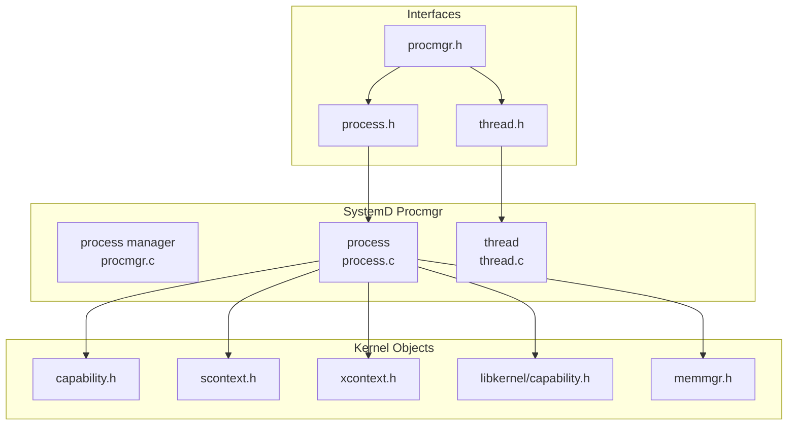
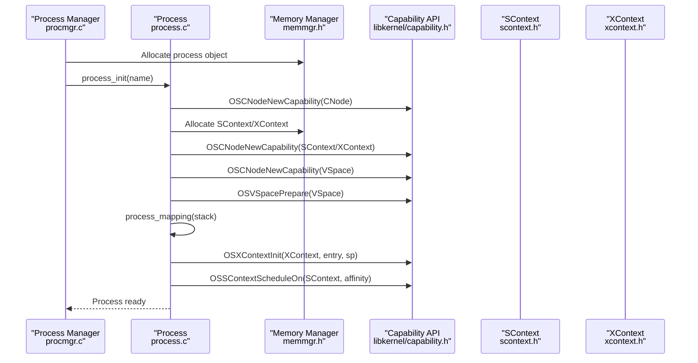
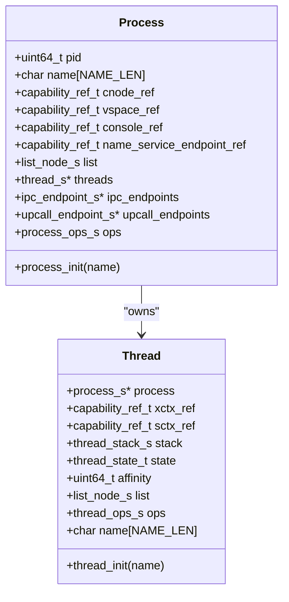
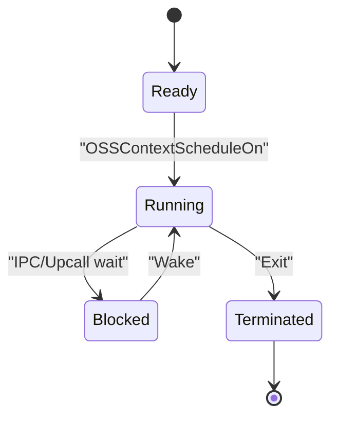
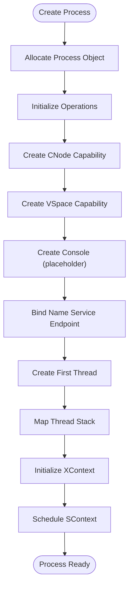
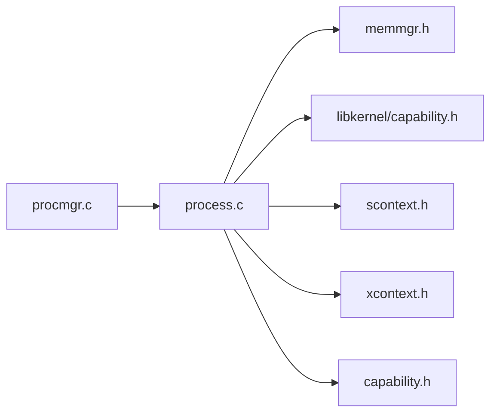

# Process Lifecycle Management

<cite>
**Referenced Files in This Document**
- [process.h](file://kernel/systemd/include/procmgr/process.h)
- [thread.h](file://kernel/systemd/include/procmgr/thread.h)
- [procmgr.h](file://kernel/systemd/include/procmgr/procmgr.h)
- [process.c](file://kernel/systemd/procmgr/process.c)
- [thread.c](file://kernel/systemd/procmgr/thread.c)
- [procmgr.c](file://kernel/systemd/procmgr/procmgr.c)
- [capability.h](file://kernel/include/capability/capability.h)
- [scontext.h](file://kernel/include/scontext/scontext.h)
- [xcontext.h](file://kernel/include/xcontext/xcontext.h)
- [capability.h](file://ulibs/include/libkernel/capability.h)
- [memmgr.h](file://kernel/systemd/include/memmgr/memmgr.h)
</cite>

## Table of Contents
1. [Introduction](#introduction)
2. [Project Structure](#project-structure)
3. [Core Components](#core-components)
4. [Architecture Overview](#architecture-overview)
5. [Detailed Component Analysis](#detailed-component-analysis)
6. [Dependency Analysis](#dependency-analysis)
7. [Performance Considerations](#performance-considerations)
8. [Troubleshooting Guide](#troubleshooting-guide)
9. [Conclusion](#conclusion)
10. [Appendices](#appendices)

## Introduction
This document explains process lifecycle management in TranquilOS, covering the complete phases from creation to termination. It documents the process and thread structures, states, and transitions; the ELF loading mechanism and memory allocation during process creation; capability setup for process isolation; process hierarchy and parent-child relationships; scheduling integration; resource allocation patterns; and error handling during lifecycle events. Practical examples illustrate process creation, execution flow, and proper termination procedures.

## Project Structure
The process lifecycle is implemented in the systemd subsystem under kernel/systemd/procmgr. The core files define process and thread structures, process manager operations, and capability-based object creation and mapping.

**Diagram sources**
- [procmgr.c](file://kernel/systemd/procmgr/procmgr.c#L1-L143)
- [process.c](file://kernel/systemd/procmgr/process.c#L1-L442)
- [thread.c](file://kernel/systemd/procmgr/thread.c#L1-L25)
- [process.h](file://kernel/systemd/include/procmgr/process.h#L1-L98)
- [thread.h](file://kernel/systemd/include/procmgr/thread.h#L1-L48)
- [procmgr.h](file://kernel/systemd/include/procmgr/procmgr.h#L1-L33)
- [capability.h](file://kernel/include/capability/capability.h#L1-L26)
- [scontext.h](file://kernel/include/scontext/scontext.h#L1-L50)
- [xcontext.h](file://kernel/include/xcontext/xcontext.h#L1-L24)
- [capability.h](file://ulibs/include/libkernel/capability.h#L1-L141)
- [memmgr.h](file://kernel/systemd/include/memmgr/memmgr.h#L1-L31)

**Section sources**
- [procmgr.c](file://kernel/systemd/procmgr/procmgr.c#L1-L143)
- [process.c](file://kernel/systemd/procmgr/process.c#L1-L442)
- [thread.c](file://kernel/systemd/procmgr/thread.c#L1-L25)
- [process.h](file://kernel/systemd/include/procmgr/process.h#L1-L98)
- [thread.h](file://kernel/systemd/include/procmgr/thread.h#L1-L48)
- [procmgr.h](file://kernel/systemd/include/procmgr/procmgr.h#L1-L33)
- [capability.h](file://kernel/include/capability/capability.h#L1-L26)
- [scontext.h](file://kernel/include/scontext/scontext.h#L1-L50)
- [xcontext.h](file://kernel/include/xcontext/xcontext.h#L1-L24)
- [capability.h](file://ulibs/include/libkernel/capability.h#L1-L141)
- [memmgr.h](file://kernel/systemd/include/memmgr/memmgr.h#L1-L31)

## Core Components
- Process: Encapsulates a process identity, capabilities, virtual address space, console, IPC endpoints, upcall endpoints, and operation table. See [process.h](file://kernel/systemd/include/procmgr/process.h#L77-L93).
- Thread: Represents a single thread within a process, with stack, state, and capability references. See [thread.h](file://kernel/systemd/include/procmgr/thread.h#L29-L43).
- Process Manager: Manages process lifecycle, PID assignment, and process lists. See [procmgr.h](file://kernel/systemd/include/procmgr/procmgr.h#L22-L26) and [procmgr.c](file://kernel/systemd/procmgr/procmgr.c#L127-L143).
- Capability System: Provides typed kernel objects (XContext, SContext, VSpace, CNode) and capability references for isolation. See [capability.h](file://ulibs/include/libkernel/capability.h#L6-L18) and [capability.h](file://kernel/include/capability/capability.h#L11-L20).
- Execution Contexts: SContext holds scheduling state; XContext holds execution registers and entry/sp. See [scontext.h](file://kernel/include/scontext/scontext.h#L22-L43) and [xcontext.h](file://kernel/include/xcontext/xcontext.h#L7-L15).

Key lifecycle operations:
- Creation: PID assignment, capability node creation, virtual address space creation, console creation, name service endpoint binding, thread creation, and initial mapping. See [process.c](file://kernel/systemd/procmgr/process.c#L419-L442), [process.c](file://kernel/systemd/procmgr/process.c#L296-L325), [process.c](file://kernel/systemd/procmgr/process.c#L257-L294), [process.c](file://kernel/systemd/procmgr/process.c#L327-L330), [process.c](file://kernel/systemd/procmgr/process.c#L332-L354), [process.c](file://kernel/systemd/procmgr/process.c#L19-L82).
- Initialization: Initialize process and thread structures, set operation pointers, and link into manager. See [process.c](file://kernel/systemd/procmgr/process.c#L419-L442), [thread.c](file://kernel/systemd/procmgr/thread.c#L15-L25), [procmgr.c](file://kernel/systemd/procmgr/procmgr.c#L42-L72).
- Execution: Map stacks, initialize XContext, set up SContext, schedule threads. See [process.c](file://kernel/systemd/procmgr/process.c#L150-L174).
- Termination: Mark process terminated and remove from manager. See [procmgr.c](file://kernel/systemd/procmgr/procmgr.c#L103-L125) and [process.c](file://kernel/systemd/procmgr/process.c#L193-L201).
- Cleanup: Iterate threads and endpoints, unmap vspace, free resources. See [process.c](file://kernel/systemd/procmgr/process.c#L203-L255).

**Section sources**
- [process.h](file://kernel/systemd/include/procmgr/process.h#L77-L93)
- [thread.h](file://kernel/systemd/include/procmgr/thread.h#L29-L43)
- [procmgr.h](file://kernel/systemd/include/procmgr/procmgr.h#L22-L26)
- [process.c](file://kernel/systemd/procmgr/process.c#L19-L82)
- [process.c](file://kernel/systemd/procmgr/process.c#L150-L174)
- [process.c](file://kernel/systemd/procmgr/process.c#L193-L201)
- [process.c](file://kernel/systemd/procmgr/process.c#L203-L255)
- [process.c](file://kernel/systemd/procmgr/process.c#L257-L294)
- [process.c](file://kernel/systemd/procmgr/process.c#L296-L325)
- [process.c](file://kernel/systemd/procmgr/process.c#L327-L330)
- [process.c](file://kernel/systemd/procmgr/process.c#L332-L354)
- [process.c](file://kernel/systemd/procmgr/process.c#L419-L442)
- [thread.c](file://kernel/systemd/procmgr/thread.c#L15-L25)
- [procmgr.c](file://kernel/systemd/procmgr/procmgr.c#L42-L72)
- [procmgr.c](file://kernel/systemd/procmgr/procmgr.c#L103-L125)

## Architecture Overview
The process lifecycle integrates capability-based kernel objects, memory management, and scheduling contexts.

**Diagram sources**
- [procmgr.c](file://kernel/systemd/procmgr/procmgr.c#L42-L72)
- [process.c](file://kernel/systemd/procmgr/process.c#L419-L442)
- [process.c](file://kernel/systemd/procmgr/process.c#L19-L82)
- [process.c](file://kernel/systemd/procmgr/process.c#L257-L294)
- [process.c](file://kernel/systemd/procmgr/process.c#L84-L121)
- [process.c](file://kernel/systemd/procmgr/process.c#L150-L174)
- [memmgr.h](file://kernel/systemd/include/memmgr/memmgr.h#L10-L24)
- [capability.h](file://ulibs/include/libkernel/capability.h#L6-L18)
- [scontext.h](file://kernel/include/scontext/scontext.h#L22-L43)
- [xcontext.h](file://kernel/include/xcontext/xcontext.h#L7-L15)

## Detailed Component Analysis

### Process Structure and Operations
- Fields: PID, name, capability references (CNode, VSpace, Console, Name Service Endpoint), linked list node, threads list, IPC endpoints list, Upcall endpoints list, and operation table. See [process.h](file://kernel/systemd/include/procmgr/process.h#L77-L93).
- Operations: create_thread, add_thread, create_console, create_vspace, create_cnode, create_name_service_endpoint, mapping, un_mapping, run, terminate, destroy, add_ipc_endpoint, find_endpoint_by_service_id, set_upcall_endpoint. See [process.h](file://kernel/systemd/include/procmgr/process.h#L60-L75).
- Initialization: Assigns operation pointers and initializes lists. See [process.c](file://kernel/systemd/procmgr/process.c#L419-L442).

**Diagram sources**
- [process.h](file://kernel/systemd/include/procmgr/process.h#L77-L93)
- [thread.h](file://kernel/systemd/include/procmgr/thread.h#L29-L43)

**Section sources**
- [process.h](file://kernel/systemd/include/procmgr/process.h#L77-L93)
- [process.c](file://kernel/systemd/procmgr/process.c#L419-L442)
- [thread.h](file://kernel/systemd/include/procmgr/thread.h#L29-L43)

### Thread States and Transitions
- States: READY, RUNNING, BLOCKED, TERMINATED. See [thread.h](file://kernel/systemd/include/procmgr/thread.h#L12-L17).
- Execution: Threads are scheduled via SContext and XContext after mapping stacks and initializing execution contexts. See [process.c](file://kernel/systemd/procmgr/process.c#L150-L174).

**Diagram sources**
- [thread.h](file://kernel/systemd/include/procmgr/thread.h#L12-L17)
- [process.c](file://kernel/systemd/procmgr/process.c#L150-L174)

**Section sources**
- [thread.h](file://kernel/systemd/include/procmgr/thread.h#L12-L17)
- [process.c](file://kernel/systemd/procmgr/process.c#L150-L174)

### Process Creation Flow
- PID assignment and process allocation: See [procmgr.c](file://kernel/systemd/procmgr/procmgr.c#L42-L72).
- Capability node creation: See [process.c](file://kernel/systemd/procmgr/process.c#L296-L325).
- Virtual address space creation: See [process.c](file://kernel/systemd/procmgr/process.c#L257-L294).
- Console creation: Placeholder; see [process.c](file://kernel/systemd/procmgr/process.c#L327-L330).
- Name service endpoint binding: See [process.c](file://kernel/systemd/procmgr/process.c#L332-L354).
- Thread creation and capability setup: See [process.c](file://kernel/systemd/procmgr/process.c#L19-L82).
- Initial mapping and scheduling: See [process.c](file://kernel/systemd/procmgr/process.c#L84-L121) and [process.c](file://kernel/systemd/procmgr/process.c#L150-L174).

**Diagram sources**
- [procmgr.c](file://kernel/systemd/procmgr/procmgr.c#L42-L72)
- [process.c](file://kernel/systemd/procmgr/process.c#L19-L82)
- [process.c](file://kernel/systemd/procmgr/process.c#L257-L294)
- [process.c](file://kernel/systemd/procmgr/process.c#L296-L325)
- [process.c](file://kernel/systemd/procmgr/process.c#L327-L330)
- [process.c](file://kernel/systemd/procmgr/process.c#L332-L354)
- [process.c](file://kernel/systemd/procmgr/process.c#L84-L121)
- [process.c](file://kernel/systemd/procmgr/process.c#L150-L174)

**Section sources**
- [procmgr.c](file://kernel/systemd/procmgr/procmgr.c#L42-L72)
- [process.c](file://kernel/systemd/procmgr/process.c#L19-L82)
- [process.c](file://kernel/systemd/procmgr/process.c#L257-L294)
- [process.c](file://kernel/systemd/procmgr/process.c#L296-L325)
- [process.c](file://kernel/systemd/procmgr/process.c#L327-L330)
- [process.c](file://kernel/systemd/procmgr/process.c#L332-L354)
- [process.c](file://kernel/systemd/procmgr/process.c#L84-L121)
- [process.c](file://kernel/systemd/procmgr/process.c#L150-L174)

### Memory Allocation During Process Creation
- Kernel object allocation: Two-page aligned allocations for SContext/XContext via memory manager. See [process.c](file://kernel/systemd/procmgr/process.c#L9-L17).
- Thread allocation: One-page aligned allocation for thread structure. See [process.c](file://kernel/systemd/procmgr/process.c#L31).
- Stack allocation: One-page aligned allocation for thread stack. See [process.c](file://kernel/systemd/procmgr/process.c#L51).
- Page table extension: When mapping fails, new page tables are allocated and extended into VSpace. See [process.c](file://kernel/systemd/procmgr/process.c#L103-L113).

**Section sources**
- [process.c](file://kernel/systemd/procmgr/process.c#L9-L17)
- [process.c](file://kernel/systemd/procmgr/process.c#L31)
- [process.c](file://kernel/systemd/procmgr/process.c#L51)
- [process.c](file://kernel/systemd/procmgr/process.c#L103-L113)

### Capability Setup for Process Isolation
- Capability node creation and preparation: See [process.c](file://kernel/systemd/procmgr/process.c#L296-L325).
- VSpace creation and preparation: See [process.c](file://kernel/systemd/procmgr/process.c#L257-L294).
- SContext/XContext creation and linking: See [process.c](file://kernel/systemd/procmgr/process.c#L46-L70).
- SContext configuration: Set CNode, XContext, name, PID, and upcall endpoint. See [process.c](file://kernel/systemd/procmgr/process.c#L72-L76) and [process.c](file://kernel/systemd/procmgr/process.c#L385-L417).
- IPC endpoint binding: See [process.c](file://kernel/systemd/procmgr/process.c#L349-L353).

**Section sources**
- [process.c](file://kernel/systemd/procmgr/process.c#L257-L294)
- [process.c](file://kernel/systemd/procmgr/process.c#L296-L325)
- [process.c](file://kernel/systemd/procmgr/process.c#L46-L70)
- [process.c](file://kernel/systemd/procmgr/process.c#L72-L76)
- [process.c](file://kernel/systemd/procmgr/process.c#L349-L353)
- [process.c](file://kernel/systemd/procmgr/process.c#L385-L417)

### Process Hierarchy and Parent-Child Relationships
- Parent-child relationships are not implemented in the current codebase. The process structure supports hierarchical management via lists and managers, but explicit parent-child linkage is not present. See [process.h](file://kernel/systemd/include/procmgr/process.h#L77-L93) and [procmgr.h](file://kernel/systemd/include/procmgr/procmgr.h#L22-L26).
- Current model: Processes are tracked in a singly linked list managed by the process manager. See [procmgr.c](file://kernel/systemd/procmgr/procmgr.c#L65-L69).

**Section sources**
- [process.h](file://kernel/systemd/include/procmgr/process.h#L77-L93)
- [procmgr.h](file://kernel/systemd/include/procmgr/procmgr.h#L22-L26)
- [procmgr.c](file://kernel/systemd/procmgr/procmgr.c#L65-L69)

### Process Scheduling Integration
- Scheduling via SContext: Threads are scheduled using OSSContextScheduleOn after setting VSpace and mapping stacks. See [process.c](file://kernel/systemd/procmgr/process.c#L167-L170).
- Upcall endpoint integration: Upcall endpoints are bound to threads and IPC endpoints for asynchronous notifications. See [process.c](file://kernel/systemd/procmgr/process.c#L385-L417).

**Section sources**
- [process.c](file://kernel/systemd/procmgr/process.c#L167-L170)
- [process.c](file://kernel/systemd/procmgr/process.c#L385-L417)

### Resource Allocation Patterns
- Aligned allocations: Kernel objects and stacks use aligned allocations from the memory manager. See [process.c](file://kernel/systemd/procmgr/process.c#L9-L17), [process.c](file://kernel/systemd/procmgr/process.c#L31), [process.c](file://kernel/systemd/procmgr/process.c#L51).
- VSpace mapping loops: Iterative mapping with automatic page table extension on demand. See [process.c](file://kernel/systemd/procmgr/process.c#L100-L114).

**Section sources**
- [process.c](file://kernel/systemd/procmgr/process.c#L9-L17)
- [process.c](file://kernel/systemd/procmgr/process.c#L31)
- [process.c](file://kernel/systemd/procmgr/process.c#L51)
- [process.c](file://kernel/systemd/procmgr/process.c#L100-L114)

### Error Handling During Lifecycle Events
- Null checks: Early returns on NULL process/thread/capability references. See [process.c](file://kernel/systemd/procmgr/process.c#L20-L23), [process.c](file://kernel/systemd/procmgr/process.c#L151-L154).
- Memory allocation failures: Logging and graceful failure paths. See [process.c](file://kernel/systemd/procmgr/process.c#L11-L14), [process.c](file://kernel/systemd/procmgr/process.c#L33-L36), [process.c](file://kernel/systemd/procmgr/process.c#L52-L55).
- VSpace mapping errors: Extend page tables and log mapping results. See [process.c](file://kernel/systemd/procmgr/process.c#L101-L113), [process.c](file://kernel/systemd/procmgr/process.c#L115-L118).
- Process termination: Exit process via manager and remove from list. See [procmgr.c](file://kernel/systemd/procmgr/procmgr.c#L103-L125).

**Section sources**
- [process.c](file://kernel/systemd/procmgr/process.c#L20-L23)
- [process.c](file://kernel/systemd/procmgr/process.c#L151-L154)
- [process.c](file://kernel/systemd/procmgr/process.c#L11-L14)
- [process.c](file://kernel/systemd/procmgr/process.c#L33-L36)
- [process.c](file://kernel/systemd/procmgr/process.c#L52-L55)
- [process.c](file://kernel/systemd/procmgr/process.c#L101-L113)
- [process.c](file://kernel/systemd/procmgr/process.c#L115-L118)
- [procmgr.c](file://kernel/systemd/procmgr/procmgr.c#L103-L125)

### Practical Examples

#### Example: Process Creation and Execution
- Steps:
  1. Create process via manager: [procmgr.c](file://kernel/systemd/procmgr/procmgr.c#L42-L72)
  2. Initialize process operations: [process.c](file://kernel/systemd/procmgr/process.c#L419-L442)
  3. Create CNode/VSpace and allocate SContext/XContext: [process.c](file://kernel/systemd/procmgr/process.c#L296-L325), [process.c](file://kernel/systemd/procmgr/process.c#L257-L294)
  4. Create thread and map stack: [process.c](file://kernel/systemd/procmgr/process.c#L19-L82)
  5. Initialize XContext and schedule: [process.c](file://kernel/systemd/procmgr/process.c#L150-L174)

**Section sources**
- [procmgr.c](file://kernel/systemd/procmgr/procmgr.c#L42-L72)
- [process.c](file://kernel/systemd/procmgr/process.c#L419-L442)
- [process.c](file://kernel/systemd/procmgr/process.c#L296-L325)
- [process.c](file://kernel/systemd/procmgr/process.c#L257-L294)
- [process.c](file://kernel/systemd/procmgr/process.c#L19-L82)
- [process.c](file://kernel/systemd/procmgr/process.c#L150-L174)

#### Example: Proper Termination Procedure
- Exit process via manager: [procmgr.c](file://kernel/systemd/procmgr/procmgr.c#L103-L125)
- Terminate process and remove from manager list: [procmgr.c](file://kernel/systemd/procmgr/procmgr.c#L113-L124)

**Section sources**
- [procmgr.c](file://kernel/systemd/procmgr/procmgr.c#L103-L125)
- [procmgr.c](file://kernel/systemd/procmgr/procmgr.c#L113-L124)

## Dependency Analysis
- Process depends on:
  - Memory manager for allocations
  - Capability API for object creation and mapping
  - SContext/XContext for scheduling and execution
  - IPC/upcall endpoints for communication and notifications
- Process Manager depends on:
  - Process operations for lifecycle actions
  - Memory manager for allocations

**Diagram sources**
- [procmgr.c](file://kernel/systemd/procmgr/procmgr.c#L1-L143)
- [process.c](file://kernel/systemd/procmgr/process.c#L1-L442)
- [memmgr.h](file://kernel/systemd/include/memmgr/memmgr.h#L1-L31)
- [capability.h](file://ulibs/include/libkernel/capability.h#L1-L141)
- [capability.h](file://kernel/include/capability/capability.h#L1-L26)
- [scontext.h](file://kernel/include/scontext/scontext.h#L1-L50)
- [xcontext.h](file://kernel/include/xcontext/xcontext.h#L1-L24)

**Section sources**
- [procmgr.c](file://kernel/systemd/procmgr/procmgr.c#L1-L143)
- [process.c](file://kernel/systemd/procmgr/process.c#L1-L442)
- [memmgr.h](file://kernel/systemd/include/memmgr/memmgr.h#L1-L31)
- [capability.h](file://ulibs/include/libkernel/capability.h#L1-L141)
- [capability.h](file://kernel/include/capability/capability.h#L1-L26)
- [scontext.h](file://kernel/include/scontext/scontext.h#L1-L50)
- [xcontext.h](file://kernel/include/xcontext/xcontext.h#L1-L24)

## Performance Considerations
- Aligned allocations reduce fragmentation and improve TLB locality. See [process.c](file://kernel/systemd/procmgr/process.c#L9-L17), [process.c](file://kernel/systemd/procmgr/process.c#L31), [process.c](file://kernel/systemd/procmgr/process.c#L51).
- Iterative mapping with page table extension avoids upfront over-allocation but may incur repeated allocations under heavy fragmentation. See [process.c](file://kernel/systemd/procmgr/process.c#L100-L114).
- Scheduling overhead is minimized by direct SContext/XContext setup and single-page stack mapping. See [process.c](file://kernel/systemd/procmgr/process.c#L150-L174).

[No sources needed since this section provides general guidance]

## Troubleshooting Guide
- Process creation fails:
  - Verify memory manager availability and allocations. See [process.c](file://kernel/systemd/procmgr/process.c#L26-L30), [process.c](file://kernel/systemd/procmgr/process.c#L31-L36), [process.c](file://kernel/systemd/procmgr/process.c#L51-L55).
  - Check capability node creation and VSpace preparation. See [process.c](file://kernel/systemd/procmgr/process.c#L276-L282), [process.c](file://kernel/systemd/procmgr/process.c#L290).
- Mapping failures:
  - Ensure page table extension succeeds and mapping loop handles retries. See [process.c](file://kernel/systemd/procmgr/process.c#L101-L113), [process.c](file://kernel/systemd/procmgr/process.c#L115-L118).
- Scheduling issues:
  - Confirm SContext/VSpace/XContext bindings and stack mapping. See [process.c](file://kernel/systemd/procmgr/process.c#L167-L170), [process.c](file://kernel/systemd/procmgr/process.c#L168).

**Section sources**
- [process.c](file://kernel/systemd/procmgr/process.c#L26-L30)
- [process.c](file://kernel/systemd/procmgr/process.c#L31-L36)
- [process.c](file://kernel/systemd/procmgr/process.c#L51-L55)
- [process.c](file://kernel/systemd/procmgr/process.c#L276-L282)
- [process.c](file://kernel/systemd/procmgr/process.c#L290)
- [process.c](file://kernel/systemd/procmgr/process.c#L101-L113)
- [process.c](file://kernel/systemd/procmgr/process.c#L115-L118)
- [process.c](file://kernel/systemd/procmgr/process.c#L167-L170)
- [process.c](file://kernel/systemd/procmgr/process.c#L168)

## Conclusion
TranquilOS implements a capability-based process lifecycle with clear separation of concerns: the process manager orchestrates lifecycle events, the process object encapsulates state and operations, and the capability system enforces isolation through typed kernel objects. While parent-child relationships are not implemented, the framework supports robust process creation, execution, and termination with careful memory and capability management.

[No sources needed since this section summarizes without analyzing specific files]

## Appendices

### Appendix A: ELF Loading Mechanism
- Not implemented in the analyzed files. ELF loading would typically involve parsing headers, allocating and mapping segments into the process VSpace, and initializing entry points. Refer to future extensions for ELF loader integration.

[No sources needed since this section provides general guidance]

### Appendix B: Process States Reference
- Thread states: READY, RUNNING, BLOCKED, TERMINATED. See [thread.h](file://kernel/systemd/include/procmgr/thread.h#L12-L17).
- SContext states: READY, RUNNING, SLEEP, BLOCKED, BLOCKED_IPC, BLOCKED_UPCALL, TERMINATED. See [scontext.h](file://kernel/include/scontext/scontext.h#L12-L20).

**Section sources**
- [thread.h](file://kernel/systemd/include/procmgr/thread.h#L12-L17)
- [scontext.h](file://kernel/include/scontext/scontext.h#L12-L20)