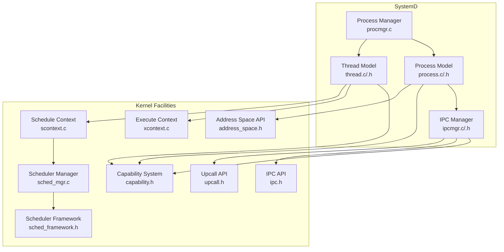
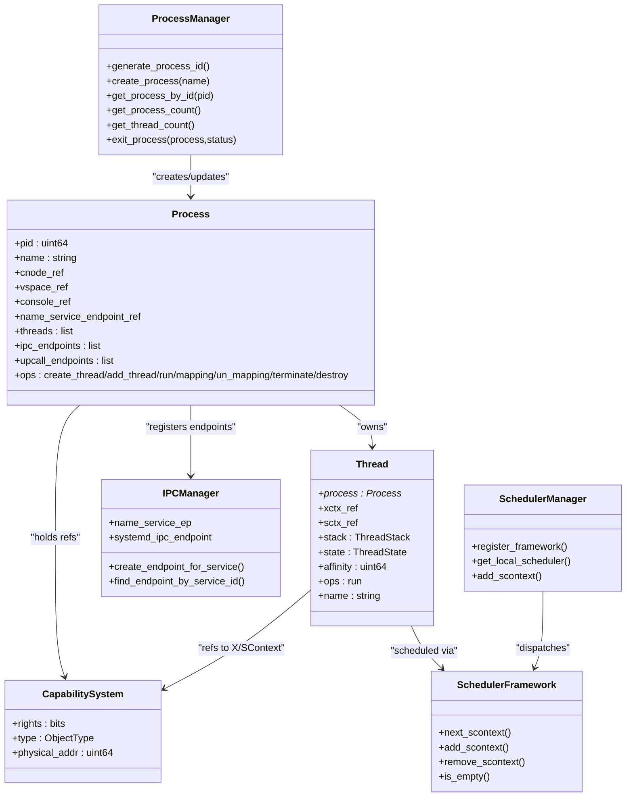
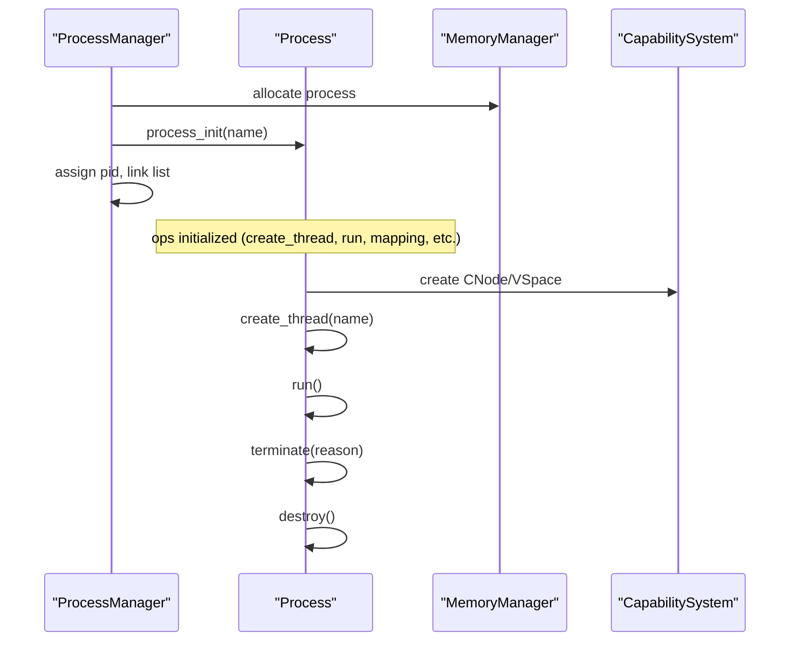
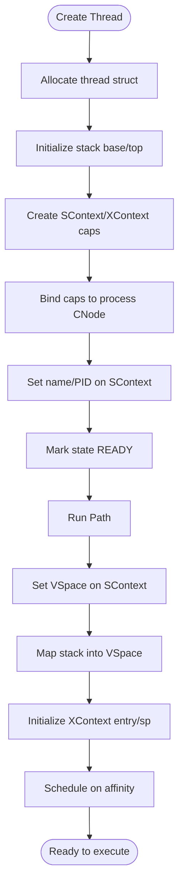
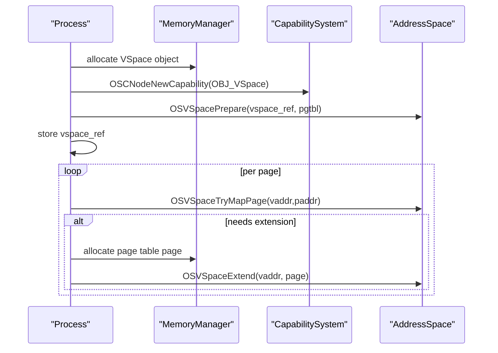
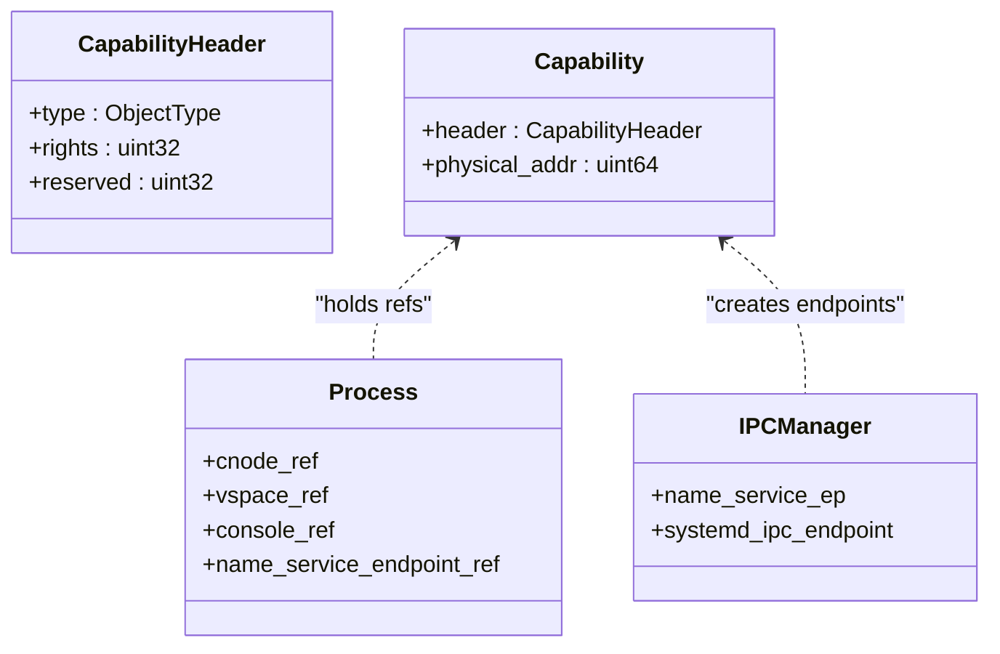
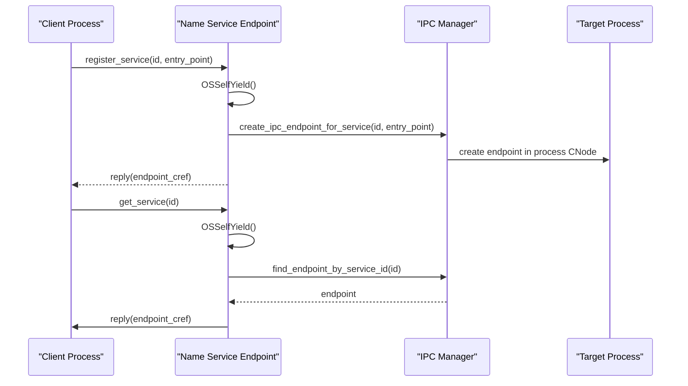
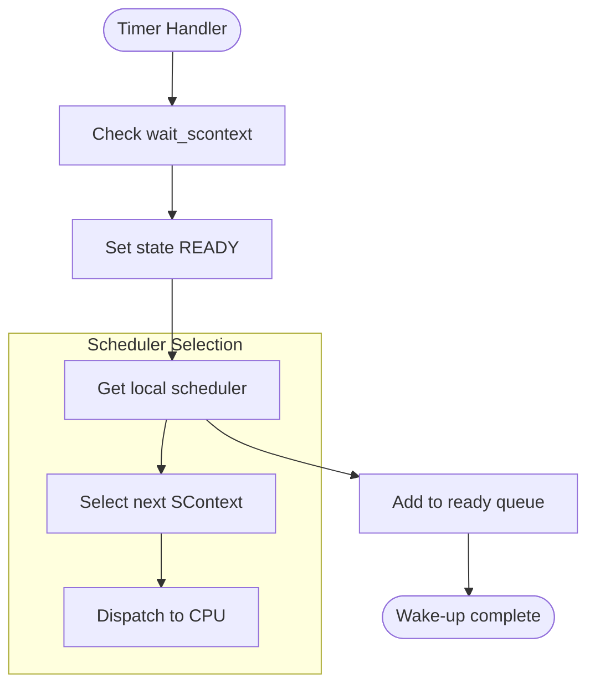
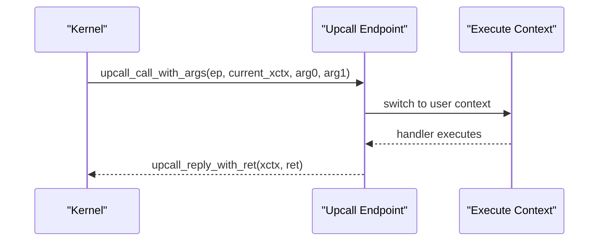
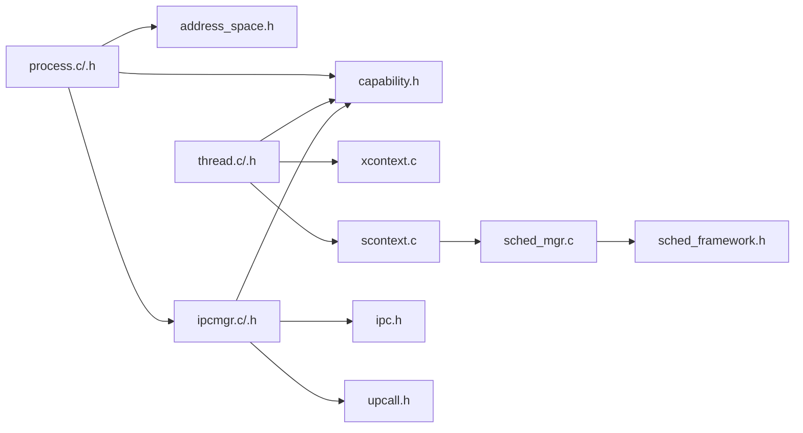

# Process and Thread Management

<cite>
**Referenced Files in This Document**
- [process.h](file://kernel/systemd/include/procmgr/process.h)
- [thread.h](file://kernel/systemd/include/procmgr/thread.h)
- [process.c](file://kernel/systemd/procmgr/process.c)
- [thread.c](file://kernel/systemd/procmgr/thread.c)
- [procmgr.c](file://kernel/systemd/procmgr/procmgr.c)
- [capability.h](file://kernel/include/capability/capability.h)
- [address_space.h](file://kernel/include/mm/address_space.h)
- [scontext.c](file://kernel/context/scontext.c)
- [xcontext.c](file://kernel/context/xcontext.c)
- [sched_framework.h](file://kernel/include/scheduler/sched_framework.h)
- [sched_mgr.c](file://kernel/schedule/sched_mgr.c)
- [upcall.h](file://kernel/include/upcall/upcall.h)
- [ipc.h](file://kernel/include/ipc/ipc.h)
- [ipcmgr.h](file://kernel/systemd/include/ipcmgr/ipcmgr.h)
- [ipcmgr.c](file://kernel/systemd/ipcmgr/ipcmgr.c)
</cite>

## Table of Contents
1. [Introduction](#introduction)
2. [Project Structure](#project-structure)
3. [Core Components](#core-components)
4. [Architecture Overview](#architecture-overview)
5. [Detailed Component Analysis](#detailed-component-analysis)
6. [Dependency Analysis](#dependency-analysis)
7. [Performance Considerations](#performance-considerations)
8. [Troubleshooting Guide](#troubleshooting-guide)
9. [Conclusion](#conclusion)
10. [Appendices](#appendices)

## Introduction
This document explains process and thread management in TranquilOS, focusing on the lifecycle of processes, thread creation and scheduling, context switching, and user-space service management. It also documents the relationship between processes, threads, and virtual address spaces, and covers process creation via capability-managed kernel objects, process termination, and inter-process communication (IPC) setup. The integration with the capability system for isolation and resource management is emphasized throughout.

## Project Structure
The process and thread subsystem resides primarily under the systemd component, with supporting kernel facilities for capabilities, memory management, scheduling, and IPC.

**Diagram sources**
- [procmgr.c](file://kernel/systemd/procmgr/procmgr.c#L1-L143)
- [process.c](file://kernel/systemd/procmgr/process.c#L1-L442)
- [thread.c](file://kernel/systemd/procmgr/thread.c#L1-L25)
- [ipcmgr.c](file://kernel/systemd/ipcmgr/ipcmgr.c#L1-L319)
- [capability.h](file://kernel/include/capability/capability.h#L1-L26)
- [address_space.h](file://kernel/include/mm/address_space.h#L1-L43)
- [scontext.c](file://kernel/context/scontext.c#L1-L68)
- [xcontext.c](file://kernel/context/xcontext.c#L1-L15)
- [sched_framework.h](file://kernel/include/scheduler/sched_framework.h#L1-L20)
- [sched_mgr.c](file://kernel/schedule/sched_mgr.c#L1-L167)
- [upcall.h](file://kernel/include/upcall/upcall.h#L1-L13)
- [ipc.h](file://kernel/include/ipc/ipc.h#L1-L13)

**Section sources**
- [procmgr.c](file://kernel/systemd/procmgr/procmgr.c#L1-L143)
- [process.c](file://kernel/systemd/procmgr/process.c#L1-L442)
- [thread.c](file://kernel/systemd/procmgr/thread.c#L1-L25)
- [ipcmgr.c](file://kernel/systemd/ipcmgr/ipcmgr.c#L1-L319)
- [capability.h](file://kernel/include/capability/capability.h#L1-L26)
- [address_space.h](file://kernel/include/mm/address_space.h#L1-L43)
- [scontext.c](file://kernel/context/scontext.c#L1-L68)
- [xcontext.c](file://kernel/context/xcontext.c#L1-L15)
- [sched_framework.h](file://kernel/include/scheduler/sched_framework.h#L1-L20)
- [sched_mgr.c](file://kernel/schedule/sched_mgr.c#L1-L167)
- [upcall.h](file://kernel/include/upcall/upcall.h#L1-L13)
- [ipc.h](file://kernel/include/ipc/ipc.h#L1-L13)

## Core Components
- Process Manager: Creates and tracks processes, assigns PIDs, and exposes lifecycle operations.
- Process: Encapsulates a process’s capabilities (CNode, VSpace, Console), threads, IPC endpoints, and upcall endpoints. Provides operations for thread creation, address space mapping/unmapping, running, and termination.
- Thread: Represents a thread with a stack, execute context (XContext), schedule context (SContext), and state machine.
- Capability System: Centralized rights-bearing references for kernel objects (VSpace, CNode, XContext, SContext, IPC endpoints).
- Address Space: Abstraction for virtual memory management and page-table operations.
- Scheduler: Manages ready queues and selects the next schedule context to run.
- Upcall and IPC: Mechanisms for user-space service invocation and replies, integrated with process contexts.

**Section sources**
- [process.h](file://kernel/systemd/include/procmgr/process.h#L1-L98)
- [thread.h](file://kernel/systemd/include/procmgr/thread.h#L1-L48)
- [process.c](file://kernel/systemd/procmgr/process.c#L1-L442)
- [thread.c](file://kernel/systemd/procmgr/thread.c#L1-L25)
- [capability.h](file://kernel/include/capability/capability.h#L1-L26)
- [address_space.h](file://kernel/include/mm/address_space.h#L1-L43)
- [sched_framework.h](file://kernel/include/scheduler/sched_framework.h#L1-L20)
- [sched_mgr.c](file://kernel/schedule/sched_mgr.c#L1-L167)
- [upcall.h](file://kernel/include/upcall/upcall.h#L1-L13)
- [ipc.h](file://kernel/include/ipc/ipc.h#L1-L13)

## Architecture Overview
The process and thread architecture integrates capability-based isolation with a modular scheduler and IPC infrastructure.

**Diagram sources**
- [procmgr.c](file://kernel/systemd/procmgr/procmgr.c#L1-L143)
- [process.h](file://kernel/systemd/include/procmgr/process.h#L1-L98)
- [thread.h](file://kernel/systemd/include/procmgr/thread.h#L1-L48)
- [ipcmgr.h](file://kernel/systemd/include/ipcmgr/ipcmgr.h#L1-L15)
- [capability.h](file://kernel/include/capability/capability.h#L1-L26)
- [sched_framework.h](file://kernel/include/scheduler/sched_framework.h#L1-L20)
- [sched_mgr.c](file://kernel/schedule/sched_mgr.c#L1-L167)

## Detailed Component Analysis

### Process Lifecycle and Operations
- Creation: The process manager allocates a process structure, initializes its operations, assigns a PID, and links it into a doubly-linked list.
- Initialization: The process initializer sets operation pointers for thread creation, address space mapping, running, and destruction.
- Running: The process run routine configures each thread’s SContext with its VSpace, maps the thread’s stack into the process VSpace, initializes the XContext, and schedules the thread on its target CPU.
- Termination: The process terminate function logs the reason and returns; cleanup is deferred to destroy.
- Destruction: The process destroy routine iterates threads and endpoints to prepare for teardown; unmapping and freeing are marked for completion.

**Diagram sources**
- [procmgr.c](file://kernel/systemd/procmgr/procmgr.c#L42-L72)
- [process.c](file://kernel/systemd/procmgr/process.c#L419-L442)
- [process.c](file://kernel/systemd/procmgr/process.c#L150-L174)
- [process.c](file://kernel/systemd/procmgr/process.c#L193-L201)
- [process.c](file://kernel/systemd/procmgr/process.c#L203-L255)

**Section sources**
- [procmgr.c](file://kernel/systemd/procmgr/procmgr.c#L1-L143)
- [process.c](file://kernel/systemd/procmgr/process.c#L1-L442)

### Thread Creation and Scheduling
- Thread creation: Allocates a thread structure, initializes stack, creates SContext and XContext capabilities bound to the process CNode, sets SContext fields (name, PID), and marks state as ready.
- Thread scheduling: The process run routine sets VSpace on each SContext, maps the stack, initializes XContext entry and stack pointer, and schedules the thread on its affinity mask.

**Diagram sources**
- [process.c](file://kernel/systemd/procmgr/process.c#L19-L82)
- [process.c](file://kernel/systemd/procmgr/process.c#L150-L174)

**Section sources**
- [process.c](file://kernel/systemd/procmgr/process.c#L19-L82)
- [process.c](file://kernel/systemd/procmgr/process.c#L150-L174)
- [thread.c](file://kernel/systemd/procmgr/thread.c#L1-L25)
- [thread.h](file://kernel/systemd/include/procmgr/thread.h#L1-L48)

### Address Spaces and Memory Mapping
- Virtual address space creation: Allocates a VSpace kernel object, extends the process CNode if needed, prepares the VSpace with a page table, and stores the capability reference.
- Mapping/unmapping: Iterates pages to map or unmap into the process VSpace, extending page tables as necessary.

**Diagram sources**
- [process.c](file://kernel/systemd/procmgr/process.c#L257-L294)
- [process.c](file://kernel/systemd/procmgr/process.c#L84-L148)
- [address_space.h](file://kernel/include/mm/address_space.h#L1-L43)

**Section sources**
- [process.c](file://kernel/systemd/procmgr/process.c#L257-L294)
- [process.c](file://kernel/systemd/procmgr/process.c#L84-L148)
- [address_space.h](file://kernel/include/mm/address_space.h#L1-L43)

### Capability System and Isolation
- Capability header encodes object type and rights, with a physical address field pointing to the kernel object.
- Processes and services create SContext/XContext/CNode/VSpace capabilities and bind them into their own CNode for controlled access.
- IPC endpoints and upcall endpoints are created as capabilities and associated with SContexts to enable secure cross-boundary calls.

**Diagram sources**
- [capability.h](file://kernel/include/capability/capability.h#L1-L26)
- [process.h](file://kernel/systemd/include/procmgr/process.h#L77-L93)
- [ipcmgr.c](file://kernel/systemd/ipcmgr/ipcmgr.c#L22-L87)

**Section sources**
- [capability.h](file://kernel/include/capability/capability.h#L1-L26)
- [process.h](file://kernel/systemd/include/procmgr/process.h#L77-L93)
- [ipcmgr.c](file://kernel/systemd/ipcmgr/ipcmgr.c#L22-L87)

### Inter-Process Communication (IPC) and Name Service
- Name service: A special IPC endpoint allows registering and retrieving service endpoints by ID. It yields control during registration/get operations and returns a capability reference to the caller’s CNode.
- Endpoint creation: For normal services, the manager creates XContext/SContext and stacks, maps the stack into the process VSpace, initializes the endpoint, and stores it in the process.
- Endpoint lookup: The manager traverses processes to find an endpoint by service ID.

**Diagram sources**
- [ipcmgr.c](file://kernel/systemd/ipcmgr/ipcmgr.c#L237-L287)
- [ipcmgr.c](file://kernel/systemd/ipcmgr/ipcmgr.c#L156-L195)
- [ipcmgr.c](file://kernel/systemd/ipcmgr/ipcmgr.c#L197-L235)
- [ipc.h](file://kernel/include/ipc/ipc.h#L1-L13)
- [upcall.h](file://kernel/include/upcall/upcall.h#L1-L13)

**Section sources**
- [ipcmgr.c](file://kernel/systemd/ipcmgr/ipcmgr.c#L1-L319)
- [ipc.h](file://kernel/include/ipc/ipc.h#L1-L13)
- [upcall.h](file://kernel/include/upcall/upcall.h#L1-L13)

### Scheduling and Context Switching
- Schedule context: Each thread’s SContext is initialized with an associated XContext and sleep timer. Sleep transitions SContext to sleeping and removes it from the scheduler.
- Local scheduler: The scheduler manager locates the appropriate local scheduler by CPU affinity and delegates adding/removing/selecting SContexts.
- Priority and selection: The scheduler framework supports pluggable policies; currently, selection prefers non-empty frameworks in order.

**Diagram sources**
- [scontext.c](file://kernel/context/scontext.c#L9-L30)
- [scontext.c](file://kernel/context/scontext.c#L32-L68)
- [sched_mgr.c](file://kernel/schedule/sched_mgr.c#L51-L87)
- [sched_framework.h](file://kernel/include/scheduler/sched_framework.h#L1-L20)

**Section sources**
- [scontext.c](file://kernel/context/scontext.c#L1-L68)
- [sched_mgr.c](file://kernel/schedule/sched_mgr.c#L1-L167)
- [sched_framework.h](file://kernel/include/scheduler/sched_framework.h#L1-L20)

### Upcalls and User-Space Services
- Upcall mechanism: Upcalls allow kernel-to-user transitions with arguments and replies, enabling asynchronous notifications and callbacks.
- Integration with processes: Upcall endpoints are attached to both threads and IPC entry SContexts so that services can receive upcalls.

**Diagram sources**
- [upcall.h](file://kernel/include/upcall/upcall.h#L1-L13)
- [process.c](file://kernel/systemd/procmgr/process.c#L385-L417)

**Section sources**
- [upcall.h](file://kernel/include/upcall/upcall.h#L1-L13)
- [process.c](file://kernel/systemd/procmgr/process.c#L385-L417)

## Dependency Analysis
The following diagram highlights key dependencies among process/thread management, scheduling, IPC, and capabilities.

**Diagram sources**
- [process.c](file://kernel/systemd/procmgr/process.c#L1-L442)
- [thread.c](file://kernel/systemd/procmgr/thread.c#L1-L25)
- [capability.h](file://kernel/include/capability/capability.h#L1-L26)
- [address_space.h](file://kernel/include/mm/address_space.h#L1-L43)
- [ipcmgr.c](file://kernel/systemd/ipcmgr/ipcmgr.c#L1-L319)
- [scontext.c](file://kernel/context/scontext.c#L1-L68)
- [xcontext.c](file://kernel/context/xcontext.c#L1-L15)
- [sched_mgr.c](file://kernel/schedule/sched_mgr.c#L1-L167)
- [sched_framework.h](file://kernel/include/scheduler/sched_framework.h#L1-L20)
- [ipc.h](file://kernel/include/ipc/ipc.h#L1-L13)
- [upcall.h](file://kernel/include/upcall/upcall.h#L1-L13)

**Section sources**
- [process.c](file://kernel/systemd/procmgr/process.c#L1-L442)
- [thread.c](file://kernel/systemd/procmgr/thread.c#L1-L25)
- [capability.h](file://kernel/include/capability/capability.h#L1-L26)
- [address_space.h](file://kernel/include/mm/address_space.h#L1-L43)
- [ipcmgr.c](file://kernel/systemd/ipcmgr/ipcmgr.c#L1-L319)
- [scontext.c](file://kernel/context/scontext.c#L1-L68)
- [xcontext.c](file://kernel/context/xcontext.c#L1-L15)
- [sched_mgr.c](file://kernel/schedule/sched_mgr.c#L1-L167)
- [sched_framework.h](file://kernel/include/scheduler/sched_framework.h#L1-L20)
- [ipc.h](file://kernel/include/ipc/ipc.h#L1-L13)
- [upcall.h](file://kernel/include/upcall/upcall.h#L1-L13)

## Performance Considerations
- Page table extension: Mapping loops extend page tables per page; batching or coalescing mappings could reduce overhead.
- Capability creation: Frequent capability creation and CNode extensions incur allocations; caching or pre-allocation may help.
- Scheduling granularity: The scheduler framework currently checks frameworks sequentially; maintaining priority queues per framework would improve selection speed.
- IPC endpoint lookup: Linear traversal across processes; indexing endpoints by service ID would reduce lookup cost.

[No sources needed since this section provides general guidance]

## Troubleshooting Guide
- Process creation failures:
  - Verify memory manager initialization and availability before allocating kernel objects.
  - Ensure CNode extension succeeds when creating VSpace or other capabilities.
- Mapping errors:
  - Confirm VSpace exists and page table allocation succeeds; inspect return codes for mapping failures.
- Thread scheduling issues:
  - Validate that SContext and XContext are properly bound to the process CNode and VSpace.
  - Check affinity masks and local scheduler registration.
- IPC endpoint problems:
  - Confirm name service is initialized and reachable; verify endpoint creation and capability distribution to callers.
- Termination and cleanup:
  - Ensure pending threads and endpoints are drained before unmapping VSpace.

**Section sources**
- [process.c](file://kernel/systemd/procmgr/process.c#L9-L17)
- [process.c](file://kernel/systemd/procmgr/process.c#L84-L121)
- [process.c](file://kernel/systemd/procmgr/process.c#L150-L174)
- [ipcmgr.c](file://kernel/systemd/ipcmgr/ipcmgr.c#L289-L319)
- [sched_mgr.c](file://kernel/schedule/sched_mgr.c#L131-L147)

## Conclusion
TranquilOS implements a capability-driven process and thread model with explicit separation between address spaces, execution contexts, and scheduling. Processes manage threads, address spaces, and IPC endpoints through capability references, while the scheduler and IPC subsystems integrate tightly with these abstractions. The design emphasizes isolation, modularity, and extensibility, with clear hooks for future enhancements such as priority-aware scheduling and optimized IPC routing.

[No sources needed since this section summarizes without analyzing specific files]

## Appendices

### Example Patterns
- Process creation:
  - Allocate and initialize a process, create its CNode and VSpace, and spawn initial threads.
  - Reference: [procmgr.c](file://kernel/systemd/procmgr/procmgr.c#L42-L72), [process.c](file://kernel/systemd/procmgr/process.c#L296-L325), [process.c](file://kernel/systemd/procmgr/process.c#L257-L294)
- Thread management:
  - Create a thread with stack and contexts, map its stack into VSpace, and schedule it.
  - Reference: [process.c](file://kernel/systemd/procmgr/process.c#L19-L82), [process.c](file://kernel/systemd/procmgr/process.c#L150-L174)
- Process-to-process communication:
  - Register a service via the name service, then retrieve its endpoint and call into it.
  - Reference: [ipcmgr.c](file://kernel/systemd/ipcmgr/ipcmgr.c#L237-L287), [ipcmgr.c](file://kernel/systemd/ipcmgr/ipcmgr.c#L197-L235)