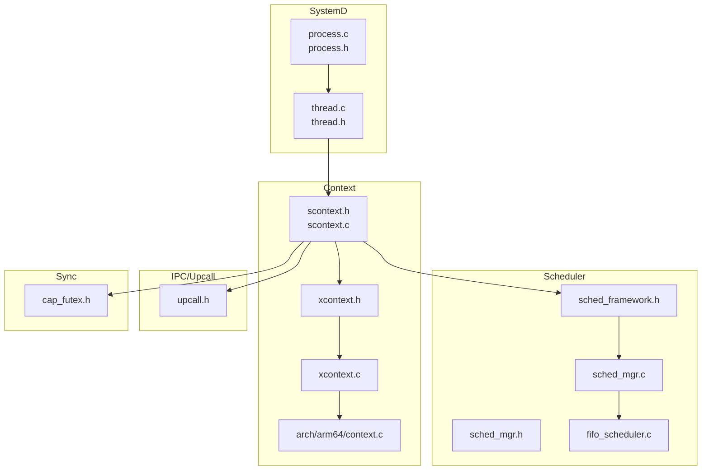
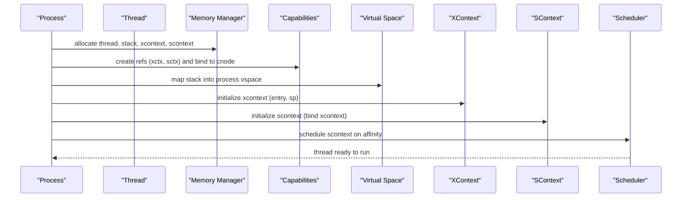
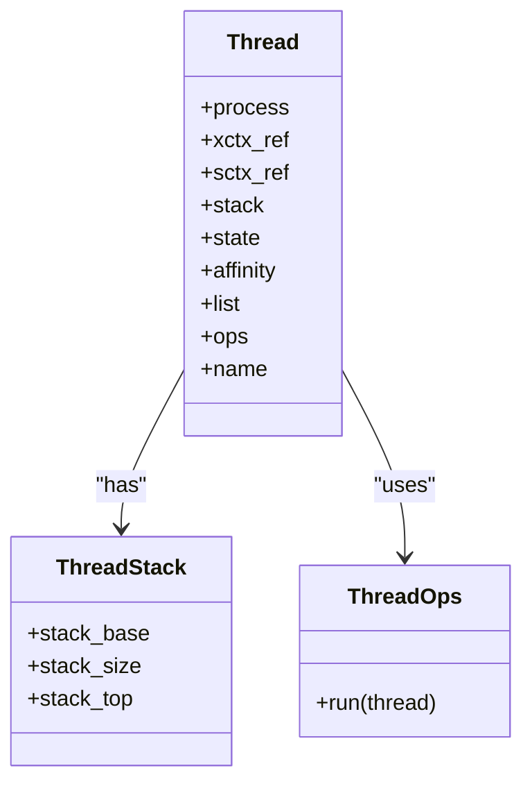
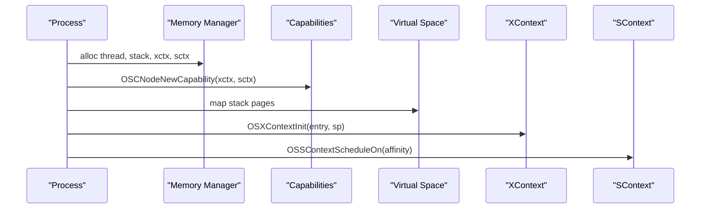
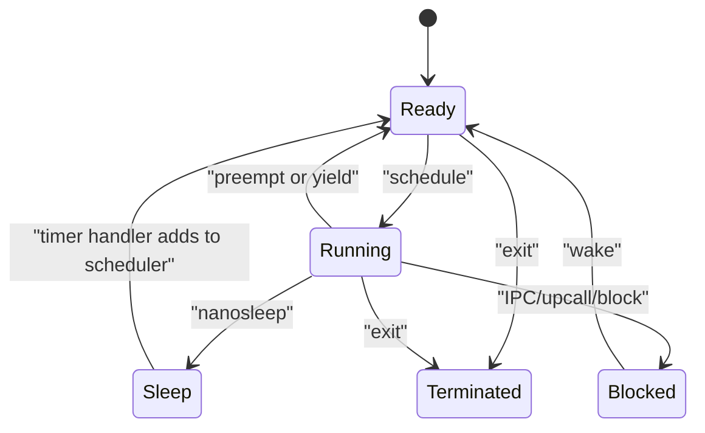
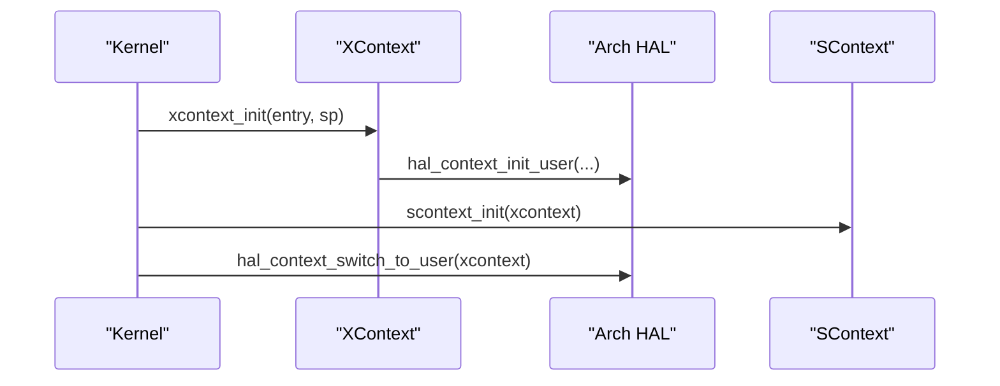
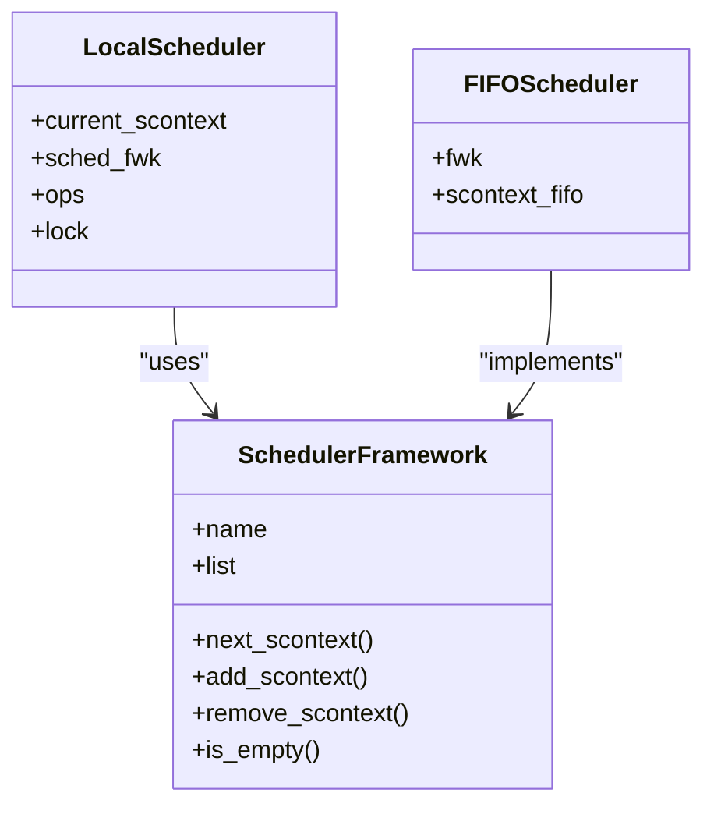
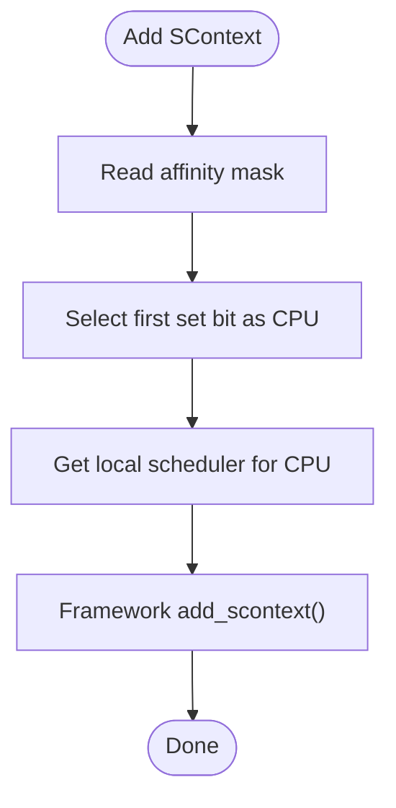
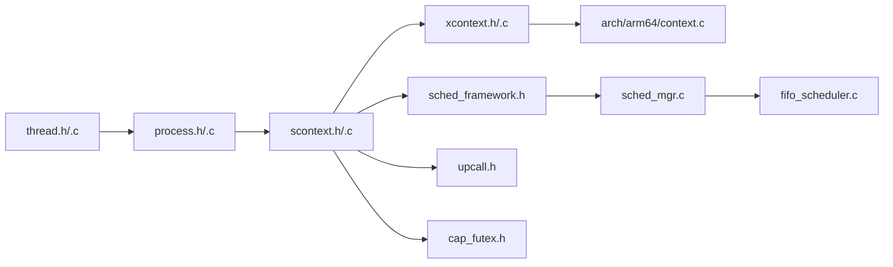

# Thread Management and Scheduling

<cite>
**Referenced Files in This Document**
- [thread.h](file://kernel/systemd/include/procmgr/thread.h)
- [thread.c](file://kernel/systemd/procmgr/thread.c)
- [process.h](file://kernel/systemd/include/procmgr/process.h)
- [process.c](file://kernel/systemd/procmgr/process.c)
- [scontext.h](file://kernel/include/scontext/scontext.h)
- [scontext.c](file://kernel/context/scontext.c)
- [xcontext.h](file://kernel/include/xcontext/xcontext.h)
- [xcontext.c](file://kernel/context/xcontext.c)
- [context.c](file://kernel/arch/arm64/context.c)
- [sched_framework.h](file://kernel/include/scheduler/sched_framework.h)
- [sched_mgr.h](file://kernel/include/scheduler/sched_mgr.h)
- [sched_mgr.c](file://kernel/schedule/sched_mgr.c)
- [fifo_scheduler.c](file://kernel/module/sched/fifo_scheduler.c)
- [cpu_context.h](file://kernel/include/cpucontext/cpu_context.h)
- [upcall.h](file://kernel/include/upcall/upcall.h)
- [cap_futex.h](file://kernel/include/capability/cap_futex.h)
</cite>

## Table of Contents
1. [Introduction](#introduction)
2. [Project Structure](#project-structure)
3. [Core Components](#core-components)
4. [Architecture Overview](#architecture-overview)
5. [Detailed Component Analysis](#detailed-component-analysis)
6. [Dependency Analysis](#dependency-analysis)
7. [Performance Considerations](#performance-considerations)
8. [Troubleshooting Guide](#troubleshooting-guide)
9. [Conclusion](#conclusion)

## Introduction
This document explains thread management and scheduling in TranquilOS. It covers thread creation, thread states, and the thread lifecycle within processes. It documents the relationship between threads and processes, shared resources, and thread-local storage. It also details context switching mechanisms for execute contexts (xcontext) and schedule contexts (scontext), scheduling frameworks and algorithms, priority management, and synchronization primitives. Finally, it provides examples of thread creation, context switching, and thread coordination patterns.

## Project Structure
TranquilOS organizes thread-related functionality across several subsystems:
- SystemD (process and thread management): process and thread definitions and lifecycle
- Scheduler framework and manager: scheduling interfaces and per-CPU local schedulers
- FIFO scheduler module: a concrete scheduling framework implementation
- Context management: xcontext (user-mode execution context) and scontext (scheduler-visible context)
- Upcalls and IPC: inter-thread communication and upcall endpoints
- Futex capability: a synchronization primitive exposed via capabilities

**Diagram sources**
- [process.c](file://kernel/systemd/procmgr/process.c#L1-L442)
- [thread.c](file://kernel/systemd/procmgr/thread.c#L1-L25)
- [scontext.h](file://kernel/include/scontext/scontext.h#L1-L50)
- [scontext.c](file://kernel/context/scontext.c#L1-L68)
- [xcontext.h](file://kernel/include/xcontext/xcontext.h#L1-L24)
- [xcontext.c](file://kernel/context/xcontext.c#L1-L15)
- [context.c](file://kernel/arch/arm64/context.c#L1-L98)
- [sched_framework.h](file://kernel/include/scheduler/sched_framework.h#L1-L20)
- [sched_mgr.h](file://kernel/include/scheduler/sched_mgr.h#L1-L49)
- [sched_mgr.c](file://kernel/schedule/sched_mgr.c#L1-L167)
- [fifo_scheduler.c](file://kernel/module/sched/fifo_scheduler.c#L1-L111)
- [upcall.h](file://kernel/include/upcall/upcall.h#L1-L13)
- [cap_futex.h](file://kernel/include/capability/cap_futex.h#L1-L12)

**Section sources**
- [process.c](file://kernel/systemd/procmgr/process.c#L1-L442)
- [thread.c](file://kernel/systemd/procmgr/thread.c#L1-L25)
- [scontext.h](file://kernel/include/scontext/scontext.h#L1-L50)
- [scontext.c](file://kernel/context/scontext.c#L1-L68)
- [xcontext.h](file://kernel/include/xcontext/xcontext.h#L1-L24)
- [xcontext.c](file://kernel/context/xcontext.c#L1-L15)
- [context.c](file://kernel/arch/arm64/context.c#L1-L98)
- [sched_framework.h](file://kernel/include/scheduler/sched_framework.h#L1-L20)
- [sched_mgr.h](file://kernel/include/scheduler/sched_mgr.h#L1-L49)
- [sched_mgr.c](file://kernel/schedule/sched_mgr.c#L1-L167)
- [fifo_scheduler.c](file://kernel/module/sched/fifo_scheduler.c#L1-L111)
- [upcall.h](file://kernel/include/upcall/upcall.h#L1-L13)
- [cap_futex.h](file://kernel/include/capability/cap_futex.h#L1-L12)

## Core Components
- Thread model: lightweight unit of execution bound to a process, with a dedicated stack and associated xcontext/scontext pair
- Process model: owns address space, capability nodes, and a list of threads; manages thread creation and scheduling registration
- Schedule context (scontext): scheduler-visible abstraction representing a runnable entity with state and sleep timer
- Execute context (xcontext): architecture-specific user-mode register state for a thread
- Scheduler framework and manager: pluggable scheduling interface with per-CPU local schedulers and a FIFO implementation
- Upcalls and IPC: inter-thread communication via endpoints and upcall handlers
- Synchronization: futex capability for blocking and waking

**Section sources**
- [thread.h](file://kernel/systemd/include/procmgr/thread.h#L12-L43)
- [thread.c](file://kernel/systemd/procmgr/thread.c#L5-L25)
- [process.h](file://kernel/systemd/include/procmgr/process.h#L77-L93)
- [process.c](file://kernel/systemd/procmgr/process.c#L19-L82)
- [scontext.h](file://kernel/include/scontext/scontext.h#L22-L43)
- [scontext.c](file://kernel/context/scontext.c#L32-L68)
- [xcontext.h](file://kernel/include/xcontext/xcontext.h#L7-L15)
- [xcontext.c](file://kernel/context/xcontext.c#L4-L15)
- [context.c](file://kernel/arch/arm64/context.c#L7-L33)
- [sched_framework.h](file://kernel/include/scheduler/sched_framework.h#L11-L18)
- [sched_mgr.h](file://kernel/include/scheduler/sched_mgr.h#L23-L43)
- [fifo_scheduler.c](file://kernel/module/sched/fifo_scheduler.c#L13-L109)
- [upcall.h](file://kernel/include/upcall/upcall.h#L9-L12)
- [cap_futex.h](file://kernel/include/capability/cap_futex.h#L10-L12)

## Architecture Overview
The thread lifecycle spans process creation, thread allocation, capability binding, stack mapping, and scheduling registration. At runtime, scontext transitions through READY, RUNNING, SLEEP, BLOCKED, and TERMINATED states. Context switching moves between xcontext and scontext, invoking architecture-specific register initialization and dispatch.

**Diagram sources**
- [process.c](file://kernel/systemd/procmgr/process.c#L19-L82)
- [process.c](file://kernel/systemd/procmgr/process.c#L150-L174)
- [scontext.c](file://kernel/context/scontext.c#L32-L45)
- [xcontext.c](file://kernel/context/xcontext.c#L4-L11)
- [context.c](file://kernel/arch/arm64/context.c#L12-L33)
- [sched_mgr.c](file://kernel/schedule/sched_mgr.c#L131-L147)

## Detailed Component Analysis

### Thread Model and Lifecycle
- Thread definition includes pointers to process, xcontext and scontext capability references, stack layout, state, CPU affinity, and list linkage
- Thread initialization sets name, list head, and assigns a run operation
- Thread run currently logs and prepares to integrate with scheduling via capability calls

**Diagram sources**
- [thread.h](file://kernel/systemd/include/procmgr/thread.h#L29-L43)
- [thread.h](file://kernel/systemd/include/procmgr/thread.h#L19-L21)
- [thread.h](file://kernel/systemd/include/procmgr/thread.h#L23-L27)

**Section sources**
- [thread.h](file://kernel/systemd/include/procmgr/thread.h#L12-L43)
- [thread.c](file://kernel/systemd/procmgr/thread.c#L5-L25)

### Process and Thread Creation
- Process creates threads by allocating memory for thread, stack, xcontext, and scontext
- Creates capability references and binds them to the process cnode
- Maps the thread’s stack into the process virtual space and initializes xcontext
- Schedules scontext on the specified CPU affinity

**Diagram sources**
- [process.c](file://kernel/systemd/procmgr/process.c#L19-L82)
- [process.c](file://kernel/systemd/procmgr/process.c#L150-L174)

**Section sources**
- [process.c](file://kernel/systemd/procmgr/process.c#L19-L82)
- [process.c](file://kernel/systemd/procmgr/process.c#L150-L174)

### Thread States and Transitions
- Thread states: READY, RUNNING, BLOCKED, TERMINATED
- Scontext states: READY, RUNNING, SLEEP, BLOCKED, BLOCKED_IPC, BLOCKED_UPCALL, TERMINATED
- Sleep transitions: scontext_nanosleep transitions to SLEEP and removes itself from the scheduler until timer fires

**Diagram sources**
- [thread.h](file://kernel/systemd/include/procmgr/thread.h#L12-L17)
- [scontext.h](file://kernel/include/scontext/scontext.h#L12-L20)
- [scontext.c](file://kernel/context/scontext.c#L9-L30)

**Section sources**
- [thread.h](file://kernel/systemd/include/procmgr/thread.h#L12-L17)
- [scontext.h](file://kernel/include/scontext/scontext.h#L12-L20)
- [scontext.c](file://kernel/context/scontext.c#L9-L30)

### Context Switching: xcontext and scontext
- xcontext holds architecture-specific user-mode register state and links to the owning scontext
- scontext_init binds xcontext and initializes a sleep timer
- Architecture-specific HAL initializes xcontext registers and performs user-mode context switch

**Diagram sources**
- [xcontext.c](file://kernel/context/xcontext.c#L4-L11)
- [context.c](file://kernel/arch/arm64/context.c#L12-L33)
- [context.c](file://kernel/arch/arm64/context.c#L96-L98)
- [scontext.c](file://kernel/context/scontext.c#L32-L45)

**Section sources**
- [xcontext.h](file://kernel/include/xcontext/xcontext.h#L7-L15)
- [xcontext.c](file://kernel/context/xcontext.c#L4-L15)
- [context.c](file://kernel/arch/arm64/context.c#L12-L33)
- [context.c](file://kernel/arch/arm64/context.c#L96-L98)
- [scontext.c](file://kernel/context/scontext.c#L32-L45)

### Scheduling Framework and FIFO Implementation
- Scheduler framework defines function pointers for adding, removing, and selecting next scontext
- Local scheduler per CPU maintains current scontext, framework pointer, and spinlock
- FIFO scheduler implements a queue-based selection policy and registers with the local scheduler

**Diagram sources**
- [sched_framework.h](file://kernel/include/scheduler/sched_framework.h#L11-L18)
- [sched_mgr.h](file://kernel/include/scheduler/sched_mgr.h#L23-L28)
- [fifo_scheduler.c](file://kernel/module/sched/fifo_scheduler.c#L13-L16)

**Section sources**
- [sched_framework.h](file://kernel/include/scheduler/sched_framework.h#L6-L18)
- [sched_mgr.h](file://kernel/include/scheduler/sched_mgr.h#L8-L28)
- [sched_mgr.c](file://kernel/schedule/sched_mgr.c#L6-L87)
- [fifo_scheduler.c](file://kernel/module/sched/fifo_scheduler.c#L18-L109)

### Priority Management and Affinity
- Affinity bits select the target CPU for scheduling
- Scheduler manager routes scontext to the appropriate local scheduler based on affinity
- Priority is not explicitly modeled in the current FIFO implementation; future schedulers can extend the framework

**Diagram sources**
- [sched_mgr.c](file://kernel/schedule/sched_mgr.c#L131-L147)

**Section sources**
- [sched_mgr.c](file://kernel/schedule/sched_mgr.c#L131-L147)

### Thread Termination Procedures
- Process destruction iterates threads and endpoints to clean up resources
- Thread termination is marked in process teardown; detailed preemption and resource freeing are TODO items
- Scheduling removal and timer cleanup are part of the termination flow

**Section sources**
- [process.c](file://kernel/systemd/procmgr/process.c#L193-L255)
- [scontext.c](file://kernel/context/scontext.c#L9-L30)

### Thread-to-Thread Communication
- Upcalls: scontext can be configured with an upcall endpoint; upcall_call_with_args and upcall_reply_with_ret provide the ABI
- IPC endpoints: processes maintain lists of endpoints; threads can be wired to upcall endpoints during process setup

**Section sources**
- [upcall.h](file://kernel/include/upcall/upcall.h#L9-L12)
- [process.c](file://kernel/systemd/procmgr/process.c#L385-L417)

### Synchronization Primitives
- Futex capability: exposes futex operations through execute context dispatch; supports create and destroy rights
- Futex integrates with xcontext to enable blocking and waking semantics

**Section sources**
- [cap_futex.h](file://kernel/include/capability/cap_futex.h#L10-L12)

### Thread Creation Patterns and Examples
- Pattern 1: Create a process, then create a thread with stack, xcontext, and scontext, map stack, initialize xcontext, and schedule scontext
- Pattern 2: Set upcall endpoints for threads and IPC endpoints for service discovery
- Pattern 3: Use scontext_nanosleep to implement cooperative sleeps and timer-driven wakeups

**Section sources**
- [process.c](file://kernel/systemd/procmgr/process.c#L19-L82)
- [process.c](file://kernel/systemd/procmgr/process.c#L150-L174)
- [scontext.c](file://kernel/context/scontext.c#L47-L68)

## Dependency Analysis
The following diagram shows key dependencies among thread, context, scheduler, and IPC/upcall components.

**Diagram sources**
- [thread.h](file://kernel/systemd/include/procmgr/thread.h#L1-L48)
- [thread.c](file://kernel/systemd/procmgr/thread.c#L1-L25)
- [process.h](file://kernel/systemd/include/procmgr/process.h#L1-L98)
- [process.c](file://kernel/systemd/procmgr/process.c#L1-L442)
- [scontext.h](file://kernel/include/scontext/scontext.h#L1-L50)
- [scontext.c](file://kernel/context/scontext.c#L1-L68)
- [xcontext.h](file://kernel/include/xcontext/xcontext.h#L1-L24)
- [xcontext.c](file://kernel/context/xcontext.c#L1-L15)
- [context.c](file://kernel/arch/arm64/context.c#L1-L98)
- [sched_framework.h](file://kernel/include/scheduler/sched_framework.h#L1-L20)
- [sched_mgr.h](file://kernel/include/scheduler/sched_mgr.h#L1-L49)
- [sched_mgr.c](file://kernel/schedule/sched_mgr.c#L1-L167)
- [fifo_scheduler.c](file://kernel/module/sched/fifo_scheduler.c#L1-L111)
- [upcall.h](file://kernel/include/upcall/upcall.h#L1-L13)
- [cap_futex.h](file://kernel/include/capability/cap_futex.h#L1-L12)

**Section sources**
- [thread.h](file://kernel/systemd/include/procmgr/thread.h#L1-L48)
- [thread.c](file://kernel/systemd/procmgr/thread.c#L1-L25)
- [process.h](file://kernel/systemd/include/procmgr/process.h#L1-L98)
- [process.c](file://kernel/systemd/procmgr/process.c#L1-L442)
- [scontext.h](file://kernel/include/scontext/scontext.h#L1-L50)
- [scontext.c](file://kernel/context/scontext.c#L1-L68)
- [xcontext.h](file://kernel/include/xcontext/xcontext.h#L1-L24)
- [xcontext.c](file://kernel/context/xcontext.c#L1-L15)
- [context.c](file://kernel/arch/arm64/context.c#L1-L98)
- [sched_framework.h](file://kernel/include/scheduler/sched_framework.h#L1-L20)
- [sched_mgr.h](file://kernel/include/scheduler/sched_mgr.h#L1-L49)
- [sched_mgr.c](file://kernel/schedule/sched_mgr.c#L1-L167)
- [fifo_scheduler.c](file://kernel/module/sched/fifo_scheduler.c#L1-L111)
- [upcall.h](file://kernel/include/upcall/upcall.h#L1-L13)
- [cap_futex.h](file://kernel/include/capability/cap_futex.h#L1-L12)

## Performance Considerations
- Per-CPU local schedulers reduce contention and improve cache locality
- Spinlocks protect scheduler operations; keep critical sections minimal
- FIFO scheduling is simple and predictable; consider priority queues or real-time policies for latency-sensitive workloads
- Minimize context switch overhead by reusing xcontext initialization and avoiding unnecessary capability updates

## Troubleshooting Guide
- Thread creation failures: verify memory allocation success and capability creation; ensure vspace and cnode are initialized
- Scheduling errors: confirm scontext is bound to xcontext and registered with the correct local scheduler
- Sleep/wake issues: check timer handler logic and scheduler add/remove operations
- Upcall problems: ensure upcall endpoint references are set on both threads and IPC endpoints

**Section sources**
- [process.c](file://kernel/systemd/procmgr/process.c#L19-L82)
- [process.c](file://kernel/systemd/procmgr/process.c#L150-L174)
- [scontext.c](file://kernel/context/scontext.c#L9-L30)
- [scontext.c](file://kernel/context/scontext.c#L47-L68)
- [sched_mgr.c](file://kernel/schedule/sched_mgr.c#L6-L87)

## Conclusion
TranquilOS implements a clear separation between threads (lightweight units with stacks), scontext (scheduler-visible entities), and xcontext (architecture-specific user-mode state). The scheduler framework enables modular scheduling policies, with a FIFO implementation readily extensible for priority and real-time support. Thread lifecycle management, context switching, and IPC/upcall pathways form a cohesive foundation for building concurrent applications.