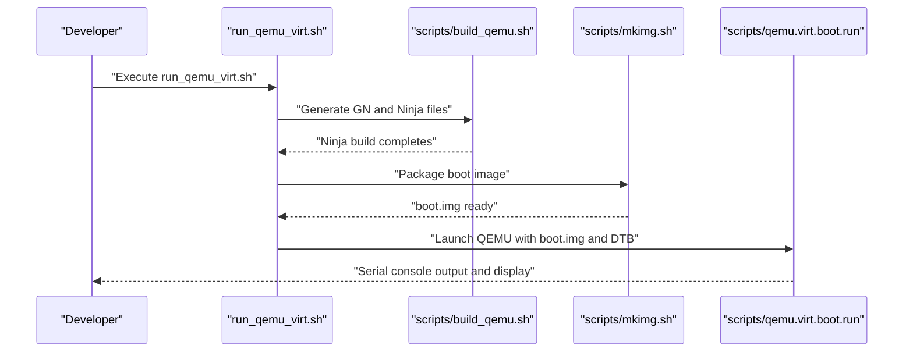
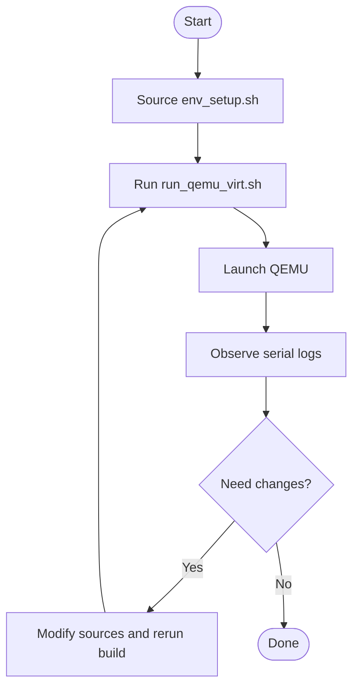

# Getting Started Guide

<cite>
**Referenced Files in This Document**
- [README.md](file://README.md)
- [env_setup.sh](file://env_setup.sh)
- [scripts/build_qemu.sh](file://scripts/build_qemu.sh)
- [scripts/mkimg.sh](file://scripts/mkimg.sh)
- [run_qemu_virt.sh](file://run_qemu_virt.sh)
- [scripts/qemu.virt.boot.run](file://scripts/qemu.virt.boot.run)
- [platform/QemuVirt/dts/virt.dts](file://platform/QemuVirt/dts/virt.dts)
- [platform/QemuVirt/linker/virt.lds](file://platform/QemuVirt/linker/virt.lds)
- [BUILD.gn](file://BUILD.gn)
- [boot/BUILD.gn](file://boot/BUILD.gn)
- [kernel/BUILD.gn](file://kernel/BUILD.gn)
- [virt/BUILD.gn](file://virt/BUILD.gn)
- [uapps/BUILD.gn](file://uapps/BUILD.gn)
- [toolchains/README.md](file://toolchains/README.md)
</cite>

## Table of Contents
1. [Introduction](#introduction)
2. [Prerequisites](#prerequisites)
3. [Development Environment Setup](#development-environment-setup)
4. [Build Process](#build-process)
5. [Running in QEMU Virtual Environment](#running-in-qemu-virtual-environment)
6. [Basic Workflow: From Source Checkout to System Boot](#basic-workflow-from-source-checkout-to-system-boot)
7. [Verification Steps](#verification-steps)
8. [Troubleshooting Guide](#troubleshooting-guide)
9. [Conclusion](#conclusion)

## Introduction
This guide helps you set up a development environment, build the system, and run it in a QEMU virtual machine. It covers toolchain installation, environment configuration, building for QEMU, and verifying the boot process. The project targets the ARM64 architecture and uses a GN/Ninja build system.

## Prerequisites
- Basic understanding of the ARM64 architecture and AArch64 assembly and C programming
- Familiarity with Linux/macOS command-line tools
- Access to a terminal with support for shell scripting
- QEMU installed on your host system (ARM64 virtualization support)

## Development Environment Setup
Follow these steps to prepare your environment:

1. Install the cross-compilation toolchain
   - Download the toolchain from the official toolchain link referenced in the repository.
   - Place the toolchain binaries under the toolchains directory as indicated by the repository structure.

2. Configure your shell environment
   - Source the environment script to add the toolchain and GN to your PATH.
   - The environment script exports base directory and prepends toolchain and GN binaries to PATH.

3. Verify environment readiness
   - Confirm that gn and aarch64-linux-gnu-gcc are available after sourcing the environment script.

**Section sources**
- [toolchains/README.md](file://toolchains/README.md#L1-L3)
- [env_setup.sh](file://env_setup.sh#L1-L5)

## Build Process
The project uses GN with Ninja to build multiple executables and groups them into a single OS target. The build targets include:
- Boot image
- Hypervisor
- Kernel
- Userspace applications group (DevMgr, Fsmgr, Netmgr, Idle, Shell)

Key build configuration highlights:
- Cross-compilation flags target ARM64 Cortex-A72 without floating-point unit
- Linker scripts define load addresses and layout for each component
- Platform selection is controlled via GN arguments

Build steps:
1. Generate build files for QEMU Virt
   - Run the QEMU build script to configure GN and generate Ninja files for the QEMU Virt platform.

2. Compile using Ninja
   - Build all targets defined in the top-level group.

3. Package images
   - Convert ELF outputs to raw binary images and assemble a bootable image with the loader, DTB, hypervisor, kernel, systemd, and ramdisk.

4. Optional: Build for Raspberry Pi platforms
   - Use the provided scripts for CM4, Pi3b, and Pi4b to generate platform-specific images.

**Section sources**
- [BUILD.gn](file://BUILD.gn#L1-L9)
- [boot/BUILD.gn](file://boot/BUILD.gn#L1-L66)
- [kernel/BUILD.gn](file://kernel/BUILD.gn#L1-L135)
- [virt/BUILD.gn](file://virt/BUILD.gn#L1-L72)
- [uapps/BUILD.gn](file://uapps/BUILD.gn#L1-L10)
- [scripts/build_qemu.sh](file://scripts/build_qemu.sh#L1-L6)
- [scripts/mkimg.sh](file://scripts/mkimg.sh#L1-L38)

## Running in QEMU Virtual Environment
To run the built system in QEMU:

1. Build the QEMU Virt image
   - Execute the QEMU Virt run script, which:
     - Generates GN build files for the QEMU Virt platform
     - Builds all targets with Ninja
     - Packages the boot image using the packaging script

2. Launch QEMU
   - The QEMU launch script starts QEMU with:
     - Machine type “virt” and GIC version 2
     - CPU “cortex-a72”
     - 4 vCPUs and 2 GB RAM
     - Serial console connected to stdio
     - Optional display and input devices

3. Observe boot logs
   - QEMU prints early boot messages to the terminal. Look for kernel initialization and systemd startup messages.

**Diagram sources**
- [run_qemu_virt.sh](file://run_qemu_virt.sh#L1-L5)
- [scripts/build_qemu.sh](file://scripts/build_qemu.sh#L1-L6)
- [scripts/mkimg.sh](file://scripts/mkimg.sh#L1-L38)
- [scripts/qemu.virt.boot.run](file://scripts/qemu.virt.boot.run#L1-L19)

**Section sources**
- [run_qemu_virt.sh](file://run_qemu_virt.sh#L1-L5)
- [scripts/qemu.virt.boot.run](file://scripts/qemu.virt.boot.run#L1-L19)

## Basic Workflow: From Source Checkout to System Boot
The recommended workflow to build and boot the system:

1. Prepare environment
   - Source the environment script to configure PATH for GN and the toolchain.

2. Build for QEMU Virt
   - Run the QEMU Virt run script to generate build files, compile, and package the image.

3. Boot in QEMU
   - Launch QEMU with the generated boot image and device tree.

4. Iterate
   - Modify sources, rebuild, and relaunch QEMU to test changes.

[No sources needed since this diagram shows conceptual workflow, not actual code structure]

## Verification Steps
After launching QEMU, confirm successful installation and boot by checking:

- Console output appears in the terminal
- Early boot messages show successful initialization of the bootloader and hypervisor
- Kernel initializes subsystems (MMU, interrupts, timers)
- System daemon starts and services become available
- Optional: Graphical framebuffer device is present if display is enabled

If the system does not boot:
- Verify toolchain and GN are in PATH after sourcing the environment script
- Ensure the QEMU Virt run script executed successfully and produced a boot image
- Confirm the QEMU launch script is pointing to the correct DTB and boot image paths

**Section sources**
- [env_setup.sh](file://env_setup.sh#L1-L5)
- [run_qemu_virt.sh](file://run_qemu_virt.sh#L1-L5)
- [scripts/qemu.virt.boot.run](file://scripts/qemu.virt.boot.run#L1-L19)

## Troubleshooting Guide
Common issues and resolutions:

- Toolchain or GN not found
  - Cause: PATH not updated after sourcing the environment script
  - Resolution: Source the environment script again and verify gn and aarch64-linux-gnu-gcc are available

- Build failures during GN generation or Ninja compilation
  - Cause: Missing dependencies or incorrect platform argument
  - Resolution: Ensure the platform argument matches the intended target and all dependencies are present

- Packaging errors when assembling the boot image
  - Cause: Missing ELF outputs or incorrect paths in the packaging script
  - Resolution: Confirm all targets were built and the packaging script references the correct output directory

- QEMU fails to start or no console output
  - Cause: Incorrect DTB path, missing boot image, or incompatible QEMU options
  - Resolution: Verify the DTB path and boot image location, and check QEMU options for the selected machine and CPU

- Display or input devices not working
  - Cause: Optional devices disabled or missing drivers
  - Resolution: Enable optional devices in the QEMU launch script and ensure corresponding drivers are included in the build

**Section sources**
- [env_setup.sh](file://env_setup.sh#L1-L5)
- [scripts/build_qemu.sh](file://scripts/build_qemu.sh#L1-L6)
- [scripts/mkimg.sh](file://scripts/mkimg.sh#L1-L38)
- [scripts/qemu.virt.boot.run](file://scripts/qemu.virt.boot.run#L1-L19)

## Conclusion
You now have the essentials to set up the environment, build the system for QEMU Virt, and verify the boot process. Use the provided scripts to streamline the workflow and iterate quickly. For advanced scenarios, explore platform-specific builds and customize linker layouts and device trees as needed.