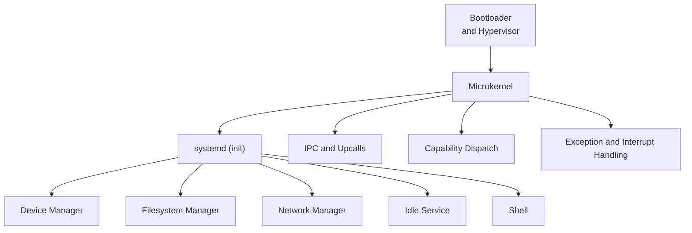
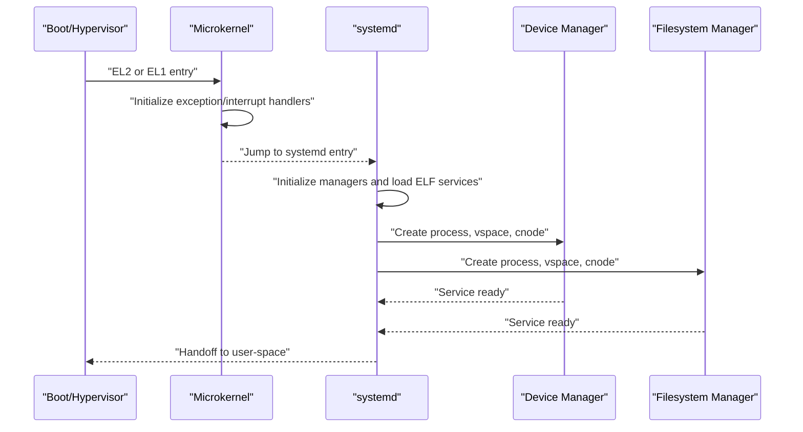
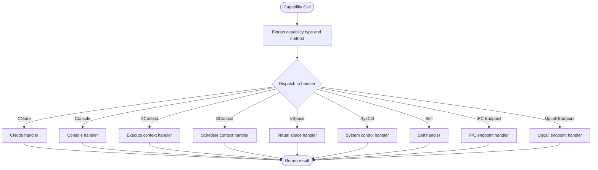
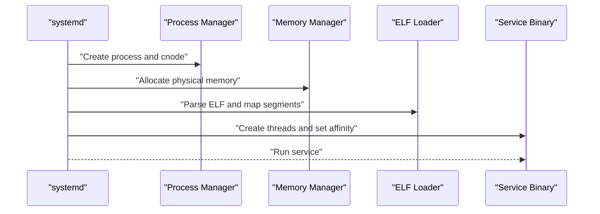
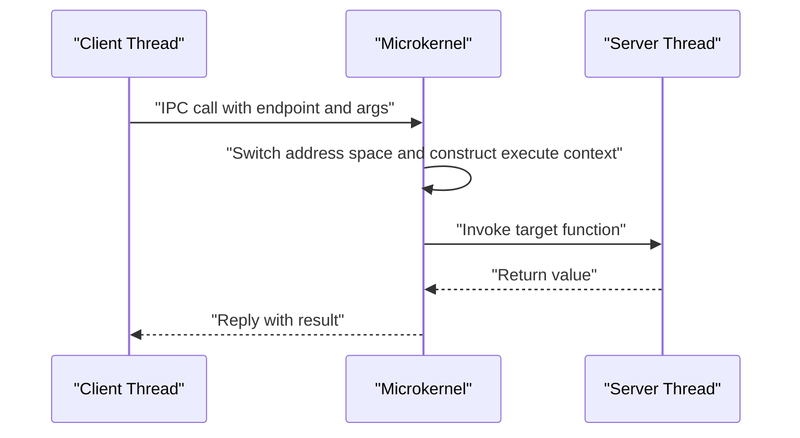
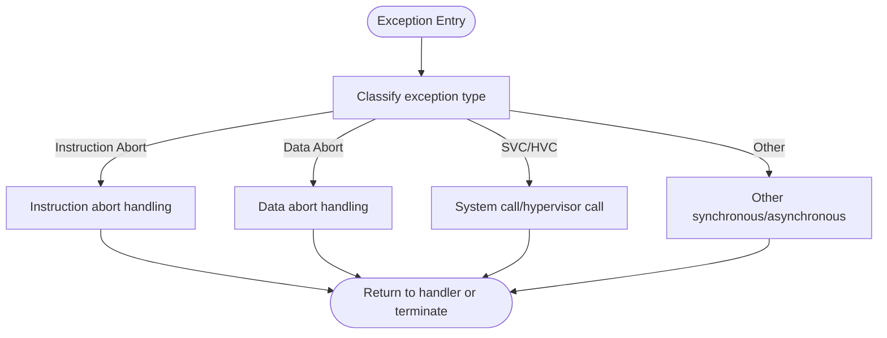
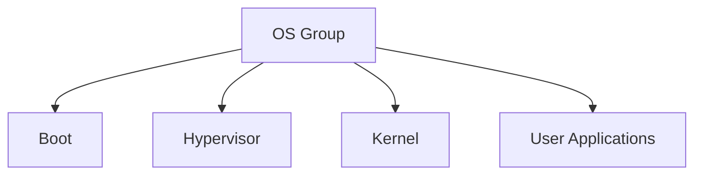

# Introduction and Goals

<cite>
**Referenced Files in This Document**
- [README.md](file://README.md)
- [microkernel_design.md](file://docs/microkernel_design.md)
- [basic_theory.md](file://docs/basic_theory.md)
- [BUILD.gn](file://BUILD.gn)
- [core.h](file://kernel/include/core.h)
- [capability.h](file://kernel/include/capability/capability.h)
- [capability.c](file://kernel/capability/capability.c)
- [systemd.c](file://kernel/systemd/systemd.c)
- [ipc.h](file://kernel/include/ipc/ipc.h)
- [exception.h](file://kernel/include/arch/arm64/exception.h)
- [hypervisor.c](file://virt/hypervisor.c)
- [devmgr.c](file://uapps/devmgr/devmgr.c)
- [fsmgr.c](file://uapps/fsmgr/fsmgr.c)
</cite>

## Table of Contents
1. [Introduction](#introduction)
2. [Project Structure](#project-structure)
3. [Core Components](#core-components)
4. [Architecture Overview](#architecture-overview)
5. [Detailed Component Analysis](#detailed-component-analysis)
6. [Dependency Analysis](#dependency-analysis)
7. [Performance Considerations](#performance-considerations)
8. [Troubleshooting Guide](#troubleshooting-guide)
9. [Conclusion](#conclusion)

## Introduction
TranquilOS is an AI-powered microkernel operating system targeting the ARM64 architecture. It is designed around a capability-based security model and a user-space services architecture, delivering a secure, efficient, and extensible foundation for modern embedded and edge systems. The project’s philosophy centers on minimizing kernel attack surface by moving most services—such as memory management, process/thread lifecycle, and device/file/network services—to user space, while the kernel remains small, predictable, and focused on core primitives like scheduling, IPC, timers, and capability dispatch.

Key goals:
- Security: Capability-based access control and fine-grained rights management limit what each component can do.
- Efficiency: A lean kernel with optimized IPC and context switching enables low overhead and real-time responsiveness.
- Extensibility: User-space services enable modular development, easy upgrades, and domain-specific enhancements.
- AI integration: Intelligent system management and future AI-driven orchestration are part of the roadmap.

How it differs from traditional monolithic kernels:
- Monolithic kernels embed services (memory manager, VFS, device drivers) inside the kernel, increasing attack surface and complexity.
- TranquilOS adopts a microkernel approach: the kernel provides minimal primitives, and services run as separate user-space processes, communicating via IPC and capabilities.

Why a microkernel:
- Smaller kernel reduces bugs and security risks.
- Clear separation of concerns improves maintainability and testability.
- Services can be isolated, restarted independently, and updated without rebooting the entire system.

AI integration and intelligent system management:
- The project’s “AI-OS” designation indicates a forward-looking vision to incorporate AI/ML for system tuning, resource allocation, and adaptive orchestration. While current implementations focus on foundational primitives, the architecture supports gradual integration of AI-driven decisions at the systemd and service layers.

## Project Structure
At a high level, the system comprises:
- Boot stage and hypervisor for virtualized environments
- Kernel with microkernel primitives (capability dispatch, IPC, scheduling, exception handling)
- Systemd (init) orchestrating core services
- User-space applications and services (device manager, filesystem manager, shell, network manager)

**Diagram sources**
- [BUILD.gn](file://BUILD.gn#L1-L9)
- [hypervisor.c](file://virt/hypervisor.c#L101-L145)
- [systemd.c](file://kernel/systemd/systemd.c#L217-L246)

**Section sources**
- [BUILD.gn](file://BUILD.gn#L1-L9)
- [README.md](file://README.md#L1-L42)

## Core Components
- Capability-based security: Kernel objects and rights are represented as capabilities. The kernel dispatches capability calls and enforces permissions during transitions from user space to kernel space.
- User-space services: systemd initializes and manages core services (device, filesystem, network, idle, shell), each packaged as ELF binaries and loaded into isolated address spaces.
- IPC and upcalls: Inter-process communication is optimized for speed and determinism, enabling near-instantaneous control-flow transfers between client and server threads.
- Exception and interrupt handling: ARM64 exception vectors and privilege levels are handled by the kernel, ensuring safe transitions and recovery.

**Section sources**
- [capability.h](file://kernel/include/capability/capability.h#L1-L26)
- [capability.c](file://kernel/capability/capability.c#L14-L58)
- [systemd.c](file://kernel/systemd/systemd.c#L15-L74)
- [ipc.h](file://kernel/include/ipc/ipc.h#L9-L12)
- [exception.h](file://kernel/include/arch/arm64/exception.h#L1-L113)

## Architecture Overview
The system bootstraps through a hypervisor or directly on bare metal, then transitions into the microkernel. systemd starts core services and exposes capability-based interfaces to user-space applications. Device and filesystem managers are examples of user-space services that provide kernel-like functionality without increasing kernel complexity.

**Diagram sources**
- [hypervisor.c](file://virt/hypervisor.c#L101-L145)
- [systemd.c](file://kernel/systemd/systemd.c#L217-L246)
- [devmgr.c](file://uapps/devmgr/devmgr.c#L33-L55)
- [fsmgr.c](file://uapps/fsmgr/fsmgr.c#L192-L212)

## Detailed Component Analysis

### Capability-Based Security
Capabilities encapsulate kernel objects and associated rights. The kernel routes capability calls to specialized handlers based on object type and method. This design enforces fine-grained access control and simplifies auditing and revocation.

**Diagram sources**
- [capability.c](file://kernel/capability/capability.c#L14-L58)
- [capability.h](file://kernel/include/capability/capability.h#L11-L21)

**Section sources**
- [capability.c](file://kernel/capability/capability.c#L14-L58)
- [capability.h](file://kernel/include/capability/capability.h#L1-L26)

### User-Space Services Orchestration
Systemd initializes core services, creates per-service processes with dedicated virtual address spaces and capability nodes, loads ELF binaries, and starts threads according to deployment modes (single or per-CPU). It also registers name service endpoints and sets up consoles for each service.

**Diagram sources**
- [systemd.c](file://kernel/systemd/systemd.c#L76-L205)

**Section sources**
- [systemd.c](file://kernel/systemd/systemd.c#L15-L74)
- [systemd.c](file://kernel/systemd/systemd.c#L207-L246)

### IPC and Upcalls
Inter-process communication leverages optimized control-flow transfers between execute contexts, minimizing scheduler involvement and improving latency. Upcalls provide asynchronous notifications from kernel or services to user threads.

**Diagram sources**
- [ipc.h](file://kernel/include/ipc/ipc.h#L9-L12)

**Section sources**
- [ipc.h](file://kernel/include/ipc/ipc.h#L1-L13)

### Exception and Interrupt Handling
The kernel handles ARM64 exceptions and interrupts, translating faults and synchronous events into recoverable conditions. Exception categories include instruction/data aborts, SVC, HVC, and various synchronous external errors.

**Diagram sources**
- [exception.h](file://kernel/include/arch/arm64/exception.h#L1-L113)

**Section sources**
- [exception.h](file://kernel/include/arch/arm64/exception.h#L1-L113)

## Dependency Analysis
The build group aggregates the boot, hypervisor, kernel, and user-space applications into a cohesive OS image. This reflects the separation of concerns: the hypervisor and bootloader prepare the environment, the kernel provides primitives, and systemd and services form the runtime.

**Diagram sources**
- [BUILD.gn](file://BUILD.gn#L1-L9)

**Section sources**
- [BUILD.gn](file://BUILD.gn#L1-L9)

## Performance Considerations
- Microkernel design minimizes kernel code paths and avoids heavy monolithic logic in kernel space.
- Optimized IPC reduces scheduler involvement, lowering latency for inter-thread communication.
- User-space services can be tuned independently; memory managers and schedulers can evolve without kernel changes.
- Future directions include AI-driven resource management and adaptive orchestration to further improve efficiency and responsiveness.

## Troubleshooting Guide
- Capability dispatch failures: Verify capability types and methods are correctly encoded and that the capability node grants appropriate rights.
- Service startup issues: Confirm process creation, virtual address space setup, ELF parsing, and thread creation succeed; check logs for early termination reasons.
- IPC timeouts or deadlocks: Ensure endpoint references are valid and that reply paths are properly established.
- Exception handling: Review exception classification and abort reasons to diagnose misconfiguration or faulty hardware.

**Section sources**
- [capability.c](file://kernel/capability/capability.c#L14-L58)
- [systemd.c](file://kernel/systemd/systemd.c#L76-L205)
- [exception.h](file://kernel/include/arch/arm64/exception.h#L39-L76)

## Conclusion
TranquilOS offers a principled path toward a secure, efficient, and extensible operating system by combining a capability-based microkernel with a user-space services architecture. Its ARM64 focus, combined with a clear separation of kernel and user-space responsibilities, positions the system for future AI-driven enhancements while maintaining simplicity and reliability. Newcomers can approach the system by understanding the microkernel primitives, capability dispatch, and the role of systemd in orchestrating services.