# Key Features and Capabilities

<cite>
**Referenced Files in This Document**
- [README.md](file://README.md)
- [microkernel_design.md](file://docs/microkernel_design.md)
- [core.h](file://kernel/include/core.h)
- [mmu.c](file://kernel/arch/arm64/mmu.c)
- [irq_mgr.c](file://kernel/interrupt/irq_mgr.c)
- [sched_mgr.c](file://kernel/schedule/sched_mgr.c)
- [capability.c](file://kernel/capability/capability.c)
- [systemd.c](file://kernel/systemd/systemd.c)
- [procmgr.c](file://kernel/systemd/procmgr/procmgr.c)
- [memmgr.c](file://kernel/systemd/memmgr/memmgr.c)
- [ipcmgr.c](file://kernel/systemd/ipcmgr/ipcmgr.c)
- [console.c](file://kernel/console/console.c)
- [caslock.h](file://kernel/include/sync/spinlock/caslock.h)
- [upcall.c](file://kernel/upcall/upcall.c)
</cite>

## Table of Contents
1. [Introduction](#introduction)
2. [Project Structure](#project-structure)
3. [Core Components](#core-components)
4. [Architecture Overview](#architecture-overview)
5. [Detailed Component Analysis](#detailed-component-analysis)
6. [Dependency Analysis](#dependency-analysis)
7. [Performance Considerations](#performance-considerations)
8. [Troubleshooting Guide](#troubleshooting-guide)
9. [Conclusion](#conclusion)
10. [Appendices](#appendices)

## Introduction
This document presents the key features and capabilities of TranquilOS, a microkernel-based operating system targeting ARM64. It explains each major capability—ARM64 architecture support, MMU and virtual memory management, interrupt handling, scheduling, multi-process and threading support, UART and console functionality, capability-based security, spinlocks, SMP support, IPC, and upcalls—along with their purpose, implementation approach, and maturity indicators. It also documents the user-space service architecture (process manager, memory manager, and IPC manager) and demonstrates how these features integrate to form a cohesive system.

## Project Structure
TranquilOS organizes its kernel and user-space services into distinct layers:
- Kernel core: architecture-specific HAL (ARM64), MMU, interrupts, scheduling, capability dispatch, upcalls, and console.
- Systemd: user-space bootstrap and core services orchestrator.
- User-space services: device manager, filesystem manager, network manager, shell, and idle tasks.

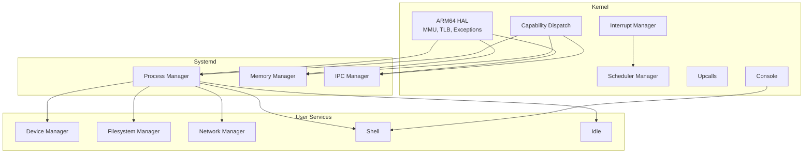

**Diagram sources**
- [mmu.c](file://kernel/arch/arm64/mmu.c#L62-L126)
- [irq_mgr.c](file://kernel/interrupt/irq_mgr.c#L135-L142)
- [sched_mgr.c](file://kernel/schedule/sched_mgr.c#L151-L162)
- [capability.c](file://kernel/capability/capability.c#L14-L54)
- [upcall.c](file://kernel/upcall/upcall.c#L8-L52)
- [console.c](file://kernel/console/console.c#L4-L29)
- [systemd.c](file://kernel/systemd/systemd.c#L217-L246)
- [procmgr.c](file://kernel/systemd/procmgr/procmgr.c#L127-L139)
- [memmgr.c](file://kernel/systemd/memmgr/memmgr.c#L274-L296)
- [ipcmgr.c](file://kernel/systemd/ipcmgr/ipcmgr.c#L311-L319)

**Section sources**
- [README.md](file://README.md#L1-L42)
- [microkernel_design.md](file://docs/microkernel_design.md#L1-L43)

## Core Components
- ARM64 architecture support: CPU registers, exception handling, and entry/exit assembly routines.
- MMU and virtual memory: page table management, translation control, memory attributes, and identity mapping.
- Interrupt handling: IRQ device abstraction, per-core local managers, and EOI/scheduling integration.
- Scheduling: split execution and schedule contexts, scheduler framework registration, and per-CPU local schedulers.
- Capability-based security: capability dispatch across object types and unified capcall interface.
- Spinlocks: compare-and-swap based spinlock primitives for low-level synchronization.
- SMP support: per-CPU scheduler initialization and affinity-aware scheduling.
- IPC: capability-based endpoints, name service, and endpoint creation for user-space services.
- Upcalls: asynchronous fault handling and cooperative transfer to handler contexts.
- Console: device-agnostic console abstraction and UART-backed devices.

**Section sources**
- [README.md](file://README.md#L4-L17)
- [microkernel_design.md](file://docs/microkernel_design.md#L6-L32)
- [core.h](file://kernel/include/core.h#L5-L8)

## Architecture Overview
The kernel exposes a capability-based ABI to user-space via capcall. Systemd initializes core managers and launches user-space services. Services register IPC endpoints through a name service and communicate using capability references. Interrupts trigger scheduling decisions and can preempt user contexts. Upcalls enable asynchronous handling of faults or events.

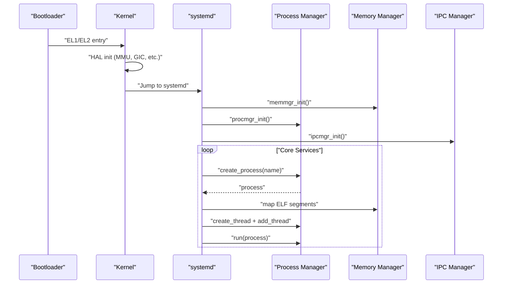

**Diagram sources**
- [systemd.c](file://kernel/systemd/systemd.c#L217-L246)
- [procmgr.c](file://kernel/systemd/procmgr/procmgr.c#L127-L139)
- [memmgr.c](file://kernel/systemd/memmgr/memmgr.c#L274-L296)
- [ipcmgr.c](file://kernel/systemd/ipcmgr/ipcmgr.c#L311-L319)

## Detailed Component Analysis

### ARM64 Architecture Support
- Purpose: Provide a portable, efficient hardware abstraction for AArch64, enabling secure and deterministic operation.
- Implementation approach:
  - Register accessors for SCTLR, TCR, MAIR, TTBR0/TTBR1, and ID_AA64MMFR0.
  - Memory attribute configuration and translation control setup.
  - Identity mapping for privileged regions and page table manipulation.
- Maturity indicator: Implemented and used during boot and runtime.

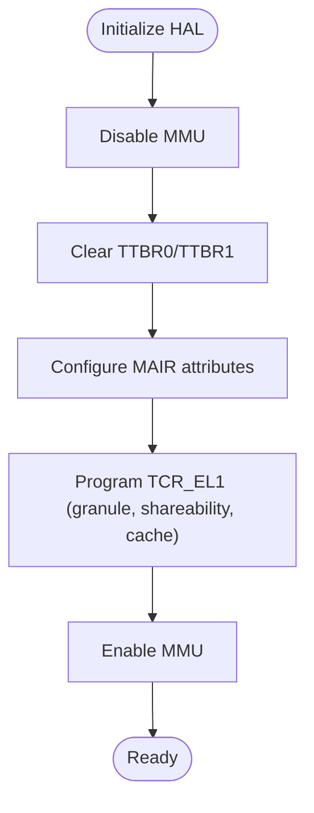

**Diagram sources**
- [mmu.c](file://kernel/arch/arm64/mmu.c#L62-L126)

**Section sources**
- [mmu.c](file://kernel/arch/arm64/mmu.c#L16-L126)

### MMU and Virtual Memory Management
- Purpose: Manage address spaces, memory protection, and page table lifecycle.
- Implementation approach:
  - Configure memory attributes via MAIR.
  - Set translation control (TCR) for ASID, granularity, and region sizes.
  - Switch between kernel and user page tables and invalidate TLBs.
  - Allocate and wire identity mappings for privileged regions.
- Maturity indicator: Core feature; actively used by memory manager and process creation.

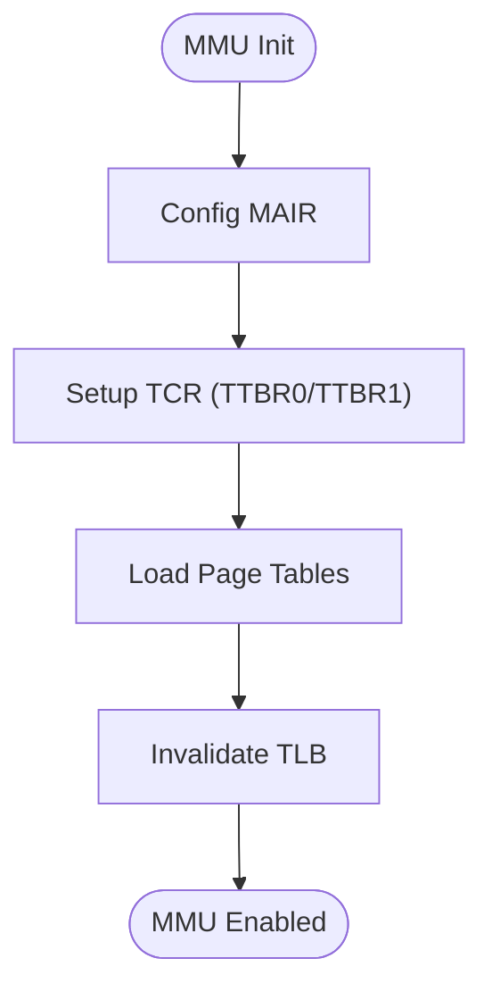

**Diagram sources**
- [mmu.c](file://kernel/arch/arm64/mmu.c#L62-L151)

**Section sources**
- [mmu.c](file://kernel/arch/arm64/mmu.c#L224-L231)

### Interrupt Handling
- Purpose: Deliver device interrupts to registered handlers and reschedule appropriately.
- Implementation approach:
  - Local IRQ manager per CPU registers IRQs and device ops.
  - Acknowledge, dispatch handler, and issue EOI.
  - Trigger scheduler to select next runnable context.
- Maturity indicator: Core feature; integrates with GIC and scheduler.

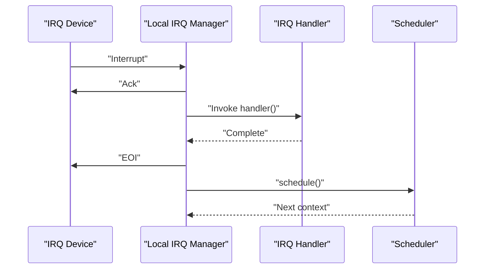

**Diagram sources**
- [irq_mgr.c](file://kernel/interrupt/irq_mgr.c#L49-L83)

**Section sources**
- [irq_mgr.c](file://kernel/interrupt/irq_mgr.c#L13-L142)

### Scheduling
- Purpose: Manage execution of threads across CPUs with fairness and responsiveness.
- Implementation approach:
  - Split execution context and schedule context.
  - Per-CPU local schedulers with a scheduler framework registry.
  - Add/remove/query contexts and schedule with affinity selection.
- Maturity indicator: Core feature; supports SMP and per-CPU initialization.

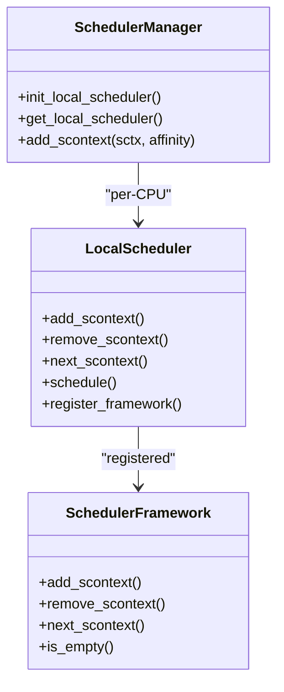

**Diagram sources**
- [sched_mgr.c](file://kernel/schedule/sched_mgr.c#L6-L162)

**Section sources**
- [sched_mgr.c](file://kernel/schedule/sched_mgr.c#L105-L162)

### Multi-Process and Threading Support
- Purpose: Provide process and thread lifecycle management, capability storage, and address spaces.
- Implementation approach:
  - Process manager creates processes, assigns PIDs, and maintains lists.
  - Processes own CNodes (capability storage) and VSAPCEs (address spaces).
  - Threads are created per process with affinities and scheduled independently.
- Maturity indicator: Core feature; used by systemd to launch services.

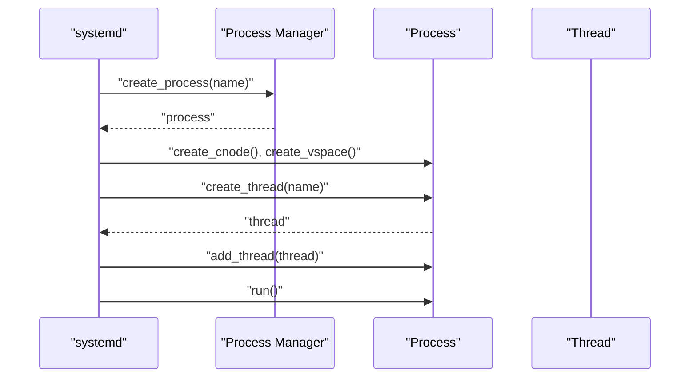

**Diagram sources**
- [systemd.c](file://kernel/systemd/systemd.c#L76-L205)
- [procmgr.c](file://kernel/systemd/procmgr/procmgr.c#L42-L72)

**Section sources**
- [systemd.c](file://kernel/systemd/systemd.c#L76-L205)
- [procmgr.c](file://kernel/systemd/procmgr/procmgr.c#L127-L139)

### Capability-Based Security
- Purpose: Replace traditional ACLs with fine-grained capability references for kernel objects and services.
- Implementation approach:
  - Capability dispatch decodes capcall number and routes to object-specific handlers.
  - Object types include CNode, XContext, SContext, VSpace, SysCtrl, Self, Console, IPC Endpoint, Upcall Endpoint.
  - User-space constructs endpoints and passes capability references to other services.
- Maturity indicator: Core differentiator; extensively used by IPC and upcalls.

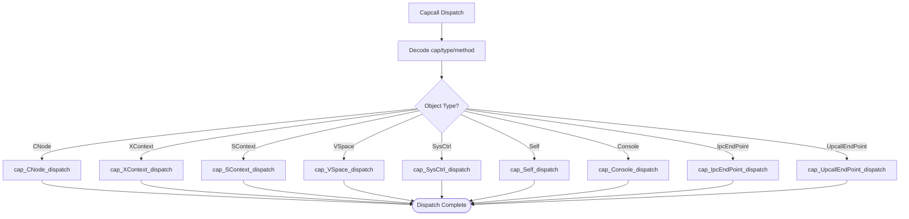

**Diagram sources**
- [capability.c](file://kernel/capability/capability.c#L14-L54)

**Section sources**
- [capability.c](file://kernel/capability/capability.c#L14-L54)
- [microkernel_design.md](file://docs/microkernel_design.md#L6-L8)

### Spinlocks
- Purpose: Lightweight mutual exclusion for kernel data structures and fast critical sections.
- Implementation approach:
  - Compare-and-swap atomic operations with acquire/release semantics.
  - Event wait/broadcast for low-power spinning.
- Maturity indicator: Low-level primitive; used across scheduler and IRQ managers.

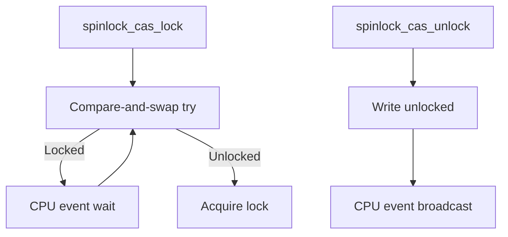

**Diagram sources**
- [caslock.h](file://kernel/include/sync/spinlock/caslock.h#L15-L42)

**Section sources**
- [caslock.h](file://kernel/include/sync/spinlock/caslock.h#L1-L43)

### SMP Support
- Purpose: Enable multi-core execution with per-CPU schedulers and cross-core coordination.
- Implementation approach:
  - Per-CPU local scheduler initialization and spinlock-protected queues.
  - Affinity-aware scheduling and scheduler manager lookup by CPU ID.
- Maturity indicator: Core feature; used by scheduler and IRQ managers.

**Section sources**
- [sched_mgr.c](file://kernel/schedule/sched_mgr.c#L113-L129)
- [irq_mgr.c](file://kernel/interrupt/irq_mgr.c#L105-L118)

### IPC
- Purpose: Fast, capability-based inter-process communication with synchronous replies.
- Implementation approach:
  - Name service registers and retrieves IPC endpoints by service ID.
  - systemd creates endpoints for services and sets up X/S contexts with stacks.
  - Caller obtains endpoint capability and invokes IPC methods.
- Maturity indicator: Core feature; used by all user-space services.

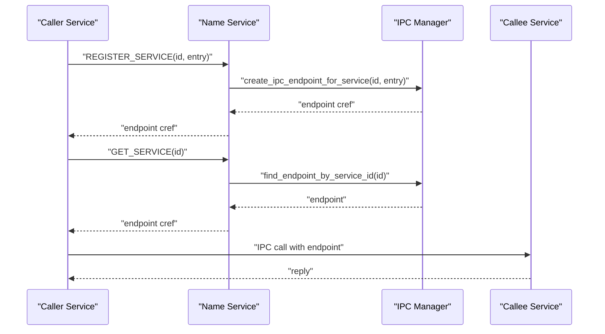

**Diagram sources**
- [ipcmgr.c](file://kernel/systemd/ipcmgr/ipcmgr.c#L237-L287)
- [ipcmgr.c](file://kernel/systemd/ipcmgr/ipcmgr.c#L156-L195)
- [ipcmgr.c](file://kernel/systemd/ipcmgr/ipcmgr.c#L197-L235)

**Section sources**
- [ipcmgr.c](file://kernel/systemd/ipcmgr/ipcmgr.c#L12-L87)
- [ipcmgr.c](file://kernel/systemd/ipcmgr/ipcmgr.c#L237-L287)

### Upcalls
- Purpose: Asynchronous handling of faults or events by transferring control to a designated handler context.
- Implementation approach:
  - Upcall endpoint stores entry XContext, entry point, and stack pointer.
  - Faulting context is blocked and moved to blocked state; scheduler selects next.
  - Handler executes; upon reply, original context resumes.
- Maturity indicator: Core feature; used for asynchronous event handling.

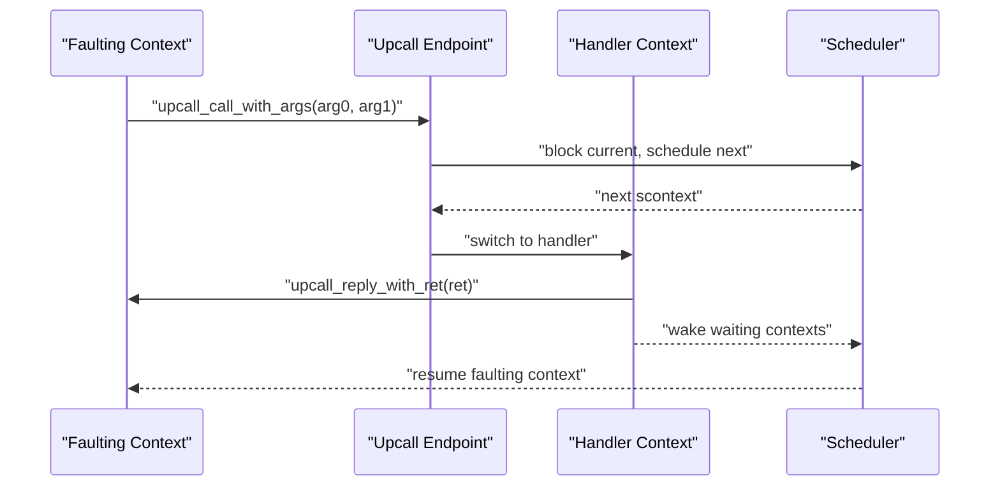

**Diagram sources**
- [upcall.c](file://kernel/upcall/upcall.c#L8-L52)
- [upcall.c](file://kernel/upcall/upcall.c#L54-L95)

**Section sources**
- [upcall.c](file://kernel/upcall/upcall.c#L1-L95)

### UART and Console Functionality
- Purpose: Provide character-based input/output for diagnostics and interactive shells.
- Implementation approach:
  - Console abstraction with attachable devices.
  - UART drivers (PL011, auxiliary UART) implement device ops.
  - Console write/read delegates to underlying device.
- Maturity indicator: Core feature; used by shell and logging.

**Section sources**
- [console.c](file://kernel/console/console.c#L4-L29)

### User-Space Service Architecture
- Process Manager: Creates processes, assigns PIDs, manages CNode/VSpace, and spawns threads.
- Memory Manager: Initializes boot and buddy allocators, exposes allocation/free, and SHM management.
- IPC Manager: Provides name service, endpoint creation, and capability distribution.

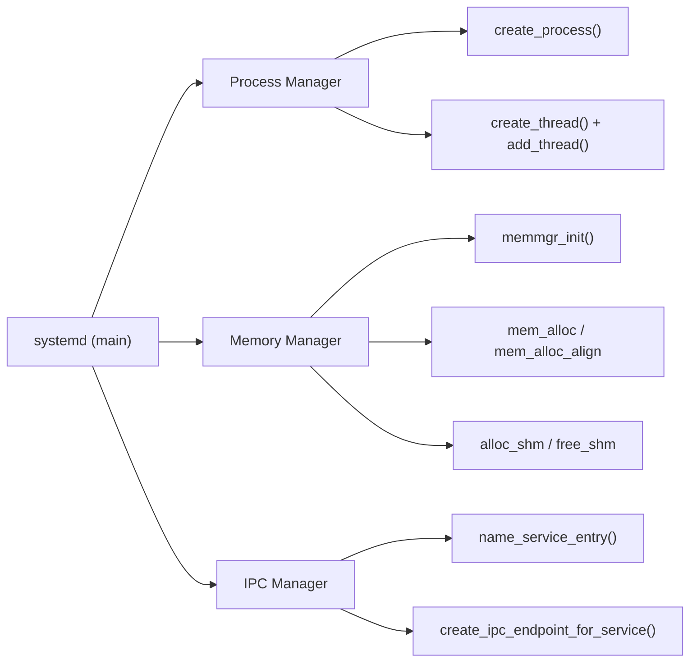

**Diagram sources**
- [systemd.c](file://kernel/systemd/systemd.c#L217-L246)
- [procmgr.c](file://kernel/systemd/procmgr/procmgr.c#L127-L139)
- [memmgr.c](file://kernel/systemd/memmgr/memmgr.c#L274-L296)
- [ipcmgr.c](file://kernel/systemd/ipcmgr/ipcmgr.c#L311-L319)

**Section sources**
- [systemd.c](file://kernel/systemd/systemd.c#L15-L74)
- [procmgr.c](file://kernel/systemd/procmgr/procmgr.c#L42-L72)
- [memmgr.c](file://kernel/systemd/memmgr/memmgr.c#L132-L155)
- [ipcmgr.c](file://kernel/systemd/ipcmgr/ipcmgr.c#L237-L287)

## Dependency Analysis
- Capability dispatch depends on object-type routing and is used by IPC and upcalls.
- IPC relies on process and memory managers to allocate endpoints and stacks.
- Scheduler depends on spinlocks and IRQ manager for preemption and rescheduling.
- Console depends on UART drivers and is used by shell and logging.

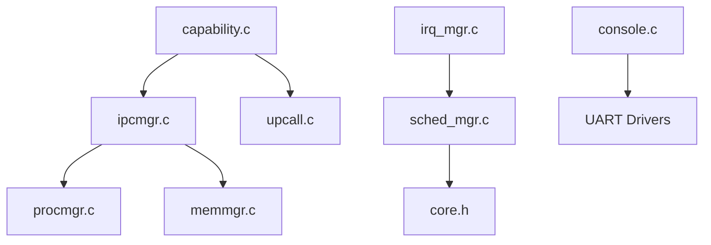

**Diagram sources**
- [capability.c](file://kernel/capability/capability.c#L14-L54)
- [ipcmgr.c](file://kernel/systemd/ipcmgr/ipcmgr.c#L237-L287)
- [upcall.c](file://kernel/upcall/upcall.c#L8-L52)
- [procmgr.c](file://kernel/systemd/procmgr/procmgr.c#L127-L139)
- [memmgr.c](file://kernel/systemd/memmgr/memmgr.c#L274-L296)
- [irq_mgr.c](file://kernel/interrupt/irq_mgr.c#L135-L142)
- [sched_mgr.c](file://kernel/schedule/sched_mgr.c#L151-L162)
- [core.h](file://kernel/include/core.h#L5-L8)
- [console.c](file://kernel/console/console.c#L4-L29)

**Section sources**
- [capability.c](file://kernel/capability/capability.c#L14-L54)
- [ipcmgr.c](file://kernel/systemd/ipcmgr/ipcmgr.c#L237-L287)
- [upcall.c](file://kernel/upcall/upcall.c#L8-L52)
- [procmgr.c](file://kernel/systemd/procmgr/procmgr.c#L127-L139)
- [memmgr.c](file://kernel/systemd/memmgr/memmgr.c#L274-L296)
- [irq_mgr.c](file://kernel/interrupt/irq_mgr.c#L135-L142)
- [sched_mgr.c](file://kernel/schedule/sched_mgr.c#L151-L162)
- [core.h](file://kernel/include/core.h#L5-L8)
- [console.c](file://kernel/console/console.c#L4-L29)

## Performance Considerations
- Capability-based IPC avoids kernel-side message copying and leverages direct control transfer for lower latency.
- Spinlocks minimize overhead for short critical sections; use with care to avoid contention.
- Buddy allocator and page arrays optimize memory allocation for kernel objects and service binaries.
- Per-CPU schedulers reduce contention and improve scalability on SMP systems.

[No sources needed since this section provides general guidance]

## Troubleshooting Guide
- Capability dispatch errors: Verify capcall number encoding and object type routing.
- IPC endpoint failures: Confirm endpoint creation, capability distribution, and name service registration.
- Scheduling anomalies: Check local scheduler initialization, spinlock usage, and affinity settings.
- Console issues: Validate device attachment and driver availability.
- Upcall timeouts: Ensure handler replies and that faulting context is properly resumed.

**Section sources**
- [capability.c](file://kernel/capability/capability.c#L50-L54)
- [ipcmgr.c](file://kernel/systemd/ipcmgr/ipcmgr.c#L237-L287)
- [sched_mgr.c](file://kernel/schedule/sched_mgr.c#L113-L129)
- [console.c](file://kernel/console/console.c#L4-L29)
- [upcall.c](file://kernel/upcall/upcall.c#L54-L95)

## Conclusion
TranquilOS delivers a modern microkernel foundation with ARM64 support, robust MMU and virtual memory management, capability-based security, and a user-space service architecture. Its IPC and upcall mechanisms enable responsive, real-time interactions, while SMP and scheduling provide scalability. The documented features demonstrate a cohesive system where kernel abstractions and user-space services collaborate to achieve reliability and performance.

[No sources needed since this section summarizes without analyzing specific files]

## Appendices
- Feature maturity indicators:
  - ARM64, MMU, IRQ, schedule, spinlocks, SMP, IPC, upcalls: implemented and integrated.
  - Capability-based security: core differentiator; widely used across IPC and upcalls.
  - User-space services (proc mgr, mem mgr, ipc mgr): implemented and orchestrated by systemd.
- Roadmap status (from repository):
  - Futex: not implemented yet.
  - Filesystem manager, network manager, MMI manager, rootfs/ext: planned but not implemented.

**Section sources**
- [README.md](file://README.md#L14-L29)
- [microkernel_design.md](file://docs/microkernel_design.md#L30-L32)