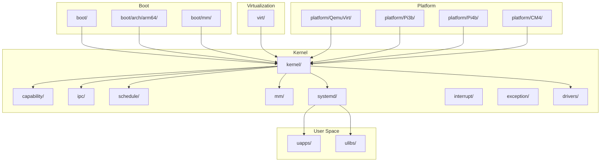
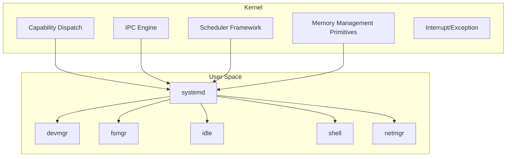
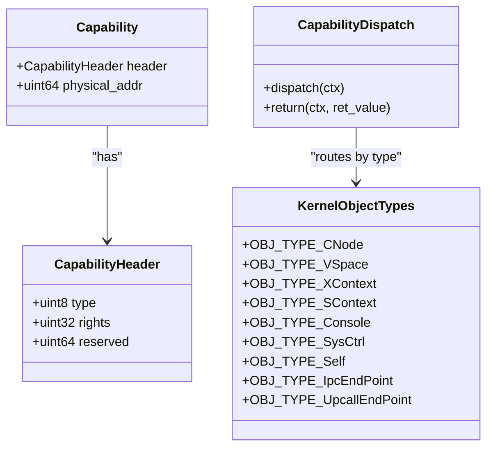
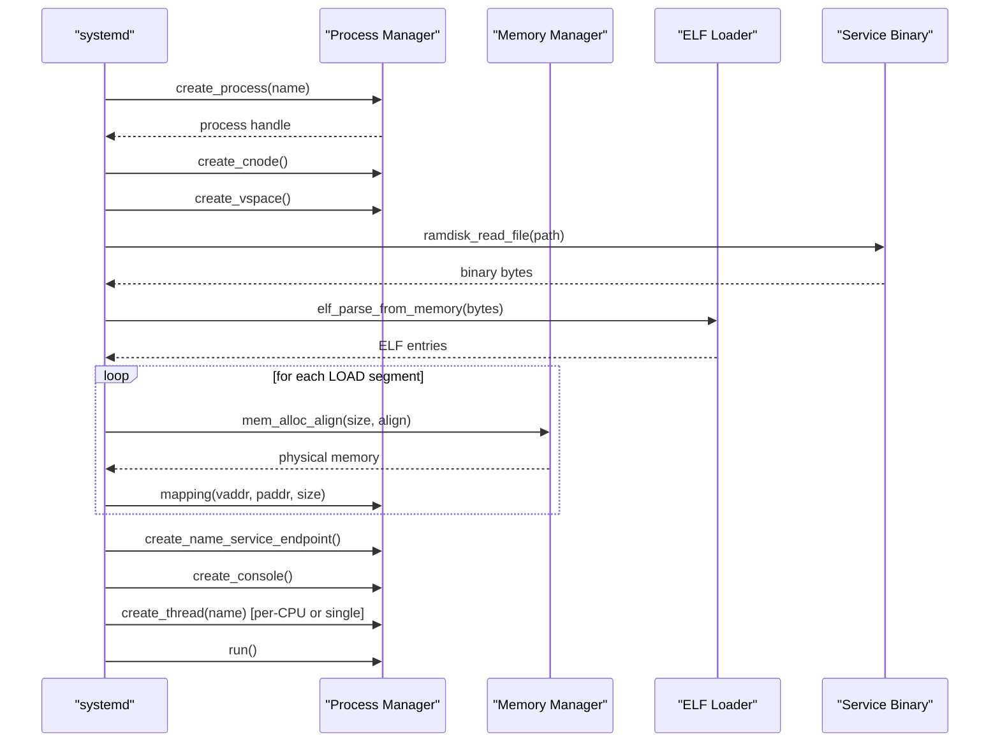
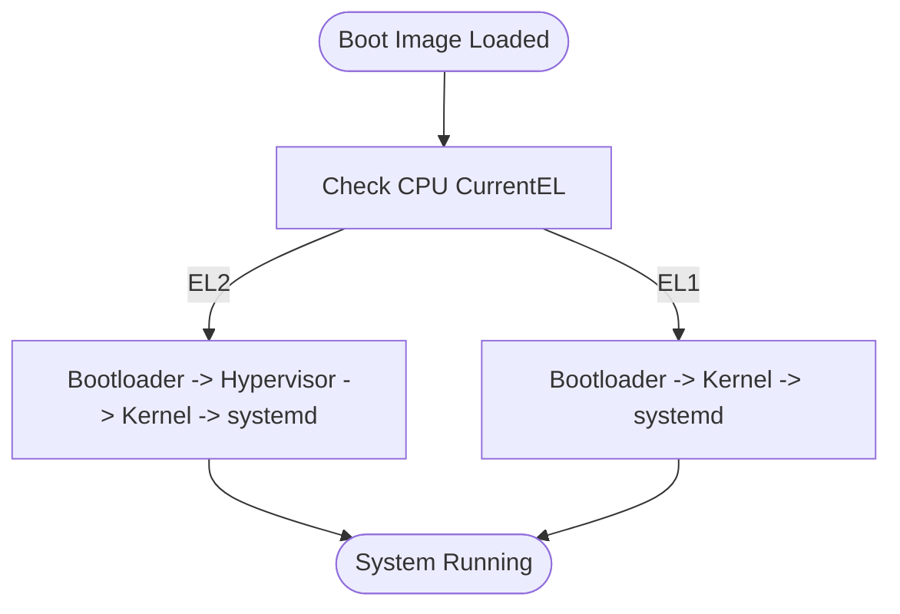
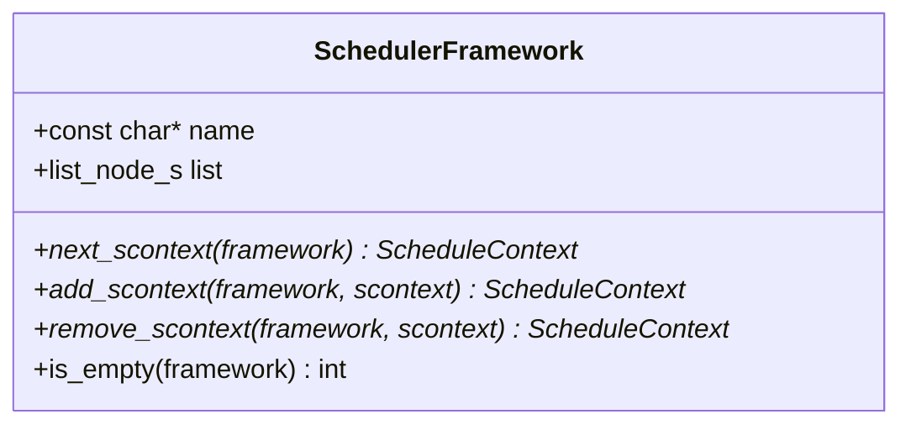
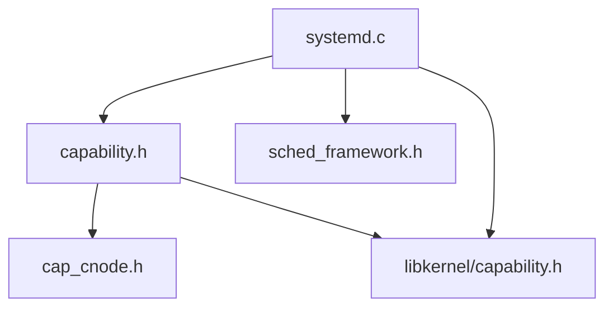

# Project Overview

<cite>
**Referenced Files in This Document**
- [README.md](file://README.md)
- [microkernel_design.md](file://docs/microkernel_design.md)
- [kernel/systemd/systemd.c](file://kernel/systemd/systemd.c)
- [kernel/include/capability/capability.h](file://kernel/include/capability/capability.h)
- [kernel/include/capability/cap_cnode.h](file://kernel/include/capability/cap_cnode.h)
- [ulibs/include/libkernel/capability.h](file://ulibs/include/libkernel/capability.h)
- [kernel/include/scheduler/sched_framework.h](file://kernel/include/scheduler/sched_framework.h)
- [virt/virt.lds](file://virt/virt.lds)
- [platform/QemuVirt/linker/virt.lds](file://platform/QemuVirt/linker/virt.lds)
- [kernel/include/arch/arm64/common.h](file://kernel/include/arch/arm64/common.h)
- [kernel/include/boot.h](file://kernel/include/boot.h)
</cite>

## Table of Contents
1. [Introduction](#introduction)
2. [Project Structure](#project-structure)
3. [Core Components](#core-components)
4. [Architecture Overview](#architecture-overview)
5. [Detailed Component Analysis](#detailed-component-analysis)
6. [Dependency Analysis](#dependency-analysis)
7. [Performance Considerations](#performance-considerations)
8. [Troubleshooting Guide](#troubleshooting-guide)
9. [Conclusion](#conclusion)

## Introduction
TranquilOS is an AI-powered microkernel operating system designed for the ARM64 architecture. Its purpose is to provide a minimal yet capable kernel that delegates most system services to user-space while enforcing strict capability-based security. The project emphasizes a clean separation of concerns: the kernel handles only essential primitives (memory management primitives, scheduling, interrupts, IPC, and upcalls), while user-space services manage devices, filesystems, networking, and higher-level orchestration via a unified capability ABI.

Key goals and philosophy:
- Capability-based security inspired by seL4: fine-grained rights management and explicit capability passing for all kernel objects.
- Microkernel-first design: keep the kernel small, predictable, and secure; push services out of the kernel.
- User-space services architecture: systemd orchestrates core services (device manager, VFS, IPC manager, shell, network manager) and per-CPU idle tasks.
- Virtualization support: EL2 Type-1 virtualization enables running the kernel and VMs inside a single boot image, selectable at runtime by CPU CurrentEL.
- Target ARM64: optimized for ARMv8-A with MMU, SMP, and modern exception/interrupt handling.

Practical examples of capabilities:
- Creating and managing virtual address spaces for user processes.
- Establishing IPC endpoints and performing immediate control-flow switching for IPC.
- Allocating and mapping physical memory for services and binaries.
- Registering per-CPU idle services and yielding the processor cooperatively.

**Section sources**
- [README.md](file://README.md#L1-L42)
- [microkernel_design.md](file://docs/microkernel_design.md#L1-L43)

## Project Structure
At a high level, the repository is organized by functional areas:
- boot: architecture-specific boot stages, early memory mapping, and platform glue for ARM64.
- kernel: core kernel subsystems including capability management, IPC, scheduling, memory management primitives, and user-space service orchestration (systemd).
- virt: hypervisor and virtualization support for EL2 Type-1.
- platform: board-specific device tree sources and linker scripts for QEMU and Raspberry Pi variants.
- uapps: user-space applications and services (devmgr, fsmgr, idle, netmgr, shell).
- ulibs: user-space libraries exposing the capability ABI and client APIs for services.
- docs: design documents and theory behind the microkernel and capability model.

**Diagram sources**
- [README.md](file://README.md#L1-L42)
- [kernel/systemd/systemd.c](file://kernel/systemd/systemd.c#L1-L247)

**Section sources**
- [README.md](file://README.md#L1-L42)

## Core Components
- Capability-based security model:
  - Kernel objects are represented as capabilities with typed headers and explicit rights. The capability dispatch routes calls by object type and method.
  - Userspace interacts via a capability ABI, including CNode for capability storage, XContext for execution contexts, SContext for scheduling contexts, VSpace for virtual memory, SysCtrl for system queries, Self for self operations, IPC endpoints, and upcall endpoints.
- User-space services architecture:
  - systemd initializes managers (memory, process, IPC) and launches core services (devmgr, fsmgr, idle, shell, netmgr) with per-deployment modes (single or per-CPU).
  - Services are ELF binaries loaded from a cpio ramdisk, mapped into virtual address spaces, and started with console and endpoint registration.
- Virtualization support:
  - EL2 Type-1 virtualization allows the kernel and VMs to be packaged into a single boot image. Runtime selection depends on CPU CurrentEL (EL2 or EL1).
- Security model:
  - Rights-based access control enforced by capability dispatch; explicit capability passing prevents implicit privileges.
  - Separation between kernel and user-space services reduces attack surface and increases verifiability.

**Section sources**
- [kernel/include/capability/capability.h](file://kernel/include/capability/capability.h#L1-L26)
- [kernel/include/capability/cap_cnode.h](file://kernel/include/capability/cap_cnode.h#L1-L12)
- [ulibs/include/libkernel/capability.h](file://ulibs/include/libkernel/capability.h#L1-L141)
- [kernel/systemd/systemd.c](file://kernel/systemd/systemd.c#L15-L74)
- [kernel/systemd/systemd.c](file://kernel/systemd/systemd.c#L207-L215)
- [microkernel_design.md](file://docs/microkernel_design.md#L34-L43)

## Architecture Overview
The system architecture follows a classic microkernel design with user-space services:
- Kernel: provides primitives for memory management, scheduling, interrupts, exceptions, IPC, and upcalls.
- User-space systemd: orchestrates core services and manages process lifecycle, memory allocation, and virtual address space creation.
- Capabilities: typed kernel objects with explicit rights; userspace invokes methods via capability calls.

**Diagram sources**
- [kernel/systemd/systemd.c](file://kernel/systemd/systemd.c#L217-L246)
- [kernel/include/scheduler/sched_framework.h](file://kernel/include/scheduler/sched_framework.h#L1-L20)
- [ulibs/include/libkernel/capability.h](file://ulibs/include/libkernel/capability.h#L6-L18)

## Detailed Component Analysis

### Capability Model and ABI
The capability model defines typed kernel objects and explicit rights. The capability dispatch decodes the capability call number to route to the appropriate handler. Userspace uses a capability ABI to create and manipulate objects such as CNode, VSpace, XContext, SContext, Console, SysCtrl, Self, IPC endpoints, and Upcall endpoints.

**Diagram sources**
- [kernel/include/capability/capability.h](file://kernel/include/capability/capability.h#L11-L25)
- [ulibs/include/libkernel/capability.h](file://ulibs/include/libkernel/capability.h#L6-L18)
- [kernel/capability/capability.c](file://kernel/capability/capability.c#L14-L58)

**Section sources**
- [kernel/include/capability/capability.h](file://kernel/include/capability/capability.h#L1-L26)
- [ulibs/include/libkernel/capability.h](file://ulibs/include/libkernel/capability.h#L1-L141)
- [kernel/capability/capability.c](file://kernel/capability/capability.c#L14-L58)

### User-Space Services Orchestration (systemd)
systemd initializes core managers, loads ELF binaries from a cpio ramdisk, allocates physical memory, maps segments into virtual address spaces, registers linear maps, creates console and IPC endpoints, and starts threads either per-CPU or singletons depending on deployment mode.

**Diagram sources**
- [kernel/systemd/systemd.c](file://kernel/systemd/systemd.c#L76-L205)

**Section sources**
- [kernel/systemd/systemd.c](file://kernel/systemd/systemd.c#L15-L74)
- [kernel/systemd/systemd.c](file://kernel/systemd/systemd.c#L207-L215)

### Virtualization Support (EL2 Type-1)
TranquilOS supports EL2 Type-1 virtualization. The boot image can be executed under a hypervisor (EL2) or directly by the bootloader (EL1), determined by CPU CurrentEL. Linker scripts define the layout for the hypervisor region and stacks.

**Diagram sources**
- [microkernel_design.md](file://docs/microkernel_design.md#L34-L43)
- [virt/virt.lds](file://virt/virt.lds#L1-L70)
- [platform/QemuVirt/linker/virt.lds](file://platform/QemuVirt/linker/virt.lds#L1-L70)

**Section sources**
- [microkernel_design.md](file://docs/microkernel_design.md#L34-L43)
- [virt/virt.lds](file://virt/virt.lds#L1-L70)
- [platform/QemuVirt/linker/virt.lds](file://platform/QemuVirt/linker/virt.lds#L1-L70)

### Scheduling Framework
The scheduler framework abstracts the selection, addition, removal, and emptiness checks for scheduling contexts, enabling pluggable scheduling policies.

**Diagram sources**
- [kernel/include/scheduler/sched_framework.h](file://kernel/include/scheduler/sched_framework.h#L1-L20)

**Section sources**
- [kernel/include/scheduler/sched_framework.h](file://kernel/include/scheduler/sched_framework.h#L1-L20)

### ARM64 Target and Boot Entrypoints
ARM64 architecture constants and boot entrypoints define stack sizes and entry symbols used during early boot and context switching.

**Section sources**
- [kernel/include/arch/arm64/common.h](file://kernel/include/arch/arm64/common.h#L1-L6)
- [kernel/include/boot.h](file://kernel/include/boot.h#L1-L8)

## Dependency Analysis
The following diagram shows key dependencies among core components:

**Diagram sources**
- [kernel/include/capability/capability.h](file://kernel/include/capability/capability.h#L1-L26)
- [kernel/include/capability/cap_cnode.h](file://kernel/include/capability/cap_cnode.h#L1-L12)
- [ulibs/include/libkernel/capability.h](file://ulibs/include/libkernel/capability.h#L1-L141)
- [kernel/systemd/systemd.c](file://kernel/systemd/systemd.c#L1-L247)
- [kernel/include/scheduler/sched_framework.h](file://kernel/include/scheduler/sched_framework.h#L1-L20)

**Section sources**
- [kernel/include/capability/capability.h](file://kernel/include/capability/capability.h#L1-L26)
- [kernel/include/capability/cap_cnode.h](file://kernel/include/capability/cap_cnode.h#L1-L12)
- [ulibs/include/libkernel/capability.h](file://ulibs/include/libkernel/capability.h#L1-L141)
- [kernel/systemd/systemd.c](file://kernel/systemd/systemd.c#L1-L247)
- [kernel/include/scheduler/sched_framework.h](file://kernel/include/scheduler/sched_framework.h#L1-L20)

## Performance Considerations
- Immediate control-flow switching IPC minimizes overhead compared to traditional kernel-backed synchronization mechanisms.
- Fine-grained capability rights reduce unnecessary grants and improve locality of effect.
- User-space services enable modular development and easier optimization of hot paths without kernel involvement.
- EL2 virtualization adds overhead but enables flexible deployment scenarios; consider disabling for bare-metal performance-sensitive workloads.

## Troubleshooting Guide
Common issues and diagnostics:
- Capability dispatch errors: verify capability call numbers and object types; ensure rights match expected methods.
- Service startup failures: confirm ELF parsing succeeds, physical memory allocation succeeds, and mappings are registered correctly.
- Per-CPU deployments: ensure affinity masks and thread creation align with CPU count.
- Virtualization path selection: confirm CPU CurrentEL matches expected boot path (EL2 vs EL1).

**Section sources**
- [kernel/capability/capability.c](file://kernel/capability/capability.c#L14-L58)
- [kernel/systemd/systemd.c](file://kernel/systemd/systemd.c#L76-L205)
- [microkernel_design.md](file://docs/microkernel_design.md#L34-L43)

## Conclusion
TranquilOS presents a principled microkernel design for ARM64 with a strong emphasis on capability-based security and user-space services. By delegating most system responsibilities to user-space while retaining a minimal kernel, it achieves a balance between security, modularity, and maintainability. The EL2 virtualization support further broadens deployment options, while the capability ABI provides a clear contract for safe interaction between kernel and user-space components.