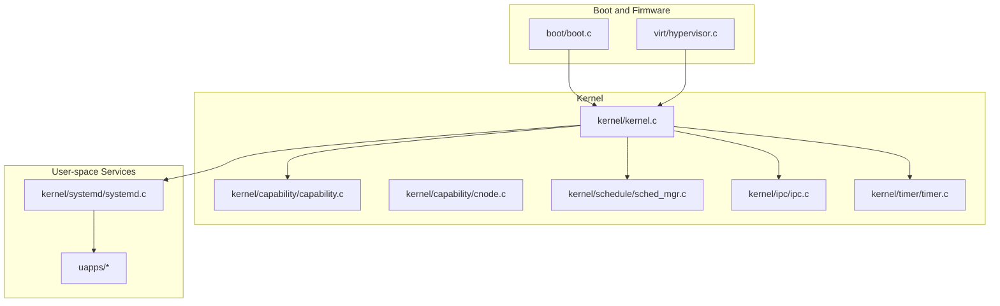
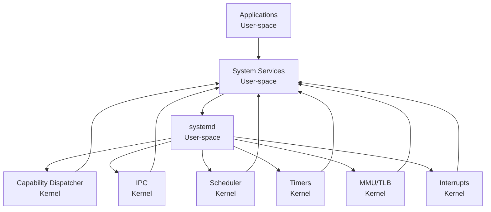
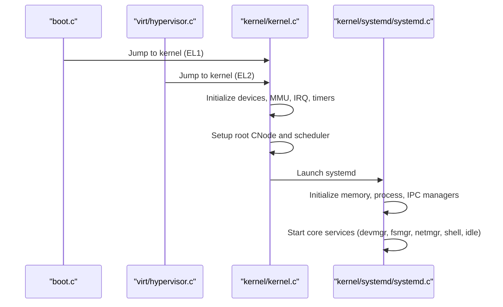
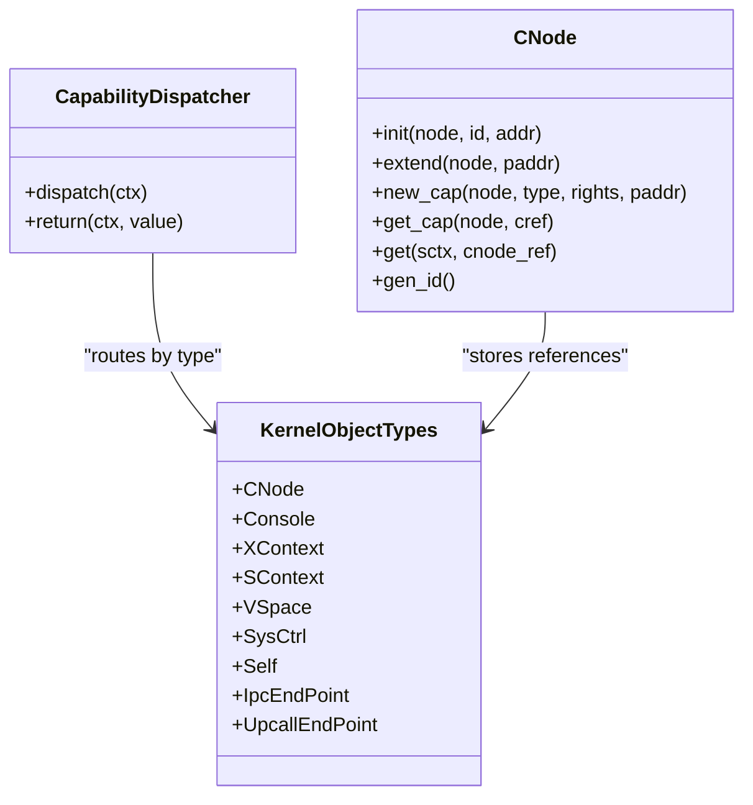
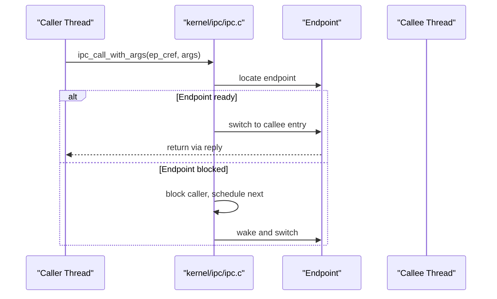
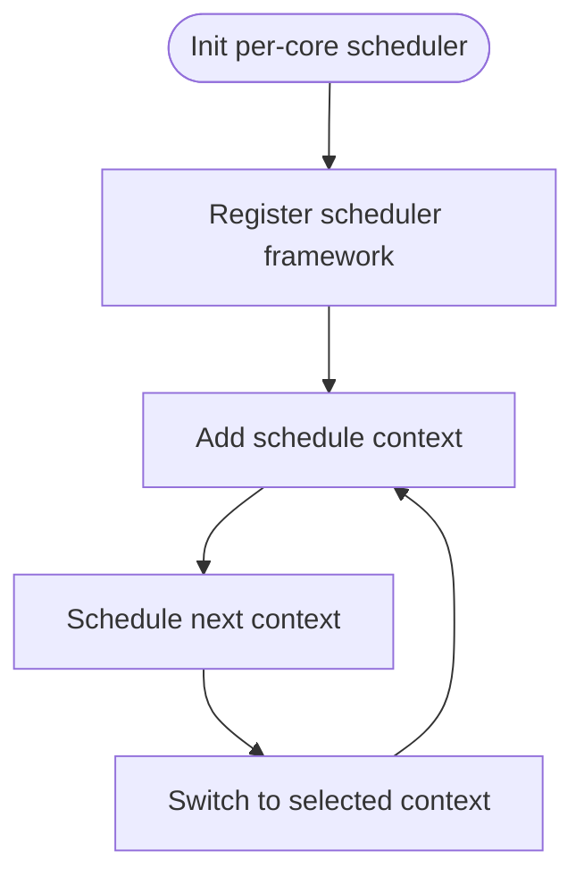
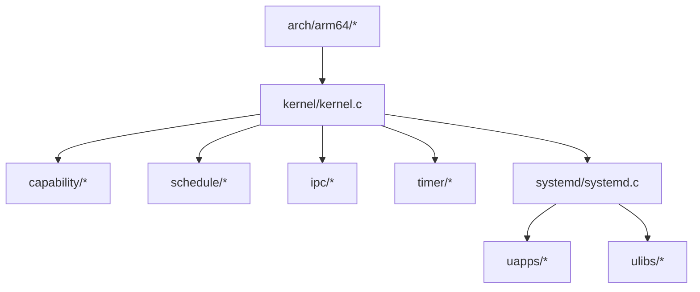

# System Architecture Overview

<cite>
**Referenced Files in This Document**
- [microkernel_design.md](file://docs/microkernel_design.md)
- [microkernel_design.md](file://docs/kernel/microkernel_design.md)
- [README.md](file://README.md)
- [kernel.c](file://kernel/kernel.c)
- [core.h](file://kernel/include/core.h)
- [capability.c](file://kernel/capability/capability.c)
- [cnode.c](file://kernel/capability/cnode.c)
- [systemd.c](file://kernel/systemd/systemd.c)
- [hypervisor.c](file://virt/hypervisor.c)
- [boot.c](file://boot/boot.c)
- [cpu.c](file://kernel/arch/arm64/cpu.c)
- [sched_mgr.c](file://kernel/schedule/sched_mgr.c)
- [sched_framework.h](file://kernel/include/scheduler/sched_framework.h)
- [ipc.c](file://kernel/ipc/ipc.c)
- [timer.c](file://kernel/timer/timer.c)
</cite>

## Table of Contents
1. [Introduction](#introduction)
2. [Project Structure](#project-structure)
3. [Core Components](#core-components)
4. [Architecture Overview](#architecture-overview)
5. [Detailed Component Analysis](#detailed-component-analysis)
6. [Dependency Analysis](#dependency-analysis)
7. [Performance Considerations](#performance-considerations)
8. [Troubleshooting Guide](#troubleshooting-guide)
9. [Conclusion](#conclusion)

## Introduction
TranquilOS is a modern microkernel operating system designed around minimal core services and a strong capability-based security model. The kernel delegates most functionality—such as memory management, process/thread lifecycle, filesystems, device management, and networking—to user-space services orchestrated by a central systemd. This separation enables improved security, modularity, and maintainability. The system supports virtualization via EL2 Type-1 hypervisor integration, SMP across multiple CPU cores, and targets multiple hardware platforms through a unified Device Tree and architecture abstraction.

## Project Structure
At a high level, the repository is organized into:
- boot: Firmware and bootloader stages, including EL3/EL2/EL1 entry paths and platform-specific device tree integration.
- kernel: The microkernel core, including architecture abstractions, capability system, scheduling, IPC, timers, and early initialization.
- virt: Hypervisor and virtualization support for EL2 environments.
- uapps: User-space system services (devmgr, fsmgr, netmgr, shell, idle).
- ulibs: Lightweight libraries consumed by user-space services (capability client APIs, ELF parsing, graphics, etc.).
- platform: Platform-specific device tree sources and link scripts for Raspberry Pi and QEMU virtual machines.
- docs: Architectural and design documents.

**Diagram sources**
- [boot.c](file://boot/boot.c#L1-L176)
- [hypervisor.c](file://virt/hypervisor.c#L1-L149)
- [kernel.c](file://kernel/kernel.c#L1-L225)
- [capability.c](file://kernel/capability/capability.c#L1-L58)
- [cnode.c](file://kernel/capability/cnode.c#L1-L95)
- [sched_mgr.c](file://kernel/schedule/sched_mgr.c#L1-L167)
- [ipc.c](file://kernel/ipc/ipc.c#L1-L114)
- [timer.c](file://kernel/timer/timer.c#L1-L59)
- [systemd.c](file://kernel/systemd/systemd.c#L1-L247)

**Section sources**
- [README.md](file://README.md#L1-L42)
- [boot.c](file://boot/boot.c#L1-L176)
- [kernel.c](file://kernel/kernel.c#L1-L225)
- [systemd.c](file://kernel/systemd/systemd.c#L1-L247)

## Core Components
- Microkernel core: Initializes devices, MMU, interrupts, timers, and schedules user-space systemd. It remains minimal, deferring heavy lifting to user-space.
- Capability system: Provides typed capabilities and capability nodes (CNodes) for fine-grained access control and object references.
- User-space systemd: Bootstraps core services (devmgr, fsmgr, netmgr, shell, idle) and manages processes, memory, and IPC.
- Virtualization: EL2 hypervisor path for Type-1 virtualization, enabling VMs and kernels to co-exist.
- SMP and scheduling: Per-core schedulers with a framework abstraction supporting multiple scheduling policies.
- IPC: Fast, control-flow-oriented IPC enabling immediate context switches between endpoints for low-latency communication.
- Timers: High-resolution timer infrastructure integrated with the scheduler and per-CPU timer managers.

**Section sources**
- [kernel.c](file://kernel/kernel.c#L125-L224)
- [capability.c](file://kernel/capability/capability.c#L14-L58)
- [cnode.c](file://kernel/capability/cnode.c#L9-L95)
- [systemd.c](file://kernel/systemd/systemd.c#L15-L247)
- [hypervisor.c](file://virt/hypervisor.c#L101-L145)
- [sched_mgr.c](file://kernel/schedule/sched_mgr.c#L105-L162)
- [ipc.c](file://kernel/ipc/ipc.c#L9-L114)
- [timer.c](file://kernel/timer/timer.c#L5-L59)

## Architecture Overview
TranquilOS follows a classic microkernel philosophy: a tiny kernel with minimal services, while most OS functionality resides in user-space. The kernel exposes a capability-based ABI for privileged operations and IPC, while user-space systemd orchestrates services and resources. The system supports:
- Minimal kernel: Only essential services (exception handling, interrupts, timers, scheduling, capability dispatch, and IPC) live in kernel space.
- Capability-based security: Capabilities encapsulate rights and references to kernel objects, enforced by the kernel’s capability dispatcher.
- Delegation to user-space: Memory management, process/thread creation, filesystems, device drivers, and networking are implemented as user-space services.
- Virtualization: EL2 Type-1 hypervisor path allows running a VM alongside the kernel, controlled by a hypervisor service.
- SMP: Per-core schedulers coordinate execution across CPUs with a modular scheduler framework.
- Hardware abstraction: Architecture-specific modules (ARM64) handle CPU privilege levels, MMU, and interrupts.

**Diagram sources**
- [capability.c](file://kernel/capability/capability.c#L14-L58)
- [ipc.c](file://kernel/ipc/ipc.c#L9-L114)
- [sched_mgr.c](file://kernel/schedule/sched_mgr.c#L105-L162)
- [timer.c](file://kernel/timer/timer.c#L5-L59)
- [kernel.c](file://kernel/kernel.c#L125-L224)
- [systemd.c](file://kernel/systemd/systemd.c#L217-L247)

## Detailed Component Analysis

### Kernel Boot and Early Initialization
The kernel initializes per-CPU devices, MMU, interrupts, timers, and registers the root CNode and scheduler. It then starts the user-space systemd, which becomes the central orchestrator for all services.

**Diagram sources**
- [boot.c](file://boot/boot.c#L82-L136)
- [hypervisor.c](file://virt/hypervisor.c#L101-L145)
- [kernel.c](file://kernel/kernel.c#L125-L224)
- [systemd.c](file://kernel/systemd/systemd.c#L217-L247)

**Section sources**
- [boot.c](file://boot/boot.c#L82-L136)
- [kernel.c](file://kernel/kernel.c#L125-L224)
- [systemd.c](file://kernel/systemd/systemd.c#L217-L247)

### Capability-Based Security Model
Capabilities are typed references to kernel objects with associated rights. The kernel routes capability calls to specialized handlers based on object type. CNodes serve as capability stores for each process, enabling dynamic extension and safe referencing.

**Diagram sources**
- [capability.c](file://kernel/capability/capability.c#L14-L58)
- [cnode.c](file://kernel/capability/cnode.c#L9-L95)

**Section sources**
- [capability.c](file://kernel/capability/capability.c#L14-L58)
- [cnode.c](file://kernel/capability/cnode.c#L9-L95)

### IPC and Upcalls
IPC enables immediate control-flow transfers between endpoints, bypassing the scheduler for latency-sensitive operations. Upcalls allow kernel-originated callbacks into user-space services.

**Diagram sources**
- [ipc.c](file://kernel/ipc/ipc.c#L9-L114)

**Section sources**
- [ipc.c](file://kernel/ipc/ipc.c#L9-L114)

### Scheduler and SMP
The scheduler manager coordinates per-core schedulers and supports multiple scheduling frameworks. The framework abstraction allows pluggable policies and per-CPU assignment.

**Diagram sources**
- [sched_mgr.c](file://kernel/schedule/sched_mgr.c#L105-L162)
- [sched_framework.h](file://kernel/include/scheduler/sched_framework.h#L11-L18)

**Section sources**
- [sched_mgr.c](file://kernel/schedule/sched_mgr.c#L105-L162)
- [sched_framework.h](file://kernel/include/scheduler/sched_framework.h#L11-L18)

### Virtualization and Hardware Abstraction
The system supports EL2 Type-1 virtualization, allowing a hypervisor to run alongside the kernel. Privilege levels are abstracted to distinguish user, kernel, hypervisor, and secure modes.

**Diagram sources**
- [cpu.c](file://kernel/arch/arm64/cpu.c#L9-L20)
- [hypervisor.c](file://virt/hypervisor.c#L101-L145)
- [boot.c](file://boot/boot.c#L138-L136)

**Section sources**
- [cpu.c](file://kernel/arch/arm64/cpu.c#L9-L20)
- [hypervisor.c](file://virt/hypervisor.c#L101-L145)
- [boot.c](file://boot/boot.c#L138-L136)

## Dependency Analysis
The kernel depends on architecture-specific modules for CPU privilege, MMU, and interrupts. User-space systemd depends on capability and ELF libraries to load and manage services. IPC and scheduling are tightly coupled with the capability system for access control.

**Diagram sources**
- [kernel.c](file://kernel/kernel.c#L1-L25)
- [systemd.c](file://kernel/systemd/systemd.c#L1-L14)
- [README.md](file://README.md#L19-L34)

**Section sources**
- [kernel.c](file://kernel/kernel.c#L1-L25)
- [systemd.c](file://kernel/systemd/systemd.c#L1-L14)
- [README.md](file://README.md#L19-L34)

## Performance Considerations
- Capability dispatch overhead is minimized by routing to specialized handlers and avoiding unnecessary permission checks in hot paths.
- IPC avoids scheduler-dependent handoffs by switching directly to target endpoints, reducing latency.
- Per-CPU schedulers reduce contention and improve responsiveness under SMP workloads.
- High-resolution timers integrate with the scheduler to support precise scheduling and timeouts.

[No sources needed since this section provides general guidance]

## Troubleshooting Guide
- Boot failures: Verify Device Tree entries for kernel, hypervisor, and systemd; ensure correct CurrentEL transitions.
- Capability errors: Confirm capability types and rights; ensure CNode references are valid and extended as needed.
- IPC deadlocks: Check endpoint readiness and blocking states; ensure replies are issued to unblock callers.
- Scheduler issues: Validate per-CPU scheduler registration and framework selection; confirm affinity masks align with CPU topology.

**Section sources**
- [boot.c](file://boot/boot.c#L34-L45)
- [capability.c](file://kernel/capability/capability.c#L14-L58)
- [cnode.c](file://kernel/capability/cnode.c#L66-L95)
- [ipc.c](file://kernel/ipc/ipc.c#L78-L114)
- [sched_mgr.c](file://kernel/schedule/sched_mgr.c#L131-L147)

## Conclusion
TranquilOS embraces a clean microkernel architecture: a small, secure kernel with a capability-based ABI, delegating OS services to user-space systemd and its services. This design yields strong isolation, modularity, and maintainability, while supporting virtualization, SMP, and diverse hardware platforms through architecture abstraction and Device Tree integration.