# Boot Process Architecture

<cite>
**Referenced Files in This Document**
- [boot.S](file://boot/arch/arm64/boot.S)
- [boot.c](file://boot/boot.c)
- [bootmm.c](file://boot/mm/bootmm.c)
- [mm_translation.c](file://boot/mm/mm_translation.c)
- [device_tree.c](file://kernel/device/device_tree.c)
- [power_manager.c](file://boot/power_manager.c)
- [cpu.c](file://kernel/arch/arm64/cpu.c)
- [hypervisor.c](file://virt/hypervisor.c)
- [systemd.c](file://kernel/systemd/systemd.c)
- [bcm2711-rpi-cm4.dts](file://platform/CM4/dts/bcm2711-rpi-cm4.dts)
</cite>

## Table of Contents
1. [Introduction](#introduction)
2. [Project Structure](#project-structure)
3. [Core Components](#core-components)
4. [Architecture Overview](#architecture-overview)
5. [Detailed Component Analysis](#detailed-component-analysis)
6. [Dependency Analysis](#dependency-analysis)
7. [Performance Considerations](#performance-considerations)
8. [Troubleshooting Guide](#troubleshooting-guide)
9. [Conclusion](#conclusion)

## Introduction
This document describes the boot process architecture across three privilege levels (EL3/EL2/EL1) and the handoff to user-space systemd. It explains the multi-stage boot sequence, device tree parsing, CPU initialization, memory management, and the dual-boot capability supporting both direct kernel boot and hypervisor-assisted boot. It also documents platform-specific boot considerations and boot-time security measures.

## Project Structure
The boot process spans several layers:
- Boot stage (EL3/EL2/EL1) code under boot/ and virt/
- Kernel-side boot entry and early initialization under kernel/arch/arm64/boot/
- Device tree parsing and early device initialization under kernel/device/
- Memory subsystem initialization under boot/mm/
- Power management for CPU bring-up under boot/power_manager.c
- Platform device tree sources under platform/*/dts/

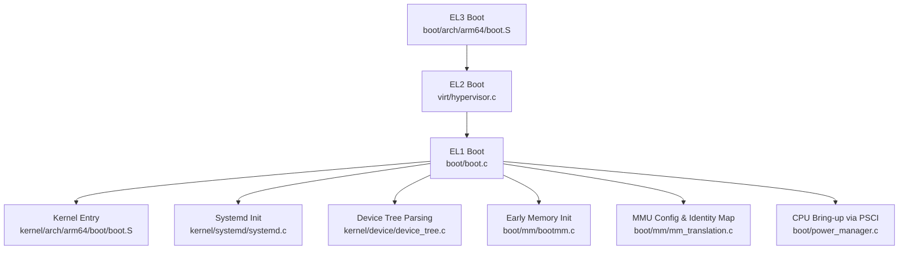

**Diagram sources**
- [boot.S](file://boot/arch/arm64/boot.S#L1-L115)
- [boot.c](file://boot/boot.c#L1-L176)
- [hypervisor.c](file://virt/hypervisor.c#L1-L149)
- [device_tree.c](file://kernel/device/device_tree.c#L1-L95)
- [bootmm.c](file://boot/mm/bootmm.c#L1-L29)
- [mm_translation.c](file://boot/mm/mm_translation.c#L1-L225)
- [power_manager.c](file://boot/power_manager.c#L1-L27)
- [systemd.c](file://kernel/systemd/systemd.c#L1-L247)

**Section sources**
- [boot.S](file://boot/arch/arm64/boot.S#L1-L115)
- [boot.c](file://boot/boot.c#L1-L176)
- [hypervisor.c](file://virt/hypervisor.c#L1-L149)
- [device_tree.c](file://kernel/device/device_tree.c#L1-L95)
- [bootmm.c](file://boot/mm/bootmm.c#L1-L29)
- [mm_translation.c](file://boot/mm/mm_translation.c#L1-L225)
- [power_manager.c](file://boot/power_manager.c#L1-L27)
- [systemd.c](file://kernel/systemd/systemd.c#L1-L247)

## Core Components
- EL3 boot entry initializes stacks per CPU, clears BSS, and branches to EL2 or EL1 depending on the primary CPU.
- EL2 boot entry parses the device tree, initializes early devices, sets up interrupts, and either hands off to a hypervisor image or returns to EL1.
- EL1 boot entry initializes console, device tree, early devices, boot memory allocator, and powers on secondary CPUs via PSCI; then remaps memory and jumps to the kernel.
- Kernel entry initializes stacks, clears BSS, and dispatches to kernel_start_primary/secondary.
- Hypervisor initializes interrupt controller, early devices, boot memory, creates VM/VCPU, and runs the VM.
- Systemd initializes memory managers, IPC, process manager, loads core services from the ramdisk, and runs them.

**Section sources**
- [boot.S](file://boot/arch/arm64/boot.S#L1-L115)
- [boot.c](file://boot/boot.c#L1-L176)
- [hypervisor.c](file://virt/hypervisor.c#L1-L149)
- [systemd.c](file://kernel/systemd/systemd.c#L1-L247)

## Architecture Overview
The boot architecture supports two primary paths:
- Direct kernel boot: EL3 -> EL1 -> kernel -> systemd
- Hypervisor-assisted boot: EL3 -> EL2 -> hypervisor -> VM/VCPU -> kernel -> systemd

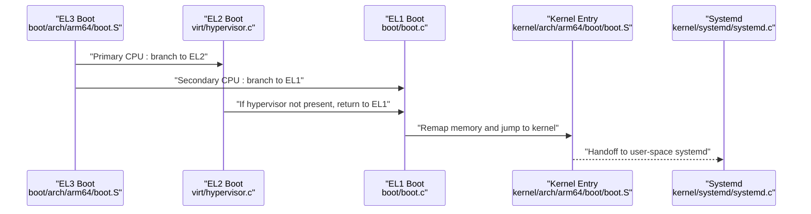

**Diagram sources**
- [boot.S](file://boot/arch/arm64/boot.S#L24-L76)
- [boot.c](file://boot/boot.c#L114-L136)
- [hypervisor.c](file://virt/hypervisor.c#L101-L145)
- [systemd.c](file://kernel/systemd/systemd.c#L217-L246)

## Detailed Component Analysis

### EL3 Boot Stage
- Determines current EL from CurrentEL and routes to _start_el3/_start_el2/_start_el1.
- Allocates per-CPU stack, clears BSS, and branches to EL2 or EL1.
- On primary CPU, prepares device tree and prints splash; on secondary, loops.

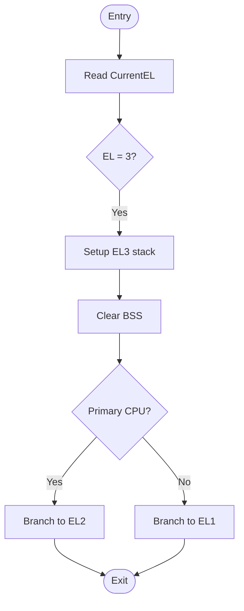

**Diagram sources**
- [boot.S](file://boot/arch/arm64/boot.S#L10-L49)

**Section sources**
- [boot.S](file://boot/arch/arm64/boot.S#L1-L115)

### EL2 Boot Stage (Hypervisor-Assisted Path)
- Initializes device tree, early devices, disables interrupts, prints splash, sets up IRQ manager, boot memory, and key devices.
- Initializes MM sparse banks, physical CPU context, and exception handlers.
- Registers hypervisor HVC handler and enables interrupts.
- Creates VM/VCPU and runs VM; if no hypervisor node is found, returns to EL1.

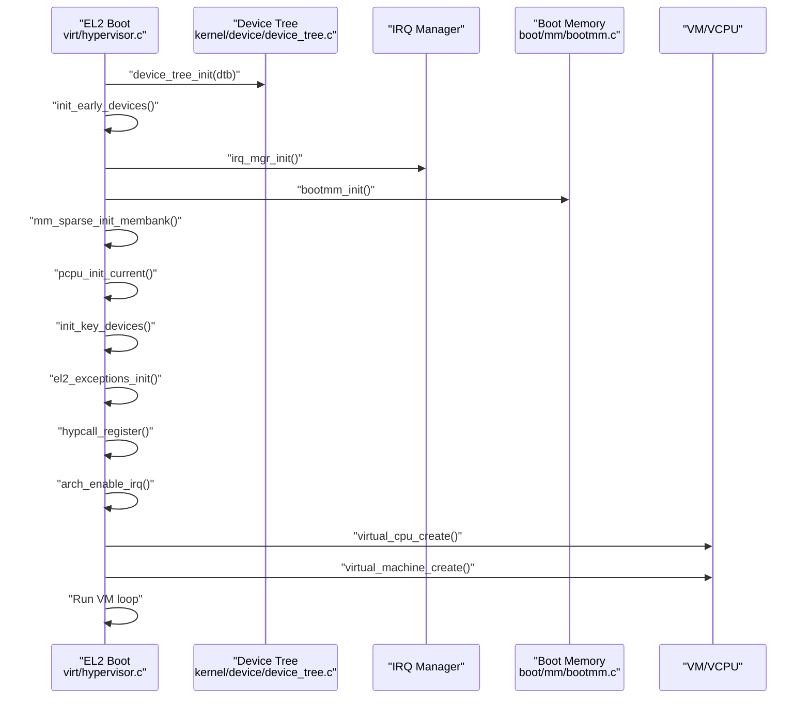

**Diagram sources**
- [hypervisor.c](file://virt/hypervisor.c#L101-L145)
- [device_tree.c](file://kernel/device/device_tree.c#L10-L23)
- [bootmm.c](file://boot/mm/bootmm.c#L26-L29)

**Section sources**
- [hypervisor.c](file://virt/hypervisor.c#L1-L149)
- [device_tree.c](file://kernel/device/device_tree.c#L1-L95)
- [bootmm.c](file://boot/mm/bootmm.c#L1-L29)

### EL1 Boot Stage (Direct Kernel Path)
- Initializes console, device tree, disables interrupts, initializes early and key devices, prints splash.
- Initializes boot memory allocator, iterates CPU nodes, powers on secondary CPUs via PSCI, and remaps memory.
- Remaps memory, resolves kernel address from device tree, and jumps to kernel.

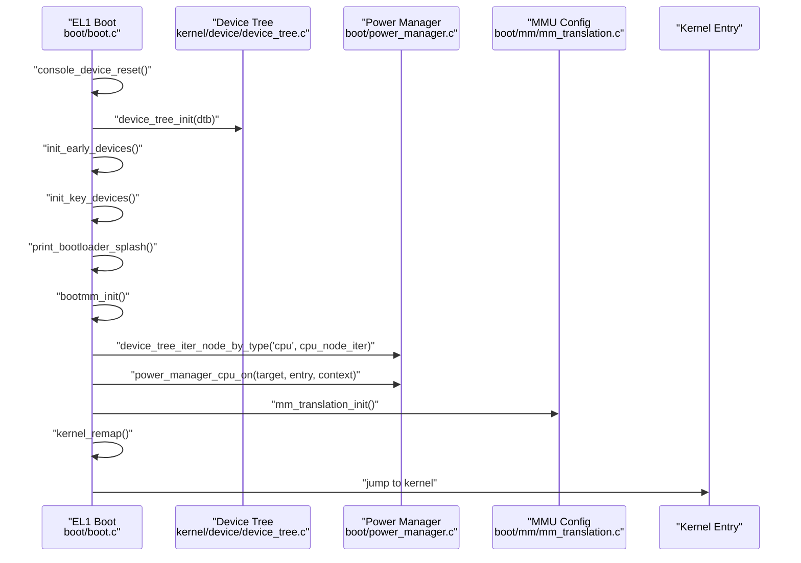

**Diagram sources**
- [boot.c](file://boot/boot.c#L82-L107)
- [device_tree.c](file://kernel/device/device_tree.c#L10-L23)
- [power_manager.c](file://boot/power_manager.c#L12-L21)
- [mm_translation.c](file://boot/mm/mm_translation.c#L99-L162)

**Section sources**
- [boot.c](file://boot/boot.c#L1-L176)
- [power_manager.c](file://boot/power_manager.c#L1-L27)
- [mm_translation.c](file://boot/mm/mm_translation.c#L1-L225)

### Memory Initialization and Early Boot Memory Management
- Boot memory allocator is initialized from linker-defined symbols and used to allocate page tables during early boot.
- MMU is configured with appropriate MAIR attributes, TCR settings, and identity mapping for the initial stage.
- Page allocator is set globally for subsequent allocations.

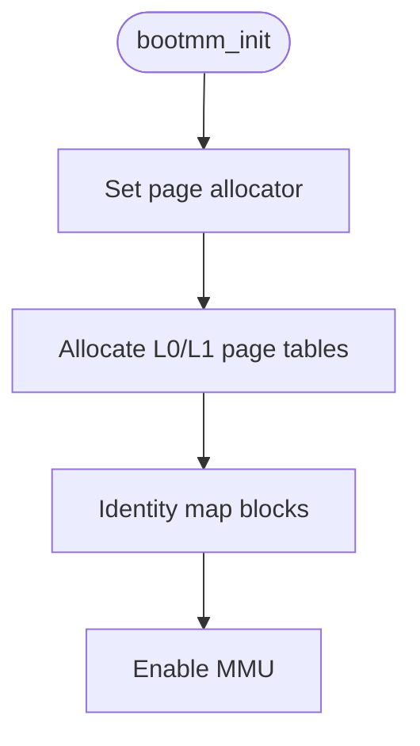

**Diagram sources**
- [bootmm.c](file://boot/mm/bootmm.c#L26-L29)
- [mm_translation.c](file://boot/mm/mm_translation.c#L99-L162)

**Section sources**
- [bootmm.c](file://boot/mm/bootmm.c#L1-L29)
- [mm_translation.c](file://boot/mm/mm_translation.c#L1-L225)

### Device Tree Parsing and CPU Initialization
- Device tree is parsed and validated; compatible nodes are queried to locate kernel/hypervisor/systemd regions.
- CPU nodes are iterated; if enable-method is "psci", secondary CPUs are powered on via power manager.
- Privilege level detection and CPU ID retrieval are exposed via HAL.

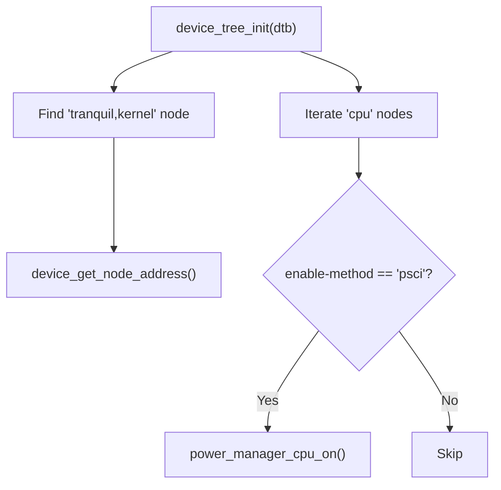

**Diagram sources**
- [device_tree.c](file://kernel/device/device_tree.c#L10-L95)
- [boot.c](file://boot/boot.c#L68-L80)
- [power_manager.c](file://boot/power_manager.c#L12-L21)
- [cpu.c](file://kernel/arch/arm64/cpu.c#L9-L20)

**Section sources**
- [device_tree.c](file://kernel/device/device_tree.c#L1-L95)
- [boot.c](file://boot/boot.c#L68-L102)
- [power_manager.c](file://boot/power_manager.c#L1-L27)
- [cpu.c](file://kernel/arch/arm64/cpu.c#L1-L44)

### Dual-Boot Capability: Direct Kernel vs Hypervisor-Assisted
- If a hypervisor-compatible node exists in the device tree, EL2 branches to the hypervisor entry point; otherwise, it returns to EL1.
- The hypervisor initializes VM/VCPU and runs the VM, which eventually boots the kernel and systemd.

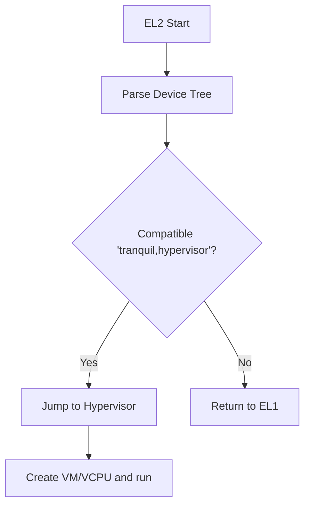

**Diagram sources**
- [boot.c](file://boot/boot.c#L114-L136)
- [hypervisor.c](file://virt/hypervisor.c#L137-L144)

**Section sources**
- [boot.c](file://boot/boot.c#L114-L136)
- [hypervisor.c](file://virt/hypervisor.c#L101-L145)

### Handoff to User-Space Systemd
- After kernel entry, the system transitions to user-space systemd.
- Systemd initializes memory managers, IPC, process manager, and loads core services from the ramdisk.
- Services are mapped into virtual memory, threads are created according to deployment modes, and services are started.

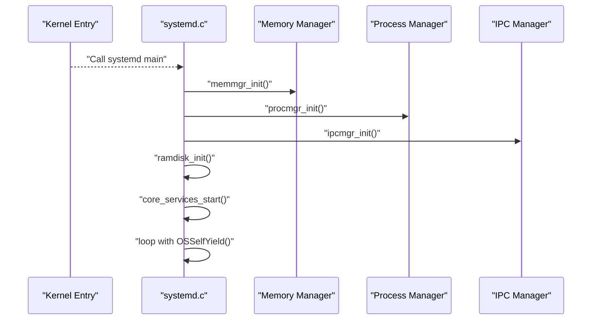

**Diagram sources**
- [systemd.c](file://kernel/systemd/systemd.c#L217-L246)

**Section sources**
- [systemd.c](file://kernel/systemd/systemd.c#L1-L247)

### Platform-Specific Boot Considerations
- Platform device tree defines memory layout and regions for boot, kernel, systemd, and ramdisk.
- Example: CM4 DTS reserves regions for tranquil,boot, tranquil,kernel, tranquil,systemd, and tranquil,ramdisk.

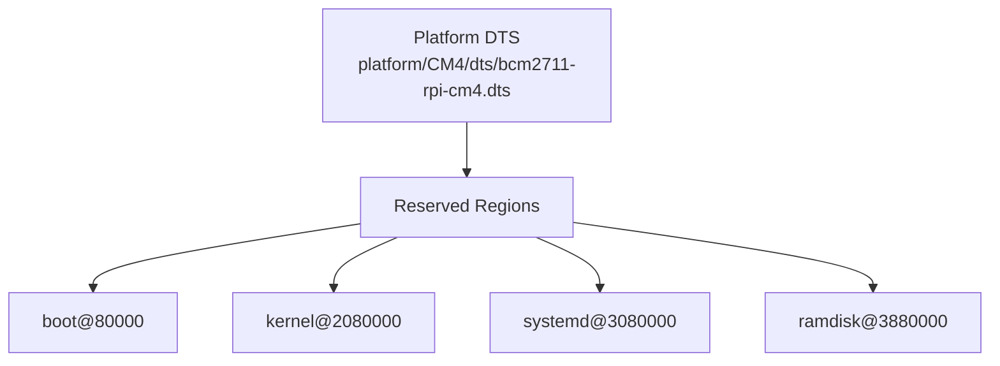

**Diagram sources**
- [bcm2711-rpi-cm4.dts](file://platform/CM4/dts/bcm2711-rpi-cm4.dts#L11-L34)

**Section sources**
- [bcm2711-rpi-cm4.dts](file://platform/CM4/dts/bcm2711-rpi-cm4.dts#L1-L80)

## Dependency Analysis
- EL3 boot depends on architecture-specific register definitions and branching to EL2/EL1.
- EL1 boot depends on device tree parsing, power management, and memory translation modules.
- Hypervisor boot depends on device tree, IRQ manager, boot memory, and VM/VCPU creation.
- Systemd depends on memory managers, process manager, IPC manager, and ramdisk.

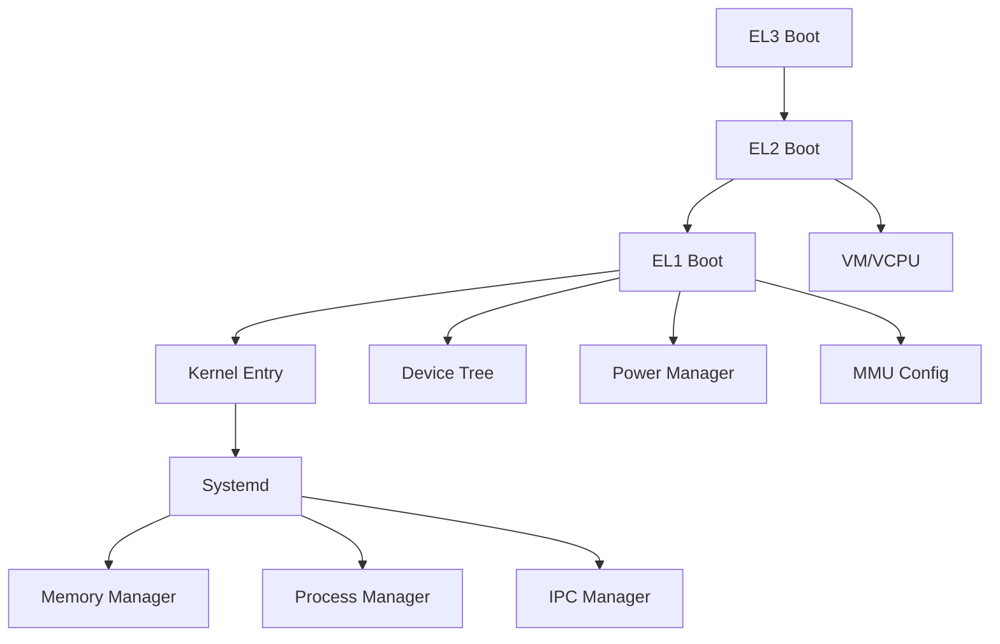

**Diagram sources**
- [boot.S](file://boot/arch/arm64/boot.S#L1-L115)
- [boot.c](file://boot/boot.c#L1-L176)
- [hypervisor.c](file://virt/hypervisor.c#L1-L149)
- [systemd.c](file://kernel/systemd/systemd.c#L1-L247)

**Section sources**
- [boot.S](file://boot/arch/arm64/boot.S#L1-L115)
- [boot.c](file://boot/boot.c#L1-L176)
- [hypervisor.c](file://virt/hypervisor.c#L1-L149)
- [systemd.c](file://kernel/systemd/systemd.c#L1-L247)

## Performance Considerations
- Minimizing BSS clearing overhead by using efficient str/xzr loops.
- Using identity mapping for early stages reduces translation overhead.
- PSCI-based CPU bring-up avoids busy-waiting and leverages platform power orchestration.
- Sparse memory initialization reduces footprint during early boot.

[No sources needed since this section provides general guidance]

## Troubleshooting Guide
- If the kernel node is missing in the device tree, the boot process logs an error and halts.
- If the hypervisor node is missing, EL2 returns to EL1; verify platform DTS region layout.
- If MMU configuration fails or unsupported granule is detected, the boot process panics.
- If PSCI CPU on fails, check power manager registration and platform enable-method.

**Section sources**
- [boot.c](file://boot/boot.c#L34-L45)
- [boot.c](file://boot/boot.c#L124-L128)
- [mm_translation.c](file://boot/mm/mm_translation.c#L124-L126)
- [power_manager.c](file://boot/power_manager.c#L12-L21)

## Conclusion
The boot process is structured around a clear multi-stage pipeline from EL3 to EL1, with optional EL2 hypervisor involvement. Device tree drives discovery of boot components, while PSCI and early memory management enable robust CPU bring-up and memory setup. The system cleanly hands off to user-space systemd for service orchestration, with platform-specific DTS ensuring proper memory layout.