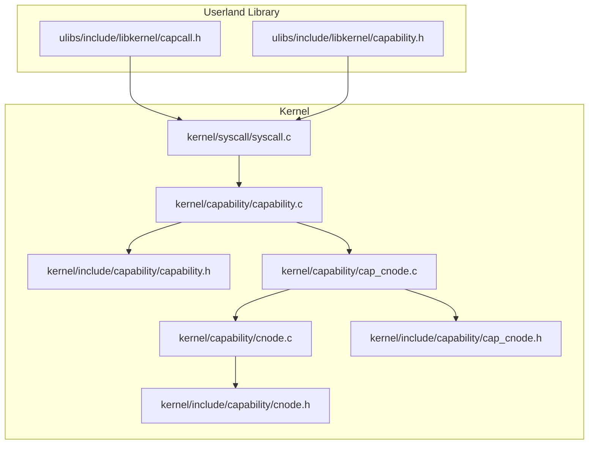
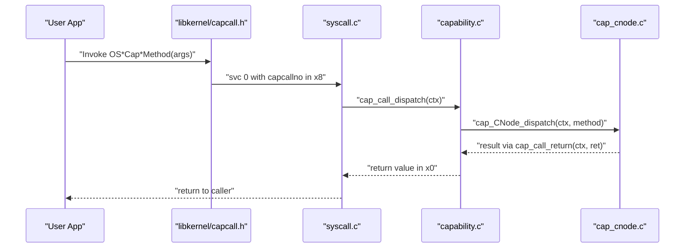
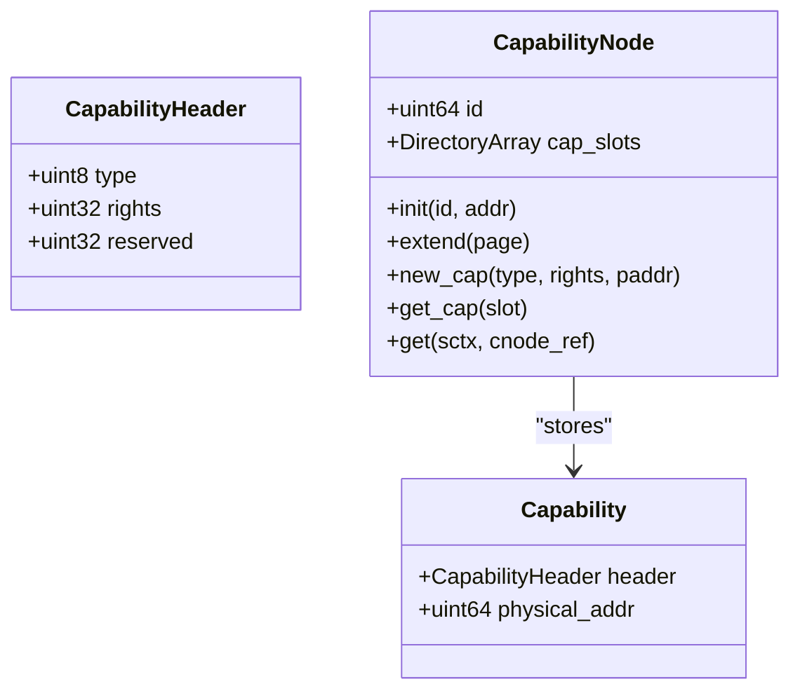
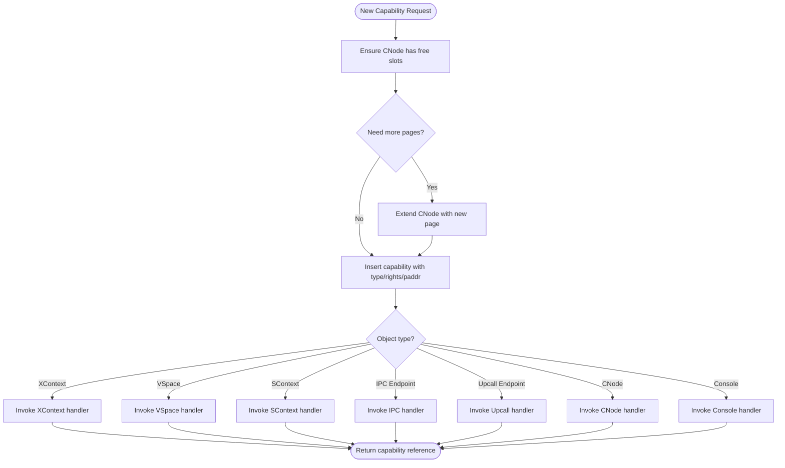
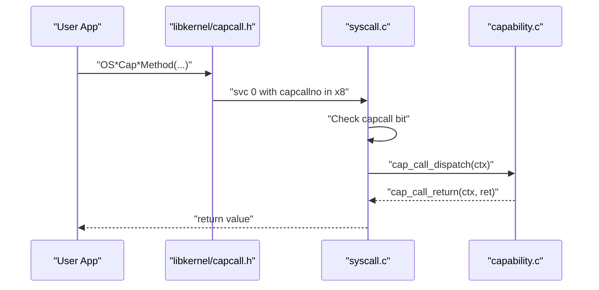
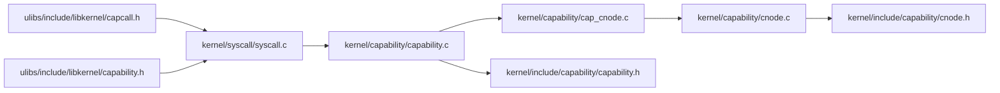

# Capability-Based Security Model

<cite>
**Referenced Files in This Document**
- [capability.c](file://kernel/capability/capability.c)
- [capability.h](file://kernel/include/capability/capability.h)
- [cnode.c](file://kernel/capability/cnode.c)
- [cnode.h](file://kernel/include/capability/cnode.h)
- [cap_cnode.h](file://kernel/include/capability/cap_cnode.h)
- [cap_cnode.c](file://kernel/capability/cap_cnode.c)
- [capability.h](file://ulibs/include/libkernel/capability.h)
- [capcall.h](file://ulibs/include/libkernel/capcall.h)
- [syscall.c](file://kernel/syscall/syscall.c)
- [syscall.h](file://kernel/include/syscall/syscall.h)
- [cap_sysctrl.h](file://kernel/include/capability/cap_sysctrl.h)
- [cap_vspace.h](file://kernel/include/capability/cap_vspace.h)
- [cap_xcontext.h](file://kernel/include/capability/cap_xcontext.h)
- [cap_console.h](file://kernel/include/capability/cap_console.h)
- [cap_self.h](file://kernel/include/capability/cap_self.h)
</cite>

## Table of Contents
1. [Introduction](#introduction)
2. [Project Structure](#project-structure)
3. [Core Components](#core-components)
4. [Architecture Overview](#architecture-overview)
5. [Detailed Component Analysis](#detailed-component-analysis)
6. [Dependency Analysis](#dependency-analysis)
7. [Performance Considerations](#performance-considerations)
8. [Troubleshooting Guide](#troubleshooting-guide)
9. [Conclusion](#conclusion)

## Introduction
This document explains the capability-based security model implemented in the kernel. It covers how capabilities serve as both kernel object identifiers and fine-grained permission tokens, the CNode (capability node) architecture for organizing capabilities, and how capabilities replace traditional Unix permissions with precise access control. It documents capability creation, lookup, and destruction, permission inheritance via capability references, and the capcall mechanism that routes capability invocations to the appropriate kernel object handlers. Concrete examples are drawn from the codebase to illustrate capability objects, permission bits, and access control enforcement. Finally, it discusses security implications, attack surface reduction, and contributions to system safety and reliability.

## Project Structure
The capability system spans several kernel subsystems and a small userland library:
- Kernel capability dispatch and core structures live under kernel/capability and kernel/include/capability.
- The capability call interface and syscall routing are under kernel/syscall.
- The userland library (ulibs) defines capability object types, capability references, and the capcall macros used by applications.

**Diagram sources**
- [capability.c](file://kernel/capability/capability.c#L1-L58)
- [capability.h](file://kernel/include/capability/capability.h#L1-L26)
- [cnode.c](file://kernel/capability/cnode.c#L1-L95)
- [cnode.h](file://kernel/include/capability/cnode.h#L1-L29)
- [cap_cnode.c](file://kernel/capability/cap_cnode.c#L1-L184)
- [cap_cnode.h](file://kernel/include/capability/cap_cnode.h#L1-L12)
- [capability.h](file://ulibs/include/libkernel/capability.h#L1-L141)
- [capcall.h](file://ulibs/include/libkernel/capcall.h#L1-L177)
- [syscall.c](file://kernel/syscall/syscall.c#L1-L20)

**Section sources**
- [capability.c](file://kernel/capability/capability.c#L1-L58)
- [capability.h](file://kernel/include/capability/capability.h#L1-L26)
- [cnode.c](file://kernel/capability/cnode.c#L1-L95)
- [cnode.h](file://kernel/include/capability/cnode.h#L1-L29)
- [cap_cnode.c](file://kernel/capability/cap_cnode.c#L1-L184)
- [cap_cnode.h](file://kernel/include/capability/cap_cnode.h#L1-L12)
- [capability.h](file://ulibs/include/libkernel/capability.h#L1-L141)
- [capcall.h](file://ulibs/include/libkernel/capcall.h#L1-L177)
- [syscall.c](file://kernel/syscall/syscall.c#L1-L20)

## Core Components
- Capability header and structure: A capability consists of a header containing the kernel object type and rights bitmap, plus a physical address field pointing to the kernel object’s storage or metadata.
- Capability reference: A compact 64-bit value encoding the capability node ID and slot index, enabling efficient lookup and passing across system boundaries.
- Capability node (CNode): An array-like container of capabilities, organized per scheduling context, with dynamic extension via additional pages.
- Dispatch and capcall: The kernel routes capability invocations through a unified dispatcher that decodes the capability type and method, then invokes the corresponding handler.

Key implementation references:
- Capability structure and rights mask: [capability.h](file://kernel/include/capability/capability.h#L9-L20)
- Capability reference layout: [capability.h](file://ulibs/include/libkernel/capability.h#L44-L50)
- CNode structure and APIs: [cnode.h](file://kernel/include/capability/cnode.h#L11-L14), [cnode.c](file://kernel/capability/cnode.c#L9-L21)
- Capability creation and insertion: [cnode.c](file://kernel/capability/cnode.c#L23-L59)
- Capability retrieval and CNode resolution: [cnode.c](file://kernel/capability/cnode.c#L61-L90)
- Capability dispatch entry: [capability.c](file://kernel/capability/capability.c#L14-L54)
- Capcall syscall routing: [syscall.c](file://kernel/syscall/syscall.c#L8-L20)

**Section sources**
- [capability.h](file://kernel/include/capability/capability.h#L9-L20)
- [capability.h](file://ulibs/include/libkernel/capability.h#L44-L50)
- [cnode.h](file://kernel/include/capability/cnode.h#L11-L14)
- [cnode.c](file://kernel/capability/cnode.c#L9-L21)
- [cnode.c](file://kernel/capability/cnode.c#L23-L59)
- [cnode.c](file://kernel/capability/cnode.c#L61-L90)
- [capability.c](file://kernel/capability/capability.c#L14-L54)
- [syscall.c](file://kernel/syscall/syscall.c#L8-L20)

## Architecture Overview
The capability system restructures kernel interactions around capability objects and capability references. Instead of relying on numeric UIDs/GIDs and filesystem ACLs, each operation targets a capability handle carrying explicit rights. The capcall mechanism encodes capability type and method in a dedicated register, allowing the kernel to dispatch to the correct handler.

**Diagram sources**
- [capcall.h](file://ulibs/include/libkernel/capcall.h#L15-L27)
- [syscall.c](file://kernel/syscall/syscall.c#L8-L20)
- [capability.c](file://kernel/capability/capability.c#L14-L54)
- [cap_cnode.c](file://kernel/capability/cap_cnode.c#L163-L184)

## Detailed Component Analysis

### Capability Header and Reference
Capabilities are typed tokens with embedded permission rights. The header encodes:
- Object type: identifies the kernel object kind (e.g., XContext, VSpace, SContext, CNode, Console, SysCtrl, Self, IPC endpoint, Upcall endpoint).
- Rights: a 32-bit bitmap controlling permitted operations.
- Reserved: padding for alignment.

The capability reference packs two fields:
- cnode_id: identifies the capability node holding the capability.
- slot_idx: identifies the slot index within that node.

This design enables compact passing of capability handles across system boundaries and fast lookup in the current scheduling context’s CNode.

References:
- Capability header and structure: [capability.h](file://kernel/include/capability/capability.h#L11-L20)
- Capability reference layout: [capability.h](file://ulibs/include/libkernel/capability.h#L44-L50)

**Section sources**
- [capability.h](file://kernel/include/capability/capability.h#L11-L20)
- [capability.h](file://ulibs/include/libkernel/capability.h#L44-L50)

### Capability Node (CNode) Architecture
A CNode is a per-scheduling-context container of capabilities. It supports:
- Initialization with a backing page region.
- Dynamic extension by allocating additional pages and appending them to the internal directory array.
- Creation of new capabilities with a given type, rights, and physical address.
- Retrieval of a capability by its reference and resolution of a target CNode via a CNode capability stored in a slot.

Key behaviors:
- cnode_init initializes the node and binds a page region to hold slots.
- cnode_extend appends a new page to the directory array.
- cnode_new_cap creates a capability, sets type/rights/physical address, and inserts it into the first available slot.
- cnode_get resolves a CNode reference to a pointer to the target CNode, supporting nested CNodes.

References:
- CNode structure and APIs: [cnode.h](file://kernel/include/capability/cnode.h#L11-L14), [cnode.h](file://kernel/include/capability/cnode.h#L16-L26)
- Implementation: [cnode.c](file://kernel/capability/cnode.c#L9-L21), [cnode.c](file://kernel/capability/cnode.c#L23-L59), [cnode.c](file://kernel/capability/cnode.c#L61-L90)

**Diagram sources**
- [capability.h](file://kernel/include/capability/capability.h#L11-L20)
- [cnode.h](file://kernel/include/capability/cnode.h#L11-L14)
- [cnode.c](file://kernel/capability/cnode.c#L9-L21)
- [cnode.c](file://kernel/capability/cnode.c#L23-L59)
- [cnode.c](file://kernel/capability/cnode.c#L61-L90)

**Section sources**
- [cnode.h](file://kernel/include/capability/cnode.h#L11-L14)
- [cnode.h](file://kernel/include/capability/cnode.h#L16-L26)
- [cnode.c](file://kernel/capability/cnode.c#L9-L21)
- [cnode.c](file://kernel/capability/cnode.c#L23-L59)
- [cnode.c](file://kernel/capability/cnode.c#L61-L90)

### Capability Creation, Destruction, and Permission Inheritance
Creation:
- New capabilities are inserted into a CNode via cnode_new_cap, which ensures backing pages are allocated and extends capacity if needed. The capability’s type and rights are set, and the physical address points to the kernel object’s storage or metadata.
- After insertion, the CNode handler may invoke the corresponding object-specific handler to finalize typed-object creation.

Destruction:
- The CNode handler includes a destroy method entry point. While the implementation currently stubs out checks, the presence of a dedicated destroy method indicates a clear separation of concerns for lifecycle management.

Permission inheritance:
- Permission inheritance occurs implicitly through capability references. A capability’s rights bitmap controls what operations can be performed via that handle. When a capability is placed into a CNode slot, it inherits the rights granted by its creator. Subsequent recipients can further refine or restrict access by creating new capabilities with narrower rights bitmaps.

References:
- Creation flow and typed-object dispatch: [cap_cnode.c](file://kernel/capability/cap_cnode.c#L23-L91)
- Destroy stub and method dispatch: [cap_cnode.c](file://kernel/capability/cap_cnode.c#L20-L21), [cap_cnode.c](file://kernel/capability/cap_cnode.c#L177-L179)
- Rights constants for CNode: [cap_cnode.h](file://kernel/include/capability/cap_cnode.h#L7-L8)

**Diagram sources**
- [cnode.c](file://kernel/capability/cnode.c#L23-L59)
- [cap_cnode.c](file://kernel/capability/cap_cnode.c#L64-L88)

**Section sources**
- [cap_cnode.c](file://kernel/capability/cap_cnode.c#L23-L91)
- [cap_cnode.c](file://kernel/capability/cap_cnode.c#L20-L21)
- [cap_cnode.c](file://kernel/capability/cap_cnode.c#L177-L179)
- [cap_cnode.h](file://kernel/include/capability/cap_cnode.h#L7-L8)

### Permission Bits and Access Control Enforcement
Permission bits are represented as 32-bit masks associated with each capability. The kernel defines right constants for major capability types, indicating create and destroy permissions. During capability invocation, the dispatcher decodes the capability type and method from the capcall number and routes to the appropriate handler. While explicit permission checks are not yet implemented in the dispatcher, the presence of rights fields and dedicated right constants establishes the foundation for enforcing access control.

References:
- Rights mask definition: [capability.h](file://kernel/include/capability/capability.h#L9)
- Right constants for major types: [cap_sysctrl.h](file://kernel/include/capability/cap_sysctrl.h#L7-L8), [cap_vspace.h](file://kernel/include/capability/cap_vspace.h#L7-L8), [cap_xcontext.h](file://kernel/include/capability/cap_xcontext.h#L7-L8), [cap_console.h](file://kernel/include/capability/cap_console.h#L7-L8), [cap_self.h](file://kernel/include/capability/cap_self.h#L7-L8)
- Dispatcher routing: [capability.c](file://kernel/capability/capability.c#L22-L53)

**Section sources**
- [capability.h](file://kernel/include/capability/capability.h#L9)
- [cap_sysctrl.h](file://kernel/include/capability/cap_sysctrl.h#L7-L8)
- [cap_vspace.h](file://kernel/include/capability/cap_vspace.h#L7-L8)
- [cap_xcontext.h](file://kernel/include/capability/cap_xcontext.h#L7-L8)
- [cap_console.h](file://kernel/include/capability/cap_console.h#L7-L8)
- [cap_self.h](file://kernel/include/capability/cap_self.h#L7-L8)
- [capability.c](file://kernel/capability/capability.c#L22-L53)

### Relationship Between Capabilities and System Calls (capcall Mechanism)
The capcall mechanism encodes capability invocations into a single register value passed to the kernel via a supervisor call. The syscall handler inspects the capcall bit and dispatches accordingly:
- If the capcall bit is set, the kernel routes to the capability dispatcher.
- Otherwise, it falls back to fast call dispatch for traditional kernel entry points.

The userland library generates capcall numbers using macros that encode:
- Capability type (shifted into upper bits)
- Method index (shifted into upper-middle bits)
- A fixed mask to mark the instruction as a capcall

References:
- Syscall routing: [syscall.c](file://kernel/syscall/syscall.c#L8-L20)
- Capcall macro generation: [capcall.h](file://ulibs/include/libkernel/capcall.h#L15-L27)
- Capability type enumeration: [capability.h](file://ulibs/include/libkernel/capability.h#L6-L18)

**Diagram sources**
- [capcall.h](file://ulibs/include/libkernel/capcall.h#L15-L27)
- [syscall.c](file://kernel/syscall/syscall.c#L8-L20)
- [capability.c](file://kernel/capability/capability.c#L14-L54)

**Section sources**
- [syscall.c](file://kernel/syscall/syscall.c#L8-L20)
- [capcall.h](file://ulibs/include/libkernel/capcall.h#L15-L27)
- [capability.h](file://ulibs/include/libkernel/capability.h#L6-L18)

### How Capabilities Replace Traditional Unix Permissions
Traditional Unix permissions rely on numeric UIDs/GIDs and mode bits on files and IPC resources. The capability model replaces this with:
- Explicit capability handles that carry both identity and authority.
- Fine-grained rights bitmaps that precisely control operations.
- Capability references that can be delegated without duplicating global state.

This reduces accidental privilege escalation and simplifies least-privilege programming. Capabilities also enable hierarchical delegation via nested CNodes, where higher-level capabilities grant access to lower-level objects while retaining control over their usage.

[No sources needed since this section provides conceptual comparison]

## Dependency Analysis
The capability system exhibits clear layering:
- Userland library defines types, references, and capcall macros.
- Syscall layer detects capcall and forwards to the capability dispatcher.
- Capability dispatcher selects the correct object handler based on capability type.
- Object handlers (e.g., CNode) manage capability lifecycle and delegate typed-object operations.

**Diagram sources**
- [capcall.h](file://ulibs/include/libkernel/capcall.h#L1-L177)
- [capability.h](file://ulibs/include/libkernel/capability.h#L1-L141)
- [syscall.c](file://kernel/syscall/syscall.c#L1-L20)
- [capability.c](file://kernel/capability/capability.c#L1-L58)
- [cap_cnode.c](file://kernel/capability/cap_cnode.c#L1-L184)
- [cnode.c](file://kernel/capability/cnode.c#L1-L95)
- [capability.h](file://kernel/include/capability/capability.h#L1-L26)
- [cnode.h](file://kernel/include/capability/cnode.h#L1-L29)

**Section sources**
- [capcall.h](file://ulibs/include/libkernel/capcall.h#L1-L177)
- [capability.h](file://ulibs/include/libkernel/capability.h#L1-L141)
- [syscall.c](file://kernel/syscall/syscall.c#L1-L20)
- [capability.c](file://kernel/capability/capability.c#L1-L58)
- [cap_cnode.c](file://kernel/capability/cap_cnode.c#L1-L184)
- [cnode.c](file://kernel/capability/cnode.c#L1-L95)
- [capability.h](file://kernel/include/capability/capability.h#L1-L26)
- [cnode.h](file://kernel/include/capability/cnode.h#L1-L29)

## Performance Considerations
- Capability references are compact (64-bit packed values) and enable O(1) slot lookup within a CNode.
- Dynamic CNode extension amortizes allocation costs across multiple insertions.
- The dispatcher uses a simple switch keyed by capability type, minimizing overhead.
- Future enhancements could include capability caching, precomputed permission masks, and batched capability transfers to reduce syscall overhead.

[No sources needed since this section provides general guidance]

## Troubleshooting Guide
Common issues and diagnostics:
- Null CNode or capability: The CNode routines panic when encountering null nodes or invalid references. Check that the scheduling context’s root CNode is initialized and that capability references are valid.
- No free slots: When inserting capabilities, ensure sufficient pages are allocated or extend the CNode before insertion.
- Wrong capability type: Handlers validate types before proceeding. Verify the capability type matches expectations (e.g., attempting to prepare a non-CNode capability).
- Permission checks: While not yet enforced in the dispatcher, ensure that capability rights are set appropriately to prevent unauthorized operations.

References:
- Panic paths and validations: [cnode.c](file://kernel/capability/cnode.c#L16-L19), [cnode.c](file://kernel/capability/cnode.c#L34-L40), [cnode.c](file://kernel/capability/cnode.c#L42-L48), [cnode.c](file://kernel/capability/cnode.c#L68-L87)
- Type validation in CNode prepare/extend: [cnode.c](file://kernel/capability/cnode.c#L78-L86), [cnode.c](file://kernel/capability/cnode.c#L113-L117), [cnode.c](file://kernel/capability/cnode.c#L148-L152)
- Dispatcher error logging: [capability.c](file://kernel/capability/capability.c#L50-L52)

**Section sources**
- [cnode.c](file://kernel/capability/cnode.c#L16-L19)
- [cnode.c](file://kernel/capability/cnode.c#L34-L40)
- [cnode.c](file://kernel/capability/cnode.c#L42-L48)
- [cnode.c](file://kernel/capability/cnode.c#L68-L87)
- [cnode.c](file://kernel/capability/cnode.c#L78-L86)
- [cnode.c](file://kernel/capability/cnode.c#L113-L117)
- [cnode.c](file://kernel/capability/cnode.c#L148-L152)
- [capability.c](file://kernel/capability/capability.c#L50-L52)

## Conclusion
The capability-based security model introduces precise, composable access control by embedding rights into capability handles and organizing them in CNodes. The capcall mechanism cleanly separates capability invocations from traditional syscalls, enabling fine-grained permission enforcement and safer delegation. While permission checks are not yet fully implemented in the dispatcher, the groundwork is established through capability headers, rights bitmaps, and dedicated right constants. As the system evolves, explicit permission enforcement and capability inheritance semantics will further strengthen security, reduce the attack surface, and improve system reliability.