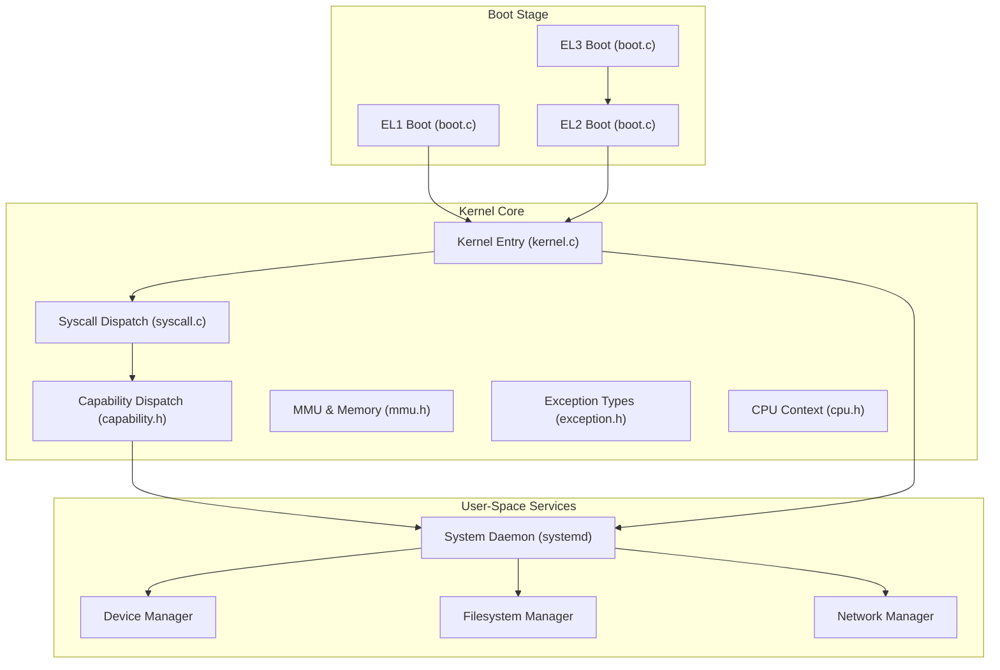
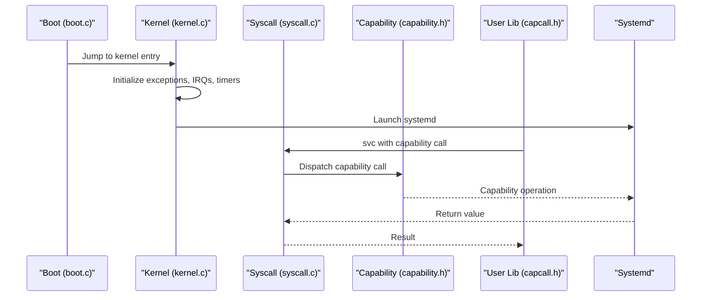
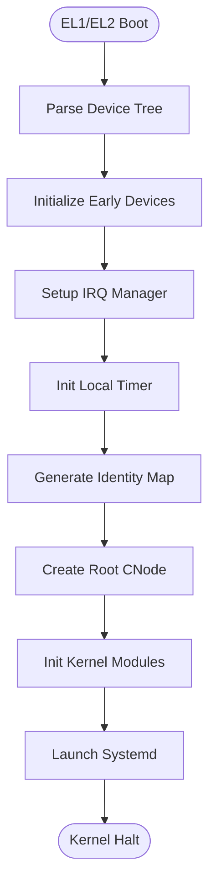
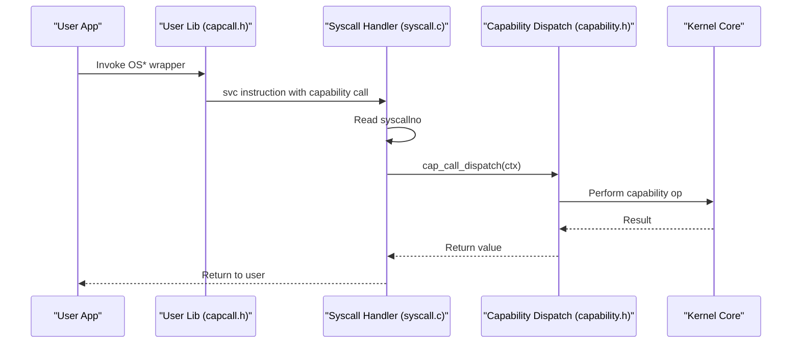
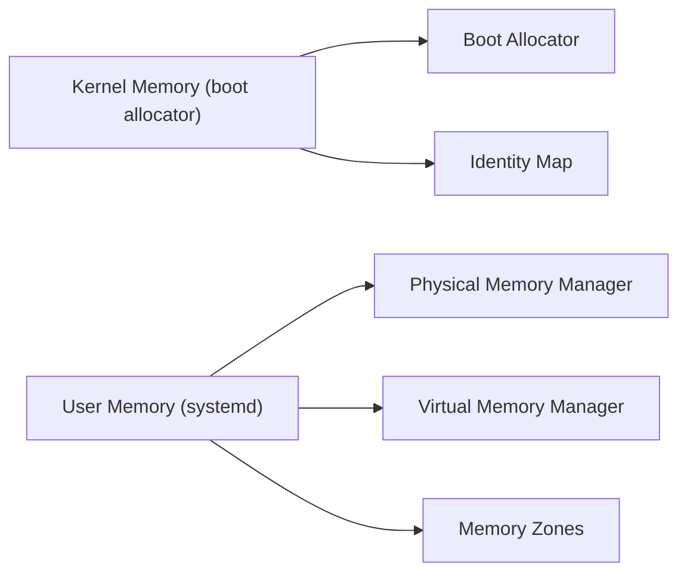
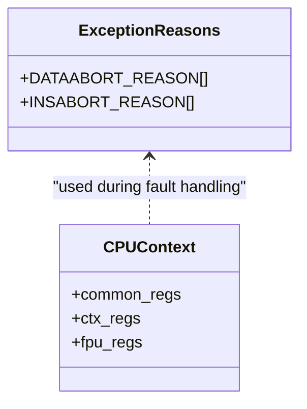
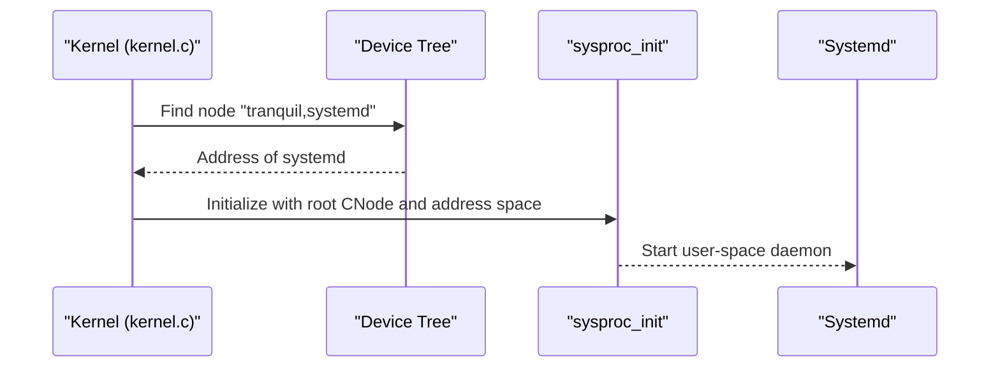
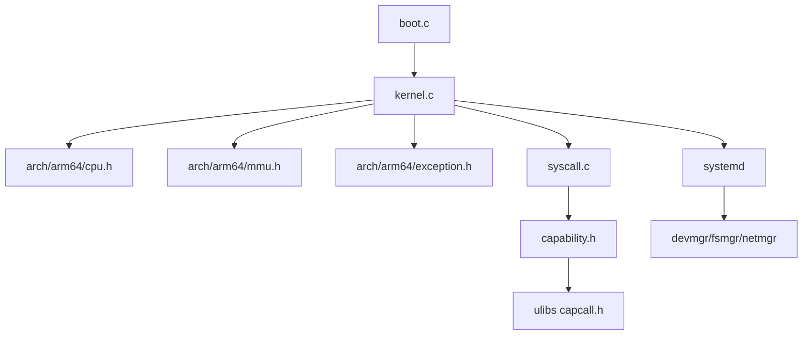

# Microkernel Design Principles

<cite>
**Referenced Files in This Document**
- [microkernel_design.md](file://docs/kernel/microkernel_design.md)
- [microkernel_design.md](file://docs/microkernel_design.md)
- [kernel.c](file://kernel/kernel.c)
- [boot.c](file://boot/boot.c)
- [syscall.c](file://kernel/syscall/syscall.c)
- [fastcall.c](file://kernel/syscall/fastcall.c)
- [capability.h](file://kernel/include/capability/capability.h)
- [cap_cnode.h](file://kernel/include/capability/cap_cnode.h)
- [capability.h](file://ulibs/include/libkernel/capability.h)
- [capcall.h](file://ulibs/include/libkernel/capcall.h)
- [mmu.h](file://kernel/include/arch/arm64/mmu.h)
- [exception.h](file://kernel/include/arch/arm64/exception.h)
- [cpu.h](file://kernel/include/arch/arm64/cpu.h)
- [core.h](file://kernel/include/core.h)
</cite>

## Table of Contents
1. [Introduction](#introduction)
2. [Project Structure](#project-structure)
3. [Core Components](#core-components)
4. [Architecture Overview](#architecture-overview)
5. [Detailed Component Analysis](#detailed-component-analysis)
6. [Dependency Analysis](#dependency-analysis)
7. [Performance Considerations](#performance-considerations)
8. [Troubleshooting Guide](#troubleshooting-guide)
9. [Conclusion](#conclusion)

## Introduction
This document explains the microkernel design principles implemented in the kernel. It focuses on why core services are minimized, how the kernel maintains a small footprint, and how functionality is delegated to user-space services. It also contrasts the microkernel approach with monolithic designs, highlights the rationale for keeping only essential components in kernel space (boot allocator, exception handling, and basic CPU management), and documents the benefits of improved reliability, security isolation, and maintainability. Concrete examples from the codebase illustrate the kernel–user boundary and service delegation.

## Project Structure
The microkernel design spans three complementary layers:
- Boot stage: EL3/EL2/EL1 boot stages and early device initialization
- Kernel core: minimal runtime (exception handling, CPU management, capability dispatch, scheduling, and memory subsystem hooks)
- User-space services: systemd and other daemons that provide filesystems, device management, networking, and higher-level services

**Diagram sources**
- [boot.c](file://boot/boot.c#L114-L136)
- [kernel.c](file://kernel/kernel.c#L125-L224)
- [syscall.c](file://kernel/syscall/syscall.c#L8-L20)
- [capability.h](file://kernel/include/capability/capability.h#L22-L25)
- [mmu.h](file://kernel/include/arch/arm64/mmu.h#L48-L58)
- [exception.h](file://kernel/include/arch/arm66/exception.h#L1-L113)
- [cpu.h](file://kernel/include/arch/arm64/cpu.h#L85-L94)

**Section sources**
- [boot.c](file://boot/boot.c#L114-L136)
- [kernel.c](file://kernel/kernel.c#L125-L224)
- [microkernel_design.md](file://docs/kernel/microkernel_design.md#L28-L43)

## Core Components
This section outlines the kernel’s minimal core and how it delegates work to user-space.

- Boot and CPU management
  - Early boot stages initialize devices, set up identity mapping, and jump to the kernel entry. The kernel initializes exception handling, interrupts, timers, and per-CPU modules before handing off to user-space systemd.
  - The kernel sets up page tables and enables interrupts only after essential subsystems are ready.

- Capability-based system call interface
  - The kernel exposes a capability-based ABI via a dedicated system call path. Calls are dispatched either as “capcalls” (capability-based) or “fastcalls” (minimal kernel helpers). This keeps kernel interfaces small and secure.

- Memory management delegation
  - The kernel retains only a boot-time allocator for early initialization and to hand out memory to systemd. User-space systemd manages physical memory, virtual memory, and memory zones.

- Scheduling and context switching
  - The kernel separates execution contexts from scheduling contexts and performs context switches between user threads. Scheduling is delegated to user-space while kernel remains responsible for low-level switching and privilege transitions.

- Device and peripheral orchestration
  - Device discovery and early device initialization occur in the boot stage. The kernel initializes IRQ managers and timers, then user-space systemd takes over device management and driver services.

Benefits of this approach:
- Reliability: fewer kernel routines reduce attack surface and failure points
- Security: strict capability checks and minimal kernel privileges
- Maintainability: user-space services can evolve independently; kernel stays small and stable

**Section sources**
- [kernel.c](file://kernel/kernel.c#L125-L224)
- [syscall.c](file://kernel/syscall/syscall.c#L8-L20)
- [fastcall.c](file://kernel/syscall/fastcall.c#L6-L17)
- [capability.h](file://kernel/include/capability/capability.h#L22-L25)
- [microkernel_design.md](file://docs/kernel/microkernel_design.md#L6-L8)
- [microkernel_design.md](file://docs/microkernel_design.md#L12-L14)

## Architecture Overview
The microkernel architecture enforces a strict kernel–user boundary:
- Kernel space: exception handling, CPU management, capability dispatch, minimal memory allocation, and scheduling primitives
- User space: systemd and specialized services (device manager, filesystem manager, network manager)

**Diagram sources**
- [boot.c](file://boot/boot.c#L47-L56)
- [kernel.c](file://kernel/kernel.c#L202-L211)
- [syscall.c](file://kernel/syscall/syscall.c#L8-L20)
- [capability.h](file://kernel/include/capability/capability.h#L22-L25)
- [capcall.h](file://ulibs/include/libkernel/capcall.h#L15-L27)

## Detailed Component Analysis

### Kernel Entry and Boot-to-User Handoff
- The kernel entry coordinates device tree parsing, early device initialization, timer and IRQ setup, page table generation, root capability node creation, and module initialization. After disabling the boot-time allocator and enabling interrupts, it starts systemd and halts further kernel execution.
- The boot stage supports EL2 Type-1 virtualization and EL1 direct boot, selecting the appropriate path based on the current execution level.

**Diagram sources**
- [kernel.c](file://kernel/kernel.c#L125-L224)
- [boot.c](file://boot/boot.c#L82-L107)

**Section sources**
- [kernel.c](file://kernel/kernel.c#L125-L224)
- [boot.c](file://boot/boot.c#L82-L107)

### Capability-Based System Call Dispatch
- The kernel distinguishes two call families:
  - Capcalls: capability-based operations that manipulate kernel objects (contexts, VSpaces, CNodes, IPC endpoints, timers, consoles, etc.) and are defined in the user-space library
  - Fastcalls: minimal kernel helpers reserved for very basic operations
- The syscall handler reads the call number, routes to the appropriate dispatcher, and switches to user mode with the correct address space.

**Diagram sources**
- [capcall.h](file://ulibs/include/libkernel/capcall.h#L15-L27)
- [syscall.c](file://kernel/syscall/syscall.c#L8-L20)
- [capability.h](file://kernel/include/capability/capability.h#L22-L25)

**Section sources**
- [syscall.c](file://kernel/syscall/syscall.c#L8-L20)
- [fastcall.c](file://kernel/syscall/fastcall.c#L6-L17)
- [capability.h](file://kernel/include/capability/capability.h#L22-L25)
- [capability.h](file://ulibs/include/libkernel/capability.h#L44-L50)
- [capability.h](file://ulibs/include/libkernel/capability.h#L52-L139)

### Memory Management: Minimal Kernel Footprint
- The kernel retains only a boot-time allocator for early initialization and to allocate memory for systemd. User-space systemd manages physical memory, virtual memory management, and memory zones.
- The kernel defines memory layout constants and page table descriptors for identity mapping and virtual regions, ensuring a clean separation between kernel-managed and user-managed memory.

**Diagram sources**
- [microkernel_design.md](file://docs/kernel/microkernel_design.md#L6-L8)
- [microkernel_design.md](file://docs/microkernel_design.md#L12-L14)
- [mmu.h](file://kernel/include/arch/arm64/mmu.h#L48-L58)

**Section sources**
- [microkernel_design.md](file://docs/kernel/microkernel_design.md#L6-L8)
- [microkernel_design.md](file://docs/microkernel_design.md#L12-L14)
- [mmu.h](file://kernel/include/arch/arm64/mmu.h#L48-L58)

### Exception Handling and CPU Management
- The kernel initializes exception handling early and defines exception categories and reasons for data and instruction aborts. CPU context structures capture registers for both user and kernel modes, enabling precise privilege transitions and context switching.
- These mechanisms underpin the minimal kernel by isolating fault handling and CPU state management in kernel space while delegating policy to user-space.

**Diagram sources**
- [exception.h](file://kernel/include/arch/arm64/exception.h#L39-L111)
- [cpu.h](file://kernel/include/arch/arm64/cpu.h#L85-L94)

**Section sources**
- [kernel.c](file://kernel/kernel.c#L134-L135)
- [kernel.c](file://kernel/kernel.c#L164-L169)
- [exception.h](file://kernel/include/arch/arm64/exception.h#L1-L113)
- [cpu.h](file://kernel/include/arch/arm64/cpu.h#L85-L94)

### User-Space Service Delegation Examples
- Systemd launch: The kernel locates the systemd node in the device tree and initializes the system process with the root capability node and kernel address space.
- Capability object types and methods: The user-space library enumerates kernel object types (XContext, SContext, VSpace, CNode, Console, SysCtrl, IPC endpoints, Upcall endpoints) and method IDs for capability calls, demonstrating the kernel–user boundary.

**Diagram sources**
- [kernel.c](file://kernel/kernel.c#L202-L211)
- [capability.h](file://ulibs/include/libkernel/capability.h#L6-L41)

**Section sources**
- [kernel.c](file://kernel/kernel.c#L202-L211)
- [capability.h](file://ulibs/include/libkernel/capability.h#L6-L41)

## Dependency Analysis
The kernel’s minimal design creates clear dependency boundaries:
- Boot depends on device tree parsing and early device initialization
- Kernel core depends on HAL abstractions for CPU, interrupts, and MMU
- User-space services depend on capability-based APIs exposed by the kernel

**Diagram sources**
- [boot.c](file://boot/boot.c#L82-L107)
- [kernel.c](file://kernel/kernel.c#L125-L224)
- [cpu.h](file://kernel/include/arch/arm64/cpu.h#L85-L94)
- [mmu.h](file://kernel/include/arch/arm64/mmu.h#L48-L58)
- [exception.h](file://kernel/include/arch/arm64/exception.h#L1-L113)
- [syscall.c](file://kernel/syscall/syscall.c#L8-L20)
- [capability.h](file://kernel/include/capability/capability.h#L22-L25)
- [capcall.h](file://ulibs/include/libkernel/capcall.h#L15-L27)

**Section sources**
- [boot.c](file://boot/boot.c#L82-L107)
- [kernel.c](file://kernel/kernel.c#L125-L224)
- [syscall.c](file://kernel/syscall/syscall.c#L8-L20)
- [capability.h](file://kernel/include/capability/capability.h#L22-L25)
- [capcall.h](file://ulibs/include/libkernel/capcall.h#L15-L27)

## Performance Considerations
- Minimizing kernel code reduces overhead and improves predictability
- Capability-based IPC avoids heavy kernel involvement in communication, improving latency and real-time behavior
- User-space services can be optimized independently without kernel changes
- Early boot and device initialization reduce time-to-service availability

## Troubleshooting Guide
- Boot failures
  - Verify device tree nodes for kernel and systemd; ensure identity mapping and jump sequences are correct
- Systemd not found
  - Confirm the device tree contains the “tranquil,systemd” node and that sysproc initialization succeeds
- Capability call errors
  - Check syscall routing and capability dispatch; ensure the correct method IDs and object types are used in user-space wrappers
- Exception handling
  - Review exception categories and abort reasons to diagnose faults during capability operations or memory mapping

**Section sources**
- [kernel.c](file://kernel/kernel.c#L202-L211)
- [syscall.c](file://kernel/syscall/syscall.c#L8-L20)
- [capability.h](file://kernel/include/capability/capability.h#L22-L25)
- [exception.h](file://kernel/include/arch/arm64/exception.h#L39-L111)

## Conclusion
The microkernel design prioritizes a minimal kernel by retaining only essential services—exception handling, CPU management, capability dispatch, and a boot-time allocator—while delegating all other functionality to user-space services. This approach yields improved reliability, strong security isolation, and enhanced maintainability. The kernel–user boundary is enforced through capability-based system calls and a strict separation of concerns, demonstrated by concrete code paths in the boot stage, kernel entry, syscall dispatch, and user-space capability wrappers.