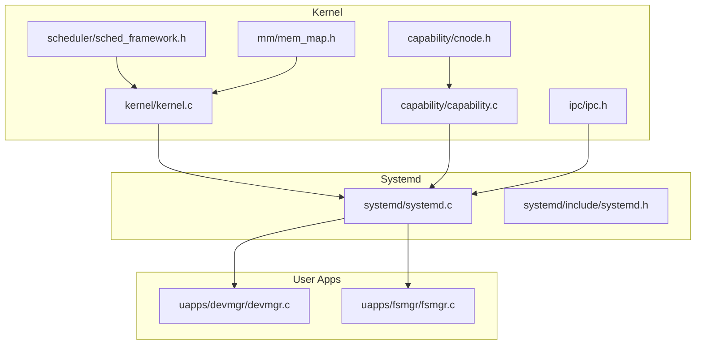
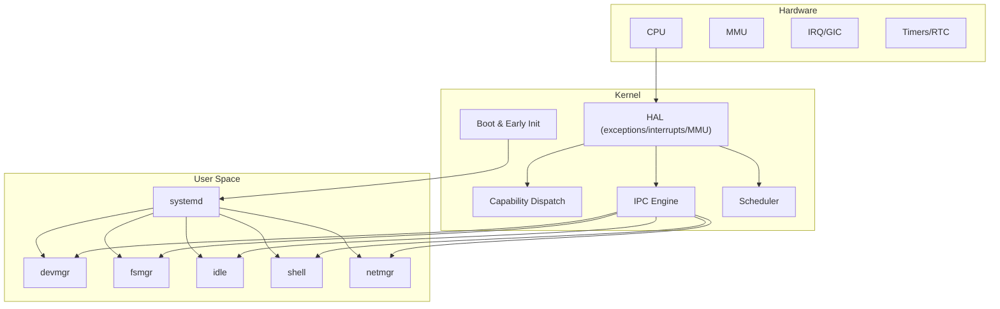
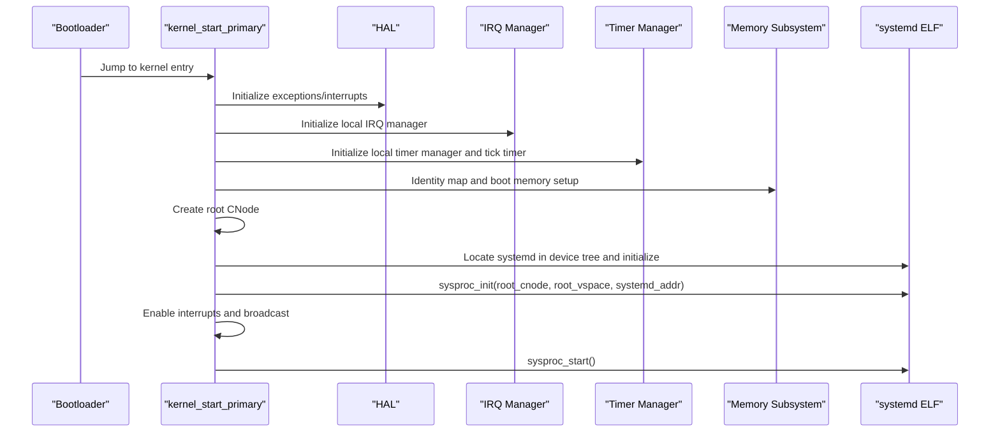
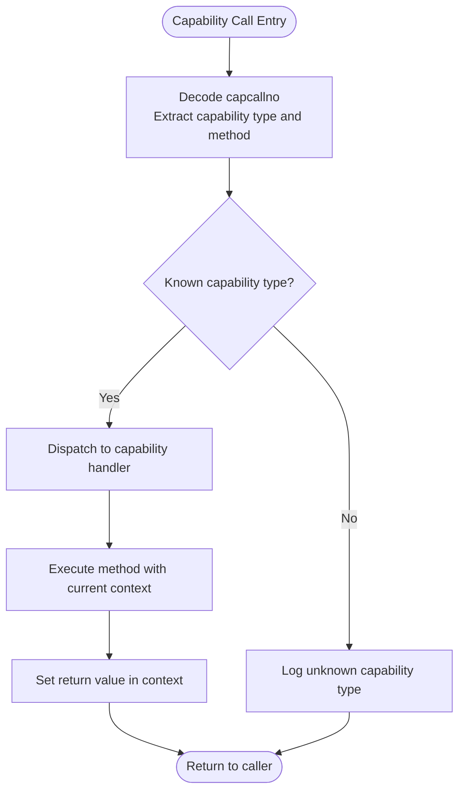
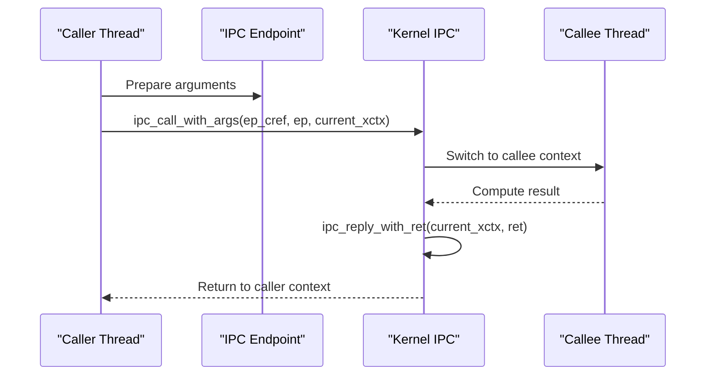
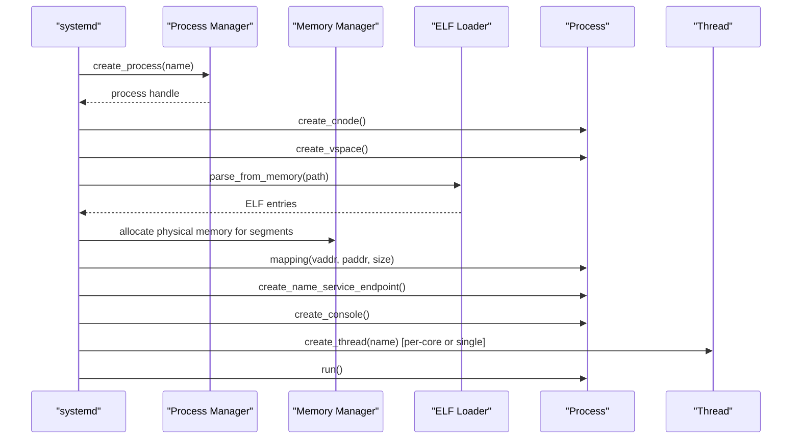
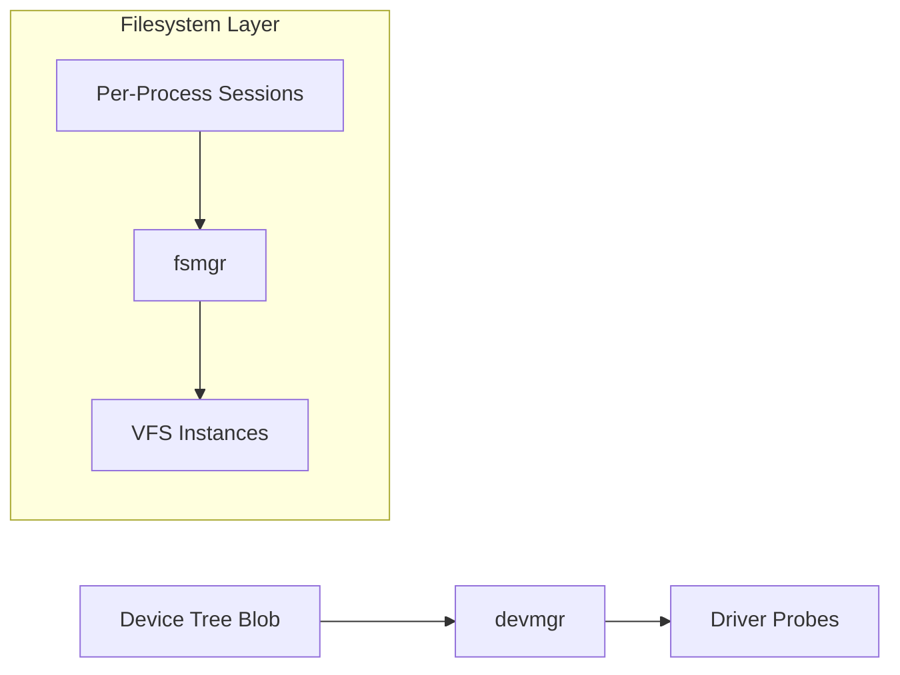
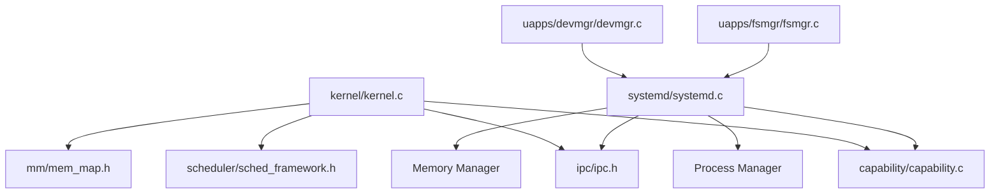

# System Architecture

<cite>
**Referenced Files in This Document**
- [README.md](file://README.md)
- [microkernel_design.md](file://docs/microkernel_design.md)
- [kernel.c](file://kernel/kernel.c)
- [core.h](file://kernel/include/core.h)
- [capability.h](file://kernel/include/capability/capability.h)
- [capability.c](file://kernel/capability/capability.c)
- [ipc.h](file://kernel/include/ipc/ipc.h)
- [systemd.c](file://kernel/systemd/systemd.c)
- [systemd.h](file://kernel/systemd/include/systemd.h)
- [devmgr.c](file://uapps/devmgr/devmgr.c)
- [fsmgr.c](file://uapps/fsmgr/fsmgr.c)
- [sched_framework.h](file://kernel/include/scheduler/sched_framework.h)
- [mem_map.h](file://kernel/include/mm/mem_map.h)
</cite>

## Table of Contents
1. [Introduction](#introduction)
2. [Project Structure](#project-structure)
3. [Core Components](#core-components)
4. [Architecture Overview](#architecture-overview)
5. [Detailed Component Analysis](#detailed-component-analysis)
6. [Dependency Analysis](#dependency-analysis)
7. [Performance Considerations](#performance-considerations)
8. [Troubleshooting Guide](#troubleshooting-guide)
9. [Conclusion](#conclusion)

## Introduction
This document describes the system architecture of TranquilOS, a microkernel-based operating system. It explains the microkernel design principles, the capability-based security model, and the user-space services architecture. It documents system boundaries, component interactions, and data flows between the kernel, user-space services, and applications. It also outlines the rationale for keeping certain components in kernel space while delegating others to user space, and discusses the security and reliability implications of these choices.

## Project Structure
TranquilOS is organized into several major areas:
- Kernel: Core microkernel, architecture-specific HAL, scheduling, memory management hooks, capability dispatch, IPC, and system bootstrap.
- Systemd: User-space core service orchestrator that initializes and manages core services (device manager, filesystem manager, idle, shell, network manager).
- User Applications (uapps): Example services such as device manager, filesystem manager, idle, and shell.
- Documentation: Architectural design documents and theory supporting the microkernel approach.

**Diagram sources**
- [kernel.c](file://kernel/kernel.c#L1-L225)
- [capability.c](file://kernel/capability/capability.c#L1-L58)
- [systemd.c](file://kernel/systemd/systemd.c#L1-L247)
- [systemd.h](file://kernel/systemd/include/systemd.h#L1-L32)
- [devmgr.c](file://uapps/devmgr/devmgr.c#L1-L62)
- [fsmgr.c](file://uapps/fsmgr/fsmgr.c#L1-L216)
- [ipc.h](file://kernel/include/ipc/ipc.h#L1-L13)
- [sched_framework.h](file://kernel/include/scheduler/sched_framework.h#L1-L20)
- [mem_map.h](file://kernel/include/mm/mem_map.h#L1-L29)

**Section sources**
- [README.md](file://README.md#L1-L42)
- [microkernel_design.md](file://docs/microkernel_design.md#L1-L43)

## Core Components
- Kernel core: Initializes devices, interrupts, timers, memory subsystems, creates the root capability node, and starts the system daemon. It runs the scheduler loop and handles early boot sequences.
- Capability system: Provides capability-based object dispatch and returns via a unified capability call interface. Capabilities encapsulate rights and object identity.
- IPC: Supports immediate control-flow switching IPC to reduce latency and improve real-time characteristics.
- Systemd: User-space supervisor that loads ELF binaries, allocates physical memory, maps segments, creates address spaces and capability nodes, and launches core services.
- User-space services: Device manager, filesystem manager, idle, shell, and network manager, each implemented as separate ELF binaries loaded by systemd.

Key implementation references:
- Kernel initialization and bootstrap: [kernel_start_primary](file://kernel/kernel.c#L125-L225), [kernel_start_secondary](file://kernel/kernel.c#L61-L123)
- Root capability node creation: [root_cnode_init](file://kernel/kernel.c#L50-L59)
- Capability dispatch: [cap_call_dispatch](file://kernel/capability/capability.c#L14-L54)
- Systemd service orchestration: [systemd main](file://kernel/systemd/systemd.c#L217-L247), [core services start](file://kernel/systemd/systemd.c#L207-L215)
- Capability header and rights: [capability.h](file://kernel/include/capability/capability.h#L11-L25)
- IPC call/return primitives: [ipc.h](file://kernel/include/ipc/ipc.h#L9-L12)

**Section sources**
- [kernel.c](file://kernel/kernel.c#L50-L225)
- [capability.c](file://kernel/capability/capability.c#L14-L58)
- [capability.h](file://kernel/include/capability/capability.h#L11-L25)
- [ipc.h](file://kernel/include/ipc/ipc.h#L9-L12)
- [systemd.c](file://kernel/systemd/systemd.c#L207-L247)

## Architecture Overview
The system follows a strict microkernel design:
- Minimal kernel: Only essential services reside in kernel space (exception/interrupt handling, MMU, scheduler, capability dispatch, IPC primitives).
- User-space services: Memory management, process/thread lifecycle, device management, filesystems, and networking are delegated to user-space services orchestrated by systemd.
- Capability-based security: All kernel interactions occur through capabilities with explicit rights, enforcing fine-grained access control.
- Immediate IPC: IPC avoids scheduler-dependent handoffs by enabling direct control-flow transfers between endpoints.

**Diagram sources**
- [kernel.c](file://kernel/kernel.c#L125-L225)
- [capability.c](file://kernel/capability/capability.c#L14-L54)
- [systemd.c](file://kernel/systemd/systemd.c#L217-L247)
- [devmgr.c](file://uapps/devmgr/devmgr.c#L1-L62)
- [fsmgr.c](file://uapps/fsmgr/fsmgr.c#L1-L216)

## Detailed Component Analysis

### Kernel Core and Bootstrap
- Purpose: Initialize per-CPU devices, enable interrupts, set up memory mappings, create the root capability node, and start the system daemon.
- Responsibilities:
  - Early device initialization and identity mapping.
  - Root CNode allocation and setup.
  - Local timer and scheduler initialization.
  - Starting the system daemon and entering idle loop.

**Diagram sources**
- [kernel.c](file://kernel/kernel.c#L125-L225)

**Section sources**
- [kernel.c](file://kernel/kernel.c#L125-L225)
- [core.h](file://kernel/include/core.h#L5-L8)

### Capability-Based Security Model
- Design: Kernel objects are represented as capabilities with typed headers and embedded rights. Users invoke kernel services via capability calls.
- Dispatch: The capability dispatcher decodes the capability ID and method, then routes to the appropriate capability handler.
- Rights: Rights are encoded in the capability header to enforce fine-grained permissions.

**Diagram sources**
- [capability.c](file://kernel/capability/capability.c#L14-L54)
- [capability.h](file://kernel/include/capability/capability.h#L11-L25)

**Section sources**
- [capability.c](file://kernel/capability/capability.c#L14-L54)
- [capability.h](file://kernel/include/capability/capability.h#L11-L25)

### Immediate IPC Mechanism
- Design: IPC enables direct control-flow switching between endpoints, bypassing scheduler-dependent handoffs to improve latency and real-time behavior.
- Interfaces: IPC call and reply primitives operate on endpoint capabilities and current execute contexts.

**Diagram sources**
- [ipc.h](file://kernel/include/ipc/ipc.h#L9-L12)

**Section sources**
- [ipc.h](file://kernel/include/ipc/ipc.h#L9-L12)

### Systemd Orchestration and Service Lifecycle
- Role: User-space supervisor that:
  - Parses device tree to locate systemd and core services.
  - Loads ELF binaries from the ramdisk, allocates physical memory, maps segments into virtual address spaces.
  - Creates capability nodes and virtual address spaces per process.
  - Launches services with single or per-CPU deployment modes.
- Core services: Device manager, filesystem manager, idle, shell, and network manager.

**Diagram sources**
- [systemd.c](file://kernel/systemd/systemd.c#L76-L205)
- [systemd.h](file://kernel/systemd/include/systemd.h#L4-L32)

**Section sources**
- [systemd.c](file://kernel/systemd/systemd.c#L76-L205)
- [systemd.h](file://kernel/systemd/include/systemd.h#L4-L32)

### User-Space Services: Device Manager and Filesystem Manager
- Device Manager:
  - Uses device tree to enumerate compatible nodes and probes drivers.
  - Registers devices and invokes driver probe routines.
- Filesystem Manager:
  - Manages VFS mounts and routing requests to appropriate filesystem instances.
  - Maintains per-process sessions and file descriptors.

**Diagram sources**
- [devmgr.c](file://uapps/devmgr/devmgr.c#L10-L62)
- [fsmgr.c](file://uapps/fsmgr/fsmgr.c#L8-L216)

**Section sources**
- [devmgr.c](file://uapps/devmgr/devmgr.c#L10-L62)
- [fsmgr.c](file://uapps/fsmgr/fsmgr.c#L8-L216)

## Dependency Analysis
- Kernel-to-Systemd:
  - Kernel locates systemd via device tree and hands off control after early initialization.
  - Systemd depends on process, memory, and IPC managers to launch services.
- Capability Dependencies:
  - Capability dispatch relies on capability headers and typed handlers.
  - Capability handlers depend on execute/schedule contexts and HAL context operations.
- Scheduler and Memory:
  - Scheduler framework defines the abstraction for adding/removing and selecting contexts.
  - Memory map structures describe boot regions and types for logging and diagnostics.

**Diagram sources**
- [kernel.c](file://kernel/kernel.c#L1-L225)
- [capability.c](file://kernel/capability/capability.c#L1-L58)
- [ipc.h](file://kernel/include/ipc/ipc.h#L1-L13)
- [sched_framework.h](file://kernel/include/scheduler/sched_framework.h#L1-L20)
- [mem_map.h](file://kernel/include/mm/mem_map.h#L1-L29)
- [systemd.c](file://kernel/systemd/systemd.c#L1-L247)
- [devmgr.c](file://uapps/devmgr/devmgr.c#L1-L62)
- [fsmgr.c](file://uapps/fsmgr/fsmgr.c#L1-L216)

**Section sources**
- [kernel.c](file://kernel/kernel.c#L1-L225)
- [capability.c](file://kernel/capability/capability.c#L1-L58)
- [ipc.h](file://kernel/include/ipc/ipc.h#L1-L13)
- [sched_framework.h](file://kernel/include/scheduler/sched_framework.h#L1-L20)
- [mem_map.h](file://kernel/include/mm/mem_map.h#L1-L29)
- [systemd.c](file://kernel/systemd/systemd.c#L1-L247)
- [devmgr.c](file://uapps/devmgr/devmgr.c#L1-L62)
- [fsmgr.c](file://uapps/fsmgr/fsmgr.c#L1-L216)

## Performance Considerations
- Immediate IPC reduces latency by avoiding scheduler-induced delays and enabling direct context switches between endpoints.
- Microkernel minimizes kernel-mode work to essentials (exception/interrupt handling, MMU, scheduler), moving heavier tasks to user space for modularity and maintainability.
- Per-CPU deployment of idle services ensures low overhead and predictable scheduling behavior across cores.
- Boot memory and identity mapping are set up early to minimize cold-start latency and enable quick transition to user-space services.

[No sources needed since this section provides general guidance]

## Troubleshooting Guide
- Capability dispatch failures:
  - Verify capability type and method decoding and ensure handlers are registered for the capability type.
  - Check capability header rights and ensure callers possess required rights.
- IPC call/reply anomalies:
  - Confirm endpoint capabilities are valid and that the current execute context is properly prepared before IPC calls.
  - Ensure replies are issued with correct return values to resume the caller.
- Systemd service startup issues:
  - Validate device tree entries for systemd and core services.
  - Confirm ELF parsing succeeds and physical memory allocation for segments is successful.
  - Check that capability nodes and virtual address spaces are created prior to launching threads.

**Section sources**
- [capability.c](file://kernel/capability/capability.c#L14-L54)
- [capability.h](file://kernel/include/capability/capability.h#L11-L25)
- [ipc.h](file://kernel/include/ipc/ipc.h#L9-L12)
- [systemd.c](file://kernel/systemd/systemd.c#L207-L247)

## Conclusion
TranquilOS embraces a clean microkernel architecture with a capability-based security model and a strong user-space services paradigm. The kernel remains minimal, focusing on hardware abstraction and core primitives, while systemd and user-space services handle higher-level responsibilities. This separation improves safety, modularity, and maintainability. Immediate IPC and careful capability design further enhance performance and security, contributing to system reliability and real-time responsiveness.