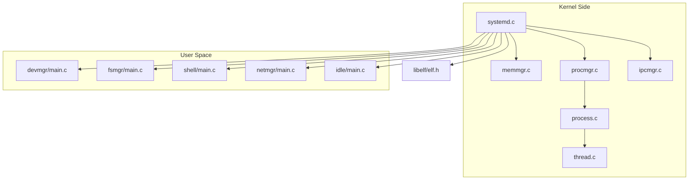
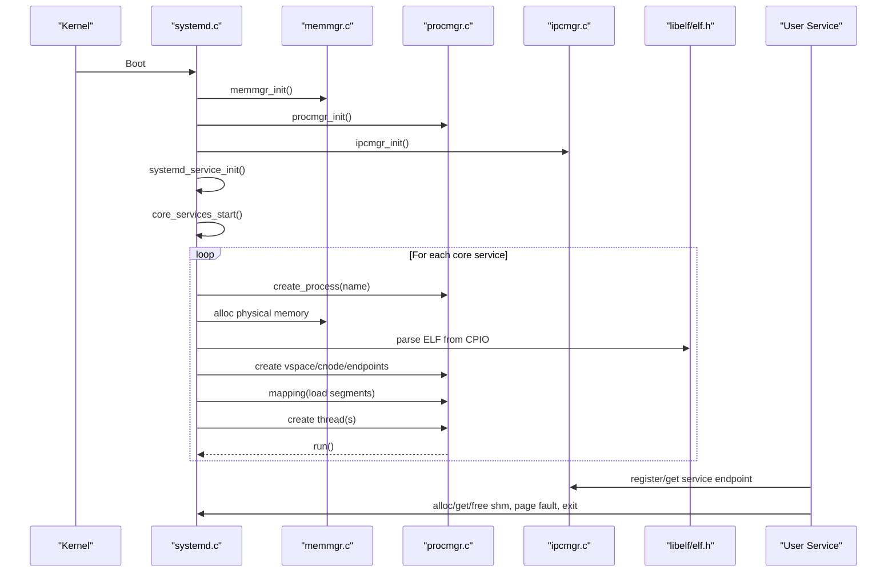
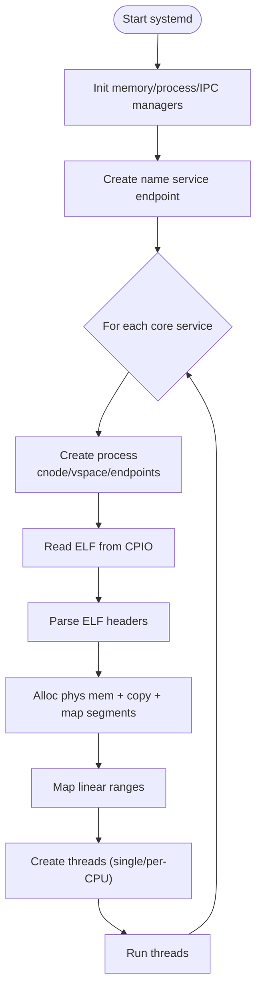
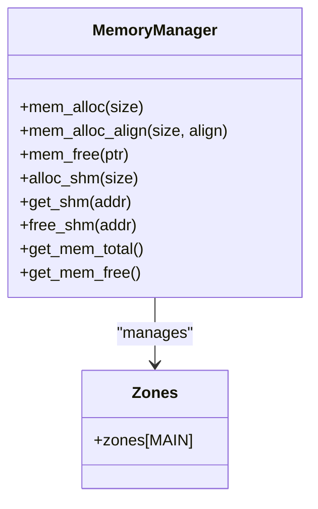
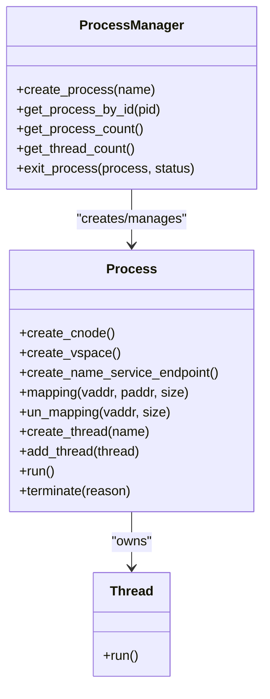
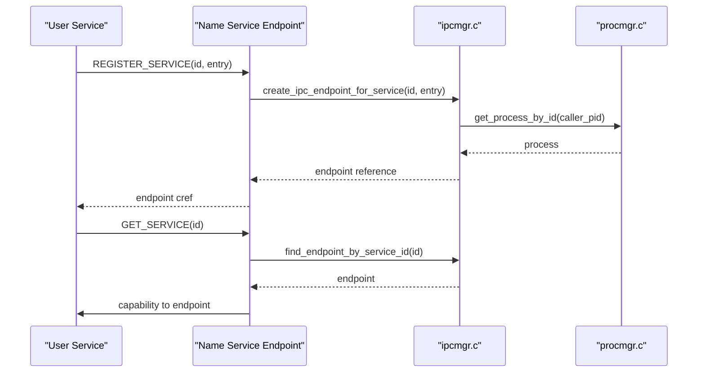
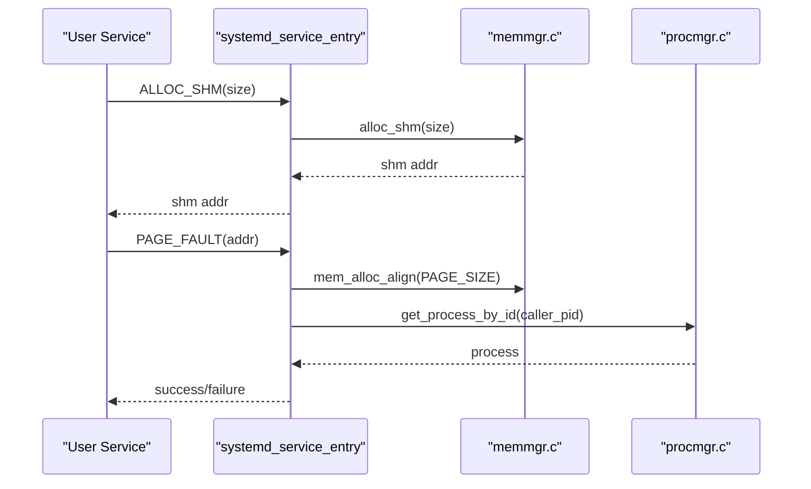
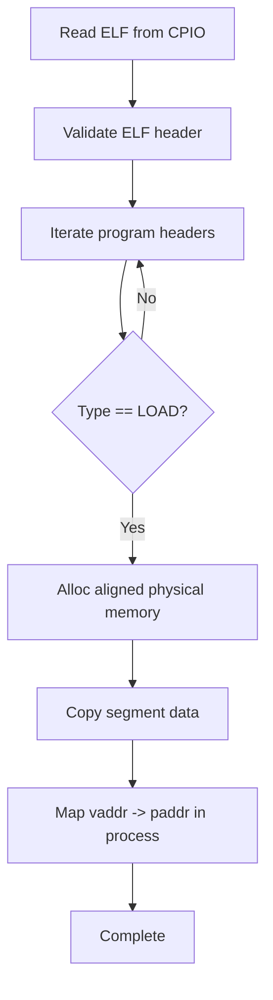
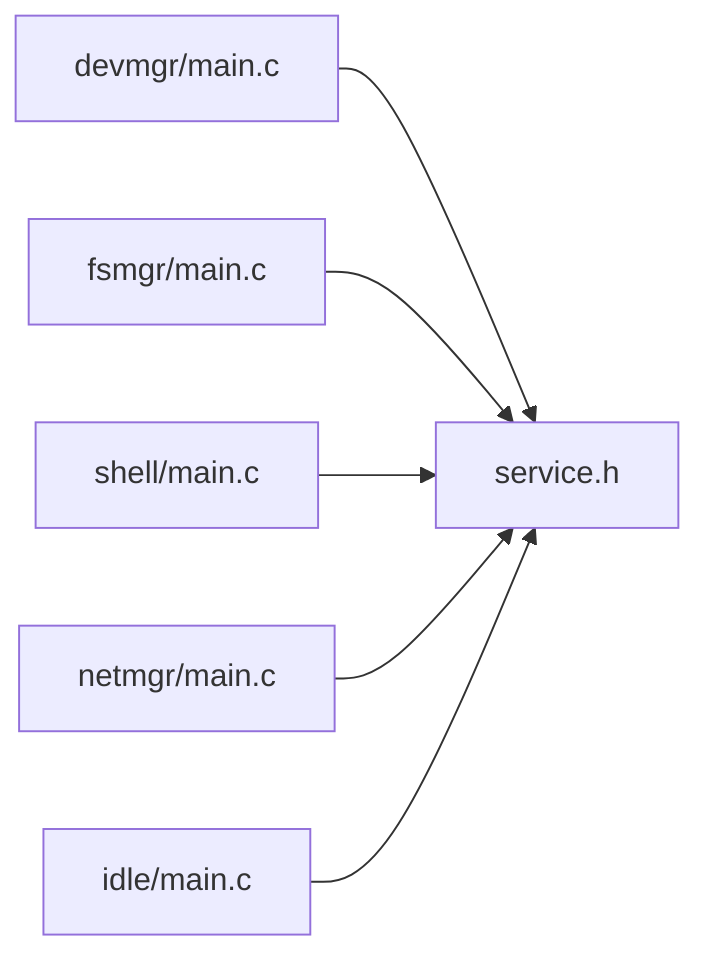
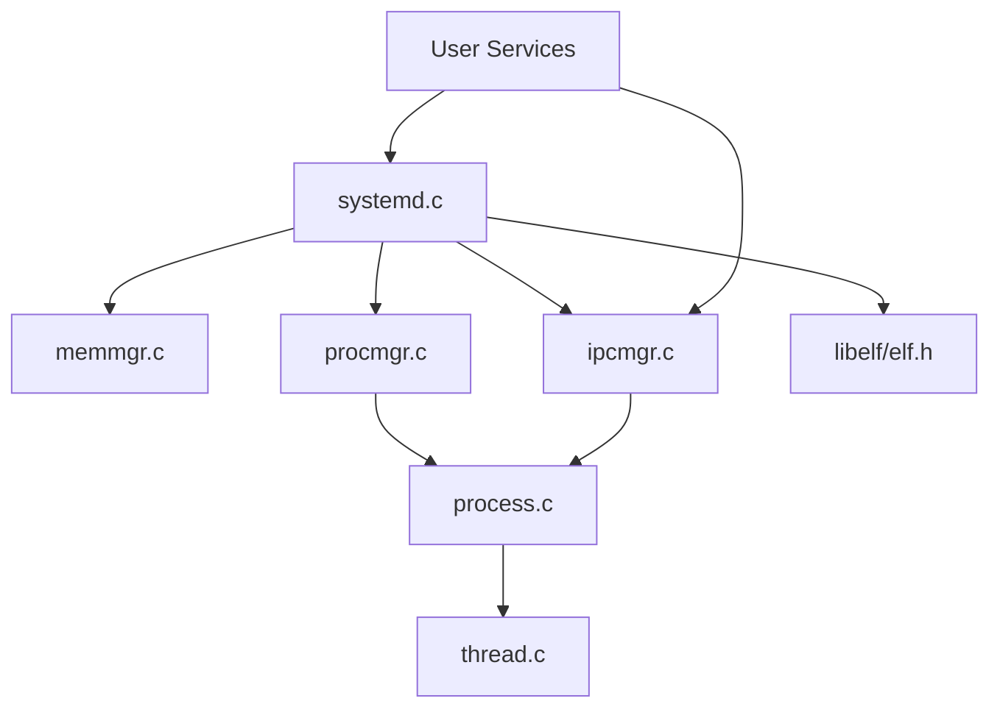

# User-Space Services Architecture

<cite>
**Referenced Files in This Document**
- [systemd.c](file://kernel/systemd/systemd.c)
- [service.c](file://kernel/systemd/service.c)
- [procmgr.c](file://kernel/systemd/procmgr/procmgr.c)
- [process.c](file://kernel/systemd/procmgr/process.c)
- [thread.c](file://kernel/systemd/procmgr/thread.c)
- [ipcmgr.c](file://kernel/systemd/ipcmgr/ipcmgr.c)
- [memmgr.c](file://kernel/systemd/memmgr/memmgr.c)
- [systemd.h](file://kernel/systemd/include/systemd.h)
- [service.h](file://kernel/systemd/include/service.h)
- [elf.h](file://ulibs/include/libelf/elf.h)
- [devmgr main.c](file://uapps/devmgr/main.c)
- [fsmgr main.c](file://uapps/fsmgr/main.c)
- [shell main.c](file://uapps/shell/main.c)
- [netmgr main.c](file://uapps/netmgr/main.c)
- [idle main.c](file://uapps/idle/main.c)
</cite>

## Table of Contents
1. [Introduction](#introduction)
2. [Project Structure](#project-structure)
3. [Core Components](#core-components)
4. [Architecture Overview](#architecture-overview)
5. [Detailed Component Analysis](#detailed-component-analysis)
6. [Dependency Analysis](#dependency-analysis)
7. [Performance Considerations](#performance-considerations)
8. [Troubleshooting Guide](#troubleshooting-guide)
9. [Conclusion](#conclusion)

## Introduction
This document describes the user-space services architecture centered around the systemd process, which acts as the central orchestrator for all user-space services. It explains how core operating system functionality is delegated to user-space processes, including memory management, process/thread management, device drivers, and file systems. The document also covers service registration and discovery via a name service, inter-service communication patterns using IPC endpoints, ELF loading and initialization, service lifecycle management, and resource allocation strategies. Benefits such as fault isolation, maintainability, and modular extensibility are highlighted, along with practical examples of service implementations and their integration with the kernel.

## Project Structure
The user-space services architecture is organized into:
- Kernel-side systemd orchestrator and managers:
  - Memory manager for physical and virtual memory allocation
  - Process manager for process and thread lifecycle
  - IPC manager for capability-based IPC and service discovery
  - Systemd core that loads and initializes services
- User-space services:
  - Device manager, file system manager, network manager, shell, and idle services
- ELF loader library for parsing and mapping executable segments

**Diagram sources**
- [systemd.c](file://kernel/systemd/systemd.c#L217-L246)
- [memmgr.c](file://kernel/systemd/memmgr/memmgr.c#L274-L299)
- [procmgr.c](file://kernel/systemd/procmgr/procmgr.c#L127-L143)
- [process.c](file://kernel/systemd/procmgr/process.c#L419-L442)
- [thread.c](file://kernel/systemd/procmgr/thread.c#L15-L25)
- [ipcmgr.c](file://kernel/systemd/ipcmgr/ipcmgr.c#L311-L319)
- [elf.h](file://ulibs/include/libelf/elf.h#L83-L123)
- [devmgr main.c](file://uapps/devmgr/main.c#L6-L17)
- [fsmgr main.c](file://uapps/fsmgr/main.c#L17-L37)
- [shell main.c](file://uapps/shell/main.c#L34-L71)
- [netmgr main.c](file://uapps/netmgr/main.c#L7-L18)
- [idle main.c](file://uapps/idle/main.c#L6-L15)

**Section sources**
- [systemd.c](file://kernel/systemd/systemd.c#L1-L246)
- [memmgr.c](file://kernel/systemd/memmgr/memmgr.c#L1-L300)
- [procmgr.c](file://kernel/systemd/procmgr/procmgr.c#L1-L143)
- [process.c](file://kernel/systemd/procmgr/process.c#L1-L442)
- [thread.c](file://kernel/systemd/procmgr/thread.c#L1-L25)
- [ipcmgr.c](file://kernel/systemd/ipcmgr/ipcmgr.c#L1-L319)
- [elf.h](file://ulibs/include/libelf/elf.h#L1-L149)
- [devmgr main.c](file://uapps/devmgr/main.c#L1-L18)
- [fsmgr main.c](file://uapps/fsmgr/main.c#L1-L38)
- [shell main.c](file://uapps/shell/main.c#L1-L72)
- [netmgr main.c](file://uapps/netmgr/main.c#L1-L20)
- [idle main.c](file://uapps/idle/main.c#L1-L17)

## Core Components
- systemd orchestrator
  - Initializes memory, process, IPC managers, and registers the systemd service endpoint
  - Defines core services and their deployment modes
  - Loads and boots ELF binaries into user-space processes
- Memory manager
  - Boot-to-main memory allocation using boot and buddy allocators
  - Shared memory allocation for services
  - Provides total/free memory statistics
- Process manager
  - Manages process lifecycle, PID assignment, and counting
- Process and thread
  - Creates address spaces, capability nodes, stacks, and execution contexts
  - Maps virtual memory, schedules threads, and handles termination
- IPC manager and name service
  - Creates capability-based IPC endpoints for services
  - Registers and resolves service endpoints via a name service
- ELF loader
  - Parses ELF headers and program headers
  - Extracts loadable segments and maps them into process virtual memory

**Section sources**
- [systemd.c](file://kernel/systemd/systemd.c#L15-L74)
- [systemd.c](file://kernel/systemd/systemd.c#L217-L246)
- [service.c](file://kernel/systemd/service.c#L160-L230)
- [memmgr.c](file://kernel/systemd/memgr/memmgr.c#L274-L299)
- [procmgr.c](file://kernel/systemd/procmgr/procmgr.c#L127-L143)
- [process.c](file://kernel/systemd/procmgr/process.c#L419-L442)
- [thread.c](file://kernel/systemd/procmgr/thread.c#L15-L25)
- [ipcmgr.c](file://kernel/systemd/ipcmgr/ipcmgr.c#L22-L87)
- [ipcmgr.c](file://kernel/systemd/ipcmgr/ipcmgr.c#L237-L287)
- [elf.h](file://ulibs/include/libelf/elf.h#L83-L123)

## Architecture Overview
The systemd process is the first user-space entity started by the kernel. It initializes managers, sets up a name service for service discovery, and launches core services. Each service is loaded as an ELF binary, mapped into its own virtual address space, and granted capabilities for IPC and upcalls. Services communicate via capability-based IPC endpoints and can request memory or register upcall handlers through the systemd service endpoint.

**Diagram sources**
- [systemd.c](file://kernel/systemd/systemd.c#L217-L246)
- [memmgr.c](file://kernel/systemd/memmgr/memmgr.c#L274-L299)
- [procmgr.c](file://kernel/systemd/procmgr/procmgr.c#L127-L143)
- [ipcmgr.c](file://kernel/systemd/ipcmgr/ipcmgr.c#L311-L319)
- [elf.h](file://ulibs/include/libelf/elf.h#L83-L123)

## Detailed Component Analysis

### Systemd Orchestrator
- Responsibilities
  - Initialize memory, process, and IPC managers
  - Register systemd service endpoint for service requests
  - Define core services, their ELF paths, and linear mappings
  - Load ELF binaries from CPIO, allocate physical memory, map segments, and start threads
- ELF loading mechanism
  - Reads service binary from CPIO
  - Parses ELF headers and iterates loadable program headers
  - Allocates aligned physical memory and copies segments
  - Maps virtual addresses to physical memory in the new process
- Service lifecycle
  - Creates process, cnode, vspace, and endpoints
  - Registers name service endpoint for the process
  - Creates console and threads (single or per-CPU)
  - Starts threads and yields control

**Diagram sources**
- [systemd.c](file://kernel/systemd/systemd.c#L15-L74)
- [systemd.c](file://kernel/systemd/systemd.c#L76-L205)
- [systemd.c](file://kernel/systemd/systemd.c#L217-L246)
- [elf.h](file://ulibs/include/libelf/elf.h#L83-L123)

**Section sources**
- [systemd.c](file://kernel/systemd/systemd.c#L15-L74)
- [systemd.c](file://kernel/systemd/systemd.c#L76-L205)
- [systemd.c](file://kernel/systemd/systemd.c#L217-L246)
- [elf.h](file://ulibs/include/libelf/elf.h#L83-L123)

### Memory Manager
- Boot-to-main transition using boot and buddy allocators
- Zone-based allocation for main memory
- Shared memory support for services
- Memory statistics queries

**Diagram sources**
- [memmgr.c](file://kernel/systemd/memmgr/memmgr.c#L274-L299)
- [memmgr.c](file://kernel/systemd/memmgr/memmgr.c#L161-L185)
- [memmgr.c](file://kernel/systemd/memmgr/memmgr.c#L251-L272)

**Section sources**
- [memmgr.c](file://kernel/systemd/memmgr/memmgr.c#L1-L300)

### Process and Thread Management
- Process lifecycle
  - Create cnode, vspace, and IPC endpoints
  - Map virtual memory, set up stacks and execution contexts
  - Schedule threads and handle termination
- Thread lifecycle
  - Allocate stacks and execution contexts
  - Attach to process and schedule

**Diagram sources**
- [procmgr.c](file://kernel/systemd/procmgr/procmgr.c#L127-L143)
- [process.c](file://kernel/systemd/procmgr/process.c#L419-L442)
- [thread.c](file://kernel/systemd/procmgr/thread.c#L15-L25)

**Section sources**
- [procmgr.c](file://kernel/systemd/procmgr/procmgr.c#L1-L143)
- [process.c](file://kernel/systemd/procmgr/process.c#L1-L442)
- [thread.c](file://kernel/systemd/procmgr/thread.c#L1-L25)

### IPC Manager and Service Discovery
- Capability-based IPC endpoints
  - Create endpoints for normal services and system services
  - Set up execution and scheduling contexts with capability references
- Name service
  - Registers service endpoints under service IDs
  - Resolves endpoints for callers via capability forwarding

**Diagram sources**
- [ipcmgr.c](file://kernel/systemd/ipcmgr/ipcmgr.c#L22-L87)
- [ipcmgr.c](file://kernel/systemd/ipcmgr/ipcmgr.c#L156-L195)
- [ipcmgr.c](file://kernel/systemd/ipcmgr/ipcmgr.c#L197-L235)
- [ipcmgr.c](file://kernel/systemd/ipcmgr/ipcmgr.c#L237-L287)

**Section sources**
- [ipcmgr.c](file://kernel/systemd/ipcmgr/ipcmgr.c#L1-L319)

### Systemd Service Endpoint
- Methods exposed to services
  - Shared memory allocation, retrieval, and freeing
  - Memory statistics queries
  - Upcall registration
  - Page fault handling
  - Self-exit
- Registration and dispatch

**Diagram sources**
- [service.c](file://kernel/systemd/service.c#L160-L230)
- [service.c](file://kernel/systemd/service.c#L10-L97)
- [memmgr.c](file://kernel/systemd/memmgr/memmgr.c#L161-L185)
- [procmgr.c](file://kernel/systemd/procmgr/procmgr.c#L9-L34)

**Section sources**
- [service.c](file://kernel/systemd/service.c#L1-L236)

### ELF Loading Mechanism
- Parsing
  - Validates ELF magic, class, data encoding, version, machine, and type
  - Iterates program headers to extract loadable segments
- Mapping
  - Allocates aligned physical memory
  - Copies segment data
  - Maps virtual addresses to physical memory in the new process

**Diagram sources**
- [systemd.c](file://kernel/systemd/systemd.c#L113-L153)
- [elf.h](file://ulibs/include/libelf/elf.h#L83-L123)

**Section sources**
- [systemd.c](file://kernel/systemd/systemd.c#L105-L153)
- [elf.h](file://ulibs/include/libelf/elf.h#L83-L123)

### Example Service Implementations
- Device manager
  - Initializes display and device subsystems, registers service endpoint
- File system manager
  - Initializes VFS components, registers service endpoint, registers upcall handler for page faults
- Shell
  - Uses clients to access device, filesystem, and systemd services; draws UI and reads files
- Network manager
  - Initializes networking service endpoint
- Idle
  - Minimal loop for CPU idle

**Diagram sources**
- [devmgr main.c](file://uapps/devmgr/main.c#L6-L17)
- [fsmgr main.c](file://uapps/fsmgr/main.c#L17-L37)
- [shell main.c](file://uapps/shell/main.c#L34-L71)
- [netmgr main.c](file://uapps/netmgr/main.c#L7-L18)
- [idle main.c](file://uapps/idle/main.c#L6-L15)

**Section sources**
- [devmgr main.c](file://uapps/devmgr/main.c#L1-L18)
- [fsmgr main.c](file://uapps/fsmgr/main.c#L1-L38)
- [shell main.c](file://uapps/shell/main.c#L1-L72)
- [netmgr main.c](file://uapps/netmgr/main.c#L1-L20)
- [idle main.c](file://uapps/idle/main.c#L1-L17)

## Dependency Analysis
- Systemd depends on memory, process, IPC managers, and ELF loader
- Process creation depends on memory allocation and capability APIs
- IPC endpoints depend on process cnode and vspace references
- Services depend on the name service for endpoint discovery and on systemd for resource management

**Diagram sources**
- [systemd.c](file://kernel/systemd/systemd.c#L1-L246)
- [memmgr.c](file://kernel/systemd/memmgr/memmgr.c#L1-L300)
- [procmgr.c](file://kernel/systemd/procmgr/procmgr.c#L1-L143)
- [process.c](file://kernel/systemd/procmgr/process.c#L1-L442)
- [thread.c](file://kernel/systemd/procmgr/thread.c#L1-L25)
- [ipcmgr.c](file://kernel/systemd/ipcmgr/ipcmgr.c#L1-L319)
- [elf.h](file://ulibs/include/libelf/elf.h#L1-L149)

**Section sources**
- [systemd.c](file://kernel/systemd/systemd.c#L1-L246)
- [procmgr.c](file://kernel/systemd/procmgr/procmgr.c#L1-L143)
- [process.c](file://kernel/systemd/procmgr/process.c#L1-L442)
- [ipcmgr.c](file://kernel/systemd/ipcmgr/ipcmgr.c#L1-L319)
- [memmgr.c](file://kernel/systemd/memmgr/memmgr.c#L1-L300)
- [elf.h](file://ulibs/include/libelf/elf.h#L1-L149)

## Performance Considerations
- Memory allocation
  - Boot-to-main transition minimizes early allocations; buddy allocator supports large contiguous allocations efficiently
- Virtual memory mapping
  - Segment-by-segment mapping ensures minimal overhead; page table extension occurs on demand
- IPC
  - Capability-based IPC avoids kernel involvement for routine message passing; name service caching could reduce repeated lookups
- Threading
  - Per-CPU deployment for idle service reduces contention; single-threaded services minimize synchronization overhead

## Troubleshooting Guide
- Service fails to start
  - Verify ELF parsing success and loadable segments mapped
  - Check process creation of cnode, vspace, and endpoints
- IPC resolution failures
  - Confirm name service registration and endpoint availability
  - Validate capability references and process cnode/vspace setup
- Memory issues
  - Inspect shared memory allocation and mapping; confirm free memory statistics
- Page faults
  - Ensure page fault handler is registered and processes can map requested pages

**Section sources**
- [systemd.c](file://kernel/systemd/systemd.c#L105-L153)
- [process.c](file://kernel/systemd/procmgr/process.c#L84-L121)
- [ipcmgr.c](file://kernel/systemd/ipcmgr/ipcmgr.c#L237-L287)
- [service.c](file://kernel/systemd/service.c#L109-L141)
- [memmgr.c](file://kernel/systemd/memmgr/memmgr.c#L161-L185)

## Conclusion
The user-space services architecture delegates core OS functionality to modular, capability-protected services orchestrated by systemd. Memory and process management are handled by dedicated managers, while IPC enables clean service discovery and communication. The ELF loader and service lifecycle management provide robust initialization and resource allocation. This design achieves fault isolation, simplifies maintenance, and supports modular extensibility, enabling easy addition of new services such as device drivers, file systems, and network components.