# Virtualization Support (EL2 Hypervisor)

<cite>
**Referenced Files in This Document**
- [virt/hypervisor.c](file://virt/hypervisor.c)
- [virt/vm.c](file://virt/vm.c)
- [virt/vcpu.c](file://virt/vcpu.c)
- [virt/hypcall/hypcall.c](file://virt/hypcall/hypcall.c)
- [virt/include/vm.h](file://virt/include/vm.h)
- [virt/include/vcpu.h](file://virt/include/vcpu.h)
- [virt/include/hypcall/hypcall.h](file://virt/include/hypcall/hypcall.h)
- [virt/include/arch/arm64/interrupt.h](file://virt/include/arch/arm64/interrupt.h)
- [virt/include/arch/arm64/sysregs.h](file://virt/include/arch/arm64/sysregs.h)
- [virt/include/vgic.h](file://virt/include/vgic.h)
- [virt/interrupt/irq_mgr.c](file://virt/interrupt/irq_mgr.c)
- [virt/mm/vmem.c](file://virt/mm/vmem.c)
- [virt/arch/arm64/sysregs/sysregs.c](file://virt/arch/arm64/sysregs/sysregs.c)
- [virt/arch/arm64/boot/exception_el2.S](file://virt/arch/arm64/boot/exception_el2.S)
- [virt/arch/arm64/boot/boot.S](file://virt/arch/arm64/boot/boot.S)
- [virt/arch/arm64/switch/switch.S](file://virt/arch/arm64/switch/switch.S)
- [virt/arch/arm64/sysregs/sysregs.c](file://virt/arch/arm64/sysregs/sysregs.c)
- [virt/drivers/arm-gic/gicv2.c](file://virt/drivers/arm-gic/gicv2.c)
- [virt/drivers/arm-uart/pl011.c](file://virt/drivers/arm-uart/pl011.c)
- [virt/console.c](file://virt/console.c)
- [virt/printk.c](file://virt/printk.c)
- [virt/pcpu.c](file://virt/pcpu.c)
- [virt/timer/rtc.c](file://virt/timer/rtc.c)
- [virt/exceptions_el2.c](file://virt/exceptions_el2.c)
- [virt/scheduler.h](file://virt/include/scheduler.h)
</cite>

## Table of Contents
1. [Introduction](#introduction)
2. [Project Structure](#project-structure)
3. [Core Components](#core-components)
4. [Architecture Overview](#architecture-overview)
5. [Detailed Component Analysis](#detailed-component-analysis)
6. [Dependency Analysis](#dependency-analysis)
7. [Performance Considerations](#performance-considerations)
8. [Troubleshooting Guide](#troubleshooting-guide)
9. [Conclusion](#conclusion)
10. [Appendices](#appendices)

## Introduction
This document describes the EL2 virtualization support in the kernel, focusing on the Type-1 hypervisor implementation that runs guest virtual machines alongside the host kernel. It explains virtual machine management, VCPU scheduling, hypervisor call mechanisms, dual boot modes (direct kernel boot and hypervisor-assisted boot), virtual memory management, interrupt virtualization, device emulation, security model for VM isolation, performance considerations, and integration between the hypervisor and kernel including shared resources and inter-VM communication. Examples of VM creation, management, and monitoring are included.

## Project Structure
The virtualization subsystem resides under the virt/ directory and integrates tightly with the kernel’s architecture-specific modules. Key areas include:
- Hypervisor bootstrap and initialization
- VM and VCPU lifecycle management
- Hypervisor call (HVC) dispatch
- Interrupt virtualization via a virtual GIC
- Device emulation (UART, GIC)
- Virtual memory management and sysreg virtualization
- Console and logging for hypervisor-visible output

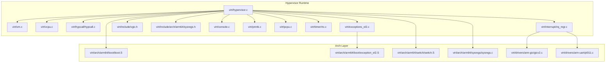

**Diagram sources**
- [virt/hypervisor.c](file://virt/hypervisor.c#L101-L145)
- [virt/vm.c](file://virt/vm.c#L55-L59)
- [virt/vcpu.c](file://virt/vcpu.c#L60-L66)
- [virt/hypcall/hypcall.c](file://virt/hypcall/hypcall.c#L19-L25)
- [virt/interrupt/irq_mgr.c](file://virt/interrupt/irq_mgr.c#L117-L128)
- [virt/include/vgic.h](file://virt/include/vgic.h#L60-L63)
- [virt/include/arch/arm64/sysregs.h](file://virt/include/arch/arm64/sysregs.h#L7-L104)
- [virt/console.c](file://virt/console.c)
- [virt/printk.c](file://virt/printk.c)
- [virt/pcpu.c](file://virt/pcpu.c)
- [virt/timer/rtc.c](file://virt/timer/rtc.c)
- [virt/exceptions_el2.c](file://virt/exceptions_el2.c)
- [virt/arch/arm64/boot/boot.S](file://virt/arch/arm64/boot/boot.S)
- [virt/arch/arm64/boot/exception_el2.S](file://virt/arch/arm64/boot/exception_el2.S)
- [virt/arch/arm64/switch/switch.S](file://virt/arch/arm64/switch/switch.S)
- [virt/arch/arm64/sysregs/sysregs.c](file://virt/arch/arm64/sysregs/sysregs.c)
- [virt/drivers/arm-gic/gicv2.c](file://virt/drivers/arm-gic/gicv2.c)
- [virt/drivers/arm-uart/pl011.c](file://virt/drivers/arm-uart/pl011.c)

**Section sources**
- [virt/hypervisor.c](file://virt/hypervisor.c#L101-L145)
- [virt/vm.c](file://virt/vm.c#L55-L59)
- [virt/vcpu.c](file://virt/vcpu.c#L60-L66)
- [virt/hypcall/hypcall.c](file://virt/hypcall/hypcall.c#L19-L25)
- [virt/interrupt/irq_mgr.c](file://virt/interrupt/irq_mgr.c#L117-L128)
- [virt/include/vgic.h](file://virt/include/vgic.h#L60-L63)
- [virt/include/arch/arm64/sysregs.h](file://virt/include/arch/arm64/sysregs.h#L7-L104)
- [virt/console.c](file://virt/console.c)
- [virt/printk.c](file://virt/printk.c)
- [virt/pcpu.c](file://virt/pcpu.c)
- [virt/timer/rtc.c](file://virt/timer/rtc.c)
- [virt/exceptions_el2.c](file://virt/exceptions_el2.c)
- [virt/arch/arm64/boot/boot.S](file://virt/arch/arm64/boot/boot.S)
- [virt/arch/arm64/boot/exception_el2.S](file://virt/arch/arm64/boot/exception_el2.S)
- [virt/arch/arm64/switch/switch.S](file://virt/arch/arm64/switch/switch.S)
- [virt/arch/arm64/sysregs/sysregs.c](file://virt/arch/arm64/sysregs/sysregs.c)
- [virt/drivers/arm-gic/gicv2.c](file://virt/drivers/arm-gic/gicv2.c)
- [virt/drivers/arm-uart/pl011.c](file://virt/drivers/arm-uart/pl011.c)

## Core Components
- Hypervisor bootstrap and control flow: Initializes devices, exceptions, and starts the host VM.
- Virtual Machine (VM): Manages guest configuration, VCPUs, virtual memory, and GIC.
- Virtual CPU (VCPU): Holds per-VCPU context, sysregs, timers, PMU, and scheduling hooks.
- Hypervisor Call (HVC): Dispatches hypercalls from guests to hypervisor handlers.
- Interrupt Virtualization: Provides a virtual GIC abstraction and routes IRQs to guests.
- Device Emulation: UART and GIC drivers emulate peripheral behavior for guests.
- Virtual Memory Management: Stage-2 translation and memory ops for VMs.
- Sysreg Virtualization: Captures and restores guest system registers.

**Section sources**
- [virt/hypervisor.c](file://virt/hypervisor.c#L47-L145)
- [virt/vm.c](file://virt/vm.c#L5-L59)
- [virt/vcpu.c](file://virt/vcpu.c#L14-L66)
- [virt/hypcall/hypcall.c](file://virt/hypcall/hypcall.c#L13-L25)
- [virt/include/vgic.h](file://virt/include/vgic.h#L54-L63)
- [virt/include/arch/arm64/sysregs.h](file://virt/include/arch/arm64/sysregs.h#L106-L107)
- [virt/mm/vmem.c](file://virt/mm/vmem.c)

## Architecture Overview
The EL2 hypervisor initializes early, sets up exception handling, registers the HVC dispatcher, and creates a host VM with a single VCPU. It then attaches the VCPU to the VM, initializes VM memory and sysregs, and starts execution. Guest interrupts are handled by the virtual GIC and routed through the hypervisor’s IRQ manager.

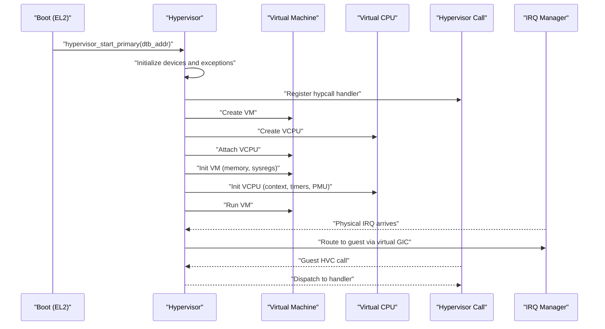

**Diagram sources**
- [virt/hypervisor.c](file://virt/hypervisor.c#L101-L145)
- [virt/vm.c](file://virt/vm.c#L5-L59)
- [virt/vcpu.c](file://virt/vcpu.c#L19-L53)
- [virt/hypcall/hypcall.c](file://virt/hypcall/hypcall.c#L19-L25)
- [virt/interrupt/irq_mgr.c](file://virt/interrupt/irq_mgr.c#L47-L69)

## Detailed Component Analysis

### Hypervisor Bootstrap and Control Flow
- Initializes console, device tree, IRQ manager, early devices, boot memory, and physical CPU context.
- Sets up EL2 exceptions and registers the HVC handler.
- Creates a host VM and VCPU, attaches VCPU to VM, and runs VM.
- Supports secondary CPU entry points.

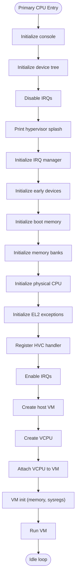

**Diagram sources**
- [virt/hypervisor.c](file://virt/hypervisor.c#L101-L145)

**Section sources**
- [virt/hypervisor.c](file://virt/hypervisor.c#L101-L145)

### Virtual Machine Management
- VM configuration includes name, number of CPUs, and physical memory size.
- VM operations include init, attach VCPU, run, and stop.
- VM initializes virtual memory and iterates over attached VCPUs to initialize their contexts.

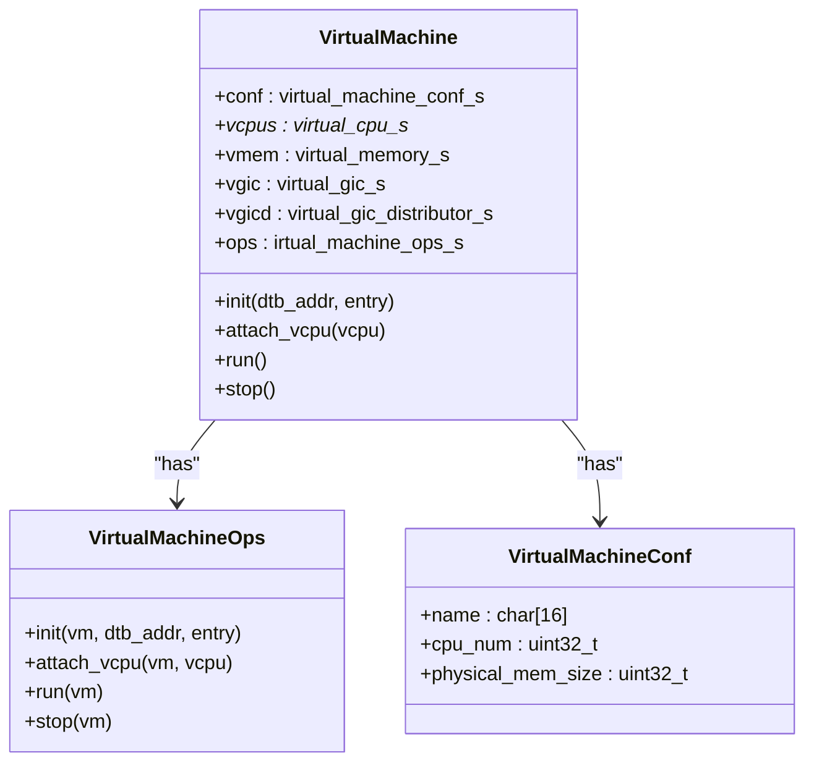

**Diagram sources**
- [virt/include/vm.h](file://virt/include/vm.h#L19-L34)
- [virt/vm.c](file://virt/vm.c#L5-L59)

**Section sources**
- [virt/include/vm.h](file://virt/include/vm.h#L19-L34)
- [virt/vm.c](file://virt/vm.c#L5-L59)

### VCPU Lifecycle and Context
- VCPU holds execute context and AArch64 system registers snapshot.
- Default init sets up initial register state (SP, PC, SPSR), allocates stack, and prepares GIC/timer/PMU placeholders.
- Default run switches to VCPU context.

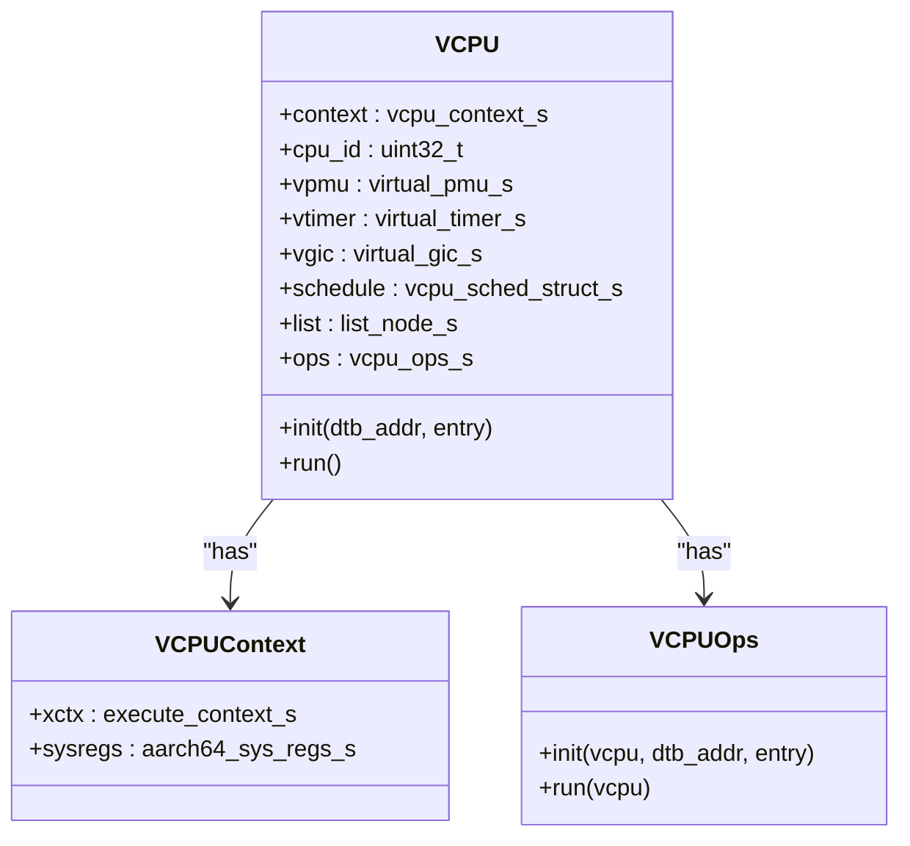

**Diagram sources**
- [virt/include/vcpu.h](file://virt/include/vcpu.h#L26-L44)
- [virt/vcpu.c](file://virt/vcpu.c#L19-L53)

**Section sources**
- [virt/include/vcpu.h](file://virt/include/vcpu.h#L26-L44)
- [virt/vcpu.c](file://virt/vcpu.c#L19-L53)

### Hypervisor Call Mechanism (HVC)
- Hypercall numbers define the ABI for guest-to-hypervisor calls.
- The hypcall dispatcher invokes the registered handler and switches back to the next context.

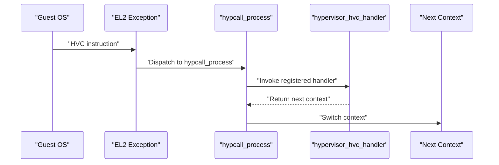

**Diagram sources**
- [virt/include/hypcall/hypcall.h](file://virt/include/hypcall/hypcall.h#L6-L16)
- [virt/hypcall/hypcall.c](file://virt/hypcall/hypcall.c#L19-L25)
- [virt/hypervisor.c](file://virt/hypervisor.c#L78-L99)

**Section sources**
- [virt/include/hypcall/hypcall.h](file://virt/include/hypcall/hypcall.h#L6-L16)
- [virt/hypcall/hypcall.c](file://virt/hypcall/hypcall.c#L19-L25)
- [virt/hypervisor.c](file://virt/hypervisor.c#L78-L99)

### Interrupt Virtualization and Routing
- The IRQ manager registers devices and routes physical IRQs to the guest via the virtual GIC.
- Pending states are written to the virtual GIC interface mapped through stage-2 translation.

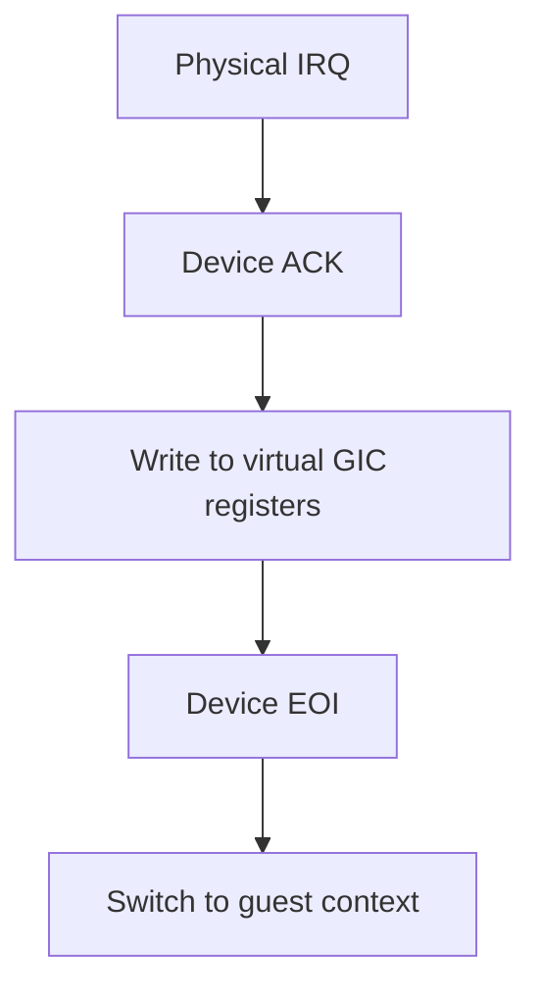

**Diagram sources**
- [virt/interrupt/irq_mgr.c](file://virt/interrupt/irq_mgr.c#L47-L69)
- [virt/include/vgic.h](file://virt/include/vgic.h#L54-L63)

**Section sources**
- [virt/interrupt/irq_mgr.c](file://virt/interrupt/irq_mgr.c#L47-L69)
- [virt/include/vgic.h](file://virt/include/vgic.h#L54-L63)

### Device Emulation (UART and GIC)
- UART driver provides serial console access for guests.
- GIC driver manages virtual GIC distribution and CPU interface.

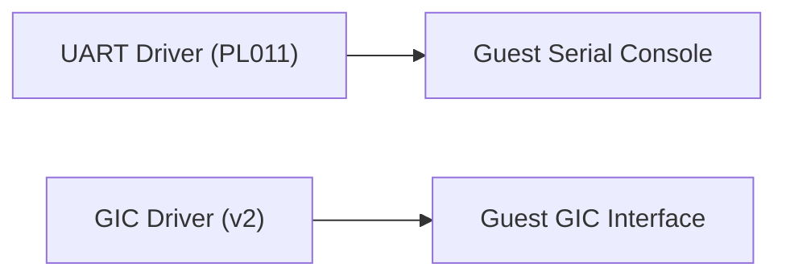

**Diagram sources**
- [virt/drivers/arm-uart/pl011.c](file://virt/drivers/arm-uart/pl011.c)
- [virt/drivers/arm-gic/gicv2.c](file://virt/drivers/arm-gic/gicv2.c)

**Section sources**
- [virt/drivers/arm-uart/pl011.c](file://virt/drivers/arm-uart/pl011.c)
- [virt/drivers/arm-gic/gicv2.c](file://virt/drivers/arm-gic/gicv2.c)

### Virtual Memory Management
- VM memory initialization and operations are exposed through the VM abstraction.
- Sysreg virtualization captures and restores guest system registers during context switches.

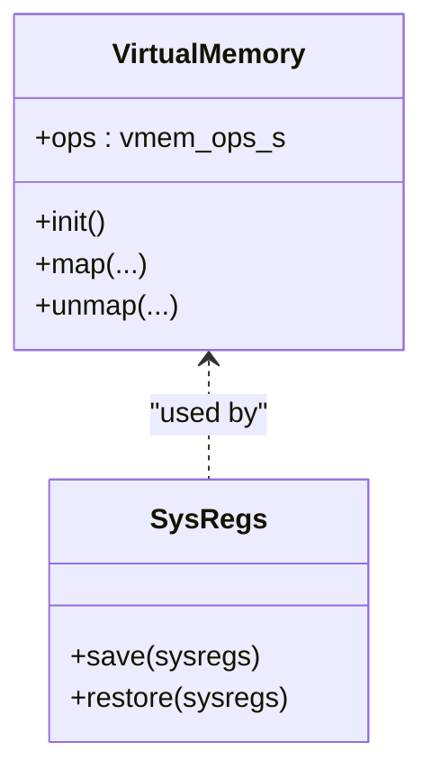

**Diagram sources**
- [virt/vm.c](file://virt/vm.c#L5-L19)
- [virt/include/arch/arm64/sysregs.h](file://virt/include/arch/arm64/sysregs.h#L106-L107)

**Section sources**
- [virt/vm.c](file://virt/vm.c#L5-L19)
- [virt/include/arch/arm64/sysregs.h](file://virt/include/arch/arm64/sysregs.h#L106-L107)

### Security Model and Isolation
- EL2 privilege isolation ensures guest OS executes at EL1 while the hypervisor remains at EL2.
- HCR_EL2 controls virtualization features and traps for isolation.
- Stage-2 translation isolates guest memory from host and other VMs.
- Virtual GIC isolates interrupt delivery to guests.

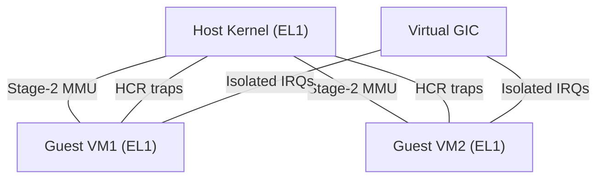

**Diagram sources**
- [virt/hypervisor.c](file://virt/hypervisor.c#L47-L76)
- [virt/include/vgic.h](file://virt/include/vgic.h#L54-L63)

**Section sources**
- [virt/hypervisor.c](file://virt/hypervisor.c#L47-L76)
- [virt/include/vgic.h](file://virt/include/vgic.h#L54-L63)

### Dual Boot Modes
- Hypervisor-assisted boot: Hypervisor initializes VM, sets up VCPU context, and starts execution.
- Direct kernel boot: Bootloader passes DTB and entry point; hypervisor locates boot node and boots the guest kernel directly.

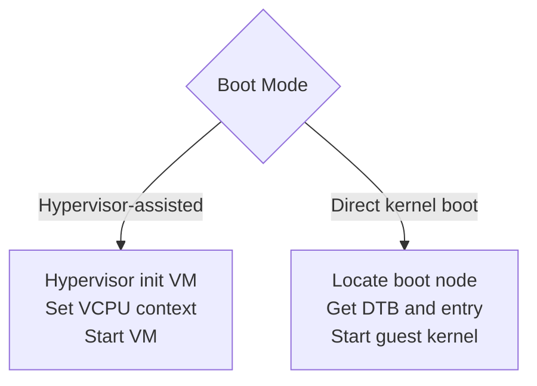

**Diagram sources**
- [virt/hypervisor.c](file://virt/hypervisor.c#L137-L142)

**Section sources**
- [virt/hypervisor.c](file://virt/hypervisor.c#L137-L142)

### VCPU Scheduling
- VCPU scheduling structure is present and integrated into the VCPU definition.
- Scheduler interface is exposed for future integration with a real scheduler.

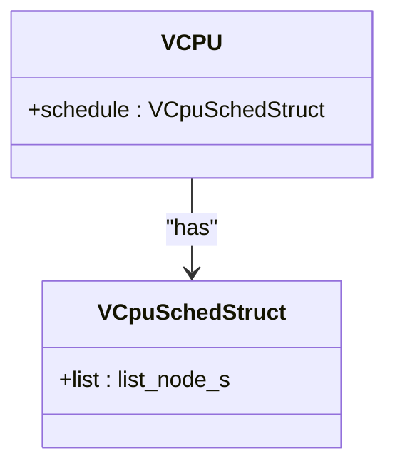

**Diagram sources**
- [virt/include/vcpu.h](file://virt/include/vcpu.h#L22-L24)
- [virt/include/scheduler.h](file://virt/include/scheduler.h)

**Section sources**
- [virt/include/vcpu.h](file://virt/include/vcpu.h#L22-L24)
- [virt/include/scheduler.h](file://virt/include/scheduler.h)

### Examples: VM Creation, Management, and Monitoring
- VM creation: Allocate VM struct and call creation routine to set up ops and lists.
- VCPU creation: Allocate VCPU struct and call creation routine to set up ops and lists.
- VM attach/run: Attach VCPU to VM, initialize VM memory and sysregs, then run VM.
- Monitoring: Use console and logging APIs to print hypervisor and VM status.

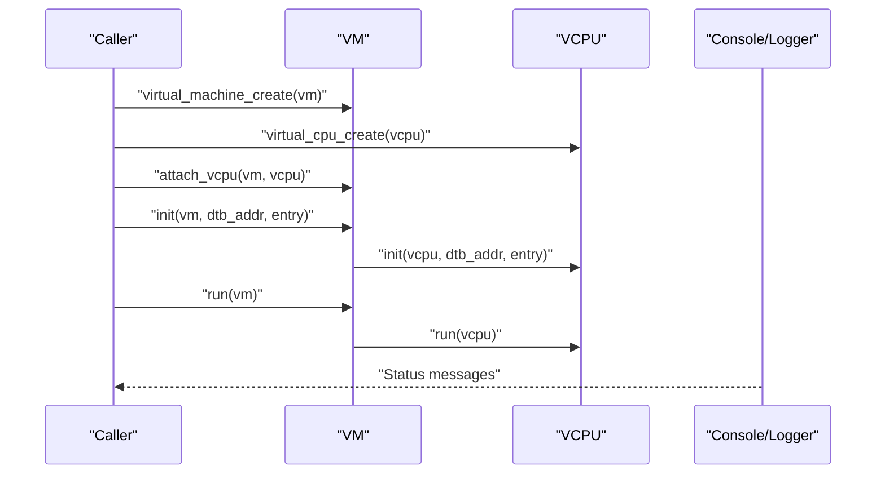

**Diagram sources**
- [virt/vm.c](file://virt/vm.c#L55-L59)
- [virt/vcpu.c](file://virt/vcpu.c#L60-L66)
- [virt/hypervisor.c](file://virt/hypervisor.c#L134-L142)

**Section sources**
- [virt/vm.c](file://virt/vm.c#L55-L59)
- [virt/vcpu.c](file://virt/vcpu.c#L60-L66)
- [virt/hypervisor.c](file://virt/hypervisor.c#L134-L142)

## Dependency Analysis
The hypervisor depends on architecture-specific boot and exception handling, memory management, and device drivers. The VM and VCPU abstractions encapsulate lifecycle and resource management, while the HVC dispatcher and IRQ manager provide guest-kernel interfaces.

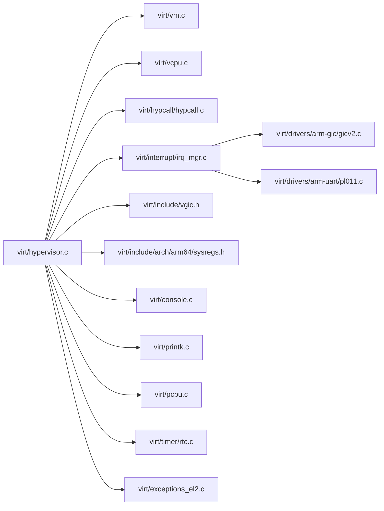

**Diagram sources**
- [virt/hypervisor.c](file://virt/hypervisor.c#L101-L145)
- [virt/vm.c](file://virt/vm.c#L5-L59)
- [virt/vcpu.c](file://virt/vcpu.c#L60-L66)
- [virt/hypcall/hypcall.c](file://virt/hypcall/hypcall.c#L19-L25)
- [virt/interrupt/irq_mgr.c](file://virt/interrupt/irq_mgr.c#L117-L128)
- [virt/include/vgic.h](file://virt/include/vgic.h#L60-L63)
- [virt/include/arch/arm64/sysregs.h](file://virt/include/arch/arm64/sysregs.h#L7-L104)
- [virt/console.c](file://virt/console.c)
- [virt/printk.c](file://virt/printk.c)
- [virt/pcpu.c](file://virt/pcpu.c)
- [virt/timer/rtc.c](file://virt/timer/rtc.c)
- [virt/exceptions_el2.c](file://virt/exceptions_el2.c)
- [virt/drivers/arm-gic/gicv2.c](file://virt/drivers/arm-gic/gicv2.c)
- [virt/drivers/arm-uart/pl011.c](file://virt/drivers/arm-uart/pl011.c)

**Section sources**
- [virt/hypervisor.c](file://virt/hypervisor.c#L101-L145)
- [virt/vm.c](file://virt/vm.c#L5-L59)
- [virt/vcpu.c](file://virt/vcpu.c#L60-L66)
- [virt/hypcall/hypcall.c](file://virt/hypcall/hypcall.c#L19-L25)
- [virt/interrupt/irq_mgr.c](file://virt/interrupt/irq_mgr.c#L117-L128)
- [virt/include/vgic.h](file://virt/include/vgic.h#L60-L63)
- [virt/include/arch/arm64/sysregs.h](file://virt/include/arch/arm64/sysregs.h#L7-L104)
- [virt/console.c](file://virt/console.c)
- [virt/printk.c](file://virt/printk.c)
- [virt/pcpu.c](file://virt/pcpu.c)
- [virt/timer/rtc.c](file://virt/timer/rtc.c)
- [virt/exceptions_el2.c](file://virt/exceptions_el2.c)
- [virt/drivers/arm-gic/gicv2.c](file://virt/drivers/arm-gic/gicv2.c)
- [virt/drivers/arm-uart/pl011.c](file://virt/drivers/arm-uart/pl011.c)

## Performance Considerations
- Minimize HVC frequency and batch guest requests to reduce EL2 overhead.
- Use efficient memory allocation and avoid frequent page table updates.
- Keep virtual GIC updates minimal; coalesce pending IRQs when possible.
- Ensure proper cache and TLB maintenance during context switches.
- Offload heavy tasks to host kernel where feasible to reduce guest overhead.

## Troubleshooting Guide
- If VM fails to start, verify device tree initialization and boot node resolution.
- If interrupts are not delivered, check virtual GIC register writes and IRQ manager device ACK/EOI sequences.
- If HVC calls fail, confirm hypercall registration and handler dispatch logic.
- Use console and logging APIs to capture runtime diagnostics.

**Section sources**
- [virt/hypervisor.c](file://virt/hypervisor.c#L101-L145)
- [virt/interrupt/irq_mgr.c](file://virt/interrupt/irq_mgr.c#L47-L69)
- [virt/hypcall/hypcall.c](file://virt/hypcall/hypcall.c#L19-L25)

## Conclusion
The EL2 hypervisor provides a modular framework for running guest VMs with isolated memory, virtualized interrupts, and emulated devices. It supports dual boot modes and exposes a clean VM/VCPU lifecycle with hypervisor calls. While several subsystems are marked as TODOs, the foundational pieces for secure isolation and efficient operation are present.

## Appendices
- EL2 exception entry and switch routines are provided by architecture-specific assembly.
- Sysreg save/restore functions enable precise context switching for guest registers.

**Section sources**
- [virt/arch/arm64/boot/exception_el2.S](file://virt/arch/arm64/boot/exception_el2.S)
- [virt/arch/arm64/switch/switch.S](file://virt/arch/arm64/switch/switch.S)
- [virt/arch/arm64/sysregs/sysregs.c](file://virt/arch/arm64/sysregs/sysregs.c)
- [virt/include/arch/arm64/sysregs.h](file://virt/include/arch/arm64/sysregs.h#L106-L107)