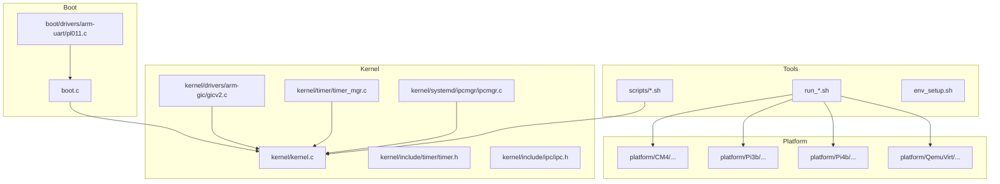
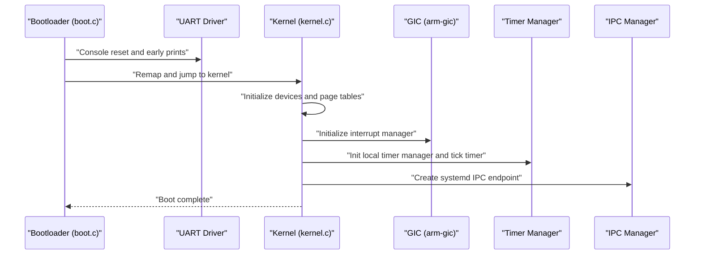
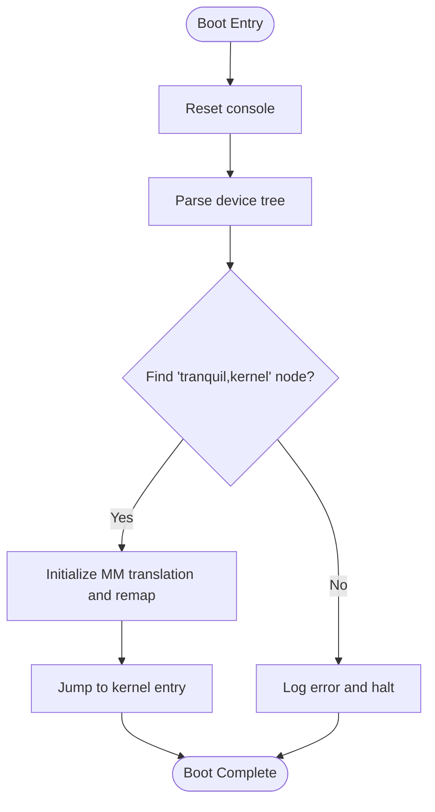
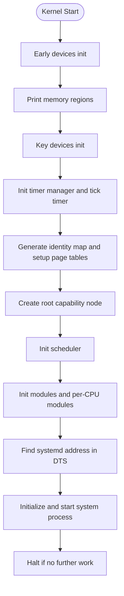
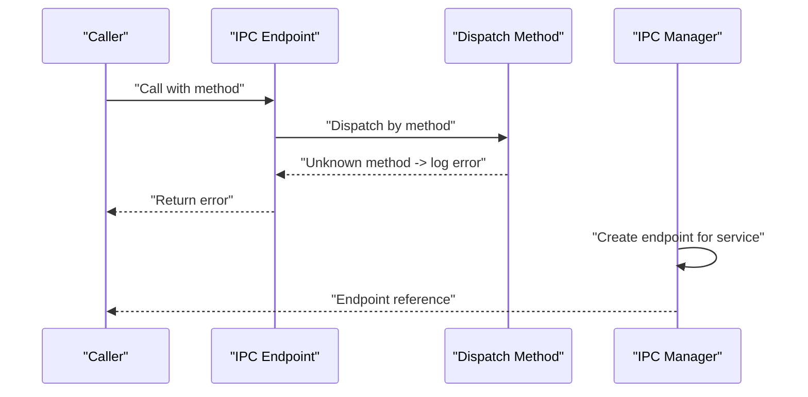
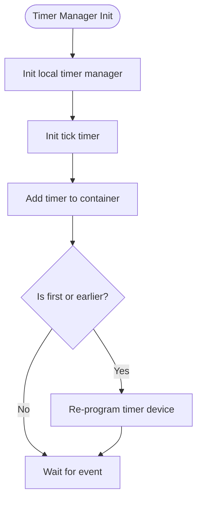
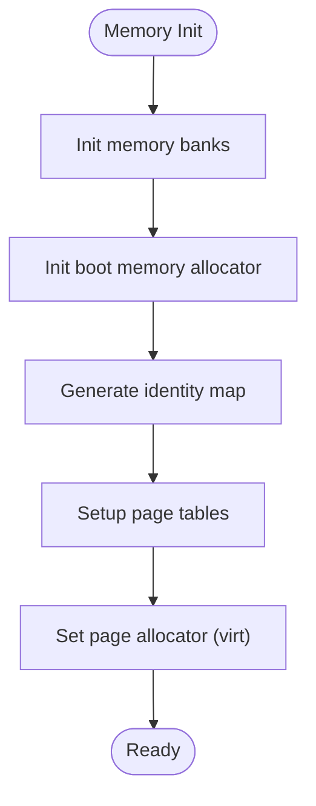
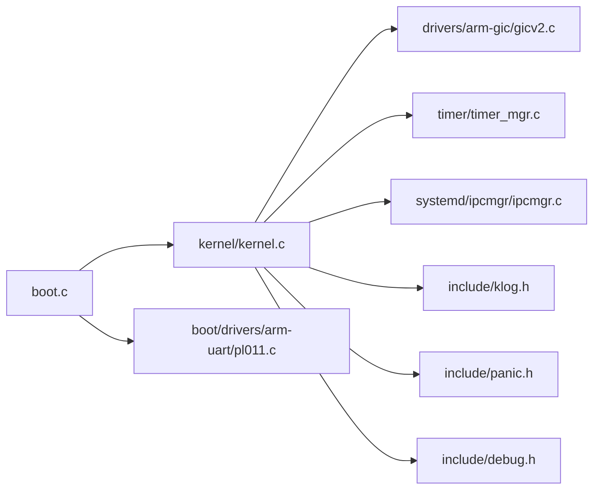

# Troubleshooting and FAQ

<cite>
**Referenced Files in This Document**
- [README.md](file://README.md)
- [boot.c](file://boot/boot.c)
- [kernel.c](file://kernel/kernel.c)
- [klog.h](file://kernel/include/klog.h)
- [panic.h](file://kernel/include/panic.h)
- [debug.h](file://kernel/include/debug.h)
- [cap_ipc_endpoint.c](file://kernel/capability/cap_ipc_endpoint.c)
- [ipcmgr.h](file://kernel/systemd/include/ipcmgr/ipcmgr.h)
- [ipcmgr.c](file://kernel/systemd/ipcmgr/ipcmgr.c)
- [ipc.h](file://kernel/include/ipc/ipc.h)
- [timer.h](file://kernel/include/timer/timer.h)
- [timer_mgr.h](file://kernel/include/timer/timer_mgr.h)
- [timer_mgr.c](file://kernel/timer/timer_mgr.c)
- [build_cm4.sh](file://scripts/build_cm4.sh)
- [build_pi3b.sh](file://scripts/build_pi3b.sh)
- [build_pi4b.sh](file://scripts/build_pi4b.sh)
- [build_qemu.sh](file://scripts/build_qemu.sh)
- [run_board_cm4.sh](file://run_board_cm4.sh)
- [run_qemu_pi3b.sh](file://run_qemu_pi3b.sh)
- [run_qemu_pi4b.sh](file://run_qemu_pi4b.sh)
- [run_qemu_virt.sh](file://run_qemu_virt.sh)
- [env_setup.sh](file://env_setup.sh)
- [pl011.c](file://boot/drivers/arm-uart/pl011.c)
- [pl011.h](file://boot/drivers/arm-uart/pl011.h)
- [pl011.c](file://kernel/drivers/arm-uart/pl011.c)
- [pl011.h](file://kernel/drivers/arm-uart/pl011.h)
- [gicv2.c](file://kernel/drivers/arm-gic/gicv2.c)
- [gicv2.h](file://kernel/drivers/arm-gic/gicv2.h)
- [gicv3.c](file://kernel/drivers/arm-gic/gicv3.c)
- [gicv3.h](file://kernel/drivers/arm-gic/gicv3.h)
- [mm.c](file://virt/mm/mm.c)
</cite>

## Table of Contents
1. [Introduction](#introduction)
2. [Project Structure](#project-structure)
3. [Core Components](#core-components)
4. [Architecture Overview](#architecture-overview)
5. [Detailed Component Analysis](#detailed-component-analysis)
6. [Dependency Analysis](#dependency-analysis)
7. [Performance Considerations](#performance-considerations)
8. [Troubleshooting Guide](#troubleshooting-guide)
9. [Conclusion](#conclusion)
10. [Appendices](#appendices)

## Introduction
This document provides a comprehensive troubleshooting and FAQ guide for TranquilOS. It focuses on diagnosing and resolving common issues during development, building, and running the system across platforms. It also documents logging, panic handling, IPC behavior, timers, and platform-specific pitfalls. Step-by-step procedures are included for boot failures, memory issues, IPC problems, and platform-specific anomalies. Guidance on debugging tools, log analysis, and performance profiling is provided, along with pointers to community resources and contribution etiquette.

## Project Structure
TranquilOS is organized into several major areas:
- Boot stage: early boot, device tree parsing, relocation, and jump to kernel
- Kernel: core initialization, interrupts, timers, scheduling, memory management, IPC, and system services
- Platform configurations: per-board and QEMU virtual targets
- Userspace services and applications
- Virtualization layer for hosted environments

**Diagram sources**
- [boot.c](file://boot/boot.c#L1-L176)
- [kernel.c](file://kernel/kernel.c#L1-L225)
- [pl011.c](file://boot/drivers/arm-uart/pl011.c)
- [gicv2.c](file://kernel/drivers/arm-gic/gicv2.c)
- [timer.h](file://kernel/include/timer/timer.h#L1-L56)
- [timer_mgr.c](file://kernel/timer/timer_mgr.c#L47-L208)
- [ipcmgr.c](file://kernel/systemd/ipcmgr/ipcmgr.c#L144-L182)
- [build_cm4.sh](file://scripts/build_cm4.sh#L1-L6)
- [build_pi3b.sh](file://scripts/build_pi3b.sh#L1-L6)
- [build_pi4b.sh](file://scripts/build_pi4b.sh#L1-L6)
- [build_qemu.sh](file://scripts/build_qemu.sh#L1-L6)
- [run_board_cm4.sh](file://run_board_cm4.sh)
- [run_qemu_pi3b.sh](file://run_qemu_pi3b.sh)
- [run_qemu_pi4b.sh](file://run_qemu_pi4b.sh)
- [run_qemu_virt.sh](file://run_qemu_virt.sh)
- [env_setup.sh](file://env_setup.sh)

**Section sources**
- [README.md](file://README.md#L1-L42)
- [boot.c](file://boot/boot.c#L1-L176)
- [kernel.c](file://kernel/kernel.c#L1-L225)

## Core Components
- Logging and diagnostics: centralized macros for log levels and formatted output
- Panic handling: structured panic macro that logs and halts
- Debug output: platform-specific debug character output helpers
- IPC and system services: capability-based IPC endpoints and systemd-managed services
- Timers and timekeeping: timer manager with containers and tick timer
- Build and run scripts: platform-specific generators and runners

Key implementation references:
- Logging macros and levels: [klog.h](file://kernel/include/klog.h#L8-L36)
- Panic macro: [panic.h](file://kernel/include/panic.h#L6-L8)
- Debug helpers: [debug.h](file://kernel/include/debug.h#L8-L30)
- IPC dispatch and errors: [cap_ipc_endpoint.c](file://kernel/capability/cap_ipc_endpoint.c#L124-L145)
- IPC manager and endpoints: [ipcmgr.h](file://kernel/systemd/include/ipcmgr/ipcmgr.h#L6-L15), [ipcmgr.c](file://kernel/systemd/ipcmgr/ipcmgr.c#L144-L182)
- Timer structures and manager: [timer.h](file://kernel/include/timer/timer.h#L16-L56), [timer_mgr.h](file://kernel/include/timer/timer_mgr.h#L22-L61), [timer_mgr.c](file://kernel/timer/timer_mgr.c#L47-L208)

**Section sources**
- [klog.h](file://kernel/include/klog.h#L1-L38)
- [panic.h](file://kernel/include/panic.h#L1-L10)
- [debug.h](file://kernel/include/debug.h#L1-L31)
- [cap_ipc_endpoint.c](file://kernel/capability/cap_ipc_endpoint.c#L124-L145)
- [ipcmgr.h](file://kernel/systemd/include/ipcmgr/ipcmgr.h#L1-L15)
- [ipcmgr.c](file://kernel/systemd/ipcmgr/ipcmgr.c#L144-L182)
- [timer.h](file://kernel/include/timer/timer.h#L1-L56)
- [timer_mgr.h](file://kernel/include/timer/timer_mgr.h#L1-L61)
- [timer_mgr.c](file://kernel/timer/timer_mgr.c#L47-L208)

## Architecture Overview
The system boots via the bootloader, initializes devices and memory, sets up page tables, and jumps to the kernel. The kernel initializes interrupts, timers, memory subsystems, and the scheduler, then starts the system daemon and user-space services. IPC endpoints are created and managed by the systemd IPC manager.

**Diagram sources**
- [boot.c](file://boot/boot.c#L82-L107)
- [kernel.c](file://kernel/kernel.c#L125-L224)
- [gicv2.c](file://kernel/drivers/arm-gic/gicv2.c)
- [timer_mgr.c](file://kernel/timer/timer_mgr.c#L155-L157)
- [ipcmgr.c](file://kernel/systemd/ipcmgr/ipcmgr.c#L144-L182)

## Detailed Component Analysis

### Boot Diagnostics
Common boot-time issues include missing device tree nodes, relocation failures, or console initialization problems. The bootloader logs key information and can halt on critical errors.

**Diagram sources**
- [boot.c](file://boot/boot.c#L34-L56)

**Section sources**
- [boot.c](file://boot/boot.c#L27-L107)

### Kernel Initialization Diagnostics
Kernel initialization involves device tree parsing, enabling interrupts, initializing timers, memory banks, page tables, root capability node, scheduler, and finally starting the system daemon. Failures here often manifest as panics or missing subsystems.

**Diagram sources**
- [kernel.c](file://kernel/kernel.c#L125-L224)

**Section sources**
- [kernel.c](file://kernel/kernel.c#L125-L224)

### IPC Troubleshooting
IPC endpoints are capability-based and dispatched by method. Unknown methods produce explicit error logs. The IPC manager creates endpoints for services and tracks them.

**Diagram sources**
- [cap_ipc_endpoint.c](file://kernel/capability/cap_ipc_endpoint.c#L124-L145)
- [ipcmgr.c](file://kernel/systemd/ipcmgr/ipcmgr.c#L144-L182)

**Section sources**
- [cap_ipc_endpoint.c](file://kernel/capability/cap_ipc_endpoint.c#L124-L145)
- [ipcmgr.h](file://kernel/systemd/include/ipcmgr/ipcmgr.h#L6-L15)
- [ipcmgr.c](file://kernel/systemd/ipcmgr/ipcmgr.c#L144-L182)

### Timer and Timekeeping Diagnostics
Timers are managed per CPU with containers and a tick timer. Reprogramming occurs when the earliest timer changes. Missing timer devices or containers cause errors.

**Diagram sources**
- [timer_mgr.c](file://kernel/timer/timer_mgr.c#L84-L95)
- [timer_mgr.c](file://kernel/timer/timer_mgr.c#L155-L157)

**Section sources**
- [timer.h](file://kernel/include/timer/timer.h#L16-L56)
- [timer_mgr.h](file://kernel/include/timer/timer_mgr.h#L22-L61)
- [timer_mgr.c](file://kernel/timer/timer_mgr.c#L47-L208)

### Memory Management Notes
Memory allocation and page tables are initialized during kernel start. The virtualization layer exposes a page allocator setter for hosted environments.

**Diagram sources**
- [kernel.c](file://kernel/kernel.c#L181-L189)
- [mm.c](file://virt/mm/mm.c#L8-L15)

**Section sources**
- [kernel.c](file://kernel/kernel/kernel.c#L181-L189)
- [mm.c](file://virt/mm/mm.c#L8-L15)

## Dependency Analysis
The following diagram highlights key dependencies among core components involved in boot, kernel initialization, IPC, and timers.

**Diagram sources**
- [boot.c](file://boot/boot.c#L1-L176)
- [kernel.c](file://kernel/kernel.c#L1-L225)
- [pl011.c](file://boot/drivers/arm-uart/pl011.c)
- [gicv2.c](file://kernel/drivers/arm-gic/gicv2.c)
- [timer_mgr.c](file://kernel/timer/timer_mgr.c#L47-L208)
- [ipcmgr.c](file://kernel/systemd/ipcmgr/ipcmgr.c#L144-L182)
- [klog.h](file://kernel/include/klog.h#L1-L38)
- [panic.h](file://kernel/include/panic.h#L1-L10)
- [debug.h](file://kernel/include/debug.h#L1-L31)

**Section sources**
- [boot.c](file://boot/boot.c#L1-L176)
- [kernel.c](file://kernel/kernel.c#L1-L225)

## Performance Considerations
- Logging overhead: Excessive debug logs can slow down timing-sensitive paths. Adjust log level macros to INFO/WARNING for production builds.
- Timer granularity: Ensure tick timer is configured appropriately for target platforms to avoid unnecessary wake-ups.
- IPC latency: Minimize cross-process IPC calls in hot loops; batch operations when possible.
- Memory allocation: Prefer boot-time allocations for critical paths; avoid frequent dynamic allocations during early boot.

[No sources needed since this section provides general guidance]

## Troubleshooting Guide

### Boot Failures
Symptoms
- System hangs immediately after console reset
- No output after “DeviceTreeBlob” message
- Panic or halt after “no page allocator inited!”

Step-by-step procedure
1. Verify device tree compatibility:
   - Confirm the kernel node exists and is compatible with the expected identifier.
   - Check that the device tree blob address is valid and passed correctly.
2. Inspect console driver:
   - Ensure the UART driver is initialized before printing.
   - Validate platform-specific UART base addresses and registers.
3. Memory and relocation:
   - Confirm memory regions are printed and mapped.
   - Ensure identity page tables are generated and active.
4. Panic investigation:
   - Look for “no page allocator inited!” or “timer_mgr not inited!” panics.
   - Review module initialization order and dependencies.

References
- Bootloader entry and error paths: [boot.c](file://boot/boot.c#L34-L56)
- Kernel early initialization and panics: [kernel.c](file://kernel/kernel.c#L50-L59), [kernel.c](file://kernel/kernel.c#L87-L101), [kernel.c](file://kernel/kernel.c#L161-L169)

**Section sources**
- [boot.c](file://boot/boot.c#L34-L56)
- [kernel.c](file://kernel/kernel.c#L50-L59)
- [kernel.c](file://kernel/kernel.c#L87-L101)
- [kernel.c](file://kernel/kernel.c#L161-L169)

### Memory Issues
Symptoms
- Boot-time panic indicating missing page allocator
- Out-of-memory during endpoint creation
- Incorrect memory region sizes or overlaps

Step-by-step procedure
1. Validate memory bank initialization:
   - Confirm sparse memory banks are initialized before boot allocator.
2. Check boot memory allocator:
   - Ensure boot allocator is enabled during early boot and disabled after handoff.
3. Endpoint allocation:
   - If endpoint creation fails, verify physical memory allocation and kernel object allocation paths.
4. Page table setup:
   - Confirm identity map generation and page table activation.

References
- Memory bank and boot allocator: [kernel.c](file://kernel/kernel.c#L181-L184)
- Boot allocator disable: [kernel.c](file://kernel/kernel.c#L214-L215)
- Endpoint allocation failure logs: [ipcmgr.c](file://kernel/systemd/ipcmgr/ipcmgr.c#L162-L173)
- Page allocator setter (virtualization): [mm.c](file://virt/mm/mm.c#L8-L15)

**Section sources**
- [kernel.c](file://kernel/kernel.c#L181-L184)
- [kernel.c](file://kernel/kernel.c#L214-L215)
- [ipcmgr.c](file://kernel/systemd/ipcmgr/ipcmgr.c#L162-L173)
- [mm.c](file://virt/mm/mm.c#L8-L15)

### IPC Problems
Symptoms
- Capability dispatch reports “unknown method”
- IPC endpoint creation fails
- Services unreachable via name service

Step-by-step procedure
1. Verify endpoint method:
   - Ensure the called method matches a supported value in the dispatcher.
2. Check endpoint creation:
   - Confirm memory allocation succeeds and endpoint entry point is valid.
3. Validate service registration:
   - Ensure the service ID is recognized and endpoint is registered.

References
- Unknown method logging: [cap_ipc_endpoint.c](file://kernel/capability/cap_ipc_endpoint.c#L142-L143)
- Endpoint creation and registration: [ipcmgr.c](file://kernel/systemd/ipcmgr/ipcmgr.c#L156-L182)
- IPC manager structure: [ipcmgr.h](file://kernel/systemd/include/ipcmgr/ipcmgr.h#L6-L15)

**Section sources**
- [cap_ipc_endpoint.c](file://kernel/capability/cap_ipc_endpoint.c#L142-L143)
- [ipcmgr.c](file://kernel/systemd/ipcmgr/ipcmgr.c#L156-L182)
- [ipcmgr.h](file://kernel/systemd/include/ipcmgr/ipcmgr.h#L6-L15)

### Timer and Scheduling Hangs
Symptoms
- No progress after timer manager init
- Scheduler never yields control
- Tick timer not programmed

Step-by-step procedure
1. Initialize timer manager and tick timer:
   - Ensure local timer manager and tick timer are initialized per CPU.
2. Reprogram timer device:
   - Verify the earliest timer triggers device reprogramming.
3. Check timer containers:
   - Ensure monotonic container is initialized and timers are added.

References
- Local timer manager init and tick: [kernel.c](file://kernel/kernel.c#L159-L169)
- Timer manager operations: [timer_mgr.c](file://kernel/timer/timer_mgr.c#L155-L157), [timer_mgr.c](file://kernel/timer/timer_mgr.c#L84-L95)
- Timer structures: [timer.h](file://kernel/include/timer/timer.h#L16-L56), [timer_mgr.h](file://kernel/include/timer/timer_mgr.h#L22-L61)

**Section sources**
- [kernel.c](file://kernel/kernel.c#L159-L169)
- [timer_mgr.c](file://kernel/timer/timer_mgr.c#L84-L95)
- [timer_mgr.c](file://kernel/timer/timer_mgr.c#L155-L157)
- [timer.h](file://kernel/include/timer/timer.h#L16-L56)
- [timer_mgr.h](file://kernel/include/timer/timer_mgr.h#L22-L61)

### Platform-Specific Issues
Symptoms
- Build fails due to missing generator arguments
- Run script not found or environment not sourced
- UART output not visible on target hardware

Step-by-step procedure
1. Build scripts:
   - Use platform-specific build scripts with correct generator arguments.
2. Environment:
   - Source the environment setup script before running board or QEMU scripts.
3. Hardware console:
   - Ensure UART base addresses match the target platform and console is reset before boot.

References
- Build scripts: [build_cm4.sh](file://scripts/build_cm4.sh#L4), [build_pi3b.sh](file://scripts/build_pi3b.sh#L4), [build_pi4b.sh](file://scripts/build_pi4b.sh#L4), [build_qemu.sh](file://scripts/build_qemu.sh#L4)
- Runners: [run_board_cm4.sh](file://run_board_cm4.sh), [run_qemu_pi3b.sh](file://run_qemu_pi3b.sh), [run_qemu_pi4b.sh](file://run_qemu_pi4b.sh), [run_qemu_virt.sh](file://run_qemu_virt.sh)
- Environment: [env_setup.sh](file://env_setup.sh)
- UART driver (boot): [pl011.c](file://boot/drivers/arm-uart/pl011.c)
- UART driver (kernel): [pl011.c](file://kernel/drivers/arm-uart/pl011.c)

**Section sources**
- [build_cm4.sh](file://scripts/build_cm4.sh#L1-L6)
- [build_pi3b.sh](file://scripts/build_pi3b.sh#L1-L6)
- [build_pi4b.sh](file://scripts/build_pi4b.sh#L1-L6)
- [build_qemu.sh](file://scripts/build_qemu.sh#L1-L6)
- [run_board_cm4.sh](file://run_board_cm4.sh)
- [run_qemu_pi3b.sh](file://run_qemu_pi3b.sh)
- [run_qemu_pi4b.sh](file://run_qemu_pi4b.sh)
- [run_qemu_virt.sh](file://run_qemu_virt.sh)
- [env_setup.sh](file://env_setup.sh)
- [pl011.c](file://boot/drivers/arm-uart/pl011.c)
- [pl011.c](file://kernel/drivers/arm-uart/pl011.c)

### Debugging Tools and Log Analysis
- Logging levels: Use debug/info/warning/error macros to filter verbosity.
- Panic inspection: PANIC macro logs file, function, and line number before halting.
- Debug output: Platform-specific debug character output for minimal-console targets.
- Console reset: Ensure console is reset before printing to avoid garbled output.

References
- Log macros and levels: [klog.h](file://kernel/include/klog.h#L8-L36)
- Panic macro: [panic.h](file://kernel/include/panic.h#L6-L8)
- Debug helpers: [debug.h](file://kernel/include/debug.h#L8-L30)
- Console reset in boot: [boot.c](file://boot/boot.c#L85-L85)

**Section sources**
- [klog.h](file://kernel/include/klog.h#L8-L36)
- [panic.h](file://kernel/include/panic.h#L6-L8)
- [debug.h](file://kernel/include/debug.h#L8-L30)
- [boot.c](file://boot/boot.c#L85-L85)

### Performance Profiling Techniques
- Reduce log level in hot paths to minimize overhead.
- Profile timer intervals and container sizes to tune scheduling granularity.
- Measure IPC round-trip times and reduce cross-process calls where feasible.

[No sources needed since this section provides general guidance]

## Conclusion
This guide consolidates practical troubleshooting steps for TranquilOS across boot, memory, IPC, timers, and platform-specific scenarios. By following the diagnostic flows and leveraging the logging and panic infrastructure, most issues can be quickly identified and resolved. For persistent problems, collect logs around the failure point, confirm device tree and platform configuration, and validate IPC and timer subsystems.

[No sources needed since this section summarizes without analyzing specific files]

## Appendices

### Frequently Asked Questions
- How do I change the log verbosity?
  - Adjust the current log level macro in the logging header.
  - References: [klog.h](file://kernel/include/klog.h#L15-L15)
- Why does the system halt with a panic during kernel init?
  - Check for missing subsystems (timer manager, scheduler, page allocator) and ensure initialization order.
  - References: [kernel.c](file://kernel/kernel.c#L87-L101), [kernel.c](file://kernel/kernel.c#L161-L169)
- How do I verify IPC endpoint creation?
  - Confirm allocation success and endpoint registration in the IPC manager.
  - References: [ipcmgr.c](file://kernel/systemd/ipcmgr/ipcmgr.c#L156-L182)
- How do I rebuild for a specific platform?
  - Use the platform-specific build script with the correct generator argument.
  - References: [build_cm4.sh](file://scripts/build_cm4.sh#L4), [build_pi3b.sh](file://scripts/build_pi3b.sh#L4), [build_pi4b.sh](file://scripts/build_pi4b.sh#L4), [build_qemu.sh](file://scripts/build_qemu.sh#L4)
- How do I run on QEMU or a board?
  - Source the environment setup script, then run the appropriate runner script.
  - References: [env_setup.sh](file://env_setup.sh), [run_qemu_virt.sh](file://run_qemu_virt.sh), [run_board_cm4.sh](file://run_board_cm4.sh)

**Section sources**
- [klog.h](file://kernel/include/klog.h#L15-L15)
- [kernel.c](file://kernel/kernel.c#L87-L101)
- [kernel.c](file://kernel/kernel.c#L161-L169)
- [ipcmgr.c](file://kernel/systemd/ipcmgr/ipcmgr.c#L156-L182)
- [build_cm4.sh](file://scripts/build_cm4.sh#L4)
- [build_pi3b.sh](file://scripts/build_pi3b.sh#L4)
- [build_pi4b.sh](file://scripts/build_pi4b.sh#L4)
- [build_qemu.sh](file://scripts/build_qemu.sh#L4)
- [env_setup.sh](file://env_setup.sh)
- [run_qemu_virt.sh](file://run_qemu_virt.sh)
- [run_board_cm4.sh](file://run_board_cm4.sh)

### Community Resources and Contribution Guidelines
- Build and run quickstart is documented in the project README.
- Toolchain downloads are linked from the README.
- For issues and contributions, follow typical open-source practices: open an issue with logs, reproduction steps, and environment details.

References
- Quickstart and toolchain links: [README.md](file://README.md#L35-L42)

**Section sources**
- [README.md](file://README.md#L35-L42)