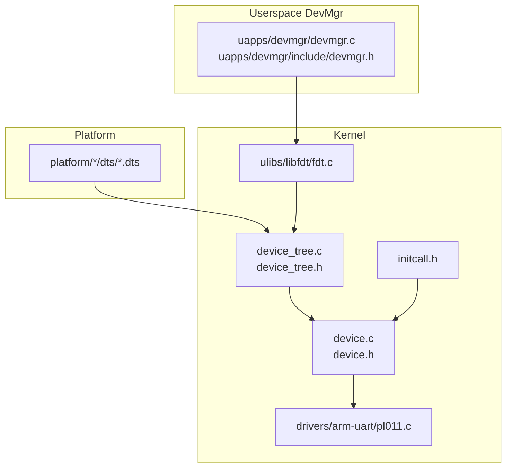
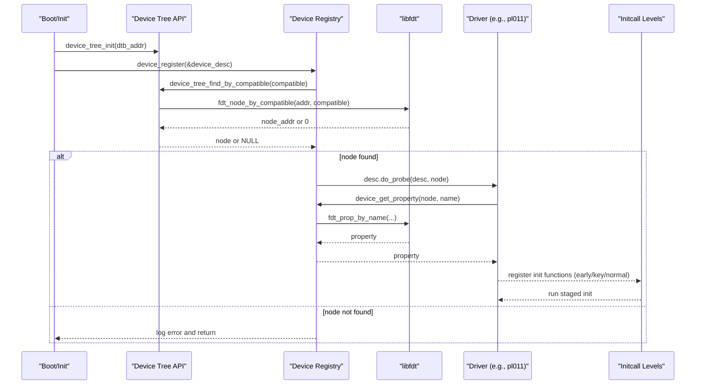
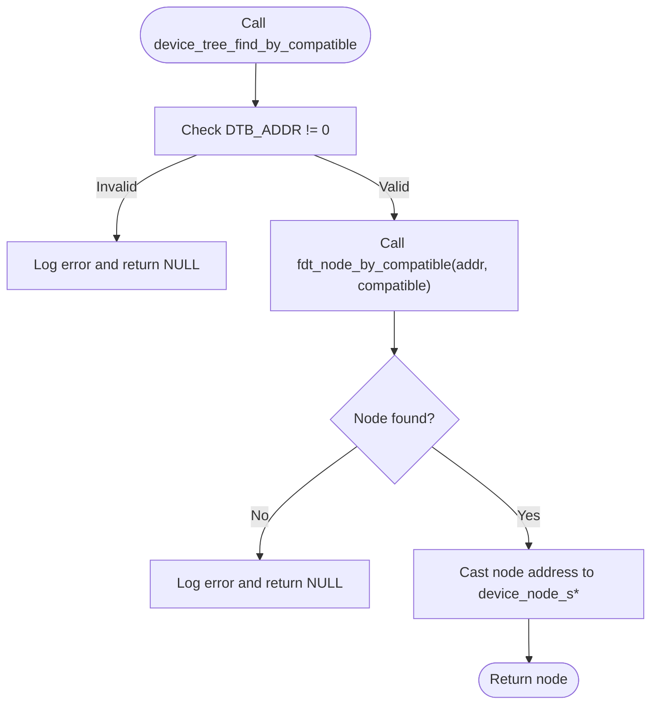
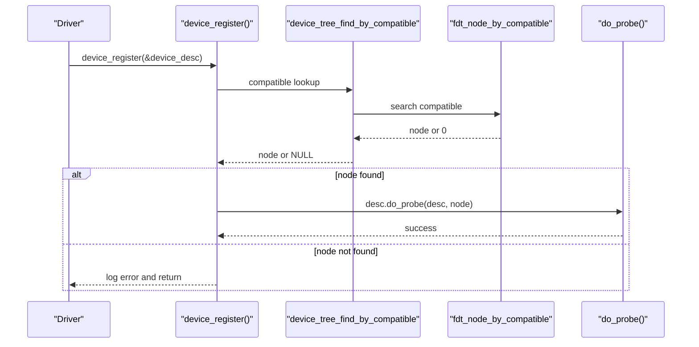
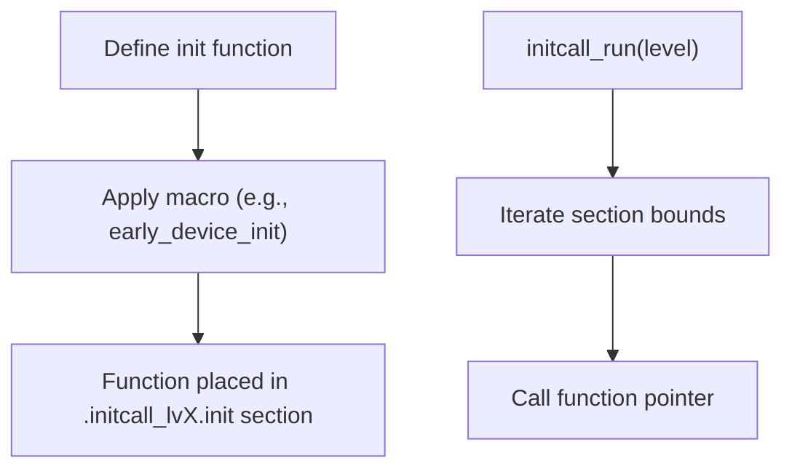
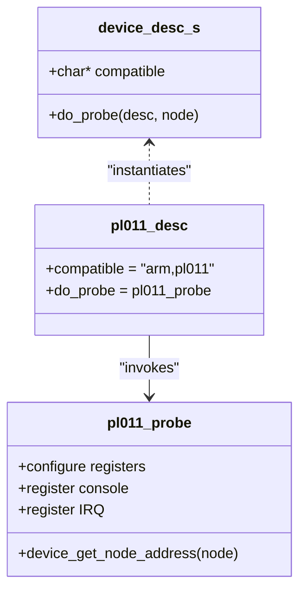
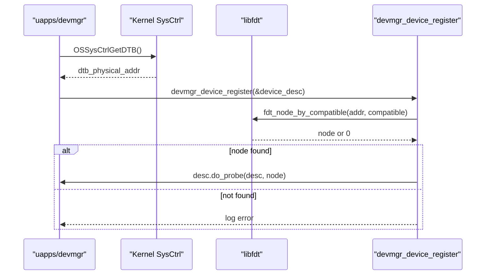
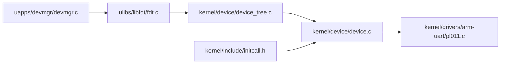

# Device Discovery and Registration

<cite>
**Referenced Files in This Document**
- [device_tree.c](file://kernel/device/device_tree.c)
- [device_tree.h](file://kernel/include/device/device_tree.h)
- [device.c](file://kernel/device/device.c)
- [device.h](file://kernel/include/device/device.h)
- [initcall.h](file://kernel/include/initcall.h)
- [fdt.c](file://ulibs/libfdt/fdt.c)
- [pl011.c](file://kernel/drivers/arm-uart/pl011.c)
- [bcm2711-rpi-cm4.dts](file://platform/CM4/dts/bcm2711-rpi-cm4.dts)
- [devmgr.c](file://uapps/devmgr/devmgr.c)
- [devmgr.h](file://uapps/devmgr/include/devmgr.h)
</cite>

## Table of Contents
1. [Introduction](#introduction)
2. [Project Structure](#project-structure)
3. [Core Components](#core-components)
4. [Architecture Overview](#architecture-overview)
5. [Detailed Component Analysis](#detailed-component-analysis)
6. [Dependency Analysis](#dependency-analysis)
7. [Performance Considerations](#performance-considerations)
8. [Troubleshooting Guide](#troubleshooting-guide)
9. [Conclusion](#conclusion)
10. [Appendices](#appendices)

## Introduction
This document explains the device discovery and registration subsystem within the Device Manager. It covers how the kernel parses the Device Tree Blob (DTB), discovers device nodes via compatible strings, enumerates nodes, and instantiates devices through the registration API. It also documents the device registration API, the device_desc_s structure, compatible string specifications, and the do_probe callback. The workflow spans DTB parsing, node matching, property retrieval, and initialization sequencing via initcalls. Practical examples illustrate compatible string usage and device probing implementations, along with lifecycle management and integration with the kernel’s device management system.

## Project Structure
The device discovery and registration subsystem is composed of:
- Kernel-side device tree parsing and device registration APIs
- Initcall infrastructure for staged device initialization
- Example driver implementing a device probe
- Platform Device Tree sources for compatible strings and node definitions
- Userspace Device Manager (uapps/devmgr) mirroring kernel-side discovery and registration

**Diagram sources**
- [device_tree.c](file://kernel/device/device_tree.c#L1-L95)
- [device_tree.h](file://kernel/include/device/device_tree.h#L1-L25)
- [device.c](file://kernel/device/device.c#L1-L55)
- [device.h](file://kernel/include/device/device.h#L1-L37)
- [initcall.h](file://kernel/include/initcall.h#L1-L44)
- [fdt.c](file://ulibs/libfdt/fdt.c#L48-L334)
- [pl011.c](file://kernel/drivers/arm-uart/pl011.c#L1-L138)
- [bcm2711-rpi-cm4.dts](file://platform/CM4/dts/bcm2711-rpi-cm4.dts#L1-L2622)
- [devmgr.c](file://uapps/devmgr/devmgr.c#L1-L62)
- [devmgr.h](file://uapps/devmgr/include/devmgr.h#L1-L30)

**Section sources**
- [device_tree.c](file://kernel/device/device_tree.c#L1-L95)
- [device_tree.h](file://kernel/include/device/device_tree.h#L1-L25)
- [device.c](file://kernel/device/device.c#L1-L55)
- [device.h](file://kernel/include/device/device.h#L1-L37)
- [initcall.h](file://kernel/include/initcall.h#L1-L44)
- [fdt.c](file://ulibs/libfdt/fdt.c#L48-L334)
- [pl011.c](file://kernel/drivers/arm-uart/pl011.c#L1-L138)
- [bcm2711-rpi-cm4.dts](file://platform/CM4/dts/bcm2711-rpi-cm4.dts#L1-L2622)
- [devmgr.c](file://uapps/devmgr/devmgr.c#L1-L62)
- [devmgr.h](file://uapps/devmgr/include/devmgr.h#L1-L30)

## Core Components
- Device Tree Parsing API
  - Initializes DTB address, dumps the tree, finds nodes by compatible or device_type, iterates nodes, and extracts node addresses.
- Device Registration API
  - Registers a device via device_desc_s, which includes a compatible string and a do_probe callback.
  - Provides property lookup helpers and staged initialization functions driven by initcalls.
- Initcall Infrastructure
  - Defines initialization levels and macros to register and run init functions in order.
- Example Driver
  - Implements a probe for a UART device using the registration API and compatible string.

Key structures and functions:
- device_desc_s: carries compatible string and do_probe callback
- device_register(): matches compatible string against DTB and invokes do_probe
- device_tree_find_by_compatible(): locates a node by compatible string
- device_get_node_address(): extracts physical address from node
- initcall macros: early/key/normal device init registration and execution

**Section sources**
- [device_tree.c](file://kernel/device/device_tree.c#L10-L95)
- [device_tree.h](file://kernel/include/device/device_tree.h#L7-L22)
- [device.c](file://kernel/device/device.c#L13-L30)
- [device.h](file://kernel/include/device/device.h#L18-L27)
- [initcall.h](file://kernel/include/initcall.h#L7-L34)

## Architecture Overview
The device discovery and registration workflow:
1. DTB is initialized and parsed.
2. Drivers declare device_desc_s with compatible string and do_probe.
3. device_register() searches DTB for matching node by compatible.
4. If found, do_probe() is invoked with the matched node.
5. Properties are retrieved via device_get_property().
6. Staged initialization runs via initcall levels.

**Diagram sources**
- [device_tree.c](file://kernel/device/device_tree.c#L10-L37)
- [device.c](file://kernel/device/device.c#L13-L26)
- [fdt.c](file://ulibs/libfdt/fdt.c#L152-L205)
- [pl011.c](file://kernel/drivers/arm-uart/pl011.c#L92-L138)
- [initcall.h](file://kernel/include/initcall.h#L26-L34)

## Detailed Component Analysis

### Device Tree Parsing API
Responsibilities:
- Initialize DTB address and enable dumping
- Find nodes by compatible string or device_type
- Iterate nodes globally or by device_type
- Extract node address and properties

Implementation highlights:
- device_tree_init() sets global DTB address and enables logging
- device_tree_find_by_compatible() leverages fdt_node_by_compatible()
- device_tree_iter_node()/device_tree_iter_node_by_type() iterate nodes
- device_get_node_address() parses node address from node name string

**Diagram sources**
- [device_tree.c](file://kernel/device/device_tree.c#L25-L37)
- [fdt.c](file://ulibs/libfdt/fdt.c#L152-L205)

**Section sources**
- [device_tree.c](file://kernel/device/device_tree.c#L10-L95)
- [device_tree.h](file://kernel/include/device/device_tree.h#L12-L22)
- [fdt.c](file://ulibs/libfdt/fdt.c#L152-L205)

### Device Registration API
Responsibilities:
- Register a device by compatible string
- Invoke do_probe() with the matched device node
- Provide property lookup helper

Key behaviors:
- device_register() validates descriptor, finds node, logs and calls do_probe
- device_get_property() wraps fdt property lookup
- init_early_devices(), init_key_devices(), init_normal_devices() run staged initcalls

**Diagram sources**
- [device.c](file://kernel/device/device.c#L13-L26)
- [device.h](file://kernel/include/device/device.h#L18-L22)
- [device_tree.c](file://kernel/device/device_tree.c#L25-L37)
- [fdt.c](file://ulibs/libfdt/fdt.c#L152-L205)

**Section sources**
- [device.c](file://kernel/device/device.c#L13-L30)
- [device.h](file://kernel/include/device/device.h#L18-L27)

### Initcall Infrastructure
Responsibilities:
- Define initialization levels
- Register functions into specific initcall sections
- Run registered functions in order

Highlights:
- Macros define levels (early, per-CPU variants, key, normal)
- initcall_init() places functions into sections
- initcall_run() iterates and executes functions in section order

**Diagram sources**
- [initcall.h](file://kernel/include/initcall.h#L19-L34)

**Section sources**
- [initcall.h](file://kernel/include/initcall.h#L7-L34)

### Example Driver: PL011 UART
Responsibilities:
- Probe function initializes UART registers and console
- Uses device_get_node_address() to map device node to memory
- Registers IRQ handler and console device
- Declares device_desc_s with compatible string and do_probe

**Diagram sources**
- [pl011.c](file://kernel/drivers/arm-uart/pl011.c#L127-L138)
- [pl011.c](file://kernel/drivers/arm-uart/pl011.c#L92-L125)
- [device.h](file://kernel/include/device/device.h#L18-L22)

**Section sources**
- [pl011.c](file://kernel/drivers/arm-uart/pl011.c#L92-L138)
- [device.h](file://kernel/include/device/device.h#L18-L22)

### Userspace Device Manager (DevMgr)
Responsibilities:
- Mirror kernel-side discovery and registration
- Retrieve DTB address from kernel and locate nodes by compatible
- Invoke do_probe() when a match is found

**Diagram sources**
- [devmgr.c](file://uapps/devmgr/devmgr.c#L33-L55)
- [devmgr.h](file://uapps/devmgr/include/devmgr.h#L16-L20)
- [fdt.c](file://ulibs/libfdt/fdt.c#L152-L205)

**Section sources**
- [devmgr.c](file://uapps/devmgr/devmgr.c#L10-L55)
- [devmgr.h](file://uapps/devmgr/include/devmgr.h#L13-L29)

## Dependency Analysis
- Kernel device tree API depends on libfdt for parsing and node iteration
- Device registration API depends on device tree API and initcall infrastructure
- Drivers depend on device registration API and device tree API
- Userspace DevMgr depends on libfdt and kernel syscalls to retrieve DTB

**Diagram sources**
- [fdt.c](file://ulibs/libfdt/fdt.c#L48-L334)
- [device_tree.c](file://kernel/device/device_tree.c#L1-L95)
- [device.c](file://kernel/device/device.c#L1-L55)
- [initcall.h](file://kernel/include/initcall.h#L1-L44)
- [devmgr.c](file://uapps/devmgr/devmgr.c#L1-L62)

**Section sources**
- [fdt.c](file://ulibs/libfdt/fdt.c#L48-L334)
- [device_tree.c](file://kernel/device/device_tree.c#L1-L95)
- [device.c](file://kernel/device/device.c#L1-L55)
- [initcall.h](file://kernel/include/initcall.h#L1-L44)
- [devmgr.c](file://uapps/devmgr/devmgr.c#L1-L62)

## Performance Considerations
- DTB parsing cost: Linear scan over nodes and properties; keep compatible strings concise and unique to reduce search time.
- Iteration overhead: device_tree_iter_node_by_type() traverses the entire tree; use targeted compatible lookups where possible.
- Property retrieval: device_get_property() performs a linear scan; cache frequently accessed properties after first lookup.
- Initcall ordering: Early and key stages initialize critical devices first; avoid heavy work in normal stage to defer nonessential initialization.

## Troubleshooting Guide
Common issues and remedies:
- DTB not initialized
  - Symptom: device_tree_find_by_compatible() returns NULL and logs an error.
  - Action: Ensure device_tree_init() is called with a valid DTB address before discovery.
- Compatible string mismatch
  - Symptom: device_register() logs “not found in dtb”.
  - Action: Verify compatible string matches the device tree exactly; check DTS for correct spelling and order.
- Node address extraction failure
  - Symptom: device_get_node_address() returns zero or incorrect value.
  - Action: Confirm node name contains a valid address suffix and that the parser correctly identifies it.
- Missing property
  - Symptom: device_get_property() returns NULL.
  - Action: Verify property name and ensure it exists under the matched node in the DTS.
- Initcall ordering problems
  - Symptom: Devices fail to initialize because prerequisites are missing.
  - Action: Place device registration in appropriate initcall level (early/key/normal) and ensure dependencies are met.

**Section sources**
- [device_tree.c](file://kernel/device/device_tree.c#L25-L37)
- [device.c](file://kernel/device/device.c#L13-L26)
- [fdt.c](file://ulibs/libfdt/fdt.c#L152-L205)

## Conclusion
The Device Manager’s device discovery and registration subsystem integrates DTB parsing, compatible string matching, and staged initialization to instantiate hardware devices reliably. The kernel-side APIs provide robust discovery and registration primitives, while the initcall framework ensures proper ordering. The userspace DevMgr mirrors these capabilities for device management tasks outside the kernel. Following the patterns documented here enables consistent device lifecycle management and predictable integration with the kernel’s device management system.

## Appendices

### Practical Examples

- Device Registration Pattern
  - Define device_desc_s with compatible string and do_probe
  - Register during an appropriate initcall level
  - Use device_get_property() to fetch required resources
  - Example reference: [pl011 device registration](file://kernel/drivers/arm-uart/pl011.c#L127-L138)

- Compatible String Usage
  - Ensure the compatible string matches the DTS exactly
  - Example reference: [UART compatible string](file://kernel/drivers/arm-uart/pl011.c#L128)
  - Example reference: [DTS compatible entries](file://platform/CM4/dts/bcm2711-rpi-cm4.dts#L133-L137)

- Device Probing Implementation
  - Parse node address via device_get_node_address()
  - Configure device registers and resources
  - Register console or IRQ handlers
  - Example reference: [PL011 probe](file://kernel/drivers/arm-uart/pl011.c#L92-L125)

- Device Discovery Workflow
  - Initialize DTB, discover node by compatible, and invoke do_probe
  - Example reference: [Kernel registration flow](file://kernel/device/device.c#L13-L26)
  - Example reference: [Userspace registration flow](file://uapps/devmgr/devmgr.c#L33-L55)