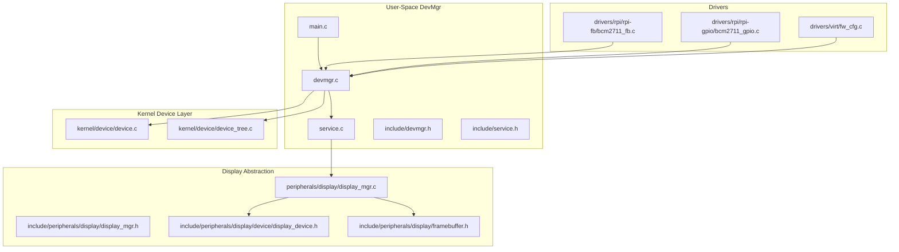
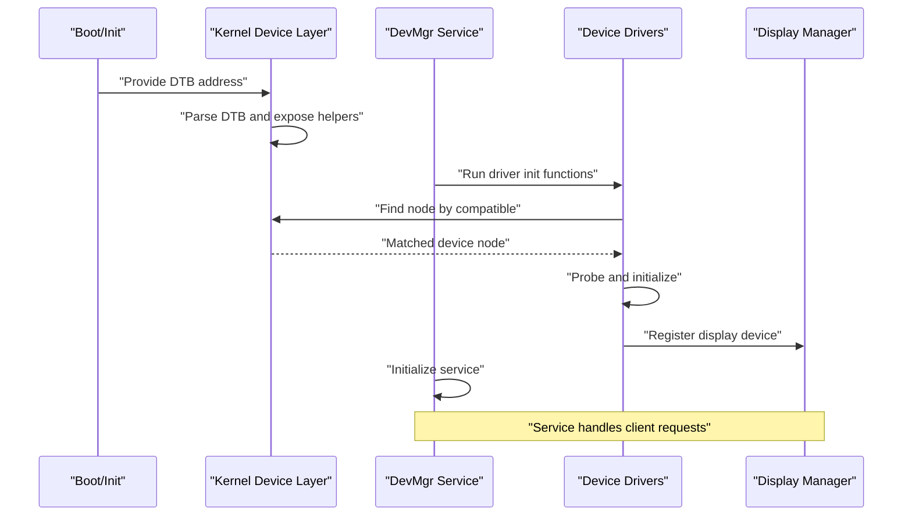
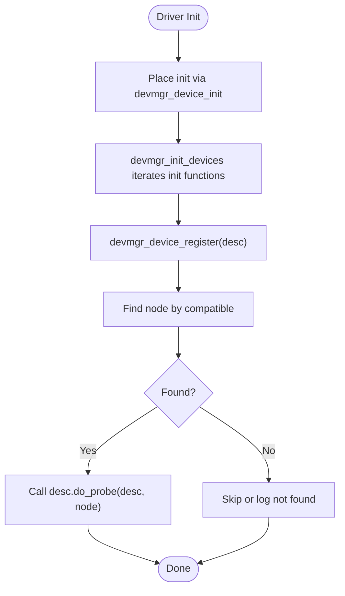
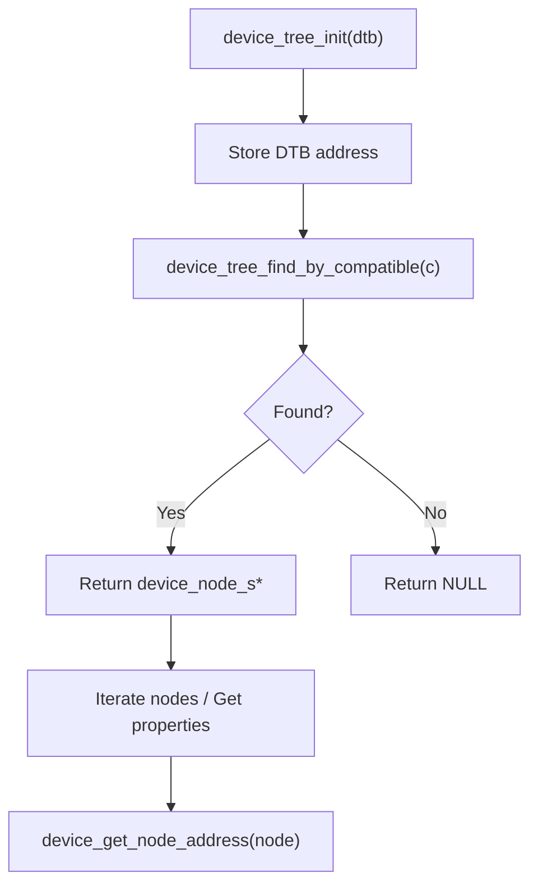
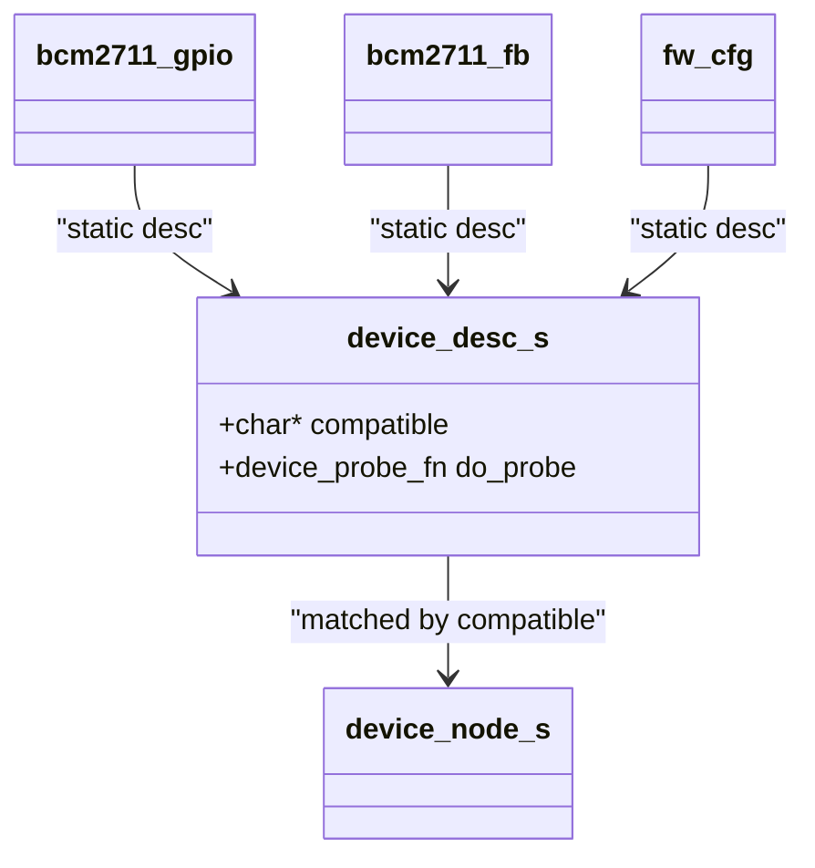
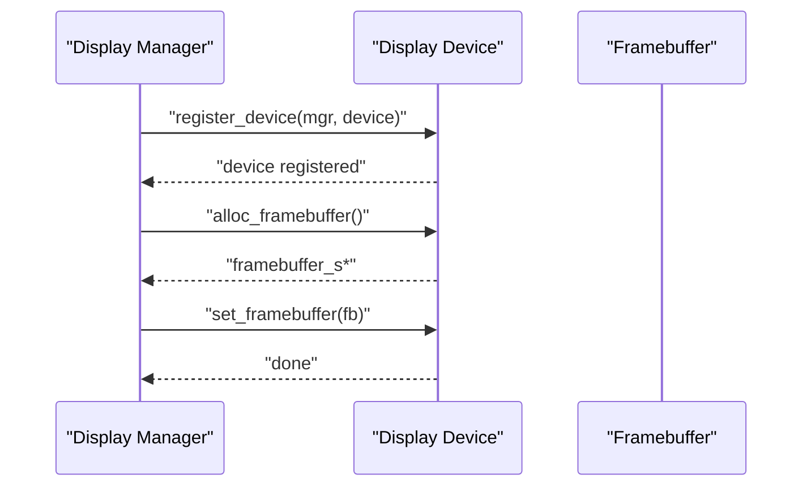
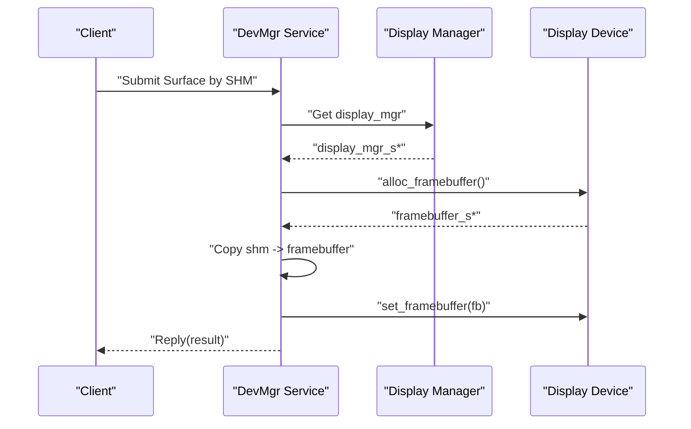
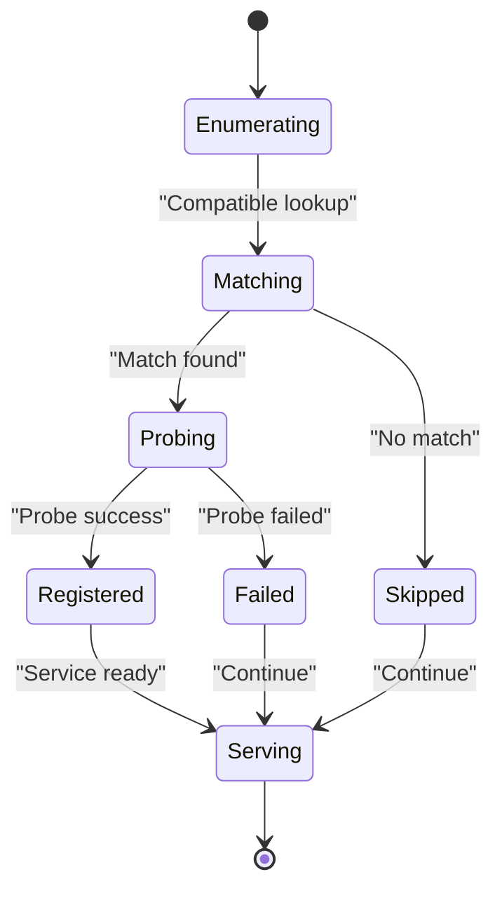
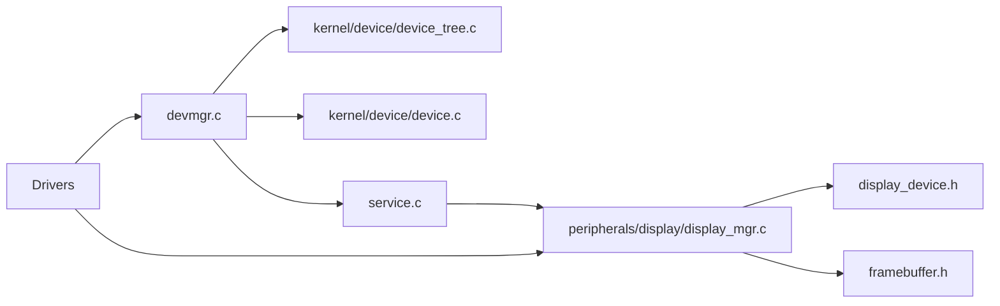

# Device Manager (devmgr)

<cite>
**Referenced Files in This Document**
- [devmgr.c](file://uapps/devmgr/devmgr.c)
- [main.c](file://uapps/devmgr/main.c)
- [service.c](file://uapps/devmgr/service.c)
- [devmgr.h](file://uapps/devmgr/include/devmgr.h)
- [service.h](file://uapps/devmgr/include/service.h)
- [display_mgr.c](file://uapps/devmgr/peripherals/display/display_mgr.c)
- [display_mgr.h](file://uapps/devmgr/include/peripherals/display/display_mgr.h)
- [display_device.h](file://uapps/devmgr/include/peripherals/display/device/display_device.h)
- [framebuffer.h](file://uapps/devmgr/include/peripherals/display/framebuffer.h)
- [bcm2711_fb.c](file://uapps/devmgr/drivers/rpi/rpi-fb/bcm2711_fb.c)
- [bcm2711_fb.h](file://uapps/devmgr/drivers/rpi/rpi-fb/bcm2711_fb.h)
- [bcm2711_gpio.c](file://uapps/devmgr/drivers/rpi/rpi-gpio/bcm2711_gpio.c)
- [fw_cfg.c](file://uapps/devmgr/drivers/virt/fw_cfg.c)
- [device_tree.c](file://kernel/device/device_tree.c)
- [device.c](file://kernel/device/device.c)
</cite>

## Table of Contents
1. [Introduction](#introduction)
2. [Project Structure](#project-structure)
3. [Core Components](#core-components)
4. [Architecture Overview](#architecture-overview)
5. [Detailed Component Analysis](#detailed-component-analysis)
6. [Dependency Analysis](#dependency-analysis)
7. [Performance Considerations](#performance-considerations)
8. [Troubleshooting Guide](#troubleshooting-guide)
9. [Conclusion](#conclusion)
10. [Appendices](#appendices)

## Introduction
This document describes the Device Manager (devmgr) service in TranquilOS. It explains how devmgr discovers and registers devices via the device tree, how drivers are probed and bound, and how the service exposes framebuffer submission and related capabilities to user-space clients. It also documents the driver framework, compatible string matching, device lifecycle, and error handling strategies. Practical examples illustrate GPIO and framebuffer driver interfaces, virtual device support, and integration patterns with the kernel’s device management system.

## Project Structure
The devmgr service is composed of:
- A user-space service entry and initialization
- A device discovery and registration subsystem
- A device tree parser and iterator
- Driver framework macros and registration hooks
- Display manager and framebuffer abstractions
- Example drivers for Raspberry Pi and QEMU virtual devices

**Diagram sources**
- [main.c](file://uapps/devmgr/main.c#L1-L18)
- [devmgr.c](file://uapps/devmgr/devmgr.c#L1-L62)
- [service.c](file://uapps/devmgr/service.c#L1-L72)
- [devmgr.h](file://uapps/devmgr/include/devmgr.h#L1-L30)
- [service.h](file://uapps/devmgr/include/service.h#L1-L6)
- [device.c](file://kernel/device/device.c#L1-L55)
- [device_tree.c](file://kernel/device/device_tree.c#L1-L95)
- [display_mgr.c](file://uapps/devmgr/peripherals/display/display_mgr.c#L1-L31)
- [display_mgr.h](file://uapps/devmgr/include/peripherals/display/display_mgr.h#L1-L20)
- [display_device.h](file://uapps/devmgr/include/peripherals/display/device/display_device.h#L1-L16)
- [framebuffer.h](file://uapps/devmgr/include/peripherals/display/framebuffer.h#L1-L16)
- [bcm2711_fb.c](file://uapps/devmgr/drivers/rpi/rpi-fb/bcm2711_fb.c#L1-L173)
- [bcm2711_gpio.c](file://uapps/devmgr/drivers/rpi/rpi-gpio/bcm2711_gpio.c#L1-L63)
- [fw_cfg.c](file://uapps/devmgr/drivers/virt/fw_cfg.c#L1-L152)

**Section sources**
- [main.c](file://uapps/devmgr/main.c#L1-L18)
- [devmgr.c](file://uapps/devmgr/devmgr.c#L1-L62)
- [service.c](file://uapps/devmgr/service.c#L1-L72)
- [devmgr.h](file://uapps/devmgr/include/devmgr.h#L1-L30)
- [device.c](file://kernel/device/device.c#L1-L55)
- [device_tree.c](file://kernel/device/device_tree.c#L1-L95)

## Core Components
- Device discovery and registration: The devmgr exposes APIs to find nodes by compatible string and to register device descriptors with a probe callback. Drivers declare themselves via a macro that places their init function into a special section, enabling bulk initialization.
- Device tree parsing: The kernel-side device tree parser locates nodes by compatible or device type, iterates nodes, and extracts properties. The user-space devmgr mirrors this with a subset of helpers.
- Driver framework: A lightweight framework allows drivers to register via a descriptor containing a compatible string and a probe function. On match, the probe is invoked with the matched device node.
- Display manager and framebuffer abstraction: A display manager holds a single display device and exposes allocation and set-framebuffer callbacks. Framebuffer metadata is standardized for width, height, stride, and memory address.
- Service interface: The devmgr service registers an IPC endpoint and supports methods for framebuffer submission and other device-related queries.

Key APIs and types:
- Device descriptor and probe: device_desc_s, device_probe_fn, devmgr_device_register
- Device discovery: devmgr_device_find_by_compatible, devmgr_device_get_node_address
- Driver registration macro: devmgr_device_init
- Display device: display_device_s with alloc_framebuffer and set_framebuffer
- Framebuffer: framebuffer_s with width, height, stride, address

**Section sources**
- [devmgr.h](file://uapps/devmgr/include/devmgr.h#L7-L30)
- [devmgr.c](file://uapps/devmgr/devmgr.c#L33-L55)
- [display_device.h](file://uapps/devmgr/include/peripherals/display/device/display_device.h#L8-L14)
- [framebuffer.h](file://uapps/devmgr/include/peripherals/display/framebuffer.h#L8-L14)

## Architecture Overview
The devmgr service orchestrates device discovery, driver probing, and display output. The kernel provides device tree parsing and early device initialization hooks. The user-space devmgr initializes display managers, registers drivers, and exposes a service for clients.

**Diagram sources**
- [device_tree.c](file://kernel/device/device_tree.c#L10-L37)
- [device.c](file://kernel/device/device.c#L13-L26)
- [devmgr.c](file://uapps/devmgr/devmgr.c#L57-L62)
- [display_mgr.c](file://uapps/devmgr/peripherals/display/display_mgr.c#L6-L19)

## Detailed Component Analysis

### Device Discovery and Registration System
- Compatible string matching: Drivers declare a compatible string and a probe function. The devmgr finds the matching device node in the device tree and invokes the probe.
- Registration macro: devmgr_device_init places driver init functions into a special section so they can be executed during early initialization.
- Initialization loop: devmgr_init_devices iterates the section and runs each init function.

**Diagram sources**
- [devmgr.h](file://uapps/devmgr/include/devmgr.h#L8-L11)
- [devmgr.c](file://uapps/devmgr/devmgr.c#L57-L62)
- [devmgr.c](file://uapps/devmgr/devmgr.c#L33-L55)

**Section sources**
- [devmgr.h](file://uapps/devmgr/include/devmgr.h#L7-L21)
- [devmgr.c](file://uapps/devmgr/devmgr.c#L57-L62)
- [devmgr.c](file://uapps/devmgr/devmgr.c#L33-L55)

### Device Tree Parsing and Iteration
- Kernel-side parsing: device_tree.c provides functions to locate nodes by compatible or device type, iterate nodes, and extract properties. It stores the DTB address and validates presence before operations.
- User-space helpers: devmgr.c wraps similar helpers for finding nodes and extracting addresses, using the kernel-provided DTB address.

**Diagram sources**
- [device_tree.c](file://kernel/device/device_tree.c#L10-L37)
- [device_tree.c](file://kernel/device/device_tree.c#L62-L95)
- [devmgr.c](file://uapps/devmgr/devmgr.c#L10-L31)

**Section sources**
- [device_tree.c](file://kernel/device/device_tree.c#L10-L95)
- [devmgr.c](file://uapps/devmgr/devmgr.c#L10-L31)

### Driver Framework and Probing Mechanisms
- Descriptor-based registration: device_desc_s carries compatible and do_probe. Drivers define a static descriptor and register it via devmgr_device_register.
- Early driver initialization: devmgr_device_init ensures drivers are discovered and probed during early boot.
- Example drivers:
  - bcm2711_gpio: Demonstrates selecting alternate function for UART pins.
  - bcm2711_fb: Demonstrates mailbox-based framebuffer setup and buffer swapping.
  - fw_cfg: Demonstrates QEMU fw_cfg MMIO device usage to configure a RAM-backed framebuffer and register a display device.

**Diagram sources**
- [devmgr.h](file://uapps/devmgr/include/devmgr.h#L17-L20)
- [bcm2711_gpio.c](file://uapps/devmgr/drivers/rpi/rpi-gpio/bcm2711_gpio.c#L49-L63)
- [bcm2711_fb.c](file://uapps/devmgr/drivers/rpi/rpi-fb/bcm2711_fb.c#L159-L173)
- [fw_cfg.c](file://uapps/devmgr/drivers/virt/fw_cfg.c#L132-L152)

**Section sources**
- [devmgr.h](file://uapps/devmgr/include/devmgr.h#L17-L20)
- [bcm2711_gpio.c](file://uapps/devmgr/drivers/rpi/rpi-gpio/bcm2711_gpio.c#L49-L63)
- [bcm2711_fb.c](file://uapps/devmgr/drivers/rpi/rpi-fb/bcm2711_fb.c#L159-L173)
- [fw_cfg.c](file://uapps/devmgr/drivers/virt/fw_cfg.c#L132-L152)

### Display Manager and Framebuffer Abstraction
- Display manager: Maintains a pointer to a display device and exposes a registration function. It is initialized early in devmgr main.
- Display device: Provides alloc_framebuffer and set_framebuffer callbacks. A framebuffer struct standardizes width, height, stride, and address.
- Virtual device example: fw_cfg driver allocates two framebuffers in memory and sets the active one via fw_cfg configuration, registering itself as a display device.

**Diagram sources**
- [display_mgr.c](file://uapps/devmgr/peripherals/display/display_mgr.c#L6-L19)
- [display_device.h](file://uapps/devmgr/include/peripherals/display/device/display_device.h#L8-L14)
- [framebuffer.h](file://uapps/devmgr/include/peripherals/display/framebuffer.h#L8-L14)
- [fw_cfg.c](file://uapps/devmgr/drivers/virt/fw_cfg.c#L126-L130)
- [fw_cfg.c](file://uapps/devmgr/drivers/virt/fw_cfg.c#L86-L124)

**Section sources**
- [display_mgr.c](file://uapps/devmgr/peripherals/display/display_mgr.c#L1-L31)
- [display_mgr.h](file://uapps/devmgr/include/peripherals/display/display_mgr.h#L1-L20)
- [display_device.h](file://uapps/devmgr/include/peripherals/display/device/display_device.h#L1-L16)
- [framebuffer.h](file://uapps/devmgr/include/peripherals/display/framebuffer.h#L1-L16)
- [fw_cfg.c](file://uapps/devmgr/drivers/virt/fw_cfg.c#L86-L130)

### Service Communication Patterns
- Service registration: devmgr_init_service registers an IPC endpoint under a fixed service ID.
- Methods: The service entry handles methods for framebuffer operations and other device queries. It uses shared memory to copy surface data into a framebuffer and then sets it on the display device.
- Client interaction: Clients send IPC messages to the devmgr service to submit surfaces or retrieve configuration pointers.

**Diagram sources**
- [service.c](file://uapps/devmgr/service.c#L42-L66)
- [service.c](file://uapps/devmgr/service.c#L10-L40)
- [display_mgr.c](file://uapps/devmgr/peripherals/display/display_mgr.c#L6-L19)
- [display_device.h](file://uapps/devmgr/include/peripherals/display/device/display_device.h#L8-L14)

**Section sources**
- [service.c](file://uapps/devmgr/service.c#L1-L72)
- [service.h](file://uapps/devmgr/include/service.h#L1-L6)

### Device Lifecycle Management
- Enumeration: During early boot, devmgr_init_devices runs all driver init functions placed in the special section.
- Matching: Each driver’s compatible string is used to locate a device node in the device tree.
- Initialization: The driver’s probe function performs device-specific setup and may register a display device or other resources.
- Exposure: The display manager exposes the device to the service layer, enabling clients to submit surfaces.

**Diagram sources**
- [devmgr.c](file://uapps/devmgr/devmgr.c#L57-L62)
- [devmgr.c](file://uapps/devmgr/devmgr.c#L33-L55)
- [display_mgr.c](file://uapps/devmgr/peripherals/display/display_mgr.c#L6-L19)

**Section sources**
- [devmgr.c](file://uapps/devmgr/devmgr.c#L57-L62)
- [devmgr.c](file://uapps/devmgr/devmgr.c#L33-L55)
- [display_mgr.c](file://uapps/devmgr/peripherals/display/display_mgr.c#L6-L19)

### Error Handling Strategies
- Null checks: Both user-space and kernel code validate pointers before dereferencing and log errors appropriately.
- DTB availability: Functions check for a valid DTB address before attempting operations.
- Node resolution: If a compatible string does not match any node, the code logs an error and skips initialization.
- Service operations: The service validates display manager presence and device registration before proceeding with framebuffer operations.

**Section sources**
- [devmgr.c](file://uapps/devmgr/devmgr.c#L10-L14)
- [devmgr.c](file://uapps/devmgr/devmgr.c#L33-L41)
- [service.c](file://uapps/devmgr/service.c#L10-L19)
- [device_tree.c](file://kernel/device/device_tree.c#L25-L37)

### Practical Examples

#### Implementing a GPIO Driver Interface
- Define a probe function that reads the device node address and configures pin alternate functions.
- Create a device_desc_s with the appropriate compatible string and probe function.
- Register the driver using devmgr_device_init.

Example reference paths:
- [bcm2711_gpio.c](file://uapps/devmgr/drivers/rpi/rpi-gpio/bcm2711_gpio.c#L49-L63)
- [devmgr.h](file://uapps/devmgr/include/devmgr.h#L17-L20)

#### Implementing a Framebuffer Driver
- Implement alloc_framebuffer and set_framebuffer callbacks in a display_device_s.
- Allocate and manage framebuffer memory, and present it to the display device.
- Register the display device with the display manager.

Example reference paths:
- [fw_cfg.c](file://uapps/devmgr/drivers/virt/fw_cfg.c#L126-L130)
- [fw_cfg.c](file://uapps/devmgr/drivers/virt/fw_cfg.c#L86-L124)
- [display_device.h](file://uapps/devmgr/include/peripherals/display/device/display_device.h#L8-L14)

#### Integrating with the DevMgr Framework
- Place your driver init function into the special section using devmgr_device_init.
- In your init function, call devmgr_device_register with your device_desc_s.
- Ensure your compatible string matches the device tree entry.

Example reference paths:
- [fw_cfg.c](file://uapps/devmgr/drivers/virt/fw_cfg.c#L147-L152)
- [bcm2711_fb.c](file://uapps/devmgr/drivers/rpi/rpi-fb/bcm2711_fb.c#L168-L173)
- [devmgr.h](file://uapps/devmgr/include/devmgr.h#L8-L11)

## Dependency Analysis
The devmgr service depends on:
- Kernel device tree parsing for node discovery and property access
- Display manager for device registration and framebuffer operations
- Drivers for device-specific probing and resource allocation
- Service layer for IPC communication with clients

**Diagram sources**
- [devmgr.c](file://uapps/devmgr/devmgr.c#L1-L62)
- [device_tree.c](file://kernel/device/device_tree.c#L1-L95)
- [device.c](file://kernel/device/device.c#L1-L55)
- [service.c](file://uapps/devmgr/service.c#L1-L72)
- [display_mgr.c](file://uapps/devmgr/peripherals/display/display_mgr.c#L1-L31)
- [display_device.h](file://uapps/devmgr/include/peripherals/display/device/display_device.h#L1-L16)
- [framebuffer.h](file://uapps/devmgr/include/peripherals/display/framebuffer.h#L1-L16)

**Section sources**
- [devmgr.c](file://uapps/devmgr/devmgr.c#L1-L62)
- [device_tree.c](file://kernel/device/device_tree.c#L1-L95)
- [device.c](file://kernel/device/device.c#L1-L55)
- [service.c](file://uapps/devmgr/service.c#L1-L72)
- [display_mgr.c](file://uapps/devmgr/peripherals/display/display_mgr.c#L1-L31)

## Performance Considerations
- Minimize repeated device tree scans: Cache matched nodes and addresses where appropriate.
- Efficient framebuffer copies: Use bulk memory operations and avoid unnecessary copies.
- Early initialization: Place critical drivers in early init sections to reduce boot latency.
- Avoid busy loops: Yield control periodically during long initialization sequences.

## Troubleshooting Guide
Common issues and resolutions:
- DTB not found: Ensure the kernel passes a valid DTB address and that device_tree_init has been called.
- Compatible string mismatch: Verify the device tree contains a matching compatible string and that the driver’s compatible field matches exactly.
- Null device node: Confirm the node lookup succeeded before attempting to probe.
- Display device not registered: Ensure the display manager is initialized and the driver registers a device via the display manager.
- Service errors: Validate that the service endpoint is registered and that the display device is present before submitting surfaces.

**Section sources**
- [device_tree.c](file://kernel/device/device_tree.c#L10-L17)
- [devmgr.c](file://uapps/devmgr/devmgr.c#L38-L42)
- [service.c](file://uapps/devmgr/service.c#L10-L19)

## Conclusion
The devmgr service provides a clean separation between device discovery, driver probing, and display output. By leveraging compatible string matching and a simple driver descriptor model, it enables modular device support across platforms. The display manager and framebuffer abstractions enable flexible rendering backends, including virtual devices. The service layer offers a straightforward IPC interface for clients to submit surfaces and coordinate with the display pipeline.

## Appendices

### API Reference Summary
- Device descriptor and registration:
  - device_desc_s, device_probe_fn, devmgr_device_register
  - devmgr_device_init
- Device discovery:
  - devmgr_device_find_by_compatible, devmgr_device_get_node_address
- Display device and framebuffer:
  - display_device_s, framebuffer_s
- Service:
  - devmgr_init_service, IPC methods for framebuffer operations

**Section sources**
- [devmgr.h](file://uapps/devmgr/include/devmgr.h#L7-L30)
- [display_device.h](file://uapps/devmgr/include/peripherals/display/device/display_device.h#L8-L14)
- [framebuffer.h](file://uapps/devmgr/include/peripherals/display/framebuffer.h#L8-L14)
- [service.h](file://uapps/devmgr/include/service.h#L1-L6)