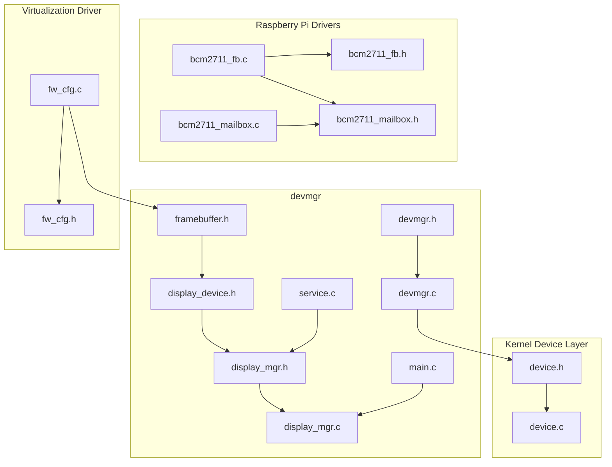
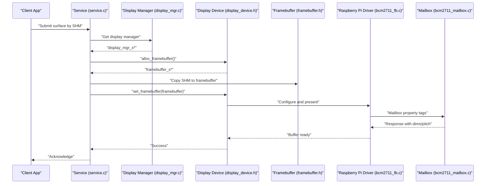
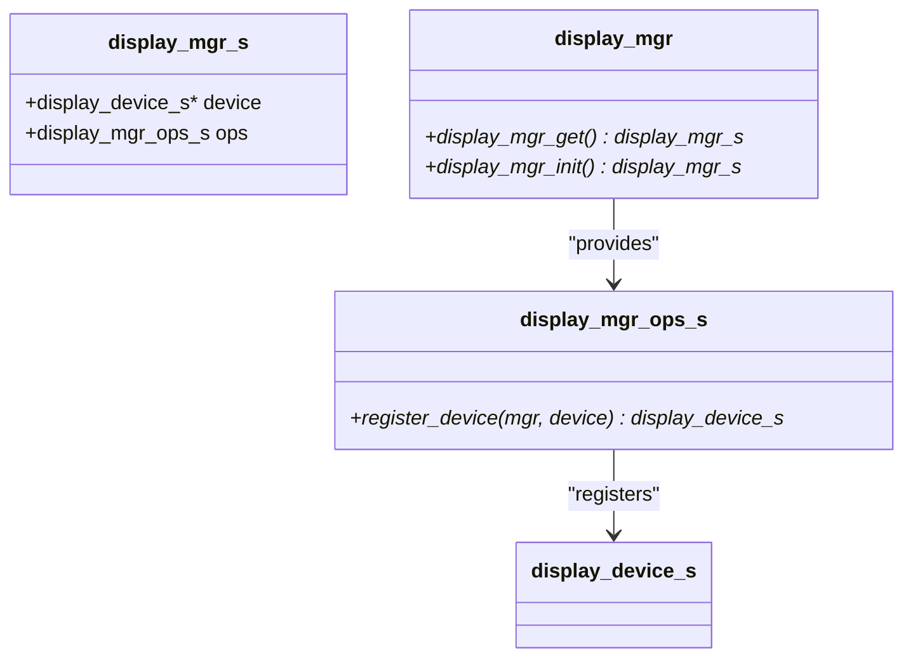
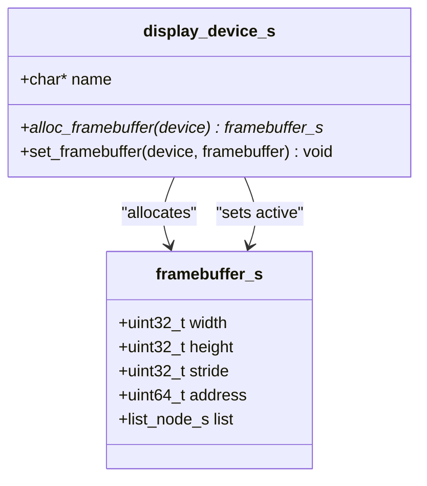
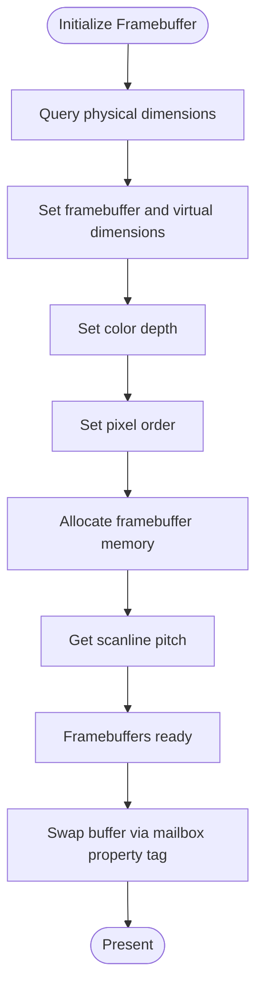
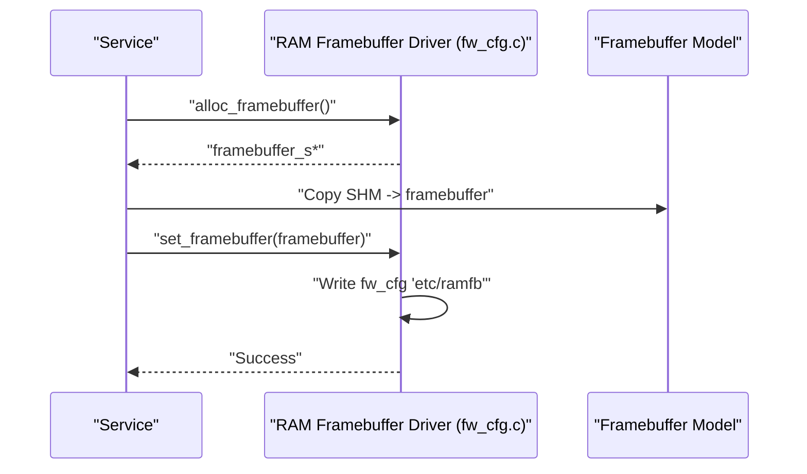
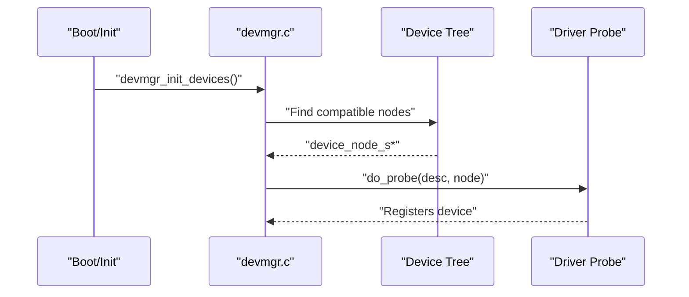
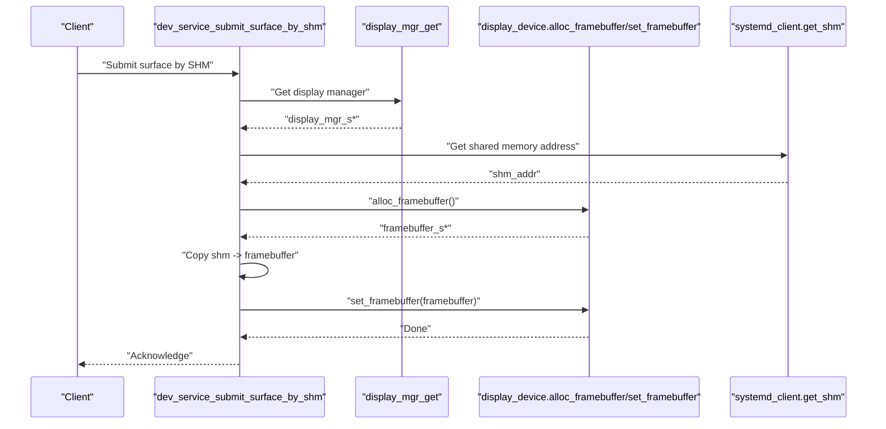
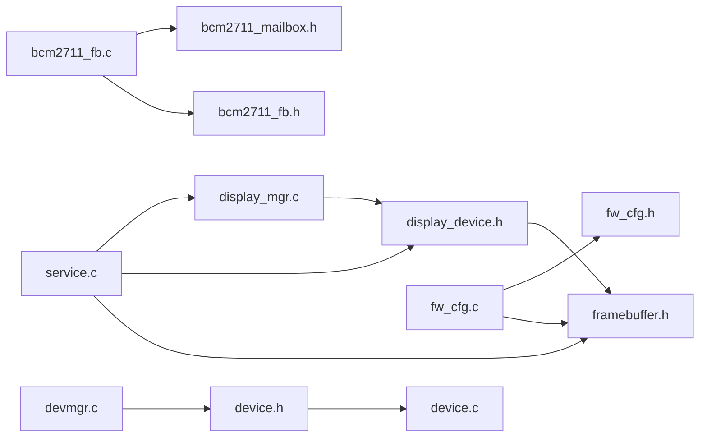

# Display Management System

<cite>
**Referenced Files in This Document**
- [display_mgr.h](file://uapps/devmgr/include/peripherals/display/display_mgr.h)
- [display_device.h](file://uapps/devmgr/include/peripherals/display/device/display_device.h)
- [framebuffer.h](file://uapps/devmgr/include/peripherals/display/framebuffer.h)
- [display_mgr.c](file://uapps/devmgr/peripherals/display/display_mgr.c)
- [bcm2711_fb.h](file://uapps/devmgr/drivers/rpi/rpi-fb/bcm2711_fb.h)
- [bcm2711_fb.c](file://uapps/devmgr/drivers/rpi/rpi-fb/bcm2711_fb.c)
- [bcm2711_mailbox.h](file://uapps/devmgr/drivers/rpi/rpi-fb/bcm2711_mailbox.h)
- [bcm2711_mailbox.c](file://uapps/devmgr/drivers/rpi/rpi-fb/bcm2711_mailbox.c)
- [fw_cfg.h](file://uapps/devmgr/drivers/virt/fw_cfg.h)
- [fw_cfg.c](file://uapps/devmgr/drivers/virt/fw_cfg.c)
- [devmgr.h](file://uapps/devmgr/include/devmgr.h)
- [devmgr.c](file://uapps/devmgr/devmgr.c)
- [service.c](file://uapps/devmgr/service.c)
- [main.c](file://uapps/devmgr/main.c)
- [device.h](file://kernel/include/device/device.h)
- [device.c](file://kernel/device/device.c)
</cite>

## Table of Contents
1. [Introduction](#introduction)
2. [Project Structure](#project-structure)
3. [Core Components](#core-components)
4. [Architecture Overview](#architecture-overview)
5. [Detailed Component Analysis](#detailed-component-analysis)
6. [Dependency Analysis](#dependency-analysis)
7. [Performance Considerations](#performance-considerations)
8. [Troubleshooting Guide](#troubleshooting-guide)
9. [Conclusion](#conclusion)
10. [Appendices](#appendices)

## Introduction
This document describes the display management subsystem within devmgr, focusing on framebuffer management, display device enumeration, and graphics initialization. It documents the display manager API, including framebuffer allocation, resolution configuration, and display device registration. It also covers the integration with Raspberry Pi framebuffer drivers and mailbox communication protocols, and provides practical examples of initialization, framebuffer operations, and graphics rendering setup. Finally, it addresses display device hot-plugging, multiple monitor support, configuration management, troubleshooting, and performance optimization.

## Project Structure
The display management system spans several modules:
- Display manager API and device abstraction
- Framebuffer model and RAM framebuffer driver
- Raspberry Pi framebuffer driver and mailbox protocol
- Device enumeration and registration via devmgr
- Service interface for submitting surfaces via shared memory

**Diagram sources**
- [display_mgr.h](file://uapps/devmgr/include/peripherals/display/display_mgr.h#L1-L20)
- [display_device.h](file://uapps/devmgr/include/peripherals/display/device/display_device.h#L1-L16)
- [framebuffer.h](file://uapps/devmgr/include/peripherals/display/framebuffer.h#L1-L16)
- [display_mgr.c](file://uapps/devmgr/peripherals/display/display_mgr.c#L1-L31)
- [bcm2711_fb.h](file://uapps/devmgr/drivers/rpi/rpi-fb/bcm2711_fb.h#L1-L22)
- [bcm2711_fb.c](file://uapps/devmgr/drivers/rpi/rpi-fb/bcm2711_fb.c#L1-L173)
- [bcm2711_mailbox.h](file://uapps/devmgr/drivers/rpi/rpi-fb/bcm2711_mailbox.h#L1-L161)
- [bcm2711_mailbox.c](file://uapps/devmgr/drivers/rpi/rpi-fb/bcm2711_mailbox.c#L1-L43)
- [fw_cfg.h](file://uapps/devmgr/drivers/virt/fw_cfg.h#L1-L48)
- [fw_cfg.c](file://uapps/devmgr/drivers/virt/fw_cfg.c#L46-L124)
- [devmgr.h](file://uapps/devmgr/include/devmgr.h#L1-L30)
- [devmgr.c](file://uapps/devmgr/devmgr.c#L1-L62)
- [device.h](file://kernel/include/device/device.h#L1-L36)
- [device.c](file://kernel/device/device.c#L1-L54)

**Section sources**
- [display_mgr.h](file://uapps/devmgr/include/peripherals/display/display_mgr.h#L1-L20)
- [display_device.h](file://uapps/devmgr/include/peripherals/display/device/display_device.h#L1-L16)
- [framebuffer.h](file://uapps/devmgr/include/peripherals/display/framebuffer.h#L1-L16)
- [bcm2711_fb.c](file://uapps/devmgr/drivers/rpi/rpi-fb/bcm2711_fb.c#L1-L173)
- [bcm2711_mailbox.h](file://uapps/devmgr/drivers/rpi/rpi-fb/bcm2711_mailbox.h#L1-L161)
- [fw_cfg.c](file://uapps/devmgr/drivers/virt/fw_cfg.c#L46-L124)
- [devmgr.h](file://uapps/devmgr/include/devmgr.h#L1-L30)
- [devmgr.c](file://uapps/devmgr/devmgr.c#L1-L62)
- [device.h](file://kernel/include/device/device.h#L1-L36)
- [device.c](file://kernel/device/device.c#L1-L54)

## Core Components
- Display Manager API: Provides a singleton display manager with registration operations for display devices.
- Display Device Abstraction: Defines the interface for allocating framebuffers and setting the active framebuffer.
- Framebuffer Model: Describes framebuffer geometry, stride, and memory location.
- Raspberry Pi Framebuffer Driver: Implements mailbox-based initialization and double-buffering.
- Virtual RAM Framebuffer Driver: Provides a RAM-backed framebuffer for virtualized environments.
- Device Enumeration and Registration: Integrates drivers via devmgr and device tree matching.
- Service Interface: Exposes IPC endpoints for framebuffer submission and surface updates.

Key responsibilities:
- Framebuffer allocation and configuration
- Resolution negotiation via mailbox property tags
- Double buffering and buffer swapping
- Surface submission via shared memory
- Device registration and discovery

**Section sources**
- [display_mgr.h](file://uapps/devmgr/include/peripherals/display/display_mgr.h#L1-L20)
- [display_device.h](file://uapps/devmgr/include/peripherals/display/device/display_device.h#L1-L16)
- [framebuffer.h](file://uapps/devmgr/include/peripherals/display/framebuffer.h#L1-L16)
- [display_mgr.c](file://uapps/devmgr/peripherals/display/display_mgr.c#L1-L31)
- [bcm2711_fb.c](file://uapps/devmgr/drivers/rpi/rpi-fb/bcm2711_fb.c#L1-L173)
- [bcm2711_mailbox.h](file://uapps/devmgr/drivers/rpi/rpi-fb/bcm2711_mailbox.h#L1-L161)
- [fw_cfg.c](file://uapps/devmgr/drivers/virt/fw_cfg.c#L46-L124)
- [devmgr.c](file://uapps/devmgr/devmgr.c#L1-L62)
- [service.c](file://uapps/devmgr/service.c#L1-L72)

## Architecture Overview
The display management subsystem follows a layered architecture:
- Application and Services request framebuffer operations via IPC.
- The display manager holds a single display device pointer and delegates operations.
- Display device drivers implement allocation and presentation logic.
- On Raspberry Pi, mailbox property tags configure framebuffer dimensions, depth, pixel order, and allocate backing memory.
- On virtual platforms, a RAM framebuffer is configured via fw_cfg and presented to the guest.

**Diagram sources**
- [service.c](file://uapps/devmgr/service.c#L1-L72)
- [display_mgr.c](file://uapps/devmgr/peripherals/display/display_mgr.c#L1-L31)
- [display_device.h](file://uapps/devmgr/include/peripherals/display/device/display_device.h#L1-L16)
- [framebuffer.h](file://uapps/devmgr/include/peripherals/display/framebuffer.h#L1-L16)
- [bcm2711_fb.c](file://uapps/devmgr/drivers/rpi/rpi-fb/bcm2711_fb.c#L1-L173)
- [bcm2711_mailbox.c](file://uapps/devmgr/drivers/rpi/rpi-fb/bcm2711_mailbox.c#L1-L43)

## Detailed Component Analysis

### Display Manager API
The display manager provides:
- Singleton accessor and initializer
- Registration operation for a display device
- Null checks and logging for robustness

**Diagram sources**
- [display_mgr.h](file://uapps/devmgr/include/peripherals/display/display_mgr.h#L1-L20)
- [display_mgr.c](file://uapps/devmgr/peripherals/display/display_mgr.c#L1-L31)

**Section sources**
- [display_mgr.h](file://uapps/devmgr/include/peripherals/display/display_mgr.h#L1-L20)
- [display_mgr.c](file://uapps/devmgr/peripherals/display/display_mgr.c#L1-L31)

### Display Device Abstraction
The display device defines the contract for:
- Allocating a framebuffer from device-specific memory
- Setting the active framebuffer for presentation

**Diagram sources**
- [display_device.h](file://uapps/devmgr/include/peripherals/display/device/display_device.h#L1-L16)
- [framebuffer.h](file://uapps/devmgr/include/peripherals/display/framebuffer.h#L1-L16)

**Section sources**
- [display_device.h](file://uapps/devmgr/include/peripherals/display/device/display_device.h#L1-L16)
- [framebuffer.h](file://uapps/devmgr/include/peripherals/display/framebuffer.h#L1-L16)

### Raspberry Pi Framebuffer Driver
The Raspberry Pi driver performs:
- Mailbox property tag requests to query and set framebuffer dimensions, virtual dimensions, depth, pixel order, and pitch
- Allocation of double-buffered framebuffers
- Buffer swapping via mailbox property tags

**Diagram sources**
- [bcm2711_fb.c](file://uapps/devmgr/drivers/rpi/rpi-fb/bcm2711_fb.c#L56-L157)
- [bcm2711_mailbox.h](file://uapps/devmgr/drivers/rpi/rpi-fb/bcm2711_mailbox.h#L83-L135)

**Section sources**
- [bcm2711_fb.c](file://uapps/devmgr/drivers/rpi/rpi-fb/bcm2711_fb.c#L1-L173)
- [bcm2711_mailbox.h](file://uapps/devmgr/drivers/rpi/rpi-fb/bcm2711_mailbox.h#L1-L161)

### Virtual RAM Framebuffer Driver
The virtual driver provides:
- RAM-backed framebuffers for QEMU environments
- Configuration via fw_cfg files
- Surface submission by copying shared memory into framebuffer memory

**Diagram sources**
- [fw_cfg.c](file://uapps/devmgr/drivers/virt/fw_cfg.c#L86-L124)
- [fw_cfg.h](file://uapps/devmgr/drivers/virt/fw_cfg.h#L1-L48)
- [service.c](file://uapps/devmgr/service.c#L1-L72)

**Section sources**
- [fw_cfg.c](file://uapps/devmgr/drivers/virt/fw_cfg.c#L46-L124)
- [fw_cfg.h](file://uapps/devmgr/drivers/virt/fw_cfg.h#L1-L48)
- [service.c](file://uapps/devmgr/service.c#L1-L72)

### Device Enumeration and Registration
Device discovery and registration:
- devmgr locates nodes by compatible string in the device tree
- Drivers register via macros and are invoked during device initialization
- Kernel device layer mirrors similar patterns

**Diagram sources**
- [devmgr.c](file://uapps/devmgr/devmgr.c#L57-L62)
- [devmgr.h](file://uapps/devmgr/include/devmgr.h#L1-L30)
- [device.c](file://kernel/device/device.c#L13-L26)
- [device.h](file://kernel/include/device/device.h#L1-L36)

**Section sources**
- [devmgr.c](file://uapps/devmgr/devmgr.c#L1-L62)
- [devmgr.h](file://uapps/devmgr/include/devmgr.h#L1-L30)
- [device.c](file://kernel/device/device.c#L1-L54)
- [device.h](file://kernel/include/device/device.h#L1-L36)

### Service Interface for Graphics Rendering
The service endpoint:
- Validates presence of display manager and device
- Allocates a framebuffer from the active display device
- Copies shared memory contents into the framebuffer
- Presents the framebuffer to the display device

**Diagram sources**
- [service.c](file://uapps/devmgr/service.c#L1-L72)
- [display_mgr.c](file://uapps/devmgr/peripherals/display/display_mgr.c#L1-L31)
- [display_device.h](file://uapps/devmgr/include/peripherals/display/device/display_device.h#L1-L16)

**Section sources**
- [service.c](file://uapps/devmgr/service.c#L1-L72)
- [display_mgr.c](file://uapps/devmgr/peripherals/display/display_mgr.c#L1-L31)
- [display_device.h](file://uapps/devmgr/include/peripherals/display/device/display_device.h#L1-L16)

## Dependency Analysis
The subsystem exhibits clear separation of concerns:
- The display manager depends on the display device abstraction
- Display device implementations depend on the framebuffer model
- Raspberry Pi driver depends on mailbox protocol definitions and mailbox transport
- Virtual driver depends on fw_cfg structures and shared memory
- devmgr integrates drivers via device tree and registration mechanisms

**Diagram sources**
- [display_mgr.c](file://uapps/devmgr/peripherals/display/display_mgr.c#L1-L31)
- [display_device.h](file://uapps/devmgr/include/peripherals/display/device/display_device.h#L1-L16)
- [framebuffer.h](file://uapps/devmgr/include/peripherals/display/framebuffer.h#L1-L16)
- [bcm2711_fb.c](file://uapps/devmgr/drivers/rpi/rpi-fb/bcm2711_fb.c#L1-L173)
- [bcm2711_mailbox.h](file://uapps/devmgr/drivers/rpi/rpi-fb/bcm2711_mailbox.h#L1-L161)
- [bcm2711_fb.h](file://uapps/devmgr/drivers/rpi/rpi-fb/bcm2711_fb.h#L1-L22)
- [fw_cfg.c](file://uapps/devmgr/drivers/virt/fw_cfg.c#L46-L124)
- [fw_cfg.h](file://uapps/devmgr/drivers/virt/fw_cfg.h#L1-L48)
- [service.c](file://uapps/devmgr/service.c#L1-L72)
- [devmgr.c](file://uapps/devmgr/devmgr.c#L1-L62)
- [device.h](file://kernel/include/device/device.h#L1-L36)
- [device.c](file://kernel/device/device.c#L1-L54)

**Section sources**
- [display_mgr.c](file://uapps/devmgr/peripherals/display/display_mgr.c#L1-L31)
- [display_device.h](file://uapps/devmgr/include/peripherals/display/device/display_device.h#L1-L16)
- [framebuffer.h](file://uapps/devmgr/include/peripherals/display/framebuffer.h#L1-L16)
- [bcm2711_fb.c](file://uapps/devmgr/drivers/rpi/rpi-fb/bcm2711_fb.c#L1-L173)
- [bcm2711_mailbox.h](file://uapps/devmgr/drivers/rpi/rpi-fb/bcm2711_mailbox.h#L1-L161)
- [fw_cfg.c](file://uapps/devmgr/drivers/virt/fw_cfg.c#L46-L124)
- [service.c](file://uapps/devmgr/service.c#L1-L72)
- [devmgr.c](file://uapps/devmgr/devmgr.c#L1-L62)
- [device.h](file://kernel/include/device/device.h#L1-L36)
- [device.c](file://kernel/device/device.c#L1-L54)

## Performance Considerations
- Minimize CPU copies: Prefer DMA-capable paths or shared memory where possible.
- Double buffering: Use front/back buffers to avoid tearing and reduce stalls.
- Pitch alignment: Ensure stride matches scanline pitch to prevent extra computations.
- Mailbox batching: Group mailbox property tag requests to reduce round-trips.
- Virtual driver efficiency: Limit repeated fw_cfg writes and reuse framebuffer configurations.
- Synchronization: Use appropriate synchronization primitives around buffer swaps.

[No sources needed since this section provides general guidance]

## Troubleshooting Guide
Common issues and remedies:
- No display device registered: Ensure a display device is registered via the display manager before attempting to allocate or present framebuffers.
- Null display manager or device: Verify initialization order and logging messages indicating missing components.
- Mailbox failures: Confirm mailbox channel availability and correct tag usage; check response codes for property tag operations.
- RAM framebuffer not applied: Validate fw_cfg file presence and correct selection; ensure shared memory address is retrieved before copy operations.
- Device tree mismatch: Confirm compatible strings match and device nodes are discoverable.

**Section sources**
- [display_mgr.c](file://uapps/devmgr/peripherals/display/display_mgr.c#L6-L19)
- [service.c](file://uapps/devmgr/service.c#L10-L40)
- [bcm2711_mailbox.c](file://uapps/devmgr/drivers/rpi/rpi-fb/bcm2711_mailbox.c#L8-L29)
- [fw_cfg.c](file://uapps/devmgr/drivers/virt/fw_cfg.c#L68-L82)

## Conclusion
The display management subsystem cleanly separates concerns between the display manager, device abstractions, and platform-specific drivers. It supports both Raspberry Pi mailbox-based framebuffers and virtual RAM framebuffers, enabling cross-platform graphics initialization and rendering. The service interface simplifies surface submission via shared memory, while device enumeration ensures drivers are discovered and registered automatically.

[No sources needed since this section summarizes without analyzing specific files]

## Appendices

### Practical Examples

- Initialize display manager and devices
  - Call the display manager initializer and device enumeration in the application entry point.
  - Example path: [main.c](file://uapps/devmgr/main.c#L6-L11)

- Register a display device
  - Use the display manager’s registration function to attach a device implementing framebuffer allocation and presentation.
  - Example path: [display_mgr.c](file://uapps/devmgr/peripherals/display/display_mgr.c#L25-L31)

- Configure resolution and allocate framebuffer (Raspberry Pi)
  - Use mailbox property tags to set dimensions, depth, pixel order, and allocate framebuffers.
  - Example path: [bcm2711_fb.c](file://uapps/devmgr/drivers/rpi/rpi-fb/bcm2711_fb.c#L77-L135)

- Present a surface via shared memory
  - Allocate a framebuffer, copy shared memory contents, and set the active framebuffer.
  - Example path: [service.c](file://uapps/devmgr/service.c#L21-L39)

- RAM framebuffer configuration (virtualization)
  - Allocate a RAM framebuffer and write fw_cfg configuration to apply it.
  - Example path: [fw_cfg.c](file://uapps/devmgr/drivers/virt/fw_cfg.c#L86-L124)

### Hot-plugging and Multiple Monitors
- Hot-plugging: Implement device probe callbacks to detect new display devices after boot and register them with the display manager.
- Multiple monitors: Extend the display manager to maintain a list of devices and route allocations/presentations per device.

[No sources needed since this section provides general guidance]

### Display Configuration Management
- Store and update framebuffer geometry, stride, and address in the framebuffer model.
- Use mailbox property tags to negotiate capabilities and apply changes atomically.

[No sources needed since this section provides general guidance]