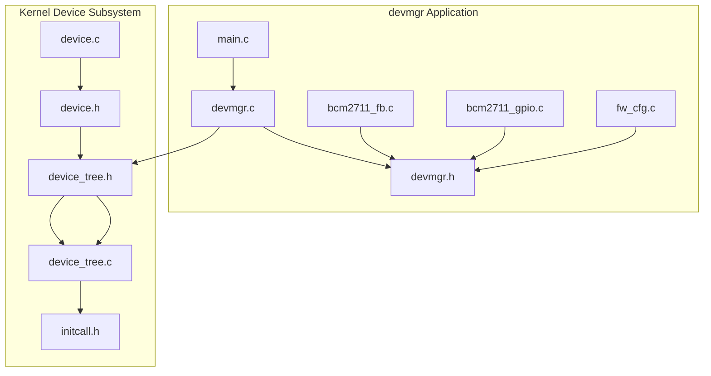
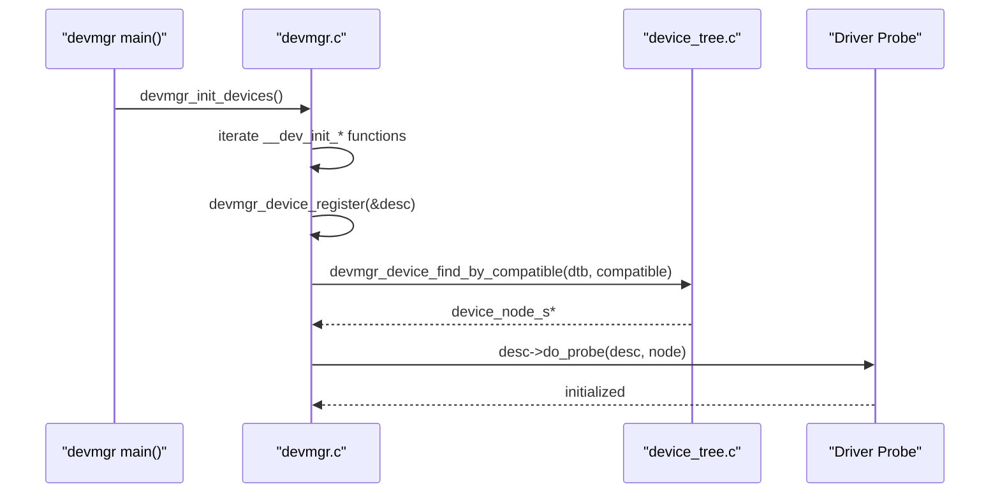
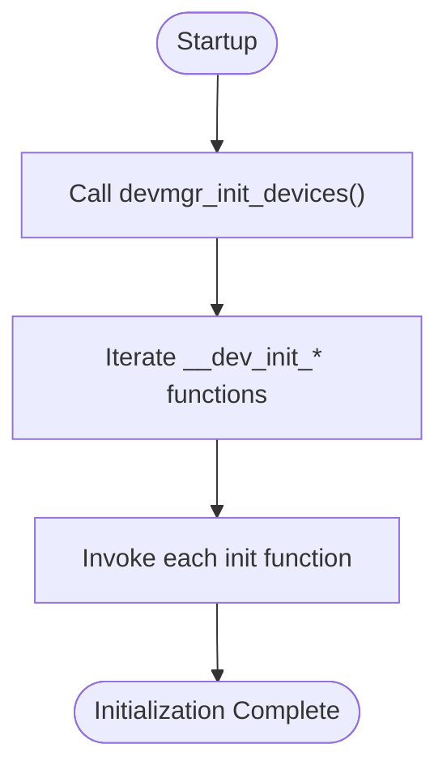
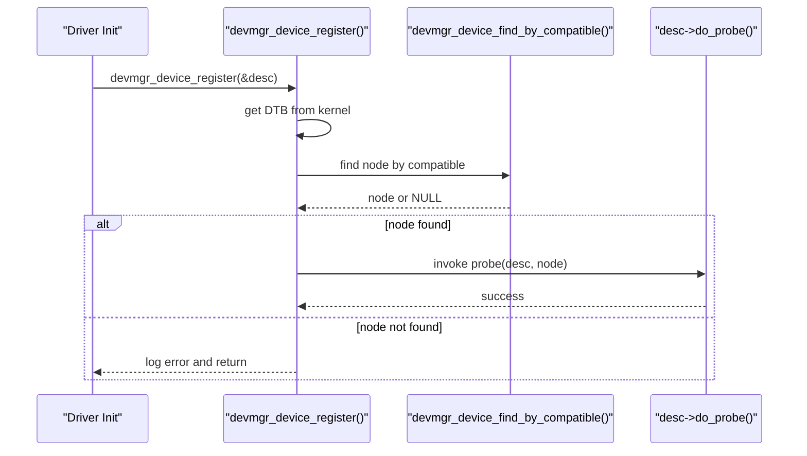
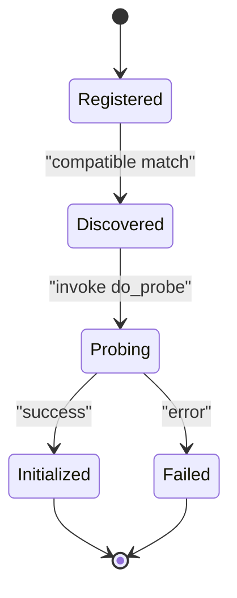
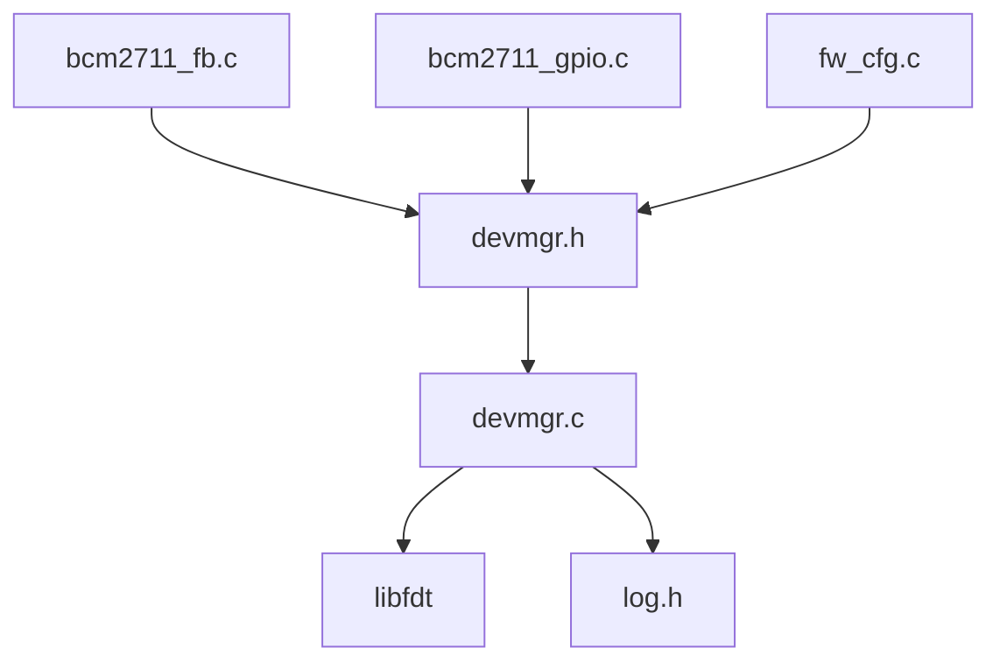

# Driver Framework and Implementation

<cite>
**Referenced Files in This Document**
- [devmgr.h](file://uapps/devmgr/include/devmgr.h)
- [devmgr.c](file://uapps/devmgr/devmgr.c)
- [main.c](file://uapps/devmgr/main.c)
- [bcm2711_fb.c](file://uapps/devmgr/drivers/rpi/rpi-fb/bcm2711_fb.c)
- [bcm2711_gpio.c](file://uapps/devmgr/drivers/rpi/rpi-gpio/bcm2711_gpio.c)
- [fw_cfg.c](file://uapps/devmgr/drivers/virt/fw_cfg.c)
- [device.h](file://kernel/include/device/device.h)
- [device.c](file://kernel/device/device.c)
- [device_tree.h](file://kernel/include/device/device_tree.h)
- [device_tree.c](file://kernel/device/device_tree.c)
- [initcall.h](file://kernel/include/initcall.h)
</cite>

## Table of Contents
1. [Introduction](#introduction)
2. [Project Structure](#project-structure)
3. [Core Components](#core-components)
4. [Architecture Overview](#architecture-overview)
5. [Detailed Component Analysis](#detailed-component-analysis)
6. [Dependency Analysis](#dependency-analysis)
7. [Performance Considerations](#performance-considerations)
8. [Troubleshooting Guide](#troubleshooting-guide)
9. [Conclusion](#conclusion)
10. [Appendices](#appendices)

## Introduction
This document explains the device driver framework and implementation patterns in devmgr. It focuses on the dev_init_fn mechanism, driver registration process, and automatic driver initialization system. It documents the device_desc_s structure fields, callback function interfaces, and driver lifecycle management. It also covers driver development patterns (probe functions, device-specific initialization), examples of implementing custom drivers, resource handling, integration with the device manager’s registration system, error handling, resource cleanup, and debugging techniques.

## Project Structure
The devmgr application provides a user-space device manager that discovers devices via the device tree and invokes driver probe functions. Drivers are registered through a macro that places their init functions into a dedicated section. The kernel-side device subsystem provides a similar pattern using initcall levels.

**Diagram sources**
- [devmgr.h](file://uapps/devmgr/include/devmgr.h#L1-L30)
- [devmgr.c](file://uapps/devmgr/devmgr.c#L1-L62)
- [main.c](file://uapps/devmgr/main.c#L1-L18)
- [bcm2711_fb.c](file://uapps/devmgr/drivers/rpi/rpi-fb/bcm2711_fb.c#L1-L173)
- [bcm2711_gpio.c](file://uapps/devmgr/drivers/rpi/rpi-gpio/bcm2711_gpio.c#L1-L63)
- [fw_cfg.c](file://uapps/devmgr/drivers/virt/fw_cfg.c#L1-L152)
- [device.h](file://kernel/include/device/device.h#L1-L37)
- [device.c](file://kernel/device/device.c#L1-L55)
- [device_tree.h](file://kernel/include/device/device_tree.h#L1-L25)
- [device_tree.c](file://kernel/device/device_tree.c#L1-L95)
- [initcall.h](file://kernel/include/initcall.h#L1-L44)

**Section sources**
- [devmgr.h](file://uapps/devmgr/include/devmgr.h#L1-L30)
- [devmgr.c](file://uapps/devmgr/devmgr.c#L1-L62)
- [main.c](file://uapps/devmgr/main.c#L1-L18)
- [device.h](file://kernel/include/device/device.h#L1-L37)
- [device.c](file://kernel/device/device.c#L1-L55)
- [device_tree.h](file://kernel/include/device/device_tree.h#L1-L25)
- [device_tree.c](file://kernel/device/device_tree.c#L1-L95)
- [initcall.h](file://kernel/include/initcall.h#L1-L44)

## Core Components
- dev_init_fn mechanism: A function pointer type used for driver initialization. The macro devmgr_device_init(func) places init functions into a special section so they can be iterated at runtime.
- device_desc_s: Describes a driver with a compatible string and a probe callback. The compatible string matches a device in the device tree.
- Registration and discovery: devmgr_device_register(desc) finds a device node by compatible string and invokes desc->do_probe if present.
- Automatic initialization: devmgr_init_devices() iterates over the special section and runs each init function.

Key APIs and macros:
- dev_init_fn typedef and devmgr_device_init macro
- device_desc_s with compatible and do_probe fields
- devmgr_device_register(), devmgr_init_devices()
- devmgr_device_find_by_compatible(), devmgr_device_get_node_address()

**Section sources**
- [devmgr.h](file://uapps/devmgr/include/devmgr.h#L7-L30)
- [devmgr.c](file://uapps/devmgr/devmgr.c#L7-L62)

## Architecture Overview
The devmgr application initializes drivers by scanning the device tree and invoking probe callbacks. Kernel-side drivers use initcall levels to participate in early device initialization.

**Diagram sources**
- [main.c](file://uapps/devmgr/main.c#L6-L11)
- [devmgr.c](file://uapps/devmgr/devmgr.c#L57-L62)
- [devmgr.c](file://uapps/devmgr/devmgr.c#L33-L55)
- [device_tree.c](file://kernel/device/device_tree.c#L25-L37)

## Detailed Component Analysis

### dev_init_fn Mechanism and Automatic Initialization
- Purpose: Allow drivers to self-register init functions that are executed during devmgr startup.
- Macro behavior: The macro devmgr_device_init(func) creates a function pointer variable placed in a special section. At runtime, devmgr_init_devices() iterates from a start to end symbol in that section and calls each function.

Implementation highlights:
- Function pointer typedef and macro placement into a dedicated section
- Runtime iteration using external symbols __dev_init_start and __dev_init_end
- Typical driver init returns 0 on success

**Diagram sources**
- [devmgr.c](file://uapps/devmgr/devmgr.c#L57-L62)
- [devmgr.h](file://uapps/devmgr/include/devmgr.h#L7-L11)

**Section sources**
- [devmgr.h](file://uapps/devmgr/include/devmgr.h#L7-L11)
- [devmgr.c](file://uapps/devmgr/devmgr.c#L57-L62)

### Driver Registration and Discovery
- Registration: devmgr_device_register(desc) validates the descriptor, retrieves the DTB address from the kernel, logs the DTB location, and searches for a matching device node by compatible string.
- Probe invocation: If a node is found and a probe callback exists, the driver’s probe function is invoked with the descriptor and node.
- Error handling: Logs errors when DTB is missing, compatible not found, or descriptor is invalid.

**Diagram sources**
- [devmgr.c](file://uapps/devmgr/devmgr.c#L33-L55)
- [devmgr.c](file://uapps/devmgr/devmgr.c#L10-L22)

**Section sources**
- [devmgr.c](file://uapps/devmgr/devmgr.c#L33-L55)
- [devmgr.c](file://uapps/devmgr/devmgr.c#L10-L22)

### device_desc_s Structure and Callback Interfaces
- Fields:
  - compatible: A string used to match a device in the device tree.
  - do_probe: A callback invoked after a matching device node is found.
- Callback signature: void do_probe(device_desc_s *desc, device_node_s *node)

Usage patterns:
- Drivers populate device_desc_s with compatible and do_probe.
- The device manager passes the descriptor and matched node to the probe.

**Section sources**
- [devmgr.h](file://uapps/devmgr/include/devmgr.h#L17-L20)

### Device Tree Integration and Node Access
- Device discovery: devmgr_device_find_by_compatible(dtb_addr, compatible) uses libfdt to locate a device node by compatible string.
- Node address retrieval: devmgr_device_get_node_address(node) obtains the base address of a device node.

Kernel-side equivalents:
- device_tree_find_by_compatible() and device_tree_find_prop_by_name() provide similar functionality in the kernel.
- device_get_node_address() parses the device tree node address string.

**Section sources**
- [devmgr.c](file://uapps/devmgr/devmgr.c#L10-L31)
- [device_tree.h](file://kernel/include/device/device_tree.h#L16-L20)
- [device_tree.c](file://kernel/device/device_tree.c#L25-L37)
- [device_tree.c](file://kernel/device/device_tree.c#L82-L95)

### Driver Lifecycle Management
- Registration phase: Drivers call devmgr_device_register() during their init function.
- Discovery and probe: The device manager locates nodes and invokes probe.
- Post-probe: Drivers initialize hardware, allocate resources, and integrate with subsystems (e.g., display manager).

Lifecycle example (conceptual):

[No sources needed since this diagram shows conceptual workflow, not actual code structure]

### Driver Development Patterns

#### Probe Functions
- Purpose: Validate device presence, read properties, map registers, and initialize per-device state.
- Example patterns:
  - Framebuffer driver reads mailbox properties and allocates framebuffers.
  - GPIO driver selects alternate function pins for UART.
  - Virtual fw_cfg driver reads configuration directory and exposes a RAM framebuffer to the display manager.

Implementation references:
- Framebuffer probe and setup: [bcm2711_fb.c](file://uapps/devmgr/drivers/rpi/rpi-fb/bcm2711_fb.c#L159-L166), [bcm2711_fb.c](file://uapps/devmgr/drivers/rpi/rpi-fb/bcm2711_fb.c#L168-L171)
- GPIO probe and pin muxing: [bcm2711_gpio.c](file://uapps/devmgr/drivers/rpi/rpi-gpio/bcm2711_gpio.c#L49-L56), [bcm2711_gpio.c](file://uapps/devmgr/drivers/rpi/rpi-gpio/bcm2711_gpio.c#L58-L63)
- fw_cfg probe and display registration: [fw_cfg.c](file://uapps/devmgr/drivers/virt/fw_cfg.c#L132-L142), [fw_cfg.c](file://uapps/devmgr/drivers/virt/fw_cfg.c#L147-L152)

**Section sources**
- [bcm2711_fb.c](file://uapps/devmgr/drivers/rpi/rpi-fb/bcm2711_fb.c#L159-L171)
- [bcm2711_gpio.c](file://uapps/devmgr/drivers/rpi/rpi-gpio/bcm2711_gpio.c#L49-L63)
- [fw_cfg.c](file://uapps/devmgr/drivers/virt/fw_cfg.c#L132-L152)

#### Remove Handlers and Resource Cleanup
- Current codebase does not define a remove handler interface in devmgr.h.
- To implement removal safely, define a device_remove_fn callback in device_desc_s and call it during teardown.
- Ensure symmetric cleanup: unmap regions, free buffers, disable interrupts, and unregister from subsystems.

[No sources needed since this section provides general guidance]

#### Device-Specific Initialization Routines
- Framebuffer initialization uses mailbox property calls to negotiate buffer size, pitch, and double-buffer offsets.
- GPIO initialization sets alternate function select registers for UART pins.
- fw_cfg initializes a DMA-accessible directory and registers a RAM framebuffer with the display manager.

References:
- [bcm2711_fb.c](file://uapps/devmgr/drivers/rpi/rpi-fb/bcm2711_fb.c#L56-L157)
- [bcm2711_gpio.c](file://uapps/devmgr/drivers/rpi/rpi-gpio/bcm2711_gpio.c#L8-L47)
- [fw_cfg.c](file://uapps/devmgr/drivers/virt/fw_cfg.c#L59-L124)

**Section sources**
- [bcm2711_fb.c](file://uapps/devmgr/drivers/rpi/rpi-fb/bcm2711_fb.c#L56-L157)
- [bcm2711_gpio.c](file://uapps/devmgr/drivers/rpi/rpi-gpio/bcm2711_gpio.c#L8-L47)
- [fw_cfg.c](file://uapps/devmgr/drivers/virt/fw_cfg.c#L59-L124)

### Implementing a Custom Device Driver
Steps:
1. Define a device_desc_s with compatible and do_probe.
2. Implement the probe function to:
   - Retrieve the device address via devmgr_device_get_node_address(node)
   - Optionally read properties from the device tree
   - Map registers and allocate buffers
   - Initialize hardware and register with subsystems
3. Provide an init function that calls devmgr_device_register(&desc).
4. Annotate the init function with devmgr_device_init(...) so it participates in automatic initialization.

Example references:
- Descriptor and registration: [bcm2711_gpio.c](file://uapps/devmgr/drivers/rpi/rpi-gpio/bcm2711_gpio.c#L55-L63)
- Registration call: [bcm2711_gpio.c](file://uapps/devmgr/drivers/rpi/rpi-gpio/bcm2711_gpio.c#L58-L60)
- Automatic init: [bcm2711_gpio.c](file://uapps/devmgr/drivers/rpi/rpi-gpio/bcm2711_gpio.c#L62-L63)

**Section sources**
- [bcm2711_gpio.c](file://uapps/devmgr/drivers/rpi/rpi-gpio/bcm2711_gpio.c#L55-L63)

### Integrating with the Device Manager Registration System
- Ensure the driver’s init function is annotated with devmgr_device_init(...) so it appears in the special section.
- The device manager will iterate and call it during devmgr_init_devices().
- The driver must still call devmgr_device_register() to discover and probe the device node.

References:
- Automatic init macro: [devmgr.h](file://uapps/devmgr/include/devmgr.h#L8-L11)
- Init iteration: [devmgr.c](file://uapps/devmgr/devmgr.c#L57-L62)
- Registration call inside init: [bcm2711_gpio.c](file://uapps/devmgr/drivers/rpi/rpi-gpio/bcm2711_gpio.c#L58-L60)

**Section sources**
- [devmgr.h](file://uapps/devmgr/include/devmgr.h#L8-L11)
- [devmgr.c](file://uapps/devmgr/devmgr.c#L57-L62)
- [bcm2711_gpio.c](file://uapps/devmgr/drivers/rpi/rpi-gpio/bcm2711_gpio.c#L58-L60)

## Dependency Analysis
The devmgr application depends on:
- devmgr.h for driver registration and discovery APIs
- libfdt for device tree parsing
- Logging facilities for diagnostics

Drivers depend on:
- devmgr.h for registration macros and APIs
- Optional subsystem headers (e.g., display manager) for integration

Kernel-side parallels:
- device.h and device.c define kernel driver descriptors and registration
- initcall.h defines initcall levels and iteration macros
- device_tree.h and device_tree.c provide device tree accessors

**Diagram sources**
- [devmgr.h](file://uapps/devmgr/include/devmgr.h#L1-L30)
- [devmgr.c](file://uapps/devmgr/devmgr.c#L1-L6)
- [bcm2711_fb.c](file://uapps/devmgr/drivers/rpi/rpi-fb/bcm2711_fb.c#L1-L8)
- [bcm2711_gpio.c](file://uapps/devmgr/drivers/rpi/rpi-gpio/bcm2711_gpio.c#L1-L5)
- [fw_cfg.c](file://uapps/devmgr/drivers/virt/fw_cfg.c#L1-L8)

**Section sources**
- [devmgr.h](file://uapps/devmgr/include/devmgr.h#L1-L30)
- [devmgr.c](file://uapps/devmgr/devmgr.c#L1-L6)
- [bcm2711_fb.c](file://uapps/devmgr/drivers/rpi/rpi-fb/bcm2711_fb.c#L1-L8)
- [bcm2711_gpio.c](file://uapps/devmgr/drivers/rpi/rpi-gpio/bcm2711_gpio.c#L1-L5)
- [fw_cfg.c](file://uapps/devmgr/drivers/virt/fw_cfg.c#L1-L8)

## Performance Considerations
- Minimize device tree traversal: Use compatible strings to target specific nodes quickly.
- Batch operations: When initializing multiple devices, group operations to reduce repeated DT lookups.
- Avoid heavy work in probe: Defer expensive initialization to later stages if possible.
- Logging overhead: Keep verbose logging disabled in performance-critical paths.

[No sources needed since this section provides general guidance]

## Troubleshooting Guide
Common issues and remedies:
- DTB not found: Ensure the kernel provides a valid DTB address and devmgr can retrieve it.
- Compatible string mismatch: Verify the device tree contains a matching compatible string.
- Null descriptor or node: Add checks and log meaningful errors during registration and probing.
- Probe failures: Validate hardware access, register mapping, and property availability.

References:
- DTB retrieval and error logging: [devmgr.c](file://uapps/devmgr/devmgr.c#L38-L42)
- Compatible lookup and error logging: [devmgr.c](file://uapps/devmgr/devmgr.c#L46-L49)
- Node address retrieval and error logging: [devmgr.c](file://uapps/devmgr/devmgr.c#L24-L28)

**Section sources**
- [devmgr.c](file://uapps/devmgr/devmgr.c#L38-L49)
- [devmgr.c](file://uapps/devmgr/devmgr.c#L24-L28)

## Conclusion
The devmgr framework provides a clean, extensible pattern for device drivers: self-registering init functions, explicit device descriptors with compatible strings, and a robust probe mechanism backed by device tree discovery. By following the patterns shown in the included drivers and leveraging the provided APIs, developers can implement reliable, maintainable device drivers that integrate seamlessly with the device manager.

## Appendices

### Appendix A: Kernel-Side Driver Framework (Parallel Pattern)
The kernel implements a similar framework using initcall levels and device descriptors:
- Early, key, and normal device initcall levels
- device_register() to find nodes and invoke probes
- Device tree helpers for property access

References:
- Initcall levels and macros: [initcall.h](file://kernel/include/initcall.h#L7-L24)
- Device descriptor and registration: [device.h](file://kernel/include/device/device.h#L18-L27)
- Registration and init functions: [device.c](file://kernel/device/device.c#L13-L26), [device.c](file://kernel/device/device.c#L32-L54)

**Section sources**
- [initcall.h](file://kernel/include/initcall.h#L7-L24)
- [device.h](file://kernel/include/device/device.h#L18-L27)
- [device.c](file://kernel/device/device.c#L13-L26)
- [device.c](file://kernel/device/device.c#L32-L54)