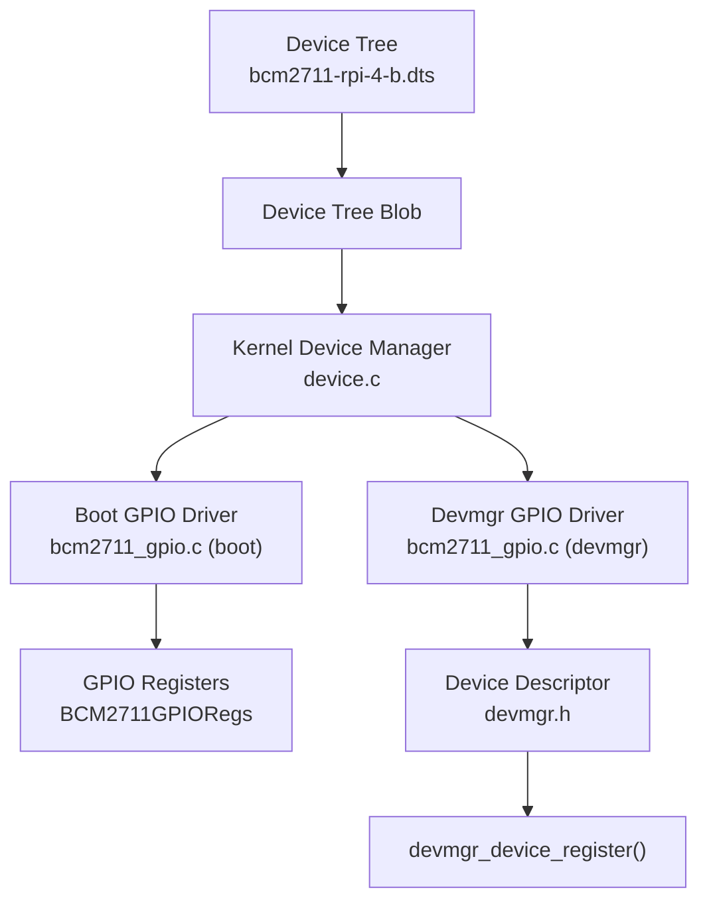
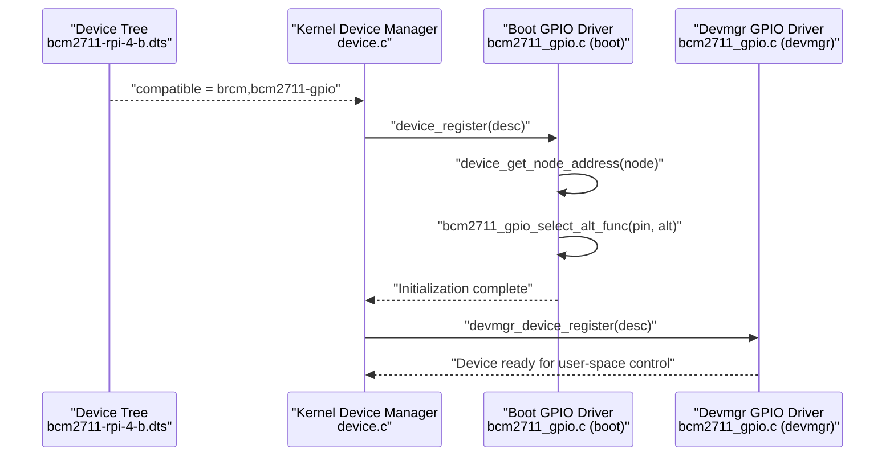
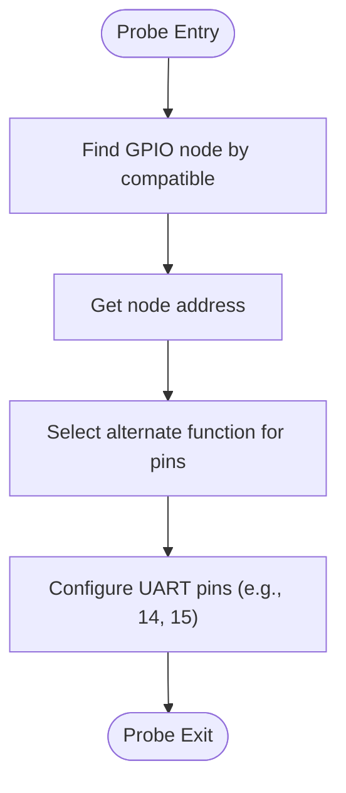
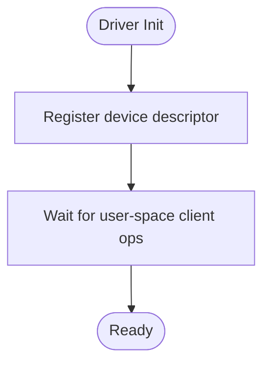
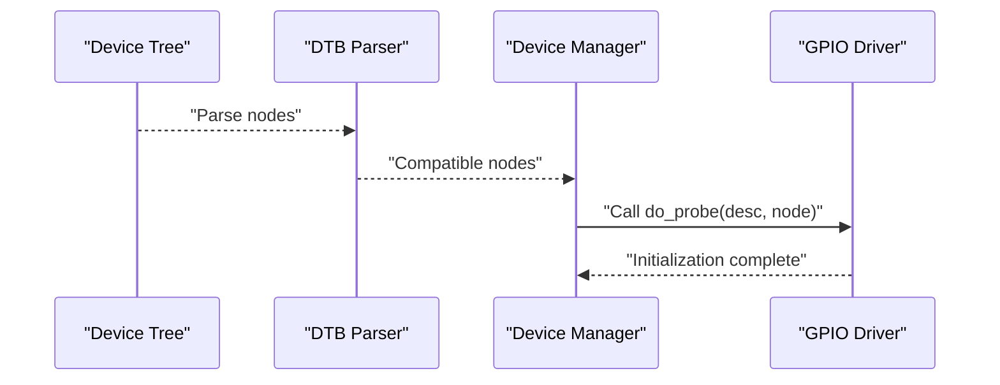
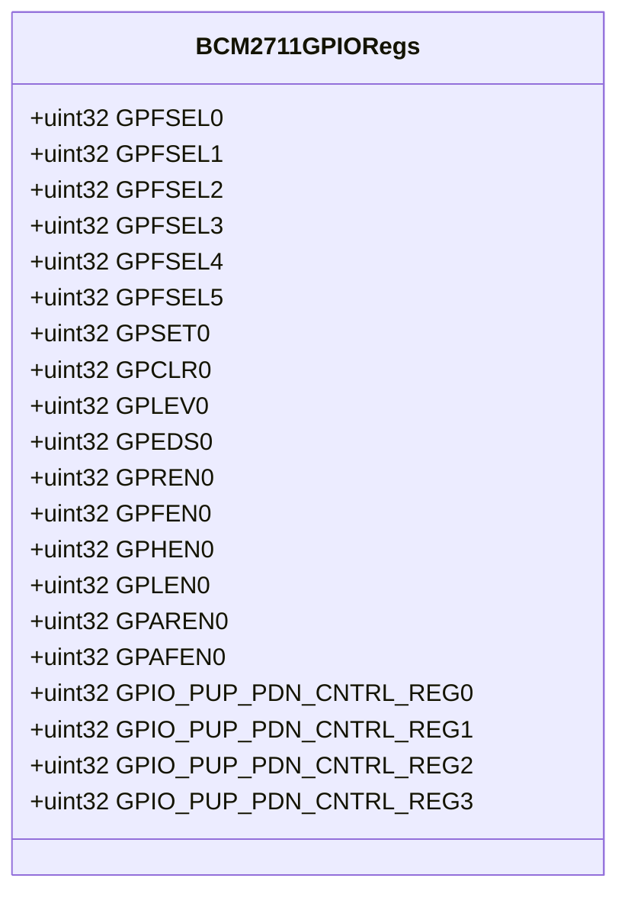
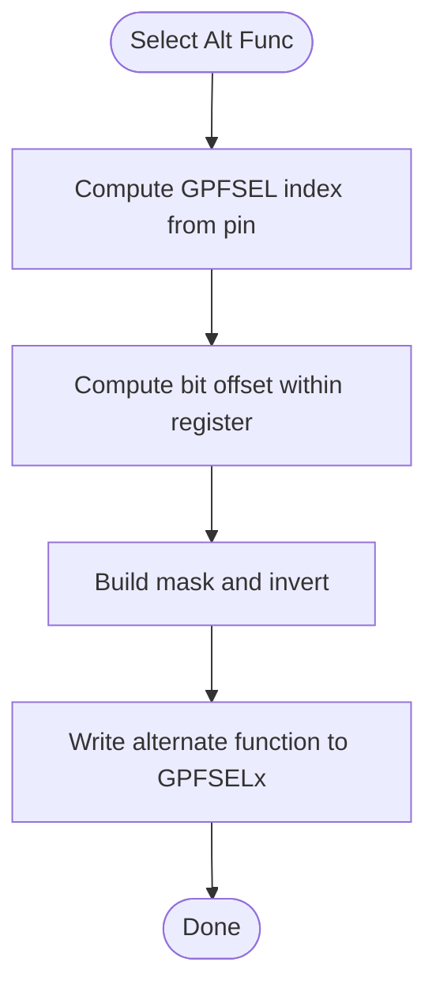
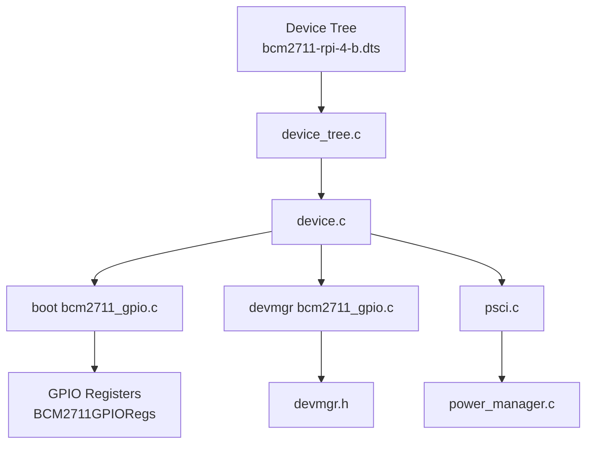

# GPIO Drivers and Control

<cite>
**Referenced Files in This Document**
- [bcm2711_gpio.c](file://boot/drivers/rpi/bcm2711-gpio/bcm2711_gpio.c)
- [bcm2711_gpio.h](file://boot/drivers/rpi/bcm2711-gpio/bcm2711_gpio.h)
- [bcm2711_gpio.c](file://uapps/devmgr/drivers/rpi/rpi-gpio/bcm2711_gpio.c)
- [bcm2711_gpio.h](file://uapps/devmgr/drivers/rpi/rpi-gpio/bcm2711_gpio.h)
- [devmgr.h](file://uapps/devmgr/include/devmgr.h)
- [device.c](file://kernel/device/device.c)
- [device_tree.c](file://kernel/device/device_tree.c)
- [bcm2711-rpi-4-b.dts](file://platform/Pi4b/dts/bcm2711-rpi-4-b.dts)
- [psci.c](file://kernel/drivers/arm-psci/psci.c)
- [power_manager.c](file://boot/power_manager.c)
</cite>

## Table of Contents
1. [Introduction](#introduction)
2. [Project Structure](#project-structure)
3. [Core Components](#core-components)
4. [Architecture Overview](#architecture-overview)
5. [Detailed Component Analysis](#detailed-component-analysis)
6. [Dependency Analysis](#dependency-analysis)
7. [Performance Considerations](#performance-considerations)
8. [Troubleshooting Guide](#troubleshooting-guide)
9. [Conclusion](#conclusion)
10. [Appendices](#appendices)

## Introduction
This document explains the GPIO driver implementations in devmgr for the Raspberry Pi BCM2711 SoC. It covers the dual implementation approach with both a boot-time GPIO driver and a user-space devmgr GPIO driver, the BCM2711 GPIO controller registers and operation modes, pin configuration and alternate function selection, and the device discovery and initialization pipeline via the device tree. Practical guidance is included for pin mapping, alternate function configuration, GPIO-based device control, and power management considerations. Debugging tips and timing/signaling considerations are also provided.

## Project Structure
The GPIO subsystem spans two layers:
- Boot-time driver: Initializes early GPIO features (such as UART alternate functions) during the earliest phase of boot.
- Devmgr driver: Registers a device descriptor for GPIO and defers most GPIO operations to user-space clients.

**Diagram sources**
- [bcm2711-rpi-4-b.dts](file://platform/Pi4b/dts/bcm2711-rpi-4-b.dts#L69-L69)
- [device.c](file://kernel/device/device.c#L13-L26)
- [bcm2711_gpio.c](file://boot/drivers/rpi/bcm2711-gpio/bcm2711_gpio.c#L49-L53)
- [bcm2711_gpio.c](file://uapps/devmgr/drivers/rpi/rpi-gpio/bcm2711_gpio.c#L49-L61)
- [bcm2711_gpio.h](file://boot/drivers/rpi/bcm2711-gpio/bcm2711_gpio.h#L52-L95)
- [devmgr.h](file://uapps/devmgr/include/devmgr.h#L17-L24)

**Section sources**
- [bcm2711_gpio.c](file://boot/drivers/rpi/bcm2711-gpio/bcm2711_gpio.c#L1-L67)
- [bcm2711_gpio.c](file://uapps/devmgr/drivers/rpi/rpi-gpio/bcm2711_gpio.c#L1-L63)
- [bcm2711_gpio.h](file://boot/drivers/rpi/bcm2711-gpio/bcm2711_gpio.h#L1-L98)
- [bcm2711_gpio.h](file://uapps/devmgr/drivers/rpi/rpi-gpio/bcm2711_gpio.h#L1-L98)
- [devmgr.h](file://uapps/devmgr/include/devmgr.h#L1-L30)
- [device.c](file://kernel/device/device.c#L1-L55)
- [device_tree.c](file://kernel/device/device_tree.c#L1-L95)
- [bcm2711-rpi-4-b.dts](file://platform/Pi4b/dts/bcm2711-rpi-4-b.dts#L1-L200)

## Core Components
- BCM2711 GPIO controller registers: The driver exposes the functional register set for GPIO function selection, set/clr, level, event detection, and pull-up/pull-down control.
- Alternate function selection: A helper computes the correct field within the GPIO function select registers and applies the desired alternate function.
- Boot-time GPIO driver: Discovers the GPIO node from the device tree, resolves its address, and configures specific pins (e.g., UART) early in boot.
- Devmgr GPIO driver: Registers a device descriptor for GPIO and defers runtime GPIO operations to user-space clients.

Key capabilities:
- Pin direction selection via alternate function registers.
- Output operations via set/clr registers.
- Level reads via level registers.
- Event-driven behavior via event detection and edge/event enable registers.
- Pull-up/pull-down configuration via dedicated control registers.

**Section sources**
- [bcm2711_gpio.h](file://boot/drivers/rpi/bcm2711-gpio/bcm2711_gpio.h#L52-L95)
- [bcm2711_gpio.c](file://boot/drivers/rpi/bcm2711-gpio/bcm2711_gpio.c#L9-L47)
- [bcm2711_gpio.c](file://boot/drivers/rpi/bcm2711-gpio/bcm2711_gpio.c#L49-L53)
- [bcm2711_gpio.h](file://uapps/devmgr/drivers/rpi/rpi-gpio/bcm2711_gpio.h#L52-L95)
- [bcm2711_gpio.c](file://uapps/devmgr/drivers/rpi/rpi-gpio/bcm2711_gpio.c#L8-L47)
- [bcm2711_gpio.c](file://uapps/devmgr/drivers/rpi/rpi-gpio/bcm2711_gpio.c#L49-L61)

## Architecture Overview
The GPIO architecture integrates device tree discovery, kernel device manager registration, and dual driver implementations:

**Diagram sources**
- [bcm2711-rpi-4-b.dts](file://platform/Pi4b/dts/bcm2711-rpi-4-b.dts#L69-L69)
- [device.c](file://kernel/device/device.c#L13-L26)
- [bcm2711_gpio.c](file://boot/drivers/rpi/bcm2711-gpio/bcm2711_gpio.c#L49-L53)
- [bcm2711_gpio.c](file://uapps/devmgr/drivers/rpi/rpi-gpio/bcm2711_gpio.c#L49-L61)

## Detailed Component Analysis

### Boot-Time GPIO Driver (Early Initialization)
Purpose:
- Discover GPIO node from device tree.
- Resolve physical address and configure specific pins early in boot (e.g., UART alternate functions).

Implementation highlights:
- Device registration for compatible "brcm,bcm2711-gpio".
- Alternate function selection helper writes to the appropriate GPFSELx register.
- UART pin configuration sets alternate function for pins 14 and 15.

**Diagram sources**
- [bcm2711_gpio.c](file://boot/drivers/rpi/bcm2711-gpio/bcm2711_gpio.c#L49-L53)
- [bcm2711_gpio.c](file://boot/drivers/rpi/bcm2711-gpio/bcm2711_gpio.c#L9-L47)

**Section sources**
- [bcm2711_gpio.c](file://boot/drivers/rpi/bcm2711-gpio/bcm2711_gpio.c#L1-L67)
- [bcm2711_gpio.h](file://boot/drivers/rpi/bcm2711-gpio/bcm2711_gpio.h#L1-L98)

### Devmgr GPIO Driver (User-Space Registration)
Purpose:
- Register a GPIO device descriptor for user-space control.
- Defer runtime operations (direction, input/output, interrupts) to user-space clients.

Implementation highlights:
- Device descriptor with compatible "brcm,bcm2711-gpio".
- Registration macro to place init function in a special section.
- Probe stub currently disabled; GPIO address resolution and initialization are commented out.

**Diagram sources**
- [bcm2711_gpio.c](file://uapps/devmgr/drivers/rpi/rpi-gpio/bcm2711_gpio.c#L49-L61)
- [devmgr.h](file://uapps/devmgr/include/devmgr.h#L8-L11)

**Section sources**
- [bcm2711_gpio.c](file://uapps/devmgr/drivers/rpi/rpi-gpio/bcm2711_gpio.c#L1-L63)
- [devmgr.h](file://uapps/devmgr/include/devmgr.h#L1-L30)

### Device Discovery and Registration Pipeline
How the system discovers and initializes GPIO:
- Device tree defines aliases and nodes for GPIO.
- Kernel device manager finds nodes by compatible string and invokes driver probe.
- Boot driver performs early configuration; devmgr driver registers for later user-space control.

**Diagram sources**
- [device_tree.c](file://kernel/device/device_tree.c#L25-L37)
- [device.c](file://kernel/device/device.c#L13-L26)
- [bcm2711_gpio.c](file://boot/drivers/rpi/bcm2711-gpio/bcm2711_gpio.c#L49-L53)

**Section sources**
- [device_tree.c](file://kernel/device/device_tree.c#L1-L95)
- [device.c](file://kernel/device/device.c#L1-L55)
- [bcm2711-rpi-4-b.dts](file://platform/Pi4b/dts/bcm2711-rpi-4-b.dts#L69-L69)

### GPIO Operation Modes and Register Set
The BCM2711 GPIO controller exposes:
- Function select registers (GPFSEL0–GPFSEL5) for pin modes and alternate functions.
- Output set/clear registers (GPSET0/GPCLR0) for writing pin state.
- Level registers (GPLEV0) for reading pin state.
- Event detection status (GPEDS0) and edge/event enable registers (GPREN0/GPFEN0, GPHEN0/GPLEN0, GPAREN0/GPAFEN0) for interrupt/event handling.
- Pull-up/pull-down control registers (GPIO_PUP_PDN_CNTRL_REG0–3).

Alternate function constants define the encoding for selecting alternate functions.

**Diagram sources**
- [bcm2711_gpio.h](file://boot/drivers/rpi/bcm2711-gpio/bcm2711_gpio.h#L52-L95)
- [bcm2711_gpio.h](file://uapps/devmgr/drivers/rpi/rpi-gpio/bcm2711_gpio.h#L52-L95)

**Section sources**
- [bcm2711_gpio.h](file://boot/drivers/rpi/bcm2711-gpio/bcm2711_gpio.h#L1-L98)
- [bcm2711_gpio.h](file://uapps/devmgr/drivers/rpi/rpi-gpio/bcm2711_gpio.h#L1-L98)

### Alternate Function Configuration
Alternate function selection is performed by:
- Determining which GPFSEL register to modify based on the pin number.
- Computing the bit-field offset within the selected register.
- Clearing the existing bits and setting the new alternate function value.

**Diagram sources**
- [bcm2711_gpio.c](file://boot/drivers/rpi/bcm2711-gpio/bcm2711_gpio.c#L9-L42)
- [bcm2711_gpio.c](file://uapps/devmgr/drivers/rpi/rpi-gpio/bcm2711_gpio.c#L8-L42)

**Section sources**
- [bcm2711_gpio.c](file://boot/drivers/rpi/bcm2711-gpio/bcm2711_gpio.c#L1-L67)
- [bcm2711_gpio.c](file://uapps/devmgr/drivers/rpi/rpi-gpio/bcm2711_gpio.c#L1-L63)

### Interrupt Handling Overview
Interrupt/event handling registers include:
- Event detection status (GPEDS0) to detect events per pin.
- Rising/ falling/ async rising/ async falling enable registers (GPREN0/GPFEN0, GPHEN0/GPLEN0, GPAREN0/GPAFEN0) to configure sensitivity.
- These registers enable interrupt-driven GPIO operations.

Note: The current driver code focuses on alternate function selection and early UART configuration. Interrupt handling would typically be implemented by user-space clients or higher-level drivers using these registers.

**Section sources**
- [bcm2711_gpio.h](file://boot/drivers/rpi/bcm2711-gpio/bcm2711_gpio.h#L70-L89)
- [bcm2711_gpio.h](file://uapps/devmgr/drivers/rpi/rpi-gpio/bcm2711_gpio.h#L70-L89)

## Dependency Analysis
The GPIO drivers depend on:
- Device tree for node discovery and address retrieval.
- Kernel device manager for driver registration and probe invocation.
- Power management for CPU on/off operations (via PSCI).

**Diagram sources**
- [bcm2711-rpi-4-b.dts](file://platform/Pi4b/dts/bcm2711-rpi-4-b.dts#L69-L69)
- [device_tree.c](file://kernel/device/device_tree.c#L25-L37)
- [device.c](file://kernel/device/device.c#L13-L26)
- [bcm2711_gpio.c](file://boot/drivers/rpi/bcm2711-gpio/bcm2711_gpio.c#L49-L53)
- [bcm2711_gpio.c](file://uapps/devmgr/drivers/rpi/rpi-gpio/bcm2711_gpio.c#L49-L61)
- [psci.c](file://kernel/drivers/arm-psci/psci.c#L188-L222)
- [power_manager.c](file://boot/power_manager.c#L1-L26)

**Section sources**
- [device_tree.c](file://kernel/device/device_tree.c#L1-L95)
- [device.c](file://kernel/device/device.c#L1-L55)
- [psci.c](file://kernel/drivers/arm-psci/psci.c#L188-L222)
- [power_manager.c](file://boot/power_manager.c#L1-L26)

## Performance Considerations
- Minimize repeated device tree lookups by caching resolved addresses after initial probe.
- Batch register writes when configuring multiple pins to reduce bus traffic.
- Use event registers judiciously to avoid unnecessary wake-ups or polling overhead.
- Keep alternate function changes to boot-time or initialization sequences to avoid runtime contention.

## Troubleshooting Guide
Common issues and remedies:
- GPIO node not found: Verify the device tree alias and compatible string for GPIO.
  - Check device tree alias for GPIO and compatible entries.
  - Confirm kernel device manager can locate the node by compatible string.
- Incorrect pin mode: Ensure alternate function selection writes the correct bits in the intended GPFSEL register.
- UART not working: Confirm early UART pin configuration was applied during boot.
- Power management hooks: If CPU on/off operations fail, check PSCI registration and power manager callbacks.

**Section sources**
- [device_tree.c](file://kernel/device/device_tree.c#L25-L37)
- [device.c](file://kernel/device/device.c#L13-L26)
- [bcm2711_gpio.c](file://boot/drivers/rpi/bcm2711-gpio/bcm2711_gpio.c#L44-L47)
- [psci.c](file://kernel/drivers/arm-psci/psci.c#L188-L222)
- [power_manager.c](file://boot/power_manager.c#L12-L21)

## Conclusion
The GPIO subsystem provides a clean separation between early boot configuration and user-space control. The BCM2711 GPIO controller’s register set supports flexible pin modes, output control, level sensing, and event-driven interrupts. The dual driver approach ensures critical early features (like UART) are enabled promptly while leaving general-purpose GPIO operations to user-space clients.

## Appendices

### Practical Examples and Usage Guidance
- Pin mapping: Use the device tree alias for GPIO to locate the controller base address and derive pin numbers from the SoC pin numbering scheme.
- Alternate function configuration: Apply alternate function selection for pins used by peripherals (e.g., UART).
- GPIO-based device control: Configure direction via alternate functions, drive outputs via set/clr registers, and monitor inputs via level registers.
- Interrupt handling: Enable desired edges/events via the appropriate registers and handle events in user-space clients.

[No sources needed since this section provides general guidance]