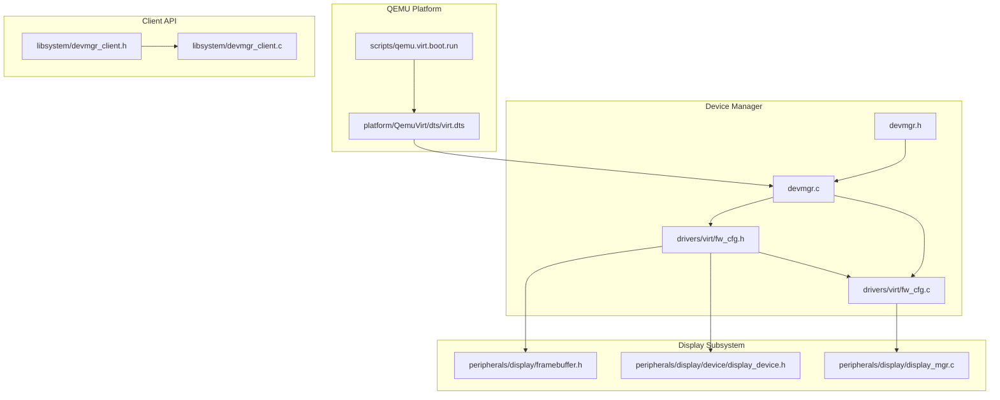
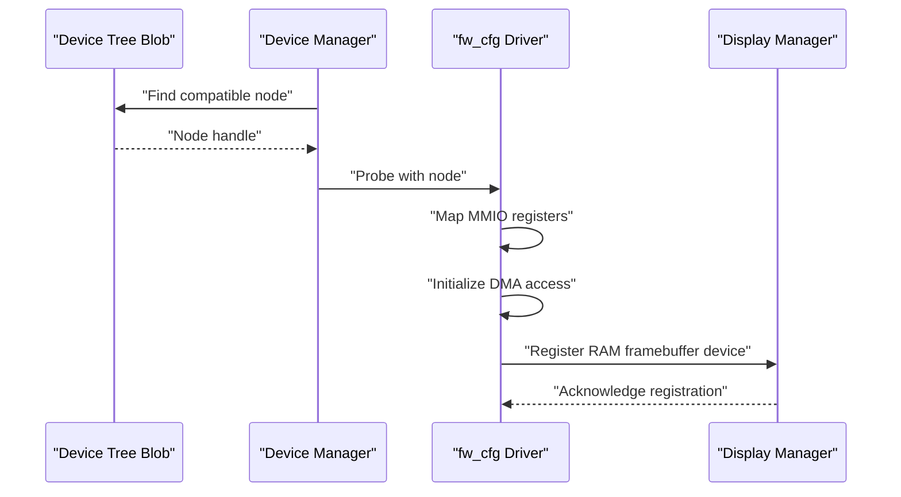
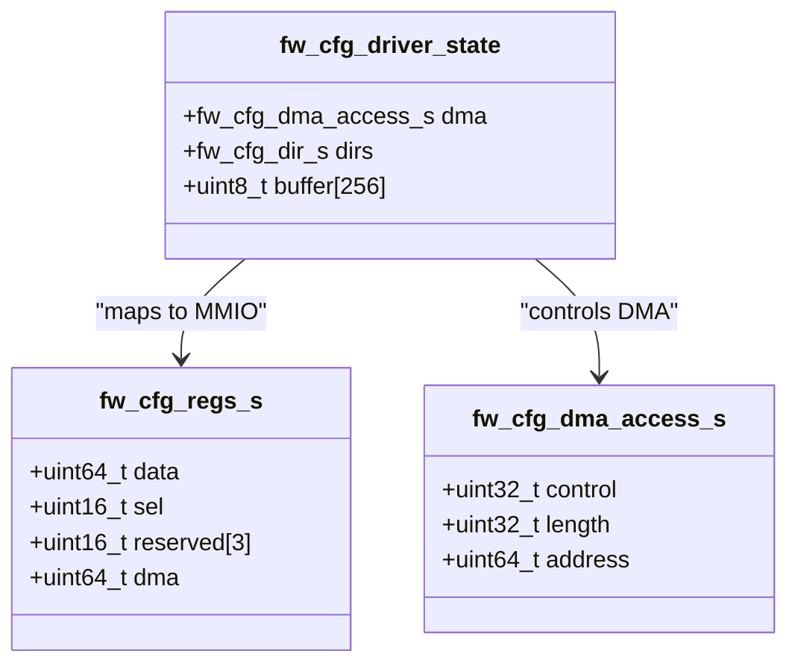
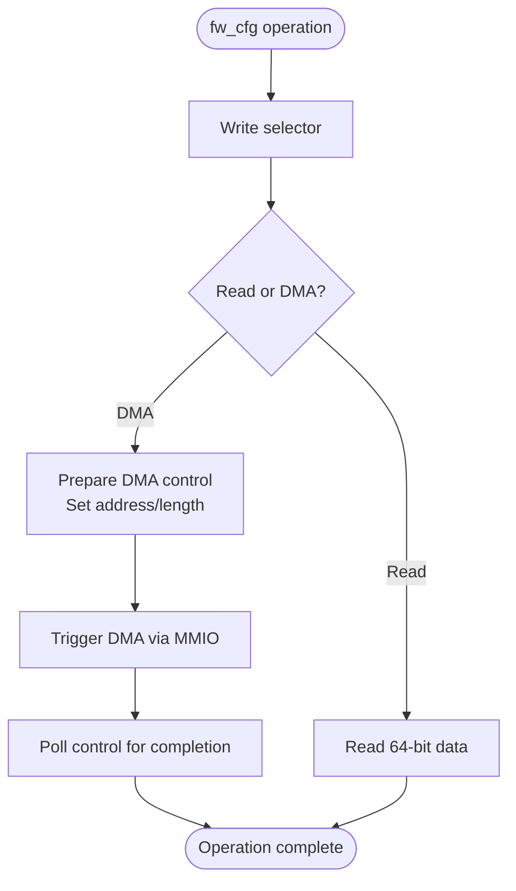
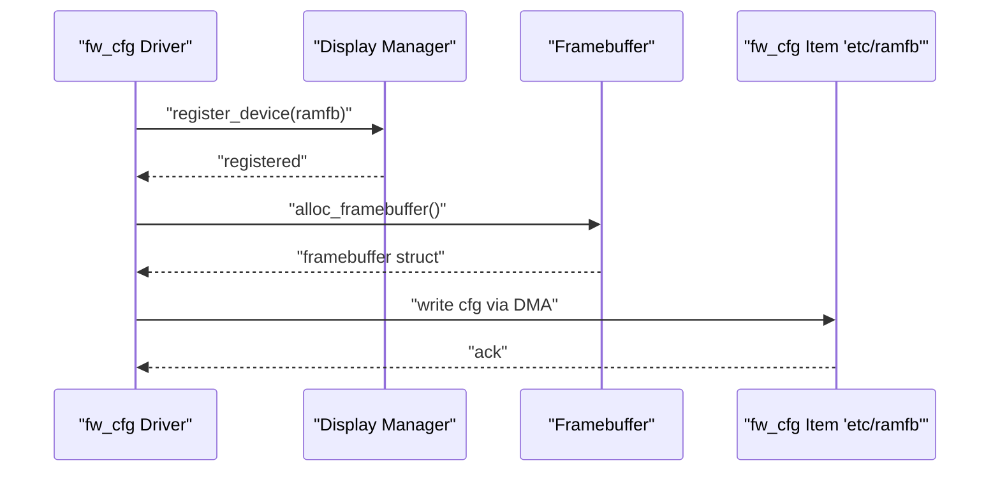
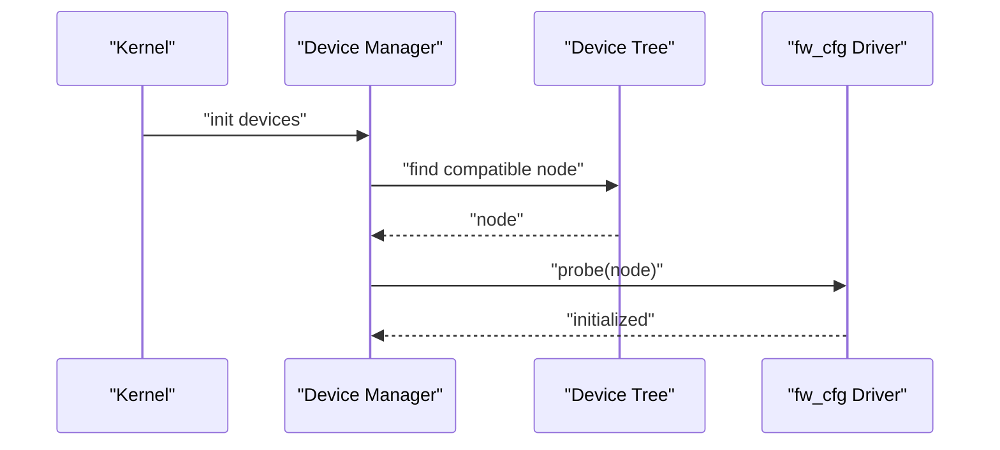
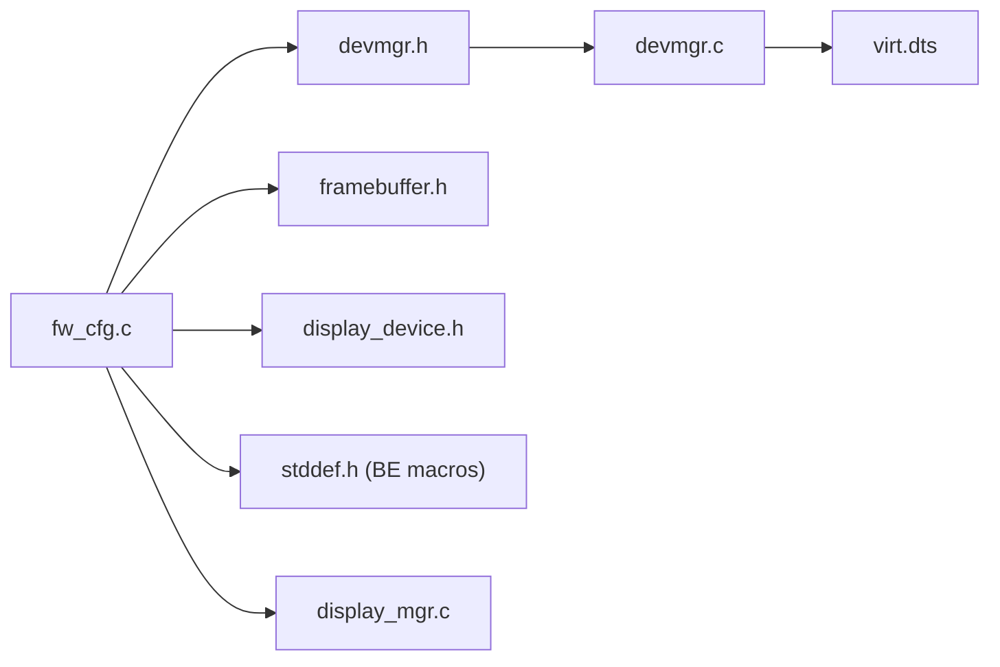

# Virtual Device Support

<cite>
**Referenced Files in This Document**
- [fw_cfg.h](file://uapps/devmgr/drivers/virt/fw_cfg.h)
- [fw_cfg.c](file://uapps/devmgr/drivers/virt/fw_cfg.c)
- [devmgr.h](file://uapps/devmgr/include/devmgr.h)
- [devmgr.c](file://uapps/devmgr/devmgr.c)
- [framebuffer.h](file://uapps/devmgr/include/peripherals/display/framebuffer.h)
- [display_device.h](file://uapps/devmgr/include/peripherals/display/device/display_device.h)
- [display_mgr.c](file://uapps/devmgr/peripherals/display/display_mgr.c)
- [virt.dts](file://platform/QemuVirt/dts/virt.dts)
- [qemu.virt.boot.run](file://scripts/qemu.virt.boot.run)
- [devmgr_client.h](file://ulibs/include/libsystem/devmgr_client.h)
- [devmgr_client.c](file://ulibs/libsystem/devmgr_client.c)
- [stddef.h](file://ulibs/include/libc/stddef.h)
</cite>

## Table of Contents
1. [Introduction](#introduction)
2. [Project Structure](#project-structure)
3. [Core Components](#core-components)
4. [Architecture Overview](#architecture-overview)
5. [Detailed Component Analysis](#detailed-component-analysis)
6. [Dependency Analysis](#dependency-analysis)
7. [Performance Considerations](#performance-considerations)
8. [Troubleshooting Guide](#troubleshooting-guide)
9. [Conclusion](#conclusion)
10. [Appendices](#appendices)

## Introduction
This document explains virtual device support within the Device Manager, focusing on the firmware configuration (fw_cfg) device implementation for QEMU virtual platforms. It covers the virtual device communication protocol via MMIO registers, DMA-based configuration item access, and the virtual hardware abstraction used to expose a RAM framebuffer to the guest. The document also describes the fw_cfg API surface for configuration item retrieval, device property access, and virtual machine metadata handling, and provides practical usage examples, limitations, debugging techniques, and performance considerations.

## Project Structure
The fw_cfg driver resides under the Device Manager’s virtual device drivers and integrates with the display subsystem to present a RAM framebuffer. The QEMU virtual platform DTS defines the fw_cfg device node, and the QEMU boot script launches the virtual machine with fw_cfg enabled.

**Diagram sources**
- [devmgr.h](file://uapps/devmgr/include/devmgr.h#L1-L30)
- [devmgr.c](file://uapps/devmgr/devmgr.c#L1-L62)
- [fw_cfg.h](file://uapps/devmgr/drivers/virt/fw_cfg.h#L1-L48)
- [fw_cfg.c](file://uapps/devmgr/drivers/virt/fw_cfg.c#L1-L152)
- [framebuffer.h](file://uapps/devmgr/include/peripherals/display/framebuffer.h#L1-L16)
- [display_device.h](file://uapps/devmgr/include/peripherals/display/device/display_device.h#L1-L16)
- [display_mgr.c](file://uapps/devmgr/peripherals/display/display_mgr.c#L1-L31)
- [virt.dts](file://platform/QemuVirt/dts/virt.dts#L73-L77)
- [qemu.virt.boot.run](file://scripts/qemu.virt.boot.run#L1-L18)
- [devmgr_client.h](file://ulibs/include/libsystem/devmgr_client.h#L1-L43)
- [devmgr_client.c](file://ulibs/libsystem/devmgr_client.c#L1-L25)

**Section sources**
- [devmgr.h](file://uapps/devmgr/include/devmgr.h#L1-L30)
- [devmgr.c](file://uapps/devmgr/devmgr.c#L1-L62)
- [fw_cfg.h](file://uapps/devmgr/drivers/virt/fw_cfg.h#L1-L48)
- [fw_cfg.c](file://uapps/devmgr/drivers/virt/fw_cfg.c#L1-L152)
- [framebuffer.h](file://uapps/devmgr/include/peripherals/display/framebuffer.h#L1-L16)
- [display_device.h](file://uapps/devmgr/include/peripherals/display/device/display_device.h#L1-L16)
- [display_mgr.c](file://uapps/devmgr/peripherals/display/display_mgr.c#L1-L31)
- [virt.dts](file://platform/QemuVirt/dts/virt.dts#L73-L77)
- [qemu.virt.boot.run](file://scripts/qemu.virt.boot.run#L1-L18)
- [devmgr_client.h](file://ulibs/include/libsystem/devmgr_client.h#L1-L43)
- [devmgr_client.c](file://ulibs/libsystem/devmgr_client.c#L1-L25)

## Core Components
- fw_cfg MMIO registers and DMA access structures define the virtual hardware interface.
- Device Manager discovers the fw_cfg device node from the device tree and initializes the driver.
- The fw_cfg driver exposes a RAM framebuffer display device to the display manager.
- DMA transfers are used to read/write configuration items and metadata.

Key responsibilities:
- fw_cfg register accessors for selection and data.
- DMA transfer control for configuration item reads/writes.
- Directory enumeration of configuration items.
- RAM framebuffer allocation and registration with the display manager.

**Section sources**
- [fw_cfg.h](file://uapps/devmgr/drivers/virt/fw_cfg.h#L8-L45)
- [fw_cfg.c](file://uapps/devmgr/drivers/virt/fw_cfg.c#L19-L82)
- [devmgr.c](file://uapps/devmgr/devmgr.c#L33-L55)
- [display_mgr.c](file://uapps/devmgr/peripherals/display/display_mgr.c#L6-L19)

## Architecture Overview
The fw_cfg driver participates in the Device Manager’s device discovery and initialization pipeline. It locates the fw_cfg device node via the device tree, maps its MMIO region, and initializes DMA-capable configuration access. The driver then registers a RAM framebuffer display device so the display manager can allocate and present framebuffers.

**Diagram sources**
- [devmgr.c](file://uapps/devmgr/devmgr.c#L10-L55)
- [fw_cfg.c](file://uapps/devmgr/drivers/virt/fw_cfg.c#L132-L142)
- [display_mgr.c](file://uapps/devmgr/peripherals/display/display_mgr.c#L25-L31)

## Detailed Component Analysis

### fw_cfg MMIO and DMA Protocol
The fw_cfg device exposes two MMIO regions:
- Control/data registers for selecting configuration items and reading data.
- DMA address register for initiating DMA transfers.

DMA control fields include direction, length, and a host-side address. The driver waits for the DMA controller to signal completion.

**Diagram sources**
- [fw_cfg.h](file://uapps/devmgr/drivers/virt/fw_cfg.h#L8-L19)
- [fw_cfg.c](file://uapps/devmgr/drivers/virt/fw_cfg.c#L11-L17)

**Section sources**
- [fw_cfg.h](file://uapps/devmgr/drivers/virt/fw_cfg.h#L8-L19)
- [fw_cfg.c](file://uapps/devmgr/drivers/virt/fw_cfg.c#L19-L44)

### fw_cfg API Surface
- Selector write: sets the current configuration item index.
- Data read: retrieves 64-bit aligned data from the selected item.
- DMA read/write: transfers arbitrary-length buffers to/from configuration items using DMA.
- Directory enumeration: lists available configuration items by path.
- RAM framebuffer configuration: writes a framebuffer descriptor to the fw_cfg “etc/ramfb” item.

**Diagram sources**
- [fw_cfg.c](file://uapps/devmgr/drivers/virt/fw_cfg.c#L19-L44)

**Section sources**
- [fw_cfg.c](file://uapps/devmgr/drivers/virt/fw_cfg.c#L19-L82)

### RAM Framebuffer Virtual Hardware Abstraction
The driver implements a RAM framebuffer device that:
- Allocates framebuffer metadata with width, height, stride, and GPU-accessible address.
- Registers a display device with the display manager.
- Writes the framebuffer configuration to the fw_cfg “etc/ramfb” item to advertise the framebuffer to the VM firmware.

**Diagram sources**
- [fw_cfg.c](file://uapps/devmgr/drivers/virt/fw_cfg.c#L84-L124)
- [display_mgr.c](file://uapps/devmgr/peripherals/display/display_mgr.c#L6-L19)
- [framebuffer.h](file://uapps/devmgr/include/peripherals/display/framebuffer.h#L8-L14)

**Section sources**
- [fw_cfg.c](file://uapps/devmgr/drivers/virt/fw_cfg.c#L84-L130)
- [framebuffer.h](file://uapps/devmgr/include/peripherals/display/framebuffer.h#L8-L14)
- [display_device.h](file://uapps/devmgr/include/peripherals/display/device/display_device.h#L8-L14)
- [display_mgr.c](file://uapps/devmgr/peripherals/display/display_mgr.c#L6-L19)

### Device Manager Integration and Discovery
The Device Manager:
- Locates the fw_cfg device node by compatible string.
- Resolves the physical address from the device tree.
- Invokes the driver’s probe routine to initialize the device.

**Diagram sources**
- [devmgr.c](file://uapps/devmgr/devmgr.c#L38-L54)
- [fw_cfg.c](file://uapps/devmgr/drivers/virt/fw_cfg.c#L132-L142)

**Section sources**
- [devmgr.h](file://uapps/devmgr/include/devmgr.h#L13-L30)
- [devmgr.c](file://uapps/devmgr/devmgr.c#L10-L55)
- [fw_cfg.c](file://uapps/devmgr/drivers/virt/fw_cfg.c#L132-L142)

### Practical Examples

- Enumerating configuration items:
  - Initialize fw_cfg and read the directory structure.
  - Iterate entries to locate a target item by path.

- Writing a RAM framebuffer descriptor:
  - Allocate a framebuffer with desired dimensions.
  - Write the descriptor to the “etc/ramfb” item via DMA.

- Integrating with the display manager:
  - Register the RAM framebuffer device during probe.
  - Allow the display manager to allocate and set the framebuffer.

These workflows rely on the fw_cfg DMA transfer routines and the display manager’s registration API.

**Section sources**
- [fw_cfg.c](file://uapps/devmgr/drivers/virt/fw_cfg.c#L46-L82)
- [fw_cfg.c](file://uapps/devmgr/drivers/virt/fw_cfg.c#L84-L130)
- [display_mgr.c](file://uapps/devmgr/peripherals/display/display_mgr.c#L6-L19)

## Dependency Analysis
The fw_cfg driver depends on:
- Device Manager APIs for device discovery and address resolution.
- Display subsystem interfaces for framebuffer allocation and registration.
- Endianness conversion helpers for multi-byte fields.
- DMA control structures and MMIO mapping.

**Diagram sources**
- [fw_cfg.c](file://uapps/devmgr/drivers/virt/fw_cfg.c#L1-L8)
- [devmgr.h](file://uapps/devmgr/include/devmgr.h#L1-L30)
- [devmgr.c](file://uapps/devmgr/devmgr.c#L1-L62)
- [framebuffer.h](file://uapps/devmgr/include/peripherals/display/framebuffer.h#L1-L16)
- [display_device.h](file://uapps/devmgr/include/peripherals/display/device/display_device.h#L1-L16)
- [display_mgr.c](file://uapps/devmgr/peripherals/display/display_mgr.c#L1-L31)
- [stddef.h](file://ulibs/include/libc/stddef.h#L6-L8)
- [virt.dts](file://platform/QemuVirt/dts/virt.dts#L73-L77)

**Section sources**
- [fw_cfg.c](file://uapps/devmgr/drivers/virt/fw_cfg.c#L1-L8)
- [devmgr.h](file://uapps/devmgr/include/devmgr.h#L1-L30)
- [devmgr.c](file://uapps/devmgr/devmgr.c#L1-L62)
- [framebuffer.h](file://uapps/devmgr/include/peripherals/display/framebuffer.h#L1-L16)
- [display_device.h](file://uapps/devmgr/include/peripherals/display/device/display_device.h#L1-L16)
- [display_mgr.c](file://uapps/devmgr/peripherals/display/display_mgr.c#L1-L31)
- [stddef.h](file://ulibs/include/libc/stddef.h#L6-L8)
- [virt.dts](file://platform/QemuVirt/dts/virt.dts#L73-L77)

## Performance Considerations
- DMA polling: The driver polls the DMA control field for completion. This is lightweight but synchronous; consider asynchronous completion signaling if latency becomes a concern.
- Buffer sizing: The driver uses a fixed-size buffer for DMA operations. Ensure the buffer accommodates the largest expected configuration item to avoid partial transfers.
- Endianness conversions: Multi-byte fields are byte-swapped using built-in macros. These are efficient but ensure alignment to prevent extra overhead.
- Framebuffer updates: Frequent reconfiguration of the RAM framebuffer descriptor can cause VM firmware churn. Batch updates when possible.

[No sources needed since this section provides general guidance]

## Troubleshooting Guide
Common issues and remedies:
- fw_cfg device not found:
  - Verify the device tree contains a compatible node for the fw_cfg device.
  - Confirm the Device Manager can resolve the node address.

- DMA transfer hangs:
  - Ensure the DMA control register is written in the correct order and the host address is properly aligned.
  - Check that the device tree indicates DMA coherence for the fw_cfg node.

- RAM framebuffer not visible:
  - Confirm the “etc/ramfb” item exists and is readable/writable.
  - Verify the framebuffer descriptor fields are big-endian encoded as required.

- Display manager registration failure:
  - Ensure the display manager is initialized before registering devices.
  - Check that the device name is unique and the function pointers are set.

**Section sources**
- [devmgr.c](file://uapps/devmgr/devmgr.c#L10-L55)
- [fw_cfg.c](file://uapps/devmgr/drivers/virt/fw_cfg.c#L27-L44)
- [fw_cfg.c](file://uapps/devmgr/drivers/virt/fw_cfg.c#L68-L82)
- [display_mgr.c](file://uapps/devmgr/peripherals/display/display_mgr.c#L6-L19)

## Conclusion
The fw_cfg driver provides a minimal yet effective virtual device abstraction for QEMU platforms. It enables configuration item access via MMIO and DMA, supports RAM framebuffer advertisement, and integrates cleanly with the Device Manager and display subsystem. By following the documented workflows and considering the performance and troubleshooting guidance, developers can reliably deploy and debug virtualized device operations.

[No sources needed since this section summarizes without analyzing specific files]

## Appendices

### Appendix A: QEMU Virtual Platform Configuration
- The QEMU virtual platform DTS declares the fw_cfg device node with MMIO region and DMA coherence.
- The QEMU boot script launches the VM with fw_cfg enabled and optional display devices.

**Section sources**
- [virt.dts](file://platform/QemuVirt/dts/virt.dts#L73-L77)
- [qemu.virt.boot.run](file://scripts/qemu.virt.boot.run#L1-L18)

### Appendix B: Client API for Device Manager Services
- The client library exposes IPC-based functions to interact with the Device Manager service, including framebuffer submission and shared memory surface handling.

**Section sources**
- [devmgr_client.h](file://ulibs/include/libsystem/devmgr_client.h#L7-L34)
- [devmgr_client.c](file://ulibs/libsystem/devmgr_client.c#L5-L25)