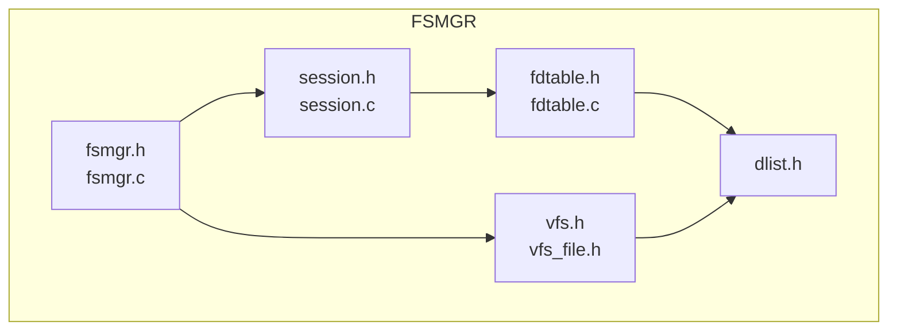
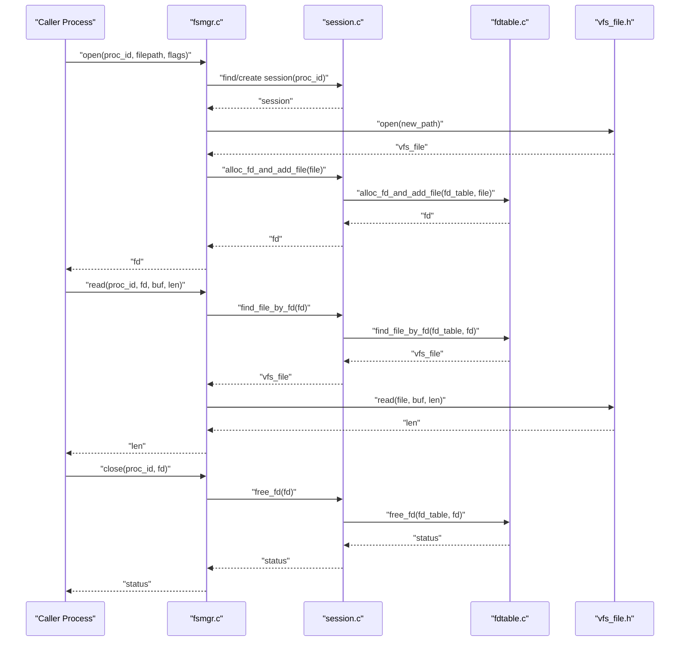
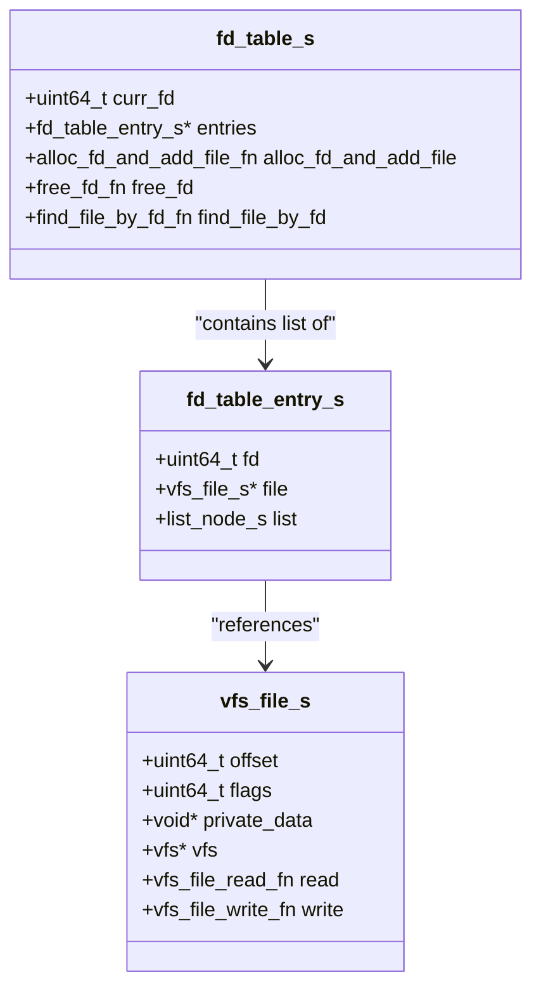
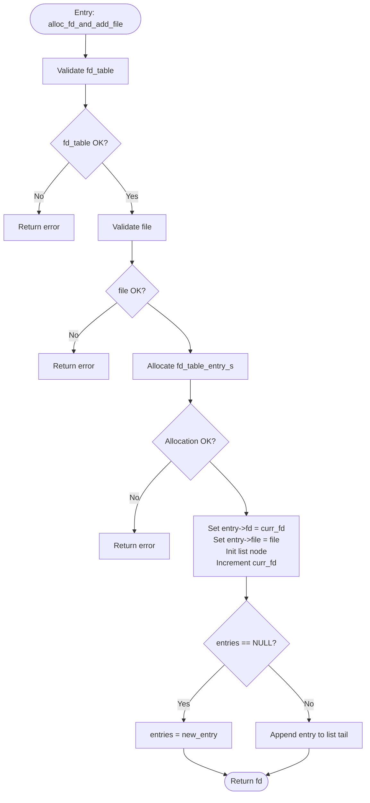
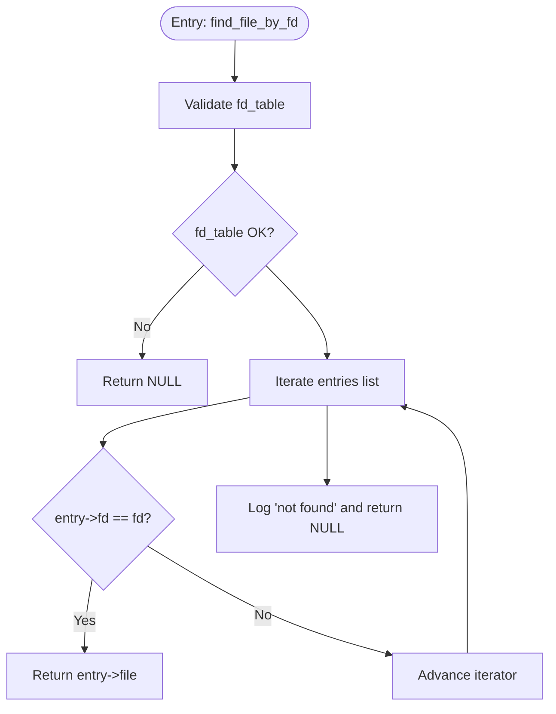
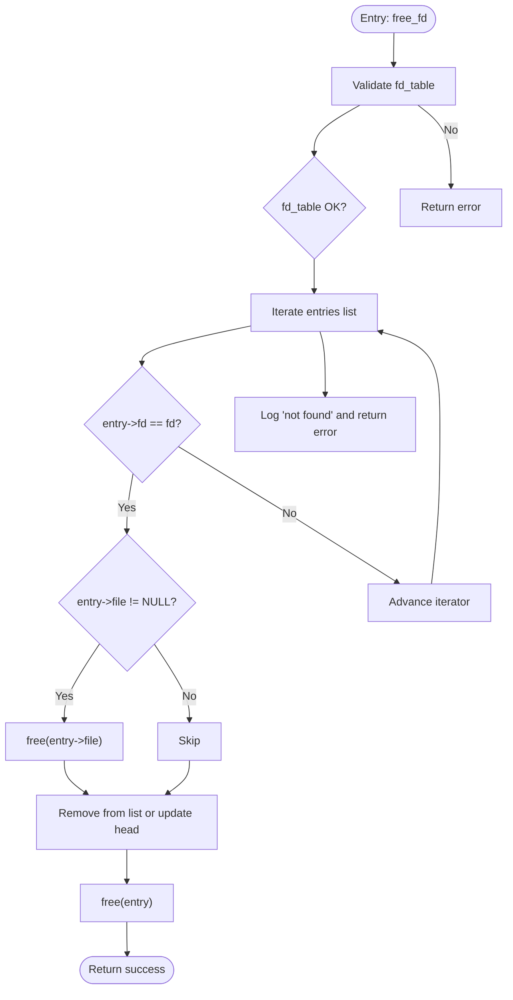
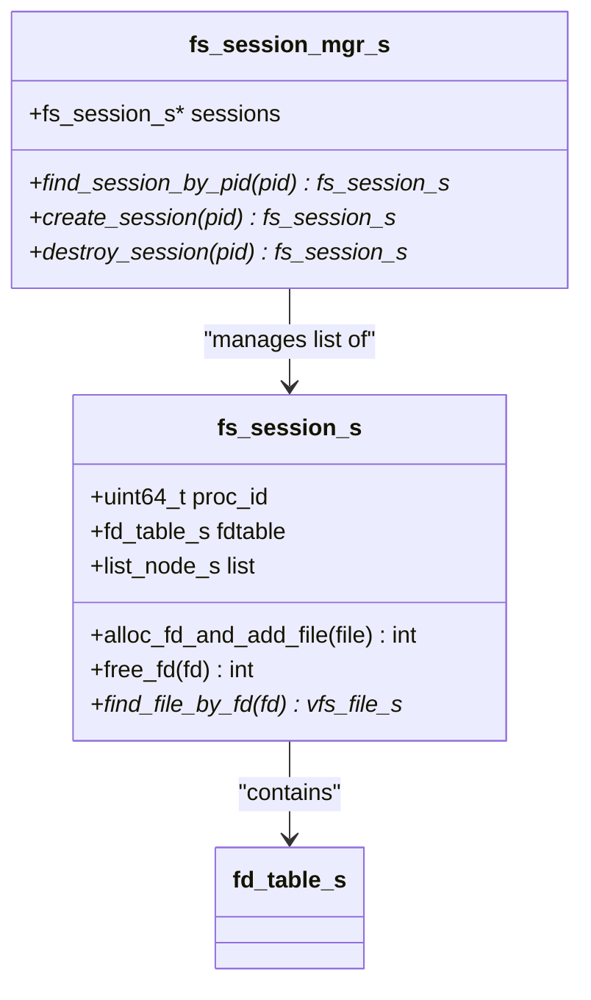
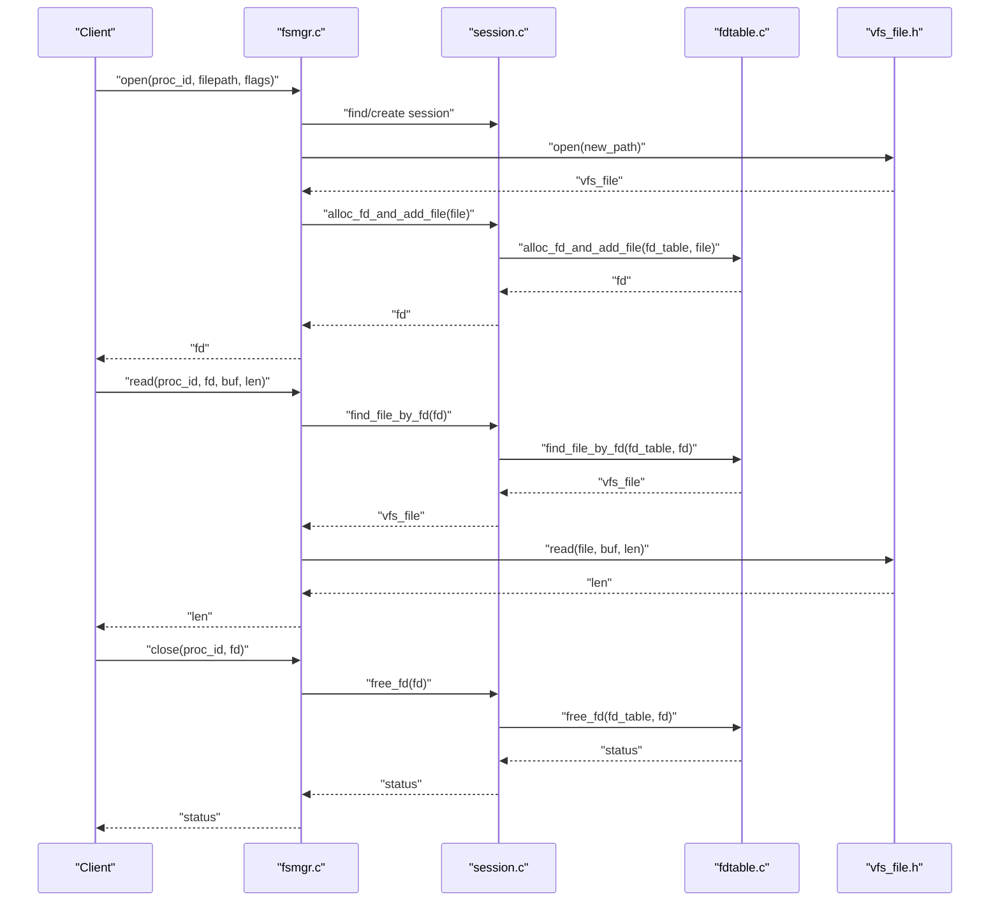
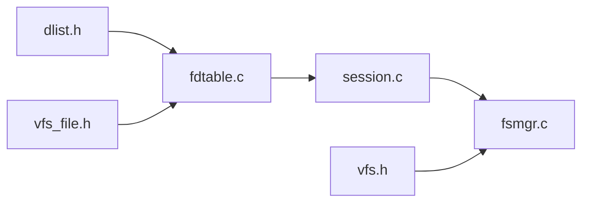

# File Descriptor Table

<cite>
**Referenced Files in This Document**
- [fdtable.h](file://uapps/fsmgr/include/fdtable.h)
- [fdtable.c](file://uapps/fsmgr/fdtable.c)
- [session.h](file://uapps/fsmgr/include/session.h)
- [session.c](file://uapps/fsmgr/session.c)
- [fsmgr.h](file://uapps/fsmgr/include/fsmgr.h)
- [fsmgr.c](file://uapps/fsmgr/fsmgr.c)
- [vfs.h](file://uapps/fsmgr/include/vfs/vfs.h)
- [vfs_file.h](file://uapps/fsmgr/include/vfs/vfs_file.h)
- [dlist.h](file://ulibs/include/libalgorithm/dlist.h)
- [main.c](file://uapps/fsmgr/main.c)
</cite>

## Table of Contents
1. [Introduction](#introduction)
2. [Project Structure](#project-structure)
3. [Core Components](#core-components)
4. [Architecture Overview](#architecture-overview)
5. [Detailed Component Analysis](#detailed-component-analysis)
6. [Dependency Analysis](#dependency-analysis)
7. [Performance Considerations](#performance-considerations)
8. [Troubleshooting Guide](#troubleshooting-guide)
9. [Conclusion](#conclusion)
10. [Appendices](#appendices)

## Introduction
This document explains the File Descriptor Table (FD table) implementation in the TranquilOS Filesystem Manager (FSMGR). It covers the data structures, allocation and lookup mechanisms, integration with session management, file object association, and cleanup procedures. It also documents performance characteristics, memory optimization techniques, and concurrency considerations for multi-threaded usage.

## Project Structure
The FD table resides within the FSMGR subsystem and interacts with session management, VFS, and logging utilities. The relevant components are organized as follows:
- FD table definition and operations: fdtable.h, fdtable.c
- Session and session manager: session.h, session.c
- FSMGR public interface and integration: fsmgr.h, fsmgr.c
- VFS abstractions: vfs.h, vfs_file.h
- Doubly linked list primitives: dlist.h
- Application entry point: main.c

**Diagram sources**
- [fsmgr.h](file://uapps/fsmgr/include/fsmgr.h#L1-L43)
- [fsmgr.c](file://uapps/fsmgr/fsmgr.c#L1-L216)
- [session.h](file://uapps/fsmgr/include/session.h#L1-L39)
- [session.c](file://uapps/fsmgr/session.c#L1-L112)
- [fdtable.h](file://uapps/fsmgr/include/fdtable.h#L1-L31)
- [fdtable.c](file://uapps/fsmgr/fdtable.c#L1-L96)
- [vfs.h](file://uapps/fsmgr/include/vfs/vfs.h#L1-L21)
- [vfs_file.h](file://uapps/fsmgr/include/vfs/vfs_file.h#L1-L19)
- [dlist.h](file://ulibs/include/libalgorithm/dlist.h#L1-L61)

**Section sources**
- [fsmgr.h](file://uapps/fsmgr/include/fsmgr.h#L1-L43)
- [fsmgr.c](file://uapps/fsmgr/fsmgr.c#L1-L216)
- [session.h](file://uapps/fsmgr/include/session.h#L1-L39)
- [session.c](file://uapps/fsmgr/session.c#L1-L112)
- [fdtable.h](file://uapps/fsmgr/include/fdtable.h#L1-L31)
- [fdtable.c](file://uapps/fsmgr/fdtable.c#L1-L96)
- [vfs.h](file://uapps/fsmgr/include/vfs/vfs.h#L1-L21)
- [vfs_file.h](file://uapps/fsmgr/include/vfs/vfs_file.h#L1-L19)
- [dlist.h](file://ulibs/include/libalgorithm/dlist.h#L1-L61)

## Core Components
- FD table entry: associates a file handle with a numeric file descriptor and maintains a doubly linked list node for traversal.
- FD table: tracks current descriptor generation, the head of the entry list, and operation function pointers.
- Session: per-process container holding an FD table and operation dispatchers.
- Session manager: manages creation, lookup, and destruction of sessions keyed by process ID.
- FSMGR: orchestrates VFS mounting, path routing to the appropriate VFS, and file operations via sessions.

Key responsibilities:
- Allocation: allocate a new descriptor and append a new entry to the session’s FD table.
- Lookup: traverse the FD table to locate a file by its descriptor.
- Cleanup: remove an entry and release associated file resources.

**Section sources**
- [fdtable.h](file://uapps/fsmgr/include/fdtable.h#L8-L27)
- [fdtable.c](file://uapps/fsmgr/fdtable.c#L4-L30)
- [session.h](file://uapps/fsmgr/include/session.h#L16-L21)
- [session.c](file://uapps/fsmgr/session.c#L35-L60)
- [fsmgr.h](file://uapps/fsmgr/include/fsmgr.h#L31-L37)
- [fsmgr.c](file://uapps/fsmgr/fsmgr.c#L65-L108)

## Architecture Overview
The FD table sits inside each process session and is accessed through session operations. FSMGR resolves the target VFS based on the mount point and delegates file operations to the session’s FD table.

**Diagram sources**
- [fsmgr.c](file://uapps/fsmgr/fsmgr.c#L65-L108)
- [session.c](file://uapps/fsmgr/session.c#L35-L60)
- [fdtable.c](file://uapps/fsmgr/fdtable.c#L4-L30)
- [vfs_file.h](file://uapps/fsmgr/include/vfs/vfs_file.h#L4-L17)

## Detailed Component Analysis

### FD Table Data Structures
- fd_table_entry_s: holds the file descriptor number, pointer to the VFS file object, and a doubly linked list node.
- fd_table_s: holds the current descriptor generator, the head of the entries list, and function pointers for operations.

**Diagram sources**
- [fdtable.h](file://uapps/fsmgr/include/fdtable.h#L8-L27)
- [vfs_file.h](file://uapps/fsmgr/include/vfs/vfs_file.h#L11-L17)

**Section sources**
- [fdtable.h](file://uapps/fsmgr/include/fdtable.h#L8-L27)
- [vfs_file.h](file://uapps/fsmgr/include/vfs/vfs_file.h#L11-L17)

### Allocation Mechanism
- Allocates a new entry, assigns the next available descriptor from the table’s generator, initializes the list node, increments the generator, and appends the entry to the list.
- Returns the allocated descriptor or an error code.

**Diagram sources**
- [fdtable.c](file://uapps/fsmgr/fdtable.c#L4-L30)

**Section sources**
- [fdtable.c](file://uapps/fsmgr/fdtable.c#L4-L30)

### Lookup Mechanism
- Traverses the doubly linked list starting at the table head, using the container macro to convert list nodes back to entry structures.
- Compares the stored descriptor against the requested one and returns the associated file pointer if found.

**Diagram sources**
- [fdtable.c](file://uapps/fsmgr/fdtable.c#L63-L83)

**Section sources**
- [fdtable.c](file://uapps/fsmgr/fdtable.c#L63-L83)

### Cleanup Procedure
- Searches for the entry with the given descriptor, frees the associated file object if present, removes the entry from the list (or updates the head if it was the first), and frees the entry itself.
- Logs a message if the descriptor is not found.

**Diagram sources**
- [fdtable.c](file://uapps/fsmgr/fdtable.c#L32-L61)

**Section sources**
- [fdtable.c](file://uapps/fsmgr/fdtable.c#L32-L61)

### Integration with Session Management
- Each session encapsulates an FD table and exposes operation dispatchers for allocation, lookup, and freeing.
- The session manager creates sessions on demand for a given process ID and links them into a doubly linked list.

**Diagram sources**
- [session.h](file://uapps/fsmgr/include/session.h#L16-L35)
- [session.c](file://uapps/fsmgr/session.c#L62-L89)

**Section sources**
- [session.h](file://uapps/fsmgr/include/session.h#L16-L35)
- [session.c](file://uapps/fsmgr/session.c#L62-L89)

### File Operations Through Descriptors
- Open: resolve VFS by mount point, open the file via VFS, and allocate a descriptor in the session’s FD table.
- Read/Write: locate the file via the session’s FD table and delegate to the VFS file’s read/write operations.
- Close: remove the descriptor and associated file resources from the session’s FD table.

**Diagram sources**
- [fsmgr.c](file://uapps/fsmgr/fsmgr.c#L65-L108)
- [session.c](file://uapps/fsmgr/session.c#L35-L60)
- [fdtable.c](file://uapps/fsmgr/fdtable.c#L4-L30)
- [vfs_file.h](file://uapps/fsmgr/include/vfs/vfs_file.h#L4-L17)

**Section sources**
- [fsmgr.c](file://uapps/fsmgr/fsmgr.c#L65-L108)
- [session.c](file://uapps/fsmgr/session.c#L35-L60)
- [fdtable.c](file://uapps/fsmgr/fdtable.c#L4-L30)
- [vfs_file.h](file://uapps/fsmgr/include/vfs/vfs_file.h#L4-L17)

### Example Workflows
- Allocate a descriptor:
  - Call the session’s allocation function with a newly opened VFS file.
  - The FD table assigns the next descriptor and appends the entry to the list.
  - Reference: [fdtable.c](file://uapps/fsmgr/fdtable.c#L4-L30), [session.c](file://uapps/fsmgr/session.c#L35-L42)
- Perform a read via descriptor:
  - Resolve the session by process ID.
  - Locate the file by descriptor and call the VFS file’s read operation.
  - Reference: [fsmgr.c](file://uapps/fsmgr/fsmgr.c#L110-L140), [session.c](file://uapps/fsmgr/session.c#L53-L59), [vfs_file.h](file://uapps/fsmgr/include/vfs/vfs_file.h#L4-L17)
- Close a descriptor:
  - Find the file by descriptor and free the entry and file resources.
  - Reference: [fsmgr.c](file://uapps/fsmgr/fsmgr.c#L174-L190), [session.c](file://uapps/fsmgr/session.c#L44-L51), [fdtable.c](file://uapps/fsmgr/fdtable.c#L32-L61)

**Section sources**
- [fdtable.c](file://uapps/fsmgr/fdtable.c#L4-L30)
- [session.c](file://uapps/fsmgr/session.c#L35-L60)
- [fsmgr.c](file://uapps/fsmgr/fsmgr.c#L110-L140)
- [fsmgr.c](file://uapps/fsmgr/fsmgr.c#L174-L190)
- [vfs_file.h](file://uapps/fsmgr/include/vfs/vfs_file.h#L4-L17)

## Dependency Analysis
- The FD table depends on doubly linked list primitives for traversal and manipulation.
- Sessions depend on FD tables for descriptor management and on the VFS for file operations.
- FSMGR depends on sessions for per-process state and on VFS for backend storage operations.

**Diagram sources**
- [dlist.h](file://ulibs/include/libalgorithm/dlist.h#L1-L61)
- [fdtable.c](file://uapps/fsmgr/fdtable.c#L1-L96)
- [vfs_file.h](file://uapps/fsmgr/include/vfs/vfs_file.h#L1-L19)
- [session.c](file://uapps/fsmgr/session.c#L1-L112)
- [fsmgr.c](file://uapps/fsmgr/fsmgr.c#L1-L216)
- [vfs.h](file://uapps/fsmgr/include/vfs/vfs.h#L1-L21)

**Section sources**
- [dlist.h](file://ulibs/include/libalgorithm/dlist.h#L1-L61)
- [fdtable.c](file://uapps/fsmgr/fdtable.c#L1-L96)
- [session.c](file://uapps/fsmgr/session.c#L1-L112)
- [fsmgr.c](file://uapps/fsmgr/fsmgr.c#L1-L216)
- [vfs.h](file://uapps/fsmgr/include/vfs/vfs.h#L1-L21)
- [vfs_file.h](file://uapps/fsmgr/include/vfs/vfs_file.h#L1-L19)

## Performance Considerations
- Time complexity:
  - Allocation: O(1) list append after generating a new descriptor.
  - Lookup: O(n) in the worst case due to linear traversal of the entries list.
  - Free: O(n) in the worst case to locate the entry, plus O(1) removal and deallocation.
- Memory:
  - Each entry consumes memory for the descriptor, file pointer, and list node.
  - No explicit caching or hashing is used; memory footprint scales with the number of open descriptors.
- Concurrency:
  - The current implementation does not include locks around FD table operations. Access from multiple threads within a process should be serialized by the caller. Cross-process isolation is ensured by per-session separation.

[No sources needed since this section provides general guidance]

## Troubleshooting Guide
Common issues and diagnostics:
- Null pointer errors during operations indicate invalid inputs or uninitialized structures. Verify that the FD table, session, and file pointers are valid before invoking operations.
- “Not found” logs suggest the requested descriptor does not exist in the table. Confirm that the descriptor was allocated and not previously freed.
- Allocation failures indicate memory exhaustion. Investigate memory usage and consider reducing the number of concurrently open descriptors.

Operational checks:
- Initialization order: ensure the FD table is initialized before use and that the session manager is initialized before creating sessions.
- Integration: confirm that VFS open succeeds and returns a valid file object before attempting to allocate a descriptor.

**Section sources**
- [fdtable.c](file://uapps/fsmgr/fdtable.c#L5-L18)
- [fdtable.c](file://uapps/fsmgr/fdtable.c#L59-L60)
- [session.c](file://uapps/fsmgr/session.c#L6-L22)
- [fsmgr.c](file://uapps/fsmgr/fsmgr.c#L65-L108)

## Conclusion
The FD table in FSMGR provides a straightforward, per-session descriptor management mechanism. It supports allocation, lookup, and cleanup of file descriptors backed by VFS file objects. While simple and predictable, the linear traversal model implies O(n) lookup and free operations. For multi-threaded environments, external synchronization is required to protect shared session state.

[No sources needed since this section summarizes without analyzing specific files]

## Appendices

### API Summary
- FD table initialization: [fd_table_init](file://uapps/fsmgr/fdtable.c#L85-L96)
- Allocate and add file: [fd_table_alloc_fd_and_add_file](file://uapps/fsmgr/fdtable.c#L4-L30)
- Find file by descriptor: [fd_table_find_file_by_fd](file://uapps/fsmgr/fdtable.c#L63-L83)
- Free descriptor: [fd_table_free_fd](file://uapps/fsmgr/fdtable.c#L32-L61)
- Session manager initialization: [fs_session_mgr_init](file://uapps/fsmgr/session.c#L102-L112)
- Create session: [fs_session_mgr_create_session](file://uapps/fsmgr/session.c#L62-L89)
- Find session by PID: [fs_session_mgr_find_session_by_pid](file://uapps/fsmgr/session.c#L5-L33)
- FSMGR open/read/write/close: [fsmgr_fs_open](file://uapps/fsmgr/fsmgr.c#L65-L108), [fsmgr_fs_read](file://uapps/fsmgr/fsmgr.c#L110-L140), [fsmgr_fs_write](file://uapps/fsmgr/fsmgr.c#L142-L172), [fsmgr_fs_close](file://uapps/fsmgr/fsmgr.c#L174-L190)

**Section sources**
- [fdtable.c](file://uapps/fsmgr/fdtable.c#L4-L30)
- [fdtable.c](file://uapps/fsmgr/fdtable.c#L32-L61)
- [fdtable.c](file://uapps/fsmgr/fdtable.c#L63-L83)
- [fdtable.c](file://uapps/fsmgr/fdtable.c#L85-L96)
- [session.c](file://uapps/fsmgr/session.c#L5-L33)
- [session.c](file://uapps/fsmgr/session.c#L62-L89)
- [session.c](file://uapps/fsmgr/session.c#L102-L112)
- [fsmgr.c](file://uapps/fsmgr/fsmgr.c#L65-L108)
- [fsmgr.c](file://uapps/fsmgr/fsmgr.c#L110-L140)
- [fsmgr.c](file://uapps/fsmgr/fsmgr.c#L142-L172)
- [fsmgr.c](file://uapps/fsmgr/fsmgr.c#L174-L190)