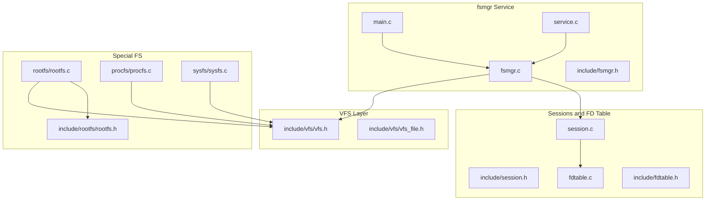
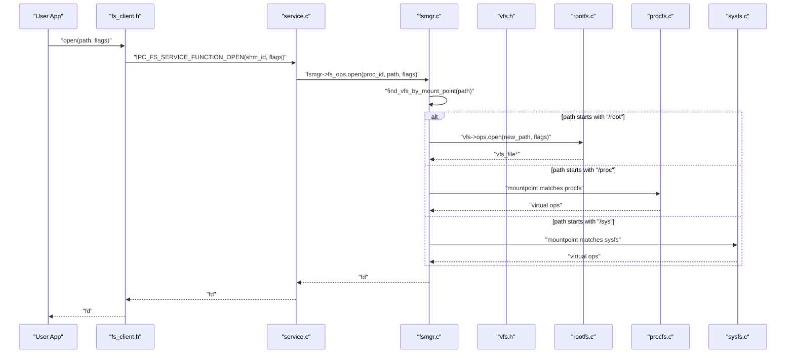
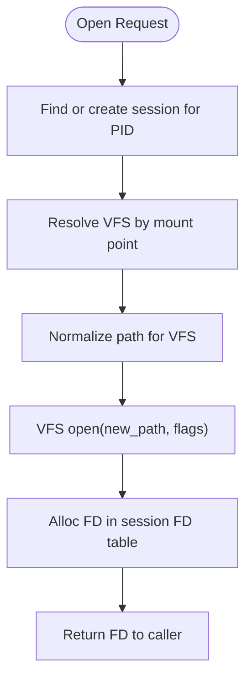
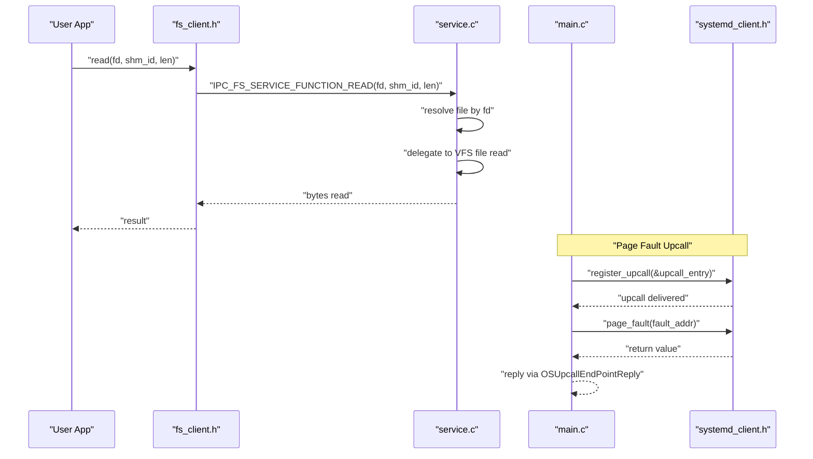
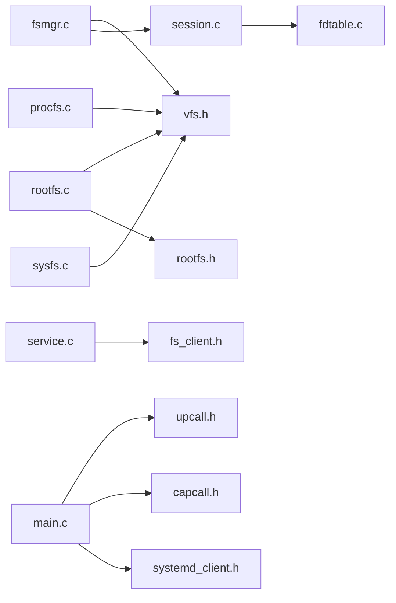
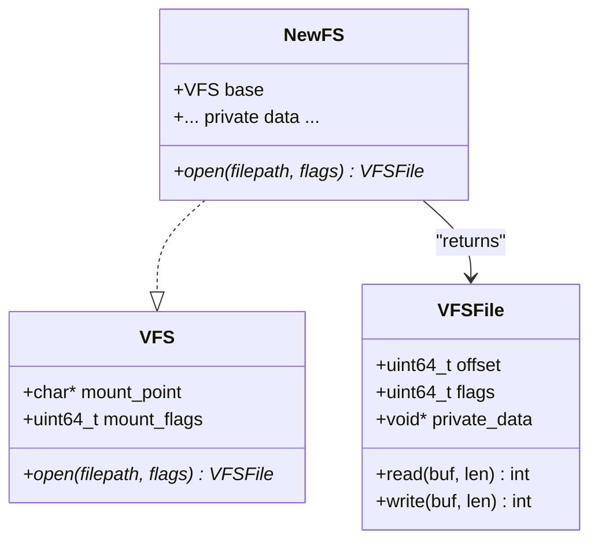

# File System Manager (fsmgr)

<cite>
**Referenced Files in This Document**
- [main.c](file://uapps/fsmgr/main.c)
- [service.c](file://uapps/fsmgr/service.c)
- [fsmgr.c](file://uapps/fsmgr/fsmgr.c)
- [fsmgr.h](file://uapps/fsmgr/include/fsmgr.h)
- [session.c](file://uapps/fsmgr/session.c)
- [session.h](file://uapps/fsmgr/include/session.h)
- [fdtable.c](file://uapps/fsmgr/fdtable.c)
- [fdtable.h](file://uapps/fsmgr/include/fdtable.h)
- [vfs.h](file://uapps/fsmgr/include/vfs/vfs.h)
- [vfs_file.h](file://uapps/fsmgr/include/vfs/vfs_file.h)
- [rootfs.c](file://uapps/fsmgr/rootfs/rootfs.c)
- [rootfs.h](file://uapps/fsmgr/include/rootfs/rootfs.h)
- [procfs.c](file://uapps/fsmgr/procfs/procfs.c)
- [sysfs.c](file://uapps/fsmgr/sysfs/sysfs.c)
- [fs_client.h](file://ulibs/include/libsystem/fs_client.h)
- [systemd_client.h](file://ulibs/include/libsystem/systemd_client.h)
- [capcall.h](file://ulibs/include/libkernel/capcall.h)
- [upcall.h](file://ulibs/include/libkernel/upcall.h)
</cite>

## Table of Contents
1. [Introduction](#introduction)
2. [Project Structure](#project-structure)
3. [Core Components](#core-components)
4. [Architecture Overview](#architecture-overview)
5. [Detailed Component Analysis](#detailed-component-analysis)
6. [Dependency Analysis](#dependency-analysis)
7. [Performance Considerations](#performance-considerations)
8. [Troubleshooting Guide](#troubleshooting-guide)
9. [Conclusion](#conclusion)
10. [Appendices](#appendices)

## Introduction
This document describes the File System Manager (fsmgr) service in TranquilOS. It explains how the virtual file system (VFS) routes requests to mounted file systems, how sessions and file descriptor tables manage per-process file access, and how special-purpose file systems (rootfs, procfs, sysfs) are integrated. It also covers service communication with the kernel’s memory manager via upcalls, and how the service integrates with user-space applications through the filesystem client API.

## Project Structure
The fsmgr service is organized around a central manager that mounts and dispatches to virtual file systems, a session subsystem that tracks per-process file descriptors, and specialized file systems for different purposes.

**Diagram sources**
- [main.c](file://uapps/fsmgr/main.c#L1-L38)
- [service.c](file://uapps/fsmgr/service.c#L1-L106)
- [fsmgr.c](file://uapps/fsmgr/fsmgr.c#L1-L216)
- [fsmgr.h](file://uapps/fsmgr/include/fsmgr.h#L1-L43)
- [session.c](file://uapps/fsmgr/session.c#L1-L112)
- [session.h](file://uapps/fsmgr/include/session.h#L1-L39)
- [fdtable.c](file://uapps/fsmgr/fdtable.c#L1-L96)
- [fdtable.h](file://uapps/fsmgr/include/fdtable.h#L1-L31)
- [vfs.h](file://uapps/fsmgr/include/vfs/vfs.h#L1-L21)
- [vfs_file.h](file://uapps/fsmgr/include/vfs/vfs_file.h#L1-L19)
- [rootfs.c](file://uapps/fsmgr/rootfs/rootfs.c#L1-L100)
- [rootfs.h](file://uapps/fsmgr/include/rootfs/rootfs.h#L1-L13)
- [procfs.c](file://uapps/fsmgr/procfs/procfs.c#L1-L28)
- [sysfs.c](file://uapps/fsmgr/sysfs/sysfs.c#L1-L28)

**Section sources**
- [main.c](file://uapps/fsmgr/main.c#L1-L38)
- [service.c](file://uapps/fsmgr/service.c#L1-L106)
- [fsmgr.c](file://uapps/fsmgr/fsmgr.c#L1-L216)
- [fsmgr.h](file://uapps/fsmgr/include/fsmgr.h#L1-L43)

## Core Components
- File System Manager (fsmgr): Central dispatcher that mounts VFS instances, resolves mount points, and delegates file operations to the appropriate VFS.
- Virtual File System (VFS): Abstraction over concrete file systems, exposing open/read/write/close semantics.
- Session Manager: Tracks per-process sessions and owns a file descriptor table.
- File Descriptor Table: Maps numeric file descriptors to VFS file handles.
- Special Purpose File Systems:
  - rootfs: Read-only filesystem backed by a CPIO archive.
  - procfs: Virtual filesystem for process-related information.
  - sysfs: Virtual filesystem for system information.

Key responsibilities:
- Mount resolution and delegation to VFS.
- Per-process session creation and lifecycle.
- FD allocation, lookup, and cleanup.
- Upcall handling for page faults via the kernel’s memory manager.
- IPC service entry for user-space file operations.

**Section sources**
- [fsmgr.c](file://uapps/fsmgr/fsmgr.c#L8-L28)
- [fsmgr.c](file://uapps/fsmgr/fsmgr.c#L30-L63)
- [fsmgr.c](file://uapps/fsmgr/fsmgr.c#L65-L108)
- [fsmgr.c](file://uapps/fsmgr/fsmgr.c#L110-L172)
- [fsmgr.c](file://uapps/fsmgr/fsmgr.c#L174-L190)
- [fsmgr.h](file://uapps/fsmgr/include/fsmgr.h#L13-L29)
- [vfs.h](file://uapps/fsmgr/include/vfs/vfs.h#L7-L10)
- [vfs_file.h](file://uapps/fsmgr/include/vfs/vfs_file.h#L4-L9)
- [session.c](file://uapps/fsmgr/session.c#L5-L33)
- [session.c](file://uapps/fsmgr/session.c#L62-L89)
- [fdtable.c](file://uapps/fsmgr/fdtable.c#L4-L30)
- [fdtable.c](file://uapps/fsmgr/fdtable.c#L32-L61)
- [fdtable.c](file://uapps/fsmgr/fdtable.c#L63-L83)
- [rootfs.c](file://uapps/fsmgr/rootfs/rootfs.c#L32-L63)
- [procfs.c](file://uapps/fsmgr/procfs/procfs.c#L12-L27)
- [sysfs.c](file://uapps/fsmgr/sysfs/sysfs.c#L12-L27)

## Architecture Overview
The fsmgr service initializes the core VFS, mounts rootfs from a CPIO image, and exposes procfs and sysfs. User-space applications communicate via an IPC endpoint to open, read, write, and close files. The service routes operations to the correct VFS based on the mount point and manages per-process sessions and FD tables.

**Diagram sources**
- [service.c](file://uapps/fsmgr/service.c#L9-L21)
- [service.c](file://uapps/fsmgr/service.c#L60-L100)
- [fsmgr.c](file://uapps/fsmgr/fsmgr.c#L65-L108)
- [fsmgr.c](file://uapps/fsmgr/fsmgr.c#L30-L63)
- [rootfs.c](file://uapps/fsmgr/rootfs/rootfs.c#L32-L63)
- [procfs.c](file://uapps/fsmgr/procfs/procfs.c#L12-L27)
- [sysfs.c](file://uapps/fsmgr/sysfs/sysfs.c#L12-L27)

## Detailed Component Analysis

### File System Manager (fsmgr)
Responsibilities:
- Mount multiple VFS instances and maintain a list.
- Resolve mount points to the correct VFS for a given path.
- Forward open/read/write/close to the VFS and manage per-process sessions and FD allocation.

Implementation highlights:
- Mounting appends VFS instances to a linked list under the manager.
- Path-to-VFS resolution compares the requested path prefix against each VFS mount point.
- Open operation derives a normalized path for the target VFS, opens a file handle, and allocates an FD in the session’s FD table.
- Read/write operations resolve the file handle from the FD table and delegate to the VFS file ops.
- Close frees the FD and associated resources.

**Diagram sources**
- [fsmgr.c](file://uapps/fsmgr/fsmgr.c#L65-L108)
- [session.c](file://uapps/fsmgr/session.c#L5-L33)
- [fdtable.c](file://uapps/fsmgr/fdtable.c#L4-L30)

**Section sources**
- [fsmgr.c](file://uapps/fsmgr/fsmgr.c#L8-L28)
- [fsmgr.c](file://uapps/fsmgr/fsmgr.c#L30-L63)
- [fsmgr.c](file://uapps/fsmgr/fsmgr.c#L65-L108)
- [fsmgr.c](file://uapps/fsmgr/fsmgr.c#L110-L172)
- [fsmgr.c](file://uapps/fsmgr/fsmgr.c#L174-L190)
- [fsmgr.h](file://uapps/fsmgr/include/fsmgr.h#L13-L29)

### Virtual File System (VFS) Abstractions
- VFS: Holds mount point, mount flags, and an open operation pointer.
- VFS File: Holds file offset, flags, private data, owning VFS, and read/write operation pointers.

Usage:
- Each concrete file system implements a VFS with an open function that returns a VFS file handle.
- The manager delegates read/write to the VFS file ops.

**Section sources**
- [vfs.h](file://uapps/fsmgr/include/vfs/vfs.h#L7-L10)
- [vfs_file.h](file://uapps/fsmgr/include/vfs/vfs_file.h#L4-L9)

### Session Management
- Session: Associates a process ID with an FD table and provides session ops.
- Session Manager: Creates, finds, and destroys sessions; maintains a linked list of sessions.

Behavior:
- On first access by a PID, a session is created and initialized with an FD table.
- FD table entries map numeric FDs to VFS file handles.

**Section sources**
- [session.c](file://uapps/fsmgr/session.c#L5-L33)
- [session.c](file://uapps/fsmgr/session.c#L62-L89)
- [session.h](file://uapps/fsmgr/include/session.h#L16-L21)
- [session.h](file://uapps/fsmgr/include/session.h#L23-L30)

### File Descriptor Table
- Maintains a singly linked list of entries keyed by FD.
- Supports allocating a new FD, freeing an FD, and finding a file by FD.
- On FD free, the underlying VFS file handle is freed and the entry removed.

**Section sources**
- [fdtable.c](file://uapps/fsmgr/fdtable.c#L4-L30)
- [fdtable.c](file://uapps/fsmgr/fdtable.c#L32-L61)
- [fdtable.c](file://uapps/fsmgr/fdtable.c#L63-L83)
- [fdtable.h](file://uapps/fsmgr/include/fdtable.h#L8-L12)
- [fdtable.h](file://uapps/fsmgr/include/fdtable.h#L14-L21)

### Root File System (rootfs)
- Mounted at “/root”.
- Backed by a CPIO archive; files are read-only.
- Open locates a file header in the CPIO image, allocates a VFS file handle, sets flags and offset, and assigns read/write ops.
- Read advances the file offset and copies data into the caller’s buffer.

Integration:
- Obtains the CPIO address from the device manager client.
- Registers itself with the manager during initialization.

**Section sources**
- [rootfs.c](file://uapps/fsmgr/rootfs/rootfs.c#L32-L63)
- [rootfs.c](file://uapps/fsmgr/rootfs/rootfs.c#L12-L24)
- [rootfs.c](file://uapps/fsmgr/rootfs/rootfs.c#L65-L73)
- [rootfs.c](file://uapps/fsmgr/rootfs/rootfs.c#L75-L99)
- [rootfs.h](file://uapps/fsmgr/include/rootfs/rootfs.h#L6-L9)

### Special Purpose File Systems (procfs, sysfs)
- Both are mounted with read-write permissions.
- They act as mount points for virtual information exposed by the kernel and services.

Initialization:
- Set mount points to “/proc” and “/sys” respectively.
- Register with the manager post-init.

**Section sources**
- [procfs.c](file://uapps/fsmgr/procfs/procfs.c#L12-L27)
- [sysfs.c](file://uapps/fsmgr/sysfs/sysfs.c#L12-L27)

### Service Communication and Upcall Handling
- IPC Endpoint: The service registers an endpoint for file operations and replies with results.
- Upcalls: The main entry registers an upcall handler that forwards page faults to the kernel’s memory manager via systemd client.
- User-space API: Applications use the filesystem client to send IPC messages to the service.

**Diagram sources**
- [service.c](file://uapps/fsmgr/service.c#L60-L100)
- [main.c](file://uapps/fsmgr/main.c#L10-L15)
- [main.c](file://uapps/fsmgr/main.c#L26-L29)
- [fs_client.h](file://ulibs/include/libsystem/fs_client.h)
- [systemd_client.h](file://ulibs/include/libsystem/systemd_client.h)
- [capcall.h](file://ulibs/include/libkernel/capcall.h)
- [upcall.h](file://ulibs/include/libkernel/upcall.h)

**Section sources**
- [service.c](file://uapps/fsmgr/service.c#L1-L106)
- [main.c](file://uapps/fsmgr/main.c#L10-L15)
- [main.c](file://uapps/fsmgr/main.c#L26-L29)

## Dependency Analysis
- fsmgr depends on VFS abstractions and session/FD table modules.
- rootfs depends on CPIO parsing and device manager client.
- procfs/sysfs depend on the manager for mounting.
- service depends on the filesystem client and IPC endpoint registration.
- main depends on upcall registration and systemd client.

**Diagram sources**
- [fsmgr.c](file://uapps/fsmgr/fsmgr.c#L1-L216)
- [session.c](file://uapps/fsmgr/session.c#L1-L112)
- [fdtable.c](file://uapps/fsmgr/fdtable.c#L1-L96)
- [rootfs.c](file://uapps/fsmgr/rootfs/rootfs.c#L1-L100)
- [rootfs.h](file://uapps/fsmgr/include/rootfs/rootfs.h#L1-L13)
- [procfs.c](file://uapps/fsmgr/procfs/procfs.c#L1-L28)
- [sysfs.c](file://uapps/fsmgr/sysfs/sysfs.c#L1-L28)
- [service.c](file://uapps/fsmgr/service.c#L1-L106)
- [fs_client.h](file://ulibs/include/libsystem/fs_client.h)
- [main.c](file://uapps/fsmgr/main.c#L1-L38)
- [upcall.h](file://ulibs/include/libkernel/upcall.h)
- [capcall.h](file://ulibs/include/libkernel/capcall.h)
- [systemd_client.h](file://ulibs/include/libsystem/systemd_client.h)

**Section sources**
- [fsmgr.c](file://uapps/fsmgr/fsmgr.c#L1-L216)
- [session.c](file://uapps/fsmgr/session.c#L1-L112)
- [fdtable.c](file://uapps/fsmgr/fdtable.c#L1-L96)
- [rootfs.c](file://uapps/fsmgr/rootfs/rootfs.c#L1-L100)
- [procfs.c](file://uapps/fsmgr/procfs/procfs.c#L1-L28)
- [sysfs.c](file://uapps/fsmgr/sysfs/sysfs.c#L1-L28)
- [service.c](file://uapps/fsmgr/service.c#L1-L106)
- [main.c](file://uapps/fsmgr/main.c#L1-L38)

## Performance Considerations
- Mount point resolution iterates the VFS list; keep the number of mounted file systems minimal to reduce overhead.
- FD table operations traverse a linked list; consider optimizing to O(1) lookup if scalability becomes an issue.
- rootfs read operations copy data into user buffers; ensure buffers are appropriately sized to avoid repeated reads.
- Upcalls should be handled quickly to minimize latency; offload heavy work where possible.

[No sources needed since this section provides general guidance]

## Troubleshooting Guide
Common issues and diagnostics:
- No VFS found for path: Verify mount points and that the correct VFS is registered.
- Session not found: Ensure the process PID is valid and that the session was created on first access.
- FD not found: Confirm the FD exists in the current session’s FD table and has not been closed.
- rootfs read-only: rootfs does not support writes; use another VFS for writable operations.
- Upcall failures: Check upcall registration and systemd client availability.

**Section sources**
- [fsmgr.c](file://uapps/fsmgr/fsmgr.c#L41-L62)
- [session.c](file://uapps/fsmgr/session.c#L5-L33)
- [fdtable.c](file://uapps/fsmgr/fdtable.c#L32-L61)
- [rootfs.c](file://uapps/fsmgr/rootfs/rootfs.c#L26-L30)
- [main.c](file://uapps/fsmgr/main.c#L10-L15)

## Conclusion
The fsmgr service provides a clean separation between VFS abstractions and concrete file systems, with robust session and FD management. It integrates tightly with the kernel’s memory manager via upcalls and offers a straightforward IPC interface for user-space applications. Special-purpose file systems (rootfs, procfs, sysfs) demonstrate how to extend the system with new virtual file systems and custom file operations.

[No sources needed since this section summarizes without analyzing specific files]

## Appendices

### Example Workflows

- Open a file in rootfs:
  - Path: “/root/path/to/file”
  - Mount point: “/root”
  - Normalized path passed to rootfs open
  - Returns a VFS file handle stored in the session’s FD table

- Read from a file:
  - Lookup VFS file by FD in the session
  - Delegate read to VFS file ops
  - Advance file offset and return bytes read

- Close a file:
  - Free FD and underlying VFS file handle

**Section sources**
- [fsmgr.c](file://uapps/fsmgr/fsmgr.c#L65-L108)
- [fsmgr.c](file://uapps/fsmgr/fsmgr.c#L110-L172)
- [fsmgr.c](file://uapps/fsmgr/fsmgr.c#L174-L190)
- [fdtable.c](file://uapps/fsmgr/fdtable.c#L32-L61)

### Extending with New Virtual File Systems
Steps to add a new VFS:
- Define a struct embedding the VFS base and any private data.
- Implement VFS open returning a VFS file handle with read/write ops.
- Initialize mount point and ops.
- Register with the manager via mount.

**Diagram sources**
- [vfs.h](file://uapps/fsmgr/include/vfs/vfs.h#L12-L19)
- [vfs_file.h](file://uapps/fsmgr/include/vfs/vfs_file.h#L11-L17)
- [rootfs.c](file://uapps/fsmgr/rootfs/rootfs.c#L32-L63)