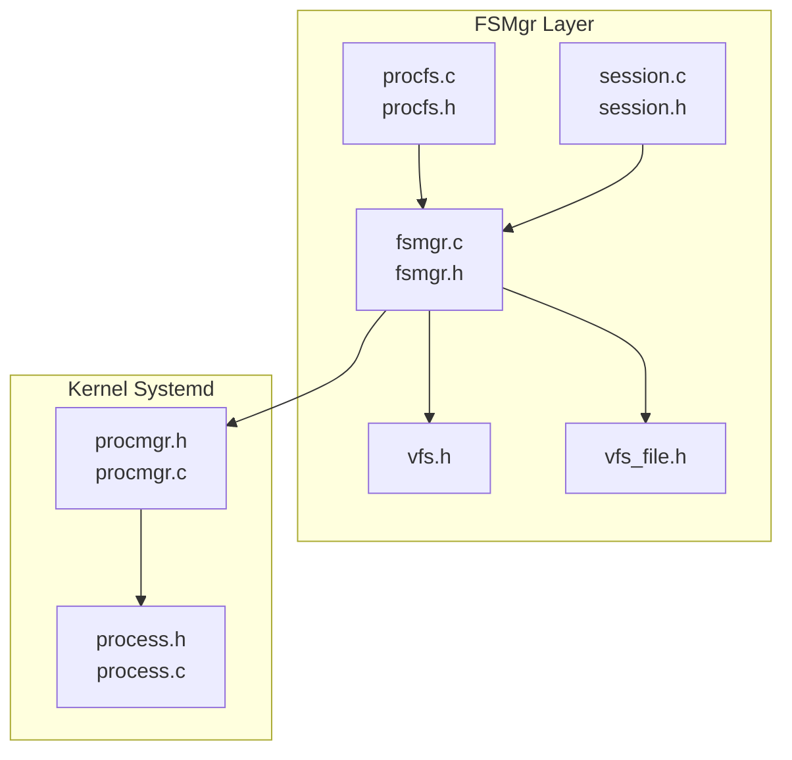
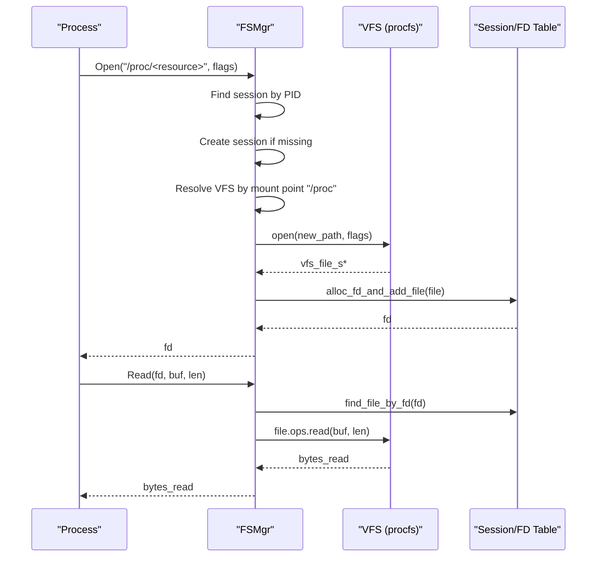
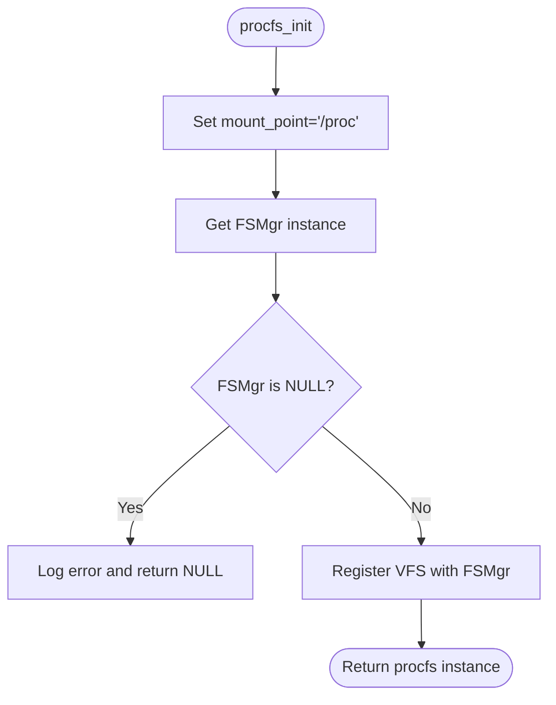
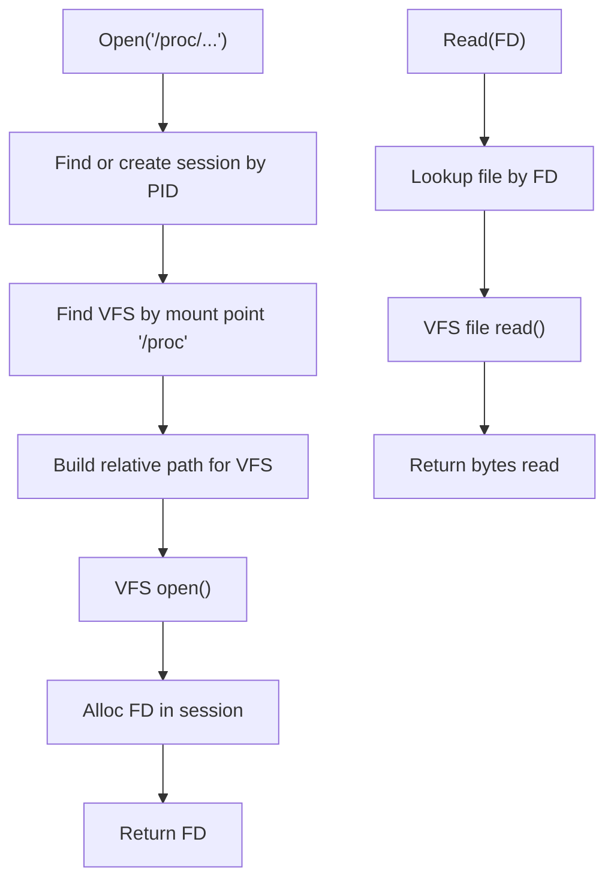
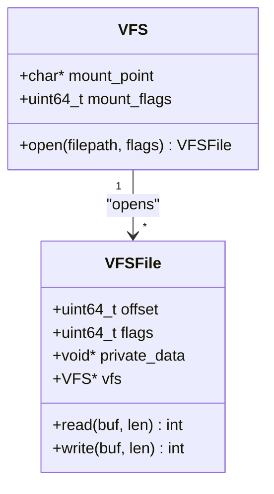
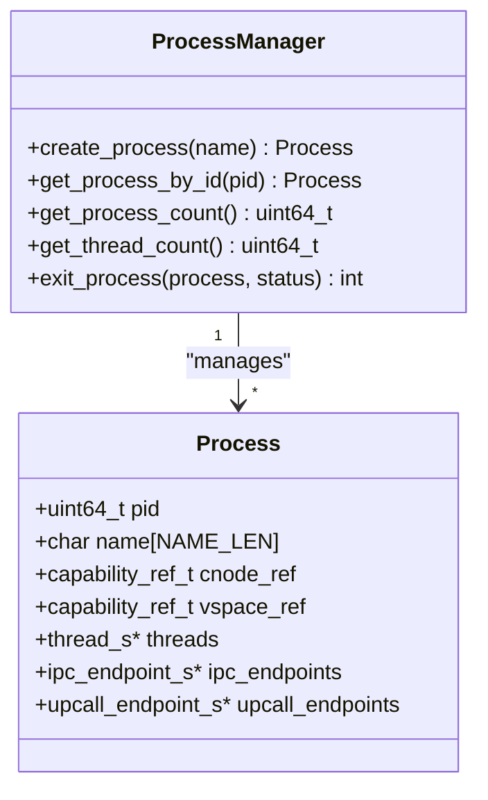
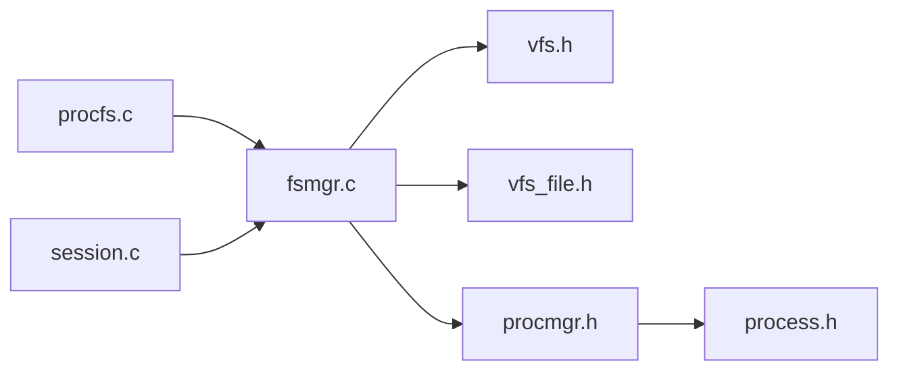

# Process File System (procfs)

<cite>
**Referenced Files in This Document**
- [procfs.c](file://uapps/fsmgr/procfs/procfs.c)
- [procfs.h](file://uapps/fsmgr/include/procfs/procfs.h)
- [fsmgr.c](file://uapps/fsmgr/fsmgr.c)
- [fsmgr.h](file://uapps/fsmgr/include/fsmgr.h)
- [vfs.h](file://uapps/fsmgr/include/vfs/vfs.h)
- [vfs_file.h](file://uapps/fsmgr/include/vfs/vfs_file.h)
- [session.c](file://uapps/fsmgr/session.c)
- [session.h](file://uapps/fsmgr/include/session.h)
- [procmgr.h](file://kernel/systemd/include/procmgr/procmgr.h)
- [process.h](file://kernel/systemd/include/procmgr/process.h)
- [procmgr.c](file://kernel/systemd/procmgr/procmgr.c)
- [process.c](file://kernel/systemd/procmgr/process.c)
</cite>

## Table of Contents
1. [Introduction](#introduction)
2. [Project Structure](#project-structure)
3. [Core Components](#core-components)
4. [Architecture Overview](#architecture-overview)
5. [Detailed Component Analysis](#detailed-component-analysis)
6. [Dependency Analysis](#dependency-analysis)
7. [Performance Considerations](#performance-considerations)
8. [Troubleshooting Guide](#troubleshooting-guide)
9. [Conclusion](#conclusion)

## Introduction
This document describes the Process File System (procfs) implementation in TranquilOS. It explains how procfs exposes runtime process and system information via a virtual file system mounted under the standard "/proc" path. The implementation integrates with the kernel’s process management subsystem and the File System Manager (FSMgr) to provide per-process file descriptors and controlled access to virtual files. While the current codebase mounts the procfs VFS instance, the actual dynamic file generation and process-specific content are not implemented yet. This document outlines the planned structure, integration points, and operational model for procfs so that future development can align with the existing VFS and process management abstractions.

## Project Structure
The procfs implementation resides in the File System Manager (FSMgr) layer and interacts with the Virtual File System (VFS) and process management components. The following diagram shows the relevant parts of the codebase involved in procfs.

**Diagram sources**
- [procfs.c](file://uapps/fsmgr/procfs/procfs.c#L1-L28)
- [procfs.h](file://uapps/fsmgr/include/procfs/procfs.h#L1-L12)
- [fsmgr.c](file://uapps/fsmgr/fsmgr.c#L1-L216)
- [fsmgr.h](file://uapps/fsmgr/include/fsmgr.h#L1-L43)
- [session.c](file://uapps/fsmgr/session.c#L1-L112)
- [session.h](file://uapps/fsmgr/include/session.h#L1-L39)
- [vfs.h](file://uapps/fsmgr/include/vfs/vfs.h#L1-L21)
- [vfs_file.h](file://uapps/fsmgr/include/vfs/vfs_file.h#L1-L19)
- [procmgr.h](file://kernel/systemd/include/procmgr/procmgr.h#L1-L32)
- [process.h](file://kernel/systemd/include/procmgr/process.h#L62-L97)
- [procmgr.c](file://kernel/systemd/procmgr/procmgr.c#L36-L143)
- [process.c](file://kernel/systemd/procmgr/process.c#L239-L273)

**Section sources**
- [procfs.c](file://uapps/fsmgr/procfs/procfs.c#L1-L28)
- [fsmgr.c](file://uapps/fsmgr/fsmgr.c#L1-L216)
- [session.c](file://uapps/fsmgr/session.c#L1-L112)
- [vfs.h](file://uapps/fsmgr/include/vfs/vfs.h#L1-L21)
- [vfs_file.h](file://uapps/fsmgr/include/vfs/vfs_file.h#L1-L19)
- [procmgr.h](file://kernel/systemd/include/procmgr/procmgr.h#L1-L32)
- [process.h](file://kernel/systemd/include/procmgr/process.h#L62-L97)

## Core Components
- procfs: A minimal VFS instance representing the procfs, mounted at "/proc". It currently only sets the mount point and delegates file operations to the underlying VFS implementation.
- FSMgr: The File System Manager that registers VFS instances, resolves mount points, and mediates file open/read/write/close operations on behalf of processes.
- Session and FD table: Per-process sessions maintain file descriptors for opened files, enabling safe and isolated access to VFS-backed files.
- VFS and VFS File: Generic VFS abstractions that define mount points, open operations, and file read/write callbacks.
- Process Management: Kernel-side process manager and process structures that provide identity and lifecycle information used by higher-level services.

Key responsibilities:
- Mounting procfs at "/proc" during initialization.
- Resolving requested paths to the appropriate VFS instance.
- Creating per-process sessions and allocating file descriptors.
- Delegating read/write operations to VFS file handlers.

**Section sources**
- [procfs.c](file://uapps/fsmgr/procfs/procfs.c#L10-L28)
- [procfs.h](file://uapps/fsmgr/include/procfs/procfs.h#L6-L8)
- [fsmgr.c](file://uapps/fsmgr/fsmgr.c#L65-L108)
- [session.c](file://uapps/fsmgr/session.c#L62-L89)
- [vfs.h](file://uapps/fsmgr/include/vfs/vfs.h#L12-L19)
- [vfs_file.h](file://uapps/fsmgr/include/vfs/vfs_file.h#L11-L17)
- [procmgr.h](file://kernel/systemd/include/procmgr/procmgr.h#L22-L26)
- [process.h](file://kernel/systemd/include/procmgr/process.h#L77-L93)

## Architecture Overview
The procfs architecture follows a layered design:
- procfs is a VFS instance registered with FSMgr.
- When a process requests a file under "/proc", FSMgr locates the matching VFS by mount point, translates the path, and invokes the VFS open operation.
- A per-process session is created or reused; the returned file is associated with a file descriptor allocated in the session’s FD table.
- Read/write operations are dispatched to the VFS file handler bound to the file.

**Diagram sources**
- [fsmgr.c](file://uapps/fsmgr/fsmgr.c#L65-L108)
- [session.c](file://uapps/fsmgr/session.c#L35-L60)
- [vfs_file.h](file://uapps/fsmgr/include/vfs/vfs_file.h#L4-L8)
- [procfs.c](file://uapps/fsmgr/procfs/procfs.c#L12-L28)

## Detailed Component Analysis

### procfs Initialization and Mounting
- Sets the mount point to "/proc".
- Obtains the FSMgr singleton and registers the procfs VFS instance with read/write permissions.
- Returns a pointer to the procfs instance for potential further configuration.

**Diagram sources**
- [procfs.c](file://uapps/fsmgr/procfs/procfs.c#L12-L28)

**Section sources**
- [procfs.c](file://uapps/fsmgr/procfs/procfs.c#L12-L28)
- [procfs.h](file://uapps/fsmgr/include/procfs/procfs.h#L6-L8)

### FSMgr Path Resolution and File Operations
- Path resolution: Given "/proc/<path>", FSMgr finds the VFS mounted at "/proc", strips the mount prefix, and constructs a relative path for the VFS open call.
- Session management: Ensures a session exists for the requesting process PID; creates one if absent.
- File descriptor allocation: Allocates a new FD in the session and associates it with the opened file.
- Read/Write dispatch: Looks up the file by FD and calls the VFS file handler.

**Diagram sources**
- [fsmgr.c](file://uapps/fsmgr/fsmgr.c#L65-L108)
- [fsmgr.c](file://uapps/fsmgr/fsmgr.c#L110-L140)
- [session.c](file://uapps/fsmgr/session.c#L53-L60)

**Section sources**
- [fsmgr.c](file://uapps/fsmgr/fsmgr.c#L30-L63)
- [fsmgr.c](file://uapps/fsmgr/fsmgr.c#L65-L108)
- [fsmgr.c](file://uapps/fsmgr/fsmgr.c#L110-L140)
- [session.c](file://uapps/fsmgr/session.c#L5-L33)
- [session.c](file://uapps/fsmgr/session.c#L62-L89)

### VFS Abstractions
- VFS: Represents a mounted file system with a mount point, flags, and an open operation.
- VFS File: Represents an open file handle with offset, flags, private data, and read/write callbacks.

**Diagram sources**
- [vfs.h](file://uapps/fsmgr/include/vfs/vfs.h#L12-L19)
- [vfs_file.h](file://uapps/fsmgr/include/vfs/vfs_file.h#L11-L17)

**Section sources**
- [vfs.h](file://uapps/fsmgr/include/vfs/vfs.h#L7-L19)
- [vfs_file.h](file://uapps/fsmgr/include/vfs/vfs_file.h#L4-L18)

### Process Management Integration
- Process identities and counts are managed by the kernel’s process manager.
- procfs can leverage these structures to expose process-specific information (e.g., per-PID directories) in future implementations.
- The process structure includes fields such as PID, name, and lists of threads/endpoints, which can inform virtual file content.

**Diagram sources**
- [procmgr.h](file://kernel/systemd/include/procmgr/procmgr.h#L22-L26)
- [process.h](file://kernel/systemd/include/procmgr/process.h#L77-L93)
- [procmgr.c](file://kernel/systemd/procmgr/procmgr.c#L36-L72)
- [process.c](file://kernel/systemd/procmgr/process.c#L239-L273)

**Section sources**
- [procmgr.h](file://kernel/systemd/include/procmgr/procmgr.h#L11-L26)
- [process.h](file://kernel/systemd/include/procmgr/process.h#L77-L93)
- [procmgr.c](file://kernel/systemd/procmgr/procmgr.c#L74-L82)
- [process.c](file://kernel/systemd/procmgr/process.c#L257-L273)

## Dependency Analysis
- procfs depends on VFS and FSMgr to integrate with the broader file system framework.
- FSMgr depends on VFS abstractions and session management to route operations.
- Session/FD table depends on VFS file handles to track open files per process.
- Process management provides the identity and lifecycle context that procfs can use to expose process-related information.

**Diagram sources**
- [procfs.c](file://uapps/fsmgr/procfs/procfs.c#L1-L28)
- [fsmgr.c](file://uapps/fsmgr/fsmgr.c#L1-L216)
- [session.c](file://uapps/fsmgr/session.c#L1-L112)
- [vfs.h](file://uapps/fsmgr/include/vfs/vfs.h#L1-L21)
- [vfs_file.h](file://uapps/fsmgr/include/vfs/vfs_file.h#L1-L19)
- [procmgr.h](file://kernel/systemd/include/procmgr/procmgr.h#L1-L32)
- [process.h](file://kernel/systemd/include/procmgr/process.h#L1-L97)

**Section sources**
- [procfs.c](file://uapps/fsmgr/procfs/procfs.c#L1-L28)
- [fsmgr.c](file://uapps/fsmgr/fsmgr.c#L1-L216)
- [session.c](file://uapps/fsmgr/session.c#L1-L112)
- [vfs.h](file://uapps/fsmgr/include/vfs/vfs.h#L1-L21)
- [vfs_file.h](file://uapps/fsmgr/include/vfs/vfs_file.h#L1-L19)
- [procmgr.h](file://kernel/systemd/include/procmgr/procmgr.h#L1-L32)
- [process.h](file://kernel/systemd/include/procmgr/process.h#L1-L97)

## Performance Considerations
- Path resolution overhead: Each open operation involves mount-point lookup and path translation; caching resolved VFS pointers could reduce repeated string comparisons.
- Session creation: Creating a session per PID on first access adds overhead; consider lazy initialization and reuse policies.
- FD allocation: Per-operation FD allocation is straightforward but can be optimized with small-object pooling if contention arises.
- VFS open/read/write: The current design delegates to VFS handlers; ensure that VFS implementations avoid heavy synchronization and minimize memory copies.

[No sources needed since this section provides general guidance]

## Troubleshooting Guide
Common issues and diagnostics:
- procfs_init returns NULL: Indicates FSMgr is unavailable; verify FSMgr initialization order and logging output.
- VFS not found for path: The requested path does not match any mounted VFS; confirm the mount point and path prefix.
- Session not found: No session exists for the given PID; ensure the process has performed an initial open or that sessions are created lazily.
- File not found after open: The VFS open returned NULL; check the translated relative path and VFS implementation.
- Read/Write failures: Negative return values indicate errors; inspect VFS file handler implementations and buffer sizes.

Operational checks:
- Verify "/proc" mount registration during procfs_init.
- Confirm path translation logic in FSMgr for "/proc" paths.
- Validate session allocation and FD assignment.
- Ensure VFS file handlers are properly bound to opened files.

**Section sources**
- [procfs.c](file://uapps/fsmgr/procfs/procfs.c#L17-L21)
- [fsmgr.c](file://uapps/fsmgr/fsmgr.c#L82-L98)
- [session.c](file://uapps/fsmgr/session.c#L72-L76)
- [fsmgr.c](file://uapps/fsmgr/fsmgr.c#L133-L137)

## Conclusion
The procfs implementation in TranquilOS establishes the foundation for exposing runtime process and system information through a virtual file system mounted at "/proc". It integrates tightly with FSMgr, VFS, and session management to provide per-process file descriptors and controlled access. While the current codebase mounts the VFS instance, dynamic file generation and process-specific content are not yet implemented. Future work should focus on implementing VFS file handlers for "/proc" entries, leveraging kernel process management structures to populate real-time data, and enforcing appropriate security and access controls.