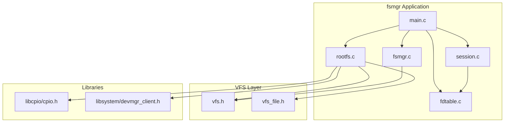
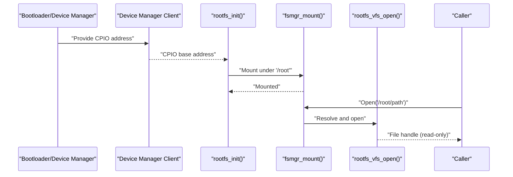
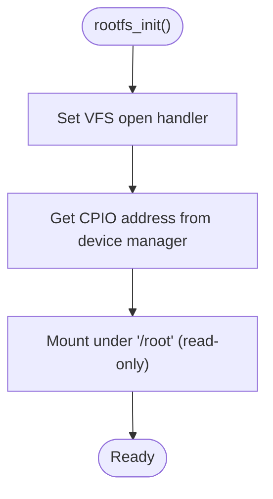
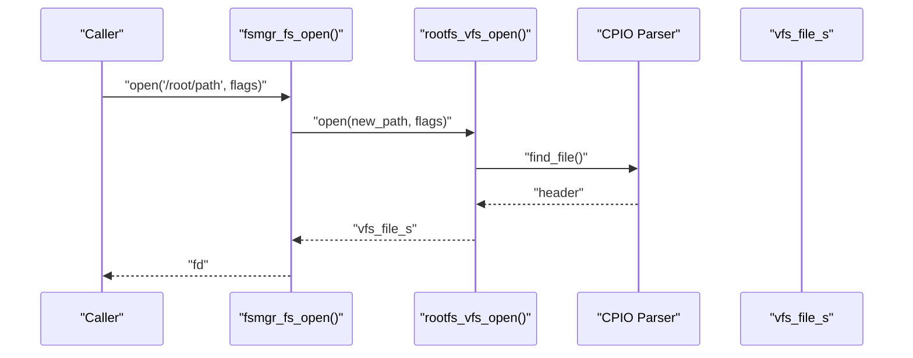
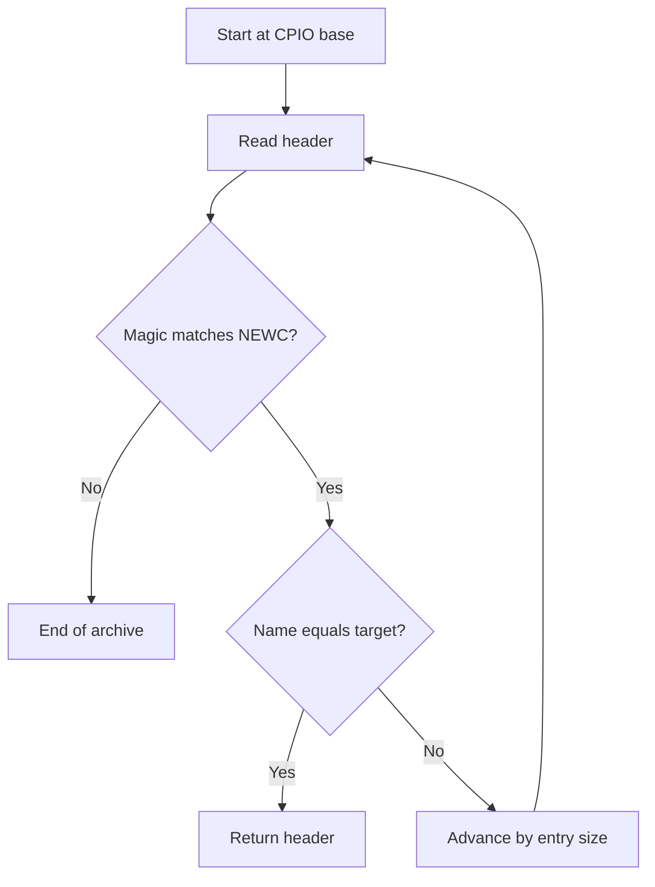
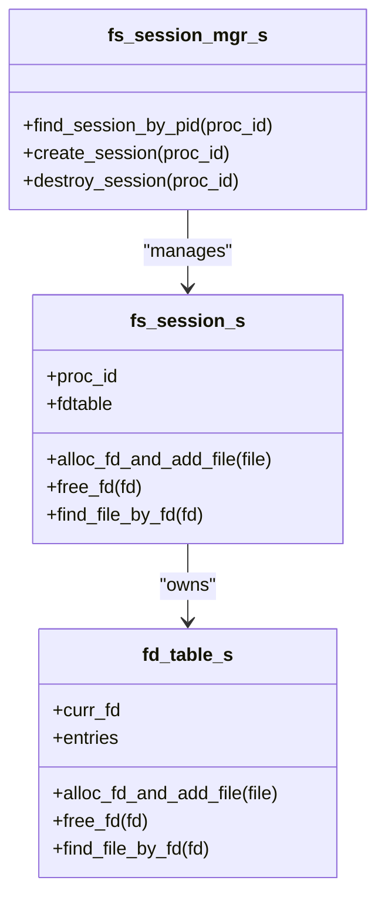
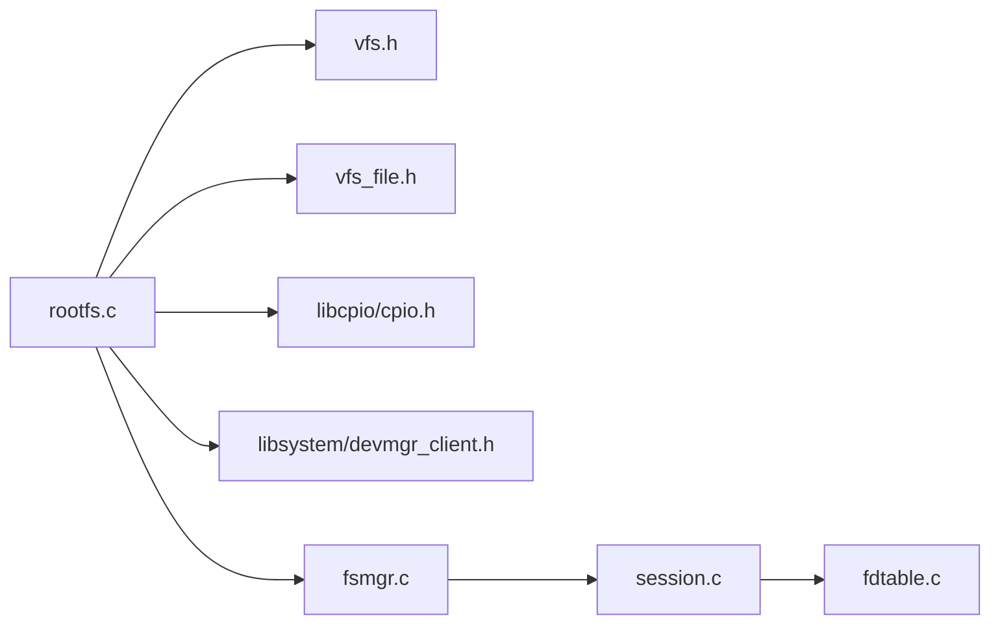

# Root File System (rootfs)

<cite>
**Referenced Files in This Document**
- [rootfs.c](file://uapps/fsmgr/rootfs/rootfs.c)
- [rootfs.h](file://uapps/fsmgr/include/rootfs/rootfs.h)
- [vfs.h](file://uapps/fsmgr/include/vfs/vfs.h)
- [vfs_file.h](file://uapps/fsmgr/include/vfs/vfs_file.h)
- [fsmgr.h](file://uapps/fsmgr/include/fsmgr.h)
- [fsmgr.c](file://uapps/fsmgr/fsmgr.c)
- [cpio.h](file://ulibs/include/libcpio/cpio.h)
- [devmgr_client.h](file://ulibs/include/libsystem/devmgr_client.h)
- [main.c](file://uapps/fsmgr/main.c)
- [session.h](file://uapps/fsmgr/include/session.h)
- [session.c](file://uapps/fsmgr/session.c)
- [fdtable.c](file://uapps/fsmgr/fdtable.c)
</cite>

## Table of Contents
1. [Introduction](#introduction)
2. [Project Structure](#project-structure)
3. [Core Components](#core-components)
4. [Architecture Overview](#architecture-overview)
5. [Detailed Component Analysis](#detailed-component-analysis)
6. [Dependency Analysis](#dependency-analysis)
7. [Performance Considerations](#performance-considerations)
8. [Security Considerations](#security-considerations)
9. [Troubleshooting Guide](#troubleshooting-guide)
10. [Conclusion](#conclusion)
11. [Appendices](#appendices)

## Introduction
This document explains the Root File System (rootfs) implementation in TranquilOS. It covers the rootfs structure, initialization, integration with the Virtual File System (VFS) layer, mount point configuration, and file operations. It also documents usage patterns, directory traversal, file creation/deletion semantics, metadata management, configuration options, performance optimization techniques, and security considerations.

## Project Structure
The rootfs implementation resides in the Filesystem Manager (fsmgr) application and integrates with shared VFS abstractions and libraries:
- Rootfs core: [rootfs.c](file://uapps/fsmgr/rootfs/rootfs.c), [rootfs.h](file://uapps/fsmgr/include/rootfs/rootfs.h)
- VFS abstractions: [vfs.h](file://uapps/fsmgr/include/vfs/vfs.h), [vfs_file.h](file://uapps/fsmgr/include/vfs/vfs_file.h)
- Filesystem manager: [fsmgr.h](file://uapps/fsmgr/include/fsmgr.h), [fsmgr.c](file://uapps/fsmgr/fsmgr.c)
- CPIO utilities: [cpio.h](file://ulibs/include/libcpio/cpio.h)
- Device manager client: [devmgr_client.h](file://ulibs/include/libsystem/devmgr_client.h)
- Session and FD table: [session.h](file://uapps/fsmgr/include/session.h), [session.c](file://uapps/fsmgr/session.c), [fdtable.c](file://uapps/fsmgr/fdtable.c)
- Application entrypoint: [main.c](file://uapps/fsmgr/main.c)

**Diagram sources**
- [main.c](file://uapps/fsmgr/main.c#L17-L37)
- [rootfs.c](file://uapps/fsmgr/rootfs/rootfs.c#L75-L100)
- [fsmgr.c](file://uapps/fsmgr/fsmgr.c#L192-L216)
- [session.c](file://uapps/fsmgr/session.c#L102-L112)
- [fdtable.c](file://uapps/fsmgr/fdtable.c#L85-L96)
- [vfs.h](file://uapps/fsmgr/include/vfs/vfs.h#L12-L19)
- [vfs_file.h](file://uapps/fsmgr/include/vfs/vfs_file.h#L11-L17)
- [cpio.h](file://ulibs/include/libcpio/cpio.h#L41-L86)
- [devmgr_client.h](file://ulibs/include/libsystem/devmgr_client.h#L36-L42)

**Section sources**
- [main.c](file://uapps/fsmgr/main.c#L17-L37)
- [rootfs.h](file://uapps/fsmgr/include/rootfs/rootfs.h#L6-L9)
- [vfs.h](file://uapps/fsmgr/include/vfs/vfs.h#L12-L19)
- [vfs_file.h](file://uapps/fsmgr/include/vfs/vfs_file.h#L11-L17)
- [fsmgr.h](file://uapps/fsmgr/include/fsmgr.h#L31-L37)
- [cpio.h](file://ulibs/include/libcpio/cpio.h#L41-L86)
- [devmgr_client.h](file://ulibs/include/libsystem/devmgr_client.h#L36-L42)

## Core Components
- rootfs_s: Encapsulates the VFS interface and the base address of the embedded CPIO archive.
- VFS layer: Provides mountable filesystem abstraction with open operations and per-file descriptors.
- CPIO utilities: Parse and traverse the embedded archive to locate files by name.
- Device manager client: Supplies the physical address of the CPIO image in memory.
- Filesystem manager: Mounts rootfs under a mount point and dispatches file operations.
- Session and FD table: Manage per-process file descriptors and file handles.

Key responsibilities:
- rootfs_init(): Initializes rootfs, obtains CPIO address from device manager, mounts under "/root", and registers VFS open handler.
- rootfs_vfs_open(): Resolves a path within the CPIO archive and returns a VFS file handle.
- rootfs_file_read(): Reads from the CPIO-backed file region.
- rootfs_file_write(): Rejects writes (read-only).
- fsmgr_mount(): Registers a VFS instance into the global VFS chain.
- fsmgr_find_vfs_by_mount_point(): Selects the appropriate VFS for a given path prefix.
- Session/FD table: Allocates and manages file descriptors for opened files.

**Section sources**
- [rootfs.h](file://uapps/fsmgr/include/rootfs/rootfs.h#L6-L9)
- [rootfs.c](file://uapps/fsmgr/rootfs/rootfs.c#L75-L100)
- [vfs.h](file://uapps/fsmgr/include/vfs/vfs.h#L12-L19)
- [vfs_file.h](file://uapps/fsmgr/include/vfs/vfs_file.h#L11-L17)
- [fsmgr.c](file://uapps/fsmgr/fsmgr.c#L8-L28)
- [fsmgr.c](file://uapps/fsmgr/fsmgr.c#L30-L63)
- [session.h](file://uapps/fsmgr/include/session.h#L16-L21)
- [fdtable.c](file://uapps/fsmgr/fdtable.c#L4-L30)

## Architecture Overview
The rootfs is a read-only filesystem backed by an embedded CPIO archive. On boot, the device manager provides the memory address of the CPIO image. The rootfs initializes, mounts itself under "/root", and exposes a VFS open operation. Userspace or other kernel services can open files via the filesystem manager, which resolves the mount point and delegates to rootfs.

**Diagram sources**
- [rootfs.c](file://uapps/fsmgr/rootfs/rootfs.c#L75-L100)
- [fsmgr.c](file://uapps/fsmgr/fsmgr.c#L8-L28)
- [devmgr_client.h](file://ulibs/include/libsystem/devmgr_client.h#L30-L34)

## Detailed Component Analysis

### Rootfs Initialization and Mount Point
- Mount point: "/root"
- Flags: Read-only mount
- Initialization steps:
  - Set VFS open handler
  - Obtain CPIO address from device manager
  - Register with the filesystem manager

**Diagram sources**
- [rootfs.c](file://uapps/fsmgr/rootfs/rootfs.c#L75-L100)
- [fsmgr.h](file://uapps/fsmgr/include/fsmgr.h#L8-L11)

**Section sources**
- [rootfs.c](file://uapps/fsmgr/rootfs/rootfs.c#L75-L100)
- [fsmgr.h](file://uapps/fsmgr/include/fsmgr.h#L8-L11)

### VFS Integration and File Operations
- VFS open: Delegates to rootfs_vfs_open(), which locates the file in the CPIO archive and returns a VFS file handle.
- File read: Copies data from the CPIO-backed region into caller buffer, advancing the file offset.
- File write: Always fails with read-only error.

**Diagram sources**
- [fsmgr.c](file://uapps/fsmgr/fsmgr.c#L65-L108)
- [rootfs.c](file://uapps/fsmgr/rootfs/rootfs.c#L32-L63)
- [cpio.h](file://ulibs/include/libcpio/cpio.h#L69-L86)

**Section sources**
- [rootfs.c](file://uapps/fsmgr/rootfs/rootfs.c#L12-L30)
- [rootfs.c](file://uapps/fsmgr/rootfs/rootfs.c#L32-L63)
- [vfs_file.h](file://uapps/fsmgr/include/vfs/vfs_file.h#L11-L17)

### Directory Traversal and Metadata Management
- Directory traversal is implicit: rootfs does not expose directory entries; it only supports opening files by exact path.
- Metadata:
  - File size and data address are derived from CPIO headers.
  - File offsets are tracked per VFS file handle.
  - No directory entries or inode structures are maintained.

**Diagram sources**
- [cpio.h](file://ulibs/include/libcpio/cpio.h#L41-L86)

**Section sources**
- [cpio.h](file://ulibs/include/libcpio/cpio.h#L27-L86)
- [rootfs.c](file://uapps/fsmgr/rootfs/rootfs.c#L12-L24)

### File Creation and Deletion Semantics
- Creation: Not supported. The rootfs is read-only.
- Deletion: Not applicable. The CPIO archive is static.

**Section sources**
- [rootfs.c](file://uapps/fsmgr/rootfs/rootfs.c#L26-L30)

### Session and File Descriptor Management
- Per-process sessions are created on demand.
- Opening a file returns a file descriptor bound to the session.
- Reading/writing uses the file handle stored in the session’s FD table.
- Closing frees the file handle and removes the entry.

**Diagram sources**
- [session.h](file://uapps/fsmgr/include/session.h#L16-L35)
- [session.c](file://uapps/fsmgr/session.c#L62-L89)
- [fdtable.c](file://uapps/fsmgr/fdtable.c#L4-L30)

**Section sources**
- [session.c](file://uapps/fsmgr/session.c#L5-L60)
- [fdtable.c](file://uapps/fsmgr/fdtable.c#L4-L30)

## Dependency Analysis
- rootfs depends on:
  - VFS abstractions for mountable filesystem interface
  - CPIO parser for locating files by name
  - Device manager client for CPIO address retrieval
  - Filesystem manager for mounting and path resolution
  - Session and FD table for per-process file lifecycle

**Diagram sources**
- [rootfs.c](file://uapps/fsmgr/rootfs/rootfs.c#L1-L10)
- [vfs.h](file://uapps/fsmgr/include/vfs/vfs.h#L4-L6)
- [vfs_file.h](file://uapps/fsmgr/include/vfs/vfs_file.h#L4-L6)
- [cpio.h](file://ulibs/include/libcpio/cpio.h#L1-L2)
- [devmgr_client.h](file://ulibs/include/libsystem/devmgr_client.h#L1-L6)
- [fsmgr.c](file://uapps/fsmgr/fsmgr.c#L1-L5)
- [session.c](file://uapps/fsmgr/session.c#L1-L4)
- [fdtable.c](file://uapps/fsmgr/fdtable.c#L1-L3)

**Section sources**
- [rootfs.c](file://uapps/fsmgr/rootfs/rootfs.c#L1-L10)
- [fsmgr.c](file://uapps/fsmgr/fsmgr.c#L1-L5)

## Performance Considerations
- Read-only design: Eliminates write overhead and simplifies synchronization.
- Single-pass CPIO traversal: Locate files by scanning the archive sequentially; consider pre-indexing for large archives if needed.
- Offset tracking: Per-handle offsets avoid redundant seeks and support streaming reads.
- Mount point prefix matching: O(n) selection across mounted filesystems; keep the number of mounts minimal.
- Memory layout: Ensure CPIO is mapped into kernel virtual address space for efficient access.

[No sources needed since this section provides general guidance]

## Security Considerations
- Read-only rootfs: Prevents tampering with critical boot-time resources.
- Path resolution: Only exact path matches are supported; no globbing or symlink traversal.
- Device manager trust boundary: The CPIO address is provided by the device manager; ensure proper capability and IPC security.
- Session isolation: Each process maintains its own FD table, preventing cross-session interference.

[No sources needed since this section provides general guidance]

## Troubleshooting Guide
Common issues and diagnostics:
- CPIO address missing: rootfs initialization logs an error when the device manager returns zero.
- File not found: rootfs_vfs_open() logs a message when the requested file is absent from the CPIO archive.
- Mount failure: fsmgr_mount() validates inputs and logs errors if VFS or fsmgr is null.
- Open/read/write failures: fsmgr wrappers log errors when sessions are missing or file operations fail.

Operational checks:
- Verify device manager provides a valid CPIO address.
- Confirm rootfs is mounted under "/root".
- Ensure the requested file path exists in the CPIO archive.
- Validate per-process session creation and FD allocation.

**Section sources**
- [rootfs.c](file://uapps/fsmgr/rootfs/rootfs.c#L65-L73)
- [rootfs.c](file://uapps/fsmgr/rootfs/rootfs.c#L43-L47)
- [fsmgr.c](file://uapps/fsmgr/fsmgr.c#L8-L28)
- [fsmgr.c](file://uapps/fsmgr/fsmgr.c#L65-L108)

## Conclusion
The rootfs in TranquilOS provides a lightweight, read-only filesystem backed by an embedded CPIO archive. It integrates cleanly with the VFS layer, is mounted under "/root", and supports efficient file reads through offset-aware handles. Its design emphasizes simplicity, security, and predictable performance, suitable for early boot and immutable resource delivery.

[No sources needed since this section summarizes without analyzing specific files]

## Appendices

### Rootfs Usage Examples
- Open a file: Call the filesystem manager open with a path under "/root".
- Read data: Use the returned file descriptor to read from the file handle.
- Close a file: Close the file descriptor to release the handle.

Note: Creation and deletion are not supported; the rootfs is read-only.

**Section sources**
- [fsmgr.c](file://uapps/fsmgr/fsmgr.c#L65-L108)
- [rootfs.c](file://uapps/fsmgr/rootfs/rootfs.c#L12-L30)