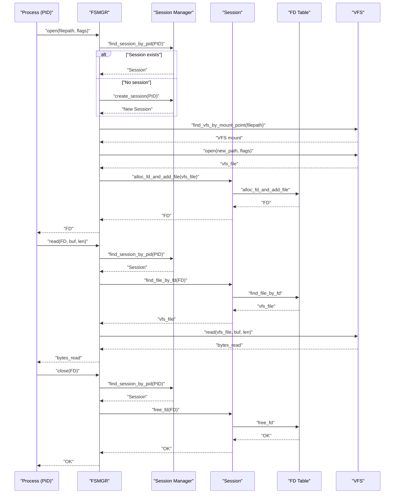
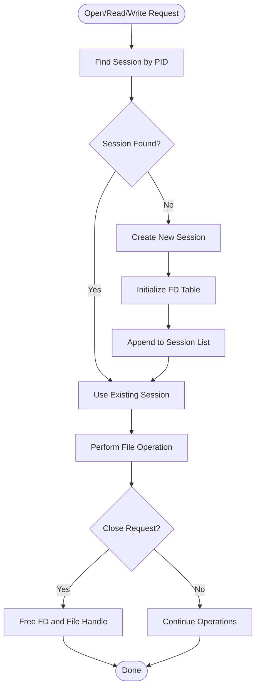
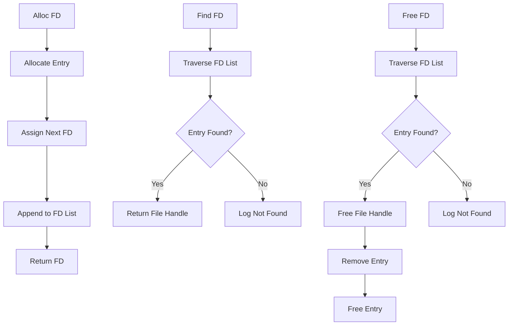
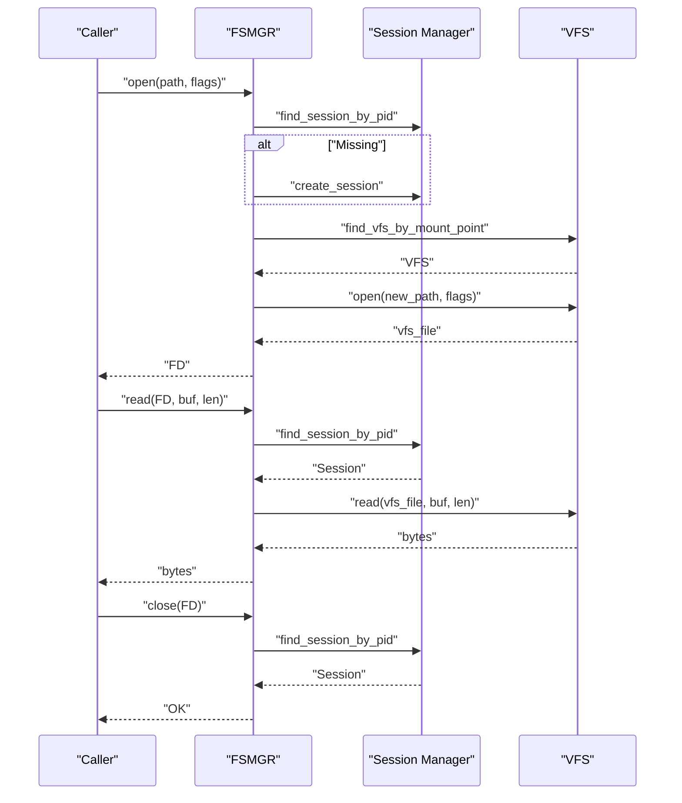
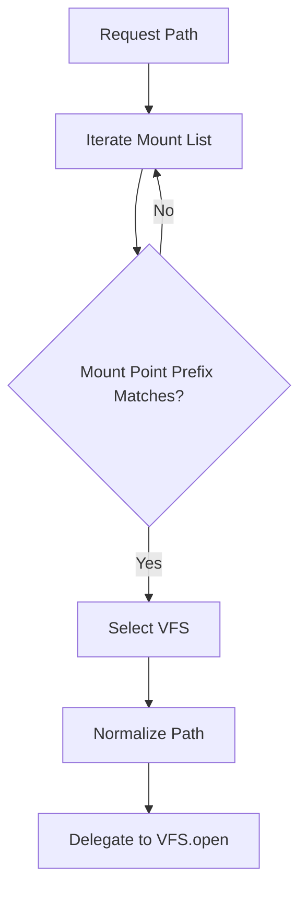
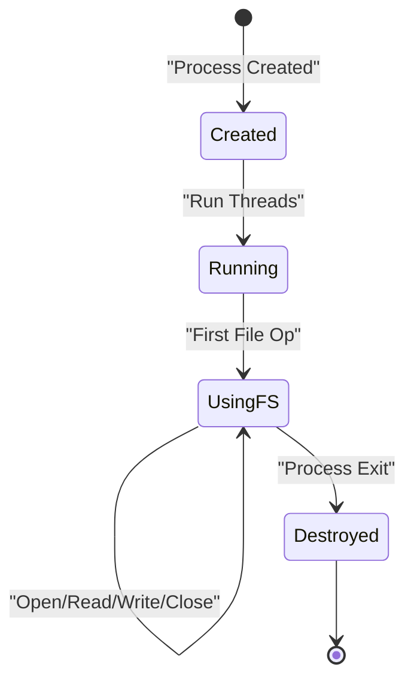
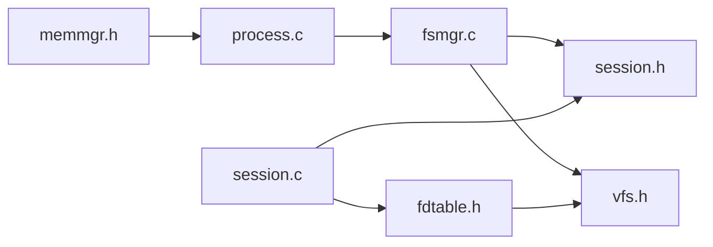

# Session Management

<cite>
**Referenced Files in This Document**
- [session.c](file://uapps/fsmgr/session.c)
- [session.h](file://uapps/fsmgr/include/session.h)
- [fdtable.c](file://uapps/fsmgr/fdtable.c)
- [fdtable.h](file://uapps/fsmgr/include/fdtable.h)
- [fsmgr.c](file://uapps/fsmgr/fsmgr.c)
- [fsmgr.h](file://uapps/fsmgr/include/fsmgr.h)
- [vfs.h](file://uapps/fsmgr/include/vfs/vfs.h)
- [vfs_file.h](file://uapps/fsmgr/include/vfs/vfs_file.h)
- [process.c](file://kernel/systemd/procmgr/process.c)
- [memmgr.h](file://kernel/systemd/include/memmgr/memmgr.h)
- [memmgr.c](file://kernel/systemd/memmgr/memmgr.c)
</cite>

## Table of Contents
1. [Introduction](#introduction)
2. [Project Structure](#project-structure)
3. [Core Components](#core-components)
4. [Architecture Overview](#architecture-overview)
5. [Detailed Component Analysis](#detailed-component-analysis)
6. [Dependency Analysis](#dependency-analysis)
7. [Performance Considerations](#performance-considerations)
8. [Troubleshooting Guide](#troubleshooting-guide)
9. [Conclusion](#conclusion)

## Introduction
This document describes the File System Session Management system in TranquilOS. It explains how sessions are created per process, how file descriptors are allocated and managed within a session, and how the system integrates with the Virtual File System (VFS) and process lifecycle. It also documents the session lookup mechanisms, resource isolation via per-process sessions, and cleanup procedures. Practical examples illustrate typical session operations such as opening, reading, writing, and closing files, along with file descriptor allocation and session cleanup.

## Project Structure
The session management subsystem resides in the File System Manager (FSMGR) and interacts with the VFS and process management layers:
- FSMGR orchestrates file operations and maintains a session manager.
- Sessions are per-process and encapsulate a file descriptor table.
- The VFS abstracts filesystem implementations and exposes open/read/write/close operations.
- Process management creates and destroys processes; session lifecycle is intended to align with process lifecycle.

```mermaid
graph TB
subgraph "FSMGR"
FSMGR["fsmgr.c<br/>fsmgr.h"]
SESSION["session.c<br/>session.h"]
FDT["fdtable.c<br/>fdtable.h"]
end
subgraph "VFS Layer"
VFS["vfs.h"]
VFILE["vfs_file.h"]
end
subgraph "Process Management"
PROC["process.c"]
MEM["memmgr.h<br/>memmgr.c"]
end
FSMGR --> SESSION
SESSION --> FDT
FSMGR --> VFS
VFS --> VFILE
PROC --> FSMGR
MEM --> PROC
```

**Diagram sources**
- [fsmgr.c](file://uapps/fsmgr/fsmgr.c#L1-L216)
- [session.c](file://uapps/fsmgr/session.c#L1-L112)
- [fdtable.c](file://uapps/fsmgr/fdtable.c#L1-L96)
- [vfs.h](file://uapps/fsmgr/include/vfs/vfs.h#L1-L21)
- [vfs_file.h](file://uapps/fsmgr/include/vfs/vfs_file.h#L1-L19)
- [process.c](file://kernel/systemd/procmgr/process.c#L1-L442)
- [memmgr.h](file://kernel/systemd/include/memmgr/memmgr.h#L1-L30)
- [memmgr.c](file://kernel/systemd/memmgr/memmgr.c#L202-L261)

**Section sources**
- [fsmgr.c](file://uapps/fsmgr/fsmgr.c#L1-L216)
- [session.c](file://uapps/fsmgr/session.c#L1-L112)
- [fdtable.c](file://uapps/fsmgr/fdtable.c#L1-L96)
- [vfs.h](file://uapps/fsmgr/include/vfs/vfs.h#L1-L21)
- [vfs_file.h](file://uapps/fsmgr/include/vfs/vfs_file.h#L1-L19)
- [process.c](file://kernel/systemd/procmgr/process.c#L1-L442)
- [memmgr.h](file://kernel/systemd/include/memmgr/memmgr.h#L1-L30)
- [memmgr.c](file://kernel/systemd/memmgr/memmgr.c#L202-L261)

## Core Components
- Session Manager: Maintains a linked list of sessions keyed by process ID (PID). Provides operations to find, create, and destroy sessions.
- Session: Encapsulates per-process state including a file descriptor table and operation callbacks.
- File Descriptor Table: Manages a dynamic list of file descriptor entries, each mapping a numeric FD to a VFS file handle.
- FSMGR: Exposes public file operations (open/read/write/close) and routes requests to the appropriate session and VFS backend.
- VFS/VFS File: Abstractions for filesystem mounts and file handles, including open/read/write operations.

Key responsibilities:
- Session lifecycle: creation on first use, lookup by PID, and planned destruction alongside process termination.
- File descriptor lifecycle: allocation, lookup, and freeing with associated file handle deallocation.
- Integration: FSMGR resolves the correct VFS mount based on the requested path and delegates file operations to the VFS.

**Section sources**
- [session.h](file://uapps/fsmgr/include/session.h#L1-L39)
- [session.c](file://uapps/fsmgr/session.c#L5-L112)
- [fdtable.h](file://uapps/fsmgr/include/fdtable.h#L1-L31)
- [fdtable.c](file://uapps/fsmgr/fdtable.c#L4-L96)
- [fsmgr.h](file://uapps/fsmgr/include/fsmgr.h#L1-L43)
- [fsmgr.c](file://uapps/fsmgr/fsmgr.c#L65-L216)
- [vfs.h](file://uapps/fsmgr/include/vfs/vfs.h#L1-L21)
- [vfs_file.h](file://uapps/fsmgr/include/vfs/vfs_file.h#L1-L19)

## Architecture Overview
The session management architecture enforces resource isolation by associating a session with each process. File operations are routed through FSMGR to locate or create a session for the calling process, then to the VFS for actual IO.



**Diagram sources**
- [fsmgr.c](file://uapps/fsmgr/fsmgr.c#L65-L190)
- [session.c](file://uapps/fsmgr/session.c#L5-L112)
- [fdtable.c](file://uapps/fsmgr/fdtable.c#L4-L96)
- [vfs.h](file://uapps/fsmgr/include/vfs/vfs.h#L1-L21)
- [vfs_file.h](file://uapps/fsmgr/include/vfs/vfs_file.h#L1-L19)

## Detailed Component Analysis

### Session Manager and Session Lifecycle
- Creation: When a process performs its first file operation, the session manager attempts to find an existing session by PID. If none exists, it creates a new session, initializes its FD table, and appends it to the manager’s list.
- Lookup: Iterates through the linked list of sessions to match the PID.
- Destruction: The destroy function is currently a placeholder and needs to be implemented to release session resources and unlink the session from the manager.



**Diagram sources**
- [session.c](file://uapps/fsmgr/session.c#L5-L112)
- [fsmgr.c](file://uapps/fsmgr/fsmgr.c#L65-L190)

**Section sources**
- [session.c](file://uapps/fsmgr/session.c#L5-L112)
- [session.h](file://uapps/fsmgr/include/session.h#L16-L35)

### File Descriptor Table Management
- Allocation: Allocates a new FD table entry, assigns a unique FD, stores the VFS file handle, and appends it to the FD list.
- Lookup: Traverses the FD list to find the entry matching the requested FD.
- Freeing: Removes the entry from the list and frees the associated file handle and entry.



**Diagram sources**
- [fdtable.c](file://uapps/fsmgr/fdtable.c#L4-L96)
- [fdtable.h](file://uapps/fsmgr/include/fdtable.h#L8-L27)

**Section sources**
- [fdtable.c](file://uapps/fsmgr/fdtable.c#L4-L96)
- [fdtable.h](file://uapps/fsmgr/include/fdtable.h#L1-L31)

### FSMGR Public API and Path Resolution
- Open: Locates or creates a session for the PID, selects the appropriate VFS mount based on the path prefix, opens the file via VFS, and allocates an FD in the session.
- Read/Write: Resolves the session by PID, retrieves the file handle by FD, and invokes the VFS operation.
- Close: Resolves the session by PID and frees the FD.



**Diagram sources**
- [fsmgr.c](file://uapps/fsmgr/fsmgr.c#L65-L190)
- [fsmgr.h](file://uapps/fsmgr/include/fsmgr.h#L20-L29)

**Section sources**
- [fsmgr.c](file://uapps/fsmgr/fsmgr.c#L65-L190)
- [fsmgr.h](file://uapps/fsmgr/include/fsmgr.h#L1-L43)

### VFS Integration and Mount Resolution
- Mounts are stored as a doubly linked list under FSMGR, each with a mount point string and flags.
- Path resolution compares the requested path prefix against each mount point to select the correct VFS backend.
- The resolved VFS is used to open the file with a normalized path derived from the original path.



**Diagram sources**
- [fsmgr.c](file://uapps/fsmgr/fsmgr.c#L30-L98)
- [vfs.h](file://uapps/fsmgr/include/vfs/vfs.h#L12-L19)

**Section sources**
- [fsmgr.c](file://uapps/fsmgr/fsmgr.c#L30-L98)
- [vfs.h](file://uapps/fsmgr/include/vfs/vfs.h#L1-L21)

### Process Management Integration
- Processes are created and destroyed by the process manager. Sessions are intended to mirror process lifecycle: created on first file access and destroyed when the process exits.
- Memory management supports kernel object allocation for process and thread structures, which indirectly affects session memory footprint.



**Diagram sources**
- [process.c](file://kernel/systemd/procmgr/process.c#L150-L201)
- [memmgr.h](file://kernel/systemd/include/memmgr/memmgr.h#L10-L24)

**Section sources**
- [process.c](file://kernel/systemd/procmgr/process.c#L150-L201)
- [memmgr.h](file://kernel/systemd/include/memmgr/memmgr.h#L1-L30)
- [memmgr.c](file://kernel/systemd/memmgr/memmgr.c#L202-L261)

## Dependency Analysis
- FSMGR depends on Session Manager and VFS abstractions.
- Session Manager depends on the FD table implementation.
- FD table depends on a doubly linked list utility and VFS file handles.
- Process management and memory management support the lifecycle and resource allocation for processes, which indirectly impact session lifetime and memory usage.



**Diagram sources**
- [fsmgr.c](file://uapps/fsmgr/fsmgr.c#L1-L216)
- [session.c](file://uapps/fsmgr/session.c#L1-L112)
- [fdtable.h](file://uapps/fsmgr/include/fdtable.h#L1-L31)
- [vfs.h](file://uapps/fsmgr/include/vfs/vfs.h#L1-L21)
- [process.c](file://kernel/systemd/procmgr/process.c#L1-L442)
- [memmgr.h](file://kernel/systemd/include/memmgr/memmgr.h#L1-L30)

**Section sources**
- [fsmgr.c](file://uapps/fsmgr/fsmgr.c#L1-L216)
- [session.c](file://uapps/fsmgr/session.c#L1-L112)
- [fdtable.h](file://uapps/fsmgr/include/fdtable.h#L1-L31)
- [vfs.h](file://uapps/fsmgr/include/vfs/vfs.h#L1-L21)
- [process.c](file://kernel/systemd/procmgr/process.c#L1-L442)
- [memmgr.h](file://kernel/systemd/include/memmgr/memmgr.h#L1-L30)

## Performance Considerations
- Session lookup: Linear scan of the session list by PID. For systems with many concurrent processes, consider augmenting the session manager with a hash map keyed by PID to achieve average O(1) lookup.
- FD table traversal: Allocation, lookup, and free operations traverse the FD list. For heavy workloads, consider:
  - Using a bitmap or freelist to track free FDs.
  - Employing a small fixed-size array for low FD numbers and fall back to the list for higher FDs.
- Path resolution: String comparison for mount point prefixes scales linearly with the number of mounts. Keep the number of mounts reasonable or precompute a trie for mount points.
- Memory allocation: Frequent malloc/free in FD operations can fragment memory. Consider:
  - Using a slab allocator or arena allocator for FD table entries.
  - Reusing freed entries instead of immediately freeing them.
- VFS delegation: Offload IO to the VFS backend; ensure minimal overhead in FSMGR wrappers.

[No sources needed since this section provides general guidance]

## Troubleshooting Guide
Common issues and diagnostics:
- Session not found: Occurs when a process has no session yet. The system logs an informational message and proceeds to create a session on demand.
- FD not found: When attempting to read/write/close with an invalid or already freed FD, the FD table logs a message and returns an error.
- VFS not found: If the requested path does not match any mount point, the operation fails early with an error.
- Session destroy not implemented: The destroy function is a placeholder. Ensure proper cleanup of FD entries and removal from the session list to prevent leaks.

Operational checks:
- Verify that the session manager is initialized before any file operations.
- Confirm that VFS mounts are registered before path resolution.
- Ensure that process termination triggers session cleanup to avoid dangling resources.

**Section sources**
- [session.c](file://uapps/fsmgr/session.c#L5-L112)
- [fdtable.c](file://uapps/fsmgr/fdtable.c#L32-L83)
- [fsmgr.c](file://uapps/fsmgr/fsmgr.c#L30-L98)

## Conclusion
The File System Session Management system in TranquilOS provides per-process isolation for file operations through sessions and FD tables. FSMGR coordinates path resolution, VFS delegation, and session lifecycle. While the current implementation is functional, enhancements such as PID-indexed session storage, optimized FD allocation strategies, and integrated session destruction on process exit would improve scalability and reliability. The architecture cleanly separates concerns between process management, session management, and VFS, enabling future extensions and optimizations.