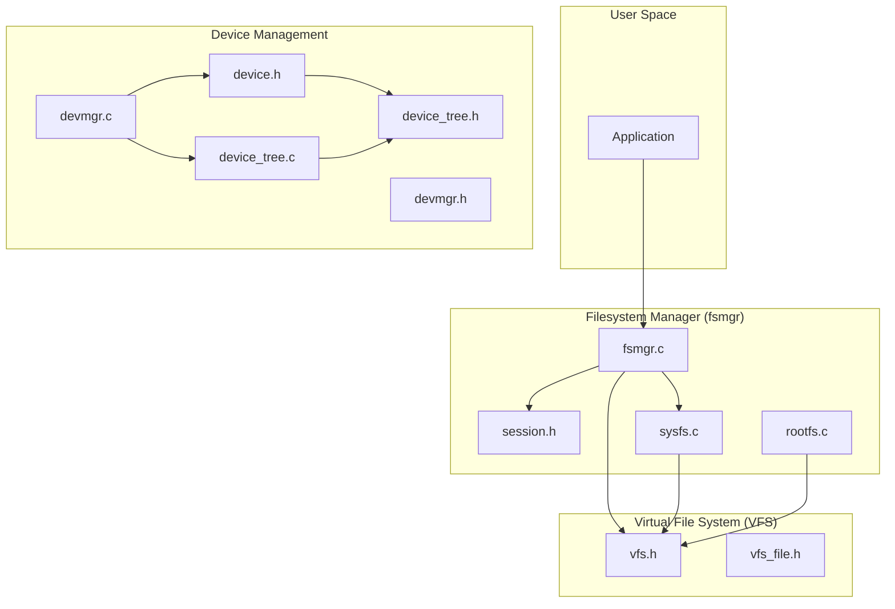
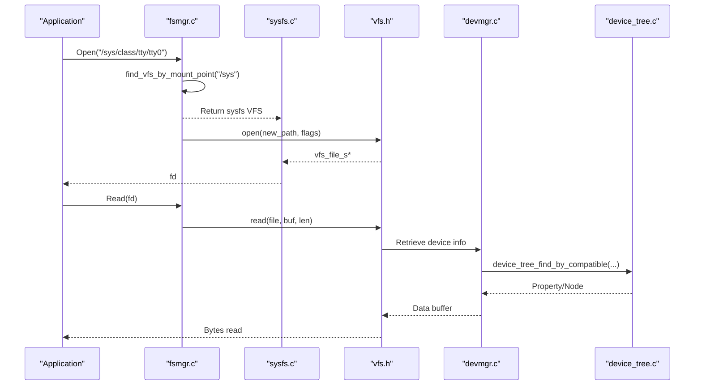
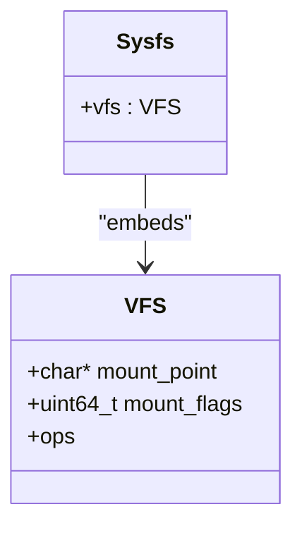
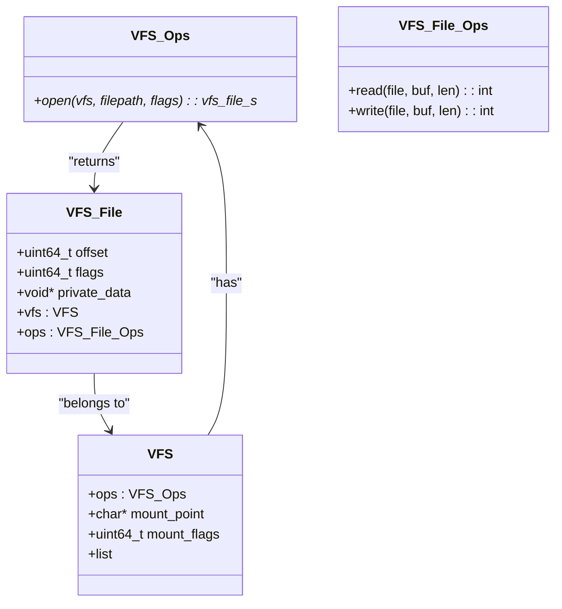
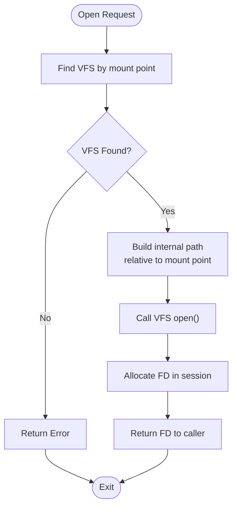
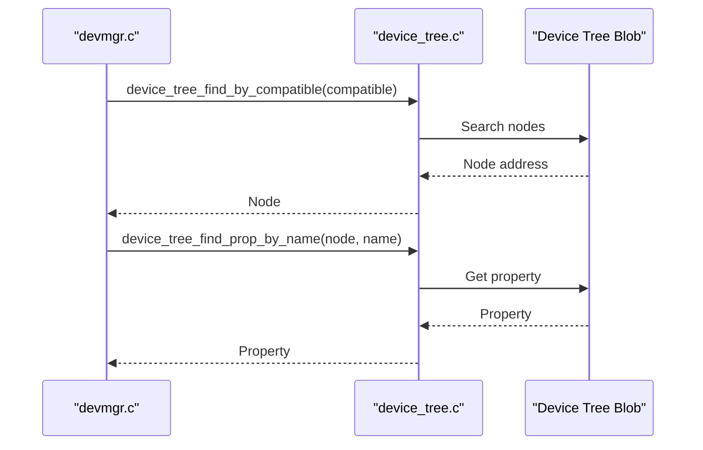
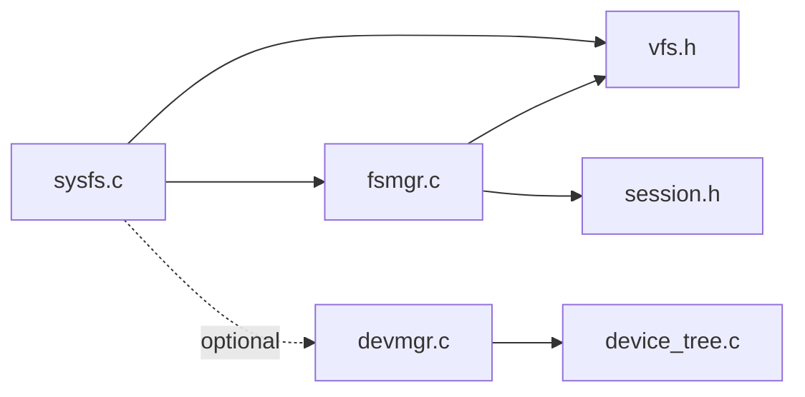

# System File System (sysfs)

<cite>
**Referenced Files in This Document**
- [sysfs.c](file://uapps/fsmgr/sysfs/sysfs.c)
- [sysfs.h](file://uapps/fsmgr/include/sysfs/sysfs.h)
- [vfs.h](file://uapps/fsmgr/include/vfs/vfs.h)
- [vfs_file.h](file://uapps/fsmgr/include/vfs/vfs_file.h)
- [fsmgr.h](file://uapps/fsmgr/include/fsmgr.h)
- [fsmgr.c](file://uapps/fsmgr/fsmgr.c)
- [session.h](file://uapps/fsmgr/include/session.h)
- [rootfs.c](file://uapps/fsmgr/rootfs/rootfs.c)
- [devmgr.h](file://uapps/devmgr/include/devmgr.h)
- [devmgr.c](file://uapps/devmgr/devmgr.c)
- [device.h](file://kernel/include/device/device.h)
- [device_tree.h](file://kernel/include/device/device_tree.h)
- [device_tree.c](file://kernel/device/device_tree.c)
</cite>

## Table of Contents
1. [Introduction](#introduction)
2. [Project Structure](#project-structure)
3. [Core Components](#core-components)
4. [Architecture Overview](#architecture-overview)
5. [Detailed Component Analysis](#detailed-component-analysis)
6. [Dependency Analysis](#dependency-analysis)
7. [Performance Considerations](#performance-considerations)
8. [Security Considerations](#security-considerations)
9. [Troubleshooting Guide](#troubleshooting-guide)
10. [Conclusion](#conclusion)

## Introduction
This document describes the System File System (sysfs) implementation in TranquilOS. It explains how sysfs exposes device and hardware information through a virtual filesystem interface, how it integrates with the kernel’s device management subsystem, and how applications can access system configuration and device attributes via standard file operations. It also covers the sysfs directory hierarchy concept, dynamic updates, and practical examples of accessing device information and configuring devices through sysfs.

## Project Structure
The sysfs implementation resides in the filesystem manager (fsmgr) component and builds upon the Virtual File System (VFS) abstraction. Device discovery and property retrieval are handled by the device manager and kernel device tree layer.

**Diagram sources**
- [fsmgr.c](file://uapps/fsmgr/fsmgr.c#L1-L108)
- [session.h](file://uapps/fsmgr/include/session.h#L1-L39)
- [rootfs.c](file://uapps/fsmgr/rootfs/rootfs.c#L1-L100)
- [sysfs.c](file://uapps/fsmgr/sysfs/sysfs.c#L1-L28)
- [vfs.h](file://uapps/fsmgr/include/vfs/vfs.h#L1-L21)
- [vfs_file.h](file://uapps/fsmgr/include/vfs/vfs_file.h#L1-L19)
- [devmgr.c](file://uapps/devmgr/devmgr.c#L1-L62)
- [devmgr.h](file://uapps/devmgr/include/devmgr.h#L1-L30)
- [device.h](file://kernel/include/device/device.h#L2-L36)
- [device_tree.c](file://kernel/device/device_tree.c#L1-L95)
- [device_tree.h](file://kernel/include/device/device_tree.h#L2-L24)

**Section sources**
- [sysfs.c](file://uapps/fsmgr/sysfs/sysfs.c#L1-L28)
- [sysfs.h](file://uapps/fsmgr/include/sysfs/sysfs.h#L1-L12)
- [vfs.h](file://uapps/fsmgr/include/vfs/vfs.h#L1-L21)
- [vfs_file.h](file://uapps/fsmgr/include/vfs/vfs_file.h#L1-L19)
- [fsmgr.h](file://uapps/fsmgr/include/fsmgr.h#L1-L43)
- [fsmgr.c](file://uapps/fsmgr/fsmgr.c#L1-L108)
- [session.h](file://uapps/fsmgr/include/session.h#L1-L39)
- [rootfs.c](file://uapps/fsmgr/rootfs/rootfs.c#L1-L100)
- [devmgr.h](file://uapps/devmgr/include/devmgr.h#L1-L30)
- [devmgr.c](file://uapps/devmgr/devmgr.c#L1-L62)
- [device.h](file://kernel/include/device/device.h#L2-L36)
- [device_tree.h](file://kernel/include/device/device_tree.h#L2-L24)
- [device_tree.c](file://kernel/device/device_tree.c#L1-L95)

## Core Components
- sysfs: A minimal VFS-based filesystem mounted at /sys. It exposes a virtual directory hierarchy representing devices and system configuration.
- VFS: Provides the generic filesystem abstraction with mount points, open operations, and file descriptors.
- fsmgr: Manages multiple VFS instances, resolves mount points, and opens files on behalf of processes.
- Device Manager and Kernel Device Tree: Discover devices via the device tree and expose properties for sysfs to present.

Key responsibilities:
- sysfs initialization sets the mount point to /sys and registers itself with the global filesystem manager.
- fsmgr resolves which VFS instance serves a given path and delegates file operations.
- Device manager locates nodes in the device tree and retrieves properties for sysfs presentation.

**Section sources**
- [sysfs.c](file://uapps/fsmgr/sysfs/sysfs.c#L12-L28)
- [sysfs.h](file://uapps/fsmgr/include/sysfs/sysfs.h#L6-L8)
- [vfs.h](file://uapps/fsmgr/include/vfs/vfs.h#L12-L19)
- [fsmgr.c](file://uapps/fsmgr/fsmgr.c#L8-L28)
- [devmgr.c](file://uapps/devmgr/devmgr.c#L33-L55)
- [device_tree.c](file://kernel/device/device_tree.c#L25-L60)

## Architecture Overview
The sysfs architecture follows a layered design:
- Application requests a file operation under /sys.
- The filesystem manager finds the appropriate VFS instance by mount point.
- The VFS instance performs the open/read/write operation.
- Device properties are accessed via the kernel device tree and device manager.

**Diagram sources**
- [fsmgr.c](file://uapps/fsmgr/fsmgr.c#L65-L108)
- [sysfs.c](file://uapps/fsmgr/sysfs/sysfs.c#L12-L28)
- [vfs.h](file://uapps/fsmgr/include/vfs/vfs.h#L7-L10)
- [devmgr.c](file://uapps/devmgr/devmgr.c#L33-L55)
- [device_tree.c](file://kernel/device/device_tree.c#L25-L60)

## Detailed Component Analysis

### sysfs Implementation
sysfs is a thin wrapper around the VFS layer. It defines a single structure embedding the VFS base and initializes the mount point to /sys. It relies on the filesystem manager to register the mount and handle file operations.

**Diagram sources**
- [sysfs.h](file://uapps/fsmgr/include/sysfs/sysfs.h#L6-L8)
- [vfs.h](file://uapps/fsmgr/include/vfs/vfs.h#L12-L19)

**Section sources**
- [sysfs.c](file://uapps/fsmgr/sysfs/sysfs.c#L12-L28)
- [sysfs.h](file://uapps/fsmgr/include/sysfs/sysfs.h#L6-L8)

### VFS Abstraction
The VFS layer defines the filesystem contract:
- Mount point and flags
- Open operation returning a file handle
- File handle with read/write callbacks and private data

**Diagram sources**
- [vfs.h](file://uapps/fsmgr/include/vfs/vfs.h#L7-L19)
- [vfs_file.h](file://uapps/fsmgr/include/vfs/vfs_file.h#L4-L18)

**Section sources**
- [vfs.h](file://uapps/fsmgr/include/vfs/vfs.h#L7-L19)
- [vfs_file.h](file://uapps/fsmgr/include/vfs/vfs_file.h#L4-L18)

### Filesystem Manager (fsmgr)
The filesystem manager:
- Registers VFS instances with mount points
- Resolves which VFS serves a given path
- Opens files on behalf of processes and manages per-process file descriptors

**Diagram sources**
- [fsmgr.c](file://uapps/fsmgr/fsmgr.c#L30-L108)
- [session.h](file://uapps/fsmgr/include/session.h#L16-L21)

**Section sources**
- [fsmgr.c](file://uapps/fsmgr/fsmgr.c#L8-L28)
- [fsmgr.c](file://uapps/fsmgr/fsmgr.c#L30-L63)
- [fsmgr.c](file://uapps/fsmgr/fsmgr.c#L65-L108)
- [session.h](file://uapps/fsmgr/include/session.h#L16-L21)

### Device Discovery and Properties
Device information is discovered via the device tree and exposed through the device manager:
- Locate nodes by compatible string or device type
- Retrieve properties associated with nodes
- Provide addresses and metadata for sysfs presentation

**Diagram sources**
- [devmgr.c](file://uapps/devmgr/devmgr.c#L10-L31)
- [device_tree.c](file://kernel/device/device_tree.c#L25-L60)

**Section sources**
- [devmgr.c](file://uapps/devmgr/devmgr.c#L10-L31)
- [device_tree.c](file://kernel/device/device_tree.c#L25-L60)
- [device.h](file://kernel/include/device/device.h#L18-L30)

## Dependency Analysis
The sysfs implementation depends on:
- VFS for filesystem semantics
- fsmgr for mount registration and file opening
- Device manager and kernel device tree for hardware discovery and properties

**Diagram sources**
- [sysfs.c](file://uapps/fsmgr/sysfs/sysfs.c#L1-L28)
- [fsmgr.c](file://uapps/fsmgr/fsmgr.c#L1-L108)
- [session.h](file://uapps/fsmgr/include/session.h#L1-L39)
- [vfs.h](file://uapps/fsmgr/include/vfs/vfs.h#L1-L21)
- [devmgr.c](file://uapps/devmgr/devmgr.c#L1-L62)
- [device_tree.c](file://kernel/device/device_tree.c#L1-L95)

**Section sources**
- [sysfs.c](file://uapps/fsmgr/sysfs/sysfs.c#L1-L28)
- [fsmgr.c](file://uapps/fsmgr/fsmgr.c#L1-L108)
- [session.h](file://uapps/fsmgr/include/session.h#L1-L39)
- [vfs.h](file://uapps/fsmgr/include/vfs/vfs.h#L1-L21)
- [devmgr.c](file://uapps/devmgr/devmgr.c#L1-L62)
- [device_tree.c](file://kernel/device/device_tree.c#L1-L95)

## Performance Considerations
- sysfs mount and lookup: sysfs is registered once and resolved by mount point prefix matching. This is O(n) over registered VFS instances; keep the number of mounts reasonable.
- Path translation: fsmgr constructs a relative path for each VFS open. Keep path lengths minimal to reduce overhead.
- Device tree queries: Compatible and property lookups are linear over nodes and properties. Cache frequently accessed properties at the device manager level if needed.
- File operations: sysfs file reads/writes are delegated to VFS. Ensure efficient read/write handlers in concrete filesystem implementations.

[No sources needed since this section provides general guidance]

## Security Considerations
- Access control: sysfs is mounted with read/write flags. Limit sensitive attributes and gate access via capability checks or policy hooks.
- Device exposure: Expose only necessary device attributes. Hide raw memory addresses or privileged registers.
- IPC boundaries: Ensure device manager and sysfs do not leak kernel internals to unprivileged userspace.

[No sources needed since this section provides general guidance]

## Troubleshooting Guide
Common issues and diagnostics:
- sysfs mount failure: Verify fsmgr is initialized and returns a non-null pointer before mounting.
- VFS not found: Confirm the requested path begins with the sysfs mount point and that the VFS list is populated.
- File open errors: Check that the VFS open callback returns a valid file handle and that the session allocator succeeds.
- Device property missing: Validate the device tree contains the expected compatible string and properties.

Operational checks:
- Initialization logs indicate successful sysfs registration.
- fsmgr path resolution logs show which VFS was selected.
- rootfs example demonstrates how CPIO-backed files are opened and read.

**Section sources**
- [sysfs.c](file://uapps/fsmgr/sysfs/sysfs.c#L12-L28)
- [fsmgr.c](file://uapps/fsmgr/fsmgr.c#L30-L63)
- [fsmgr.c](file://uapps/fsmgr/fsmgr.c#L65-L108)
- [rootfs.c](file://uapps/fsmgr/rootfs/rootfs.c#L32-L63)

## Conclusion
The sysfs implementation in TranquilOS provides a clean, extensible interface for exposing device and system configuration through a virtual filesystem. By leveraging the VFS abstraction and integrating with the kernel’s device management and device tree layers, sysfs enables dynamic discovery and controlled access to hardware state. Future enhancements can include concrete file operations for device attributes, caching mechanisms, and stricter access controls.