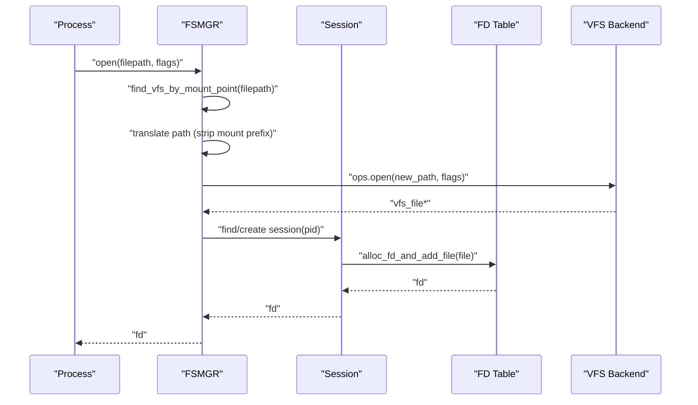
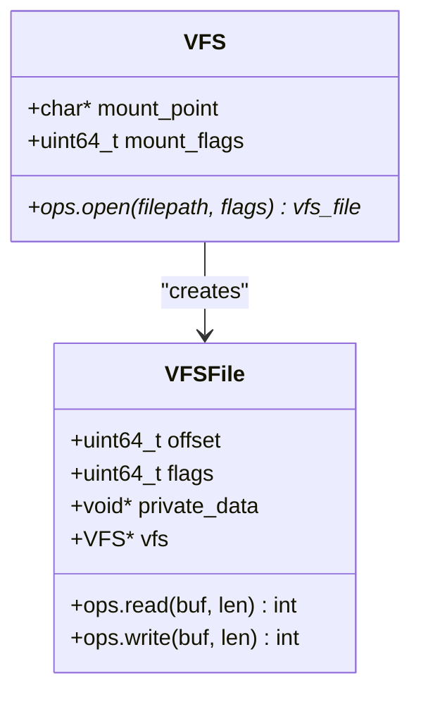
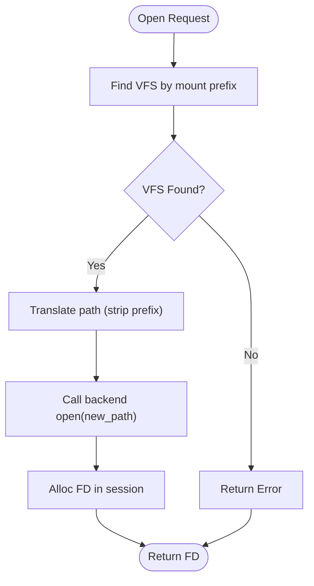
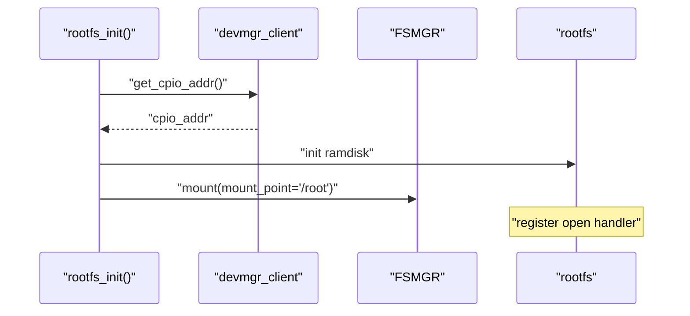
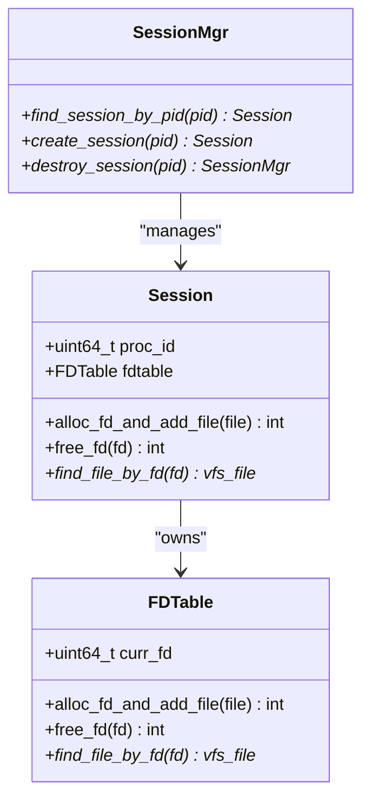
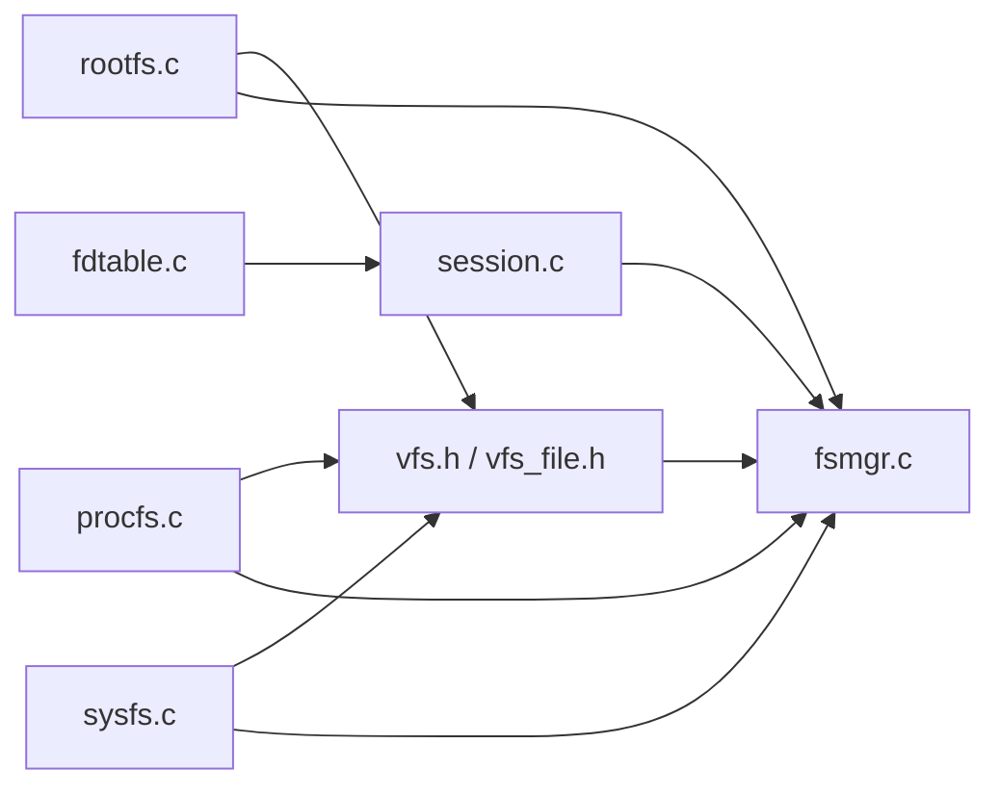

# Virtual File System (VFS)

<cite>
**Referenced Files in This Document**
- [vfs.h](file://uapps/fsmgr/include/vfs/vfs.h)
- [vfs_file.h](file://uapps/fsmgr/include/vfs/vfs_file.h)
- [fsmgr.h](file://uapps/fsmgr/include/fsmgr.h)
- [fsmgr.c](file://uapps/fsmgr/fsmgr.c)
- [rootfs.h](file://uapps/fsmgr/include/rootfs/rootfs.h)
- [rootfs.c](file://uapps/fsmgr/rootfs/rootfs.c)
- [procfs.h](file://uapps/fsmgr/include/procfs/procfs.h)
- [procfs.c](file://uapps/fsmgr/procfs/procfs.c)
- [sysfs.h](file://uapps/fsmgr/include/sysfs/sysfs.h)
- [sysfs.c](file://uapps/fsmgr/sysfs/sysfs.c)
- [session.h](file://uapps/fsmgr/include/session.h)
- [session.c](file://uapps/fsmgr/session.c)
- [fdtable.h](file://uapps/fsmgr/include/fdtable.h)
- [fdtable.c](file://uapps/fsmgr/fdtable.c)
</cite>

## Table of Contents
1. [Introduction](#introduction)
2. [Project Structure](#project-structure)
3. [Core Components](#core-components)
4. [Architecture Overview](#architecture-overview)
5. [Detailed Component Analysis](#detailed-component-analysis)
6. [Dependency Analysis](#dependency-analysis)
7. [Performance Considerations](#performance-considerations)
8. [Troubleshooting Guide](#troubleshooting-guide)
9. [Conclusion](#conclusion)

## Introduction
This document explains the Virtual File System (VFS) implementation in TranquilOS. It covers the VFS layer architecture, mount point management, file system abstraction, registration and mount operations, path resolution logic, integration with different file system types, operation dispatching, and lifecycle management. It also documents error handling strategies and performance considerations for file system operations.

## Project Structure
The VFS subsystem resides in the user-space file system manager (FSMGR) component under uapps/fsmgr. The key elements are:
- VFS core abstractions: vfs.h and vfs_file.h define the VFS interface and file handle abstractions.
- FSMGR orchestrates mounts, path resolution, and dispatches operations to the appropriate VFS backend.
- Backends:
  - rootfs: read-only embedded filesystem backed by a CPIO archive.
  - procfs and sysfs: virtual filesystems registered at /proc and /sys respectively.
- Session and FD management: session.c and fdtable.c manage per-process file descriptors and file handles.

```mermaid
graph TB
subgraph "FSMGR"
FSMGR["fsmgr.c"]
SESSION_MGR["session.c"]
FDTABLE["fdtable.c"]
end
subgraph "VFS Abstractions"
VFS_IF["vfs.h"]
VFS_FILE_IF["vfs_file.h"]
end
subgraph "Backends"
ROOTFS["rootfs.c"]
PROCFS["procfs.c"]
SYSFS["sysfs.c"]
end
FSMGR --> SESSION_MGR
SESSION_MGR --> FDTABLE
FSMGR --> VFS_IF
FSMGR --> VFS_FILE_IF
ROOTFS --> VFS_IF
PROCFS --> VFS_IF
SYSFS --> VFS_IF
ROOTFS --> VFS_FILE_IF
PROCFS --> VFS_FILE_IF
SYSFS --> VFS_FILE_IF
```

**Diagram sources**
- [fsmgr.c](file://uapps/fsmgr/fsmgr.c#L1-L216)
- [session.c](file://uapps/fsmgr/session.c#L1-L112)
- [fdtable.c](file://uapps/fsmgr/fdtable.c#L1-L96)
- [vfs.h](file://uapps/fsmgr/include/vfs/vfs.h#L1-L21)
- [vfs_file.h](file://uapps/fsmgr/include/vfs/vfs_file.h#L1-L19)
- [rootfs.c](file://uapps/fsmgr/rootfs/rootfs.c#L1-L100)
- [procfs.c](file://uapps/fsmgr/procfs/procfs.c#L1-L28)
- [sysfs.c](file://uapps/fsmgr/sysfs/sysfs.c#L1-L28)

**Section sources**
- [fsmgr.c](file://uapps/fsmgr/fsmgr.c#L1-L216)
- [vfs.h](file://uapps/fsmgr/include/vfs/vfs.h#L1-L21)
- [vfs_file.h](file://uapps/fsmgr/include/vfs/vfs_file.h#L1-L19)
- [rootfs.c](file://uapps/fsmgr/rootfs/rootfs.c#L1-L100)
- [procfs.c](file://uapps/fsmgr/procfs/procfs.c#L1-L28)
- [sysfs.c](file://uapps/fsmgr/sysfs/sysfs.c#L1-L28)
- [session.c](file://uapps/fsmgr/session.c#L1-L112)
- [fdtable.c](file://uapps/fsmgr/fdtable.c#L1-L96)

## Core Components
- VFS descriptor (vfs): Holds mount point, mount flags, and a function pointer table for VFS operations. The primary operation exposed is open.
- VFS file handle (vfs_file): Encapsulates per-file state (offset, flags, private_data) and a function pointer table for file operations (read/write).
- FSMGR: Manages the list of mounted VFS instances, resolves which VFS serves a given path, translates paths, and dispatches open/read/write/close to the appropriate backend.
- Backends:
  - rootfs: Implements open via CPIO lookup and provides read/write handlers; marked read-only.
  - procfs and sysfs: Register themselves with FSMGR and are mounted at /proc and /sys respectively.

Key responsibilities:
- Mounting: Each backend sets its mount_point and calls fsmgr->ops.mount to register itself into the global VFS list.
- Path resolution: FSMGR scans the VFS list and matches the longest mount prefix to route to the correct backend.
- Path translation: The leading mount prefix is stripped from the absolute path before delegating to the backend’s open.
- Operation dispatch: After obtaining a vfs_file, FSMGR delegates read/write to the file handle’s ops.

**Section sources**
- [vfs.h](file://uapps/fsmgr/include/vfs/vfs.h#L7-L21)
- [vfs_file.h](file://uapps/fsmgr/include/vfs/vfs_file.h#L4-L19)
- [fsmgr.c](file://uapps/fsmgr/fsmgr.c#L8-L28)
- [fsmgr.c](file://uapps/fsmgr/fsmgr.c#L30-L63)
- [fsmgr.c](file://uapps/fsmgr/fsmgr.c#L65-L108)
- [rootfs.c](file://uapps/fsmgr/rootfs/rootfs.c#L32-L63)
- [procfs.c](file://uapps/fsmgr/procfs/procfs.c#L12-L27)
- [sysfs.c](file://uapps/fsmgr/sysfs/sysfs.c#L12-L27)

## Architecture Overview
The VFS architecture separates the interface from implementations:
- VFS abstraction defines the contract for mountable filesystems and per-file operations.
- FSMGR acts as the central dispatcher, managing mounts and routing requests.
- Backends implement the contract and integrate with their storage or virtual data sources.
- Sessions and FD tables provide per-process resource management.



**Diagram sources**
- [fsmgr.c](file://uapps/fsmgr/fsmgr.c#L65-L108)
- [session.c](file://uapps/fsmgr/session.c#L5-L89)
- [fdtable.c](file://uapps/fsmgr/fdtable.c#L4-L30)
- [rootfs.c](file://uapps/fsmgr/rootfs/rootfs.c#L32-L63)

## Detailed Component Analysis

### VFS Abstractions
The VFS layer defines two core structures:
- vfs: carries mount metadata and a function pointer table for VFS-level operations (e.g., open).
- vfs_file: carries per-file state and a function pointer table for file-level operations (read/write).



**Diagram sources**
- [vfs.h](file://uapps/fsmgr/include/vfs/vfs.h#L12-L21)
- [vfs_file.h](file://uapps/fsmgr/include/vfs/vfs_file.h#L11-L19)

**Section sources**
- [vfs.h](file://uapps/fsmgr/include/vfs/vfs.h#L7-L21)
- [vfs_file.h](file://uapps/fsmgr/include/vfs/vfs_file.h#L4-L19)

### FSMGR: Mounting, Resolution, and Dispatch
FSMGR maintains a linked list of mounted VFS instances and exposes:
- mount: appends a VFS to the list.
- find_vfs_by_mount_point: matches the longest mount prefix.
- fs_open/fs_read/fs_write/fs_close: orchestrate session creation, path translation, and operation dispatch.

Path translation algorithm:
- Extract the mount prefix from the VFS list entry.
- Strip the prefix from the incoming path and prepend a relative prefix for backend consumption.
- Call the backend’s open with the translated path.



**Diagram sources**
- [fsmgr.c](file://uapps/fsmgr/fsmgr.c#L30-L63)
- [fsmgr.c](file://uapps/fsmgr/fsmgr.c#L87-L94)
- [fsmgr.c](file://uapps/fsmgr/fsmgr.c#L65-L108)

**Section sources**
- [fsmgr.c](file://uapps/fsmgr/fsmgr.c#L8-L28)
- [fsmgr.c](file://uapps/fsmgr/fsmgr.c#L30-L63)
- [fsmgr.c](file://uapps/fsmgr/fsmgr.c#L65-L108)
- [fsmgr.c](file://uapps/fsmgr/fsmgr.c#L110-L172)
- [fsmgr.c](file://uapps/fsmgr/fsmgr.c#L174-L190)

### RootFS Backend
RootFS is a read-only filesystem backed by a CPIO archive:
- Initialization:
  - Sets mount_point to “/root”.
  - Registers open handler.
  - Obtains CPIO address from device manager and initializes the embedded filesystem.
  - Calls fsmgr->ops.mount to register itself.
- File operations:
  - open: locates a file header in the CPIO archive and returns a vfs_file with read/write handlers.
  - read: advances internal offset and copies data from the CPIO payload.
  - write: logs an error and returns failure (read-only).



**Diagram sources**
- [rootfs.c](file://uapps/fsmgr/rootfs/rootfs.c#L75-L99)
- [fsmgr.c](file://uapps/fsmgr/fsmgr.c#L8-L28)

**Section sources**
- [rootfs.c](file://uapps/fsmgr/rootfs/rootfs.c#L12-L30)
- [rootfs.c](file://uapps/fsmgr/rootfs/rootfs.c#L32-L63)
- [rootfs.c](file://uapps/fsmgr/rootfs/rootfs.c#L75-L99)

### ProcFS and SysFS Backends
Both backends are virtual filesystems:
- Initialization:
  - Set mount_point to “/proc” or “/sys” respectively.
  - Call fsmgr->ops.mount with appropriate flags.
- Operations:
  - These backends currently rely on FSMGR to register and route; their specific open/read/write implementations are not shown in the provided files.

**Section sources**
- [procfs.c](file://uapps/fsmgr/procfs/procfs.c#L12-L27)
- [sysfs.c](file://uapps/fsmgr/sysfs/sysfs.c#L12-L27)

### Session and FD Management
Per-process lifecycle:
- Session manager finds or creates a session keyed by process ID.
- Each session owns an FD table.
- FD table allocates sequential FDs, stores pointers to vfs_file, and supports lookup and deletion.



**Diagram sources**
- [session.c](file://uapps/fsmgr/session.c#L5-L89)
- [fdtable.c](file://uapps/fsmgr/fdtable.c#L4-L30)

**Section sources**
- [session.c](file://uapps/fsmgr/session.c#L5-L89)
- [fdtable.c](file://uapps/fsmgr/fdtable.c#L4-L30)
- [fdtable.c](file://uapps/fsmgr/fdtable.c#L32-L61)
- [fdtable.c](file://uapps/fsmgr/fdtable.c#L63-L83)

## Dependency Analysis
- VFS abstractions are independent of backends; backends implement the vfs and vfs_file contracts.
- FSMGR depends on:
  - VFS abstractions for dispatch.
  - Session manager for per-process state.
  - FD table for resource allocation.
- Backends depend on:
  - Device manager client for initialization (rootfs).
  - FSMGR for registration (all backends).



**Diagram sources**
- [vfs.h](file://uapps/fsmgr/include/vfs/vfs.h#L1-L21)
- [vfs_file.h](file://uapps/fsmgr/include/vfs/vfs_file.h#L1-L19)
- [fsmgr.c](file://uapps/fsmgr/fsmgr.c#L1-L216)
- [session.c](file://uapps/fsmgr/session.c#L1-L112)
- [fdtable.c](file://uapps/fsmgr/fdtable.c#L1-L96)
- [rootfs.c](file://uapps/fsmgr/rootfs/rootfs.c#L1-L100)
- [procfs.c](file://uapps/fsmgr/procfs/procfs.c#L1-L28)
- [sysfs.c](file://uapps/fsmgr/sysfs/sysfs.c#L1-L28)

**Section sources**
- [fsmgr.c](file://uapps/fsmgr/fsmgr.c#L192-L216)
- [rootfs.c](file://uapps/fsmgr/rootfs/rootfs.c#L75-L99)
- [procfs.c](file://uapps/fsmgr/procfs/procfs.c#L12-L27)
- [sysfs.c](file://uapps/fsmgr/sysfs/sysfs.c#L12-L27)

## Performance Considerations
- Mount list traversal: find_vfs_by_mount_point iterates the linked list and compares prefixes. For many mounts, consider optimizing with a radix tree or hash map keyed by mount prefix length.
- Path translation: Repeated string operations occur during path stripping. Precompute or cache prefix lengths to reduce overhead.
- File handle allocation: Each open allocates a vfs_file and a table entry. Minimize allocations by pooling or reusing entries when feasible.
- Read/write: rootfs read performs memcpy per call. Consider buffering at higher layers or aligning reads to block boundaries for throughput.
- Concurrency: No explicit locking is visible in the provided code. Introduce fine-grained locks around shared lists and tables if multiple threads access the same session.

[No sources needed since this section provides general guidance]

## Troubleshooting Guide
Common issues and diagnostics:
- Mount failures:
  - Verify fsmgr->ops.mount is called with a valid vfs and mount_point.
  - Ensure the backend sets mount_point before mounting.
- Path resolution failures:
  - Confirm the requested path begins with a registered mount prefix.
  - Check that find_vfs_by_mount_point returns a non-null VFS.
- Path translation errors:
  - Validate the translated path construction logic; ensure leading separator is preserved for backend consumption.
- Open failures:
  - For rootfs, confirm the CPIO address is valid and the file exists in the archive.
  - For read-only backends, expect write operations to fail.
- Session/FD issues:
  - If fd allocation fails, check memory availability and table initialization.
  - If lookup fails, verify the fd is still valid and not closed.

Operational logging:
- The code emits debug/info/error logs at various stages to aid diagnosis.

**Section sources**
- [fsmgr.c](file://uapps/fsmgr/fsmgr.c#L8-L28)
- [fsmgr.c](file://uapps/fsmgr/fsmgr.c#L30-L63)
- [fsmgr.c](file://uapps/fsmgr/fsmgr.c#L65-L108)
- [rootfs.c](file://uapps/fsmgr/rootfs/rootfs.c#L32-L63)
- [rootfs.c](file://uapps/fsmgr/rootfs/rootfs.c#L75-L99)
- [fdtable.c](file://uapps/fsmgr/fdtable.c#L4-L30)
- [fdtable.c](file://uapps/fsmgr/fdtable.c#L63-L83)

## Conclusion
TranquilOS implements a clean separation between the VFS abstraction and backend filesystems. FSMGR centralizes mount management, path resolution, and operation dispatch, while backends encapsulate storage-specific logic. The current design supports multiple filesystem types (embedded CPIO, and virtual procfs/sysfs), with straightforward extension points for additional backends. Future enhancements could focus on performance optimizations for path resolution and concurrent access patterns.