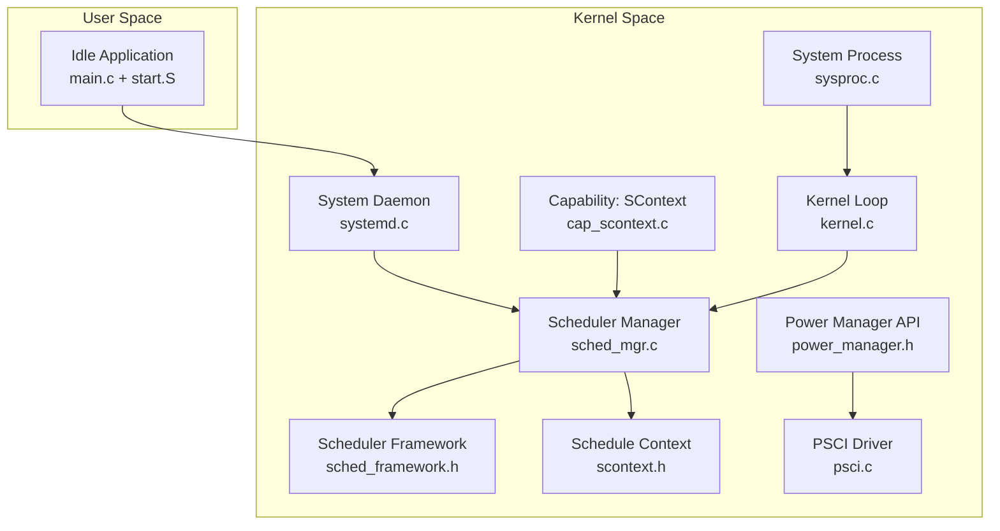
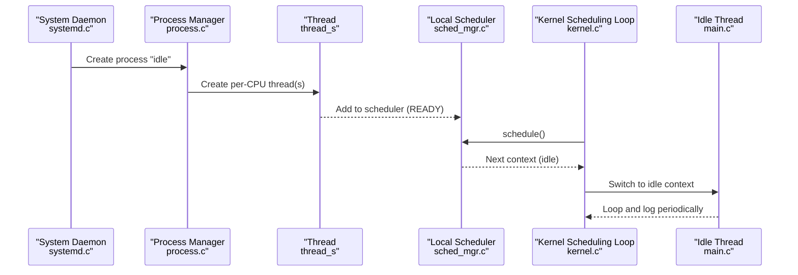
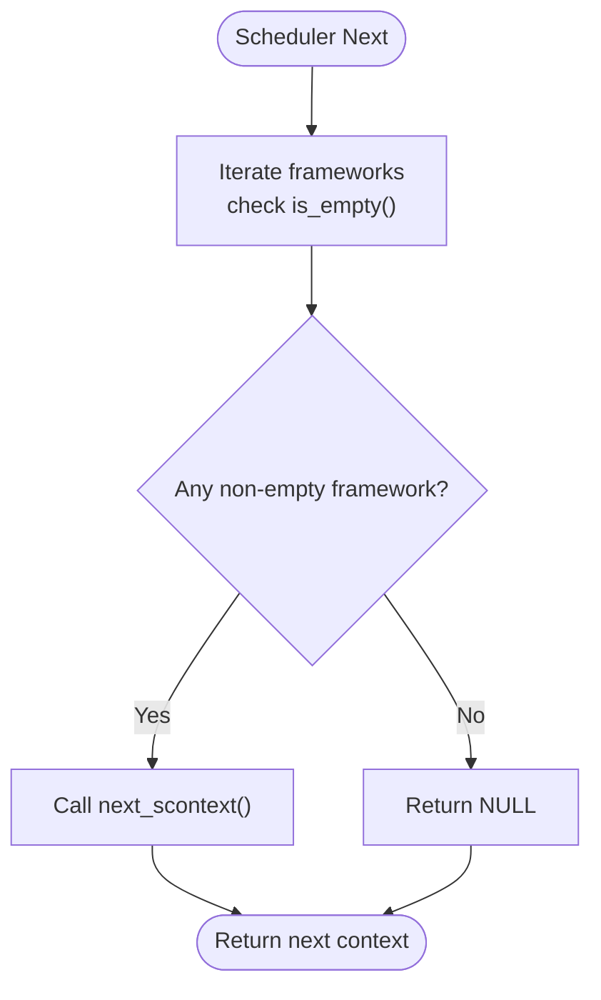
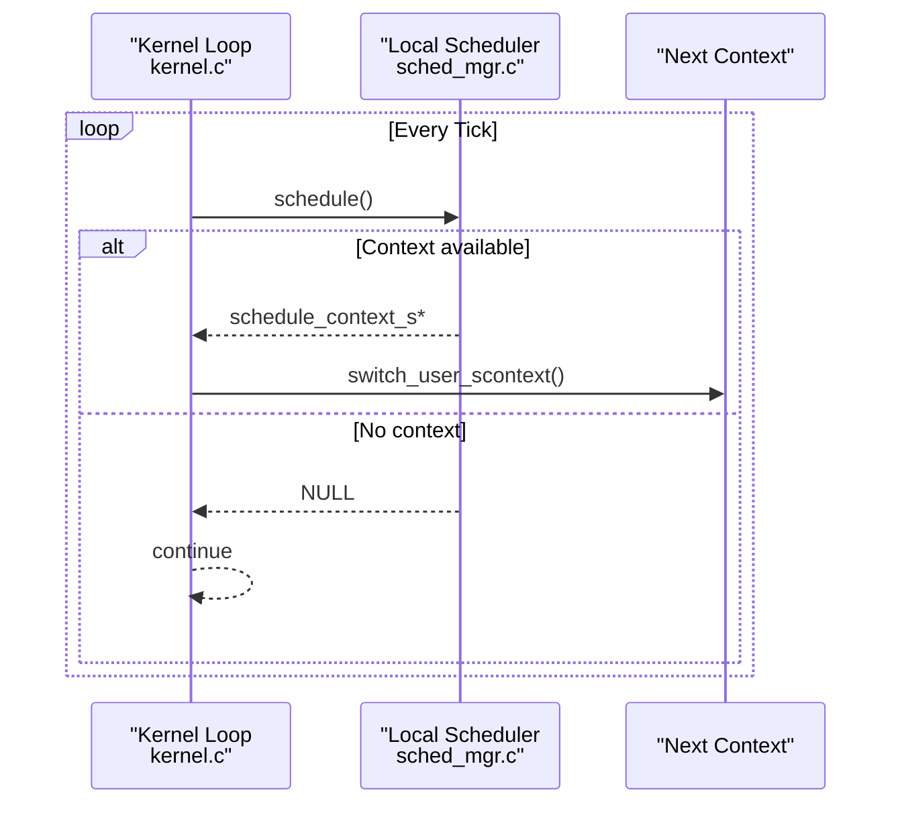
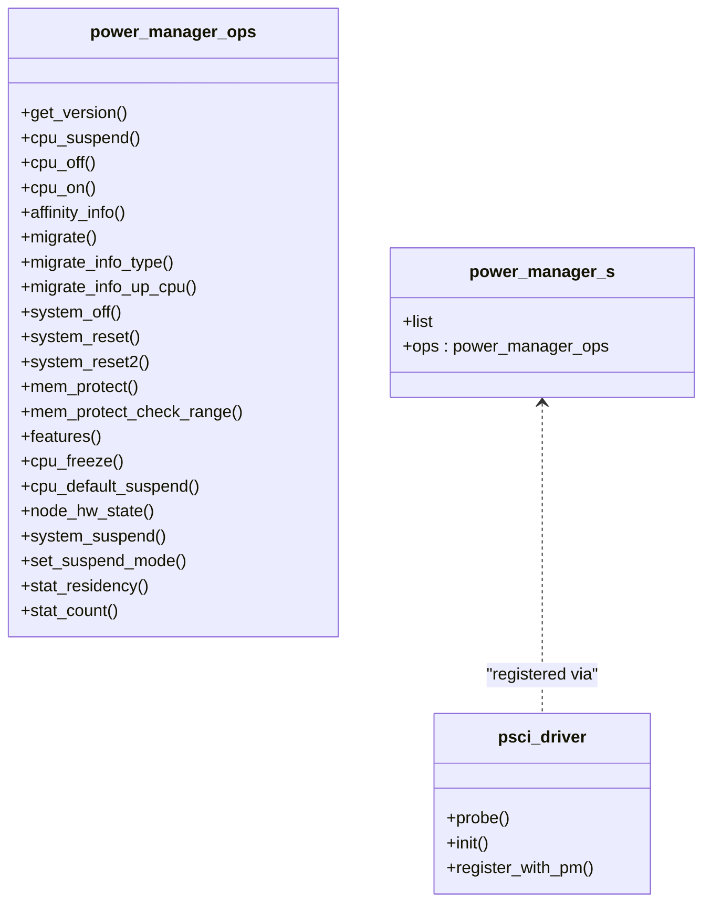
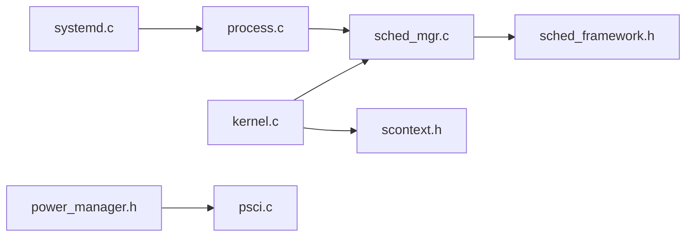

# Idle Process

<cite>
**Referenced Files in This Document**
- [idle.h](file://kernel/include/idle/idle.h)
- [main.c](file://uapps/idle/main.c)
- [start.S](file://uapps/idle/start.S)
- [systemd.c](file://kernel/systemd/systemd.c)
- [sched_mgr.c](file://kernel/schedule/sched_mgr.c)
- [sched_framework.h](file://kernel/include/scheduler/sched_framework.h)
- [scontext.h](file://kernel/include/scontext/scontext.h)
- [cap_scontext.c](file://kernel/capability/cap_scontext.c)
- [kernel.c](file://kernel/kernel.c)
- [sysproc.c](file://kernel/sysproc.c)
- [power_manager.h](file://kernel/include/power_manager.h)
- [psci.c](file://kernel/drivers/arm-psci/psci.c)
- [boot_power_manager.c](file://boot/power_manager.c)
</cite>

## Table of Contents
1. [Introduction](#introduction)
2. [Project Structure](#project-structure)
3. [Core Components](#core-components)
4. [Architecture Overview](#architecture-overview)
5. [Detailed Component Analysis](#detailed-component-analysis)
6. [Dependency Analysis](#dependency-analysis)
7. [Performance Considerations](#performance-considerations)
8. [Troubleshooting Guide](#troubleshooting-guide)
9. [Conclusion](#conclusion)

## Introduction
This document explains the Idle Process in TranquilOS, focusing on its role as a per-CPU maintenance task, its integration with the kernel’s scheduler and power management subsystems, and how it participates in system sleep and idle behaviors. It covers the user-space idle application, its deployment via the system daemon, the kernel-side scheduler framework, and the power management interface used for CPU idle and suspend operations.

## Project Structure
The Idle Process spans both user-space and kernel-space components:
- User-space idle application: a minimal loop that logs periodic progress.
- Kernel-side systemd service registry and per-CPU deployment.
- Scheduler framework and local scheduler operations.
- Power management interface and PSCI driver registration.

**Diagram sources**
- [systemd.c](file://kernel/systemd/systemd.c#L50-L74)
- [sched_mgr.c](file://kernel/schedule/sched_mgr.c#L1-L167)
- [sched_framework.h](file://kernel/include/scheduler/sched_framework.h#L1-L20)
- [scontext.h](file://kernel/include/scontext/scontext.h#L1-L49)
- [cap_scontext.c](file://kernel/capability/cap_scontext.c#L300-L341)
- [kernel.c](file://kernel/kernel.c#L112-L122)
- [sysproc.c](file://kernel/sysproc.c#L72-L83)
- [power_manager.h](file://kernel/include/power_manager.h#L2-L73)
- [psci.c](file://kernel/drivers/arm-psci/psci.c#L154-L222)

**Section sources**
- [systemd.c](file://kernel/systemd/systemd.c#L50-L74)
- [sched_mgr.c](file://kernel/schedule/sched_mgr.c#L1-L167)
- [sched_framework.h](file://kernel/include/scheduler/sched_framework.h#L1-L20)
- [scontext.h](file://kernel/include/scontext/scontext.h#L1-L49)
- [cap_scontext.c](file://kernel/capability/cap_scontext.c#L300-L341)
- [kernel.c](file://kernel/kernel.c#L112-L122)
- [sysproc.c](file://kernel/sysproc.c#L72-L83)
- [power_manager.h](file://kernel/include/power_manager.h#L2-L73)
- [psci.c](file://kernel/drivers/arm-psci/psci.c#L154-L222)

## Core Components
- Idle Application (user-space): A minimal program that loops and logs periodically. It is deployed per CPU by the system daemon.
- System Daemon: Declares the idle service as a per-CPU service and creates threads accordingly.
- Scheduler: Manages ready-to-run contexts; the idle application becomes a ready context after creation and scheduling.
- Power Management: Provides the power manager interface and PSCI driver for CPU idle/suspend operations.

Key implementation references:
- Idle application entry and loop: [main.c](file://uapps/idle/main.c#L6-L16), [start.S](file://uapps/idle/start.S#L1-L19)
- Idle service declaration and per-CPU deployment: [systemd.c](file://kernel/systemd/systemd.c#L50-L74), [systemd.c](file://kernel/systemd/systemd.c#L186-L198)
- Scheduler framework and local scheduler operations: [sched_mgr.c](file://kernel/schedule/sched_mgr.c#L1-L167), [sched_framework.h](file://kernel/include/scheduler/sched_framework.h#L1-L20)
- Schedule context lifecycle and state transitions: [scontext.h](file://kernel/include/scontext/scontext.h#L12-L43)
- Capability-based scheduling on/off: [cap_scontext.c](file://kernel/capability/cap_scontext.c#L300-L341)
- Kernel scheduling loop: [kernel.c](file://kernel/kernel.c#L112-L122)
- System process initialization and startup: [sysproc.c](file://kernel/sysproc.c#L63-L83)
- Power manager API and PSCI driver: [power_manager.h](file://kernel/include/power_manager.h#L2-L73), [psci.c](file://kernel/drivers/arm-psci/psci.c#L154-L222)

**Section sources**
- [main.c](file://uapps/idle/main.c#L6-L16)
- [start.S](file://uapps/idle/start.S#L1-L19)
- [systemd.c](file://kernel/systemd/systemd.c#L50-L74)
- [systemd.c](file://kernel/systemd/systemd.c#L186-L198)
- [sched_mgr.c](file://kernel/schedule/sched_mgr.c#L1-L167)
- [sched_framework.h](file://kernel/include/scheduler/sched_framework.h#L1-L20)
- [scontext.h](file://kernel/include/scontext/scontext.h#L12-L43)
- [cap_scontext.c](file://kernel/capability/cap_scontext.c#L300-L341)
- [kernel.c](file://kernel/kernel.c#L112-L122)
- [sysproc.c](file://kernel/sysproc.c#L63-L83)
- [power_manager.h](file://kernel/include/power_manager.h#L2-L73)
- [psci.c](file://kernel/drivers/arm-psci/psci.c#L154-L222)

## Architecture Overview
The Idle Process is a per-CPU user-space process managed by the system daemon. After ELF loading and virtual memory setup, threads are created and scheduled onto specific CPUs. The kernel’s scheduler loop selects the next context; when no higher-priority work exists, the idle context runs. Power management integrates through the power manager interface and PSCI driver, enabling CPU idle and suspend operations.

**Diagram sources**
- [systemd.c](file://kernel/systemd/systemd.c#L186-L198)
- [process.c](file://kernel/systemd/procmgr/process.c#L150-L174)
- [sched_mgr.c](file://kernel/schedule/sched_mgr.c#L74-L87)
- [kernel.c](file://kernel/kernel.c#L112-L122)
- [main.c](file://uapps/idle/main.c#L6-L16)

## Detailed Component Analysis

### Idle Application (User-Space)
- Purpose: Minimal per-CPU maintenance task that logs progress in a tight loop.
- Startup: Entry routine clears BSS and branches to main; main logs and loops.
- Behavior: Runs continuously while no higher-priority work is available; logs occur at a fixed cadence.

Implementation references:
- Entry and BSS zeroing: [start.S](file://uapps/idle/start.S#L1-L19)
- Main loop and logging: [main.c](file://uapps/idle/main.c#L6-L16)

**Section sources**
- [start.S](file://uapps/idle/start.S#L1-L19)
- [main.c](file://uapps/idle/main.c#L6-L16)

### System Daemon and Per-CPU Deployment
- Declares the idle service as a per-CPU service.
- Creates one thread per CPU with appropriate CPU affinity.
- Threads are added to the scheduler and become READY contexts.

Implementation references:
- Idle service definition: [systemd.c](file://kernel/systemd/systemd.c#L50-L74)
- Per-CPU thread creation and affinity: [systemd.c](file://kernel/systemd/systemd.c#L186-L198)

**Section sources**
- [systemd.c](file://kernel/systemd/systemd.c#L50-L74)
- [systemd.c](file://kernel/systemd/systemd.c#L186-L198)

### Scheduler Integration and Low-Priority Scheduling
- The idle thread is represented as a schedule context with READY state.
- The scheduler framework exposes add/remove/is_empty/next operations.
- The local scheduler aggregates frameworks and selects the next context; when empty, the kernel loop continues without switching.

**Diagram sources**
- [sched_mgr.c](file://kernel/schedule/sched_mgr.c#L51-L72)
- [sched_framework.h](file://kernel/include/scheduler/sched_framework.h#L6-L18)

Implementation references:
- Local scheduler operations: [sched_mgr.c](file://kernel/schedule/sched_mgr.c#L1-L167)
- Scheduler framework interface: [sched_framework.h](file://kernel/include/scheduler/sched_framework.h#L1-L20)
- Schedule context state model: [scontext.h](file://kernel/include/scontext/scontext.h#L12-L20)

**Section sources**
- [sched_mgr.c](file://kernel/schedule/sched_mgr.c#L51-L72)
- [sched_framework.h](file://kernel/include/scheduler/sched_framework.h#L6-L18)
- [scontext.h](file://kernel/include/scontext/scontext.h#L12-L20)

### Kernel Scheduling Loop and Idle Execution
- The kernel initializes per-CPU local schedulers and enters a loop that requests the next context.
- If no context is available, the loop continues; otherwise, it switches to the selected context.
- The idle thread executes when no other work is ready.

**Diagram sources**
- [kernel.c](file://kernel/kernel.c#L112-L122)
- [sched_mgr.c](file://kernel/schedule/sched_mgr.c#L74-L87)

Implementation references:
- Kernel scheduling loop: [kernel.c](file://kernel/kernel.c#L112-L122)
- System process startup and initial switch: [sysproc.c](file://kernel/sysproc.c#L72-L83)

**Section sources**
- [kernel.c](file://kernel/kernel.c#L112-L122)
- [sysproc.c](file://kernel/sysproc.c#L72-L83)

### Power Management Integration and CPU Idle States
- The power manager interface defines operations for CPU suspend/off/on and system-level actions.
- The PSCI driver probes device tree properties and registers supported operations with the power manager.
- The power manager provides a registration mechanism and a dispatch function for CPU-on requests.

**Diagram sources**
- [power_manager.h](file://kernel/include/power_manager.h#L38-L65)
- [psci.c](file://kernel/drivers/arm-psci/psci.c#L154-L222)

Implementation references:
- Power manager API: [power_manager.h](file://kernel/include/power_manager.h#L2-L73)
- PSCI driver registration: [psci.c](file://kernel/drivers/arm-psci/psci.c#L180-L222)
- Boot-time power manager usage: [boot_power_manager.c](file://boot/power_manager.c#L1-L27)

Note: The idle process itself does not directly invoke power management functions in the analyzed code. Instead, it remains a READY context in the scheduler until the kernel loop selects it during idle periods. Power management operations are exposed via the power manager interface and PSCI driver for system-level CPU idle/suspend.

**Section sources**
- [power_manager.h](file://kernel/include/power_manager.h#L2-L73)
- [psci.c](file://kernel/drivers/arm-psci/psci.c#L154-L222)
- [boot_power_manager.c](file://boot/power_manager.c#L1-L27)

## Dependency Analysis
- The system daemon depends on the process manager to create and map binaries, then schedules threads.
- The scheduler depends on the scheduler framework to manage READY contexts.
- The kernel scheduling loop depends on the local scheduler to select the next context.
- Power management is decoupled via the power manager interface; the PSCI driver registers operations independently.

**Diagram sources**
- [systemd.c](file://kernel/systemd/systemd.c#L186-L198)
- [process.c](file://kernel/systemd/procmgr/process.c#L150-L174)
- [sched_mgr.c](file://kernel/schedule/sched_mgr.c#L1-L167)
- [sched_framework.h](file://kernel/include/scheduler/sched_framework.h#L1-L20)
- [kernel.c](file://kernel/kernel.c#L112-L122)
- [scontext.h](file://kernel/include/scontext/scontext.h#L12-L43)
- [power_manager.h](file://kernel/include/power_manager.h#L2-L73)
- [psci.c](file://kernel/drivers/arm-psci/psci.c#L154-L222)

**Section sources**
- [systemd.c](file://kernel/systemd/systemd.c#L186-L198)
- [process.c](file://kernel/systemd/procmgr/process.c#L150-L174)
- [sched_mgr.c](file://kernel/schedule/sched_mgr.c#L1-L167)
- [sched_framework.h](file://kernel/include/scheduler/sched_framework.h#L1-L20)
- [kernel.c](file://kernel/kernel.c#L112-L122)
- [scontext.h](file://kernel/include/scontext/scontext.h#L12-L43)
- [power_manager.h](file://kernel/include/power_manager.h#L2-L73)
- [psci.c](file://kernel/drivers/arm-psci/psci.c#L154-L222)

## Performance Considerations
- The idle application performs a busy-wait loop with periodic logging. While simple, this keeps the CPU active and prevents deeper idle states. For power-sensitive scenarios, consider:
  - Using sleep or yield primitives to cooperatively hand back control when no work is pending.
  - Integrating with the kernel’s tickless timers or sleep infrastructure to reduce wakeups.
- The scheduler’s selection of idle indicates no higher-priority work; ensuring accurate READY queues avoids unnecessary context switches.
- Power management operations (CPU off/suspend) are handled by the power manager/PSCI; the idle process itself should remain lightweight to minimize overhead.

[No sources needed since this section provides general guidance]

## Troubleshooting Guide
- Idle process not starting:
  - Verify the idle service is declared and per-CPU threads are created: [systemd.c](file://kernel/systemd/systemd.c#L50-L74), [systemd.c](file://kernel/systemd/systemd.c#L186-L198).
  - Confirm the process manager mapped the binary and created threads: [process.c](file://kernel/systemd/procmgr/process.c#L150-L174).
- Idle not running when expected:
  - Check scheduler registration and local scheduler initialization: [sched_mgr.c](file://kernel/schedule/sched_mgr.c#L90-L129).
  - Ensure the kernel scheduling loop is active: [kernel.c](file://kernel/kernel.c#L112-L122).
- Power management integration issues:
  - Confirm the PSCI driver is loaded and registers operations: [psci.c](file://kernel/drivers/arm-psci/psci.c#L180-L222).
  - Validate power manager registration and dispatch: [boot_power_manager.c](file://boot/power_manager.c#L1-L27), [power_manager.h](file://kernel/include/power_manager.h#L2-L73).

**Section sources**
- [systemd.c](file://kernel/systemd/systemd.c#L50-L74)
- [systemd.c](file://kernel/systemd/systemd.c#L186-L198)
- [process.c](file://kernel/systemd/procmgr/process.c#L150-L174)
- [sched_mgr.c](file://kernel/schedule/sched_mgr.c#L90-L129)
- [kernel.c](file://kernel/kernel.c#L112-L122)
- [psci.c](file://kernel/drivers/arm-psci/psci.c#L180-L222)
- [boot_power_manager.c](file://boot/power_manager.c#L1-L27)
- [power_manager.h](file://kernel/include/power_manager.h#L2-L73)

## Conclusion
The Idle Process in TranquilOS is a per-CPU user-space task that becomes the lowest-priority runnable context when no other work is available. It is deployed by the system daemon, scheduled by the kernel’s scheduler framework, and executed within the kernel’s scheduling loop. While the idle process itself does not directly invoke power management, the kernel exposes a power manager interface and PSCI driver for CPU idle and suspend operations. Understanding the idle behavior—its startup sequence, scheduler integration, and relationship to power management—enables effective system monitoring and power optimization.