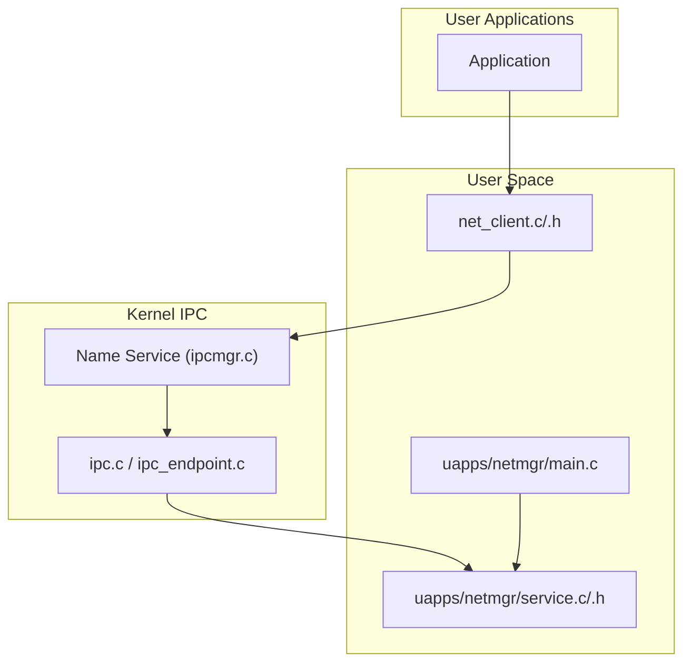
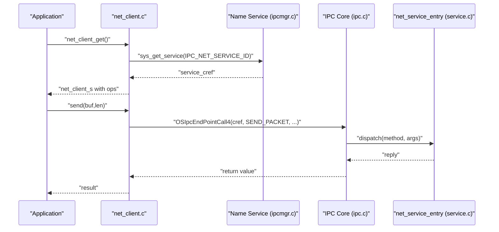
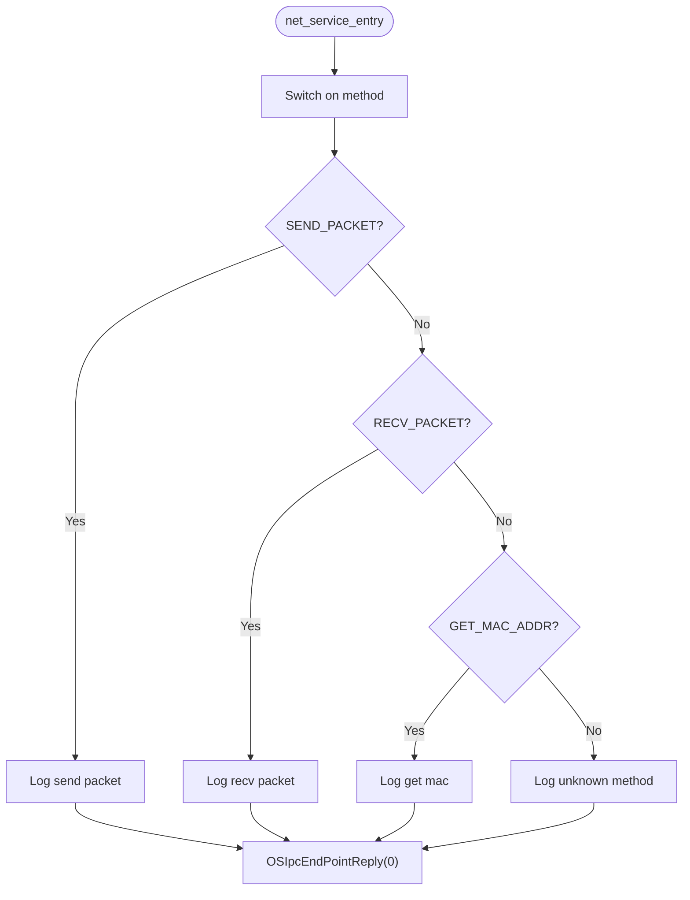
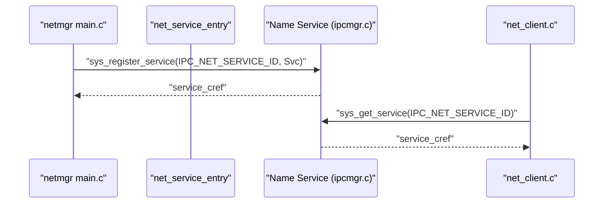
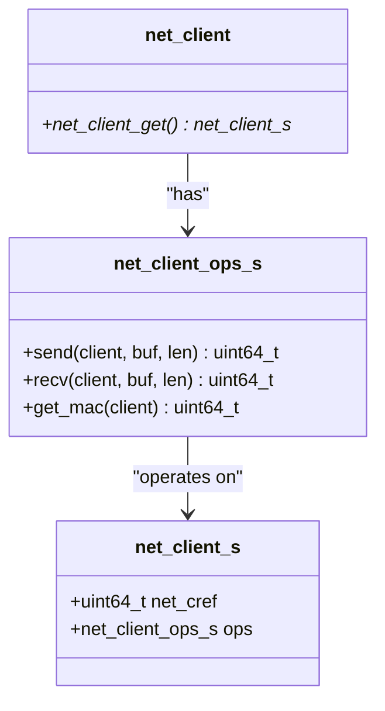
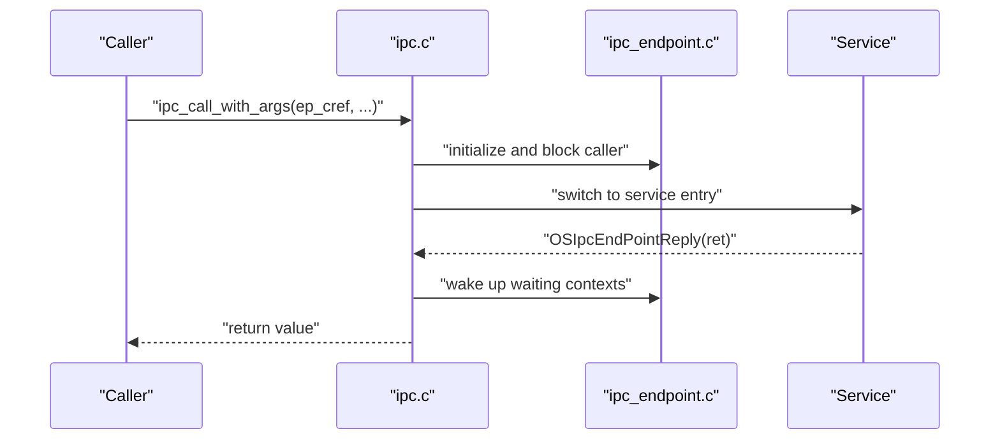
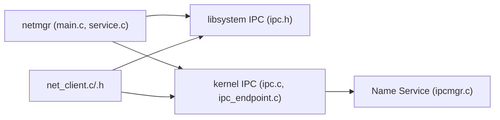

# Network Manager (netmgr)

<cite>
**Referenced Files in This Document**
- [main.c](file://uapps/netmgr/main.c)
- [service.c](file://uapps/netmgr/service.c)
- [service.h](file://uapps/netmgr/include/service.h)
- [net_client.c](file://ulibs/libsystem/net_client.c)
- [net_client.h](file://ulibs/include/libsystem/net_client.h)
- [ipc.h](file://ulibs/include/libsystem/ipc.h)
- [ipc.c](file://kernel/ipc/ipc.c)
- [ipc_endpoint.c](file://kernel/ipc/ipc_endpoint.c)
- [ipc.h](file://kernel/include/ipc/ipc.h)
- [ipc_endpoint.h](file://kernel/include/ipc/ipc_endpoint.h)
- [ipcmgr.c](file://kernel/systemd/ipcmgr/ipcmgr.c)
- [service.c](file://kernel/systemd/service.c)
</cite>

## Table of Contents
1. [Introduction](#introduction)
2. [Project Structure](#project-structure)
3. [Core Components](#core-components)
4. [Architecture Overview](#architecture-overview)
5. [Detailed Component Analysis](#detailed-component-analysis)
6. [Dependency Analysis](#dependency-analysis)
7. [Performance Considerations](#performance-considerations)
8. [Troubleshooting Guide](#troubleshooting-guide)
9. [Conclusion](#conclusion)
10. [Appendices](#appendices)

## Introduction
This document describes the Network Manager (netmgr) service in TranquilOS. It explains the network service framework, client-server communication patterns via the kernel’s IPC mechanism, and the current network protocol support surface exposed to applications. It also documents service registration, socket-like endpoint usage, and how clients discover and communicate with the network service. Guidance is included for extending network functionality and adding new network protocols, along with the relationship to the kernel’s IPC subsystem and service lifecycle management.

## Project Structure
The netmgr service is a user-space daemon that registers a named network service and exposes a small set of network operations to clients. The client library provides a thin wrapper around IPC calls to the network service. The kernel’s IPC manager mediates service registration and routing.

**Diagram sources**
- [main.c](file://uapps/netmgr/main.c#L1-L20)
- [service.c](file://uapps/netmgr/service.c#L1-L29)
- [net_client.c](file://ulibs/libsystem/net_client.c#L1-L33)
- [net_client.h](file://ulibs/include/libsystem/net_client.h#L1-L31)
- [ipc.h](file://ulibs/include/libsystem/ipc.h#L1-L73)
- [ipc.c](file://kernel/ipc/ipc.c#L1-L114)
- [ipc_endpoint.c](file://kernel/ipc/ipc_endpoint.c#L1-L82)
- [ipcmgr.c](file://kernel/systemd/ipcmgr/ipcmgr.c#L233-L319)

**Section sources**
- [main.c](file://uapps/netmgr/main.c#L1-L20)
- [service.c](file://uapps/netmgr/service.c#L1-L29)
- [net_client.c](file://ulibs/libsystem/net_client.c#L1-L33)
- [net_client.h](file://ulibs/include/libsystem/net_client.h#L1-L31)
- [ipc.h](file://ulibs/include/libsystem/ipc.h#L1-L73)
- [ipc.c](file://kernel/ipc/ipc.c#L1-L114)
- [ipc_endpoint.c](file://kernel/ipc/ipc_endpoint.c#L1-L82)
- [ipcmgr.c](file://kernel/systemd/ipcmgr/ipcmgr.c#L233-L319)

## Core Components
- Network service entry point: Implements the network service IPC endpoint and dispatches methods for packet send/receive and MAC address retrieval.
- Service registration: Registers the network service with the kernel’s name service so clients can discover it by ID.
- Client library: Provides a typed client interface with methods for sending packets, receiving packets, and retrieving the MAC address. It resolves the service CRef via the name service and caches it.
- IPC core: Handles IPC call dispatch, context switching, and replies between caller and service.

Key responsibilities:
- netmgr service: Exposes a stable IPC interface for network operations and manages service lifecycle registration.
- net_client: Encapsulates IPC calls and provides a simple API for applications.
- Name service: Assigns and returns endpoint CRefs for registered services.

**Section sources**
- [service.c](file://uapps/netmgr/service.c#L6-L22)
- [service.c](file://uapps/netmgr/service.c#L24-L28)
- [net_client.c](file://ulibs/libsystem/net_client.c#L7-L17)
- [net_client.c](file://ulibs/libsystem/net_client.c#L19-L32)
- [ipc.h](file://ulibs/include/libsystem/ipc.h#L53-L70)
- [ipcmgr.c](file://kernel/systemd/ipcmgr/ipcmgr.c#L237-L287)

## Architecture Overview
The network service follows a classic client-service model:
- Clients call sys_get_service to obtain a capability reference (CRef) to the network service.
- Clients invoke methods on the network service via IPC endpoints.
- The kernel’s name service maintains a registry of services and their endpoints.
- The kernel’s IPC core transfers control to the service endpoint and handles replies.

**Diagram sources**
- [net_client.c](file://ulibs/libsystem/net_client.c#L19-L32)
- [ipc.h](file://ulibs/include/libsystem/ipc.h#L61-L70)
- [ipcmgr.c](file://kernel/systemd/ipcmgr/ipcmgr.c#L237-L287)
- [ipc.c](file://kernel/ipc/ipc.c#L9-L76)
- [service.c](file://uapps/netmgr/service.c#L6-L22)

## Detailed Component Analysis

### Network Service Endpoint
The network service endpoint accepts method-based requests and performs logging. It currently does not implement packet forwarding or hardware interaction. Replies are sent via the IPC endpoint reply mechanism.

**Diagram sources**
- [service.c](file://uapps/netmgr/service.c#L6-L22)

**Section sources**
- [service.c](file://uapps/netmgr/service.c#L6-L22)

### Service Registration and Discovery
The network service registers itself with the kernel’s name service during initialization. Clients discover the service by ID and receive a CRef to the endpoint.

**Diagram sources**
- [main.c](file://uapps/netmgr/main.c#L7-L10)
- [service.c](file://uapps/netmgr/service.c#L24-L28)
- [ipc.h](file://ulibs/include/libsystem/ipc.h#L53-L70)
- [ipcmgr.c](file://kernel/systemd/ipcmgr/ipcmgr.c#L237-L287)

**Section sources**
- [main.c](file://uapps/netmgr/main.c#L7-L10)
- [service.c](file://uapps/netmgr/service.c#L24-L28)
- [ipc.h](file://ulibs/include/libsystem/ipc.h#L53-L70)
- [ipcmgr.c](file://kernel/systemd/ipcmgr/ipcmgr.c#L237-L287)

### Client API and IPC Calls
The client library encapsulates three operations:
- Send packet
- Receive packet
- Get MAC address

It resolves the service CRef once and caches it for reuse.

**Diagram sources**
- [net_client.h](file://ulibs/include/libsystem/net_client.h#L17-L26)
- [net_client.c](file://ulibs/libsystem/net_client.c#L5-L32)

**Section sources**
- [net_client.c](file://ulibs/libsystem/net_client.c#L7-L17)
- [net_client.c](file://ulibs/libsystem/net_client.c#L19-L32)
- [net_client.h](file://ulibs/include/libsystem/net_client.h#L7-L26)

### IPC Core and Endpoint Management
The kernel’s IPC core:
- Transfers execution to the service endpoint with arguments
- Blocks the caller until the service replies
- Wakes up the caller and returns the result

Endpoint management tracks waiting contexts and supports wake-up.

**Diagram sources**
- [ipc.c](file://kernel/ipc/ipc.c#L9-L76)
- [ipc_endpoint.c](file://kernel/ipc/ipc_endpoint.c#L7-L25)
- [ipc_endpoint.c](file://kernel/ipc/ipc_endpoint.c#L51-L82)

**Section sources**
- [ipc.c](file://kernel/ipc/ipc.c#L9-L76)
- [ipc_endpoint.c](file://kernel/ipc/ipc_endpoint.c#L7-L25)
- [ipc_endpoint.c](file://kernel/ipc/ipc_endpoint.c#L51-L82)

## Dependency Analysis
- netmgr depends on:
  - libsystem IPC helpers for service registration and discovery
  - Kernel IPC core for endpoint invocation and replies
  - Name service for service registry and CRef resolution
- net_client depends on:
  - libsystem IPC helpers
  - Kernel IPC core for endpoint calls
- The kernel’s IPC core depends on scheduling and context management.

**Diagram sources**
- [main.c](file://uapps/netmgr/main.c#L1-L20)
- [service.c](file://uapps/netmgr/service.c#L1-L29)
- [ipc.h](file://ulibs/include/libsystem/ipc.h#L1-L73)
- [ipc.c](file://kernel/ipc/ipc.c#L1-L114)
- [ipc_endpoint.c](file://kernel/ipc/ipc_endpoint.c#L1-L82)
- [ipcmgr.c](file://kernel/systemd/ipcmgr/ipcmgr.c#L233-L319)

**Section sources**
- [main.c](file://uapps/netmgr/main.c#L1-L20)
- [service.c](file://uapps/netmgr/service.c#L1-L29)
- [ipc.h](file://ulibs/include/libsystem/ipc.h#L1-L73)
- [ipc.c](file://kernel/ipc/ipc.c#L1-L114)
- [ipc_endpoint.c](file://kernel/ipc/ipc_endpoint.c#L1-L82)
- [ipcmgr.c](file://kernel/systemd/ipcmgr/ipcmgr.c#L233-L319)

## Performance Considerations
- IPC overhead: Each client call involves context switches and endpoint dispatch. Batch operations or shared buffers can reduce overhead.
- Blocking behavior: The IPC core blocks callers until replies. Avoid long-running work inside the service endpoint to keep latency low.
- Logging: Debug logs are useful but can impact performance under load; adjust verbosity in production builds.
- Caching: The client caches the service CRef to avoid repeated lookups.

[No sources needed since this section provides general guidance]

## Troubleshooting Guide
Common issues and remedies:
- Service not found: The client retries getting the service CRef. Verify the service is registered and the name service is initialized.
- Unknown method errors: Ensure the client sends supported methods and the service endpoint matches the expected signature.
- IPC deadlocks: Confirm that the service endpoint always replies to prevent callers from blocking indefinitely.

**Section sources**
- [ipc.h](file://ulibs/include/libsystem/ipc.h#L61-L70)
- [service.c](file://uapps/netmgr/service.c#L17-L20)
- [ipc.c](file://kernel/ipc/ipc.c#L78-L114)

## Conclusion
The netmgr service provides a minimal, extensible foundation for network operations in TranquilOS. It leverages the kernel’s IPC and name service to expose a simple client API for packet send/receive and MAC retrieval. While the current implementation focuses on the IPC surface, future extensions can integrate with device drivers and higher-layer protocols by expanding the service endpoint and adding protocol-specific methods.

[No sources needed since this section summarizes without analyzing specific files]

## Appendices

### Network Operations Reference
- Method: Send packet
  - Client: net_client_send
  - Service: IPC_NET_SERVICE_FUNCTION_SEND_PACKET
- Method: Receive packet
  - Client: net_client_recv
  - Service: IPC_NET_SERVICE_FUNCTION_RECV_PACKET
- Method: Get MAC address
  - Client: net_client_get_mac
  - Service: IPC_NET_SERVICE_FUNCTION_GET_MAC_ADDR

**Section sources**
- [net_client.h](file://ulibs/include/libsystem/net_client.h#L7-L11)
- [net_client.c](file://ulibs/libsystem/net_client.c#L7-L17)

### Extending Network Functionality
To add new network protocols or operations:
- Define new methods in the client header and service dispatch.
- Extend the service endpoint to handle new methods and implement protocol logic.
- Integrate with device drivers by adding device probing and hardware interaction in the service or a dedicated driver manager.
- Ensure proper IPC replies and error handling to maintain responsiveness.

[No sources needed since this section provides general guidance]