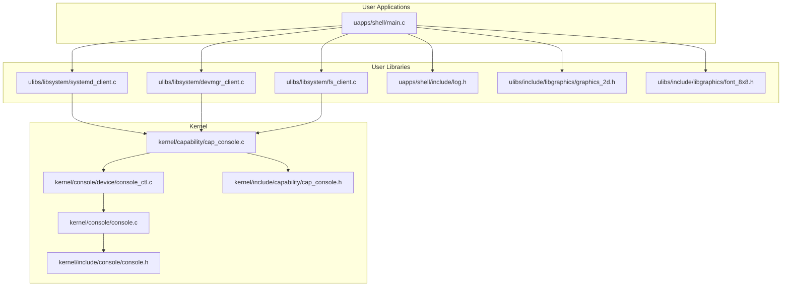
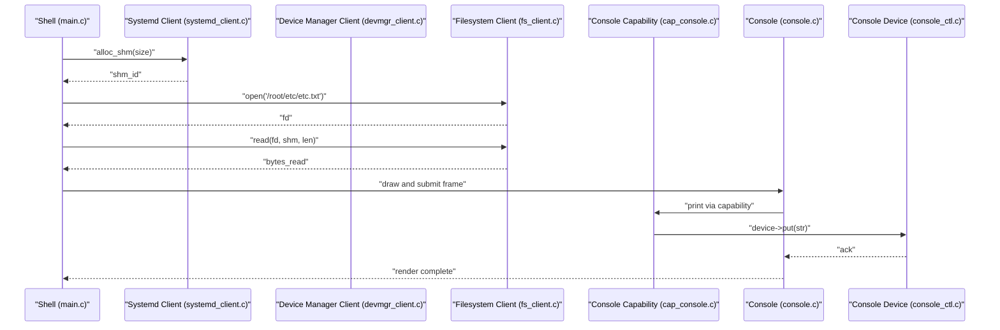
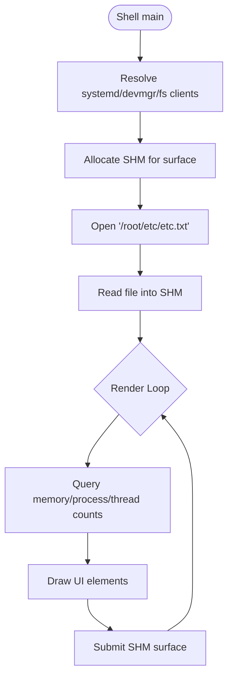
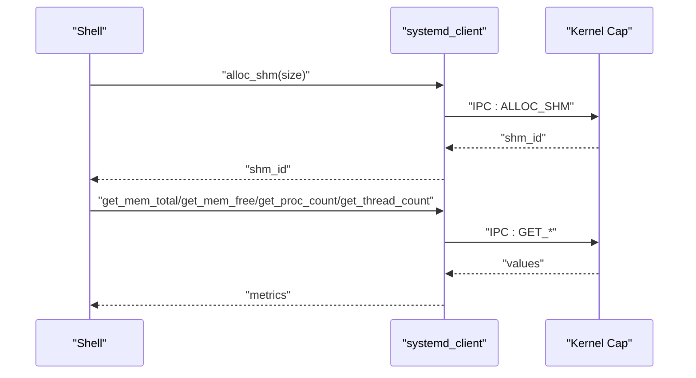
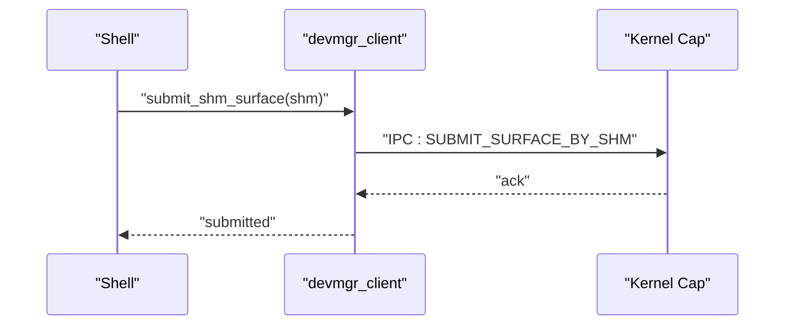
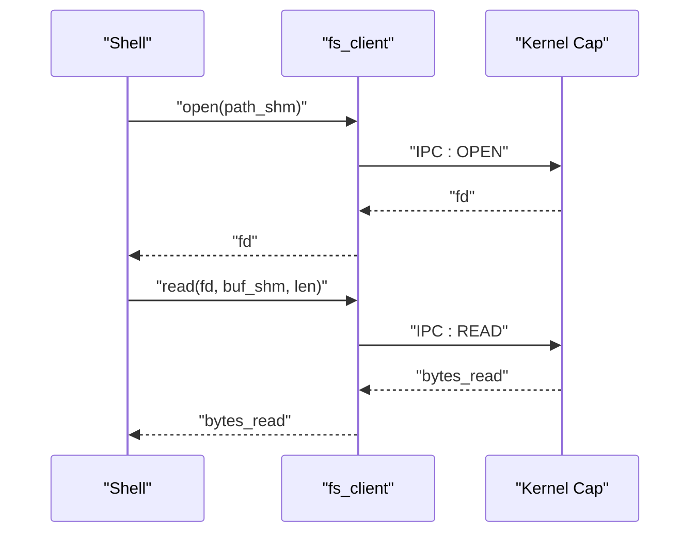
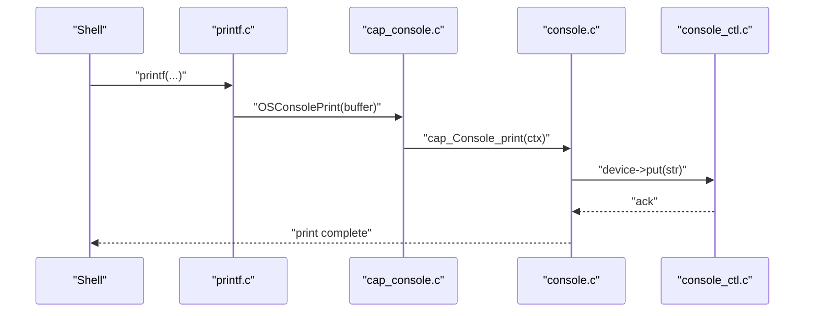
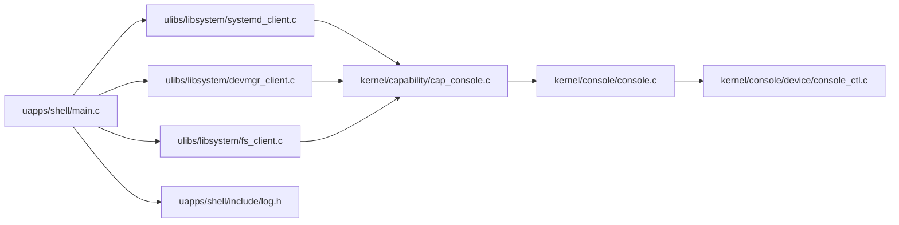

# Shell Interface

<cite>
**Referenced Files in This Document**
- [main.c](file://uapps/shell/main.c)
- [log.h](file://uapps/shell/include/log.h)
- [printf.c](file://ulibs/libc/printf.c)
- [cap_console.h](file://kernel/include/capability/cap_console.h)
- [cap_console.c](file://kernel/capability/cap_console.c)
- [console.h](file://kernel/include/console/console.h)
- [console.c](file://kernel/console/console.c)
- [console_ctl.c](file://kernel/console/device/console_ctl.c)
- [systemd_client.h](file://ulibs/include/libsystem/systemd_client.h)
- [systemd_client.c](file://ulibs/libsystem/systemd_client.c)
- [devmgr_client.h](file://ulibs/include/libsystem/devmgr_client.h)
- [devmgr_client.c](file://ulibs/libsystem/devmgr_client.c)
- [fs_client.h](file://ulibs/include/libsystem/fs_client.h)
- [fs_client.c](file://ulibs/libsystem/fs_client.c)
- [graphics_2d.h](file://ulibs/include/libgraphics/graphics_2d.h)
- [font_8x8.h](file://ulibs/include/libgraphics/font_8x8.h)
</cite>

## Table of Contents
1. [Introduction](#introduction)
2. [Project Structure](#project-structure)
3. [Core Components](#core-components)
4. [Architecture Overview](#architecture-overview)
5. [Detailed Component Analysis](#detailed-component-analysis)
6. [Dependency Analysis](#dependency-analysis)
7. [Performance Considerations](#performance-considerations)
8. [Troubleshooting Guide](#troubleshooting-guide)
9. [Conclusion](#conclusion)
10. [Appendices](#appendices)

## Introduction
This document describes the Shell Interface application in TranquilOS. It explains how the shell acts as a user interface, how it integrates with system services via capabilities and IPC, and how it performs basic input/output operations through the kernel’s console system. It also covers the shell’s startup sequence, environment handling, and how to extend the shell with new commands and customize the user interface.

## Project Structure
The shell application resides under uapps/shell and uses libraries from ulibs to communicate with system services (systemd, devmgr, filesystem) and to render graphics. The console subsystem is implemented in the kernel and exposed to userland via capabilities and console devices.

**Diagram sources**
- [main.c](file://uapps/shell/main.c#L1-L72)
- [systemd_client.c](file://ulibs/libsystem/systemd_client.c#L1-L65)
- [devmgr_client.c](file://ulibs/libsystem/devmgr_client.c#L1-L25)
- [fs_client.c](file://ulibs/libsystem/fs_client.c#L1-L45)
- [log.h](file://uapps/shell/include/log.h#L1-L31)
- [graphics_2d.h](file://ulibs/include/libgraphics/graphics_2d.h)
- [font_8x8.h](file://ulibs/include/libgraphics/font_8x8.h)
- [cap_console.c](file://kernel/capability/cap_console.c#L1-L39)
- [console.c](file://kernel/console/console.c#L1-L30)
- [console_ctl.c](file://kernel/console/device/console_ctl.c#L1-L54)
- [console.h](file://kernel/include/console/console.h#L1-L25)
- [cap_console.h](file://kernel/include/capability/cap_console.h#L1-L12)

**Section sources**
- [main.c](file://uapps/shell/main.c#L1-L72)
- [log.h](file://uapps/shell/include/log.h#L1-L31)

## Core Components
- Shell application entrypoint and rendering loop:
  - Initializes shared memory surfaces, reads a file via the filesystem service, and continuously renders system UI elements.
  - Uses logging macros and graphics primitives to draw shapes and text.
- System service clients:
  - systemd_client: allocates shared memory, queries memory and process/thread counts, and submits upcalls.
  - devmgr_client: submits SHM-backed surfaces to the display manager.
  - fs_client: opens, reads, writes, and closes files via shared memory for argument passing and buffers.
- Console integration:
  - printf routes output through OSConsolePrint, which is handled by the kernel console subsystem and capability dispatch.

Key responsibilities:
- Startup: resolve service CRefs, allocate SHM, initialize graphics surface, and enter rendering loop.
- Rendering: compute metrics, draw UI, and submit frames.
- I/O: log messages and print formatted strings to the console.

**Section sources**
- [main.c](file://uapps/shell/main.c#L34-L72)
- [systemd_client.c](file://ulibs/libsystem/systemd_client.c#L45-L65)
- [devmgr_client.c](file://ulibs/libsystem/devmgr_client.c#L13-L25)
- [fs_client.c](file://ulibs/libsystem/fs_client.c#L31-L45)
- [printf.c](file://ulibs/libc/printf.c#L198-L211)
- [cap_console.c](file://kernel/capability/cap_console.c#L17-L22)

## Architecture Overview
The shell orchestrates user interface rendering and system interactions through well-defined client APIs and kernel capabilities. The rendering loop updates a shared-memory surface and submits it to the device manager. Logging and printing go through the console capability, which prints to the appropriate console device.

**Diagram sources**
- [main.c](file://uapps/shell/main.c#L34-L72)
- [systemd_client.c](file://ulibs/libsystem/systemd_client.c#L6-L8)
- [devmgr_client.c](file://ulibs/libsystem/devmgr_client.c#L5-L7)
- [fs_client.c](file://ulibs/libsystem/fs_client.c#L9-L17)
- [cap_console.c](file://kernel/capability/cap_console.c#L17-L22)
- [console.c](file://kernel/console/console.c#L4-L18)
- [console_ctl.c](file://kernel/console/device/console_ctl.c#L29-L40)

## Detailed Component Analysis

### Shell Application (Entry and Rendering Loop)
- Responsibilities:
  - Resolve service clients (systemd, devmgr, filesystem).
  - Allocate shared memory for rendering and file operations.
  - Render UI elements and submit frames to the display manager.
  - Periodically query system metrics and update the UI.
- Key behaviors:
  - Continuous loop updating frame count and metrics.
  - Drawing circles, rectangles, and text using graphics primitives.
  - Submitting SHM-backed surfaces to the device manager.

**Diagram sources**
- [main.c](file://uapps/shell/main.c#L34-L72)

**Section sources**
- [main.c](file://uapps/shell/main.c#L34-L72)

### Systemd Client (Shared Memory and Metrics)
- Responsibilities:
  - Provide IPC wrappers for allocating/freeing shared memory.
  - Query system-wide metrics (memory totals, process/thread counts).
  - Register upcalls and handle page faults.
- Usage pattern:
  - Allocate SHM for large payloads (e.g., file paths).
  - Use returned SHM IDs as virtual addresses in user space for IPC.

**Diagram sources**
- [systemd_client.c](file://ulibs/libsystem/systemd_client.c#L6-L31)
- [systemd_client.h](file://ulibs/include/libsystem/systemd_client.h#L7-L23)

**Section sources**
- [systemd_client.c](file://ulibs/libsystem/systemd_client.c#L1-L65)
- [systemd_client.h](file://ulibs/include/libsystem/systemd_client.h#L1-L84)

### Device Manager Client (Surface Submission)
- Responsibilities:
  - Submit SHM-backed surfaces to the device manager for display.
  - Retrieve CPIO address for early boot assets.
- Usage pattern:
  - After drawing, submit the SHM ID so the device manager can present it.

**Diagram sources**
- [devmgr_client.c](file://ulibs/libsystem/devmgr_client.c#L5-L7)
- [devmgr_client.h](file://ulibs/include/libsystem/devmgr_client.h#L7-L12)

**Section sources**
- [devmgr_client.c](file://ulibs/libsystem/devmgr_client.c#L1-L25)
- [devmgr_client.h](file://ulibs/include/libsystem/devmgr_client.h#L1-L43)

### Filesystem Client (File Operations)
- Responsibilities:
  - Open/close files and read/write via shared memory.
  - Manage temporary SHM buffers for paths and data.
- Usage pattern:
  - Allocate SHM for the file path, pass it to the FS service, then read into another SHM buffer.

**Diagram sources**
- [fs_client.c](file://ulibs/libsystem/fs_client.c#L9-L21)
- [fs_client.h](file://ulibs/include/libsystem/fs_client.h#L7-L12)

**Section sources**
- [fs_client.c](file://ulibs/libsystem/fs_client.c#L1-L45)
- [fs_client.h](file://ulibs/include/libsystem/fs_client.h#L1-L47)

### Console Integration (Logging and Printing)
- Responsibilities:
  - Provide logging macros with CPU and monotonic time stamps.
  - Route printf output to the kernel console via OSConsolePrint.
  - Kernel capability dispatch handles console methods (create, print, destroy).
- Behavior:
  - printf formats a buffer and calls OSConsolePrint, which is implemented in the kernel console layer.

**Diagram sources**
- [printf.c](file://ulibs/libc/printf.c#L198-L211)
- [cap_console.c](file://kernel/capability/cap_console.c#L17-L22)
- [console.c](file://kernel/console/console.c#L4-L18)
- [console_ctl.c](file://kernel/console/device/console_ctl.c#L29-L40)
- [cap_console.h](file://kernel/include/capability/cap_console.h#L1-L12)
- [console.h](file://kernel/include/console/console.h#L1-L25)

**Section sources**
- [log.h](file://uapps/shell/include/log.h#L1-L31)
- [printf.c](file://ulibs/libc/printf.c#L198-L211)
- [cap_console.c](file://kernel/capability/cap_console.c#L1-L39)
- [console.c](file://kernel/console/console.c#L1-L30)
- [console_ctl.c](file://kernel/console/device/console_ctl.c#L1-L54)
- [cap_console.h](file://kernel/include/capability/cap_console.h#L1-L12)
- [console.h](file://kernel/include/console/console.h#L1-L25)

## Dependency Analysis
The shell depends on userland clients for system services and on kernel capabilities for console operations. The clients encapsulate IPC calls and expose convenient APIs. The console path involves capability dispatch to device drivers.

**Diagram sources**
- [main.c](file://uapps/shell/main.c#L1-L72)
- [systemd_client.c](file://ulibs/libsystem/systemd_client.c#L1-L65)
- [devmgr_client.c](file://ulibs/libsystem/devmgr_client.c#L1-L25)
- [fs_client.c](file://ulibs/libsystem/fs_client.c#L1-L45)
- [cap_console.c](file://kernel/capability/cap_console.c#L1-L39)
- [console.c](file://kernel/console/console.c#L1-L30)
- [console_ctl.c](file://kernel/console/device/console_ctl.c#L1-L54)

**Section sources**
- [main.c](file://uapps/shell/main.c#L1-L72)
- [systemd_client.c](file://ulibs/libsystem/systemd_client.c#L1-L65)
- [devmgr_client.c](file://ulibs/libsystem/devmgr_client.c#L1-L25)
- [fs_client.c](file://ulibs/libsystem/fs_client.c#L1-L45)
- [cap_console.c](file://kernel/capability/cap_console.c#L1-L39)
- [console.c](file://kernel/console/console.c#L1-L30)
- [console_ctl.c](file://kernel/console/device/console_ctl.c#L1-L54)

## Performance Considerations
- Shared memory allocation:
  - Reuse SHM buffers when possible to reduce allocation overhead.
  - Free SHM promptly after use to avoid fragmentation.
- Rendering loop:
  - Keep drawing operations lightweight; batch updates when feasible.
  - Limit frame rate if necessary to conserve resources.
- IPC calls:
  - Minimize round-trips by batching related operations.
  - Use appropriate buffer sizes to avoid repeated allocations.

## Troubleshooting Guide
- No output to console:
  - Verify console device registration and capability dispatch.
  - Check that OSConsolePrint is routed to a valid console device.
- File operations fail:
  - Confirm SHM allocation for paths and buffers.
  - Ensure the file path exists and permissions are correct.
- Surface submission errors:
  - Validate SHM ID correctness and that the device manager is reachable.
- Logging anomalies:
  - Ensure log macros are compiled in and that timestamps are available.

**Section sources**
- [printf.c](file://ulibs/libc/printf.c#L198-L211)
- [cap_console.c](file://kernel/capability/cap_console.c#L17-L22)
- [console_ctl.c](file://kernel/console/device/console_ctl.c#L29-L40)
- [fs_client.c](file://ulibs/libsystem/fs_client.c#L9-L17)
- [devmgr_client.c](file://ulibs/libsystem/devmgr_client.c#L5-L7)

## Conclusion
The Shell Interface in TranquilOS demonstrates a clean separation of concerns: the shell manages rendering and user interaction, while userland clients abstract kernel services through IPC. The console integration ensures robust output via kernel capabilities and console devices. Extending the shell involves adding new commands via client APIs and integrating new UI elements through the graphics library.

## Appendices

### A. Shell Startup Sequence
- Resolve service CRefs for systemd, devmgr, and filesystem.
- Allocate SHM for rendering and temporary buffers.
- Initialize graphics surface and load initial data (e.g., file contents).
- Enter continuous rendering loop, periodically updating metrics and redrawing.

**Section sources**
- [main.c](file://uapps/shell/main.c#L34-L72)
- [systemd_client.c](file://ulibs/libsystem/systemd_client.c#L45-L65)
- [devmgr_client.c](file://ulibs/libsystem/devmgr_client.c#L13-L25)
- [fs_client.c](file://ulibs/libsystem/fs_client.c#L31-L45)

### B. Environment Handling
- Logging macros embed CPU ID and monotonic time for traceability.
- Services are discovered dynamically via service IDs and CRefs.

**Section sources**
- [log.h](file://uapps/shell/include/log.h#L10-L29)
- [systemd_client.c](file://ulibs/libsystem/systemd_client.c#L49-L52)
- [devmgr_client.c](file://ulibs/libsystem/devmgr_client.c#L17-L20)
- [fs_client.c](file://ulibs/libsystem/fs_client.c#L35-L38)

### C. Basic Input/Output Operations
- Printing:
  - Use printf; it formats a buffer and calls OSConsolePrint.
  - Kernel capability dispatch routes to the console device.
- Reading/writing files:
  - Use fs_client open/read/write/close with SHM buffers for paths and data.

**Section sources**
- [printf.c](file://ulibs/libc/printf.c#L198-L211)
- [cap_console.c](file://kernel/capability/cap_console.c#L17-L22)
- [fs_client.c](file://ulibs/libsystem/fs_client.c#L9-L29)

### D. Extending the Shell with New Commands
- Add a new command:
  - Define a new IPC function in the relevant client header and implement it in the client source.
  - Integrate the command into the shell’s command loop or menu.
- Customize the user interface:
  - Extend the drawing routines using the graphics library and submit updated surfaces to the device manager.

**Section sources**
- [systemd_client.h](file://ulibs/include/libsystem/systemd_client.h#L7-L23)
- [systemd_client.c](file://ulibs/libsystem/systemd_client.c#L6-L31)
- [devmgr_client.h](file://ulibs/include/libsystem/devmgr_client.h#L7-L12)
- [devmgr_client.c](file://ulibs/libsystem/devmgr_client.c#L5-L7)
- [graphics_2d.h](file://ulibs/include/libgraphics/graphics_2d.h)
- [font_8x8.h](file://ulibs/include/libgraphics/font_8x8.h)