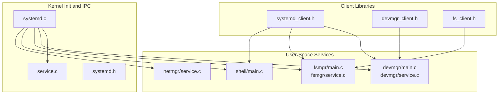
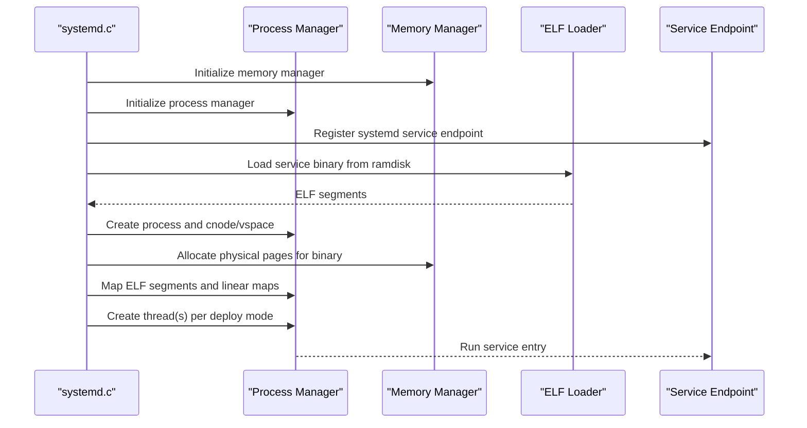
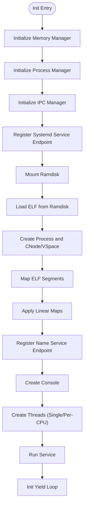
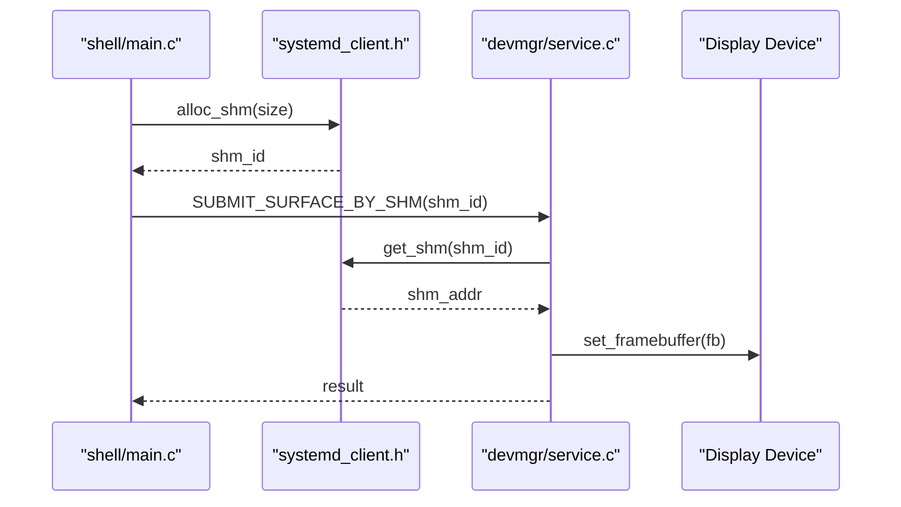
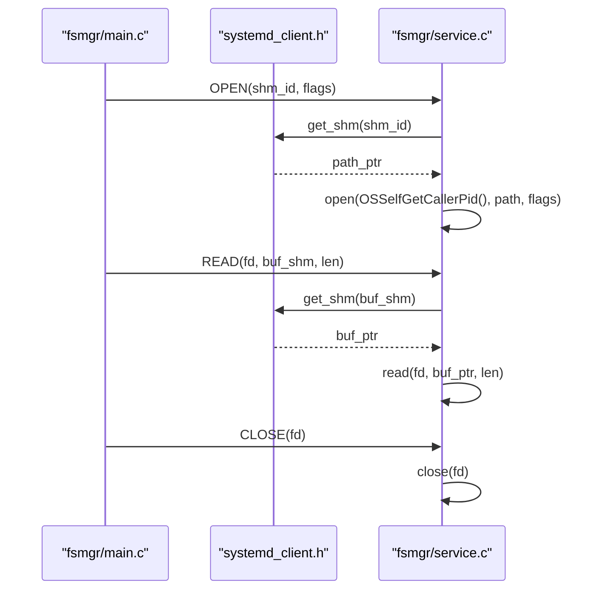
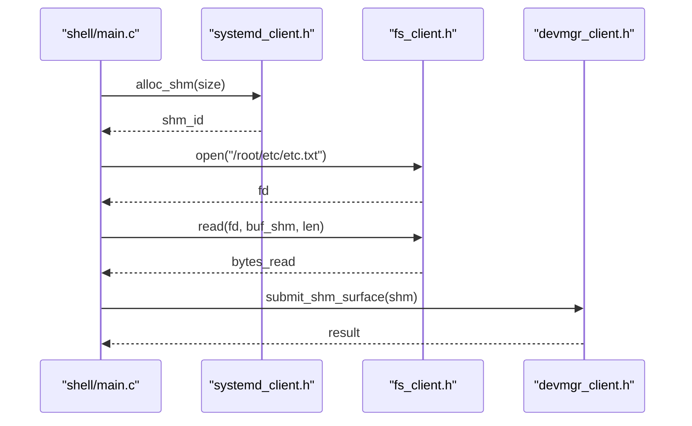
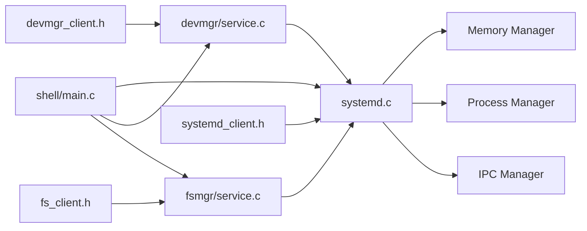

# User Applications and Services

<cite>
**Referenced Files in This Document**
- [systemd.c](file://kernel/systemd/systemd.c)
- [service.c](file://kernel/systemd/service.c)
- [systemd.h](file://kernel/systemd/include/systemd.h)
- [systemd_client.h](file://ulibs/include/libsystem/systemd_client.h)
- [devmgr_client.h](file://ulibs/include/libsystem/devmgr_client.h)
- [fs_client.h](file://ulibs/include/libsystem/fs_client.h)
- [main.c (devmgr)](file://uapps/devmgr/main.c)
- [service.c (devmgr)](file://uapps/devmgr/service.c)
- [main.c (fsmgr)](file://uapps/fsmgr/main.c)
- [service.c (fsmgr)](file://uapps/fsmgr/service.c)
- [main.c (shell)](file://uapps/shell/main.c)
- [service.c (netmgr)](file://uapps/netmgr/service.c)
</cite>

## Table of Contents
1. [Introduction](#introduction)
2. [Project Structure](#project-structure)
3. [Core Components](#core-components)
4. [Architecture Overview](#architecture-overview)
5. [Detailed Component Analysis](#detailed-component-analysis)
6. [Dependency Analysis](#dependency-analysis)
7. [Performance Considerations](#performance-considerations)
8. [Troubleshooting Guide](#troubleshooting-guide)
9. [Conclusion](#conclusion)
10. [Appendices](#appendices)

## Introduction
This document explains the user-space service architecture of TranquilOS, focusing on how services are launched, discovered, and communicate with each other and with kernel services. It covers the systemd-like init system, core services such as device manager, file system manager, and shell, and the IPC mechanisms that enable service-to-service collaboration. It also provides guidance for implementing new user-space services, managing shared memory, registering upcalls, and integrating with the init framework.

## Project Structure
At a high level, the user-space services live under uapps/, while the init and IPC infrastructure resides in kernel/systemd/. Client-side APIs for service communication are provided by ulibs/include/libsystem/.

**Diagram sources**
- [systemd.c](file://kernel/systemd/systemd.c#L217-L246)
- [service.c](file://kernel/systemd/service.c#L232-L236)
- [systemd.h](file://kernel/systemd/include/systemd.h#L4-L32)
- [main.c (devmgr)](file://uapps/devmgr/main.c#L6-L18)
- [service.c (devmgr)](file://uapps/devmgr/service.c#L68-L72)
- [main.c (fsmgr)](file://uapps/fsmgr/main.c#L17-L38)
- [service.c (fsmgr)](file://uapps/fsmgr/service.c#L102-L106)
- [main.c (shell)](file://uapps/shell/main.c#L34-L72)
- [service.c (netmgr)](file://uapps/netmgr/service.c#L24-L28)
- [systemd_client.h](file://ulibs/include/libsystem/systemd_client.h#L77-L84)
- [devmgr_client.h](file://ulibs/include/libsystem/devmgr_client.h#L36-L43)
- [fs_client.h](file://ulibs/include/libsystem/fs_client.h#L40-L47)

**Section sources**
- [systemd.c](file://kernel/systemd/systemd.c#L15-L74)
- [systemd.h](file://kernel/systemd/include/systemd.h#L4-L32)

## Core Components
- Systemd init: Launches core services, sets up memory and IPC managers, and runs a loop to keep the system alive.
- Core services:
  - Device manager: Manages display devices and exposes a service endpoint for submitting surfaces via shared memory.
  - File system manager: Provides VFS operations via IPC and integrates with the init’s shared memory allocator.
  - Shell: Demonstrates service-to-service communication by requesting shared memory from systemd, reading files via fs client, and drawing UI via devmgr client.
  - Network manager: Exposes a placeholder service endpoint for networking operations.
- Client libraries: Provide typed APIs for systemd, devmgr, and fs services, encapsulating IPC method IDs and argument marshalling.

Key responsibilities:
- Service lifecycle: systemd initializes managers, loads ELF binaries from the embedded ramdisk, creates processes and threads, maps memory, registers service endpoints, and starts execution.
- Service discovery: Services register endpoints with the kernel’s IPC facility by ID.
- Inter-service communication: Services call each other via IPC endpoints and shared memory allocations provided by systemd.

**Section sources**
- [systemd.c](file://kernel/systemd/systemd.c#L76-L205)
- [service.c (devmgr)](file://uapps/devmgr/service.c#L42-L66)
- [service.c (fsmgr)](file://uapps/fsmgr/service.c#L60-L100)
- [main.c (shell)](file://uapps/shell/main.c#L34-L72)
- [service.c (netmgr)](file://uapps/netmgr/service.c#L6-L22)

## Architecture Overview
The init system orchestrates service deployment and runtime. Each service binary is loaded from the embedded ramdisk, mapped into process virtual memory, and started with a dedicated thread. Services expose IPC endpoints for inter-process communication and integrate with systemd for shared memory allocation and upcall registration.

**Diagram sources**
- [systemd.c](file://kernel/systemd/systemd.c#L220-L239)
- [systemd.c](file://kernel/systemd/systemd.c#L76-L205)

## Detailed Component Analysis

### Systemd Init and Service Lifecycle
- Initialization:
  - Initializes memory and process managers, registers the systemd service endpoint, reads the DTB, and mounts the ramdisk.
- Core services definition:
  - Defines service metadata including type, deploy mode, name, path, and linear memory maps.
- Service startup:
  - Creates a process, sets up capability nodes and virtual address spaces, parses ELF from ramdisk, maps segments, registers a name service endpoint, creates a console, and starts threads according to deploy mode.
- Runtime:
  - Keeps the init loop running and yields control periodically.

**Diagram sources**
- [systemd.c](file://kernel/systemd/systemd.c#L220-L246)
- [systemd.c](file://kernel/systemd/systemd.c#L76-L205)
- [systemd.h](file://kernel/systemd/include/systemd.h#L23-L30)

**Section sources**
- [systemd.c](file://kernel/systemd/systemd.c#L217-L246)
- [systemd.c](file://kernel/systemd/systemd.c#L15-L74)
- [systemd.h](file://kernel/systemd/include/systemd.h#L4-L32)

### Device Manager Service
- Purpose: Manage display devices and present frames to the screen.
- Service endpoint:
  - Supports submitting a surface via shared memory and retrieving a CPIO address for device configuration.
- Client usage:
  - The shell allocates shared memory via systemd and submits it to the device manager for rendering.

**Diagram sources**
- [main.c (shell)](file://uapps/shell/main.c#L41-L70)
- [systemd_client.h](file://ulibs/include/libsystem/systemd_client.h#L54-L75)
- [service.c (devmgr)](file://uapps/devmgr/service.c#L42-L66)

**Section sources**
- [service.c (devmgr)](file://uapps/devmgr/service.c#L42-L66)
- [main.c (devmgr)](file://uapps/devmgr/main.c#L6-L18)

### File System Manager Service
- Purpose: Provide VFS operations (open, read, write, close) via IPC.
- Shared memory integration:
  - Uses systemd’s shared memory allocator to back file paths and buffers.
- Upcall support:
  - Registers an upcall handler so services can handle page faults dynamically.

**Diagram sources**
- [main.c (fsmgr)](file://uapps/fsmgr/main.c#L17-L38)
- [service.c (fsmgr)](file://uapps/fsmgr/service.c#L60-L100)
- [systemd_client.h](file://ulibs/include/libsystem/systemd_client.h#L54-L75)

**Section sources**
- [service.c (fsmgr)](file://uapps/fsmgr/service.c#L60-L100)
- [main.c (fsmgr)](file://uapps/fsmgr/main.c#L17-L38)

### Shell Service
- Purpose: Demonstrate integrated usage of devmgr, fs, and systemd clients.
- Activities:
  - Allocates shared memory from systemd.
  - Reads a file via fs client and prints contents.
  - Renders a UI using graphics primitives and submits the surface to devmgr.

**Diagram sources**
- [main.c (shell)](file://uapps/shell/main.c#L34-L72)
- [systemd_client.h](file://ulibs/include/libsystem/systemd_client.h#L54-L75)
- [fs_client.h](file://ulibs/include/libsystem/fs_client.h#L29-L43)
- [devmgr_client.h](file://ulibs/include/libsystem/devmgr_client.h#L29-L43)

**Section sources**
- [main.c (shell)](file://uapps/shell/main.c#L34-L72)

### Network Manager Service
- Purpose: Placeholder service endpoint for future networking capabilities.
- Current behavior: Logs method invocations and returns.

**Section sources**
- [service.c (netmgr)](file://uapps/netmgr/service.c#L6-L22)

## Dependency Analysis
- Service-to-service dependencies:
  - shell depends on devmgr and fs clients.
  - Both devmgr and fs depend on systemd for shared memory and upcall registration.
- Kernel integration:
  - systemd depends on memory manager, process manager, IPC manager, and ELF loader.
  - Services register endpoints with the kernel’s IPC facility.

**Diagram sources**
- [systemd.c](file://kernel/systemd/systemd.c#L220-L239)
- [service.c (devmgr)](file://uapps/devmgr/service.c#L68-L72)
- [service.c (fsmgr)](file://uapps/fsmgr/service.c#L102-L106)
- [main.c (shell)](file://uapps/shell/main.c#L34-L72)
- [systemd_client.h](file://ulibs/include/libsystem/systemd_client.h#L77-L84)
- [devmgr_client.h](file://ulibs/include/libsystem/devmgr_client.h#L36-L43)
- [fs_client.h](file://ulibs/include/libsystem/fs_client.h#L40-L47)

**Section sources**
- [systemd.c](file://kernel/systemd/systemd.c#L220-L239)
- [service.c (devmgr)](file://uapps/devmgr/service.c#L68-L72)
- [service.c (fsmgr)](file://uapps/fsmgr/service.c#L102-L106)
- [main.c (shell)](file://uapps/shell/main.c#L34-L72)

## Performance Considerations
- Shared memory allocation: Prefer reusing shared memory regions to reduce allocation overhead. Services should release memory via systemd when no longer needed.
- Page faults: Use the upcall mechanism to lazily map pages on demand, minimizing upfront memory footprint.
- Deploy modes: Use per-CPU deployment for services requiring low-latency local execution (e.g., idle tasks).
- IPC batching: Batch small IPC calls to reduce overhead when performing sequences of operations (e.g., read a file in chunks).

## Troubleshooting Guide
Common issues and remedies:
- Service fails to start:
  - Verify the ELF exists in the ramdisk and the path matches the service definition.
  - Check process creation, cnode/vspace creation, and endpoint registration logs.
- Shared memory errors:
  - Ensure the caller PID is valid and the requested memory region exists.
  - Confirm the service has mapped the shared memory into its address space.
- IPC method failures:
  - Validate the method ID and arguments match the client library definitions.
  - Confirm the service endpoint is registered and reachable.

**Section sources**
- [service.c (systemd)](file://kernel/systemd/service.c#L10-L97)
- [service.c (fsmgr)](file://uapps/fsmgr/service.c#L9-L58)
- [service.c (devmgr)](file://uapps/devmgr/service.c#L10-L40)

## Conclusion
TranquilOS implements a systemd-like init system that bootstraps core user-space services, manages memory and IPC, and enables robust inter-service communication. The device manager, file system manager, and shell demonstrate practical patterns for shared memory usage, IPC-based service calls, and upcall-driven page fault handling. New services can be added by defining metadata, implementing an IPC endpoint, and integrating with systemd for resource management.

## Appendices

### Creating a New User-Space Service
Steps:
- Define service metadata in the init:
  - Add a service entry with type, deploy mode, name, path, and linear maps.
- Implement the service:
  - Create an IPC endpoint and register it with the kernel.
  - Integrate with systemd for shared memory and upcall registration.
- Build and package:
  - Compile the service ELF and include it in the ramdisk.

Reference paths:
- Service metadata: [systemd.c](file://kernel/systemd/systemd.c#L15-L74)
- Endpoint registration: [service.c (devmgr)](file://uapps/devmgr/service.c#L68-L72), [service.c (fsmgr)](file://uapps/fsmgr/service.c#L102-L106)
- Upcall registration: [main.c (fsmgr)](file://uapps/fsmgr/main.c#L26-L29), [service.c](file://kernel/systemd/service.c#L99-L107)

### Service Communication Patterns
- Request-response IPC:
  - Use client libraries to call service endpoints and receive replies.
- Shared memory:
  - Allocate shared memory via systemd and pass handles to services for efficient data exchange.
- Upcalls:
  - Register upcall handlers to manage page faults and other asynchronous events.

Reference paths:
- Client APIs: [systemd_client.h](file://ulibs/include/libsystem/systemd_client.h#L77-L84), [devmgr_client.h](file://ulibs/include/libsystem/devmgr_client.h#L36-L43), [fs_client.h](file://ulibs/include/libsystem/fs_client.h#L40-L47)
- Shared memory operations: [service.c (systemd)](file://kernel/systemd/service.c#L10-L97)
- Upcall registration: [service.c](file://kernel/systemd/service.c#L99-L107)

### Service Management APIs
- Systemd service:
  - Allocate/free shared memory, get memory stats, register upcalls, handle page faults, and exit current process.
- Device manager service:
  - Submit surfaces via shared memory and retrieve configuration pointers.
- File system service:
  - Open/read/write/close files backed by shared memory.

Reference paths:
- Systemd service methods: [service.c (systemd)](file://kernel/systemd/service.c#L160-L230)
- Device manager methods: [service.c (devmgr)](file://uapps/devmgr/service.c#L42-L66)
- File system methods: [service.c (fsmgr)](file://uapps/fsmgr/service.c#L60-L100)