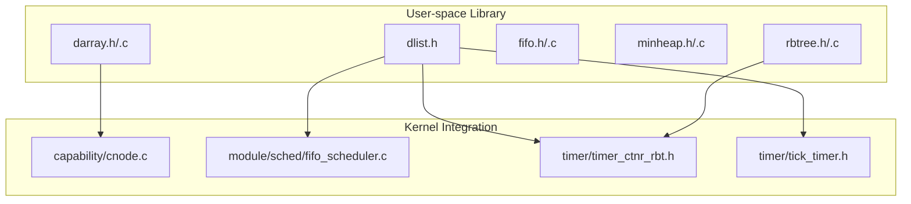
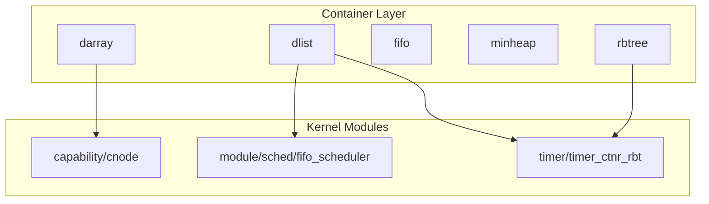
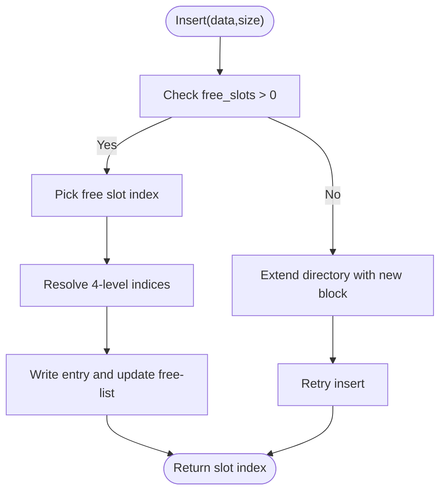
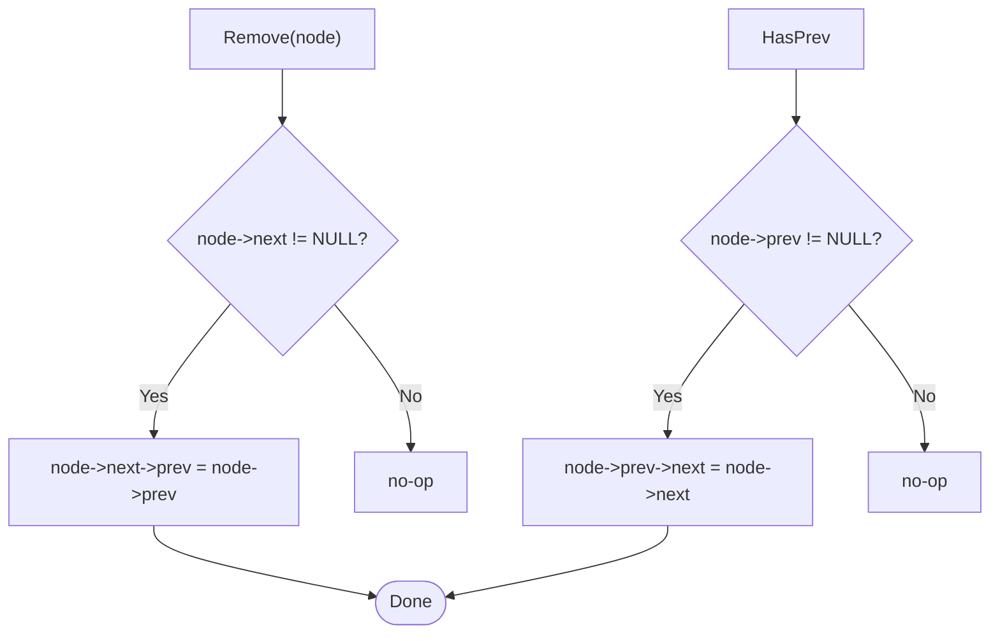
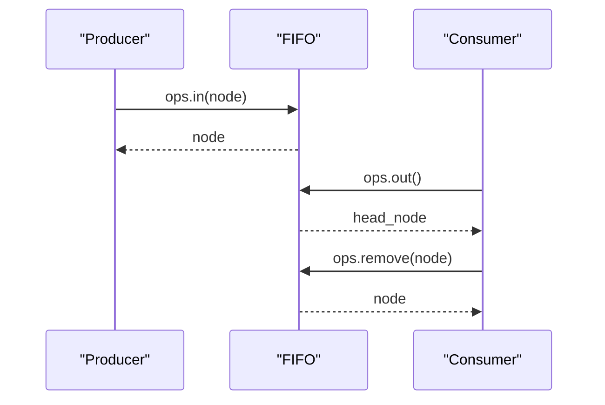
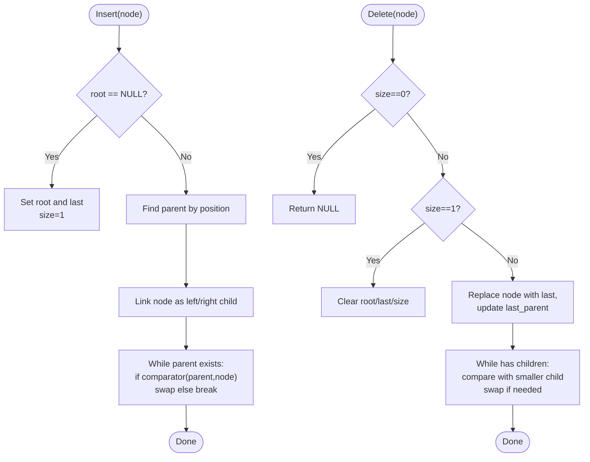
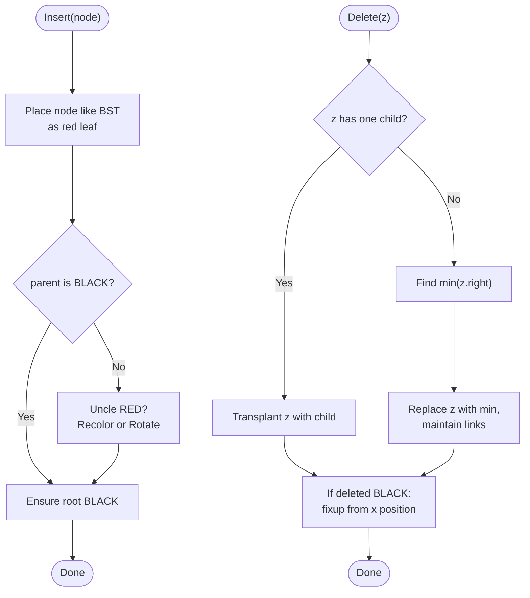
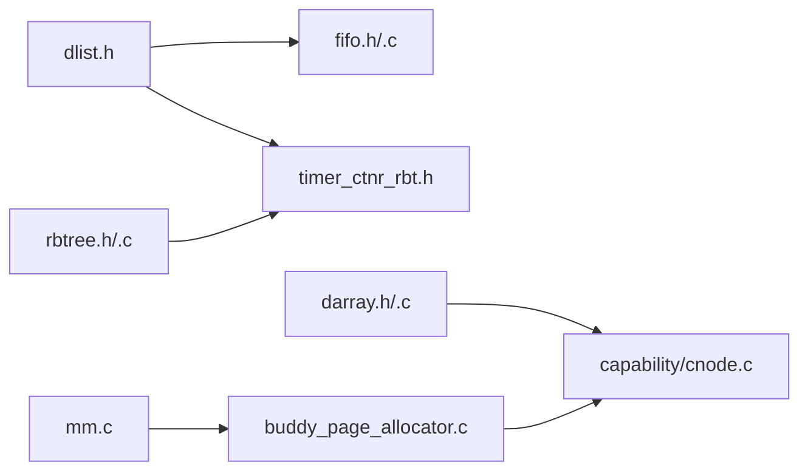

# Algorithm and Data Structure Libraries

<cite>
**Referenced Files in This Document**
- [darray.h](file://ulibs/include/libalgorithm/darray.h)
- [darray.c](file://ulibs/libalgorithm/darray.c)
- [dlist.h](file://ulibs/include/libalgorithm/dlist.h)
- [fifo.h](file://ulibs/include/libalgorithm/fifo.h)
- [fifo.c](file://ulibs/libalgorithm/fifo.c)
- [minheap.h](file://ulibs/include/libalgorithm/minheap.h)
- [minheap.c](file://ulibs/libalgorithm/minheap.c)
- [rbtree.h](file://ulibs/include/libalgorithm/rbtree.h)
- [rbtree.c](file://ulibs/libalgorithm/rbtree.c)
- [cnode.c](file://kernel/capability/cnode.c)
- [fifo_scheduler.c](file://kernel/module/sched/fifo_scheduler.c)
- [timer_ctnr_rbt.h](file://kernel/include/timer/timer_ctnr_rbt.h)
- [tick_timer.h](file://kernel/include/timer/tick_timer.h)
- [buddy_page_allocator.c](file://kernel/mm/impl/buddy_page_allocator.c)
- [mm.c](file://virt/mm/mm.c)
- [kmem_cache.h](file://kernel/include/mm/kmem_cache.h)
</cite>

## Table of Contents
1. [Introduction](#introduction)
2. [Project Structure](#project-structure)
3. [Core Components](#core-components)
4. [Architecture Overview](#architecture-overview)
5. [Detailed Component Analysis](#detailed-component-analysis)
6. [Dependency Analysis](#dependency-analysis)
7. [Performance Considerations](#performance-considerations)
8. [Troubleshooting Guide](#troubleshooting-guide)
9. [Conclusion](#conclusion)
10. [Appendices](#appendices)

## Introduction
This document describes the algorithm and data structure libraries in the user-space library collection of TranquilOS. It focuses on five containers:
- Dynamic array directory (darray)
- Doubly linked list (dlist)
- FIFO queue
- Minimum heap
- Red-black tree

It explains implementation details, memory management, insertion/deletion operations, traversal methods, APIs, usage patterns, performance characteristics, and integration points with kernel subsystems such as capability nodes and scheduling. Thread-safety considerations and optimization techniques are also discussed, along with the relationship to kernel memory allocators and the capability-based security model.

## Project Structure
The algorithm libraries reside under ulibs/libalgorithm/. Each container is defined by a header and implemented in a corresponding C file. Integration examples appear in kernel modules that use these containers for scheduling and timer management.

**Diagram sources**
- [darray.h](file://ulibs/include/libalgorithm/darray.h#L1-L64)
- [darray.c](file://ulibs/libalgorithm/darray.c#L1-L220)
- [dlist.h](file://ulibs/include/libalgorithm/dlist.h#L1-L61)
- [fifo.h](file://ulibs/include/libalgorithm/fifo.h#L1-L27)
- [fifo.c](file://ulibs/libalgorithm/fifo.c#L1-L98)
- [minheap.h](file://ulibs/include/libalgorithm/minheap.h#L1-L37)
- [minheap.c](file://ulibs/libalgorithm/minheap.c#L1-L235)
- [rbtree.h](file://ulibs/include/libalgorithm/rbtree.h#L1-L45)
- [rbtree.c](file://ulibs/libalgorithm/rbtree.c#L1-L437)
- [cnode.c](file://kernel/capability/cnode.c#L1-L95)
- [fifo_scheduler.c](file://kernel/module/sched/fifo_scheduler.c#L1-L111)
- [timer_ctnr_rbt.h](file://kernel/include/timer/timer_ctnr_rbt.h#L1-L21)
- [tick_timer.h](file://kernel/include/timer/tick_timer.h#L1-L36)

**Section sources**
- [darray.h](file://ulibs/include/libalgorithm/darray.h#L1-L64)
- [dlist.h](file://ulibs/include/libalgorithm/dlist.h#L1-L61)
- [fifo.h](file://ulibs/include/libalgorithm/fifo.h#L1-L27)
- [minheap.h](file://ulibs/include/libalgorithm/minheap.h#L1-L37)
- [rbtree.h](file://ulibs/include/libalgorithm/rbtree.h#L1-L45)

## Core Components
This section summarizes each container’s purpose, typical usage, and key operations.

- Dynamic Array Directory (darray): A multi-level directory-backed storage for fixed-size entries with lazy extension and free-list management.
- Doubly Linked List (dlist): A lightweight intrusive doubly-linked list with append/insert/remove helpers.
- FIFO Queue: An intrusive FIFO built atop dlist for scheduling and event handling.
- Minimum Heap: A binary heap supporting insert/delete and comparator-driven ordering.
- Red-Black Tree: A balanced BST supporting insert/delete/get-min with rotations and recoloring.

**Section sources**
- [darray.h](file://ulibs/include/libalgorithm/darray.h#L46-L59)
- [dlist.h](file://ulibs/include/libalgorithm/dlist.h#L8-L20)
- [fifo.h](file://ulibs/include/libalgorithm/fifo.h#L18-L23)
- [minheap.h](file://ulibs/include/libalgorithm/minheap.h#L26-L32)
- [rbtree.h](file://ulibs/include/libalgorithm/rbtree.h#L35-L40)

## Architecture Overview
The containers are designed for low-level, efficient operation in kernel-like environments. They rely on:
- Intrusive node layouts (nodes embed links)
- Fixed-size entry alignment for darray
- Comparator-based ordering for heap and tree
- Optional printf-style logging hooks for diagnostics

Integration examples:
- Capability nodes use darray to manage capability slots and extend storage via page allocations.
- The FIFO scheduler uses an intrusive FIFO to manage ready-to-schedule contexts.
- Timer containers use a red-black tree to maintain ordered timers.

**Diagram sources**
- [cnode.c](file://kernel/capability/cnode.c#L9-L21)
- [fifo_scheduler.c](file://kernel/module/sched/fifo_scheduler.c#L13-L16)
- [timer_ctnr_rbt.h](file://kernel/include/timer/timer_ctnr_rbt.h#L9-L17)

## Detailed Component Analysis

### Dynamic Array Directory (darray)
Purpose:
- Provides fixed-capacity, fixed-entry-size storage backed by a 4-level directory structure.
- Supports insert, delete, get, and extend operations with a free-list for O(1) reuse.

Key design elements:
- Multi-level indexing with configurable bit-widths per level.
- Free-list head per level to quickly locate next free slot.
- Extend operation grows capacity by allocating new blocks and linking them into the directory.

APIs:
- Initialization: initializes ops, entry size, and free lists.
- Insert: returns a slot index or error code if no free slot and no extension is possible.
- Delete: returns slot to free-list.
- Get: returns pointer to entry by index.
- Extend: extends capacity by linking a new block at the appropriate level.

Memory management:
- Uses a caller-supplied base pointer to the directory block.
- Extends by allocating pages from the kernel page allocator and linking them into the directory.

Usage pattern:
- Initialize with a backing region and entry size.
- While free slots are exhausted, allocate a new page and extend the directory.
- Insert entries and retrieve via index.

Performance:
- Insert/get/delete are O(1) amortized with free-list reuse.
- Extend is O(2^bits per level) to initialize entries in the new block.

Thread-safety:
- Not inherently thread-safe; external synchronization is required if shared across threads.

Optimization techniques:
- Tune entry size to align with cache lines.
- Pre-allocate sufficient capacity to reduce extend frequency.

Integration example:
- Capability nodes initialize darray with a page-aligned buffer and extend as needed.

**Diagram sources**
- [darray.c](file://ulibs/libalgorithm/darray.c#L4-L51)
- [darray.c](file://ulibs/libalgorithm/darray.c#L57-L138)

**Section sources**
- [darray.h](file://ulibs/include/libalgorithm/darray.h#L29-L59)
- [darray.c](file://ulibs/libalgorithm/darray.c#L4-L220)
- [cnode.c](file://kernel/capability/cnode.c#L15-L58)

### Doubly Linked List (dlist)
Purpose:
- Intrusive, bidirectional list with minimal overhead.
- Provides append, insert, and remove primitives.

APIs:
- Init: initializes a node’s pointers.
- Append: appends a node to the tail of a list segment.
- Insert: inserts a node after a given position.
- Remove: removes a node from the list.

Usage pattern:
- Embed a list_node_s into your data structure.
- Use ops to link/unlink nodes during container operations.

Performance:
- All operations are O(1) pointer updates.

Thread-safety:
- Not thread-safe; protect with locks if accessed concurrently.

**Diagram sources**
- [dlist.h](file://ulibs/include/libalgorithm/dlist.h#L51-L58)

**Section sources**
- [dlist.h](file://ulibs/include/libalgorithm/dlist.h#L8-L60)

### FIFO Queue
Purpose:
- An intrusive FIFO built on top of dlist for producer-consumer scenarios.

APIs:
- in: enqueue a node at the tail.
- remove: remove a specific node from anywhere in the queue.
- out: dequeue the head node.
- is_empty: test emptiness.

Usage pattern:
- Embed a list_node_s into your payload.
- Use ops.in/out to manage the queue.

Integration example:
- Scheduler framework uses FIFO to manage ready contexts.

**Diagram sources**
- [fifo.c](file://ulibs/libalgorithm/fifo.c#L3-L82)
- [fifo_scheduler.c](file://kernel/module/sched/fifo_scheduler.c#L18-L67)

**Section sources**
- [fifo.h](file://ulibs/include/libalgorithm/fifo.h#L18-L23)
- [fifo.c](file://ulibs/libalgorithm/fifo.c#L1-L98)
- [fifo_scheduler.c](file://kernel/module/sched/fifo_scheduler.c#L13-L109)

### Minimum Heap
Purpose:
- Binary heap supporting comparator-based ordering.
- Maintains root as the minimum element.

APIs:
- insert: inserts a node and bubbles up.
- delete: replaces root with last node, bubbles down.
- get_min: returns root.
- dump: traverses and prints nodes via callback.

Implementation highlights:
- Node swap rotates subtrees around parent-child pairs.
- Insert finds the next parent position using bit traversal.
- Delete swaps with children as long as comparator indicates violation.

Performance:
- Insert/Delete: O(log n)
- Get-min: O(1)

Thread-safety:
- Not thread-safe; synchronize externally.

**Diagram sources**
- [minheap.c](file://ulibs/libalgorithm/minheap.c#L81-L125)
- [minheap.c](file://ulibs/libalgorithm/minheap.c#L127-L200)

**Section sources**
- [minheap.h](file://ulibs/include/libalgorithm/minheap.h#L7-L32)
- [minheap.c](file://ulibs/libalgorithm/minheap.c#L1-L235)

### Red-Black Tree
Purpose:
- Balanced BST ensuring O(log n) operations.
- Enforces red-black properties with rotations and recoloring.

APIs:
- insert: inserts a node and fixes violations.
- delete: deletes a node and rebalances.
- get_min: returns minimum node.
- get_min_and_delete: returns and deletes minimum.
- dump: inorder traversal via callback.

Implementation highlights:
- Rotations maintain balance.
- Fixup handles three cases: recolor, rotate-left, rotate-right.
- Transplant replaces subtrees during deletion.

Performance:
- Insert/Delete/Get-Min: O(log n)

Thread-safety:
- Not thread-safe; synchronize externally.

**Diagram sources**
- [rbtree.c](file://ulibs/libalgorithm/rbtree.c#L268-L297)
- [rbtree.c](file://ulibs/libalgorithm/rbtree.c#L299-L390)

**Section sources**
- [rbtree.h](file://ulibs/include/libalgorithm/rbtree.h#L13-L40)
- [rbtree.c](file://ulibs/libalgorithm/rbtree.c#L1-L437)

## Dependency Analysis
- dlist is a foundational primitive used by FIFO and timer containers.
- darray is used by capability nodes for capability slot management.
- rbtree is used by timer containers to maintain ordered timers.
- Memory allocation for darray extension comes from the kernel page allocator.

**Diagram sources**
- [dlist.h](file://ulibs/include/libalgorithm/dlist.h#L1-L61)
- [fifo.h](file://ulibs/include/libalgorithm/fifo.h#L1-L27)
- [fifo.c](file://ulibs/libalgorithm/fifo.c#L1-L98)
- [timer_ctnr_rbt.h](file://kernel/include/timer/timer_ctnr_rbt.h#L1-L21)
- [darray.h](file://ulibs/include/libalgorithm/darray.h#L1-L64)
- [darray.c](file://ulibs/libalgorithm/darray.c#L1-L220)
- [cnode.c](file://kernel/capability/cnode.c#L1-L95)
- [buddy_page_allocator.c](file://kernel/mm/impl/buddy_page_allocator.c#L1-L27)
- [mm.c](file://virt/mm/mm.c#L1-L15)

**Section sources**
- [cnode.c](file://kernel/capability/cnode.c#L15-L58)
- [buddy_page_allocator.c](file://kernel/mm/impl/buddy_page_allocator.c#L1-L27)
- [mm.c](file://virt/mm/mm.c#L1-L15)

## Performance Considerations
- darray
  - Prefer larger entry sizes aligned to cache lines to minimize fragmentation.
  - Pre-allocate sufficient capacity to avoid frequent extend calls.
  - Monitor free-list utilization to detect memory pressure.
- dlist/FIFO
  - Keep payloads small and pointer-aligned for cache efficiency.
  - Avoid deep nesting of intrusive structures to reduce pointer chasing.
- minheap
  - Comparator comparisons dominate cost; keep comparison logic cheap.
  - Reuse nodes to reduce allocation churn.
- rbtree
  - Favor balanced datasets to avoid worst-case skew.
  - Use integer keys or compact comparators to reduce overhead.

[No sources needed since this section provides general guidance]

## Troubleshooting Guide
Common issues and remedies:
- darray errors
  - Parameter errors indicate invalid arguments (null pointer, zero size, oversized data).
  - Memory errors indicate missing intermediate directory entries; ensure extend succeeds.
  - Full conditions occur when free-list is empty; extend the directory.
- dlist/FIFO
  - Removing a node not in the list leads to dangling pointers; ensure node ownership.
  - Empty queue operations return null; check is_empty before out.
- minheap/rbtree
  - Incorrect comparator order can violate heap/BST invariants; verify semantics.
  - Unbalanced trees or heap violations often stem from improper rotations or fixup logic.

Operational tips:
- Enable logging via the printf hook to trace directory indices and operations.
- Validate node initialization (e.g., setting parent/child to NULL before insert).

**Section sources**
- [darray.h](file://ulibs/include/libalgorithm/darray.h#L7-L10)
- [darray.c](file://ulibs/libalgorithm/darray.c#L5-L7)
- [darray.c](file://ulibs/libalgorithm/darray.c#L164-L178)
- [fifo.c](file://ulibs/libalgorithm/fifo.c#L23-L61)
- [minheap.c](file://ulibs/libalgorithm/minheap.c#L112-L122)
- [rbtree.c](file://ulibs/libalgorithm/rbtree.c#L158-L181)

## Conclusion
The algorithm libraries provide efficient, intrusive containers suitable for kernel-like environments. darray offers scalable fixed-size storage with directory extension; dlist enables flexible intrusive linking; FIFO integrates with scheduling; minheap supports priority-based selection; and rbtree ensures logarithmic-time ordered operations. Together with kernel memory allocators and the capability model, these containers form the backbone of several subsystems in the OS.

[No sources needed since this section summarizes without analyzing specific files]

## Appendices

### API Reference Summary

- darray
  - Types: directory_array_s, directory_array_ops
  - Functions: darray_init, insert, delete, get, extend, free_slots
  - Notes: entry_size must match stored object size; extend requires page allocator
- dlist
  - Types: list_node_s
  - Functions: dlist_init, dlist_append_tail, dlist_insert, dlist_remove
- fifo
  - Types: fifo_s, fifo_ops
  - Functions: fifo_init, in, out, remove, is_empty
- minheap
  - Types: min_heap_s, min_heap_node_s, min_heap_ops
  - Functions: minheap_init, insert, delete, get_min, dump
- rbtree
  - Types: rb_tree_s, rb_node_s, rb_tree_ops
  - Functions: rbtree_init, insert, delete, get_min, get_min_and_delete, dump

**Section sources**
- [darray.h](file://ulibs/include/libalgorithm/darray.h#L29-L62)
- [dlist.h](file://ulibs/include/libalgorithm/dlist.h#L17-L58)
- [fifo.h](file://ulibs/include/libalgorithm/fifo.h#L11-L26)
- [minheap.h](file://ulibs/include/libalgorithm/minheap.h#L18-L34)
- [rbtree.h](file://ulibs/include/libalgorithm/rbtree.h#L26-L42)

### Integration Examples

- Capability nodes
  - Initialize darray with a page-aligned buffer.
  - Allocate pages and extend directory as free slots deplete.
  - Insert capabilities and retrieve by index.

- FIFO scheduler
  - Initialize FIFO per CPU.
  - Enqueue/Dequeue scheduling contexts using intrusive nodes.

- Timer containers
  - Use rbtree to maintain ordered timers for tick-based scheduling.

**Section sources**
- [cnode.c](file://kernel/capability/cnode.c#L9-L58)
- [fifo_scheduler.c](file://kernel/module/sched/fifo_scheduler.c#L85-L109)
- [timer_ctnr_rbt.h](file://kernel/include/timer/timer_ctnr_rbt.h#L9-L17)
- [tick_timer.h](file://kernel/include/timer/tick_timer.h#L23-L35)

### Memory Allocation and Thread Safety

- Memory allocation
  - darray extension uses the kernel page allocator; the allocator is registered globally and retrieved by capability nodes.
  - The kmem cache layer sits above page allocators for higher-level allocations.

- Thread safety
  - None of the containers are thread-safe by default.
  - Protect shared instances with spinlocks or similar mechanisms in multi-threaded contexts.

**Section sources**
- [cnode.c](file://kernel/capability/cnode.c#L27-L47)
- [mm.c](file://virt/mm/mm.c#L8-L15)
- [kmem_cache.h](file://kernel/include/mm/kmem_cache.h#L4-L7)