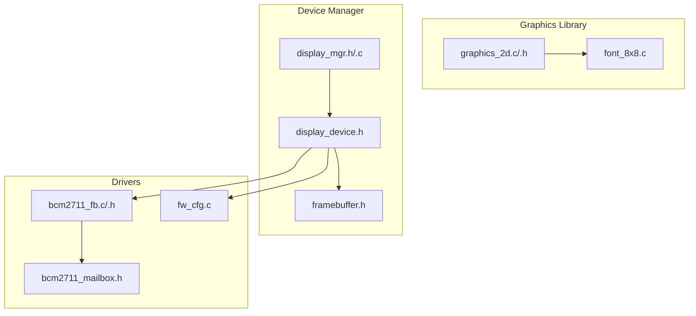
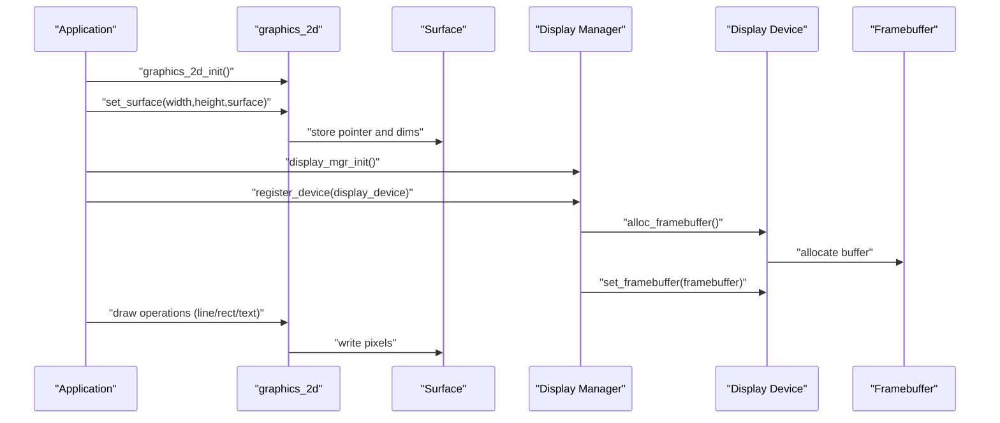
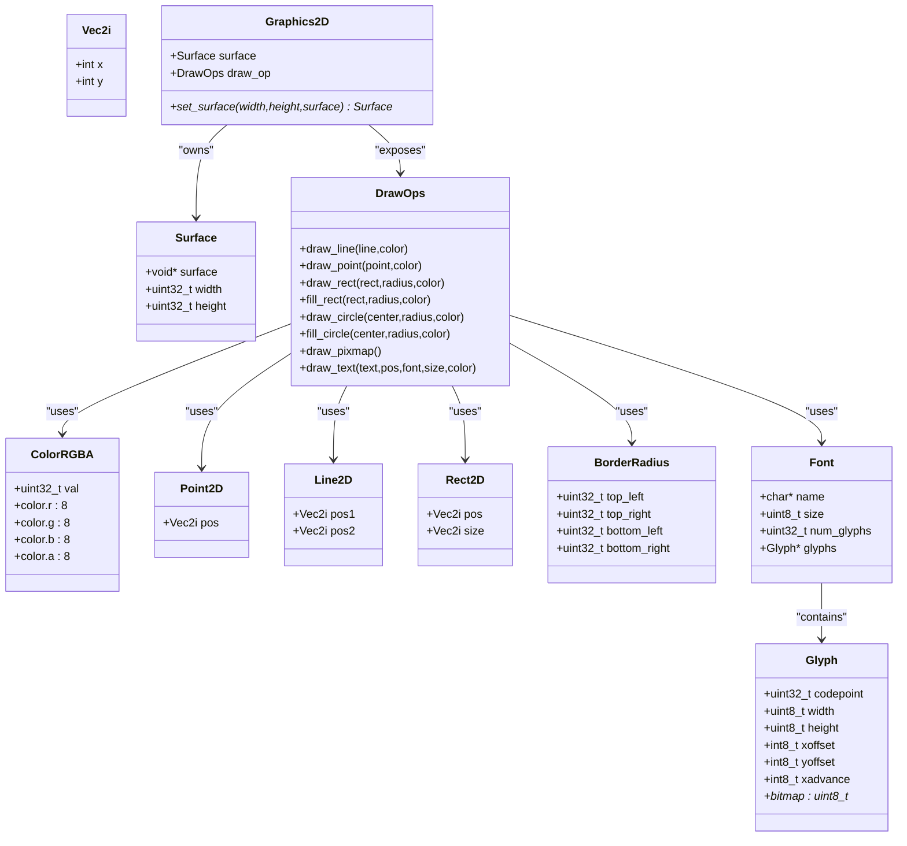
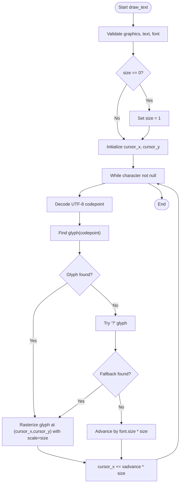
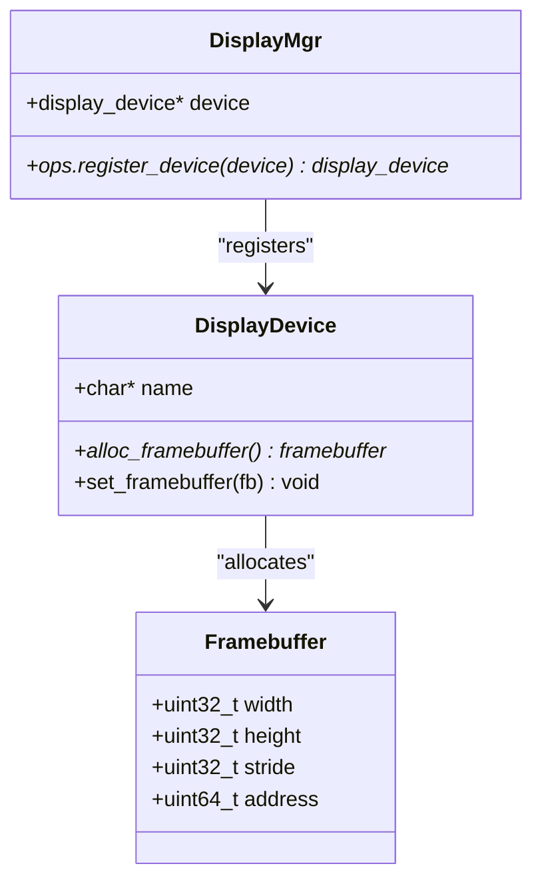
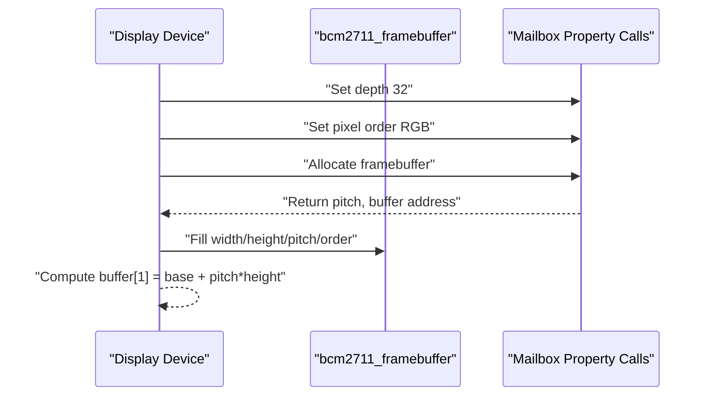
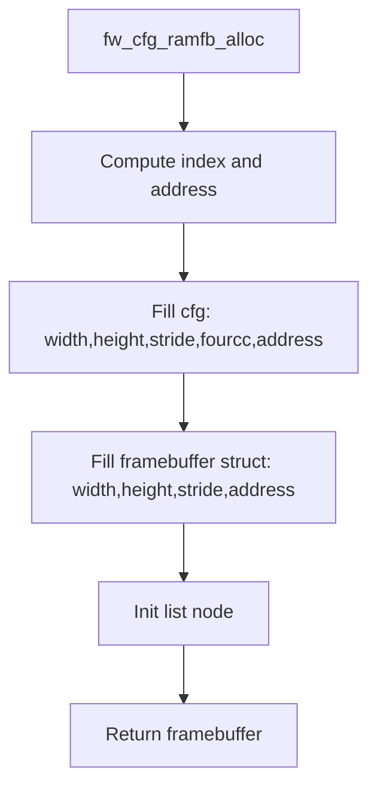
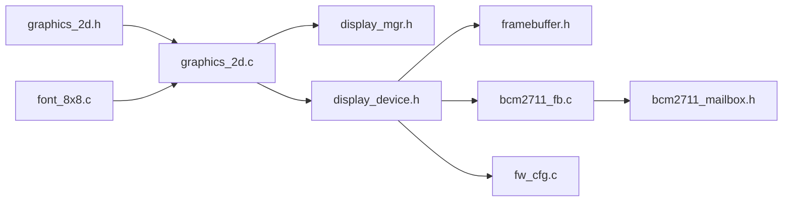

# Graphics and Display Libraries

<cite>
**Referenced Files in This Document**
- [graphics_2d.h](file://ulibs/include/libgraphics/graphics_2d.h)
- [graphics_2d.c](file://ulibs/libgraphics/graphics_2d.c)
- [font_8x8.c](file://ulibs/libgraphics/font_8x8.c)
- [display_mgr.h](file://uapps/devmgr/include/peripherals/display/display_mgr.h)
- [display_mgr.c](file://uapps/devmgr/peripherals/display/display_mgr.c)
- [display_device.h](file://uapps/devmgr/include/peripherals/display/device/display_device.h)
- [framebuffer.h](file://uapps/devmgr/include/peripherals/display/framebuffer.h)
- [bcm2711_fb.h](file://uapps/devmgr/drivers/rpi/rpi-fb/bcm2711_fb.h)
- [bcm2711_fb.c](file://uapps/devmgr/drivers/rpi/rpi-fb/bcm2711_fb.c)
- [bcm2711_mailbox.h](file://uapps/devmgr/drivers/rpi/rpi-fb/bcm2711_mailbox.h)
- [fw_cfg.c](file://uapps/devmgr/drivers/virt/fw_cfg.c)
</cite>

## Table of Contents
1. [Introduction](#introduction)
2. [Project Structure](#project-structure)
3. [Core Components](#core-components)
4. [Architecture Overview](#architecture-overview)
5. [Detailed Component Analysis](#detailed-component-analysis)
6. [Dependency Analysis](#dependency-analysis)
7. [Performance Considerations](#performance-considerations)
8. [Troubleshooting Guide](#troubleshooting-guide)
9. [Conclusion](#conclusion)
10. [Appendices](#appendices)

## Introduction
This document describes the graphics and display libraries in TranquilOS with a focus on 2D primitives, drawing operations, and font rendering. It explains the graphics API, coordinate systems, color formats, and performance characteristics. It also covers buffer management, integration with device drivers, and the relationship with framebuffer devices and the display manager. Finally, it outlines optimization techniques for embedded displays and memory-efficient rendering.

## Project Structure
The graphics subsystem spans userland libraries and device manager components:
- Graphics library: 2D primitives, surfaces, and text rendering
- Font assets: bitmap-based glyphs for rendering text
- Display manager: registration and lifecycle of display devices
- Framebuffer abstraction: width, height, stride, and base address
- Device drivers: Raspberry Pi and virtual machine framebuffer allocation and configuration

**Diagram sources**
- [graphics_2d.c](file://ulibs/libgraphics/graphics_2d.c#L1-L404)
- [graphics_2d.h](file://ulibs/include/libgraphics/graphics_2d.h#L1-L138)
- [font_8x8.c](file://ulibs/libgraphics/font_8x8.c#L1-L204)
- [display_mgr.h](file://uapps/devmgr/include/peripherals/display/display_mgr.h#L1-L20)
- [display_mgr.c](file://uapps/devmgr/peripherals/display/display_mgr.c#L1-L31)
- [display_device.h](file://uapps/devmgr/include/peripherals/display/device/display_device.h#L1-L16)
- [framebuffer.h](file://uapps/devmgr/include/peripherals/display/framebuffer.h#L1-L16)
- [bcm2711_fb.h](file://uapps/devmgr/drivers/rpi/rpi-fb/bcm2711_fb.h#L1-L21)
- [bcm2711_fb.c](file://uapps/devmgr/drivers/rpi/rpi-fb/bcm2711_fb.c#L95-L144)
- [bcm2711_mailbox.h](file://uapps/devmgr/drivers/rpi/rpi-fb/bcm2711_mailbox.h#L66-L124)
- [fw_cfg.c](file://uapps/devmgr/drivers/virt/fw_cfg.c#L90-L124)

**Section sources**
- [graphics_2d.h](file://ulibs/include/libgraphics/graphics_2d.h#L1-L138)
- [graphics_2d.c](file://ulibs/libgraphics/graphics_2d.c#L1-L404)
- [font_8x8.c](file://ulibs/libgraphics/font_8x8.c#L1-L204)
- [display_mgr.h](file://uapps/devmgr/include/peripherals/display/display_mgr.h#L1-L20)
- [display_mgr.c](file://uapps/devmgr/peripherals/display/display_mgr.c#L1-L31)
- [display_device.h](file://uapps/devmgr/include/peripherals/display/device/display_device.h#L1-L16)
- [framebuffer.h](file://uapps/devmgr/include/peripherals/display/framebuffer.h#L1-L16)
- [bcm2711_fb.h](file://uapps/devmgr/drivers/rpi/rpi-fb/bcm2711_fb.h#L1-L21)
- [bcm2711_fb.c](file://uapps/devmgr/drivers/rpi/rpi-fb/bcm2711_fb.c#L95-L144)
- [bcm2711_mailbox.h](file://uapps/devmgr/drivers/rpi/rpi-fb/bcm2711_mailbox.h#L66-L124)
- [fw_cfg.c](file://uapps/devmgr/drivers/virt/fw_cfg.c#L90-L124)

## Core Components
- Graphics 2D API: Provides drawing operations (lines, rectangles, circles, points), text rendering, and surface management.
- Color format: RGBA with 8 bits per channel packed into a 32-bit value.
- Coordinate system: Origin at top-left; X increases right; Y increases down.
- Surface: A contiguous buffer with width and height; pixels are 32-bit RGBA.
- Fonts: Bitmap glyphs with metrics (width, height, xoffset, yoffset, xadvance) and a fixed size.

Key APIs and types:
- Drawing operations: draw_line, draw_point, draw_rect, fill_rect, draw_circle, fill_circle, draw_text, draw_pixmap
- Surface management: set_surface
- Geometry helpers: ivec2, line2d, rect2d, border_radius
- Color helpers: color(r, g, b, a)
- Font glyph and font structures

**Section sources**
- [graphics_2d.h](file://ulibs/include/libgraphics/graphics_2d.h#L7-L138)
- [graphics_2d.c](file://ulibs/libgraphics/graphics_2d.c#L117-L404)
- [font_8x8.c](file://ulibs/libgraphics/font_8x8.c#L82-L204)

## Architecture Overview
The graphics pipeline integrates userland drawing with device-managed framebuffers:
- Application initializes a graphics context and sets a surface backed by a framebuffer.
- Drawing operations write directly to the framebuffer’s pixel buffer.
- The display manager registers display devices and exposes framebuffer allocation and assignment.
- Drivers allocate and configure framebuffers (e.g., mailbox property calls on Raspberry Pi; firmware config on virtual machines).

**Diagram sources**
- [graphics_2d.c](file://ulibs/libgraphics/graphics_2d.c#L388-L404)
- [graphics_2d.h](file://ulibs/include/libgraphics/graphics_2d.h#L121-L138)
- [display_mgr.c](file://uapps/devmgr/peripherals/display/display_mgr.c#L6-L31)
- [display_device.h](file://uapps/devmgr/include/peripherals/display/device/display_device.h#L8-L14)
- [framebuffer.h](file://uapps/devmgr/include/peripherals/display/framebuffer.h#L8-L14)
- [bcm2711_fb.c](file://uapps/devmgr/drivers/rpi/rpi-fb/bcm2711_fb.c#L95-L144)
- [fw_cfg.c](file://uapps/devmgr/drivers/virt/fw_cfg.c#L90-L124)

## Detailed Component Analysis

### Graphics 2D API
The 2D graphics API defines geometry types, color packing, drawing operations, and surface management. It supports:
- Primitives: point, line, rectangle (with rounded corners), circle (outline and filled)
- Text rendering: UTF-8 decoding, glyph lookup, bitmap rasterization with scaling
- Surface: width, height, and pointer to pixel buffer

Coordinate system and pixel layout:
- Origin at top-left corner
- Pixel format is 32-bit RGBA stored in native endianness
- Surfaces are treated as tightly packed rows

Drawing operations:
- Line drawing uses an integer DDA/Bresenham-style loop
- Rectangle outline draws four edges; filled rectangle scans pixels inside bounds
- Rounded corners are drawn via quarter-circle arcs
- Circle outline uses midpoint circle algorithm
- Text rendering iterates glyphs and scales bitmaps to a requested size

**Diagram sources**
- [graphics_2d.h](file://ulibs/include/libgraphics/graphics_2d.h#L7-L138)

**Section sources**
- [graphics_2d.h](file://ulibs/include/libgraphics/graphics_2d.h#L7-L138)
- [graphics_2d.c](file://ulibs/libgraphics/graphics_2d.c#L117-L404)

### Font Rendering Pipeline
Font rendering converts text into drawn pixels:
- Decode UTF-8 codepoints
- Find glyph by codepoint in font
- For each set bit in glyph bitmap, plot scaled blocks of pixels
- Advance cursor by glyph xadvance scaled by size

**Diagram sources**
- [graphics_2d.c](file://ulibs/libgraphics/graphics_2d.c#L335-L368)
- [font_8x8.c](file://ulibs/libgraphics/font_8x8.c#L75-L114)

**Section sources**
- [graphics_2d.c](file://ulibs/libgraphics/graphics_2d.c#L51-L114)
- [font_8x8.c](file://ulibs/libgraphics/font_8x8.c#L82-L204)

### Display Manager and Framebuffer Abstraction
The display manager provides a registry for display devices and operations:
- Registration of a display device
- Allocation of a framebuffer from the device
- Assignment of a framebuffer to the device

Framebuffers expose width, height, stride (in bytes), and base address. Device drivers implement allocation and configuration.

**Diagram sources**
- [display_mgr.h](file://uapps/devmgr/include/peripherals/display/display_mgr.h#L11-L18)
- [display_mgr.c](file://uapps/devmgr/peripherals/display/display_mgr.c#L6-L31)
- [display_device.h](file://uapps/devmgr/include/peripherals/display/device/display_device.h#L8-L14)
- [framebuffer.h](file://uapps/devmgr/include/peripherals/display/framebuffer.h#L8-L14)

**Section sources**
- [display_mgr.h](file://uapps/devmgr/include/peripherals/display/display_mgr.h#L1-L20)
- [display_mgr.c](file://uapps/devmgr/peripherals/display/display_mgr.c#L1-L31)
- [display_device.h](file://uapps/devmgr/include/peripherals/display/device/display_device.h#L1-L16)
- [framebuffer.h](file://uapps/devmgr/include/peripherals/display/framebuffer.h#L1-L16)

### Raspberry Pi Framebuffer Driver
The Raspberry Pi driver uses mailbox property calls to allocate and configure a framebuffer:
- Sets pixel depth, pixel order, and virtual dimensions
- Allocates a framebuffer buffer and computes a second buffer address
- Reports width, height, and pitch

**Diagram sources**
- [bcm2711_fb.c](file://uapps/devmgr/drivers/rpi/rpi-fb/bcm2711_fb.c#L95-L144)
- [bcm2711_mailbox.h](file://uapps/devmgr/drivers/rpi/rpi-fb/bcm2711_mailbox.h#L84-L124)
- [bcm2711_fb.h](file://uapps/devmgr/drivers/rpi/rpi-fb/bcm2711_fb.h#L7-L21)

**Section sources**
- [bcm2711_fb.c](file://uapps/devmgr/drivers/rpi/rpi-fb/bcm2711_fb.c#L95-L144)
- [bcm2711_mailbox.h](file://uapps/devmgr/drivers/rpi/rpi-fb/bcm2711_mailbox.h#L84-L124)
- [bcm2711_fb.h](file://uapps/devmgr/drivers/rpi/rpi-fb/bcm2711_fb.h#L1-L21)

### Virtual Machine Framebuffer Driver
On virtual platforms, framebuffers are exposed via firmware configuration:
- Allocate two buffers with width*height*4 bytes
- Fill stride as 4*width bytes
- Register framebuffer metadata and set firmware config

**Diagram sources**
- [fw_cfg.c](file://uapps/devmgr/drivers/virt/fw_cfg.c#L90-L124)

**Section sources**
- [fw_cfg.c](file://uapps/devmgr/drivers/virt/fw_cfg.c#L90-L124)

## Dependency Analysis
- Graphics library depends on geometry and color types, and font glyph arrays.
- Display manager depends on display device interfaces and framebuffer structures.
- Device drivers depend on mailbox property calls (Raspberry Pi) or firmware configuration (virtual).

**Diagram sources**
- [graphics_2d.h](file://ulibs/include/libgraphics/graphics_2d.h#L1-L138)
- [graphics_2d.c](file://ulibs/libgraphics/graphics_2d.c#L1-L404)
- [font_8x8.c](file://ulibs/libgraphics/font_8x8.c#L1-L204)
- [display_mgr.h](file://uapps/devmgr/include/peripherals/display/display_mgr.h#L1-L20)
- [display_device.h](file://uapps/devmgr/include/peripherals/display/device/display_device.h#L1-L16)
- [framebuffer.h](file://uapps/devmgr/include/peripherals/display/framebuffer.h#L1-L16)
- [bcm2711_fb.c](file://uapps/devmgr/drivers/rpi/rpi-fb/bcm2711_fb.c#L95-L144)
- [bcm2711_mailbox.h](file://uapps/devmgr/drivers/rpi/rpi-fb/bcm2711_mailbox.h#L66-L124)
- [fw_cfg.c](file://uapps/devmgr/drivers/virt/fw_cfg.c#L90-L124)

**Section sources**
- [graphics_2d.h](file://ulibs/include/libgraphics/graphics_2d.h#L1-L138)
- [graphics_2d.c](file://ulibs/libgraphics/graphics_2d.c#L1-L404)
- [font_8x8.c](file://ulibs/libgraphics/font_8x8.c#L1-L204)
- [display_mgr.h](file://uapps/devmgr/include/peripherals/display/display_mgr.h#L1-L20)
- [display_device.h](file://uapps/devmgr/include/peripherals/display/device/display_device.h#L1-L16)
- [framebuffer.h](file://uapps/devmgr/include/peripherals/display/framebuffer.h#L1-L16)
- [bcm2711_fb.c](file://uapps/devmgr/drivers/rpi/rpi-fb/bcm2711_fb.c#L95-L144)
- [bcm2711_mailbox.h](file://uapps/devmgr/drivers/rpi/rpi-fb/bcm2711_mailbox.h#L66-L124)
- [fw_cfg.c](file://uapps/devmgr/drivers/virt/fw_cfg.c#L90-L124)

## Performance Considerations
- Pixel writes: Direct array indexing per pixel; consider scanline batching for large fills.
- Filled rectangles: Nested loops; prefer early-exit checks and tight bounds.
- Antialiasing/clearing: Use memset for full-screen clears when possible.
- Scaling: Draw glyph blocks; reduce scaling factor or cache scaled bitmaps for repeated text.
- Stride alignment: Ensure stride matches width*4 for optimal CPU cache behavior.
- DMA/tearing: On real hardware, consider double-buffering and vsync to avoid tearing.
- Embedded constraints: Prefer fixed-point arithmetic sparingly; keep hot loops branch-predictable.

[No sources needed since this section provides general guidance]

## Troubleshooting Guide
Common issues and remedies:
- Null graphics context: Ensure initialization and surface setting succeeded before drawing.
- Out-of-bounds writes: Validate coordinates against surface width/height.
- Incorrect color order: Confirm pixel ordering matches device expectations (e.g., RGB vs BGR).
- Missing glyphs: Provide a fallback glyph ('?') or expand the font atlas.
- Driver allocation failures: Verify mailbox property calls succeed and buffer addresses are valid.

**Section sources**
- [graphics_2d.c](file://ulibs/libgraphics/graphics_2d.c#L4-L14)
- [graphics_2d.c](file://ulibs/libgraphics/graphics_2d.c#L371-L386)
- [bcm2711_fb.c](file://uapps/devmgr/drivers/rpi/rpi-fb/bcm2711_fb.c#L125-L135)

## Conclusion
TranquilOS provides a compact 2D graphics library with primitives, text rendering, and surface management, integrated with a display manager and device drivers. The design emphasizes simplicity and portability across platforms, while enabling efficient rendering on embedded displays through careful buffer management and driver coordination.

[No sources needed since this section summarizes without analyzing specific files]

## Appendices

### API Reference Summary
- Initialization: Initialize graphics context and set a surface backed by a framebuffer.
- Drawing:
  - Line: draw_line
  - Point: draw_point
  - Rectangle: draw_rect, fill_rect
  - Circle: draw_circle, fill_circle
  - Text: draw_text
  - Pixmap: draw_pixmap (placeholder)
- Surface: set_surface(width, height, buffer)
- Geometry helpers: ivec2, line2d, rect2d, border_radius
- Color helpers: color(r, g, b, a)
- Font: glyph metrics and bitmap arrays

**Section sources**
- [graphics_2d.h](file://ulibs/include/libgraphics/graphics_2d.h#L100-L138)
- [graphics_2d.c](file://ulibs/libgraphics/graphics_2d.c#L117-L404)
- [font_8x8.c](file://ulibs/libgraphics/font_8x8.c#L82-L204)