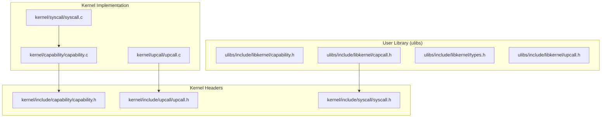
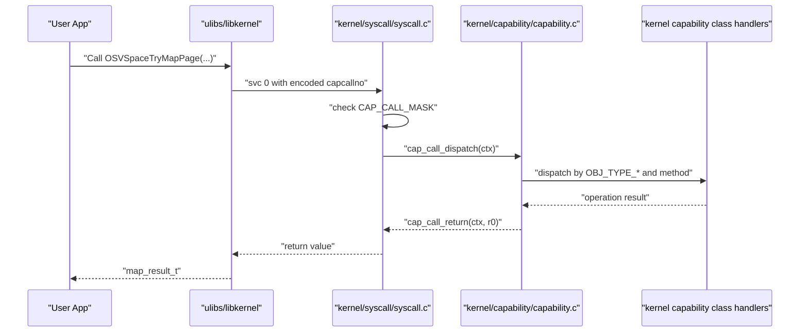
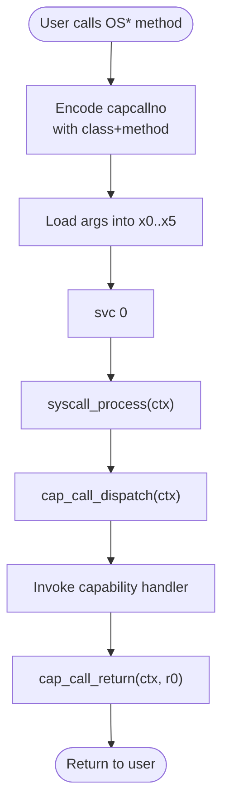
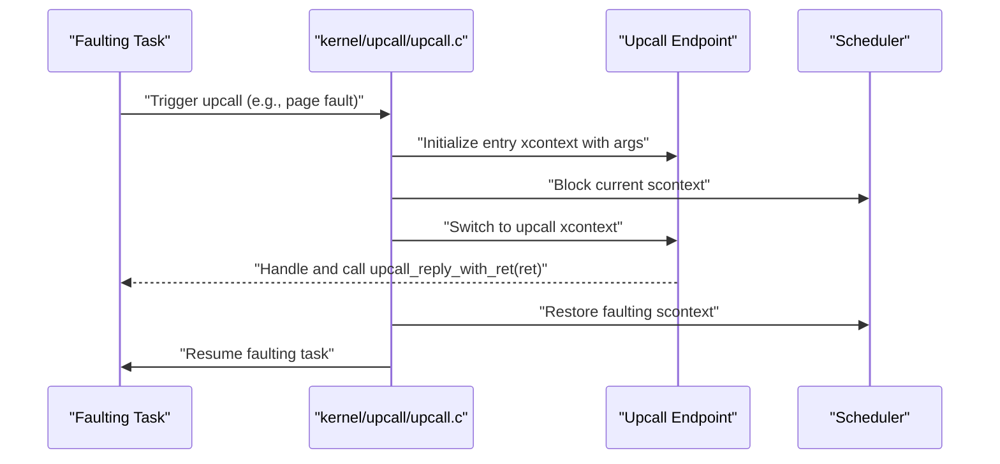
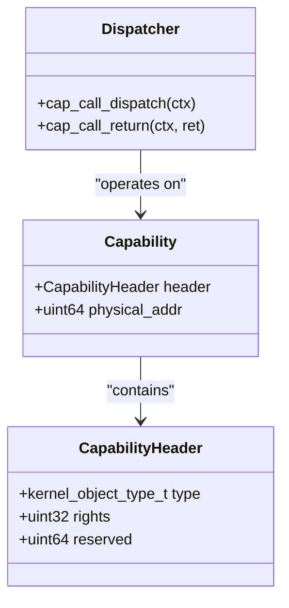
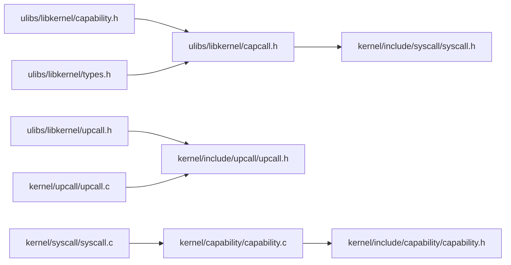

# Kernel Interface Libraries

<cite>
**Referenced Files in This Document**
- [capability.h](file://ulibs/include/libkernel/capability.h)
- [capcall.h](file://ulibs/include/libkernel/capcall.h)
- [types.h](file://ulibs/include/libkernel/types.h)
- [upcall.h](file://ulibs/include/libkernel/upcall.h)
- [capability.h](file://kernel/include/capability/capability.h)
- [capability.c](file://kernel/capability/capability.c)
- [upcall.c](file://kernel/upcall/upcall.c)
- [upcall.h](file://kernel/include/upcall/upcall.h)
- [syscall.h](file://kernel/include/syscall/syscall.h)
- [syscall.c](file://kernel/syscall/syscall.c)
- [cap_cnode.h](file://kernel/include/capability/cap_cnode.h)
- [cap_sysctrl.h](file://kernel/include/capability/cap_sysctrl.h)
- [cap_scontext.h](file://kernel/include/capability/cap_scontext.h)
- [cap_vspace.h](file://kernel/include/capability/cap_vspace.h)
- [cap_xcontext.h](file://kernel/include/capability/cap_xcontext.h)
</cite>

## Table of Contents
1. [Introduction](#introduction)
2. [Project Structure](#project-structure)
3. [Core Components](#core-components)
4. [Architecture Overview](#architecture-overview)
5. [Detailed Component Analysis](#detailed-component-analysis)
6. [Dependency Analysis](#dependency-analysis)
7. [Performance Considerations](#performance-considerations)
8. [Troubleshooting Guide](#troubleshooting-guide)
9. [Conclusion](#conclusion)
10. [Appendices](#appendices)

## Introduction
This document describes the kernel interface libraries in TranquilOS, focusing on the capability-based system call abstraction (capcall), capability manipulation, and upcall mechanisms. It explains the kernel data types, capability structures, and system call conventions used to interact with the microkernel. It also covers security implications, performance characteristics, and proper resource management, and illustrates how user-space services delegate work to the kernel via capabilities.

## Project Structure
The kernel interface libraries reside primarily under ulibs/include/libkernel and kernel/*, with the user-space API headers defining the capcall ABI and enums, and the kernel-side handlers implementing dispatch and upcall switching.

**Diagram sources**
- [capability.h](file://ulibs/include/libkernel/capability.h#L1-L141)
- [capcall.h](file://ulibs/include/libkernel/capcall.h#L1-L177)
- [types.h](file://ulibs/include/libkernel/types.h#L1-L76)
- [upcall.h](file://ulibs/include/libkernel/upcall.h#L1-L17)
- [capability.h](file://kernel/include/capability/capability.h#L1-L26)
- [capability.c](file://kernel/capability/capability.c#L1-L58)
- [upcall.c](file://kernel/upcall/upcall.c#L1-L95)
- [upcall.h](file://kernel/include/upcall/upcall.h#L1-L13)
- [syscall.h](file://kernel/include/syscall/syscall.h#L1-L8)
- [syscall.c](file://kernel/syscall/syscall.c#L1-L20)

**Section sources**
- [capability.h](file://ulibs/include/libkernel/capability.h#L1-L141)
- [capcall.h](file://ulibs/include/libkernel/capcall.h#L1-L177)
- [types.h](file://ulibs/include/libkernel/types.h#L1-L76)
- [upcall.h](file://ulibs/include/libkernel/upcall.h#L1-L17)
- [capability.h](file://kernel/include/capability/capability.h#L1-L26)
- [capability.c](file://kernel/capability/capability.c#L1-L58)
- [upcall.c](file://kernel/upcall/upcall.c#L1-L95)
- [upcall.h](file://kernel/include/upcall/upcall.h#L1-L13)
- [syscall.h](file://kernel/include/syscall/syscall.h#L1-L8)
- [syscall.c](file://kernel/syscall/syscall.c#L1-L20)

## Core Components
- Capability types and refs: Defines kernel object types, capability reference encoding, and method enumerations for each capability class.
- Capcall ABI: Provides macros to encode capability IDs and method IDs into a system call number and issue SVC to enter the kernel.
- Types and results: Declares mapping result codes returned by virtual memory operations.
- Upcall types: Enumerates upcall categories (e.g., page faults) and conversion helpers.
- Kernel capability header: Describes the capability wire format and dispatch/return hooks.
- Syscall entry: Routes to capcall or fastcall handlers and switches to user context.
- Upcall engine: Implements upcall invocation and reply, including scheduling transitions.

**Section sources**
- [capability.h](file://ulibs/include/libkernel/capability.h#L6-L141)
- [capcall.h](file://ulibs/include/libkernel/capcall.h#L13-L177)
- [types.h](file://ulibs/include/libkernel/types.h#L4-L76)
- [upcall.h](file://ulibs/include/libkernel/upcall.h#L4-L17)
- [capability.h](file://kernel/include/capability/capability.h#L11-L26)
- [syscall.c](file://kernel/syscall/syscall.c#L8-L20)
- [upcall.c](file://kernel/upcall/upcall.c#L8-L95)

## Architecture Overview
The capcall architecture uses a unified system call number encoding to select a capability class and method, then dispatches into the kernel’s capability subsystem. Virtual memory operations return structured results, and upcalls enable asynchronous kernel-to-user transitions for events like page faults.

**Diagram sources**
- [capcall.h](file://ulibs/include/libkernel/capcall.h#L15-L107)
- [syscall.c](file://kernel/syscall/syscall.c#L8-L20)
- [capability.c](file://kernel/capability/capability.c#L14-L54)

## Detailed Component Analysis

### Capability Types and References
- Kernel object types enumerate capability classes (e.g., XContext, SContext, VSpace, CNode, Console, SysCtrl, Self, IpcEndPoint, UpcallEndPoint).
- Capability reference encodes a 32-bit slot index and a 32-bit cnode ID into a 64-bit value.
- Method enumerations per capability define supported operations (e.g., Create, Destroy, SetCNode, TryMapPage, Call, Reply).

Security and layout:
- Rights are represented as a packed header field in the kernel capability structure.
- Right masks are declared in individual capability headers (e.g., CNode, SysCtrl, SContext, VSpace, XContext).

**Section sources**
- [capability.h](file://ulibs/include/libkernel/capability.h#L6-L18)
- [capability.h](file://ulibs/include/libkernel/capability.h#L44-L50)
- [capability.h](file://ulibs/include/libkernel/capability.h#L52-L139)
- [capability.h](file://kernel/include/capability/capability.h#L9-L20)
- [cap_cnode.h](file://kernel/include/capability/cap_cnode.h#L7-L11)
- [cap_sysctrl.h](file://kernel/include/capability/cap_sysctrl.h#L7-L11)
- [cap_scontext.h](file://kernel/include/capability/cap_scontext.h#L7-L11)
- [cap_vspace.h](file://kernel/include/capability/cap_vspace.h#L7-L11)
- [cap_xcontext.h](file://kernel/include/capability/cap_xcontext.h#L7-L11)

### Capcall ABI and Conventions
- Capcall macros encode capability class and method into registers and issue SVC to enter the kernel.
- The encoding uses a mask and bitfields to select the capability class and method.
- Return values are read from register 0 after kernel processing.

Common usage patterns:
- Zero-argument calls: e.g., OSVSpacePrepare, OSAContextSchedule.
- Single-argument calls: e.g., OSConsolePrint.
- Multi-argument calls: e.g., OSVSpaceTryMapPage, OSVSpaceTryMapRange, OSIpcEndPointCall variants.

**Diagram sources**
- [capcall.h](file://ulibs/include/libkernel/capcall.h#L15-L126)
- [syscall.c](file://kernel/syscall/syscall.c#L8-L20)
- [capability.c](file://kernel/capability/capability.c#L14-L54)

**Section sources**
- [capcall.h](file://ulibs/include/libkernel/capcall.h#L13-L177)
- [syscall.c](file://kernel/syscall/syscall.c#L8-L20)
- [capability.c](file://kernel/capability/capability.c#L14-L54)

### Virtual Memory Mapping Results
- The map_result_t enumeration provides detailed outcomes for mapping operations, including invalid entries, valid entries, null pointers, and already mapped conditions across different translation levels.

Usage:
- Returned by VSpace.TryMapPage and VSpace.TryMapRange to guide retry or error handling.

**Section sources**
- [types.h](file://ulibs/include/libkernel/types.h#L4-L76)

### Upcall Mechanisms
- Upcall types include page fault handling.
- The kernel upcall engine switches execution to a designated upcall endpoint context, saves the faulting context, and resumes scheduling after reply.
- Upcall reply restores the faulting context and wakes waiting IPC endpoints.

**Diagram sources**
- [upcall.c](file://kernel/upcall/upcall.c#L8-L95)
- [upcall.h](file://kernel/include/upcall/upcall.h#L9-L11)
- [upcall.h](file://ulibs/include/libkernel/upcall.h#L4-L17)

**Section sources**
- [upcall.c](file://kernel/upcall/upcall.c#L8-L95)
- [upcall.h](file://kernel/include/upcall/upcall.h#L9-L11)
- [upcall.h](file://ulibs/include/libkernel/upcall.h#L4-L17)

### Kernel Capability Header and Dispatch
- The capability structure includes a header with type and rights, plus a physical address payload.
- The dispatcher reads the capcallno, extracts class and method, and routes to the appropriate capability handler.
- Return values are written back to the user context register 0.

**Diagram sources**
- [capability.h](file://kernel/include/capability/capability.h#L11-L26)
- [capability.c](file://kernel/capability/capability.c#L14-L54)

**Section sources**
- [capability.h](file://kernel/include/capability/capability.h#L11-L26)
- [capability.c](file://kernel/capability/capability.c#L14-L54)

### Syscall Entry and Routing
- The syscall entry checks the capcall mask to decide whether to dispatch to capability handlers or fastcall handlers.
- After dispatch, the kernel switches to the user context associated with the current scontext.

**Section sources**
- [syscall.h](file://kernel/include/syscall/syscall.h#L6-L7)
- [syscall.c](file://kernel/syscall/syscall.c#L8-L20)

## Dependency Analysis
The user-space capcall API depends on syscall entry and kernel capability dispatch. Upcalls depend on the upcall endpoint and scheduler integration.

**Diagram sources**
- [capability.h](file://ulibs/include/libkernel/capability.h#L1-L141)
- [capcall.h](file://ulibs/include/libkernel/capcall.h#L1-L177)
- [types.h](file://ulibs/include/libkernel/types.h#L1-L76)
- [upcall.h](file://ulibs/include/libkernel/upcall.h#L1-L17)
- [syscall.h](file://kernel/include/syscall/syscall.h#L1-L8)
- [syscall.c](file://kernel/syscall/syscall.c#L1-L20)
- [capability.h](file://kernel/include/capability/capability.h#L1-L26)
- [capability.c](file://kernel/capability/capability.c#L1-L58)
- [upcall.c](file://kernel/upcall/upcall.c#L1-L95)
- [upcall.h](file://kernel/include/upcall/upcall.h#L1-L13)

**Section sources**
- [capability.h](file://ulibs/include/libkernel/capability.h#L1-L141)
- [capcall.h](file://ulibs/include/libkernel/capcall.h#L1-L177)
- [types.h](file://ulibs/include/libkernel/types.h#L1-L76)
- [upcall.h](file://ulibs/include/libkernel/upcall.h#L1-L17)
- [syscall.h](file://kernel/include/syscall/syscall.h#L1-L8)
- [syscall.c](file://kernel/syscall/syscall.c#L1-L20)
- [capability.h](file://kernel/include/capability/capability.h#L1-L26)
- [capability.c](file://kernel/capability/capability.c#L1-L58)
- [upcall.c](file://kernel/upcall/upcall.c#L1-L95)
- [upcall.h](file://kernel/include/upcall/upcall.h#L1-L13)

## Performance Considerations
- Capcall uses a single SVC instruction with argument registers, minimizing overhead compared to full system call trampolines.
- Virtual memory mapping results avoid repeated retries on invalid entries by providing precise failure reasons.
- Upcall switching involves scheduler operations; keep upcall handlers minimal and deterministic to reduce latency.
- Rights checks are currently a TODO in the dispatcher; adding early permission checks can prevent unnecessary kernel work.

[No sources needed since this section provides general guidance]

## Troubleshooting Guide
Common issues and remedies:
- Unknown cap type errors indicate an unsupported capability class or incorrect encoding; verify OBJ_TYPE_* constants and capcall macros.
- MAP result codes help diagnose mapping failures; inspect level-specific invalid/valid/nullptr/already-mapped flags to adjust arguments or allocation.
- Upcall panics occur when scontext or upcall endpoint is missing; ensure the upcall endpoint is initialized and bound to the faulting task.
- Reply with zero indicates misuse of the upcall reply path; ensure a non-zero return value is provided.

**Section sources**
- [capability.c](file://kernel/capability/capability.c#L50-L53)
- [types.h](file://ulibs/include/libkernel/types.h#L27-L74)
- [upcall.c](file://kernel/upcall/upcall.c#L13-L24)
- [upcall.c](file://kernel/upcall/upcall.c#L57-L69)
- [upcall.c](file://kernel/upcall/upcall.c#L83-L85)

## Conclusion
The kernel interface libraries in TranquilOS provide a compact, capability-based ABI for user-space services to interact with the microkernel. The capcall macros encapsulate encoding and SVC invocation, while the kernel dispatcher and capability headers define a clean separation of concerns. Upcalls enable efficient asynchronous event handling. Proper use of rights, careful handling of mapping results, and disciplined upcall reply semantics are essential for correctness and performance.

[No sources needed since this section summarizes without analyzing specific files]

## Appendices

### Example Usage Patterns
- Creating and initializing a virtual space, then mapping pages:
  - Use OSVSpacePrepare to set up a vspace with a cnode reference.
  - Use OSVSpaceTryMapPage or OSVSpaceTryMapRange to map physical pages into the vspace.
  - Inspect the returned map_result_t to handle failures and retries.
- Capability creation and management:
  - Use OSCNodeNewCapability to allocate a new capability in a cnode with specified rights.
  - Use OSVSpacePrepare/Extend/UnMapPage/UnMapRange to manage address space mappings.
- Upcall implementation pattern:
  - Initialize an upcall endpoint with OSUpcallEndPointInit.
  - Bind it to a schedule context with OSSContextSetUpcall.
  - In the upcall handler, process the fault and call upcall_reply_with_ret with a non-zero return to resume the faulting task.

[No sources needed since this section provides general guidance]