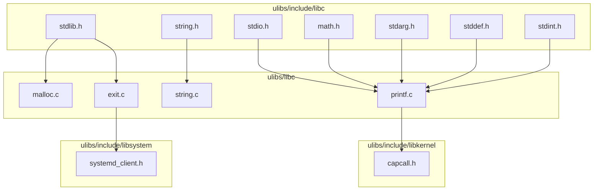
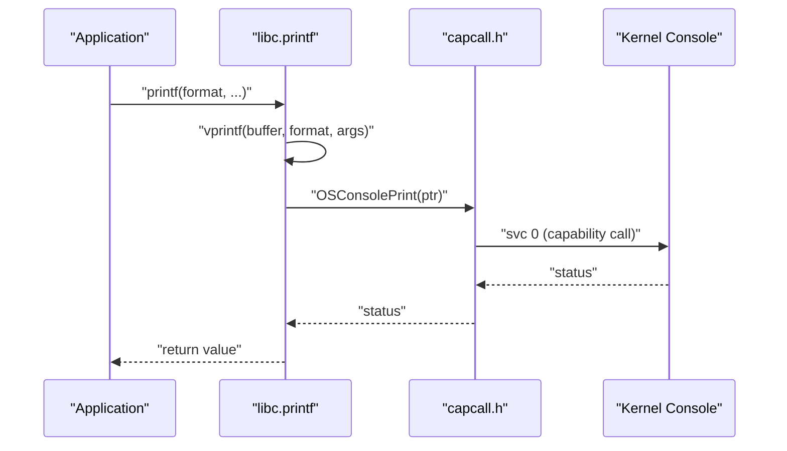
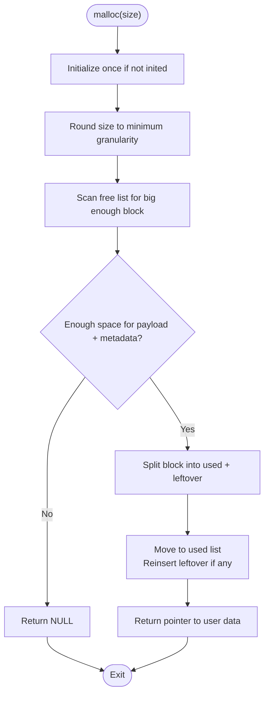
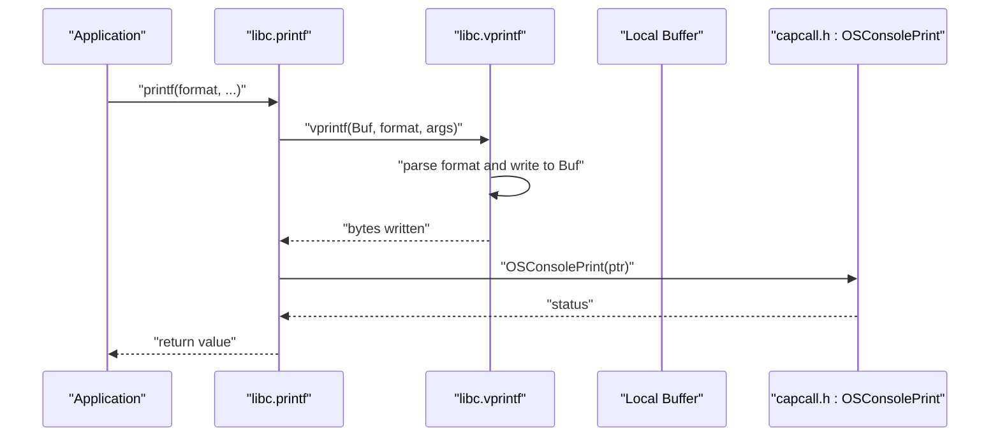
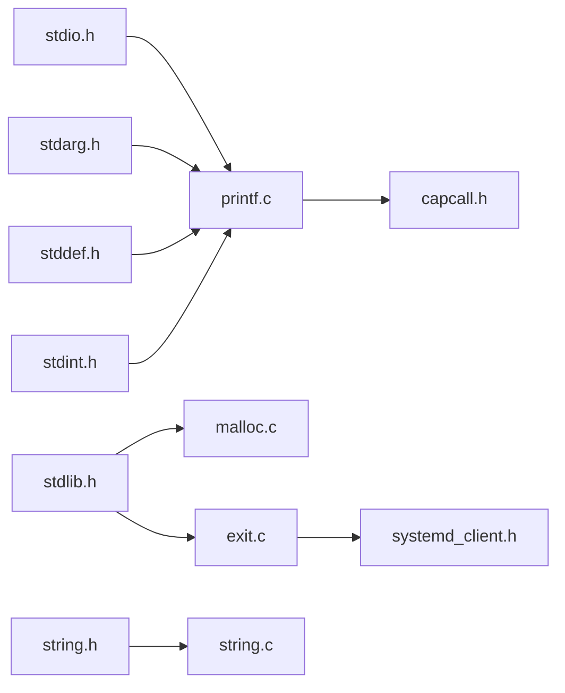

# Standard C Library (libc)

<cite>
**Referenced Files in This Document**
- [malloc.c](file://ulibs/libc/malloc.c)
- [printf.c](file://ulibs/libc/printf.c)
- [string.c](file://ulibs/libc/string.c)
- [exit.c](file://ulibs/libc/exit.c)
- [stdio.h](file://ulibs/include/libc/stdio.h)
- [stdlib.h](file://ulibs/include/libc/stdlib.h)
- [string.h](file://ulibs/include/libc/string.h)
- [math.h](file://ulibs/include/libc/math.h)
- [stdarg.h](file://ulibs/include/libc/stdarg.h)
- [stddef.h](file://ulibs/include/libc/stddef.h)
- [stdint.h](file://ulibs/include/libc/stdint.h)
- [capcall.h](file://ulibs/include/libkernel/capcall.h)
- [systemd_client.h](file://ulibs/include/libsystem/systemd_client.h)
</cite>

## Table of Contents
1. [Introduction](#introduction)
2. [Project Structure](#project-structure)
3. [Core Components](#core-components)
4. [Architecture Overview](#architecture-overview)
5. [Detailed Component Analysis](#detailed-component-analysis)
6. [Dependency Analysis](#dependency-analysis)
7. [Performance Considerations](#performance-considerations)
8. [Troubleshooting Guide](#troubleshooting-guide)
9. [Conclusion](#conclusion)
10. [Appendices](#appendices)

## Introduction
This document describes the standard C library (libc) in TranquilOS, focusing on the user-space implementation of core functions and their integration with the kernel’s capability-based security model and system services. It covers:
- Memory management: malloc/free
- Formatted I/O: printf family
- String manipulation: strlen, strcmp, memset, memcpy, strncmp
- Utilities: exit, integer conversion helpers
- Platform specifics and differences from POSIX libc
- Relationship with kernel memory management, capability-based calls, and system service interfaces

## Project Structure
The libc implementation resides under ulibs/libc and exposes public headers under ulibs/include/libc. The printf and exit functions integrate with kernel capability calls and systemd client APIs.

**Diagram sources**
- [stdio.h](file://ulibs/include/libc/stdio.h#L1-L17)
- [stdlib.h](file://ulibs/include/libc/stdlib.h#L1-L12)
- [string.h](file://ulibs/include/libc/string.h#L1-L13)
- [math.h](file://ulibs/include/libc/math.h#L1-L16)
- [stdarg.h](file://ulibs/include/libc/stdarg.h#L1-L9)
- [stddef.h](file://ulibs/include/libc/stddef.h#L1-L50)
- [stdint.h](file://ulibs/include/libc/stdint.h#L1-L21)
- [malloc.c](file://ulibs/libc/malloc.c#L1-L92)
- [printf.c](file://ulibs/libc/printf.c#L1-L212)
- [string.c](file://ulibs/libc/string.c#L1-L58)
- [exit.c](file://ulibs/libc/exit.c#L1-L9)
- [capcall.h](file://ulibs/include/libkernel/capcall.h#L1-L177)
- [systemd_client.h](file://ulibs/include/libsystem/systemd_client.h#L1-L84)

**Section sources**
- [stdio.h](file://ulibs/include/libc/stdio.h#L1-L17)
- [stdlib.h](file://ulibs/include/libc/stdlib.h#L1-L12)
- [string.h](file://ulibs/include/libc/string.h#L1-L13)
- [math.h](file://ulibs/include/libc/math.h#L1-L16)
- [stdarg.h](file://ulibs/include/libc/stdarg.h#L1-L9)
- [stddef.h](file://ulibs/include/libc/stddef.h#L1-L50)
- [stdint.h](file://ulibs/include/libc/stdint.h#L1-L21)
- [malloc.c](file://ulibs/libc/malloc.c#L1-L92)
- [printf.c](file://ulibs/libc/printf.c#L1-L212)
- [string.c](file://ulibs/libc/string.c#L1-L58)
- [exit.c](file://ulibs/libc/exit.c#L1-L9)
- [capcall.h](file://ulibs/include/libkernel/capcall.h#L1-L177)
- [systemd_client.h](file://ulibs/include/libsystem/systemd_client.h#L1-L84)

## Core Components
- Memory allocation: malloc and placeholder free
- Formatted I/O: printf, sprintf, vprintf, puts, and numeric conversions
- String utilities: length, comparison, memory copy and set
- Utilities: process termination via systemd integration
- Math helpers: greatest common divisor

**Section sources**
- [malloc.c](file://ulibs/libc/malloc.c#L55-L88)
- [printf.c](file://ulibs/libc/printf.c#L198-L211)
- [string.c](file://ulibs/libc/string.c#L3-L58)
- [exit.c](file://ulibs/libc/exit.c#L4-L9)
- [math.h](file://ulibs/include/libc/math.h#L7-L14)

## Architecture Overview
The libc integrates with kernel capabilities and system services through capability-call macros and systemd client APIs. The printf family writes to the console via a capability call, while exit delegates process teardown to the system manager.

**Diagram sources**
- [printf.c](file://ulibs/libc/printf.c#L198-L211)
- [capcall.h](file://ulibs/include/libkernel/capcall.h#L164-L164)

## Detailed Component Analysis

### Memory Management: malloc/free
- malloc
  - Purpose: Allocates aligned blocks from a fixed virtual memory region.
  - Behavior:
    - Initializes a single contiguous free block at first use.
    - Rounds small allocations to a minimum granularity.
    - Splits a free block into allocated and leftover chunks when feasible.
    - Tracks used and free lists using a doubly linked list abstraction.
  - Parameters:
    - size: Requested allocation size in bytes.
  - Return:
    - Pointer to user-accessible memory on success; NULL on failure.
  - Error handling:
    - Returns NULL if insufficient virtual memory or internal list corruption detected.
  - Notes:
    - free is a placeholder in the current implementation.
    - Virtual memory region is defined statically at compile-time.

- free
  - Purpose: Placeholder for deallocation.
  - Current behavior: No-op.
  - Future: Should merge with adjacent free blocks, update lists, and mark magic for safety.

**Diagram sources**
- [malloc.c](file://ulibs/libc/malloc.c#L55-L88)

**Section sources**
- [malloc.c](file://ulibs/libc/malloc.c#L1-L92)
- [stdlib.h](file://ulibs/include/libc/stdlib.h#L6-L8)

### Formatted I/O: printf family
- Functions
  - vprintf: Parses format specifiers and writes to a caller-provided buffer.
  - sprintf: Variadic wrapper around vprintf.
  - printf: Variadic wrapper around vprintf followed by console output.
  - puts: Prints a string directly to the console.
  - Numeric helpers: itoa, natoi, and binary/hex printing utilities.
- Format specifiers supported
  - %s: string
  - %d: decimal integer
  - %x: hexadecimal integer
  - %b: binary representation
  - Other sequences fall back to literal output
- Integration
  - printf flushes the formatted buffer to the console via a capability call.
- Parameters and return
  - buffer: writable character buffer for formatted output.
  - format: format string with optional arguments.
  - args: variadic argument list managed by stdarg macros.
  - Return: currently zero (placeholder).

**Diagram sources**
- [printf.c](file://ulibs/libc/printf.c#L190-L211)
- [capcall.h](file://ulibs/include/libkernel/capcall.h#L164-L164)

**Section sources**
- [printf.c](file://ulibs/libc/printf.c#L1-L212)
- [stdio.h](file://ulibs/include/libc/stdio.h#L7-L14)
- [stdarg.h](file://ulibs/include/libc/stdarg.h#L1-L9)

### String Manipulation
- strlen: Computes the length of a null-terminated string.
- strcmp: Lexicographically compares two strings.
- strncmp: Compares up to n characters.
- memset: Fills memory with a constant byte.
- memcpy: Copies bytes from source to destination.

Implementation notes:
- strcmp leverages strlen internally to compute loop bounds.
- All functions operate on raw pointers and do not perform bounds checking.

**Section sources**
- [string.c](file://ulibs/libc/string.c#L1-L58)
- [string.h](file://ulibs/include/libc/string.h#L6-L11)

### Utilities: exit
- exit(status)
  - Delegates process termination to the system manager via a systemd client.
  - Uses a capability-style interface to request self-exit.

Integration points:
- Retrieves a systemd client handle and invokes the process self-exit operation.

**Section sources**
- [exit.c](file://ulibs/libc/exit.c#L1-L9)
- [stdlib.h](file://ulibs/include/libc/stdlib.h#L10-L10)
- [systemd_client.h](file://ulibs/include/libsystem/systemd_client.h#L64-L75)

### Math Helpers
- gcd(a, b): Iterative Euclidean algorithm returning the greatest common divisor.

**Section sources**
- [math.h](file://ulibs/include/libc/math.h#L7-L14)

## Dependency Analysis
- Public headers define function prototypes and types used across implementations.
- printf depends on capability calls for console output.
- exit depends on the systemd client for process lifecycle management.
- malloc uses a doubly linked list abstraction for managing free/used regions.

**Diagram sources**
- [stdio.h](file://ulibs/include/libc/stdio.h#L1-L17)
- [stdlib.h](file://ulibs/include/libc/stdlib.h#L1-L12)
- [string.h](file://ulibs/include/libc/string.h#L1-L13)
- [stdarg.h](file://ulibs/include/libc/stdarg.h#L1-L9)
- [stddef.h](file://ulibs/include/libc/stddef.h#L1-L50)
- [stdint.h](file://ulibs/include/libc/stdint.h#L1-L21)
- [printf.c](file://ulibs/libc/printf.c#L1-L212)
- [malloc.c](file://ulibs/libc/malloc.c#L1-L92)
- [exit.c](file://ulibs/libc/exit.c#L1-L9)
- [capcall.h](file://ulibs/include/libkernel/capcall.h#L1-L177)
- [systemd_client.h](file://ulibs/include/libsystem/systemd_client.h#L1-L84)

**Section sources**
- [printf.c](file://ulibs/libc/printf.c#L1-L212)
- [malloc.c](file://ulibs/libc/malloc.c#L1-L92)
- [exit.c](file://ulibs/libc/exit.c#L1-L9)
- [capcall.h](file://ulibs/include/libkernel/capcall.h#L1-L177)
- [systemd_client.h](file://ulibs/include/libsystem/systemd_client.h#L1-L84)

## Performance Considerations
- malloc
  - Single-pass linear scan of the free list; complexity O(n) per allocation.
  - Minimum allocation rounding reduces fragmentation but may waste space for tiny allocations.
  - Free list splitting introduces overhead; consider coalescing adjacent free blocks in future.
- printf
  - Local buffering avoids repeated kernel calls; suitable for moderate-sized messages.
  - Consider preallocating buffers and batching output for high-throughput logging.
- string operations
  - Straightforward loops; ensure callers pass valid pointers and sizes to avoid undefined behavior.
- exit
  - Delegation to systemd offloads process teardown; keep exit paths minimal and deterministic.

[No sources needed since this section provides general guidance]

## Troubleshooting Guide
- malloc returns NULL
  - Cause: Insufficient virtual memory or internal list corruption detection.
  - Action: Verify initialization path executed and avoid requesting sizes larger than the reserved region.
- printf appears to have no effect
  - Cause: Console output requires a valid capability call path and console service availability.
  - Action: Ensure OSConsolePrint is reachable and the capability call mechanism is functional.
- free does nothing
  - Cause: Placeholder implementation.
  - Action: Implement deallocation semantics and coalescing before reuse.
- exit does not terminate process
  - Cause: systemd client retrieval failure or missing service.
  - Action: Confirm systemd client handle acquisition and the requested function is supported.

**Section sources**
- [malloc.c](file://ulibs/libc/malloc.c#L74-L80)
- [printf.c](file://ulibs/libc/printf.c#L204-L204)
- [exit.c](file://ulibs/libc/exit.c#L5-L8)

## Conclusion
TranquilOS’s libc provides a compact, capability-aware subset of standard C functions tailored for kernel-integrated environments. While some functions remain placeholders (e.g., free), the existing implementations demonstrate clear integration with kernel capabilities and system services. Extending free, adding robust error reporting, and optimizing allocation strategies will improve reliability and performance.

[No sources needed since this section summarizes without analyzing specific files]

## Appendices

### Function Reference Index
- Memory
  - malloc(size_t): allocate memory
  - free(void*): release memory (placeholder)
- I/O
  - printf(...): formatted print to console
  - sprintf(buffer, format, ...): formatted print to buffer
  - vprintf(buffer, format, va_list): internal formatted print
  - puts(str): print string to console
- String
  - strlen(str): string length
  - strcmp(str1, str2): lexicographic compare
  - strncmp(s1, s2, n): compare up to n chars
  - memset(str, c, n): fill memory
  - memcpy(dest, src, len): copy memory
- Utilities
  - exit(status): terminate process via systemd
- Math
  - gcd(a, b): greatest common divisor

**Section sources**
- [stdlib.h](file://ulibs/include/libc/stdlib.h#L6-L11)
- [stdio.h](file://ulibs/include/libc/stdio.h#L7-L14)
- [string.h](file://ulibs/include/libc/string.h#L6-L11)
- [math.h](file://ulibs/include/libc/math.h#L7-L14)

### Capability and System Integration Details
- Console output
  - Implemented via OSConsolePrint capability call macro.
- Process exit
  - Implemented via systemd client’s process_self_exit operation.

**Section sources**
- [printf.c](file://ulibs/libc/printf.c#L204-L204)
- [capcall.h](file://ulibs/include/libkernel/capcall.h#L164-L164)
- [exit.c](file://ulibs/libc/exit.c#L7-L7)
- [systemd_client.h](file://ulibs/include/libsystem/systemd_client.h#L64-L75)