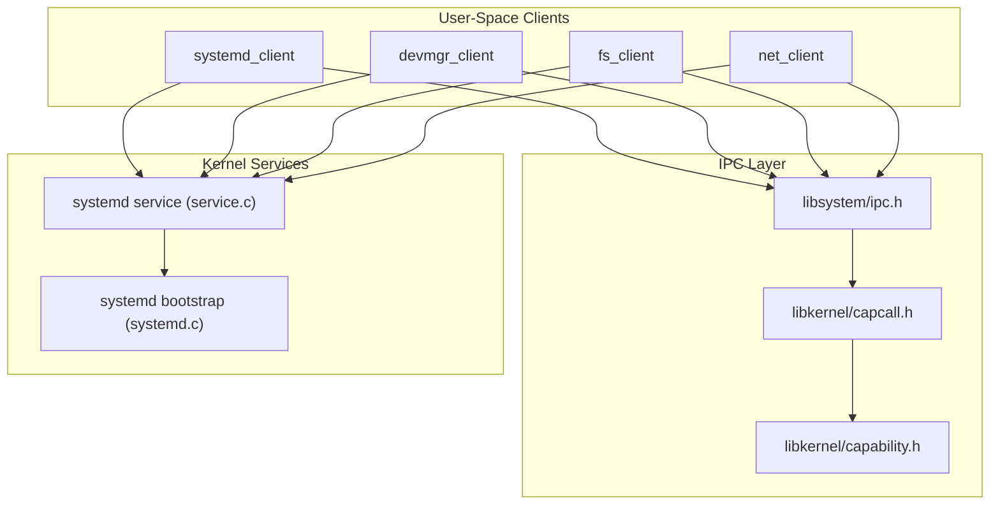
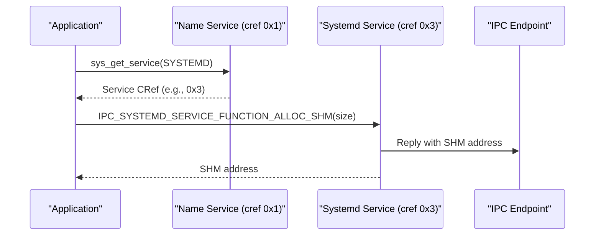
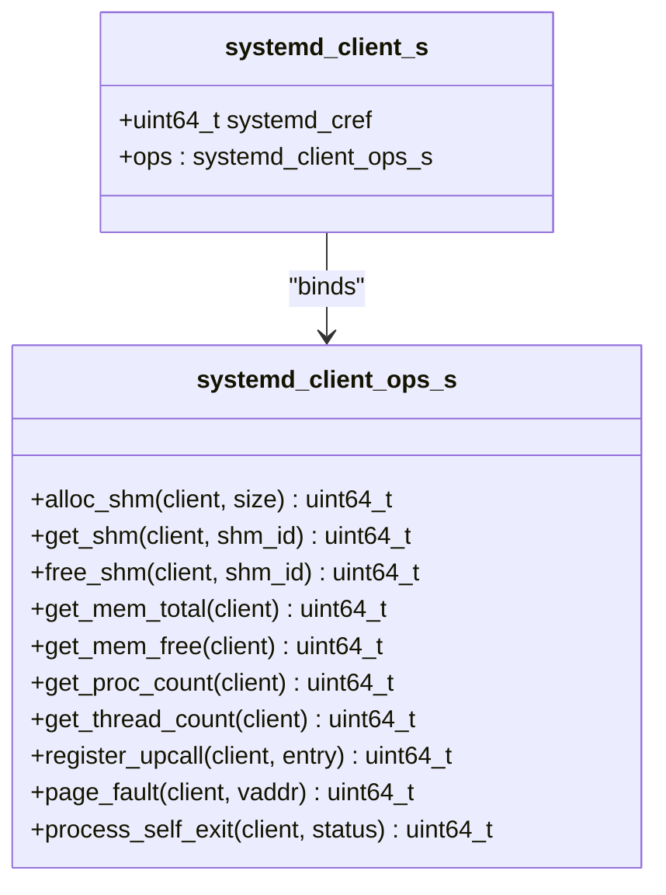
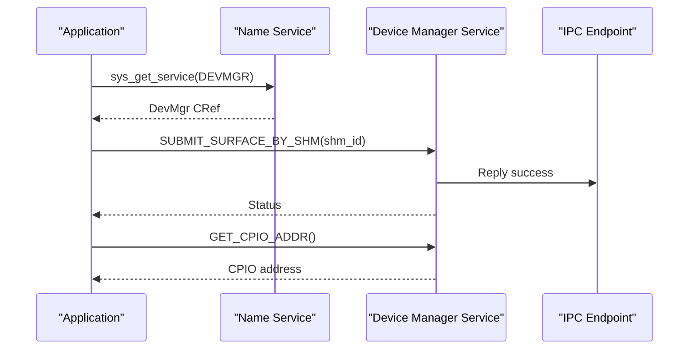
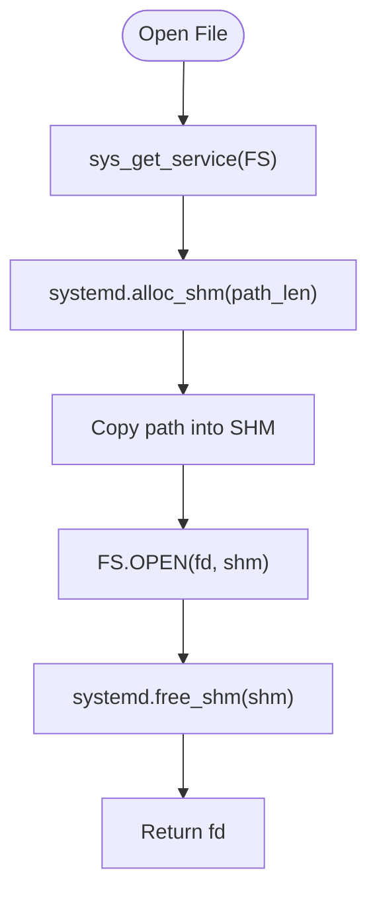
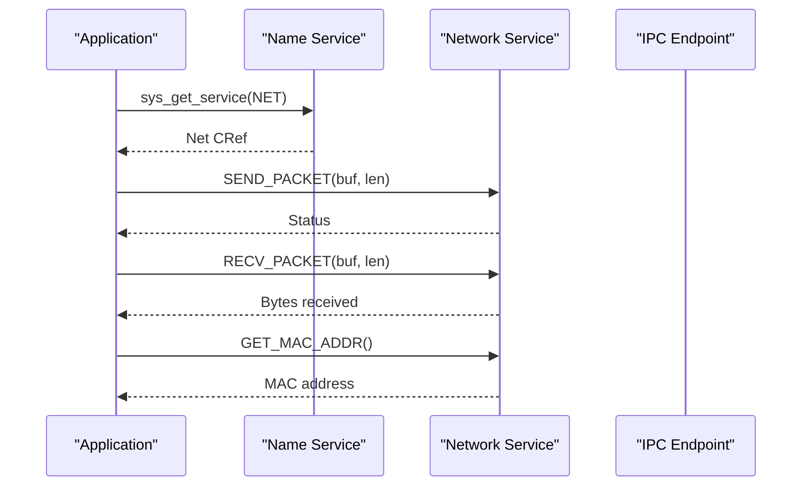
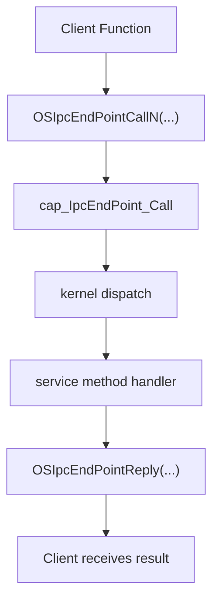
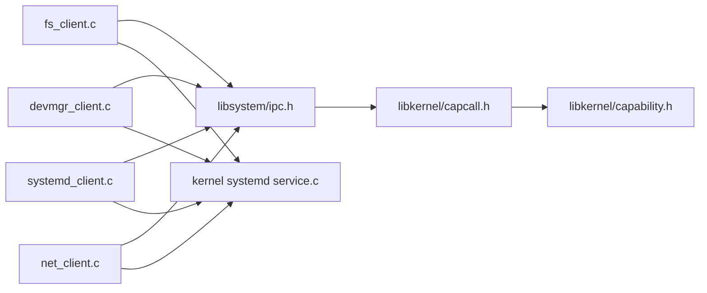

# System Client Libraries

<cite>
**Referenced Files in This Document**
- [systemd_client.h](file://ulibs/include/libsystem/systemd_client.h)
- [systemd_client.c](file://ulibs/libsystem/systemd_client.c)
- [devmgr_client.h](file://ulibs/include/libsystem/devmgr_client.h)
- [devmgr_client.c](file://ulibs/libsystem/devmgr_client.c)
- [fs_client.h](file://ulibs/include/libsystem/fs_client.h)
- [fs_client.c](file://ulibs/libsystem/fs_client.c)
- [net_client.h](file://ulibs/include/libsystem/net_client.h)
- [net_client.c](file://ulibs/libsystem/net_client.c)
- [ipc.h](file://ulibs/include/libsystem/ipc.h)
- [capability.h](file://ulibs/include/libkernel/capability.h)
- [capcall.h](file://ulibs/include/libkernel/capcall.h)
- [ipc_endpoint.h](file://kernel/include/ipc/ipc_endpoint.h)
- [cap_ipc_endpoint.h](file://kernel/include/capability/cap_ipc_endpoint.h)
- [systemd.c](file://kernel/systemd/systemd.c)
- [service.c](file://kernel/systemd/service.c)
</cite>

## Table of Contents
1. [Introduction](#introduction)
2. [Project Structure](#project-structure)
3. [Core Components](#core-components)
4. [Architecture Overview](#architecture-overview)
5. [Detailed Component Analysis](#detailed-component-analysis)
6. [Dependency Analysis](#dependency-analysis)
7. [Performance Considerations](#performance-considerations)
8. [Troubleshooting Guide](#troubleshooting-guide)
9. [Security and Capability Model](#security-and-capability-model)
10. [Usage Examples](#usage-examples)
11. [Conclusion](#conclusion)

## Introduction
This document describes the system client libraries in TranquilOS that enable user-space applications and services to communicate with kernel-managed system services. It covers:
- Client interfaces for systemd service management, device manager, file system operations, and network services
- Inter-process communication (IPC) mechanisms and capability-based access patterns
- Service registration and discovery, process management, device operations, file system calls, and network interactions
- Usage examples for client–server communication, error handling, and asynchronous operations
- Security considerations, permission models, and capability-based access control
- Relationship with the kernel IPC system, capability dispatch, and user-space service architecture

## Project Structure
The client libraries reside under ulibs/libsystem and expose thin wrappers around capability-based system calls. They rely on libkernel capabilities and the kernel’s IPC endpoint facilities. The kernel-side systemd service implements the server side of the IPC protocol and integrates with process, memory, and upcall subsystems.

**Diagram sources**
- [systemd_client.c](file://ulibs/libsystem/systemd_client.c#L1-L65)
- [devmgr_client.c](file://ulibs/libsystem/devmgr_client.c#L1-L25)
- [fs_client.c](file://ulibs/libsystem/fs_client.c#L1-L45)
- [net_client.c](file://ulibs/libsystem/net_client.c#L1-L33)
- [ipc.h](file://ulibs/include/libsystem/ipc.h#L1-L73)
- [capability.h](file://ulibs/include/libkernel/capability.h#L1-L141)
- [capcall.h](file://ulibs/include/libkernel/capcall.h#L1-L177)
- [service.c](file://kernel/systemd/service.c#L160-L230)
- [systemd.c](file://kernel/systemd/systemd.c#L217-L246)

**Section sources**
- [systemd_client.h](file://ulibs/include/libsystem/systemd_client.h#L1-L84)
- [systemd_client.c](file://ulibs/libsystem/systemd_client.c#L1-L65)
- [devmgr_client.h](file://ulibs/include/libsystem/devmgr_client.h#L1-L43)
- [devmgr_client.c](file://ulibs/libsystem/devmgr_client.c#L1-L25)
- [fs_client.h](file://ulibs/include/libsystem/fs_client.h#L1-L47)
- [fs_client.c](file://ulibs/libsystem/fs_client.c#L1-L45)
- [net_client.h](file://ulibs/include/libsystem/net_client.h#L1-L31)
- [net_client.c](file://ulibs/libsystem/net_client.c#L1-L33)
- [ipc.h](file://ulibs/include/libsystem/ipc.h#L1-L73)
- [capability.h](file://ulibs/include/libkernel/capability.h#L1-L141)
- [capcall.h](file://ulibs/include/libkernel/capcall.h#L1-L177)
- [service.c](file://kernel/systemd/service.c#L160-L230)
- [systemd.c](file://kernel/systemd/systemd.c#L217-L246)

## Core Components
- Name Service and Service Discovery: Userspace clients discover service endpoints via a name service and obtain capability references (crefs) to communicate with specific services.
- Systemd Client: Provides shared memory allocation and management, memory statistics, process/thread counts, upcall registration, page-fault handling, and self-exit.
- Device Manager Client: Submits SHM surfaces and retrieves CPIO addresses for device operations.
- File System Client: Opens, reads, writes, and closes files using shared memory buffers and systemd-managed SHM.
- Network Client: Sends/receives packets and retrieves MAC address from the network service.
- Kernel IPC Endpoint: Implements blocking IPC with wait queues and reply semantics.
- Capability Dispatch: Capability-based system calls route to kernel object methods and enforce rights.

**Section sources**
- [ipc.h](file://ulibs/include/libsystem/ipc.h#L11-L70)
- [systemd_client.h](file://ulibs/include/libsystem/systemd_client.h#L7-L84)
- [devmgr_client.h](file://ulibs/include/libsystem/devmgr_client.h#L7-L43)
- [fs_client.h](file://ulibs/include/libsystem/fs_client.h#L7-L47)
- [net_client.h](file://ulibs/include/libsystem/net_client.h#L7-L31)
- [ipc_endpoint.h](file://kernel/include/ipc/ipc_endpoint.h#L8-L24)
- [cap_ipc_endpoint.h](file://kernel/include/capability/cap_ipc_endpoint.h#L7-L12)

## Architecture Overview
The client libraries encapsulate capability-based IPC calls to kernel-managed services. Clients obtain service crefs via the name service, then call service methods through IPC endpoints. The kernel’s systemd service implements the server-side logic for each method.

**Diagram sources**
- [ipc.h](file://ulibs/include/libsystem/ipc.h#L61-L70)
- [systemd_client.c](file://ulibs/libsystem/systemd_client.c#L45-L65)
- [service.c](file://kernel/systemd/service.c#L160-L171)

## Detailed Component Analysis

### Systemd Client Library
The systemd client exposes operations for shared memory management, memory statistics, process/thread counts, upcall registration, page-fault handling, and process self-exit. It obtains the systemd service cref via the name service and binds function pointers to the corresponding client operations.

**Diagram sources**
- [systemd_client.h](file://ulibs/include/libsystem/systemd_client.h#L64-L84)

Key behaviors:
- Shared memory lifecycle: allocate via systemd, map into caller’s address space, and free when done.
- Memory metrics: total/free memory and process/thread counts exposed by the service.
- Upcall registration: registers an upcall endpoint for asynchronous notifications.
- Page fault handler: handles demand paging for virtual memory regions.
- Self-exit: terminates the calling process with a status code.

**Section sources**
- [systemd_client.h](file://ulibs/include/libsystem/systemd_client.h#L7-L84)
- [systemd_client.c](file://ulibs/libsystem/systemd_client.c#L1-L65)
- [service.c](file://kernel/systemd/service.c#L10-L97)
- [service.c](file://kernel/systemd/service.c#L99-L157)

### Device Manager Client Library
The device manager client submits SHM-backed surfaces and retrieves the CPIO address for device-specific operations.

**Diagram sources**
- [ipc.h](file://ulibs/include/libsystem/ipc.h#L61-L70)
- [devmgr_client.c](file://ulibs/libsystem/devmgr_client.c#L13-L25)
- [devmgr_client.h](file://ulibs/include/libsystem/devmgr_client.h#L29-L43)

**Section sources**
- [devmgr_client.h](file://ulibs/include/libsystem/devmgr_client.h#L7-L43)
- [devmgr_client.c](file://ulibs/libsystem/devmgr_client.c#L1-L25)

### File System Client Library
The file system client uses systemd-managed shared memory to pass file paths and perform file operations. It allocates SHM, copies the path, invokes the service, and frees SHM afterward.

**Diagram sources**
- [fs_client.c](file://ulibs/libsystem/fs_client.c#L9-L29)
- [ipc.h](file://ulibs/include/libsystem/ipc.h#L61-L70)
- [systemd_client.c](file://ulibs/libsystem/systemd_client.c#L45-L65)

**Section sources**
- [fs_client.h](file://ulibs/include/libsystem/fs_client.h#L7-L47)
- [fs_client.c](file://ulibs/libsystem/fs_client.c#L1-L45)
- [systemd_client.c](file://ulibs/libsystem/systemd_client.c#L1-L65)

### Network Client Library
The network client supports sending/receiving packets and retrieving the MAC address from the network service.

**Diagram sources**
- [ipc.h](file://ulibs/include/libsystem/ipc.h#L61-L70)
- [net_client.c](file://ulibs/libsystem/net_client.c#L19-L33)
- [net_client.h](file://ulibs/include/libsystem/net_client.h#L13-L31)

**Section sources**
- [net_client.h](file://ulibs/include/libsystem/net_client.h#L7-L31)
- [net_client.c](file://ulibs/libsystem/net_client.c#L1-L33)

### IPC Mechanisms and Capability-Based Access
- Capability-based system calls: Clients invoke capability methods via macros that encode object type, method, and arguments, then trigger supervisor calls.
- IPC endpoint calls: Clients call service methods through endpoint refs; replies are handled by the endpoint facility.
- Rights model: Kernel object capabilities define permitted operations; dispatch enforces rights.

**Diagram sources**
- [capcall.h](file://ulibs/include/libkernel/capcall.h#L166-L172)
- [cap_ipc_endpoint.h](file://kernel/include/capability/cap_ipc_endpoint.h#L10-L12)
- [ipc_endpoint.h](file://kernel/include/ipc/ipc_endpoint.h#L19-L24)

**Section sources**
- [capability.h](file://ulibs/include/libkernel/capability.h#L126-L139)
- [capcall.h](file://ulibs/include/libkernel/capcall.h#L166-L177)
- [ipc_endpoint.h](file://kernel/include/ipc/ipc_endpoint.h#L8-L24)
- [cap_ipc_endpoint.h](file://kernel/include/capability/cap_ipc_endpoint.h#L7-L12)

## Dependency Analysis
- Client-to-kernel dependency chain:
  - Clients depend on libsystem/ipc.h for service discovery and capability invocation.
  - Capability invocation depends on libkernel/capability.h and libkernel/capcall.h.
  - Kernel systemd service implements the server-side handlers and integrates with process, memory, and upcall subsystems.
- Coupling:
  - Clients are loosely coupled to services via crefs and method enums.
  - Kernel services are coupled to managers (process, memory) and IPC endpoint facilities.

**Diagram sources**
- [fs_client.c](file://ulibs/libsystem/fs_client.c#L1-L45)
- [devmgr_client.c](file://ulibs/libsystem/devmgr_client.c#L1-L25)
- [systemd_client.c](file://ulibs/libsystem/systemd_client.c#L1-L65)
- [net_client.c](file://ulibs/libsystem/net_client.c#L1-L33)
- [ipc.h](file://ulibs/include/libsystem/ipc.h#L1-L73)
- [capcall.h](file://ulibs/include/libkernel/capcall.h#L1-L177)
- [capability.h](file://ulibs/include/libkernel/capability.h#L1-L141)
- [service.c](file://kernel/systemd/service.c#L160-L230)

**Section sources**
- [fs_client.c](file://ulibs/libsystem/fs_client.c#L1-L45)
- [devmgr_client.c](file://ulibs/libsystem/devmgr_client.c#L1-L25)
- [systemd_client.c](file://ulibs/libsystem/systemd_client.c#L1-L65)
- [net_client.c](file://ulibs/libsystem/net_client.c#L1-L33)
- [ipc.h](file://ulibs/include/libsystem/ipc.h#L1-L73)
- [capcall.h](file://ulibs/include/libkernel/capcall.h#L1-L177)
- [capability.h](file://ulibs/include/libkernel/capability.h#L1-L141)
- [service.c](file://kernel/systemd/service.c#L160-L230)

## Performance Considerations
- Shared memory usage: Prefer SHM for large transfers to avoid repeated copies across service boundaries.
- Batch operations: Group reads/writes where possible to reduce IPC overhead.
- Asynchronous upcalls: Register upcall endpoints to receive notifications without polling.
- Minimize retries: The name service discovery includes retry loops; ensure services are registered promptly during boot.

## Troubleshooting Guide
Common issues and remedies:
- Service not found: Verify the service is registered and reachable via the name service. The discovery routine retries periodically; check logs for “not found” messages.
- IPC failures: Confirm the endpoint cref is valid and the service method is supported.
- Memory errors: Ensure SHM allocations are freed after use; verify memory totals/free stats via the systemd client.
- Page faults: Use the page-fault handler to map missing pages; ensure the fault address falls within the expected virtual region.

**Section sources**
- [ipc.h](file://ulibs/include/libsystem/ipc.h#L61-L70)
- [systemd_client.c](file://ulibs/libsystem/systemd_client.c#L45-L65)
- [service.c](file://kernel/systemd/service.c#L109-L141)

## Security and Capability Model
- Capability-based access: Each process holds a capability node (CNode) containing capability references to kernel objects. Services are accessed via endpoint capabilities with explicit rights.
- Rights enforcement: Kernel capability dispatch checks permitted operations before invoking methods.
- Minimal privilege: Clients should only request capabilities necessary for their tasks; avoid broad rights.
- Upcall endpoints: Used for asynchronous notifications; ensure proper initialization and cleanup.

**Section sources**
- [capability.h](file://ulibs/include/libkernel/capability.h#L44-L50)
- [capability.h](file://ulibs/include/libkernel/capability.h#L126-L139)
- [capcall.h](file://ulibs/include/libkernel/capcall.h#L166-L177)
- [cap_ipc_endpoint.h](file://kernel/include/capability/cap_ipc_endpoint.h#L7-L12)

## Usage Examples
Note: The following examples describe typical usage patterns. Replace with actual function calls and error checks in your code.

- Service registration and discovery
  - Register a service entry point with the name service and obtain a cref for subsequent IPC calls.
  - Retrieve a service cref via the name service; handle retries until a valid cref is returned.

- Shared memory file operations
  - Allocate SHM via the systemd client, copy the file path into SHM, call the file open method, then free SHM.
  - Use read/write methods with SHM buffers and close descriptors when finished.

- Network packet I/O
  - Send a packet buffer with a given length; receive into a preallocated buffer; fetch the MAC address for interface configuration.

- Asynchronous operations
  - Register an upcall endpoint to receive notifications from the kernel or services without busy-waiting.

- Error handling
  - Check return values from IPC calls; handle invalid crefs, out-of-memory conditions, and service unavailability gracefully.

**Section sources**
- [ipc.h](file://ulibs/include/libsystem/ipc.h#L53-L70)
- [systemd_client.c](file://ulibs/libsystem/systemd_client.c#L45-L65)
- [fs_client.c](file://ulibs/libsystem/fs_client.c#L9-L29)
- [net_client.c](file://ulibs/libsystem/net_client.c#L7-L17)

## Conclusion
TranquilOS provides a clean separation between user-space client libraries and kernel-managed services. Capability-based IPC ensures secure, minimal-access communication, while the systemd service orchestrates memory, process, and upcall facilities. By leveraging shared memory and upcall endpoints, clients can efficiently and securely interact with device, file system, and network services.