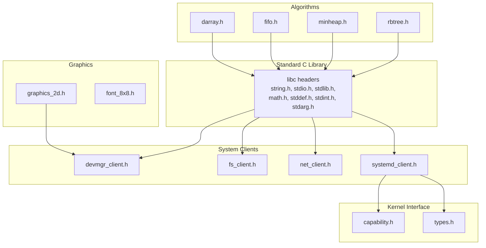
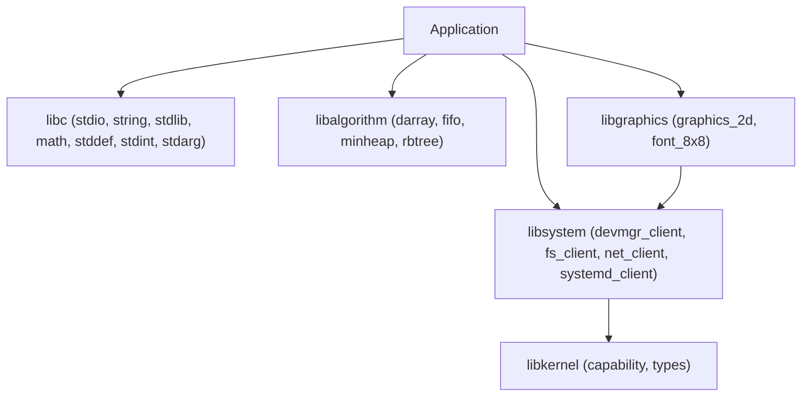
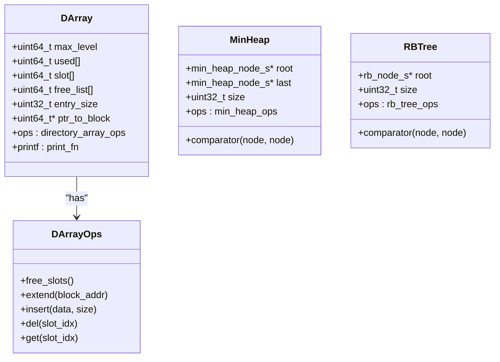
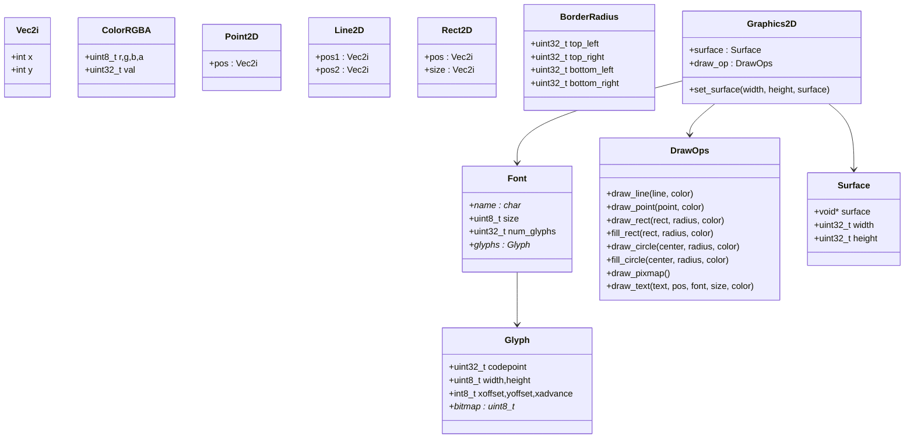
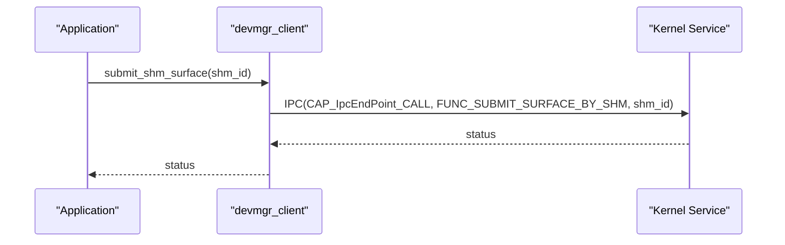
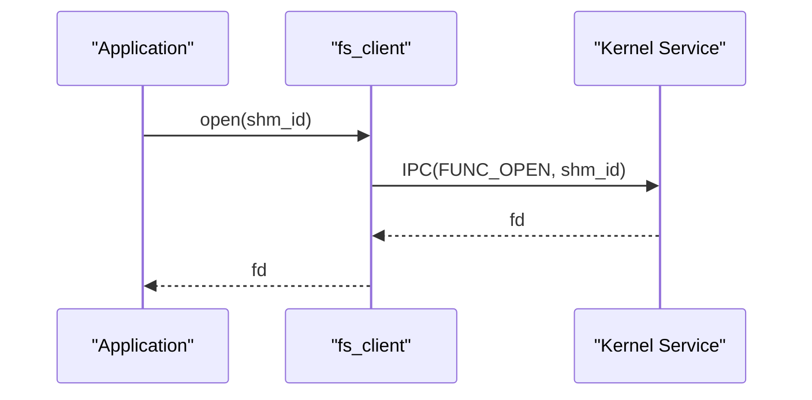
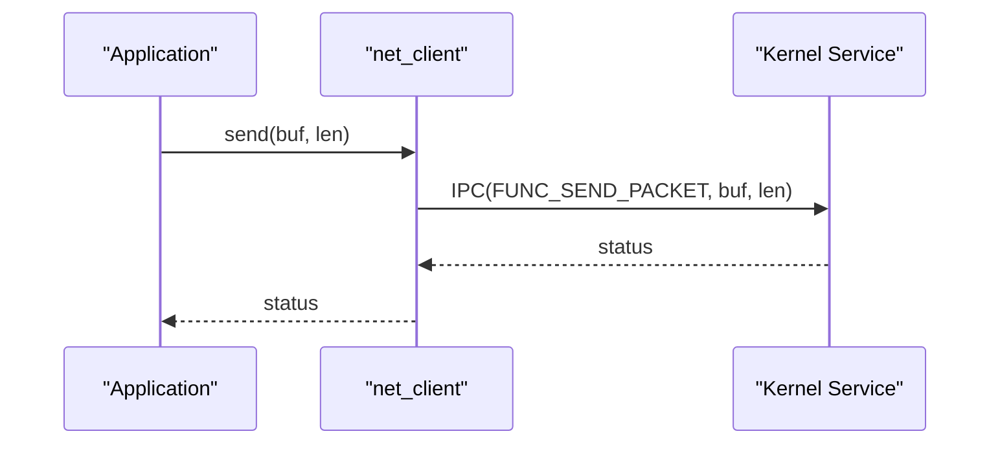
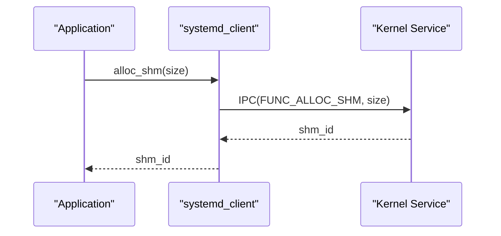
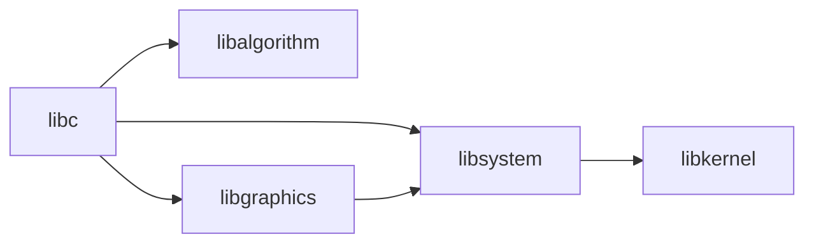

# User Libraries

<cite>
**Referenced Files in This Document**
- [ulibs/include/libc/string.h](file://ulibs/include/libc/string.h)
- [ulibs/include/libc/stdio.h](file://ulibs/include/libc/stdio.h)
- [ulibs/include/libc/stdlib.h](file://ulibs/include/libc/stdlib.h)
- [ulibs/include/libc/math.h](file://ulibs/include/libc/math.h)
- [ulibs/include/libc/stddef.h](file://ulibs/include/libc/stddef.h)
- [ulibs/include/libc/stdint.h](file://ulibs/include/libc/stdint.h)
- [ulibs/include/libc/stdarg.h](file://ulibs/include/libc/stdarg.h)
- [ulibs/include/libalgorithm/darray.h](file://ulibs/include/libalgorithm/darray.h)
- [ulibs/include/libalgorithm/fifo.h](file://ulibs/include/libalgorithm/fifo.h)
- [ulibs/include/libalgorithm/minheap.h](file://ulibs/include/libalgorithm/minheap.h)
- [ulibs/include/libalgorithm/rbtree.h](file://ulibs/include/libalgorithm/rbtree.h)
- [ulibs/include/libgraphics/graphics_2d.h](file://ulibs/include/libgraphics/graphics_2d.h)
- [ulibs/include/libgraphics/font_8x8.h](file://ulibs/include/libgraphics/font_8x8.h)
- [ulibs/include/libsystem/devmgr_client.h](file://ulibs/include/libsystem/devmgr_client.h)
- [ulibs/include/libsystem/fs_client.h](file://ulibs/include/libsystem/fs_client.h)
- [ulibs/include/libsystem/systemd_client.h](file://ulibs/include/libsystem/systemd_client.h)
- [ulibs/include/libsystem/net_client.h](file://ulibs/include/libsystem/net_client.h)
- [ulibs/include/libkernel/types.h](file://ulibs/include/libkernel/types.h)
- [ulibs/include/libkernel/capability.h](file://ulibs/include/libkernel/capability.h)
</cite>

## Table of Contents
1. [Introduction](#introduction)
2. [Project Structure](#project-structure)
3. [Core Components](#core-components)
4. [Architecture Overview](#architecture-overview)
5. [Detailed Component Analysis](#detailed-component-analysis)
6. [Dependency Analysis](#dependency-analysis)
7. [Performance Considerations](#performance-considerations)
8. [Troubleshooting Guide](#troubleshooting-guide)
9. [Conclusion](#conclusion)
10. [Appendices](#appendices)

## Introduction
This document describes the user-space library ecosystem of TranquilOS. It covers the standard C library subset, algorithm libraries, graphics primitives, and system client libraries. It also explains how these libraries integrate with the kernel via capabilities and IPC, and outlines design principles, API consistency, performance considerations, and extension guidelines.

## Project Structure
The user libraries are organized by domain:
- Standard C library subset: minimal headers for string, formatted I/O, memory allocation, math helpers, integer types, and variadic arguments.
- Algorithm libraries: dynamic arrays, FIFO queues, min-heaps, and red-black trees.
- Graphics libraries: 2D drawing primitives, surfaces, fonts, and glyph metadata.
- System client libraries: clients for device manager, filesystem, networking, and systemd services.
- Kernel interface: capability and type definitions used by clients and internal modules.

**Diagram sources**
- [ulibs/include/libc/string.h](file://ulibs/include/libc/string.h#L1-L13)
- [ulibs/include/libc/stdio.h](file://ulibs/include/libc/stdio.h#L1-L17)
- [ulibs/include/libc/stdlib.h](file://ulibs/include/libc/stdlib.h#L1-L12)
- [ulibs/include/libc/math.h](file://ulibs/include/libc/math.h#L1-L16)
- [ulibs/include/libc/stddef.h](file://ulibs/include/libc/stddef.h#L1-L50)
- [ulibs/include/libc/stdint.h](file://ulibs/include/libc/stdint.h#L1-L21)
- [ulibs/include/libc/stdarg.h](file://ulibs/include/libc/stdarg.h#L1-L9)
- [ulibs/include/libalgorithm/darray.h](file://ulibs/include/libalgorithm/darray.h#L1-L64)
- [ulibs/include/libalgorithm/fifo.h](file://ulibs/include/libalgorithm/fifo.h#L1-L27)
- [ulibs/include/libalgorithm/minheap.h](file://ulibs/include/libalgorithm/minheap.h#L1-L37)
- [ulibs/include/libalgorithm/rbtree.h](file://ulibs/include/libalgorithm/rbtree.h#L1-L45)
- [ulibs/include/libgraphics/graphics_2d.h](file://ulibs/include/libgraphics/graphics_2d.h#L1-L138)
- [ulibs/include/libgraphics/font_8x8.h](file://ulibs/include/libgraphics/font_8x8.h#L1-L9)
- [ulibs/include/libsystem/devmgr_client.h](file://ulibs/include/libsystem/devmgr_client.h#L1-L43)
- [ulibs/include/libsystem/fs_client.h](file://ulibs/include/libsystem/fs_client.h#L1-L47)
- [ulibs/include/libsystem/systemd_client.h](file://ulibs/include/libsystem/systemd_client.h#L1-L84)
- [ulibs/include/libsystem/net_client.h](file://ulibs/include/libsystem/net_client.h#L1-L31)
- [ulibs/include/libkernel/capability.h](file://ulibs/include/libkernel/capability.h#L1-L141)
- [ulibs/include/libkernel/types.h](file://ulibs/include/libkernel/types.h#L1-L76)

**Section sources**
- [ulibs/include/libc/string.h](file://ulibs/include/libc/string.h#L1-L13)
- [ulibs/include/libc/stdio.h](file://ulibs/include/libc/stdio.h#L1-L17)
- [ulibs/include/libc/stdlib.h](file://ulibs/include/libc/stdlib.h#L1-L12)
- [ulibs/include/libc/math.h](file://ulibs/include/libc/math.h#L1-L16)
- [ulibs/include/libc/stddef.h](file://ulibs/include/libc/stddef.h#L1-L50)
- [ulibs/include/libc/stdint.h](file://ulibs/include/libc/stdint.h#L1-L21)
- [ulibs/include/libc/stdarg.h](file://ulibs/include/libc/stdarg.h#L1-L9)
- [ulibs/include/libalgorithm/darray.h](file://ulibs/include/libalgorithm/darray.h#L1-L64)
- [ulibs/include/libalgorithm/fifo.h](file://ulibs/include/libalgorithm/fifo.h#L1-L27)
- [ulibs/include/libalgorithm/minheap.h](file://ulibs/include/libalgorithm/minheap.h#L1-L37)
- [ulibs/include/libalgorithm/rbtree.h](file://ulibs/include/libalgorithm/rbtree.h#L1-L45)
- [ulibs/include/libgraphics/graphics_2d.h](file://ulibs/include/libgraphics/graphics_2d.h#L1-L138)
- [ulibs/include/libgraphics/font_8x8.h](file://ulibs/include/libgraphics/font_8x8.h#L1-L9)
- [ulibs/include/libsystem/devmgr_client.h](file://ulibs/include/libsystem/devmgr_client.h#L1-L43)
- [ulibs/include/libsystem/fs_client.h](file://ulibs/include/libsystem/fs_client.h#L1-L47)
- [ulibs/include/libsystem/systemd_client.h](file://ulibs/include/libsystem/systemd_client.h#L1-L84)
- [ulibs/include/libsystem/net_client.h](file://ulibs/include/libsystem/net_client.h#L1-L31)
- [ulibs/include/libkernel/capability.h](file://ulibs/include/libkernel/capability.h#L1-L141)
- [ulibs/include/libkernel/types.h](file://ulibs/include/libkernel/types.h#L1-L76)

## Core Components
- Standard C library subset: Provides essential types, constants, and lightweight string/formatted I/O/malloc/exit APIs suitable for user-space applications.
- Algorithm libraries: Generic containers and data structures with function-pointer operation tables to support flexible implementations.
- Graphics library: 2D primitives, surfaces, and font glyphs with a draw-ops abstraction enabling backend pluggability.
- System client libraries: IPC-based clients for device manager, filesystem, networking, and systemd, exposing typed functions and constants.
- Kernel interface: Capability and type enums define kernel object types, capability references, and mapping result codes used by clients.

Key design principles:
- API consistency: All clients expose a similar pattern: a handle struct with an ops table of function pointers and a singleton accessor.
- Minimal kernel footprint: Clients encapsulate IPC and capability usage behind simple function calls.
- Extensibility: Draw-ops and algorithm operation tables allow swapping implementations without changing application code.

**Section sources**
- [ulibs/include/libc/string.h](file://ulibs/include/libc/string.h#L1-L13)
- [ulibs/include/libc/stdio.h](file://ulibs/include/libc/stdio.h#L1-L17)
- [ulibs/include/libc/stdlib.h](file://ulibs/include/libc/stdlib.h#L1-L12)
- [ulibs/include/libc/math.h](file://ulibs/include/libc/math.h#L1-L16)
- [ulibs/include/libc/stddef.h](file://ulibs/include/libc/stddef.h#L1-L50)
- [ulibs/include/libc/stdint.h](file://ulibs/include/libc/stdint.h#L1-L21)
- [ulibs/include/libgraphics/graphics_2d.h](file://ulibs/include/libgraphics/graphics_2d.h#L1-L138)
- [ulibs/include/libsystem/devmgr_client.h](file://ulibs/include/libsystem/devmgr_client.h#L1-L43)
- [ulibs/include/libsystem/fs_client.h](file://ulibs/include/libsystem/fs_client.h#L1-L47)
- [ulibs/include/libsystem/systemd_client.h](file://ulibs/include/libsystem/systemd_client.h#L1-L84)
- [ulibs/include/libsystem/net_client.h](file://ulibs/include/libsystem/net_client.h#L1-L31)
- [ulibs/include/libkernel/capability.h](file://ulibs/include/libkernel/capability.h#L1-L141)
- [ulibs/include/libkernel/types.h](file://ulibs/include/libkernel/types.h#L1-L76)

## Architecture Overview
The user-space libraries communicate with the kernel through capability-based IPC. Clients maintain a capability reference and dispatch method calls via function pointers. Graphics rendering targets a surface abstraction, allowing different backends. Algorithms and libc provide foundational building blocks.

**Diagram sources**
- [ulibs/include/libc/stdio.h](file://ulibs/include/libc/stdio.h#L1-L17)
- [ulibs/include/libc/string.h](file://ulibs/include/libc/string.h#L1-L13)
- [ulibs/include/libc/stdlib.h](file://ulibs/include/libc/stdlib.h#L1-L12)
- [ulibs/include/libc/math.h](file://ulibs/include/libc/math.h#L1-L16)
- [ulibs/include/libc/stddef.h](file://ulibs/include/libc/stddef.h#L1-L50)
- [ulibs/include/libc/stdint.h](file://ulibs/include/libc/stdint.h#L1-L21)
- [ulibs/include/libgraphics/graphics_2d.h](file://ulibs/include/libgraphics/graphics_2d.h#L1-L138)
- [ulibs/include/libgraphics/font_8x8.h](file://ulibs/include/libgraphics/font_8x8.h#L1-L9)
- [ulibs/include/libsystem/devmgr_client.h](file://ulibs/include/libsystem/devmgr_client.h#L1-L43)
- [ulibs/include/libsystem/fs_client.h](file://ulibs/include/libsystem/fs_client.h#L1-L47)
- [ulibs/include/libsystem/systemd_client.h](file://ulibs/include/libsystem/systemd_client.h#L1-L84)
- [ulibs/include/libsystem/net_client.h](file://ulibs/include/libsystem/net_client.h#L1-L31)
- [ulibs/include/libkernel/capability.h](file://ulibs/include/libkernel/capability.h#L1-L141)
- [ulibs/include/libkernel/types.h](file://ulibs/include/libkernel/types.h#L1-L76)

## Detailed Component Analysis

### Standard C Library Subset
- Types and constants: Defines integer types, endianness helpers, time base macros, memory sizes, PAGE_SIZE, and NULL/E_OK/E_ERR.
- String utilities: Length, compare, memcpy, memset, and strncmp.
- Formatted I/O: Base conversions, printf family, and string conversion helpers.
- Memory allocation: malloc/free and exit.
- Math helpers: GCD utility.

Usage patterns:
- Always check return codes for allocation and conversion functions.
- Use endianness helpers when serializing data for IPC or storage.
- Prefer libc’s printf/vprintf for deterministic output formatting.

Integration notes:
- These headers are foundational and consumed by all other user libraries and applications.

**Section sources**
- [ulibs/include/libc/stddef.h](file://ulibs/include/libc/stddef.h#L1-L50)
- [ulibs/include/libc/stdint.h](file://ulibs/include/libc/stdint.h#L1-L21)
- [ulibs/include/libc/string.h](file://ulibs/include/libc/string.h#L1-L13)
- [ulibs/include/libc/stdio.h](file://ulibs/include/libc/stdio.h#L1-L17)
- [ulibs/include/libc/stdlib.h](file://ulibs/include/libc/stdlib.h#L1-L12)
- [ulibs/include/libc/math.h](file://ulibs/include/libc/math.h#L1-L16)

### Algorithm Libraries
- Directory array (darray): Hierarchical indexing with configurable levels and operation callbacks for insert/delete/get/free-slot/extend.
- FIFO: Linked-list backed queue with in/out/remove and empty checks.
- Min-heap: Binary heap with comparator and dump support.
- Red-Black tree: Balanced BST with insert/delete/get-min and dump.

Design principles:
- Operation tables decouple algorithms from implementation specifics.
- Comparator-based ordering for heaps and trees.
- Error codes standardized per container.

Common usage patterns:
- Initialize containers with init functions and pass a comparator where applicable.
- Use operation tables to swap implementations without changing application code.
- Manage memory carefully; ensure free-lists and slots are handled consistently.

**Diagram sources**
- [ulibs/include/libalgorithm/darray.h](file://ulibs/include/libalgorithm/darray.h#L1-L64)
- [ulibs/include/libalgorithm/minheap.h](file://ulibs/include/libalgorithm/minheap.h#L1-L37)
- [ulibs/include/libalgorithm/rbtree.h](file://ulibs/include/libalgorithm/rbtree.h#L1-L45)

**Section sources**
- [ulibs/include/libalgorithm/darray.h](file://ulibs/include/libalgorithm/darray.h#L1-L64)
- [ulibs/include/libalgorithm/fifo.h](file://ulibs/include/libalgorithm/fifo.h#L1-L27)
- [ulibs/include/libalgorithm/minheap.h](file://ulibs/include/libalgorithm/minheap.h#L1-L37)
- [ulibs/include/libalgorithm/rbtree.h](file://ulibs/include/libalgorithm/rbtree.h#L1-L45)

### Graphics Library
- Primitives: Points, lines, rectangles, circles, and text glyphs.
- Surface: Width, height, and backing buffer abstraction.
- Draw operations: Function-pointer table for drawing primitives and text.
- Font: 8x8 bitmap font exposed as a constant.

Usage patterns:
- Initialize a graphics context and set a surface.
- Choose a font and draw text or shapes using the draw-ops table.
- Respect surface bounds and color channel ordering.

**Diagram sources**
- [ulibs/include/libgraphics/graphics_2d.h](file://ulibs/include/libgraphics/graphics_2d.h#L1-L138)
- [ulibs/include/libgraphics/font_8x8.h](file://ulibs/include/libgraphics/font_8x8.h#L1-L9)

**Section sources**
- [ulibs/include/libgraphics/graphics_2d.h](file://ulibs/include/libgraphics/graphics_2d.h#L1-L138)
- [ulibs/include/libgraphics/font_8x8.h](file://ulibs/include/libgraphics/font_8x8.h#L1-L9)

### System Client Libraries
Clients encapsulate IPC calls to kernel/system services. Each client exposes:
- An enum of service functions with stringification helpers.
- An ops table of function pointers for service calls.
- A handle struct containing a capability reference and the ops table.
- A singleton accessor to obtain the initialized client.

Representative clients:
- Device manager: get framebuffer, submit framebuffer, submit surface via shared memory, get CPIO address.
- Filesystem: open, read, write, close.
- Networking: send packet, receive packet, get MAC address.
- Systemd: allocate/free shared memory, get memory stats, register upcall, page fault, exit self.

**Diagram sources**
- [ulibs/include/libsystem/devmgr_client.h](file://ulibs/include/libsystem/devmgr_client.h#L1-L43)

**Diagram sources**
- [ulibs/include/libsystem/fs_client.h](file://ulibs/include/libsystem/fs_client.h#L1-L47)

**Diagram sources**
- [ulibs/include/libsystem/net_client.h](file://ulibs/include/libsystem/net_client.h#L1-L31)

**Diagram sources**
- [ulibs/include/libsystem/systemd_client.h](file://ulibs/include/libsystem/systemd_client.h#L1-L84)

**Section sources**
- [ulibs/include/libsystem/devmgr_client.h](file://ulibs/include/libsystem/devmgr_client.h#L1-L43)
- [ulibs/include/libsystem/fs_client.h](file://ulibs/include/libsystem/fs_client.h#L1-L47)
- [ulibs/include/libsystem/systemd_client.h](file://ulibs/include/libsystem/systemd_client.h#L1-L84)
- [ulibs/include/libsystem/net_client.h](file://ulibs/include/libsystem/net_client.h#L1-L31)

### Kernel Interface
- Capability references: Union encoding for cnode_id and slot index.
- Kernel object types: Enumerates XContext, SContext, VSpace, CNode, Console, SysCtrl, Self, IpcEndPoint, UpcallEndPoint.
- Mapping result codes: Comprehensive status codes for virtual memory mapping operations.

Usage patterns:
- Clients construct capability references and use them to call kernel methods via IPC endpoints.
- Mapping results should be checked and handled gracefully.

**Section sources**
- [ulibs/include/libkernel/capability.h](file://ulibs/include/libkernel/capability.h#L1-L141)
- [ulibs/include/libkernel/types.h](file://ulibs/include/libkernel/types.h#L1-L76)

## Dependency Analysis
- libc is a foundation for all other libraries.
- Algorithm libraries depend on libc types and constants.
- Graphics library depends on libc and font metadata.
- System clients depend on kernel capability and type definitions.
- Clients are independent of each other but share the kernel IPC model.

**Diagram sources**
- [ulibs/include/libc/stddef.h](file://ulibs/include/libc/stddef.h#L1-L50)
- [ulibs/include/libalgorithm/darray.h](file://ulibs/include/libalgorithm/darray.h#L1-L64)
- [ulibs/include/libgraphics/graphics_2d.h](file://ulibs/include/libgraphics/graphics_2d.h#L1-L138)
- [ulibs/include/libsystem/devmgr_client.h](file://ulibs/include/libsystem/devmgr_client.h#L1-L43)
- [ulibs/include/libkernel/capability.h](file://ulibs/include/libkernel/capability.h#L1-L141)

**Section sources**
- [ulibs/include/libc/stddef.h](file://ulibs/include/libc/stddef.h#L1-L50)
- [ulibs/include/libalgorithm/darray.h](file://ulibs/include/libalgorithm/darray.h#L1-L64)
- [ulibs/include/libgraphics/graphics_2d.h](file://ulibs/include/libgraphics/graphics_2d.h#L1-L138)
- [ulibs/include/libsystem/devmgr_client.h](file://ulibs/include/libsystem/devmgr_client.h#L1-L43)
- [ulibs/include/libkernel/capability.h](file://ulibs/include/libkernel/capability.h#L1-L141)

## Performance Considerations
- Minimize IPC calls: Batch operations where possible; reuse shared memory buffers.
- Choose appropriate containers: Heaps for priority scheduling, balanced trees for ordered maps, FIFO for queues.
- Graphics: Prefer filling rects and drawing primitives in batches; avoid excessive state changes.
- Memory: Use libc malloc/free consistently; avoid fragmentation by aligning allocations to cache line boundaries where appropriate.
- Time conversions: Use provided macros to convert between seconds, milliseconds, microseconds, and nanoseconds efficiently.

[No sources needed since this section provides general guidance]

## Troubleshooting Guide
- Allocation failures: Check return values from malloc; ensure alignment and size correctness.
- IPC errors: Verify capability references and function enumerations; confirm service availability.
- Graphics artifacts: Ensure surface dimensions and pixel formats match expectations; validate color channel order.
- Mapping failures: Inspect mapping result codes and handle invalid entries or already-mapped regions.

**Section sources**
- [ulibs/include/libc/stdlib.h](file://ulibs/include/libc/stdlib.h#L1-L12)
- [ulibs/include/libsystem/systemd_client.h](file://ulibs/include/libsystem/systemd_client.h#L1-L84)
- [ulibs/include/libgraphics/graphics_2d.h](file://ulibs/include/libgraphics/graphics_2d.h#L1-L138)
- [ulibs/include/libkernel/types.h](file://ulibs/include/libkernel/types.h#L1-L76)

## Conclusion
TranquilOS user libraries provide a cohesive, capability-driven ecosystem. The standard C subset offers essential building blocks, while algorithm and graphics libraries enable efficient data handling and rendering. System clients abstract kernel interactions, ensuring consistent APIs across services. Following the documented patterns ensures portability, performance, and maintainability.

[No sources needed since this section summarizes without analyzing specific files]

## Appendices

### API Consistency Guidelines
- Keep handle structs uniform: include a capability reference and an ops table.
- Expose a singleton accessor per client.
- Use enums for service functions with stringification helpers.
- Return status codes from IPC calls; document failure modes.

**Section sources**
- [ulibs/include/libsystem/devmgr_client.h](file://ulibs/include/libsystem/devmgr_client.h#L1-L43)
- [ulibs/include/libsystem/fs_client.h](file://ulibs/include/libsystem/fs_client.h#L1-L47)
- [ulibs/include/libsystem/systemd_client.h](file://ulibs/include/libsystem/systemd_client.h#L1-L84)
- [ulibs/include/libsystem/net_client.h](file://ulibs/include/libsystem/net_client.h#L1-L31)

### Extension Guidelines
- Define a new header under ulibs/include with a handle struct, ops table, and accessor.
- Add a corresponding implementation under ulibs/<libname> with initialization and IPC dispatch.
- Introduce service function enums and stringifiers for traceability.
- Provide examples of initialization, usage, and error handling in tests or sample apps.

**Section sources**
- [ulibs/include/libsystem/systemd_client.h](file://ulibs/include/libsystem/systemd_client.h#L1-L84)
- [ulibs/include/libkernel/capability.h](file://ulibs/include/libkernel/capability.h#L1-L141)