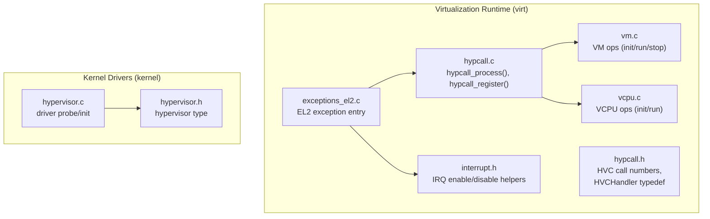
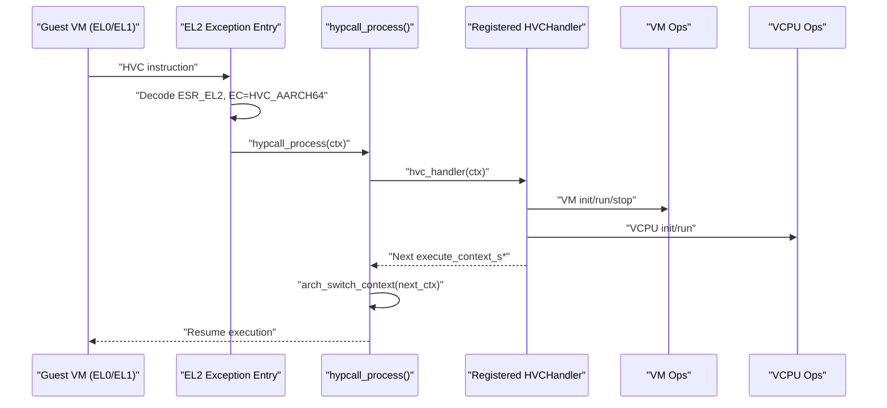
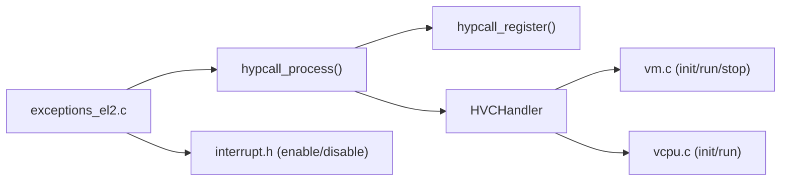

# Hypervisor Call System

<cite>
**Referenced Files in This Document**
- [hypcall.h](file://virt/include/hypcall/hypcall.h)
- [hypcall.c](file://virt/hypcall/hypcall.c)
- [exceptions_el2.c](file://virt/exceptions_el2.c)
- [exceptions_el2.h](file://virt/include/arch/arm64/exceptions_el2.h)
- [interrupt.h](file://virt/include/arch/arm64/interrupt.h)
- [vm.c](file://virt/vm.c)
- [vcpu.c](file://virt/vcpu.c)
- [hypervisor.h](file://kernel/drivers/hvdriver/hypervisor.h)
- [hypervisor.c](file://kernel/drivers/hvdriver/hypervisor.c)
</cite>

## Table of Contents
1. [Introduction](#introduction)
2. [Project Structure](#project-structure)
3. [Core Components](#core-components)
4. [Architecture Overview](#architecture-overview)
5. [Detailed Component Analysis](#detailed-component-analysis)
6. [Dependency Analysis](#dependency-analysis)
7. [Performance Considerations](#performance-considerations)
8. [Troubleshooting Guide](#troubleshooting-guide)
9. [Conclusion](#conclusion)

## Introduction
This document describes the hypervisor call (HVC) system in TranquilOS. It explains the hypervisor call interface, call numbers, parameter passing, return value handling, and the dispatching pipeline. It documents the hypervisor call handler registration and invocation, supported operations for VM and VCPU lifecycle management, and the security and performance characteristics of the HVC mechanism. Practical examples show how guest VMs make hypervisor calls, how responses are handled, and how parameters are managed. Guidance is also provided for debugging and monitoring hypervisor call activity.

## Project Structure
The hypervisor call system spans two primary areas:
- Virtualization runtime (virt): exception handling, hypcall dispatch, VM/VCPU management, and architecture-specific helpers.
- Kernel drivers (kernel): a placeholder hypervisor driver framework.

**Diagram sources**
- [exceptions_el2.c](file://virt/exceptions_el2.c#L51-L85)
- [hypcall.c](file://virt/hypcall/hypcall.c#L19-L25)
- [hypcall.h](file://virt/include/hypcall/hypcall.h#L6-L16)
- [vm.c](file://virt/vm.c#L48-L59)
- [vcpu.c](file://virt/vcpu.c#L55-L66)
- [interrupt.h](file://virt/include/arch/arm64/interrupt.h#L16-L38)
- [hypervisor.h](file://kernel/drivers/hvdriver/hypervisor.h#L7-L8)
- [hypervisor.c](file://kernel/drivers/hvdriver/hypervisor.c#L10-L21)

**Section sources**
- [hypcall.h](file://virt/include/hypcall/hypcall.h#L1-L18)
- [hypcall.c](file://virt/hypcall/hypcall.c#L1-L25)
- [exceptions_el2.c](file://virt/exceptions_el2.c#L1-L138)
- [vm.c](file://virt/vm.c#L1-L59)
- [vcpu.c](file://virt/vcpu.c#L1-L66)
- [hypervisor.h](file://kernel/drivers/hvdriver/hypervisor.h#L1-L11)
- [hypervisor.c](file://kernel/drivers/hvdriver/hypervisor.c#L1-L21)

## Core Components
- Hypervisor call interface and constants:
  - Call numbers define the operation set exposed to guests via HVC.
  - Handler registration allows plugging in a dispatcher function.
- EL2 exception entry:
  - Captures HVC traps and invokes the hypervisor call processor.
- VM and VCPU management:
  - VM lifecycle operations (init, run, stop).
  - VCPU lifecycle operations (init, run) and initial context setup.
- Interrupt control:
  - Helpers to enable/disable IRQs and related masks during transitions.

Key responsibilities:
- Translate guest HVC requests into kernel actions.
- Manage execution context switching after handling.
- Initialize VMs and VCPUs with appropriate registers and memory.

**Section sources**
- [hypcall.h](file://virt/include/hypcall/hypcall.h#L6-L16)
- [hypcall.c](file://virt/hypcall/hypcall.c#L13-L25)
- [exceptions_el2.c](file://virt/exceptions_el2.c#L51-L85)
- [vm.c](file://virt/vm.c#L48-L59)
- [vcpu.c](file://virt/vcpu.c#L19-L53)
- [interrupt.h](file://virt/include/arch/arm64/interrupt.h#L16-L38)

## Architecture Overview
The HVC pipeline:
1. Guest executes HVC instruction at EL0/EL1.
2. EL2 exception entry decodes the exception cause.
3. When the cause indicates HVC, the hypervisor call processor is invoked.
4. The processor delegates to a registered handler (if present) and switches to the returned execution context.
5. VM/VCPU operations are performed by the handler to fulfill the requested service.

**Diagram sources**
- [exceptions_el2.c](file://virt/exceptions_el2.c#L51-L85)
- [hypcall.c](file://virt/hypcall/hypcall.c#L19-L25)
- [hypcall.h](file://virt/include/hypcall/hypcall.h#L13-L16)
- [vm.c](file://virt/vm.c#L48-L59)
- [vcpu.c](file://virt/vcpu.c#L55-L66)

## Detailed Component Analysis

### Hypervisor Call Interface and Dispatch
- Call numbers:
  - HYPERCALL_HYPERVISOR_INIT
  - HYPERCALL_VM_INIT
  - HYPERCALL_VM_VCPU_CREATE
  - HYPERCALL_VM_VCPU_RUN
  - HYPERCALL_VM_VCPU_STOP
  - HYPERCALL_VM_VM_STOP
- Handler type:
  - HVCHandler: a function pointer that accepts an execute context and returns the next execute context.
- Registration:
  - hypcall_register installs the handler.
- Dispatch:
  - hypcall_process retrieves the next context from the handler and switches to it.

Implementation notes:
- The handler is optional; if unset, the processor still performs context switching.
- The handler is responsible for interpreting call numbers and parameters from the execute context and returning the next context for resumption.

**Section sources**
- [hypcall.h](file://virt/include/hypcall/hypcall.h#L6-L16)
- [hypcall.c](file://virt/hypcall/hypcall.c#L13-L25)

### EL2 Exception Entry and HVC Trap Handling
- EL2 lower AArch64 synchronous entry reads ESR_EL2 and inspects the Exception Class (EC).
- On EC_HVC_AARCH64, it logs and invokes hypcall_process with the current execute context.
- Other abort types are logged and can trigger a coredump path.
- Vector base is initialized via VBAR_EL2 to point to the exception table.

Security and correctness:
- Ensures alignment and validity of the exception vector base.
- Logs detailed reasons for various aborts to aid debugging.

**Section sources**
- [exceptions_el2.c](file://virt/exceptions_el2.c#L51-L85)
- [exceptions_el2.c](file://virt/exceptions_el2.c#L127-L137)

### VM Management Operations
- VM creation initializes operation pointers and clears VCPU lists.
- VM default operations include:
  - init: initializes virtual memory and iterates VCPUs to initialize each.
  - run: iterates VCPUs to start each.
  - stop: currently a no-op.
  - attach_vcpu: inserts a VCPU into the VM’s VCPU list.

Operational flow:
- Initialization sets up memory subsystem and per-VCPU initialization routines.
- Running iterates over attached VCPUs to start them.

**Section sources**
- [vm.c](file://virt/vm.c#L48-L59)
- [vm.c](file://virt/vm.c#L5-L19)
- [vm.c](file://virt/vm.c#L21-L33)
- [vm.c](file://virt/vm.c#L35-L44)

### VCPU Management Operations and Initial Context
- VCPU creation initializes operation pointers and list linkage.
- Default init sets up the ARM64 CPU context:
  - Clears common registers.
  - Sets x0 to the DTB address.
  - Allocates a stack page and sets SP_EL1.
  - Sets PC to the entry point and SPSR to a valid initial value.
- Default run switches to the VCPU’s execute context.

Parameter passing:
- DTB address is passed in x0.
- Entry point is set in PC.
- Stack pointer is set via page allocation.

Return value handling:
- The handler returns the next execute context; the processor switches to it.

**Section sources**
- [vcpu.c](file://virt/vcpu.c#L55-L66)
- [vcpu.c](file://virt/vcpu.c#L19-L53)

### Interrupt Control Helpers
- Provides inline helpers to enable/disable IRQs, FIQs,SError, and Debug exceptions.
- Useful for managing CPU state around context switches and sensitive operations.

**Section sources**
- [interrupt.h](file://virt/include/arch/arm64/interrupt.h#L16-L46)

### Hypervisor Driver Framework (Kernel)
- Placeholder hypervisor type definition exists.
- A minimal driver probe and registration routine are present, registering a device compatible with the hypervisor driver.

Note:
- This driver is not invoked by the HVC path described above; it exists as part of the kernel driver framework.

**Section sources**
- [hypervisor.h](file://kernel/drivers/hvdriver/hypervisor.h#L7-L8)
- [hypervisor.c](file://kernel/drivers/hvdriver/hypervisor.c#L6-L21)

## Dependency Analysis
The HVC system depends on:
- EL2 exception handling to capture HVC traps.
- Hypcall dispatch to route calls to handlers.
- VM/VCPU operations to fulfill requests.
- Architecture-specific register access macros and context switching primitives.

**Diagram sources**
- [exceptions_el2.c](file://virt/exceptions_el2.c#L51-L85)
- [hypcall.c](file://virt/hypcall/hypcall.c#L13-L25)
- [vm.c](file://virt/vm.c#L48-L59)
- [vcpu.c](file://virt/vcpu.c#L55-L66)
- [interrupt.h](file://virt/include/arch/arm64/interrupt.h#L16-L46)

**Section sources**
- [exceptions_el2.c](file://virt/exceptions_el2.c#L51-L85)
- [hypcall.c](file://virt/hypcall/hypcall.c#L13-L25)
- [vm.c](file://virt/vm.c#L48-L59)
- [vcpu.c](file://virt/vcpu.c#L55-L66)
- [interrupt.h](file://virt/include/arch/arm64/interrupt.h#L16-L46)

## Performance Considerations
- Minimize work inside the HVC handler to reduce latency.
- Use efficient context switching and avoid unnecessary allocations in the handler path.
- Keep VM/VCPU initialization lightweight; defer heavy work to later stages.
- Monitor exception vector alignment and validity to prevent misrouting overhead.

## Troubleshooting Guide
Common issues and diagnostics:
- HVC not recognized:
  - Verify EL2 exception vector base is set and aligned.
  - Confirm ESR_EL2 decoding identifies EC_HVC_AARCH64.
- No handler installed:
  - Ensure hypcall_register is called before guests issue HVC.
  - Without a handler, hypcall_process still switches contexts but performs no action.
- VM/VCPU operations fail silently:
  - Check VM default operations and VCPU context initialization.
  - Validate DTB address and entry point values passed to VCPU init.
- Aborts during HVC:
  - Inspect abort reasons logged by EL2 exception entry.
  - Investigate instruction/data abort causes and their impact on guest execution.

Debugging aids:
- EL2 exception logging provides detailed EC/IIS information.
- Use coredump path for unhandled cases to capture state.

**Section sources**
- [exceptions_el2.c](file://virt/exceptions_el2.c#L51-L85)
- [exceptions_el2.c](file://virt/exceptions_el2.c#L127-L137)
- [vcpu.c](file://virt/vcpu.c#L19-L53)
- [vm.c](file://virt/vm.c#L48-L59)

## Conclusion
The HVC system in TranquilOS provides a clean separation between exception handling and call processing. Guest VMs use HVC with predefined call numbers to request VM and VCPU operations. The hypervisor call processor routes these requests to a registered handler, which can invoke VM/VCPU operations and return the next execution context. Security is ensured by trapping HVC at EL2 and validating exception vectors. Performance is optimized by keeping handler logic lean and leveraging efficient context switching. The provided examples and troubleshooting guidance help implement, debug, and monitor the HVC pipeline effectively.