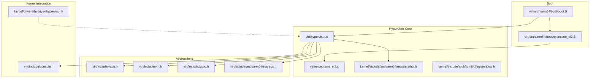
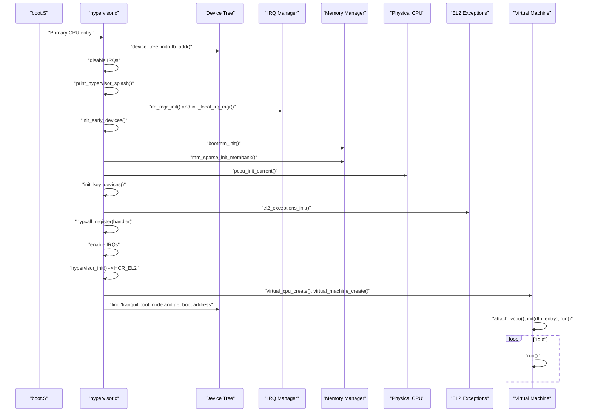
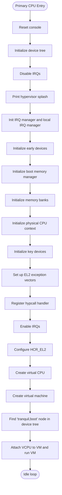
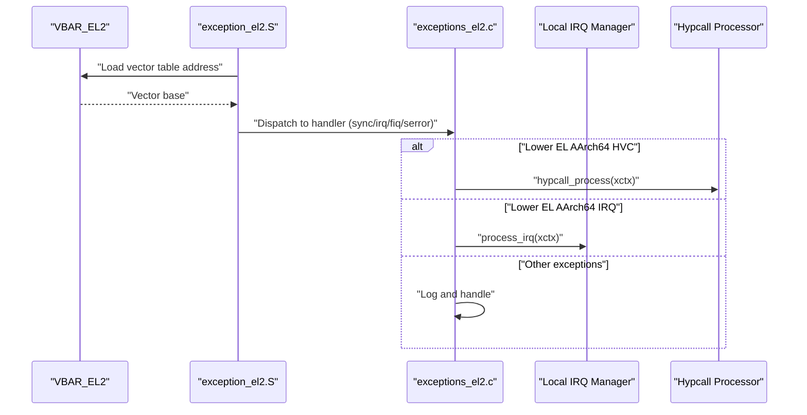
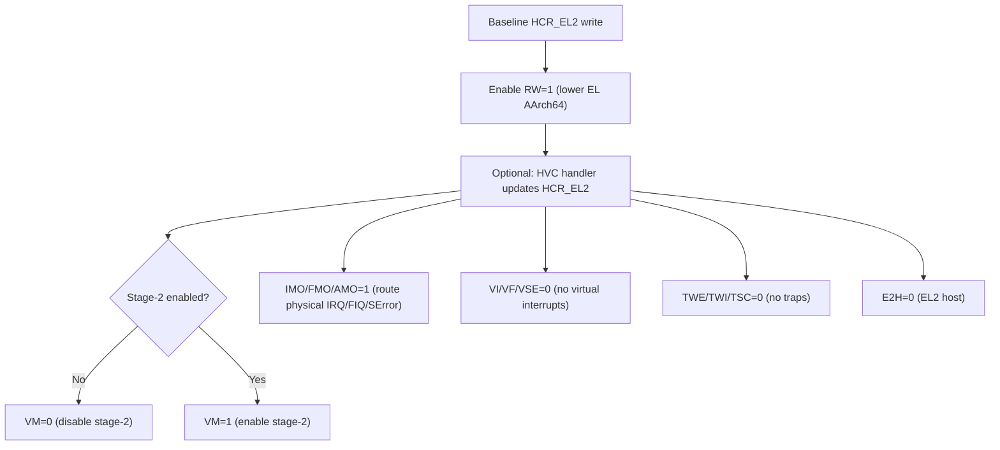
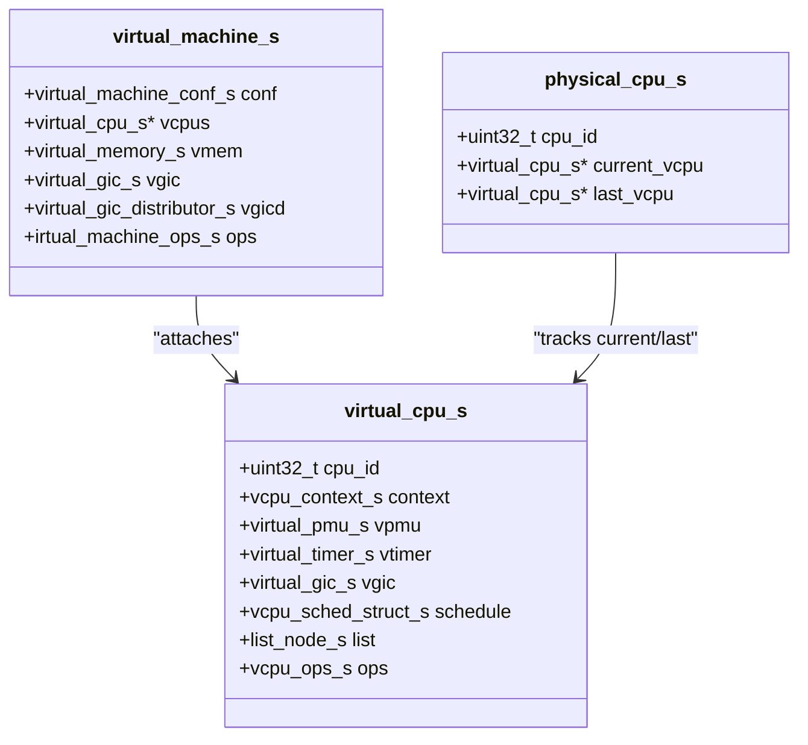
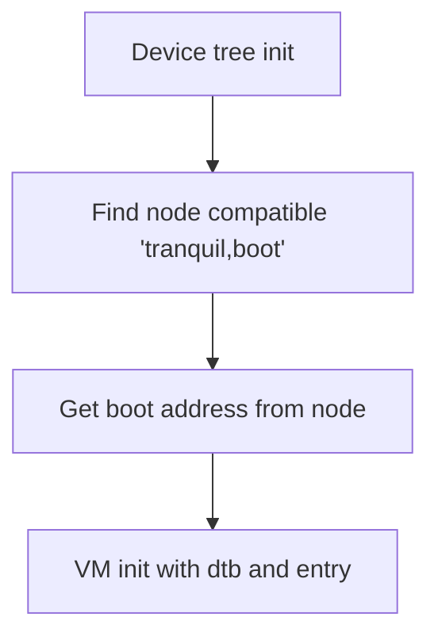
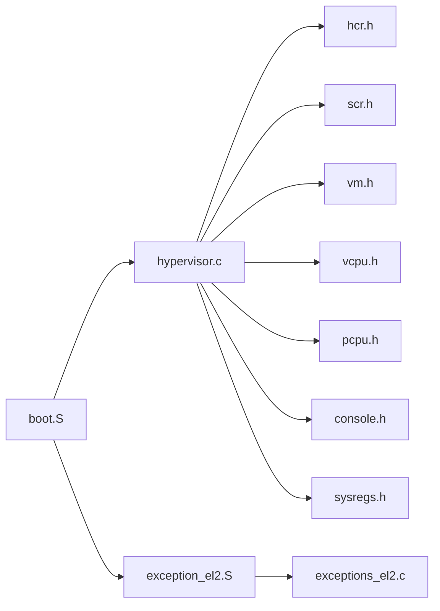

# Hypervisor Core Implementation

<cite>
**Referenced Files in This Document**
- [virt/hypervisor.c](file://virt/hypervisor.c)
- [virt/arch/arm64/boot/boot.S](file://virt/arch/arm64/boot/boot.S)
- [virt/arch/arm64/boot/exception_el2.S](file://virt/arch/arm64/boot/exception_el2.S)
- [virt/exceptions_el2.c](file://virt/exceptions_el2.c)
- [virt/include/vcpu.h](file://virt/include/vcpu.h)
- [virt/include/vm.h](file://virt/include/vm.h)
- [virt/include/pcpu.h](file://virt/include/pcpu.h)
- [virt/include/console.h](file://virt/include/console.h)
- [virt/include/arch/arm64/sysregs.h](file://virt/include/arch/arm64/sysregs.h)
- [kernel/include/arch/arm64/registers/hcr.h](file://kernel/include/arch/arm64/registers/hcr.h)
- [kernel/include/arch/arm64/registers/scr.h](file://kernel/include/arch/arm64/registers/scr.h)
- [kernel/drivers/hvdriver/hypervisor.h](file://kernel/drivers/hvdriver/hypervisor.h)
</cite>

## Table of Contents
1. [Introduction](#introduction)
2. [Project Structure](#project-structure)
3. [Core Components](#core-components)
4. [Architecture Overview](#architecture-overview)
5. [Detailed Component Analysis](#detailed-component-analysis)
6. [Dependency Analysis](#dependency-analysis)
7. [Performance Considerations](#performance-considerations)
8. [Troubleshooting Guide](#troubleshooting-guide)
9. [Conclusion](#conclusion)

## Introduction
This document explains the hypervisor core implementation in TranquilOS, focusing on the EL2 hypervisor initialization process, CPU initialization, system configuration, exception handling, interrupts, and the relationship between the hypervisor and the underlying kernel. It also covers the configuration registers controlling virtualization behavior (notably HCR_EL2), memory management initialization, and device tree processing. Practical examples illustrate the startup sequence, CPU binding, and privilege-level management, along with debugging techniques and performance considerations during boot.

## Project Structure
The hypervisor lives under the virtualization subsystem and interacts with the kernel’s architecture-specific modules, device tree, and interrupt management. Key areas include:
- Boot and entry points for primary and secondary CPUs
- Exception vectors and handlers for EL2
- Hypervisor configuration via HCR_EL2
- Virtual machine and virtual CPU abstractions
- Console and early device initialization
- Memory management initialization and device tree parsing

**Diagram sources**
- [virt/arch/arm64/boot/boot.S](file://virt/arch/arm64/boot/boot.S#L1-L57)
- [virt/arch/arm64/boot/exception_el2.S](file://virt/arch/arm64/boot/exception_el2.S#L1-L107)
- [virt/hypervisor.c](file://virt/hypervisor.c#L1-L149)
- [virt/exceptions_el2.c](file://virt/exceptions_el2.c#L1-L138)
- [kernel/include/arch/arm64/registers/hcr.h](file://kernel/include/arch/arm64/registers/hcr.h#L1-L72)
- [kernel/include/arch/arm64/registers/scr.h](file://kernel/include/arch/arm64/registers/scr.h#L1-L52)
- [virt/include/vcpu.h](file://virt/include/vcpu.h#L1-L49)
- [virt/include/vm.h](file://virt/include/vm.h#L1-L39)
- [virt/include/pcpu.h](file://virt/include/pcpu.h#L1-L18)
- [virt/include/arch/arm64/sysregs.h](file://virt/include/arch/arm64/sysregs.h#L1-L110)
- [virt/include/console.h](file://virt/include/console.h#L1-L19)
- [kernel/drivers/hvdriver/hypervisor.h](file://kernel/drivers/hvdriver/hypervisor.h#L1-L11)

**Section sources**
- [virt/arch/arm64/boot/boot.S](file://virt/arch/arm64/boot/boot.S#L1-L57)
- [virt/hypervisor.c](file://virt/hypervisor.c#L1-L149)

## Core Components
- Hypervisor entry points and initialization:
  - Primary CPU entry initializes console, device tree, early devices, boot memory manager, physical CPU context, exception vectors, hypervisor configuration, and starts the host VM.
  - Secondary CPU entry currently loops indefinitely.
- Exception handling:
  - EL2 exception vectors are set up and dispatched to handler functions covering current and lower EL contexts.
- Configuration registers:
  - HCR_EL2 controls virtualization behavior (stage-2 enable/disable, trap flags, lower-EL aarch64 mode, etc.).
  - SCR_EL3 provides secure monitor configuration (not directly used in EL2 host).
- Abstractions:
  - Virtual CPU and Virtual Machine structures define the runtime model for guest execution.
  - Physical CPU tracks current and last VCPU for scheduling-like behavior.
- Console and device tree:
  - Console reset and device tree initialization are performed early in the primary CPU path.
- System registers:
  - AArch64 system register context is modeled for virtual CPUs.

**Section sources**
- [virt/hypervisor.c](file://virt/hypervisor.c#L28-L149)
- [virt/exceptions_el2.c](file://virt/exceptions_el2.c#L127-L138)
- [kernel/include/arch/arm64/registers/hcr.h](file://kernel/include/arch/arm64/registers/hcr.h#L6-L70)
- [kernel/include/arch/arm64/registers/scr.h](file://kernel/include/arch/arm64/registers/scr.h#L6-L50)
- [virt/include/vcpu.h](file://virt/include/vcpu.h#L31-L44)
- [virt/include/vm.h](file://virt/include/vm.h#L25-L34)
- [virt/include/pcpu.h](file://virt/include/pcpu.h#L8-L12)
- [virt/include/console.h](file://virt/include/console.h#L13-L16)
- [virt/include/arch/arm64/sysregs.h](file://virt/include/arch/arm64/sysregs.h#L7-L104)

## Architecture Overview
The hypervisor boot path transitions from assembly to C, sets up the environment, configures EL2, and runs the host VM. EL2 exception vectors are established and routed to handlers that manage synchronous exceptions, IRQs, and HVC hypercalls.

**Diagram sources**
- [virt/arch/arm64/boot/boot.S](file://virt/arch/arm64/boot/boot.S#L24-L46)
- [virt/hypervisor.c](file://virt/hypervisor.c#L101-L145)
- [virt/exceptions_el2.c](file://virt/exceptions_el2.c#L127-L137)

## Detailed Component Analysis

### Hypervisor Initialization and Startup Sequence
- Primary CPU path:
  - Resets console, initializes device tree, disables IRQs, prints splash, initializes IRQ manager and early devices, boot memory manager, and memory banks.
  - Initializes physical CPU context, sets up EL2 exception vectors, registers hypcall handler, enables IRQs, configures HCR_EL2, creates VCPU and VM, locates boot address from device tree, attaches VCPU to VM, initializes VM with device tree and entry point, and starts VM execution.
- Secondary CPU path:
  - Currently loops indefinitely; placeholder for future SMP support.

**Diagram sources**
- [virt/hypervisor.c](file://virt/hypervisor.c#L101-L145)

**Section sources**
- [virt/hypervisor.c](file://virt/hypervisor.c#L101-L149)

### EL2 Exception Handling Setup and Dispatch
- Vector table:
  - Assembly defines the EL2 exception table with entries for current and lower EL contexts (sync, IRQ, FIQ, SError) for both AArch64 and AArch32.
- Handler registration:
  - The VBAR_EL2 is programmed to point to the vector table, and alignment is validated.
- Handler behaviors:
  - Current EL SP0 and SPx handlers log events.
  - Lower EL AArch64 HVC dispatches to hypcall processing.
  - Lower EL AArch64 IRQ delegates to local IRQ manager for processing.

**Diagram sources**
- [virt/arch/arm64/boot/exception_el2.S](file://virt/arch/arm64/boot/exception_el2.S#L64-L107)
- [virt/exceptions_el2.c](file://virt/exceptions_el2.c#L127-L137)
- [virt/exceptions_el2.c](file://virt/exceptions_el2.c#L75-L84)
- [virt/exceptions_el2.c](file://virt/exceptions_el2.c#L87-L101)

**Section sources**
- [virt/arch/arm64/boot/exception_el2.S](file://virt/arch/arm64/boot/exception_el2.S#L64-L107)
- [virt/exceptions_el2.c](file://virt/exceptions_el2.c#L127-L138)

### Hypervisor Configuration Registers (HCR_EL2)
- Purpose:
  - Controls virtualization behavior at EL2, including stage-2 translation enablement, routing of physical interrupts/FIQs/SError, trapping of WFI/WFE/SMC, and setting lower-EL to AArch64.
- Initialization:
  - The hypervisor writes a baseline HCR_EL2 value enabling lower-EL AArch64 execution.
  - A dedicated HVC handler updates HCR_EL2 with further flags (e.g., disabling stage-2 translation, enabling physical IRQ/FIQ/SError routing).
- Impact:
  - Disabling stage-2 translation allows direct mapping of physical memory to VMs.
  - Routing flags ensure physical interrupts are delivered to the hypervisor for distribution to VMs.
  - Trap flags prevent unintended exits from EL2 for power and system instructions.

**Diagram sources**
- [virt/hypervisor.c](file://virt/hypervisor.c#L47-L76)
- [kernel/include/arch/arm64/registers/hcr.h](file://kernel/include/arch/arm64/registers/hcr.h#L6-L70)

**Section sources**
- [virt/hypervisor.c](file://virt/hypervisor.c#L47-L76)
- [kernel/include/arch/arm64/registers/hcr.h](file://kernel/include/arch/arm64/registers/hcr.h#L6-L70)

### Virtual Machine and Virtual CPU Model
- Virtual CPU:
  - Holds execution context, AArch64 system register state, virtual PMU, virtual timer, and virtual GIC components.
  - Supports creation and lifecycle operations via function pointers.
- Virtual Machine:
  - Encapsulates configuration (name, CPU count, memory size), virtual CPUs, virtual memory, and virtual GIC components.
  - Provides operations to initialize, attach VCPU, and run the VM.
- Physical CPU:
  - Tracks current and last VCPU for scheduling-like behavior.

**Diagram sources**
- [virt/include/vcpu.h](file://virt/include/vcpu.h#L31-L44)
- [virt/include/vm.h](file://virt/include/vm.h#L25-L34)
- [virt/include/pcpu.h](file://virt/include/pcpu.h#L8-L12)

**Section sources**
- [virt/include/vcpu.h](file://virt/include/vcpu.h#L1-L49)
- [virt/include/vm.h](file://virt/include/vm.h#L1-L39)
- [virt/include/pcpu.h](file://virt/include/pcpu.h#L1-L18)

### Device Tree Processing and Boot Address Resolution
- The hypervisor initializes the device tree and searches for a compatible node indicating the boot entry point.
- It retrieves the boot address from the device tree node and passes it to the VM initialization routine.

**Diagram sources**
- [virt/hypervisor.c](file://virt/hypervisor.c#L137-L142)

**Section sources**
- [virt/hypervisor.c](file://virt/hypervisor.c#L137-L142)

### Console and Early Device Initialization
- Console reset is called early to ensure output is available during boot.
- Early devices and key devices are initialized before memory and VM setup.

**Section sources**
- [virt/hypervisor.c](file://virt/hypervisor.c#L101-L125)
- [virt/include/console.h](file://virt/include/console.h#L13-L16)

### Privilege Level Management and CPU Binding
- The boot assembly determines the current exception level and routes to the appropriate entry.
- Stack management per CPU is handled in assembly to separate stacks for each core.
- The hypervisor logs the current CPU ID and privilege level during splash.

**Section sources**
- [virt/arch/arm64/boot/boot.S](file://virt/arch/arm64/boot/boot.S#L7-L46)
- [virt/hypervisor.c](file://virt/hypervisor.c#L28-L33)

## Dependency Analysis
The hypervisor depends on:
- Architecture-specific boot and exception handling
- Kernel register definitions for HCR_EL2 and SCR_EL3
- Interrupt and IRQ manager infrastructure
- Memory management and device tree subsystems
- Console abstraction for early output

**Diagram sources**
- [virt/arch/arm64/boot/boot.S](file://virt/arch/arm64/boot/boot.S#L1-L57)
- [virt/arch/arm64/boot/exception_el2.S](file://virt/arch/arm64/boot/exception_el2.S#L1-L107)
- [virt/exceptions_el2.c](file://virt/exceptions_el2.c#L1-L138)
- [virt/hypervisor.c](file://virt/hypervisor.c#L1-L149)
- [kernel/include/arch/arm64/registers/hcr.h](file://kernel/include/arch/arm64/registers/hcr.h#L1-L72)
- [kernel/include/arch/arm64/registers/scr.h](file://kernel/include/arch/arm64/registers/scr.h#L1-L52)
- [virt/include/vcpu.h](file://virt/include/vcpu.h#L1-L49)
- [virt/include/vm.h](file://virt/include/vm.h#L1-L39)
- [virt/include/pcpu.h](file://virt/include/pcpu.h#L1-L18)
- [virt/include/console.h](file://virt/include/console.h#L1-L19)
- [virt/include/arch/arm64/sysregs.h](file://virt/include/arch/arm64/sysregs.h#L1-L110)

**Section sources**
- [virt/hypervisor.c](file://virt/hypervisor.c#L1-L149)
- [virt/exceptions_el2.c](file://virt/exceptions_el2.c#L1-L138)
- [kernel/include/arch/arm64/registers/hcr.h](file://kernel/include/arch/arm64/registers/hcr.h#L1-L72)
- [kernel/include/arch/arm64/registers/scr.h](file://kernel/include/arch/arm64/registers/scr.h#L1-L52)

## Performance Considerations
- Minimize early work: Perform only essential initialization before enabling interrupts to reduce boot latency.
- Efficient exception handling: Keep EL2 handlers lightweight; delegate heavy work to lower-level managers.
- Memory initialization: Use boot memory manager and sparse memory initialization to quickly allocate resources for VM creation.
- Stack separation: Per-CPU stacks avoid contention and improve reliability during early boot.
- HCR_EL2 tuning: Disable stage-2 translation when not needed to reduce translation overhead; enable routing flags to centralize interrupt handling.

[No sources needed since this section provides general guidance]

## Troubleshooting Guide
- Exception vector misalignment:
  - The hypervisor validates VBAR_EL2 alignment and logs errors if misconfigured.
- HVC not handled:
  - Ensure the HVC handler is registered and that lower-EL attempts to enter EL2 via HVC reach the hypervisor.
- IRQ delivery:
  - Verify that physical IRQ/FIQ/SError routing bits are set appropriately in HCR_EL2 and that the local IRQ manager is initialized.
- Boot hang on secondary CPU:
  - The secondary CPU entry currently loops; implement proper SMP bring-up if required.
- Device tree issues:
  - Confirm the presence of the compatible node for the boot entry and that the boot address is valid.

**Section sources**
- [virt/exceptions_el2.c](file://virt/exceptions_el2.c#L127-L137)
- [virt/hypervisor.c](file://virt/hypervisor.c#L128-L132)
- [virt/hypervisor.c](file://virt/hypervisor.c#L58-L76)

## Conclusion
The TranquilOS hypervisor implements a minimal but functional EL2 environment. The primary CPU boot path initializes the console, device tree, memory, and IRQ subsystems, programs EL2 exception vectors, configures HCR_EL2, and starts the host VM. EL2 exception handling is wired through assembly vectors to C handlers that manage synchronous exceptions, IRQs, and HVC hypercalls. The virtual machine and CPU abstractions provide a foundation for guest execution, while device tree processing supplies the boot entry point. Future enhancements could include stage-2 translation enablement, secondary CPU bring-up, and expanded hypcall coverage.