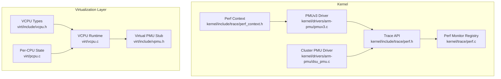
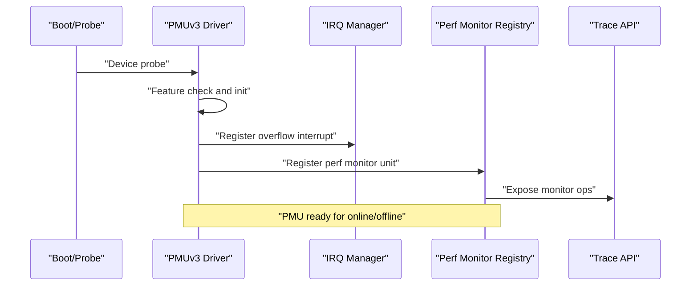
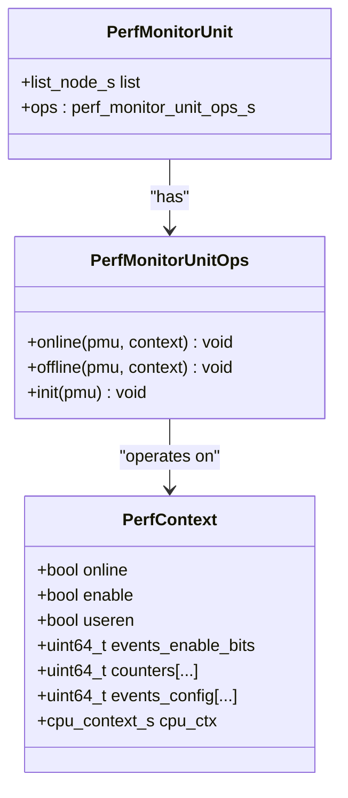
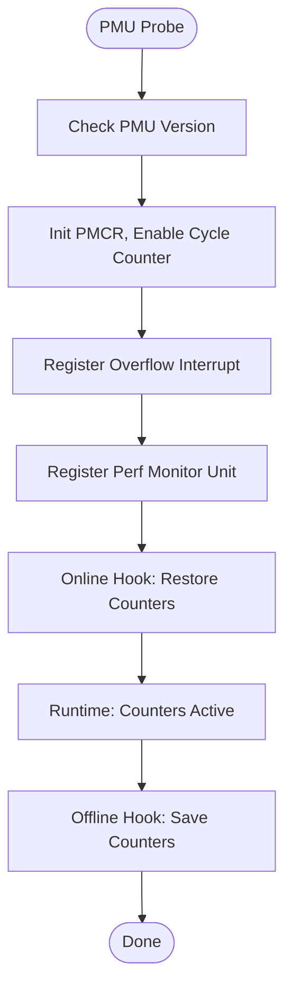
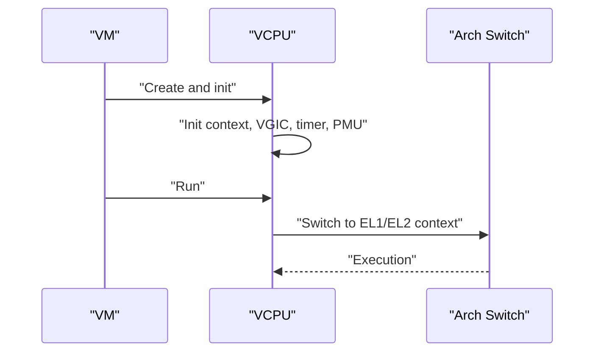
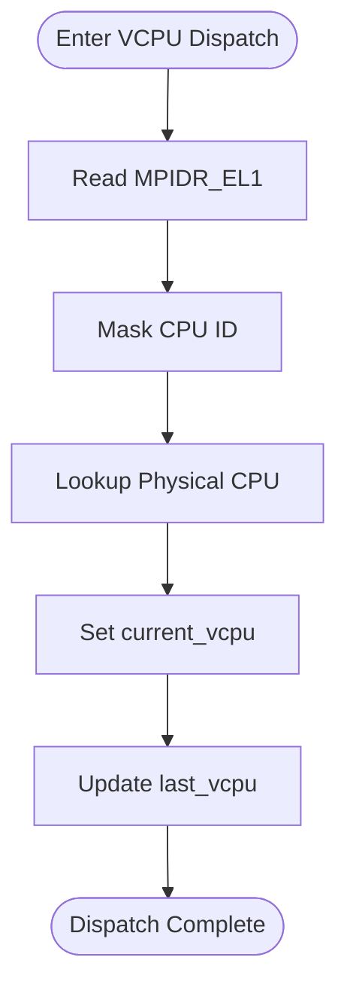
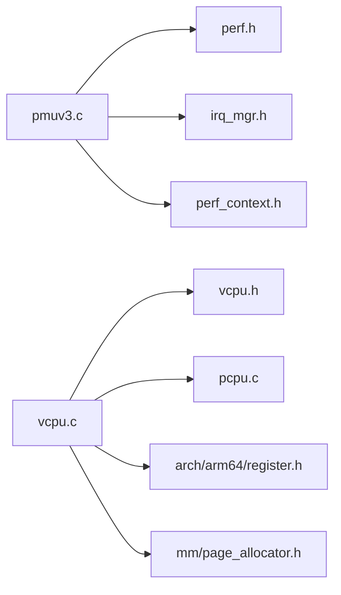

# Performance Monitoring and Optimization

<cite>
**Referenced Files in This Document**
- [perf.c](file://kernel/trace/perf.c)
- [perf.h](file://kernel/include/trace/perf.h)
- [perf_context.h](file://kernel/include/trace/perf_context.h)
- [pmuv3.c](file://kernel/drivers/arm-pmu/pmuv3.c)
- [dsu_pmu.c](file://kernel/drivers/arm-pmu/dsu_pmu.c)
- [vcpu.h](file://virt/include/vcpu.h)
- [vcpu.c](file://virt/vcpu.c)
- [pcpu.c](file://virt/pcpu.c)
- [vpmu.h](file://virt/include/vpmu.h)
</cite>

## Table of Contents
1. [Introduction](#introduction)
2. [Project Structure](#project-structure)
3. [Core Components](#core-components)
4. [Architecture Overview](#architecture-overview)
5. [Detailed Component Analysis](#detailed-component-analysis)
6. [Dependency Analysis](#dependency-analysis)
7. [Performance Considerations](#performance-considerations)
8. [Troubleshooting Guide](#troubleshooting-guide)
9. [Conclusion](#conclusion)
10. [Appendices](#appendices)

## Introduction
This document explains performance monitoring and optimization in the virtualization layer. It focuses on the performance tracing framework, per-CPU tracking, virtualization overhead measurement, and hypervisor operation tuning. It also covers performance metrics collection, monitoring tool integration, and regression detection. Implementation examples demonstrate measuring virtualization overhead, optimizing VCPU placement, and reducing hypervisor latency. Finally, it provides performance tuning guidelines, benchmarking approaches, and troubleshooting strategies for virtualized environments.

## Project Structure
The performance monitoring and optimization capabilities span two layers:
- Kernel-level performance tracing and PMU driver integration
- Hypervisor-level VCPU and per-CPU tracking

Key locations:
- Kernel tracing and PMU: kernel/include/trace, kernel/trace, kernel/drivers/arm-pmu
- Hypervisor VCPU and per-CPU: virt/include, virt/vcpu.c, virt/pcpu.c

**Diagram sources**
- [perf.h](file://kernel/include/trace/perf.h#L1-L27)
- [perf.c](file://kernel/trace/perf.c#L1-L6)
- [pmuv3.c](file://kernel/drivers/arm-pmu/pmuv3.c#L1-L267)
- [dsu_pmu.c](file://kernel/drivers/arm-pmu/dsu_pmu.c#L1-L44)
- [perf_context.h](file://kernel/include/trace/perf_context.h#L1-L22)
- [vcpu.h](file://virt/include/vcpu.h#L1-L49)
- [vcpu.c](file://virt/vcpu.c#L1-L66)
- [pcpu.c](file://virt/pcpu.c#L1-L22)
- [vpmu.h](file://virt/include/vpmu.h#L1-L8)

**Section sources**
- [perf.h](file://kernel/include/trace/perf.h#L1-L27)
- [perf.c](file://kernel/trace/perf.c#L1-L6)
- [pmuv3.c](file://kernel/drivers/arm-pmu/pmuv3.c#L1-L267)
- [dsu_pmu.c](file://kernel/drivers/arm-pmu/dsu_pmu.c#L1-L44)
- [perf_context.h](file://kernel/include/trace/perf_context.h#L1-L22)
- [vcpu.h](file://virt/include/vcpu.h#L1-L49)
- [vcpu.c](file://virt/vcpu.c#L1-L66)
- [pcpu.c](file://virt/pcpu.c#L1-L22)
- [vpmu.h](file://virt/include/vpmu.h#L1-L8)

## Core Components
- Performance tracing framework: defines the perf monitor unit interface and context, and exposes a registration hook for PMU drivers.
- PMUv3 driver: initializes and controls CPU performance counters, handles overflow interrupts, and saves/restores counter states across context switches.
- Cluster PMU driver: provides cluster-level PMU register access for multi-cluster systems.
- VCPU runtime: manages virtual CPU contexts, including initialization of virtual GIC, timers, and PMU stubs.
- Per-CPU tracking: maintains per-core state and links current/last VCPU for efficient dispatch and accounting.

Key responsibilities:
- Perf monitor unit: online/offline hooks, initialization, and registration.
- Perf context: stores enable bits, user enable, event configurations, and counter values.
- PMU driver: reset, save/restore counters, configure divider and resets, register overflow interrupt, and probe device features.
- VCPU: initialize context, VGIC, virtual timer, and virtual PMU; default run path via arch switch.
- Per-CPU: resolve current CPU ID and maintain per-CPU arrays for physical CPUs.

**Section sources**
- [perf.h](file://kernel/include/trace/perf.h#L1-L27)
- [perf_context.h](file://kernel/include/trace/perf_context.h#L1-L22)
- [pmuv3.c](file://kernel/drivers/arm-pmu/pmuv3.c#L1-L267)
- [dsu_pmu.c](file://kernel/drivers/arm-pmu/dsu_pmu.c#L1-L44)
- [vcpu.h](file://virt/include/vcpu.h#L1-L49)
- [vcpu.c](file://virt/vcpu.c#L1-L66)
- [pcpu.c](file://virt/pcpu.c#L1-L22)

## Architecture Overview
The performance monitoring architecture integrates kernel-level PMU drivers with the hypervisor’s VCPU and per-CPU tracking. PMU drivers register themselves via the perf monitor registry and manage hardware counters. The hypervisor initializes VCPU contexts and can integrate virtual PMU tracking. Per-CPU state tracks which VCPU runs on which physical CPU for scheduling and overhead analysis.

**Diagram sources**
- [pmuv3.c](file://kernel/drivers/arm-pmu/pmuv3.c#L205-L254)
- [perf.c](file://kernel/trace/perf.c#L1-L6)
- [perf.h](file://kernel/include/trace/perf.h#L1-L27)

## Detailed Component Analysis

### Performance Tracing Framework
The tracing framework defines:
- Perf monitor unit with online/offline/init callbacks
- Perf context storing enable bits, user enable, event configs, and counters
- Registration hook for PMU drivers

Implementation highlights:
- Monitor unit ops define lifecycle hooks for enabling/disabling counters and saving/restoring state.
- Perf context encapsulates state for a CPU’s PMU, including event enable bits and counter values.

**Diagram sources**
- [perf.h](file://kernel/include/trace/perf.h#L13-L22)
- [perf_context.h](file://kernel/include/trace/perf_context.h#L10-L19)

**Section sources**
- [perf.h](file://kernel/include/trace/perf.h#L1-L27)
- [perf_context.h](file://kernel/include/trace/perf_context.h#L1-L22)

### PMUv3 Driver
The PMUv3 driver:
- Probes device features and logs PMU version
- Initializes PMCR, enables cycle counter, sets divider and resets
- Registers overflow interrupt handler and perf monitor unit
- Saves and restores counters during context switches
- Controls user enable and global enable bits

Key routines:
- Feature check and logging
- Reset and restore/save counter routines
- Online/offline hooks for perf context
- Interrupt handler placeholder

**Diagram sources**
- [pmuv3.c](file://kernel/drivers/arm-pmu/pmuv3.c#L173-L203)
- [pmuv3.c](file://kernel/drivers/arm-pmu/pmuv3.c#L102-L155)
- [pmuv3.c](file://kernel/drivers/arm-pmu/pmuv3.c#L205-L254)

**Section sources**
- [pmuv3.c](file://kernel/drivers/arm-pmu/pmuv3.c#L1-L267)

### Cluster PMU Driver
The cluster PMU driver provides access to cluster-level PMU registers for multi-cluster systems. It defines read/write accessors for cluster PMU control, event counters, and interrupt registers.

**Section sources**
- [dsu_pmu.c](file://kernel/drivers/arm-pmu/dsu_pmu.c#L1-L44)

### VCPU Runtime and Virtual PMU
The VCPU runtime:
- Initializes the virtual CPU context, sets SP, PC, SPSR
- Initializes VGIC, virtual timer, and virtual PMU (placeholders)
- Provides default run path via arch switch

Virtual PMU is currently a stub type definition; future extensions can integrate virtualized PMU events and counters.

**Diagram sources**
- [vcpu.c](file://virt/vcpu.c#L19-L53)
- [vcpu.c](file://virt/vcpu.c#L15-L17)
- [vcpu.h](file://virt/include/vcpu.h#L31-L44)
- [vpmu.h](file://virt/include/vpmu.h#L4-L5)

**Section sources**
- [vcpu.c](file://virt/vcpu.c#L1-L66)
- [vcpu.h](file://virt/include/vcpu.h#L1-L49)
- [vpmu.h](file://virt/include/vpmu.h#L1-L8)

### Per-CPU Tracking
Per-CPU tracking:
- Resolves current CPU ID from MPIDR
- Maintains an array of physical CPUs
- Tracks current and last VCPU for scheduling decisions

**Diagram sources**
- [pcpu.c](file://virt/pcpu.c#L8-L21)

**Section sources**
- [pcpu.c](file://virt/pcpu.c#L1-L22)

## Dependency Analysis
- PMUv3 driver depends on:
  - Trace API for perf monitor registration
  - IRQ manager for overflow interrupt handling
  - Perf context for saving/restoring counters
- VCPU depends on:
  - Arch registers for context setup
  - Memory allocators for stack allocation
  - Per-CPU state for dispatch tracking
- Perf monitor registry ties PMU drivers into the tracing framework.

**Diagram sources**
- [pmuv3.c](file://kernel/drivers/arm-pmu/pmuv3.c#L1-L10)
- [perf.h](file://kernel/include/trace/perf.h#L1-L8)
- [vcpu.c](file://virt/vcpu.c#L1-L8)
- [vcpu.h](file://virt/include/vcpu.h#L1-L11)
- [pcpu.c](file://virt/pcpu.c#L1-L3)

**Section sources**
- [pmuv3.c](file://kernel/drivers/arm-pmu/pmuv3.c#L1-L267)
- [perf.h](file://kernel/include/trace/perf.h#L1-L27)
- [vcpu.c](file://virt/vcpu.c#L1-L66)
- [vcpu.h](file://virt/include/vcpu.h#L1-L49)
- [pcpu.c](file://virt/pcpu.c#L1-L22)

## Performance Considerations
- Minimize PMU overhead:
  - Use cycle counters sparingly; enable only necessary event counters
  - Batch save/restore operations during context switches
  - Keep overflow interrupt handling lightweight
- Optimize VCPU scheduling:
  - Track per-CPU current/last VCPU to reduce cross-CPU migrations
  - Prefer local dispatch when feasible
- Reduce hypervisor latency:
  - Use minimal context switching between host and guest
  - Avoid unnecessary PMU enable/disable transitions
- Memory management:
  - Pre-allocate VCPU stacks to avoid allocation under pressure
  - Reuse page allocators efficiently

[No sources needed since this section provides general guidance]

## Troubleshooting Guide
Common issues and remedies:
- PMU not initialized:
  - Verify device probe path and feature checks
  - Confirm PMCR, PMCNTENSET, and PMUSERENR settings after init
- Overflow interrupts not handled:
  - Ensure overflow interrupt is registered and EOI is performed
  - Validate interrupt mode and handler linkage
- Context switch anomalies:
  - Confirm save/restore routines capture all counters and event configs
  - Check enable bits and user enable flags are preserved
- VCPU dispatch errors:
  - Validate MPIDR reads and per-CPU array indexing
  - Ensure current/last VCPU pointers are updated consistently

**Section sources**
- [pmuv3.c](file://kernel/drivers/arm-pmu/pmuv3.c#L83-L100)
- [pmuv3.c](file://kernel/drivers/arm-pmu/pmuv3.c#L102-L155)
- [pcpu.c](file://virt/pcpu.c#L8-L21)
- [vcpu.c](file://virt/vcpu.c#L19-L53)

## Conclusion
The virtualization layer integrates a robust performance tracing framework with PMU drivers to measure and optimize virtualization overhead. Per-CPU tracking and VCPU runtime provide the foundation for efficient scheduling and reduced latency. By leveraging cycle counters, minimizing context transitions, and carefully managing PMU enable states, the hypervisor can achieve predictable performance while maintaining observability. Future work includes implementing virtual PMU tracking and expanding metrics collection for comprehensive performance analysis.

[No sources needed since this section summarizes without analyzing specific files]

## Appendices

### Implementation Examples

- Measuring virtualization overhead
  - Use cycle counters to measure guest execution time versus host time
  - Compare elapsed cycles around VCPU run paths to quantify overhead
  - Reference: [pmuv3.c](file://kernel/drivers/arm-pmu/pmuv3.c#L110-L155), [vcpu.c](file://virt/vcpu.c#L15-L17)

- Optimizing VCPU placement
  - Track current/last VCPU per physical CPU to favor locality
  - Reference: [pcpu.c](file://virt/pcpu.c#L8-L21)

- Reducing hypervisor latency
  - Limit PMU enable/disable transitions during frequent context switches
  - Reference: [pmuv3.c](file://kernel/drivers/arm-pmu/pmuv3.c#L136-L155)

- Performance metrics collection
  - Collect event counters and overflow interrupts for profiling
  - Reference: [pmuv3.c](file://kernel/drivers/arm-pmu/pmuv3.c#L83-L100), [perf_context.h](file://kernel/include/trace/perf_context.h#L10-L19)

- Monitoring tools integration
  - Register PMU devices and expose perf monitor units for external profilers
  - Reference: [pmuv3.c](file://kernel/drivers/arm-pmu/pmuv3.c#L246-L254), [perf.h](file://kernel/include/trace/perf.h#L19-L22)

- Performance regression detection
  - Establish baselines using saved counter states and compare across builds
  - Reference: [pmuv3.c](file://kernel/drivers/arm-pmu/pmuv3.c#L122-L134)

[No sources needed since this section aggregates previously cited references]