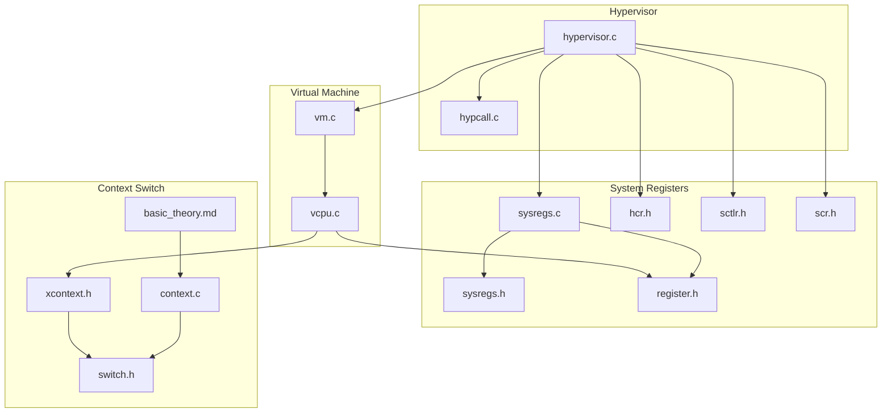
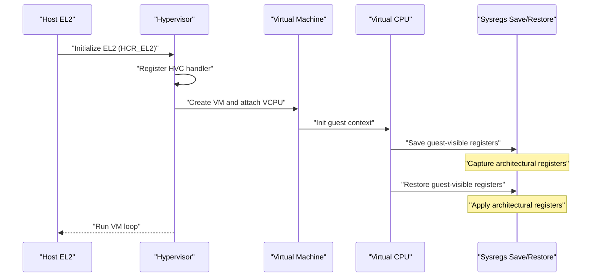
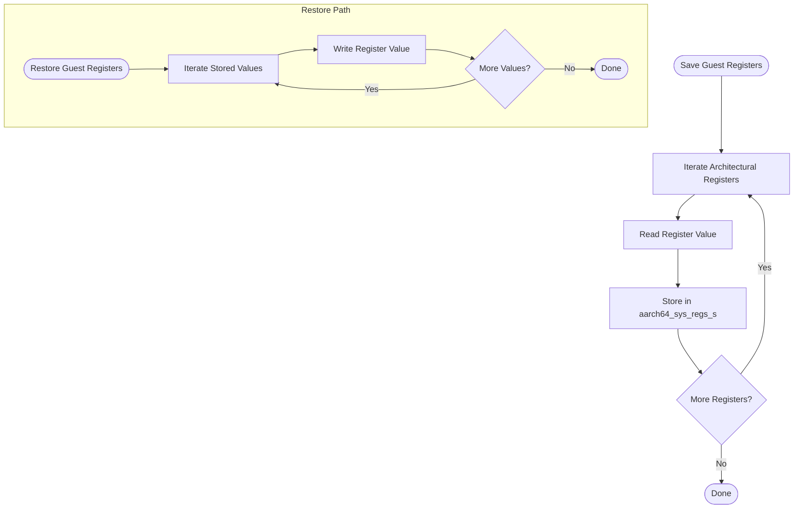
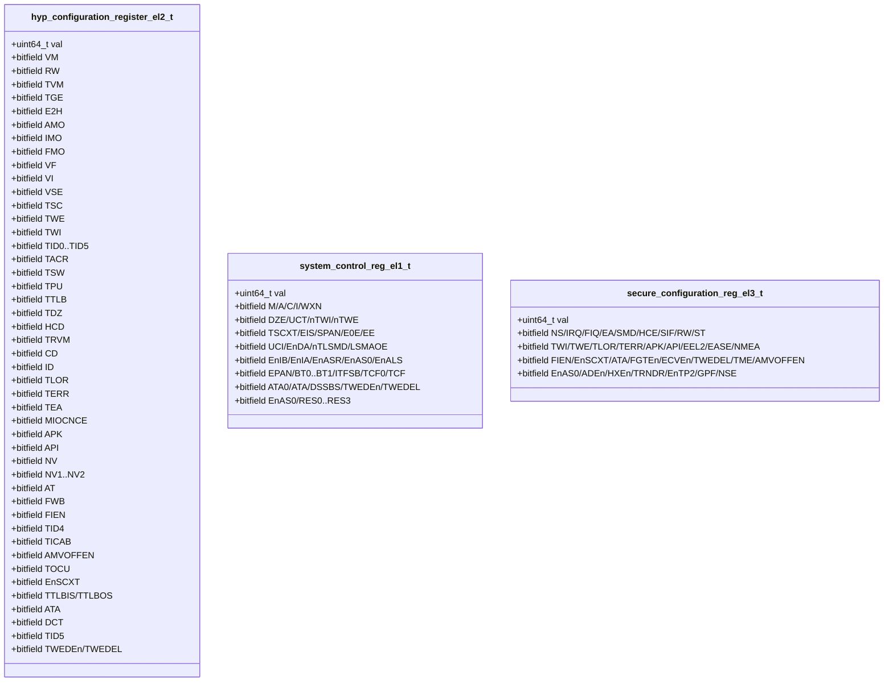
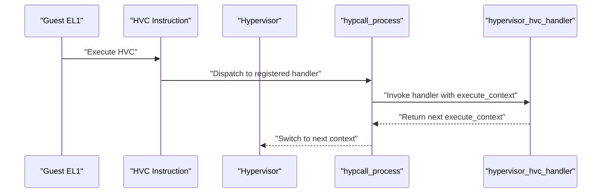
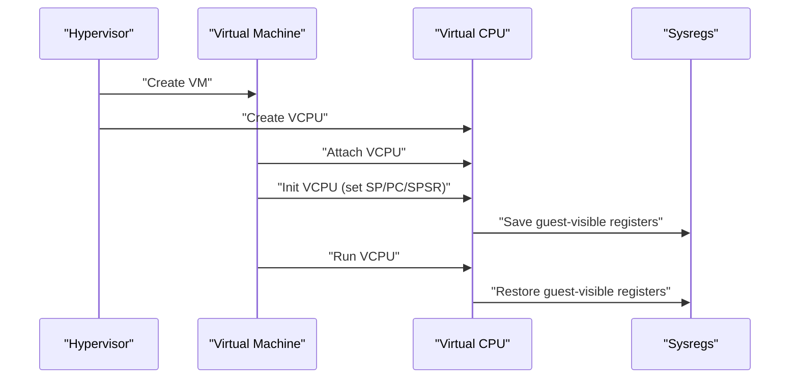
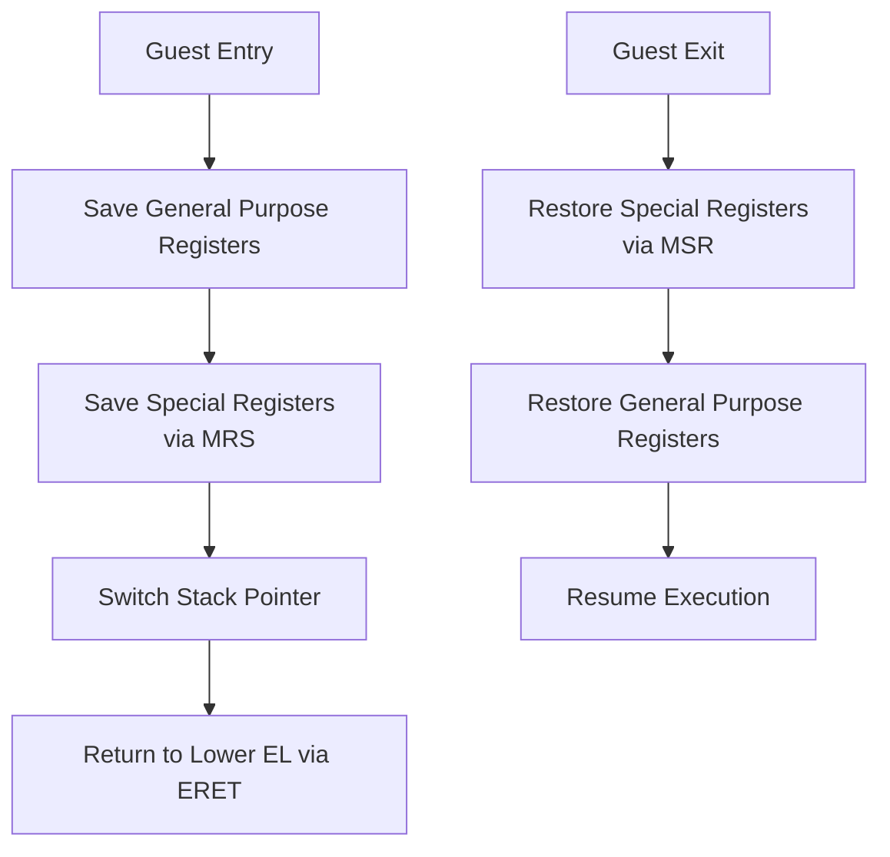
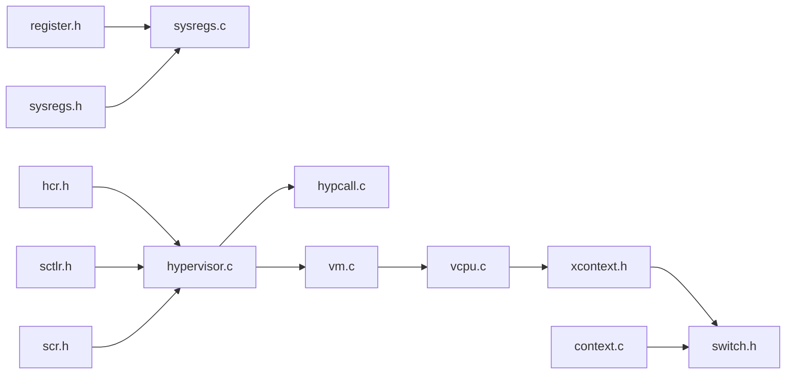

# System Register Management

<cite>
**Referenced Files in This Document**
- [sysregs.c](file://virt/arch/arm64/sysregs/sysregs.c)
- [sysregs.h](file://virt/include/arch/arm64/sysregs.h)
- [register.h](file://kernel/include/arch/arm64/register.h)
- [hcr.h](file://kernel/include/arch/arm64/registers/hcr.h)
- [sctlr.h](file://kernel/include/arch/arm64/registers/sctlr.h)
- [scr.h](file://kernel/include/arch/arm64/registers/scr.h)
- [hypervisor.c](file://virt/hypervisor.c)
- [hypcall.c](file://virt/hypcall/hypcall.c)
- [vcpu.c](file://virt/vcpu.c)
- [vm.c](file://virt/vm.c)
- [basic_theory.md](file://docs/basic_theory.md)
- [switch.h](file://kernel/include/arch/arm64/switch.h)
- [context.c](file://kernel/arch/arm64/context.c)
- [xcontext.h](file://kernel/include/xcontext/xcontext.h)
</cite>

## Table of Contents
1. [Introduction](#introduction)
2. [Project Structure](#project-structure)
3. [Core Components](#core-components)
4. [Architecture Overview](#architecture-overview)
5. [Detailed Component Analysis](#detailed-component-analysis)
6. [Dependency Analysis](#dependency-analysis)
7. [Performance Considerations](#performance-considerations)
8. [Troubleshooting Guide](#troubleshooting-guide)
9. [Conclusion](#conclusion)

## Introduction
This document explains the system register management in the EL2 hypervisor, focusing on how the hypervisor saves, restores, and virtualizes architectural system registers for virtual machines. It covers register virtualization techniques, register shadowing, synchronization between host and guest VMs, and the handling of control registers, status registers, and architectural registers. It also documents register access patterns, privilege-level handling, security implications, and practical examples for initialization, access control, and context-switch migration. Finally, it outlines performance optimizations and debugging approaches for register-related issues.

## Project Structure
The system register management spans several modules:
- Hypervisor entry and control flow orchestration
- System register save/restore routines for guest VM state
- Low-level register read/write helpers and typed register unions
- Virtual CPU and Virtual Machine lifecycle management
- Context switching and register access abstractions

**Diagram sources**
- [hypervisor.c](file://virt/hypervisor.c#L1-L149)
- [hypcall.c](file://virt/hypcall/hypcall.c#L1-L25)
- [vm.c](file://virt/vm.c#L1-L59)
- [vcpu.c](file://virt/vcpu.c#L1-L66)
- [sysregs.c](file://virt/arch/arm64/sysregs/sysregs.c#L1-L172)
- [sysregs.h](file://virt/include/arch/arm64/sysregs.h#L1-L110)
- [register.h](file://kernel/include/arch/arm64/register.h#L1-L93)
- [hcr.h](file://kernel/include/arch/arm64/registers/hcr.h#L1-L72)
- [sctlr.h](file://kernel/include/arch/arm64/registers/sctlr.h#L1-L61)
- [scr.h](file://kernel/include/arch/arm64/registers/scr.h#L1-L52)
- [xcontext.h](file://kernel/include/xcontext/xcontext.h#L1-L23)
- [switch.h](file://kernel/include/arch/arm64/switch.h#L1-L29)
- [context.c](file://kernel/arch/arm64/context.c#L50-L98)
- [basic_theory.md](file://docs/basic_theory.md#L175-L235)

**Section sources**
- [hypervisor.c](file://virt/hypervisor.c#L1-L149)
- [sysregs.c](file://virt/arch/arm64/sysregs/sysregs.c#L1-L172)
- [sysregs.h](file://virt/include/arch/arm64/sysregs.h#L1-L110)
- [register.h](file://kernel/include/arch/arm64/register.h#L1-L93)
- [hcr.h](file://kernel/include/arch/arm64/registers/hcr.h#L1-L72)
- [sctlr.h](file://kernel/include/arch/arm64/registers/sctlr.h#L1-L61)
- [scr.h](file://kernel/include/arch/arm64/registers/scr.h#L1-L52)
- [vm.c](file://virt/vm.c#L1-L59)
- [vcpu.c](file://virt/vcpu.c#L1-L66)
- [xcontext.h](file://kernel/include/xcontext/xcontext.h#L1-L23)
- [switch.h](file://kernel/include/arch/arm64/switch.h#L1-L29)
- [context.c](file://kernel/arch/arm64/context.c#L50-L98)
- [basic_theory.md](file://docs/basic_theory.md#L175-L235)

## Core Components
- System register save/restore: Implements bulk capture and restoration of architectural registers for guest state management.
- Typed register unions: Provide bitfield access to control/status registers such as HCR_EL2, SCTLR_EL1, and SCR_EL3.
- Hypervisor control flow: Initializes EL2 configuration, registers HVC handlers, and orchestrates VM/VCPU creation and run loops.
- Context abstraction: Defines the execute context and provides helpers for register access and context switching.

Key responsibilities:
- Save guest-visible registers prior to VM exit or context switch.
- Restore guest-visible registers upon VM entry or context switch.
- Expose typed accessors for architectural control/status registers.
- Coordinate register updates across host and guest boundaries.

**Section sources**
- [sysregs.c](file://virt/arch/arm64/sysregs/sysregs.c#L88-L172)
- [sysregs.h](file://virt/include/arch/arm64/sysregs.h#L7-L104)
- [register.h](file://kernel/include/arch/arm64/register.h#L70-L90)
- [hcr.h](file://kernel/include/arch/arm64/registers/hcr.h#L6-L70)
- [sctlr.h](file://kernel/include/arch/arm64/registers/sctlr.h#L6-L59)
- [scr.h](file://kernel/include/arch/arm64/registers/scr.h#L6-L50)
- [hypervisor.c](file://virt/hypervisor.c#L47-L76)
- [hypcall.c](file://virt/hypcall/hypcall.c#L19-L25)
- [xcontext.h](file://kernel/include/xcontext/xcontext.h#L7-L22)

## Architecture Overview
The hypervisor manages system registers at two levels:
- Host-level: EL2 configuration and routing via HCR_EL2 and related secure/privileged controls.
- Guest-level: Shadowed copies of architectural registers stored in a dedicated structure for each VM guest.

**Diagram sources**
- [hypervisor.c](file://virt/hypervisor.c#L47-L76)
- [hypervisor.c](file://virt/hypervisor.c#L128-L142)
- [vm.c](file://virt/vm.c#L5-L18)
- [vcpu.c](file://virt/vcpu.c#L47-L52)
- [sysregs.c](file://virt/arch/arm64/sysregs/sysregs.c#L88-L172)

## Detailed Component Analysis

### System Register Save/Restore Implementation
The save/restore functions capture and apply a comprehensive set of architectural registers for guest state management. They use generated read/write helpers to access registers and populate a typed structure.

**Diagram sources**
- [sysregs.c](file://virt/arch/arm64/sysregs/sysregs.c#L88-L172)
- [sysregs.h](file://virt/include/arch/arm64/sysregs.h#L7-L104)
- [register.h](file://kernel/include/arch/arm64/register.h#L80-L90)

Implementation highlights:
- Bulk register capture and restoration via generated macros for read/write.
- Centralized storage in a single structure for guest-visible registers.
- Clear separation between host and guest register domains.

**Section sources**
- [sysregs.c](file://virt/arch/arm64/sysregs/sysregs.c#L5-L172)
- [sysregs.h](file://virt/include/arch/arm64/sysregs.h#L7-L104)
- [register.h](file://kernel/include/arch/arm64/register.h#L80-L90)

### Typed Control/Status Registers
The hypervisor defines typed unions for architectural control/status registers to enable safe, structured access and bit manipulation.

**Diagram sources**
- [hcr.h](file://kernel/include/arch/arm64/registers/hcr.h#L6-L70)
- [sctlr.h](file://kernel/include/arch/arm64/registers/sctlr.h#L6-L59)
- [scr.h](file://kernel/include/arch/arm64/registers/scr.h#L6-L50)

Usage in hypervisor:
- HCR_EL2 is initialized and configured to route interrupts and control traps.
- SCTLR_EL1 and SCR_EL3 fields are used to manage memory and security behavior.

**Section sources**
- [hypervisor.c](file://virt/hypervisor.c#L47-L76)
- [hcr.h](file://kernel/include/arch/arm64/registers/hcr.h#L6-L70)
- [sctlr.h](file://kernel/include/arch/arm64/registers/sctlr.h#L6-L59)
- [scr.h](file://kernel/include/arch/arm64/registers/scr.h#L6-L50)

### Hypervisor Control Flow and HVC Handler Registration
The hypervisor initializes EL2, registers the HVC handler, and starts the VM lifecycle. HVC is used to enter the hypervisor from guest EL1.

**Diagram sources**
- [hypcall.c](file://virt/hypcall/hypcall.c#L19-L25)
- [hypervisor.c](file://virt/hypervisor.c#L78-L99)

**Section sources**
- [hypervisor.c](file://virt/hypervisor.c#L101-L142)
- [hypcall.c](file://virt/hypcall/hypcall.c#L1-L25)

### Virtual Machine and Virtual CPU Lifecycle
The VM and VCPU modules initialize guest contexts, set up stacks and entry points, and coordinate register state during runs.

**Diagram sources**
- [vm.c](file://virt/vm.c#L55-L59)
- [vcpu.c](file://virt/vcpu.c#L47-L52)
- [sysregs.c](file://virt/arch/arm64/sysregs/sysregs.c#L88-L172)

**Section sources**
- [vm.c](file://virt/vm.c#L1-L59)
- [vcpu.c](file://virt/vcpu.c#L1-L66)
- [sysregs.c](file://virt/arch/arm64/sysregs/sysregs.c#L88-L172)

### Context Switching and Register Access Abstractions
The kernel provides a typed execute context and low-level register accessors. The hypervisor leverages these to manage register state during transitions.

**Diagram sources**
- [basic_theory.md](file://docs/basic_theory.md#L175-L235)
- [context.c](file://kernel/arch/arm64/context.c#L50-L98)
- [xcontext.h](file://kernel/include/xcontext/xcontext.h#L7-L22)
- [switch.h](file://kernel/include/arch/arm64/switch.h#L6-L27)

**Section sources**
- [basic_theory.md](file://docs/basic_theory.md#L175-L235)
- [context.c](file://kernel/arch/arm64/context.c#L50-L98)
- [xcontext.h](file://kernel/include/xcontext/xcontext.h#L7-L22)
- [switch.h](file://kernel/include/arch/arm64/switch.h#L6-L27)

## Dependency Analysis
The system register management depends on:
- Low-level register read/write macros and typed unions for control/status registers.
- Hypervisor control flow to initialize EL2 and register handlers.
- VM/VCPU lifecycle to manage guest register state.
- Context switching infrastructure to move between host and guest.

**Diagram sources**
- [register.h](file://kernel/include/arch/arm64/register.h#L70-L90)
- [sysregs.c](file://virt/arch/arm64/sysregs/sysregs.c#L1-L172)
- [sysregs.h](file://virt/include/arch/arm64/sysregs.h#L1-L110)
- [hcr.h](file://kernel/include/arch/arm64/registers/hcr.h#L1-L72)
- [sctlr.h](file://kernel/include/arch/arm64/registers/sctlr.h#L1-L61)
- [scr.h](file://kernel/include/arch/arm64/registers/scr.h#L1-L52)
- [hypervisor.c](file://virt/hypervisor.c#L1-L149)
- [hypcall.c](file://virt/hypcall/hypcall.c#L1-L25)
- [vm.c](file://virt/vm.c#L1-L59)
- [vcpu.c](file://virt/vcpu.c#L1-L66)
- [xcontext.h](file://kernel/include/xcontext/xcontext.h#L1-L23)
- [switch.h](file://kernel/include/arch/arm64/switch.h#L1-L29)
- [context.c](file://kernel/arch/arm64/context.c#L50-L98)

**Section sources**
- [register.h](file://kernel/include/arch/arm64/register.h#L70-L90)
- [sysregs.c](file://virt/arch/arm64/sysregs/sysregs.c#L1-L172)
- [sysregs.h](file://virt/include/arch/arm64/sysregs.h#L1-L110)
- [hcr.h](file://kernel/include/arch/arm64/registers/hcr.h#L1-L72)
- [sctlr.h](file://kernel/include/arch/arm64/registers/sctlr.h#L1-L61)
- [scr.h](file://kernel/include/arch/arm64/registers/scr.h#L1-L52)
- [hypervisor.c](file://virt/hypervisor.c#L1-L149)
- [hypcall.c](file://virt/hypcall/hypcall.c#L1-L25)
- [vm.c](file://virt/vm.c#L1-L59)
- [vcpu.c](file://virt/vcpu.c#L1-L66)
- [xcontext.h](file://kernel/include/xcontext/xcontext.h#L1-L23)
- [switch.h](file://kernel/include/arch/arm64/switch.h#L1-L29)
- [context.c](file://kernel/arch/arm64/context.c#L50-L98)

## Performance Considerations
- Minimize register save/restore overhead by batching reads/writes and avoiding unnecessary register updates.
- Use typed unions to avoid repeated bit manipulation and reduce error-prone code paths.
- Keep guest-visible register sets compact; only shadow registers required for VM behavior.
- Exploit hardware capabilities (e.g., stage 2 translation) to reduce emulation overhead.
- Cache frequently accessed register values at VM/VCPU level to avoid repeated reads.

## Troubleshooting Guide
Common issues and remedies:
- Incorrect register state after VM exit/entry: Verify save/restore sequences and ensure all guest-visible registers are captured and applied.
- EL2 configuration misalignment: Review HCR_EL2 bits controlling traps and interrupt routing; confirm initialization order.
- HVC handler not invoked: Confirm hypcall registration and that guest executes HVC with expected parameters.
- Context switch failures: Validate special register preservation/restoration and ensure ERET targets correct PC.

Debugging steps:
- Log register values around save/restore boundaries.
- Cross-check HCR_EL2 configuration against expected VM behavior.
- Inspect execute context layout and ensure special registers are saved/restored in the correct order.

**Section sources**
- [sysregs.c](file://virt/arch/arm64/sysregs/sysregs.c#L88-L172)
- [hypervisor.c](file://virt/hypervisor.c#L47-L76)
- [hypcall.c](file://virt/hypcall/hypcall.c#L19-L25)
- [basic_theory.md](file://docs/basic_theory.md#L175-L235)

## Conclusion
The EL2 hypervisor’s system register management centers on a robust save/restore mechanism for guest-visible registers, typed accessors for architectural control/status registers, and a clear control flow for initialization and HVC dispatch. By separating host and guest register domains, leveraging context switching abstractions, and carefully configuring EL2 controls, the system achieves reliable virtualization of architectural registers with manageable overhead. Proper initialization, access control, and migration during context switches are essential for correctness and performance.