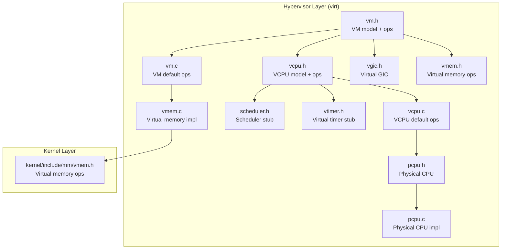
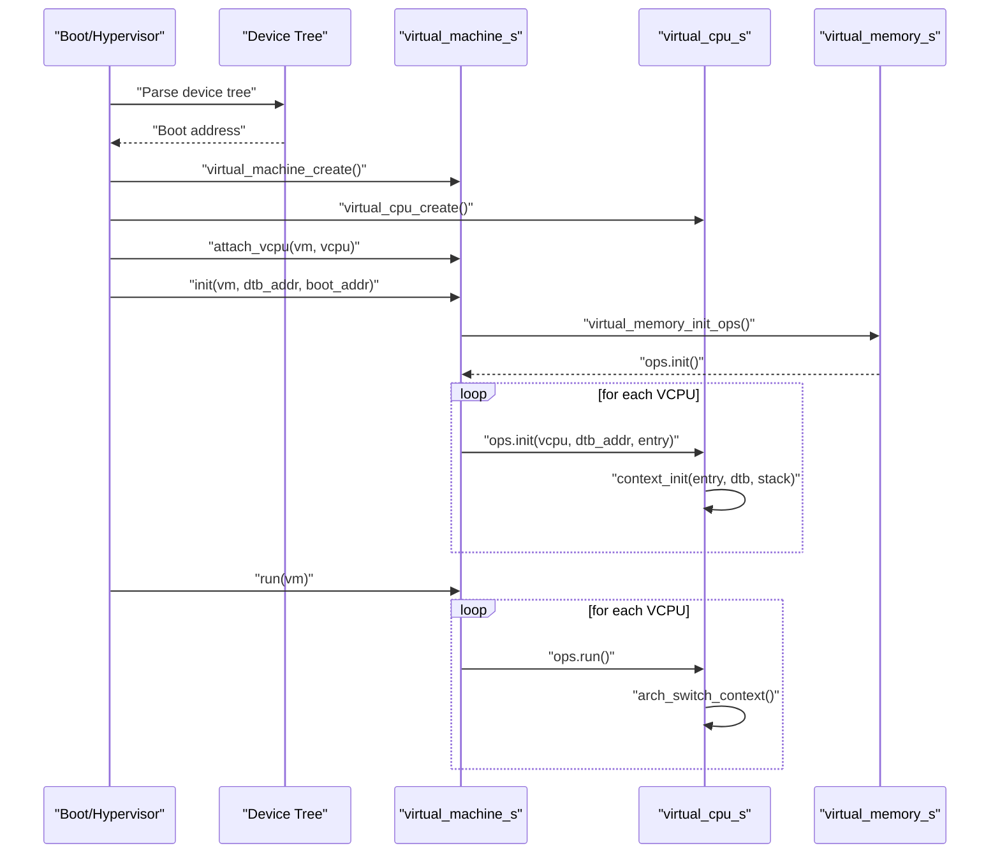
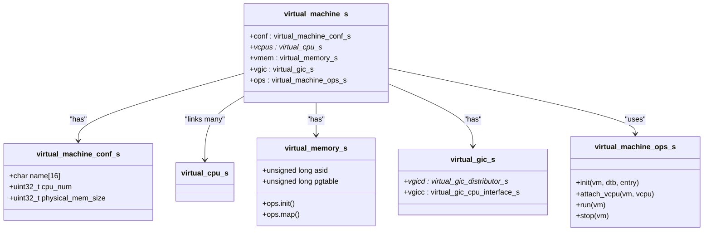
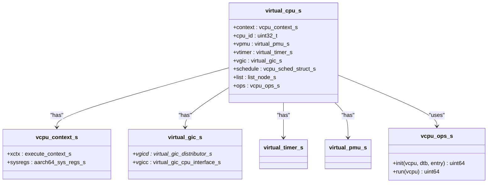
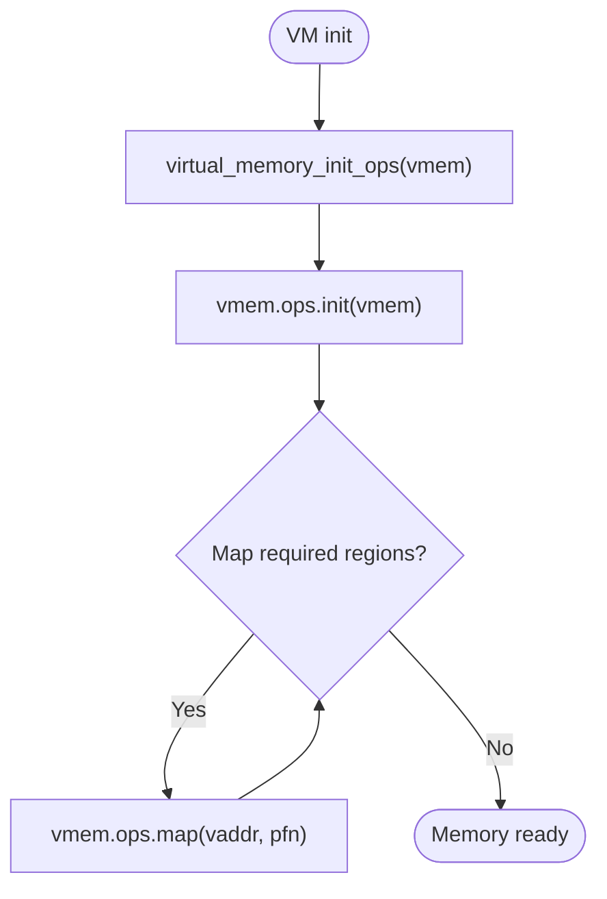
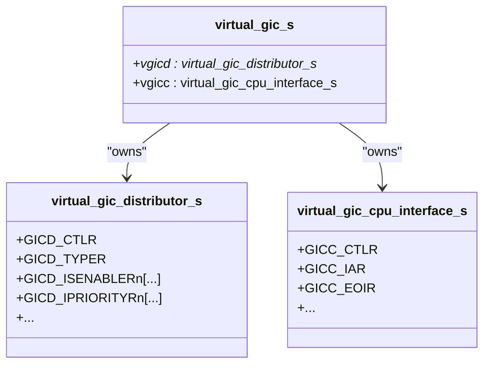
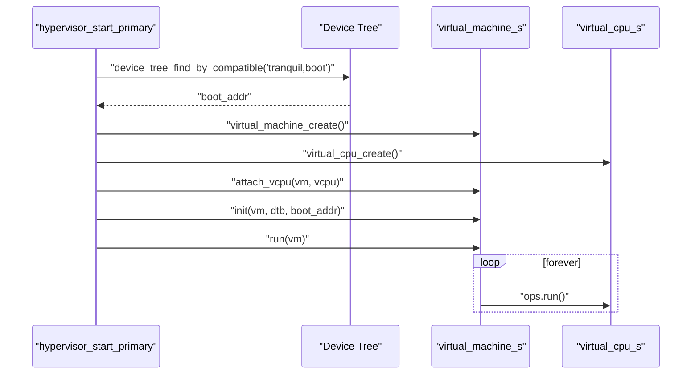
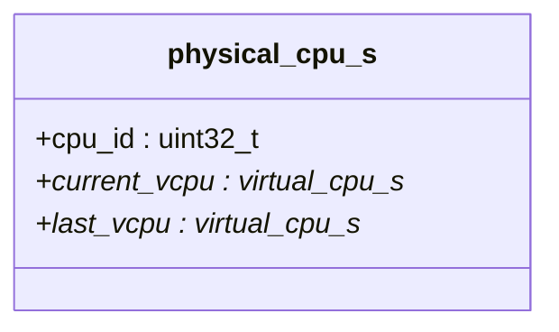
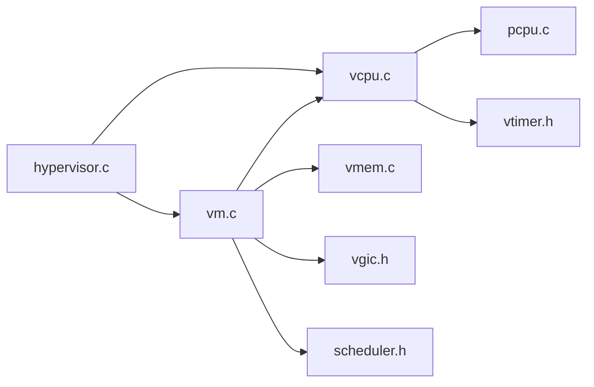

# Virtual Machine Management

<cite>
**Referenced Files in This Document**
- [vm.h](file://virt/include/vm.h)
- [vcpu.h](file://virt/include/vcpu.h)
- [vm.c](file://virt/vm.c)
- [vcpu.c](file://virt/vcpu.c)
- [vgic.h](file://virt/include/vgic.h)
- [vmem.h](file://kernel/include/mm/vmem.h)
- [vmem.c](file://virt/mm/vmem.c)
- [hypervisor.c](file://virt/hypervisor.c)
- [pcpu.h](file://virt/include/pcpu.h)
- [pcpu.c](file://virt/pcpu.c)
- [scheduler.h](file://virt/include/scheduler.h)
- [vtimer.h](file://virt/include/vtimer.h)
</cite>

## Table of Contents
1. [Introduction](#introduction)
2. [Project Structure](#project-structure)
3. [Core Components](#core-components)
4. [Architecture Overview](#architecture-overview)
5. [Detailed Component Analysis](#detailed-component-analysis)
6. [Dependency Analysis](#dependency-analysis)
7. [Performance Considerations](#performance-considerations)
8. [Troubleshooting Guide](#troubleshooting-guide)
9. [Conclusion](#conclusion)

## Introduction
This document explains virtual machine (VM) management in TranquilOS, focusing on the hypervisor’s VM lifecycle, VCPU creation and scheduling, configuration parameters, memory management, and device model integration. It documents the virtual_machine_s and virtual_cpu_s structures, their operations, and the initialization sequence from hypervisor startup to guest boot. It also outlines performance implications, debugging techniques, and monitoring approaches for VM management operations.

## Project Structure
The VM management subsystem resides primarily under the hypervisor layer (virt/) and integrates with the kernel’s memory management and device tree infrastructure. Key files include:
- VM model and operations: [vm.h](file://virt/include/vm.h), [vm.c](file://virt/vm.c)
- VCPU model and operations: [vcpu.h](file://virt/include/vcpu.h), [vcpu.c](file://virt/vcpu.c)
- Virtual memory management: [vmem.h](file://kernel/include/mm/vmem.h), [vmem.c](file://virt/mm/vmem.c)
- Virtual GIC model: [vgic.h](file://virt/include/vgic.h)
- Hypervisor bootstrap and VM orchestration: [hypervisor.c](file://virt/hypervisor.c)
- Physical CPU context: [pcpu.h](file://virt/include/pcpu.h), [pcpu.c](file://virt/pcpu.c)
- Scheduler stub: [scheduler.h](file://virt/include/scheduler.h)
- Virtual timer stub: [vtimer.h](file://virt/include/vtimer.h)

**Diagram sources**
- [vm.h](file://virt/include/vm.h#L1-L39)
- [vm.c](file://virt/vm.c#L1-L59)
- [vcpu.h](file://virt/include/vcpu.h#L1-L49)
- [vcpu.c](file://virt/vcpu.c#L1-L66)
- [vgic.h](file://virt/include/vgic.h#L1-L66)
- [pcpu.h](file://virt/include/pcpu.h#L1-L18)
- [pcpu.c](file://virt/pcpu.c#L1-L22)
- [scheduler.h](file://virt/include/scheduler.h#L1-L8)
- [vtimer.h](file://virt/include/vtimer.h#L1-L8)
- [vmem.h](file://kernel/include/mm/vmem.h#L1-L22)
- [vmem.c](file://virt/mm/vmem.c#L1-L17)

**Section sources**
- [vm.h](file://virt/include/vm.h#L1-L39)
- [vcpu.h](file://virt/include/vcpu.h#L1-L49)
- [vm.c](file://virt/vm.c#L1-L59)
- [vcpu.c](file://virt/vcpu.c#L1-L66)
- [vgic.h](file://virt/include/vgic.h#L1-L66)
- [vmem.h](file://kernel/include/mm/vmem.h#L1-L22)
- [vmem.c](file://virt/mm/vmem.c#L1-L17)
- [hypervisor.c](file://virt/hypervisor.c#L1-L149)
- [pcpu.h](file://virt/include/pcpu.h#L1-L18)
- [pcpu.c](file://virt/pcpu.c#L1-L22)
- [scheduler.h](file://virt/include/scheduler.h#L1-L8)
- [vtimer.h](file://virt/include/vtimer.h#L1-L8)

## Core Components
- virtual_machine_s: Encapsulates VM configuration, VCPU linkage, virtual memory, and virtual GIC. It exposes operation vectors for initialization, VCPU attachment, run, and stop.
- virtual_cpu_s: Represents a VCPU with context, CPU ID, optional virtual PMU/timer/GIC, scheduling node, and operation vectors for init and run.
- virtual_memory_s: Holds ASID and page table handle with operation vectors for initialization and mapping.
- virtual_gic_s: Describes virtual GIC distributor and CPU interface structures for interrupt virtualization.
- physical_cpu_s: Tracks per-physical-core state including current and last VCPU.

Key responsibilities:
- VM creation and lifecycle: VM creation initializes operation vectors and sets up empty VCPU lists.
- VCPU creation and initialization: VCPU creation initializes operation vectors and context fields; default init sets up registers and links to memory and device tree.
- Memory management: VM initialization triggers virtual memory initialization and mapping hooks; mapping is currently a stub.
- Device tree integration: Hypervisor resolves boot address from device tree nodes and passes it to VM initialization.

**Section sources**
- [vm.h](file://virt/include/vm.h#L19-L34)
- [vcpu.h](file://virt/include/vcpu.h#L26-L44)
- [vmem.h](file://kernel/include/mm/vmem.h#L12-L17)
- [vgic.h](file://virt/include/vgic.h#L60-L63)
- [pcpu.h](file://virt/include/pcpu.h#L8-L12)
- [vm.c](file://virt/vm.c#L55-L59)
- [vcpu.c](file://virt/vcpu.c#L60-L65)

## Architecture Overview
The hypervisor orchestrates VM lifecycle from boot. It initializes devices, memory, and interrupts, then creates a host VM and its VCPU. It discovers the guest boot address from the device tree and invokes VM initialization and run sequences.

**Diagram sources**
- [hypervisor.c](file://virt/hypervisor.c#L101-L145)
- [vm.c](file://virt/vm.c#L5-L33)
- [vcpu.c](file://virt/vcpu.c#L19-L53)
- [vmem.c](file://virt/mm/vmem.c#L4-L10)

**Section sources**
- [hypervisor.c](file://virt/hypervisor.c#L101-L145)
- [vm.c](file://virt/vm.c#L5-L33)
- [vcpu.c](file://virt/vcpu.c#L19-L53)
- [vmem.c](file://virt/mm/vmem.c#L4-L10)

## Detailed Component Analysis

### VM Model and Operations
- virtual_machine_conf_s: Stores VM name, CPU count, and physical memory size.
- virtual_machine_s: Contains configuration, linked list of VCPUs, virtual memory, and virtual GIC. Operation vectors are initialized by virtual_machine_create().
- Default operations:
  - init: Initializes virtual memory, then iterates VCPUs to initialize each via ops.init.
  - run: Iterates VCPUs to start execution via ops.run.
  - attach_vcpu: Inserts VCPU into a doubly-linked list anchored at vm->vcpus.
  - stop: No-op in default implementation.

**Diagram sources**
- [vm.h](file://virt/include/vm.h#L19-L34)

**Section sources**
- [vm.h](file://virt/include/vm.h#L19-L34)
- [vm.c](file://virt/vm.c#L5-L33)
- [vm.c](file://virt/vm.c#L35-L44)
- [vm.c](file://virt/vm.c#L48-L53)
- [vm.c](file://virt/vm.c#L55-L59)

### VCPU Model and Operations
- virtual_cpu_s: Holds execute context, AArch64 system registers, CPU ID, optional virtual PMU/timer/GIC, scheduling node, and operation vectors.
- Default operations:
  - init: Sets x0 to DTB address, allocates stack, sets pc to entry, initializes SPSR, and initializes virtual GIC/timer/PMU placeholders.
  - run: Switches to VCPU’s execute context.

**Diagram sources**
- [vcpu.h](file://virt/include/vcpu.h#L26-L44)
- [vcpu.c](file://virt/vcpu.c#L19-L53)

**Section sources**
- [vcpu.h](file://virt/include/vcpu.h#L14-L44)
- [vcpu.c](file://virt/vcpu.c#L19-L53)
- [vcpu.c](file://virt/vcpu.c#L55-L65)

### Virtual Memory Management
- virtual_memory_s: Provides ASID and page table handle plus operation vectors init and map.
- Default implementation: init and map are no-ops; mapping is intended to set up stage-2 page tables for the VM.

**Diagram sources**
- [vmem.h](file://kernel/include/mm/vmem.h#L4-L17)
- [vmem.c](file://virt/mm/vmem.c#L4-L10)
- [vm.c](file://virt/vm.c#L11-L12)

**Section sources**
- [vmem.h](file://kernel/include/mm/vmem.h#L4-L17)
- [vmem.c](file://virt/mm/vmem.c#L4-L10)
- [vm.c](file://virt/vm.c#L11-L12)

### Virtual GIC Model
- virtual_gic_s: Composed of a pointer to a virtual GIC distributor and a virtual GIC CPU interface structure. Stage-2 translation can route GIC register accesses to physical addresses for the guest.

**Diagram sources**
- [vgic.h](file://virt/include/vgic.h#L4-L63)

**Section sources**
- [vgic.h](file://virt/include/vgic.h#L4-L63)

### Hypervisor Orchestration and VM Initialization
- Host VM and VCPU: A host VM is prebuilt with a single VCPU and named “host”.
- Initialization sequence:
  - Parse device tree to locate boot address.
  - Create VCPU and VM.
  - Attach VCPU to VM.
  - Initialize VM with DTB and entry address.
  - Run VM to start VCPU execution.

**Diagram sources**
- [hypervisor.c](file://virt/hypervisor.c#L137-L142)

**Section sources**
- [hypervisor.c](file://virt/hypervisor.c#L39-L45)
- [hypervisor.c](file://virt/hypervisor.c#L101-L145)

### Physical CPU Context
- physical_cpu_s: Tracks per-physical-core CPU ID and pointers to current and last VCPU. Used to associate execution context with a physical core.

**Diagram sources**
- [pcpu.h](file://virt/include/pcpu.h#L8-L12)
- [pcpu.c](file://virt/pcpu.c#L8-L16)

**Section sources**
- [pcpu.h](file://virt/include/pcpu.h#L8-L12)
- [pcpu.c](file://virt/pcpu.c#L8-L16)

### Scheduler and Timer Stubs
- scheduler.h: Empty scheduler type definition indicates a placeholder for VM scheduling policy.
- vtimer.h: Empty virtual timer type definition indicates a placeholder for virtual timer functionality.

**Section sources**
- [scheduler.h](file://virt/include/scheduler.h#L1-L8)
- [vtimer.h](file://virt/include/vtimer.h#L1-L8)

## Dependency Analysis
- VM depends on VCPU, virtual memory, and virtual GIC.
- VCPU depends on execute context, AArch64 system registers, and optional virtual PMU/timer/GIC.
- VM initialization depends on virtual memory operations and device tree boot address discovery.
- Hypervisor orchestrates VM creation, VCPU creation, and initialization sequence.

**Diagram sources**
- [hypervisor.c](file://virt/hypervisor.c#L1-L149)
- [vm.c](file://virt/vm.c#L1-L59)
- [vcpu.c](file://virt/vcpu.c#L1-L66)
- [vmem.c](file://virt/mm/vmem.c#L1-L17)
- [pcpu.c](file://virt/pcpu.c#L1-L22)
- [vgic.h](file://virt/include/vgic.h#L1-L66)
- [vtimer.h](file://virt/include/vtimer.h#L1-L8)
- [scheduler.h](file://virt/include/scheduler.h#L1-L8)

**Section sources**
- [hypervisor.c](file://virt/hypervisor.c#L1-L149)
- [vm.c](file://virt/vm.c#L1-L59)
- [vcpu.c](file://virt/vcpu.c#L1-L66)
- [vmem.c](file://virt/mm/vmem.c#L1-L17)
- [pcpu.c](file://virt/pcpu.c#L1-L22)
- [vgic.h](file://virt/include/vgic.h#L1-L66)
- [vtimer.h](file://virt/include/vtimer.h#L1-L8)
- [scheduler.h](file://virt/include/scheduler.h#L1-L8)

## Performance Considerations
- VM initialization overhead: Each VCPU initialization performs context setup and placeholder virtual device initialization. Minimizing unnecessary virtual device setup reduces overhead.
- Memory mapping: Current mapping is a stub; implementing efficient stage-2 mapping and TLB maintenance is critical for performance.
- Scheduling: The scheduler stub implies no preemption or load balancing; adding a scheduler improves multi-VCPU performance.
- Interrupt virtualization: Virtual GIC implementation is a placeholder; efficient interrupt delivery and prioritization are essential for latency-sensitive guests.
- Stack allocation: VCPU stack allocation uses the page allocator; ensure adequate free pages to avoid allocation failures during boot.

[No sources needed since this section provides general guidance]

## Troubleshooting Guide
- VM has no VCPU attached: The VM default init logs a message when no VCPU is attached. Verify VCPU creation and attach_vcpu invocation.
- Page allocator not initialized: VCPU context initialization requires a page allocator; panics indicate missing early memory subsystem initialization.
- Device tree boot address not found: Ensure the device tree contains a compatible node for tranquil,boot and that the hypervisor resolves the boot address correctly.
- VCPU run failure: If VCPU run does not proceed, check context switching and register initialization in the VCPU init routine.

**Section sources**
- [vm.c](file://virt/vm.c#L7-L10)
- [vcpu.c](file://virt/vcpu.c#L24-L27)
- [hypervisor.c](file://virt/hypervisor.c#L137-L138)
- [vcpu.c](file://virt/vcpu.c#L15-L17)

## Conclusion
TranquilOS implements a modular VM management subsystem centered on virtual_machine_s and virtual_cpu_s, with operation vectors enabling extensible initialization, attachment, run, and stop behaviors. The hypervisor orchestrates VM creation, VCPU initialization, and guest boot using device tree-provided boot addresses. While memory mapping and virtual devices remain stubs, the foundational structures support future enhancements for performance and functionality, including scheduler integration, efficient stage-2 mapping, and robust virtual interrupt handling.