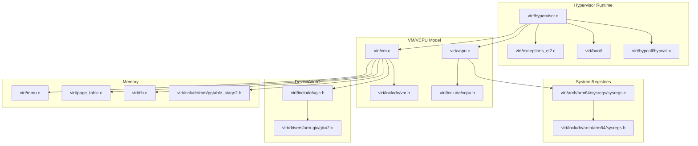
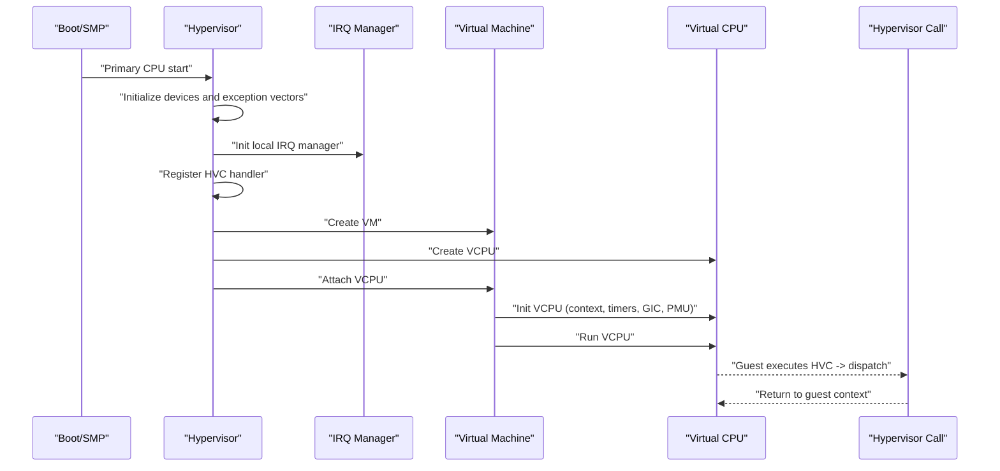
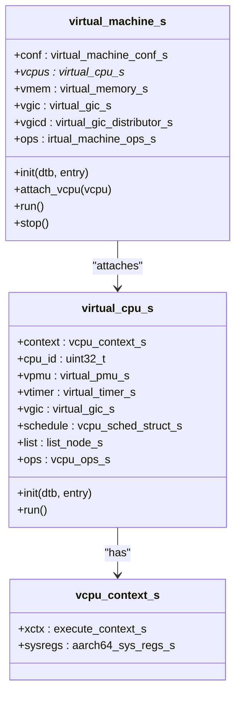
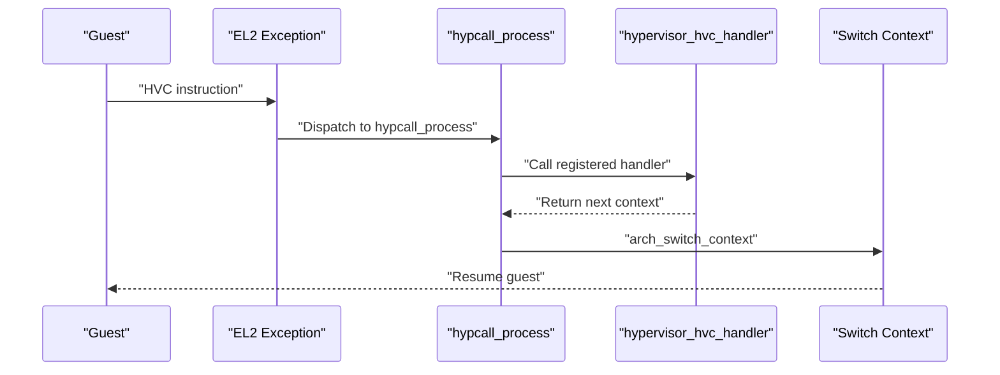
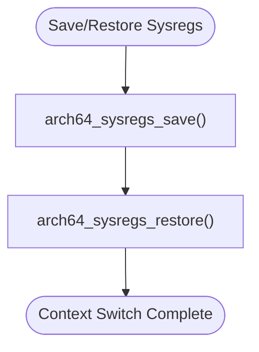
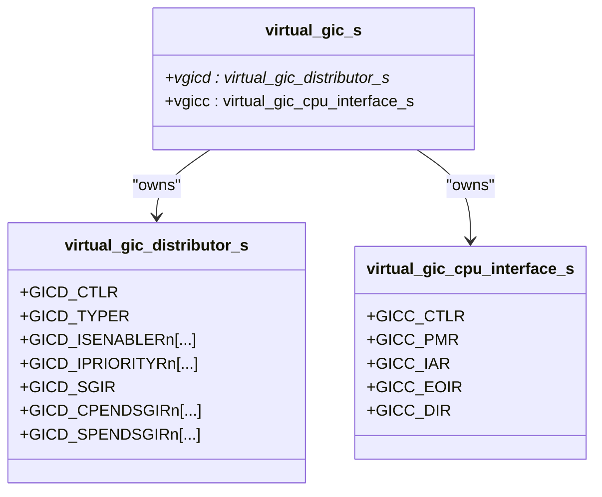
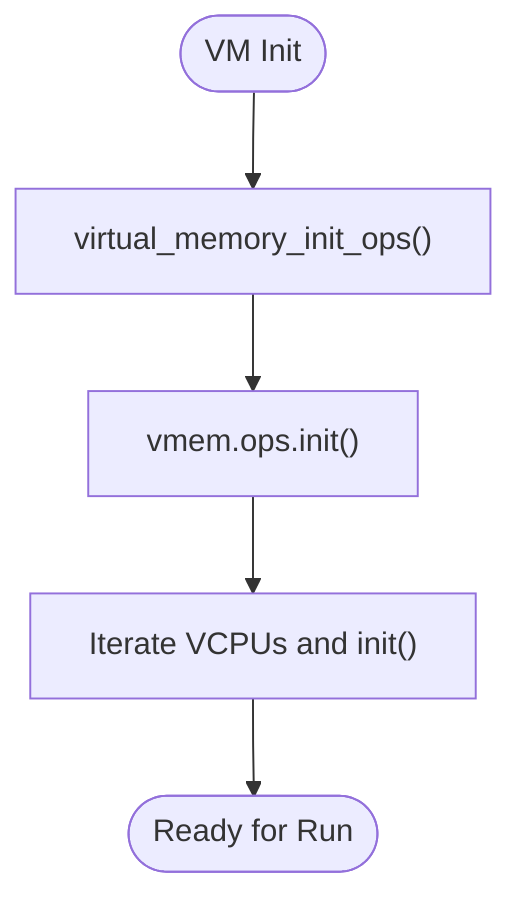
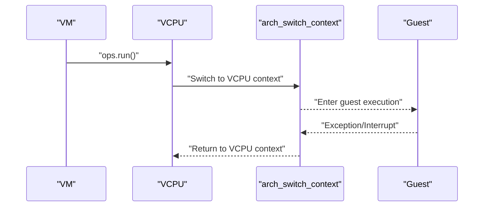
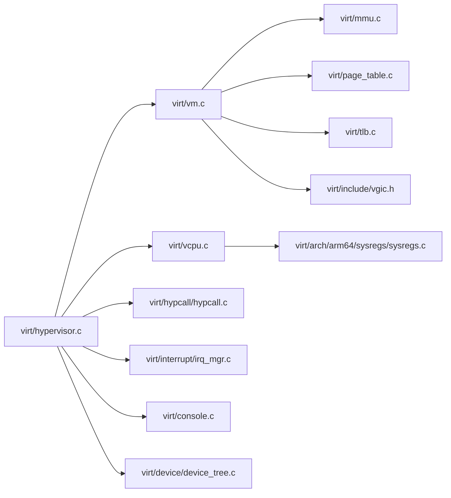

# Virtualization Support (EL2 Hypervisor)

<cite>
**Referenced Files in This Document**
- [virt/hypervisor.c](file://virt/hypervisor.c)
- [virt/vcpu.c](file://virt/vcpu.c)
- [virt/vm.c](file://virt/vm.c)
- [virt/hypcall/hypcall.c](file://virt/hypcall/hypcall.c)
- [virt/include/hypcall/hypcall.h](file://virt/include/hypcall/hypcall.h)
- [virt/include/vcpu.h](file://virt/include/vcpu.h)
- [virt/include/vm.h](file://virt/include/vm.h)
- [virt/arch/arm64/sysregs/sysregs.c](file://virt/arch/arm64/sysregs/sysregs.c)
- [virt/include/arch/arm64/sysregs.h](file://virt/include/arch/arm64/sysregs.h)
- [virt/include/vgic.h](file://virt/include/vgic.h)
- [virt/include/mm/pgtable_stage2.h](file://virt/include/mm/pgtable_stage2.h)
- [virt/exceptions_el2.c](file://virt/exceptions_el2.c)
- [virt/boot/exception_el2.S](file://virt/boot/exception_el2.S)
- [virt/pcpu.c](file://virt/pcpu.c)
- [virt/console.c](file://virt/console.c)
- [virt/interrupt/irq_mgr.c](file://virt/interrupt/irq_mgr.c)
- [virt/timer/rtc.c](file://virt/timer/rtc.c)
- [virt/mmu.c](file://virt/mmu.c)
- [virt/page_table.c](file://virt/page_table.c)
- [virt/tlb.c](file://virt/tlb.c)
- [virt/boot/boot.S](file://virt/boot/boot.S)
- [virt/boot/entry.S](file://virt/boot/entry.S)
- [virt/switch/switch.S](file://virt/switch/switch.S)
- [virt/context.c](file://virt/context.c)
- [virt/exception.c](file://virt/exception.c)
- [virt/atomic.c](file://virt/atomic.c)
- [virt/cpulocal.c](file://virt/cpulocal.c)
- [virt/printk.c](file://virt/printk.c)
- [virt/klog.h](file://virt/klog.h)
- [virt/sysproc.c](file://virt/sysproc.c)
- [virt/power_manager.c](file://virt/power_manager.c)
- [virt/device/device.c](file://virt/device/device.c)
- [virt/device/device_tree.c](file://virt/device/device_tree.c)
- [virt/drivers/arm-gic/gicv2.c](file://virt/drivers/arm-gic/gicv2.c)
- [virt/drivers/arm-uart/pl011.c](file://virt/drivers/arm-uart/pl011.c)
</cite>

## Table of Contents
1. [Introduction](#introduction)
2. [Project Structure](#project-structure)
3. [Core Components](#core-components)
4. [Architecture Overview](#architecture-overview)
5. [Detailed Component Analysis](#detailed-component-analysis)
6. [Dependency Analysis](#dependency-analysis)
7. [Performance Considerations](#performance-considerations)
8. [Troubleshooting Guide](#troubleshooting-guide)
9. [Conclusion](#conclusion)
10. [Appendices](#appendices)

## Introduction
This document explains the virtualization support in TranquilOS with a focus on the EL2 hypervisor implementation. It covers the Type-1 hypervisor architecture, VM and VCPU lifecycle, hypervisor call (HVC) handling, system register management, and context switching. It also outlines memory virtualization, device virtualization (VGIC), and security boundaries between the hypervisor and the underlying kernel. Guidance on performance implications, optimization techniques, debugging, and monitoring is included.

## Project Structure
The virtualization subsystem resides under the virt/ directory and integrates tightly with the kernel’s ARM64 architecture layer. Key areas:
- Hypervisor bootstrap and runtime: virt/hypervisor.c, virt/boot/, virt/exceptions_el2.c
- VM and VCPU model: virt/vm.c, virt/vcpu.c, virt/include/vm.h, virt/include/vcpu.h
- Hypervisor call framework: virt/hypcall/hypcall.c, virt/include/hypcall/hypcall.h
- System register management: virt/arch/arm64/sysregs/sysregs.c, virt/include/arch/arm64/sysregs.h
- Device virtualization: virt/include/vgic.h, virt/drivers/arm-gic/gicv2.c
- Memory virtualization: virt/mmu.c, virt/page_table.c, virt/tlb.c, virt/include/mm/pgtable_stage2.h
- Console, interrupts, timers, and device tree: virt/console.c, virt/interrupt/irq_mgr.c, virt/timer/rtc.c, virt/device/device_tree.c
- Context switching and entry/exit: virt/switch/switch.S, virt/boot/entry.S, virt/context.c

**Diagram sources**
- [virt/hypervisor.c](file://virt/hypervisor.c#L101-L145)
- [virt/vm.c](file://virt/vm.c#L1-L59)
- [virt/vcpu.c](file://virt/vcpu.c#L1-L66)
- [virt/hypcall/hypcall.c](file://virt/hypcall/hypcall.c#L1-L25)
- [virt/arch/arm64/sysregs/sysregs.c](file://virt/arch/arm64/sysregs/sysregs.c#L1-L172)
- [virt/include/arch/arm64/sysregs.h](file://virt/include/arch/arm64/sysregs.h#L1-L110)
- [virt/include/vm.h](file://virt/include/vm.h#L1-L39)
- [virt/include/vcpu.h](file://virt/include/vcpu.h#L1-L49)
- [virt/include/vgic.h](file://virt/include/vgic.h#L1-L66)
- [virt/drivers/arm-gic/gicv2.c](file://virt/drivers/arm-gic/gicv2.c)
- [virt/mmu.c](file://virt/mmu.c)
- [virt/page_table.c](file://virt/page_table.c)
- [virt/tlb.c](file://virt/tlb.c)
- [virt/include/mm/pgtable_stage2.h](file://virt/include/mm/pgtable_stage2.h#L1-L4)

**Section sources**
- [virt/hypervisor.c](file://virt/hypervisor.c#L1-L149)
- [virt/vm.c](file://virt/vm.c#L1-L59)
- [virt/vcpu.c](file://virt/vcpu.c#L1-L66)
- [virt/hypcall/hypcall.c](file://virt/hypcall/hypcall.c#L1-L25)

## Core Components
- Hypervisor runtime and bootstrap: Initializes devices, exception vectors, registers, and starts the host VM with a single VCPU.
- VM model: Encapsulates guest configuration, VCPUs, virtual memory, and VGIC state with operation hooks for init/run/attach/stop.
- VCPU model: Holds per-VCPU execution context, system register state, and scheduling list node; supports init and run operations.
- Hypervisor call (HVC): Provides a registration mechanism and dispatcher to handle hypercalls from guests.
- System register management: Saves and restores a subset of AArch64 system registers for context transitions.
- Device virtualization: Defines a virtual GIC abstraction; GICv2 driver present for interrupt virtualization.
- Memory virtualization: MMU, page table, and TLB modules exist for stage-1; stage-2 page table header exists for future stage-2 mapping.

**Section sources**
- [virt/hypervisor.c](file://virt/hypervisor.c#L35-L45)
- [virt/include/vm.h](file://virt/include/vm.h#L19-L34)
- [virt/include/vcpu.h](file://virt/include/vcpu.h#L26-L44)
- [virt/hypcall/hypcall.c](file://virt/hypcall/hypcall.c#L15-L25)
- [virt/arch/arm64/sysregs/sysregs.c](file://virt/arch/arm64/sysregs/sysregs.c#L88-L172)
- [virt/include/vgic.h](file://virt/include/vgic.h#L60-L63)
- [virt/include/mm/pgtable_stage2.h](file://virt/include/mm/pgtable_stage2.h#L1-L4)

## Architecture Overview
TranquilOS implements a Type-1 hypervisor at EL2. The hypervisor initializes early hardware, sets up exception handling, registers the HVC handler, and creates a host VM with a VCPU. Guest VMs are managed via VM and VCPU objects with operation hooks. System register state is saved/restored during context switches. Device interrupts are mediated via a virtual GIC abstraction backed by the GICv2 driver. Memory virtualization uses stage-1 for now; stage-2 mapping is indicated by the presence of the stage-2 page table header.

**Diagram sources**
- [virt/hypervisor.c](file://virt/hypervisor.c#L101-L145)
- [virt/vm.c](file://virt/vm.c#L5-L33)
- [virt/vcpu.c](file://virt/vcpu.c#L15-L53)
- [virt/hypcall/hypcall.c](file://virt/hypcall/hypcall.c#L19-L25)

## Detailed Component Analysis

### Hypervisor Runtime and Bootstrap
- Initializes console, device tree, early devices, boot memory, and sparse memory banks.
- Sets up per-core state and enables interrupts.
- Registers the HVC handler and configures EL2 exception vectors.
- Creates a host VM and VCPU, attaches VCPU to VM, and runs VM.

Implementation highlights:
- Splash logging and CPU privilege level reporting.
- HCR_EL2 configuration for RW=EL1 is aarch64 and routing of physical interrupts.
- HVC handler registration and dispatch to hypervisor_hvc_handler.

**Section sources**
- [virt/hypervisor.c](file://virt/hypervisor.c#L28-L33)
- [virt/hypervisor.c](file://virt/hypervisor.c#L47-L76)
- [virt/hypervisor.c](file://virt/hypervisor.c#L78-L99)
- [virt/hypervisor.c](file://virt/hypervisor.c#L101-L145)

### VM and VCPU Management
- VM object holds configuration, VCPU list, virtual memory, and VGIC state; exposes init/attach/run/stop hooks.
- VCPU object holds execution context, system register state, scheduling node, and device virtualization components.
- Default VM init walks attached VCPUs and invokes their init with DTB and entry.
- Default VM run walks VCPUs and invokes their run.

**Diagram sources**
- [virt/include/vm.h](file://virt/include/vm.h#L19-L34)
- [virt/include/vcpu.h](file://virt/include/vcpu.h#L26-L44)
- [virt/vm.c](file://virt/vm.c#L5-L33)
- [virt/vcpu.c](file://virt/vcpu.c#L19-L53)

**Section sources**
- [virt/include/vm.h](file://virt/include/vm.h#L12-L34)
- [virt/include/vcpu.h](file://virt/include/vcpu.h#L17-L44)
- [virt/vm.c](file://virt/vm.c#L5-L53)
- [virt/vcpu.c](file://virt/vcpu.c#L19-L53)

### Hypervisor Call (HVC) System
- Hypercall numbers are defined for hypervisor initialization, VM init, VCPU create/run/stop, and VM stop.
- hypcall_register installs the HVC handler; hypcall_process invokes the handler and switches to the returned context.
- hypervisor_hvc_handler currently routes to hypervisor_hvc_init for initial configuration and stubs for VM/VCPU operations.

**Diagram sources**
- [virt/include/hypcall/hypcall.h](file://virt/include/hypcall/hypcall.h#L6-L16)
- [virt/hypcall/hypcall.c](file://virt/hypcall/hypcall.c#L15-L25)
- [virt/hypervisor.c](file://virt/hypervisor.c#L78-L99)

**Section sources**
- [virt/include/hypcall/hypcall.h](file://virt/include/hypcall/hypcall.h#L6-L16)
- [virt/hypcall/hypcall.c](file://virt/hypcall/hypcall.c#L15-L25)
- [virt/hypervisor.c](file://virt/hypervisor.c#L78-L99)

### System Register Management
- AArch64 system register state is captured in a dedicated structure and saved/restored via generated helpers.
- The hypervisor saves selected EL1 registers and restores them during transitions, ensuring guest isolation and determinism.

**Diagram sources**
- [virt/arch/arm64/sysregs/sysregs.c](file://virt/arch/arm64/sysregs/sysregs.c#L88-L172)
- [virt/include/arch/arm64/sysregs.h](file://virt/include/arch/arm64/sysregs.h#L106-L107)

**Section sources**
- [virt/arch/arm64/sysregs/sysregs.c](file://virt/arch/arm64/sysregs/sysregs.c#L88-L172)
- [virt/include/arch/arm64/sysregs.h](file://virt/include/arch/arm64/sysregs.h#L106-L107)

### Device Virtualization (VGIC)
- Virtual GIC defines distributor and CPU interface structures; the hypervisor can map guest CPU interface accesses via stage-2.
- GICv2 driver is present for physical interrupt handling; virtualization path is indicated by the VGIC header.

**Diagram sources**
- [virt/include/vgic.h](file://virt/include/vgic.h#L4-L63)
- [virt/drivers/arm-gic/gicv2.c](file://virt/drivers/arm-gic/gicv2.c)

**Section sources**
- [virt/include/vgic.h](file://virt/include/vgic.h#L4-L63)
- [virt/drivers/arm-gic/gicv2.c](file://virt/drivers/arm-gic/gicv2.c)

### Memory Virtualization
- Stage-1 MMU, page table, and TLB modules exist for mapping guest physical memory.
- Stage-2 page table header indicates future implementation for guest IPA to GPA translation.
- VM init initializes virtual memory operations and applies them to each VCPU.

**Diagram sources**
- [virt/vm.c](file://virt/vm.c#L5-L19)
- [virt/include/mm/pgtable_stage2.h](file://virt/include/mm/pgtable_stage2.h#L1-L4)

**Section sources**
- [virt/vm.c](file://virt/vm.c#L5-L19)
- [virt/include/mm/pgtable_stage2.h](file://virt/include/mm/pgtable_stage2.h#L1-L4)

### VCPU Context Switching and Entry/Exit
- VCPU default run delegates to architecture-specific context switch.
- Entry/exit and switch routines are provided under virt/boot and virt/switch.
- Context structure includes execute context and AArch64 system registers.

**Diagram sources**
- [virt/vcpu.c](file://virt/vcpu.c#L15-L17)
- [virt/switch/switch.S](file://virt/switch/switch.S)
- [virt/boot/entry.S](file://virt/boot/entry.S)
- [virt/context.c](file://virt/context.c)

**Section sources**
- [virt/vcpu.c](file://virt/vcpu.c#L15-L17)
- [virt/switch/switch.S](file://virt/switch/switch.S)
- [virt/boot/entry.S](file://virt/boot/entry.S)
- [virt/context.c](file://virt/context.c)

### Implementation Examples

- VM Creation and Initialization
  - Create VM and VCPU, attach VCPU to VM, initialize with DTB and entry, then run.
  - See [virt/hypervisor.c](file://virt/hypervisor.c#L134-L142).

- VCPU Management
  - Default init sets up guest context (SP, PC, SPSR) and device virtualization components.
  - Default run triggers context switch to guest.
  - See [virt/vcpu.c](file://virt/vcpu.c#L19-L53).

- Hypervisor Call Handling
  - Register HVC handler and route hypercalls; return context to resume guest.
  - See [virt/hypcall/hypcall.c](file://virt/hypcall/hypcall.c#L15-L25) and [virt/hypervisor.c](file://virt/hypervisor.c#L78-L99).

**Section sources**
- [virt/hypervisor.c](file://virt/hypervisor.c#L134-L142)
- [virt/vcpu.c](file://virt/vcpu.c#L19-L53)
- [virt/hypcall/hypcall.c](file://virt/hypcall/hypcall.c#L15-L25)

## Dependency Analysis
- Hypervisor depends on:
  - Device tree and console for early boot.
  - IRQ manager for interrupt routing.
  - HVC framework for hypercall dispatch.
  - VM/VCPU model for guest lifecycle.
  - System register management for context isolation.
  - VGIC for virtualized interrupts.
  - MMU/page table/TLB for memory management.

**Diagram sources**
- [virt/hypervisor.c](file://virt/hypervisor.c#L1-L149)
- [virt/vm.c](file://virt/vm.c#L1-L59)
- [virt/vcpu.c](file://virt/vcpu.c#L1-L66)
- [virt/hypcall/hypcall.c](file://virt/hypcall/hypcall.c#L1-L25)
- [virt/arch/arm64/sysregs/sysregs.c](file://virt/arch/arm64/sysregs/sysregs.c#L1-L172)
- [virt/include/vgic.h](file://virt/include/vgic.h#L1-L66)
- [virt/mmu.c](file://virt/mmu.c)
- [virt/page_table.c](file://virt/page_table.c)
- [virt/tlb.c](file://virt/tlb.c)

**Section sources**
- [virt/hypervisor.c](file://virt/hypervisor.c#L1-L149)
- [virt/vm.c](file://virt/vm.c#L1-L59)
- [virt/vcpu.c](file://virt/vcpu.c#L1-L66)
- [virt/hypcall/hypcall.c](file://virt/hypcall/hypcall.c#L1-L25)

## Performance Considerations
- Minimize HVC frequency by batching hypercalls and coalescing guest-kernel interactions.
- Use efficient context switching and avoid unnecessary system register save/restore.
- Optimize interrupt virtualization by leveraging GICv2 and minimizing cross-VM contention.
- Tune memory mappings to reduce TLB pressure; consider contiguous mappings for large regions.
- Profile guest execution with virtual PMU and timers to identify hotspots.

[No sources needed since this section provides general guidance]

## Troubleshooting Guide
- Enable hypervisor splash and CPU privilege logs to confirm EL2 entry.
- Verify HCR_EL2 configuration for interrupt routing and stage-2 enablement.
- Use hypcall registration and handler logs to trace hypercall invocations.
- Inspect device tree and console initialization for early boot issues.
- Validate VCPU context setup (SP, PC, SPSR) and ensure proper entry address.

**Section sources**
- [virt/hypervisor.c](file://virt/hypervisor.c#L28-L33)
- [virt/hypervisor.c](file://virt/hypervisor.c#L47-L76)
- [virt/hypcall/hypcall.c](file://virt/hypcall/hypcall.c#L15-L25)
- [virt/device/device_tree.c](file://virt/device/device_tree.c)
- [virt/console.c](file://virt/console.c)

## Conclusion
TranquilOS provides a foundational EL2 hypervisor with a clean separation between VM/VCPU lifecycle, hypervisor calls, system register management, and device virtualization. While stage-2 memory virtualization is indicated for future development, the existing stage-1 MMU, VGIC abstraction, and HVC framework form a solid base for building a secure and efficient virtualized environment. Extending stage-2 page tables, implementing VCPU scheduling, and hardening security boundaries will further mature the hypervisor.

## Appendices

### Security Boundaries and Isolation
- EL2 isolation ensures guest VMs cannot directly access host resources.
- HCR_EL2 controls traps and routing for memory and general exceptions.
- System register save/restore isolates guest state across context switches.

**Section sources**
- [virt/hypervisor.c](file://virt/hypervisor.c#L47-L76)
- [virt/arch/arm64/sysregs/sysregs.c](file://virt/arch/arm64/sysregs/sysregs.c#L88-L172)

### Monitoring and Debugging
- Use hypervisor logs and console output for runtime diagnostics.
- Hook performance counters via virtual PMU and timers.
- Trace interrupts through VGIC and GICv2 to detect misrouting.

**Section sources**
- [virt/printk.c](file://virt/printk.c)
- [virt/klog.h](file://virt/klog.h)
- [virt/timer/rtc.c](file://virt/timer/rtc.c)
- [virt/drivers/arm-gic/gicv2.c](file://virt/drivers/arm-gic/gicv2.c)