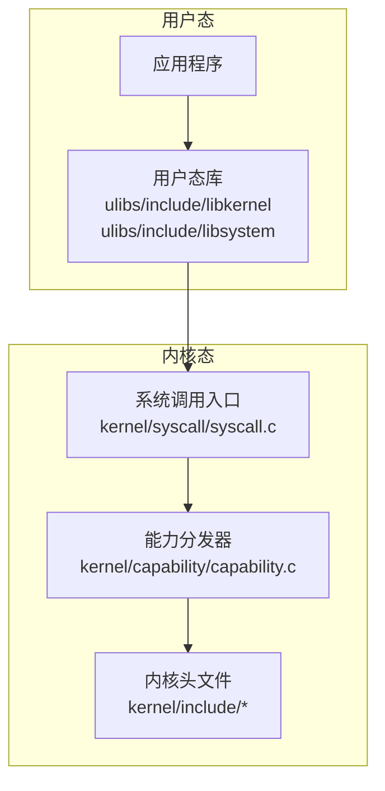
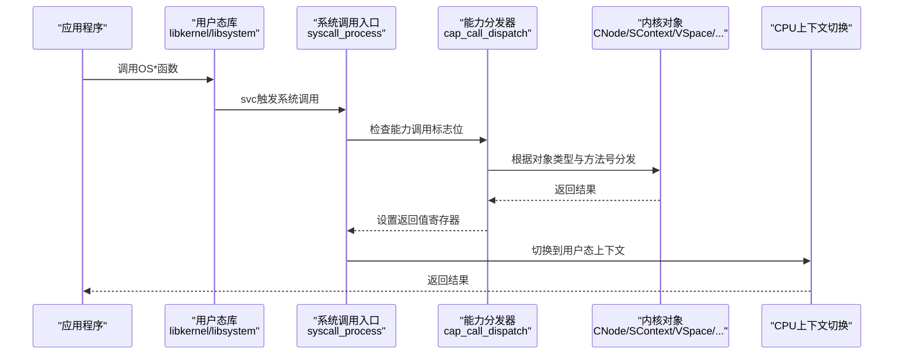
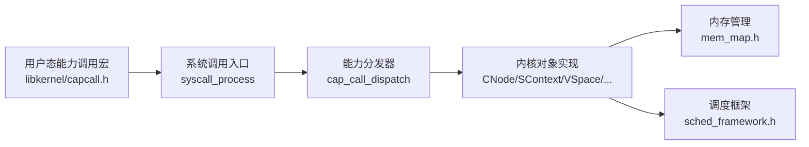

# API参考文档

<cite>
**本文档引用的文件**
- [syscall.h](file://kernel/include/syscall/syscall.h)
- [syscall.c](file://kernel/syscall/syscall.c)
- [capability.h](file://kernel/include/capability/capability.h)
- [capability.c](file://kernel/capability/capability.c)
- [capcall.h](file://ulibs/include/libkernel/capcall.h)
- [types.h](file://ulibs/include/libkernel/types.h)
- [systemd_client.h](file://ulibs/include/libsystem/systemd_client.h)
- [ipc.h](file://ulibs/include/libsystem/ipc.h)
- [mem_map.h](file://kernel/include/mm/mem_map.h)
- [sched_framework.h](file://kernel/include/scheduler/sched_framework.h)
</cite>

## 目录
1. [简介](#简介)
2. [项目结构](#项目结构)
3. [核心组件](#核心组件)
4. [架构总览](#架构总览)
5. [详细组件分析](#详细组件分析)
6. [依赖关系分析](#依赖关系分析)
7. [性能考虑](#性能考虑)
8. [故障排除指南](#故障排除指南)
9. [结论](#结论)
10. [附录](#附录)

## 简介
本文件为TranquilOS的API参考文档，覆盖内核API（系统调用接口、内存管理API、进程控制API）与用户态API（用户态库接口、服务调用接口、配置管理接口）。文档面向API使用者与系统集成工程师，提供参数说明、返回值定义、使用示例、版本信息、兼容性说明与废弃警告，并总结常见问题与最佳实践。

## 项目结构
TranquilOS采用微内核架构，内核位于kernel目录，用户态库位于ulibs目录。关键API分布在以下模块：
- 内核系统调用：kernel/syscall与kernel/include/syscall
- 能力调用（Capability Call）：kernel/capability与ulibs/include/libkernel
- 用户态系统服务客户端：ulibs/include/libsystem
- 内存管理：kernel/include/mm
- 进程调度框架：kernel/include/scheduler

**图表来源**
- [syscall.c](file://kernel/syscall/syscall.c#L8-L20)
- [capability.c](file://kernel/capability/capability.c#L14-L54)

**章节来源**
- [syscall.h](file://kernel/include/syscall/syscall.h#L1-L8)
- [syscall.c](file://kernel/syscall/syscall.c#L1-L20)

## 核心组件
本节概述TranquilOS API的核心组成与职责：
- 系统调用接口：统一入口处理能力调用与快速调用，负责上下文切换与地址空间切换。
- 能力调用接口：通过能力对象类型与方法号分发到具体内核对象操作。
- 用户态库接口：封装能力调用与IPC调用，提供易用的函数名与参数约定。
- 内存管理API：描述内存区域类型与引导阶段内存布局查询。
- 进程控制API：通过会话上下文设置能力节点、虚拟空间、执行上下文等。

**章节来源**
- [syscall.c](file://kernel/syscall/syscall.c#L8-L20)
- [capability.c](file://kernel/capability/capability.c#L14-L54)
- [capcall.h](file://ulibs/include/libkernel/capcall.h#L1-L177)
- [mem_map.h](file://kernel/include/mm/mem_map.h#L7-L26)

## 架构总览
下图展示从用户态到内核态的关键交互流程，包括系统调用入口、能力分发与上下文切换。

**图表来源**
- [syscall.c](file://kernel/syscall/syscall.c#L8-L20)
- [capability.c](file://kernel/capability/capability.c#L14-L54)
- [capcall.h](file://ulibs/include/libkernel/capcall.h#L13-L126)

## 详细组件分析

### 内核系统调用接口
- 入口函数：syscall_process(execute_context_s *ctx)
  - 功能：读取系统调用号，判断是否为能力调用；分派到能力分发或快速调用；切换地址空间后切换到用户态上下文。
  - 参数：ctx 执行上下文指针
  - 返回：无（非返回函数）
  - 使用示例：由用户态库通过svc指令触发，无需直接调用

- 快速调用与能力调用
  - 能力调用标志位：通过系统调用号的高位判断
  - 地址空间切换：在分发前后切换内核与目标地址空间
  - 上下文切换：最终切换到用户态执行上下文

**章节来源**
- [syscall.h](file://kernel/include/syscall/syscall.h#L6-L8)
- [syscall.c](file://kernel/syscall/syscall.c#L8-L20)

### 能力调用接口（用户态）
- 宏定义与生成
  - CAP_CALL_MASK：能力调用标志位掩码
  - CAP_CALL_DEFINE系列宏：自动生成OS*函数，设置r8为能力号，通过svc 0进入内核
  - 支持0-6个参数的函数生成

- 已实现的能力调用
  - SysCtrl类：获取页结构表、设备树、时间戳、CPU信息、更新页结构表
  - Self类：让出CPU、纳秒级睡眠、获取调用者PID
  - VSpace类：准备/映射/解除映射页面与范围
  - CNode类：创建能力、准备/扩展能力节点
  - SContext类：设置能力节点、虚拟空间、执行上下文、名称、PID、调度、设置上行调用端点
  - XContext类：初始化执行上下文
  - Console类：打印字符串
  - IpcEndPoint类：初始化端点、调用、回复
  - UpcallEndPoint类：初始化端点、回复

- 返回值约定
  - 大多数能力调用返回uint64_t作为状态码或句柄
  - 映射类调用返回map_result_t枚举，用于诊断映射失败原因

**章节来源**
- [capcall.h](file://ulibs/include/libkernel/capcall.h#L13-L177)
- [types.h](file://ulibs/include/libkernel/types.h#L4-L76)

### 能力调用接口（内核态）
- 能力分发器
  - cap_call_dispatch(execute_context_s *ctx)：解析能力号，按对象类型分发到对应处理器
  - cap_call_return(execute_context_s *ctx, uint64_t ret_value)：设置返回值到寄存器

- 对象类型与方法
  - 支持对象类型：CNode、Console、XContext、SContext、VSpace、SysCtrl、Self、IpcEndPoint、UpcallEndPoint
  - 方法号由能力号中的方法字段决定，具体处理逻辑在各对象实现中

**章节来源**
- [capability.h](file://kernel/include/capability/capability.h#L22-L25)
- [capability.c](file://kernel/capability/capability.c#L14-L54)

### 用户态库接口（系统服务客户端）
- systemd客户端
  - systemd_client_s：包含systemd_cref与一组操作函数指针
  - 支持功能：分配共享内存、获取共享内存、释放共享内存、获取内存统计、获取进程/线程数量、注册上行调用、页故障上报、进程退出
  - 函数指针类型：alloc_shm/get_shm/free_shm/get_mem_total/get_mem_free/get_proc_count/get_thread_count/register_upcall/page_fault/process_self_exit

- 名称服务与IPC
  - 服务ID：名称服务、systemd服务、设备管理器、文件系统、网络服务
  - 名称服务方法：注册服务、获取服务
  - 注册与获取服务：通过名称服务端点进行服务发现与绑定

**章节来源**
- [systemd_client.h](file://ulibs/include/libsystem/systemd_client.h#L7-L84)
- [ipc.h](file://ulibs/include/libsystem/ipc.h#L11-L73)

### 内存管理API
- 内存区域类型
  - MEMORY_TEXT：只读代码段
  - MEMORY_RODATA：只读数据段
  - MEMORY_RWDATA：读写数据段

- 内存区域描述
  - mem_region_s：包含类型、起始地址、结束地址、名称
  - mem_regions_s：包含区域计数与可变长度区域数组

- 引导内存布局
  - boot_mm_get_regions()：获取引导阶段内存区域列表

**章节来源**
- [mem_map.h](file://kernel/include/mm/mem_map.h#L7-L26)

### 进程控制API
- 会话上下文（SContext）
  - 设置能力节点：SetCNode/SetCNodeCurrent
  - 设置虚拟空间：SetVSpace/SetVSpaceCurrent
  - 设置执行上下文：SetXContext
  - 设置名称与PID：SetName/SetPid
  - 调度控制：Schedule/ScheduleOn
  - 设置上行调用端点：SetUpcall

- 执行上下文（XContext）
  - 初始化：Init(entry, sp)

- 能力节点（CNode）
  - 创建能力：NewCapability(type, paddr, rights)
  - 准备/扩展：Prepare/Extend(target_cref, page)

- 虚拟空间（VSpace）
  - 准备：Prepare(cnode_cref, vspace_cref, page)
  - 尝试映射单页/范围：TryMapPage/TryMapRange(vstart, pstart, size)
  - 扩展映射：Extend(vaddr, page)
  - 解除映射单页/范围：UnMapPage/UnMapRange(vstart, size)

**章节来源**
- [capcall.h](file://ulibs/include/libkernel/capcall.h#L147-L162)
- [types.h](file://ulibs/include/libkernel/types.h#L4-L26)

### 进程调度框架
- 调度框架接口
  - scheduler_framework_s：包含名称、链表节点以及next/add/remove/is_empty等函数指针
  - 通过函数指针实现不同调度算法的统一接口

**章节来源**
- [sched_framework.h](file://kernel/include/scheduler/sched_framework.h#L11-L18)

## 依赖关系分析
- 用户态库依赖内核系统调用入口与能力分发器
- 能力调用宏自动生成用户态函数，统一通过svc 0进入内核
- 内核侧根据能力号分发到具体对象处理
- 内存管理与调度框架为系统服务提供基础设施

**图表来源**
- [capcall.h](file://ulibs/include/libkernel/capcall.h#L13-L126)
- [syscall.c](file://kernel/syscall/syscall.c#L8-L20)
- [capability.c](file://kernel/capability/capability.c#L14-L54)
- [mem_map.h](file://kernel/include/mm/mem_map.h#L25-L26)
- [sched_framework.h](file://kernel/include/scheduler/sched_framework.h#L11-L18)

**章节来源**
- [capcall.h](file://ulibs/include/libkernel/capcall.h#L1-L177)
- [syscall.c](file://kernel/syscall/syscall.c#L1-L20)
- [capability.c](file://kernel/capability/capability.c#L1-L58)

## 性能考虑
- 能力调用路径优化：通过宏生成的OS*函数减少重复代码，提高编译期优化效率
- 地址空间切换：在系统调用前后切换地址空间，避免不必要的切换开销
- 映射失败诊断：map_result_t提供详细的映射失败原因，便于快速定位问题
- 调度框架抽象：通过函数指针实现调度算法的可插拔设计，便于选择合适的调度策略

## 故障排除指南
- 映射失败排查
  - 使用map_result_t诊断映射失败的具体层级与原因
  - 常见原因：页表项无效、地址为空、已映射等

- 服务发现失败
  - 使用sys_get_service循环重试，直到获取有效服务引用
  - 检查服务是否已启动并正确注册

- 权限与能力问题
  - 确认能力节点权限设置正确
  - 检查能力号构造是否符合规范（对象类型+方法号）

- 上下文切换异常
  - 确保在能力调用后正确设置返回值
  - 检查地址空间切换顺序

**章节来源**
- [types.h](file://ulibs/include/libkernel/types.h#L27-L74)
- [ipc.h](file://ulibs/include/libsystem/ipc.h#L61-L70)
- [capability.c](file://kernel/capability/capability.c#L56-L58)

## 结论
TranquilOS提供了清晰的微内核API体系：用户态通过能力调用宏与系统调用入口访问内核功能，内核侧以能力分发器统一调度到具体对象实现。内存管理与调度框架为系统服务提供基础支撑。建议在开发中充分利用map_result_t进行错误诊断，遵循能力号构造规范，并合理使用服务发现机制。

## 附录

### 版本信息与兼容性
- 当前实现基于aarch64平台，使用ARMv8寄存器约定
- 能力调用接口保持稳定，新增对象类型需同步更新能力分发器
- 内存管理API与调度框架接口保持向后兼容

### 废弃警告
- 未发现明确的废弃API标记
- 建议优先使用systemd_client提供的高级接口而非底层能力调用

### 最佳实践
- 使用systemd_client封装的高级接口进行系统资源管理
- 在映射失败时优先检查页表项有效性
- 合理设置能力权限，遵循最小权限原则
- 使用服务发现机制动态获取服务引用，避免硬编码