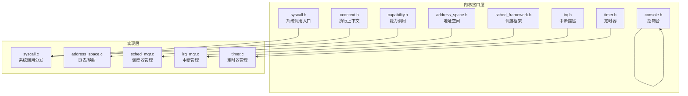
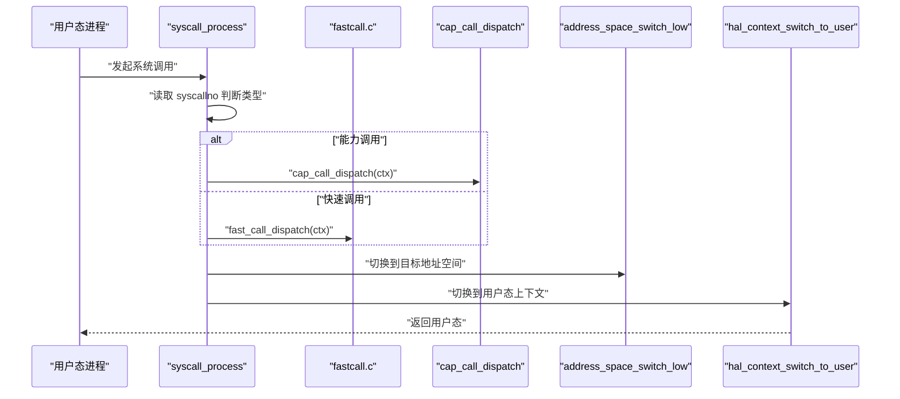
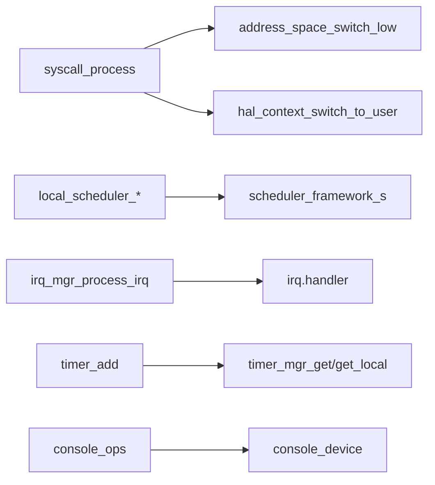

# 内核API

<cite>
**本文引用的文件**
- [syscall.h](file://kernel/include/syscall/syscall.h)
- [syscall.c](file://kernel/syscall/syscall.c)
- [xcontext.h](file://kernel/include/xcontext/xcontext.h)
- [fastcall.h](file://kernel/include/syscall/fastcall.h)
- [capability.h](file://kernel/include/capability/capability.h)
- [address_space.h](file://kernel/include/mm/address_space.h)
- [address_space.c](file://kernel/mm/address_space.c)
- [mem_map.h](file://kernel/include/mm/mem_map.h)
- [sched_framework.h](file://kernel/include/scheduler/sched_framework.h)
- [sched_mgr.c](file://kernel/schedule/sched_mgr.c)
- [irq.h](file://kernel/include/interrupt/irq.h)
- [irq_mgr.c](file://kernel/interrupt/irq_mgr.c)
- [timer.h](file://kernel/include/timer/timer.h)
- [timer.c](file://kernel/timer/timer.c)
- [console.h](file://kernel/include/console/console.h)
</cite>

## 目录
1. [简介](#简介)
2. [项目结构](#项目结构)
3. [核心组件](#核心组件)
4. [架构总览](#架构总览)
5. [详细组件分析](#详细组件分析)
6. [依赖关系分析](#依赖关系分析)
7. [性能考虑](#性能考虑)
8. [故障排查指南](#故障排查指南)
9. [结论](#结论)
10. [附录](#附录)

## 简介
本文件为 TranquilOS 内核 API 的权威参考文档，覆盖以下内核子系统的对外接口与使用规范：
- 系统调用与能力调用：execute_context_s 参数结构、调用约定、错误处理策略
- 内存管理：页表操作、地址空间管理、内存区域描述
- 进程调度：调度框架、上下文切换、亲和性与优先级管理
- 中断处理：IRQ 注册、中断服务例程、异常处理流程
- 定时器：时间管理、定时器创建与回调机制
- 控制台与设备：输入输出接口与设备管理

本文件以“可读性优先”的原则组织内容，既面向内核开发者，也兼顾对底层接口不熟悉的读者。

## 项目结构
TranquilOS 将内核功能按层次划分：
- include 层：公共头文件，定义数据结构、类型与对外 API 原型
- 实现层：具体逻辑在对应目录中实现（如 mm、schedule、interrupt、timer、console）
- 架构抽象层：通过 HAL 接口屏蔽不同 CPU/平台差异（例如 hal_mmu、hal_tlb、hal_page_table）

**图表来源**
- [syscall.h](file://kernel/include/syscall/syscall.h#L1-L8)
- [syscall.c](file://kernel/syscall/syscall.c#L1-L20)
- [xcontext.h](file://kernel/include/xcontext/xcontext.h#L1-L24)
- [capability.h](file://kernel/include/capability/capability.h#L1-L26)
- [address_space.h](file://kernel/include/mm/address_space.h#L1-L43)
- [address_space.c](file://kernel/mm/address_space.c#L1-L105)
- [sched_framework.h](file://kernel/include/scheduler/sched_framework.h#L1-L20)
- [sched_mgr.c](file://kernel/schedule/sched_mgr.c#L1-L167)
- [irq.h](file://kernel/include/interrupt/irq.h#L1-L38)
- [irq_mgr.c](file://kernel/interrupt/irq_mgr.c#L1-L142)
- [timer.h](file://kernel/include/timer/timer.h#L1-L57)
- [timer.c](file://kernel/timer/timer.c#L1-L59)
- [console.h](file://kernel/include/console/console.h#L1-L25)

**章节来源**
- [syscall.h](file://kernel/include/syscall/syscall.h#L1-L8)
- [syscall.c](file://kernel/syscall/syscall.c#L1-L20)
- [xcontext.h](file://kernel/include/xcontext/xcontext.h#L1-L24)
- [capability.h](file://kernel/include/capability/capability.h#L1-L26)
- [address_space.h](file://kernel/include/mm/address_space.h#L1-L43)
- [address_space.c](file://kernel/mm/address_space.c#L1-L105)
- [sched_framework.h](file://kernel/include/scheduler/sched_framework.h#L1-L20)
- [sched_mgr.c](file://kernel/schedule/sched_mgr.c#L1-L167)
- [irq.h](file://kernel/include/interrupt/irq.h#L1-L38)
- [irq_mgr.c](file://kernel/interrupt/irq_mgr.c#L1-L142)
- [timer.h](file://kernel/include/timer/timer.h#L1-L57)
- [timer.c](file://kernel/timer/timer.c#L1-L59)
- [console.h](file://kernel/include/console/console.h#L1-L25)

## 核心组件
本节概述各子系统的关键数据结构与职责，并给出调用约定与错误处理策略。

- 系统调用与能力调用
  - 调用入口：syscall_process(execute_context_s *ctx)
  - 调用约定：根据 syscallno 的位掩码区分能力调用与快速调用；随后切换到用户态上下文
  - 错误处理：空指针或未初始化状态触发恐慌
  - 参考路径：[syscall_process](file://kernel/syscall/syscall.c#L8-L20)，[syscall.h](file://kernel/include/syscall/syscall.h#L6-L6)

- 执行上下文 execute_context_s
  - 字段：架构寄存器存储区、IPC 上下文指针、绑定的调度上下文
  - 初始化：xcontext_init、xcontext_init_common_regs、xcontext_dump
  - 参考路径：[execute_context_s](file://kernel/include/xcontext/xcontext.h#L7-L15)，[xcontext_init](file://kernel/include/xcontext/xcontext.h#L21-L21)

- 能力调用 capability
  - 结构：capability_header_s（类型、权限位、保留位）、capability（物理地址）
  - 接口：cap_call_dispatch、cap_call_return
  - 参考路径：[capability.h](file://kernel/include/capability/capability.h#L11-L25)

- 地址空间与页表
  - 结构：address_space_s（页表基址、标识符）
  - 操作：设置高/低地址空间、切换、准备、页映射/扩展/反向映射
  - 参考路径：[address_space.h](file://kernel/include/mm/address_space.h#L19-L42)，[address_space.c](file://kernel/mm/address_space.c#L9-L105)

- 内存区域描述
  - 结构：mem_region_s、mem_regions_s
  - 接口：boot_mm_get_regions
  - 参考路径：[mem_map.h](file://kernel/include/mm/mem_map.h#L13-L26)

- 调度框架
  - 结构：scheduler_framework_s（函数指针表）
  - 管理：local_scheduler_*、scheduler_manager_*、优先级遍历
  - 参考路径：[sched_framework.h](file://kernel/include/scheduler/sched_framework.h#L11-L18)，[sched_mgr.c](file://kernel/schedule/sched_mgr.c#L6-L167)

- 中断管理
  - 结构：irq_s（中断号、名称、链表节点、处理器、处理模式）
  - 流程：注册 IRQ、查询、ACK/EoI、调用处理器、调度切换
  - 参考路径：[irq.h](file://kernel/include/interrupt/irq.h#L29-L35)，[irq_mgr.c](file://kernel/interrupt/irq_mgr.c#L49-L83)

- 定时器
  - 结构：timer_s（到期时间、时钟源、回调、等待的调度上下文）
  - 接口：timer_init、timer_add
  - 参考路径：[timer.h](file://kernel/include/timer/timer.h#L38-L50)，[timer.c](file://kernel/timer/timer.c#L5-L59)

- 控制台
  - 结构：console_s、console_ops_s
  - 接口：console_init、attach/read/write
  - 参考路径：[console.h](file://kernel/include/console/console.h#L18-L25)

**章节来源**
- [syscall.c](file://kernel/syscall/syscall.c#L8-L20)
- [xcontext.h](file://kernel/include/xcontext/xcontext.h#L7-L23)
- [capability.h](file://kernel/include/capability/capability.h#L11-L25)
- [address_space.h](file://kernel/include/mm/address_space.h#L19-L42)
- [address_space.c](file://kernel/mm/address_space.c#L9-L105)
- [mem_map.h](file://kernel/include/mm/mem_map.h#L13-L26)
- [sched_framework.h](file://kernel/include/scheduler/sched_framework.h#L11-L18)
- [sched_mgr.c](file://kernel/schedule/sched_mgr.c#L6-L167)
- [irq.h](file://kernel/include/interrupt/irq.h#L29-L35)
- [irq_mgr.c](file://kernel/interrupt/irq_mgr.c#L49-L83)
- [timer.h](file://kernel/include/timer/timer.h#L38-L50)
- [timer.c](file://kernel/timer/timer.c#L5-L59)
- [console.h](file://kernel/include/console/console.h#L18-L25)

## 架构总览
TranquilOS 采用“接口层 + 实现层 + HAL 抽象层”的分层设计。系统调用通过 syscall_process 统一分发，依据调用类型选择能力调用或快速调用路径；内存管理通过地址空间与页表 HAL 接口完成映射；调度器通过框架接口统一调度；中断由 IRQ 管理器统一 ACK/EoI 并驱动调度；定时器基于时间管理容器进行到期处理；控制台提供字符级 I/O。

**图表来源**
- [syscall.c](file://kernel/syscall/syscall.c#L8-L20)
- [syscall.h](file://kernel/include/syscall/syscall.h#L6-L6)
- [fastcall.h](file://kernel/include/syscall/fastcall.h)

**章节来源**
- [syscall.c](file://kernel/syscall/syscall.c#L8-L20)
- [syscall.h](file://kernel/include/syscall/syscall.h#L6-L6)

## 详细组件分析

### 系统调用与能力调用 API
- 入口函数
  - 名称：syscall_process
  - 参数：execute_context_s *ctx
  - 返回：无（永不返回至调用者）
  - 行为：读取 syscallno，分流至能力调用或快速调用；切换地址空间后进入用户态
  - 参考路径：[syscall_process](file://kernel/syscall/syscall.c#L8-L20)，[syscall.h](file://kernel/include/syscall/syscall.h#L6-L6)

- 能力调用
  - 接口：cap_call_dispatch、cap_call_return
  - 权限位：CAP_RIGHT_ALL
  - 结构：capability_header_s、capability
  - 参考路径：[capability.h](file://kernel/include/capability/capability.h#L22-L25)

- 快速调用
  - 头文件：fastcall.h
  - 作用：非能力类系统调用的快速路径
  - 参考路径：[fastcall.h](file://kernel/include/syscall/fastcall.h)

- 错误处理策略
  - 空指针与未初始化：触发恐慌
  - 示例路径：[syscall.c](file://kernel/syscall/syscall.c#L8-L20)，[capability.h](file://kernel/include/capability/capability.h#L22-L25)

**章节来源**
- [syscall.c](file://kernel/syscall/syscall.c#L8-L20)
- [syscall.h](file://kernel/include/syscall/syscall.h#L6-L6)
- [capability.h](file://kernel/include/capability/capability.h#L22-L25)
- [fastcall.h](file://kernel/include/syscall/fastcall.h)

### 内存管理 API
- 地址空间管理
  - 设置/切换：address_space_set_low/high、address_space_switch_low/high
  - 准备：address_space_prepare（清零页表）
  - 映射/扩展/反向映射：address_space_try_map_page、address_space_extend、address_space_unmap_page、address_space_unmap_range
  - 参考路径：[address_space.h](file://kernel/include/mm/address_space.h#L24-L42)，[address_space.c](file://kernel/mm/address_space.c#L9-L105)

- 页表与 TLB
  - 通过 HAL 接口完成页表映射与 TLB 无效化
  - 参考路径：[address_space.c](file://kernel/mm/address_space.c#L14-L48)

- 内存区域描述
  - 结构：mem_region_s、mem_regions_s
  - 获取：boot_mm_get_regions
  - 参考路径：[mem_map.h](file://kernel/include/mm/mem_map.h#L13-L26)

- 使用示例（步骤）
  1) 准备地址空间：调用 address_space_prepare
  2) 映射页面：调用 address_space_try_map_page
  3) 切换地址空间：address_space_switch_low
  4) 反向映射：address_space_unmap_page 或 address_space_unmap_range

- 错误处理策略
  - 空指针与未准备页表：触发恐慌
  - 参考路径：[address_space.c](file://kernel/mm/address_space.c#L9-L105)

**章节来源**
- [address_space.h](file://kernel/include/mm/address_space.h#L24-L42)
- [address_space.c](file://kernel/mm/address_space.c#L9-L105)
- [mem_map.h](file://kernel/include/mm/mem_map.h#L13-L26)

### 进程调度 API
- 调度框架
  - 结构：scheduler_framework_s（next/add/remove/is_empty）
  - 参考路径：[sched_framework.h](file://kernel/include/scheduler/sched_framework.h#L11-L18)

- 调度器管理
  - 添加/移除/下一调度：local_scheduler_add_scontext、local_scheduler_remove_scontext、local_scheduler_next
  - 管理器：scheduler_mgr_init、scheduler_manager_add_scontext、scheduler_manager_get_local_scheduler
  - 亲和性：按位掩码选择 CPU
  - 参考路径：[sched_mgr.c](file://kernel/schedule/sched_mgr.c#L6-L167)

- 上下文切换
  - 当前实现：通过 HAL 切换用户态上下文
  - 参考路径：[syscall.c](file://kernel/syscall/syscall.c#L17-L19)

- 使用示例（步骤）
  1) 注册调度框架：local_scheduler_register_framework
  2) 添加调度上下文：local_scheduler_add_scontext
  3) 选择下一调度：local_scheduler_next
  4) 执行调度：local_scheduler_schedule

- 错误处理策略
  - 空指针与未注册框架：触发恐慌或返回空
  - 参考路径：[sched_mgr.c](file://kernel/schedule/sched_mgr.c#L6-L167)

**章节来源**
- [sched_framework.h](file://kernel/include/scheduler/sched_framework.h#L11-L18)
- [sched_mgr.c](file://kernel/schedule/sched_mgr.c#L6-L167)
- [syscall.c](file://kernel/syscall/syscall.c#L17-L19)

### 中断处理 API
- 中断描述
  - 结构：irq_s（int_no、name、list、handler、handle_mode）
  - 状态：irq_state_t（PENDING/ACTIVE/PENDING_ACTIVE）
  - 返回：irq_ret_t（EoI 标志）
  - 参考路径：[irq.h](file://kernel/include/interrupt/irq.h#L29-L35)

- 中断管理
  - 注册/查询/处理：local_irqmgr_register_irq/local_irqmgr_get_irq/local_irqmgr_process_irq
  - 设备：ack/eoi 通过设备操作表
  - 参考路径：[irq_mgr.c](file://kernel/interrupt/irq_mgr.c#L13-L83)

- 异常处理流程
  1) 设备 ACK 获取中断号
  2) 查找已注册 IRQ
  3) 调用处理器
  4) 设备 EoI
  5) 触发调度切换

- 使用示例（步骤）
  1) 注册 IRQ：local_irqmgr_register_irq
  2) 注册设备：local_irqmgr_register_device
  3) 处理中断：local_irqmgr_process_irq

- 错误处理策略
  - 未注册中断：记录错误
  - 设备为空：记录错误
  - 参考路径：[irq_mgr.c](file://kernel/interrupt/irq_mgr.c#L49-L83)

**章节来源**
- [irq.h](file://kernel/include/interrupt/irq.h#L29-L35)
- [irq_mgr.c](file://kernel/interrupt/irq_mgr.c#L13-L83)

### 定时器 API
- 定时器结构
  - timer_s：hard_expire、soft_expire、clk_id、flags、name、wait_scontext、handler
  - 时间单位：time_unit_s（纳秒）
  - 参考路径：[timer.h](file://kernel/include/timer/timer.h#L38-L50)

- 接口
  - 初始化：timer_init（设置到期、标志、回调）
  - 添加：timer_add（计算到期时间并加入本地定时器管理器）
  - 参考路径：[timer.c](file://kernel/timer/timer.c#L5-L59)

- 使用示例（步骤）
  1) 初始化：timer_init(timer, name, callback)
  2) 添加：timer_add(timer, clk_id, nsec)

- 错误处理策略
  - 空指针：记录错误并返回 NULL
  - 参考路径：[timer.c](file://kernel/timer/timer.c#L5-L59)

**章节来源**
- [timer.h](file://kernel/include/timer/timer.h#L38-L50)
- [timer.c](file://kernel/timer/timer.c#L5-L59)

### 控制台与设备 API
- 控制台结构
  - console_s：device、ops（write_char/read_char/attach）
  - 参考路径：[console.h](file://kernel/include/console/console.h#L18-L25)

- 设备管理
  - 通过 console_ops_s 提供 attach/read/write
  - 参考路径：[console.h](file://kernel/include/console/console.h#L12-L16)

- 使用示例（步骤）
  1) 初始化：console_init
  2) 关联设备：ops.attach
  3) 读写：ops.read_char/ops.write_char

- 错误处理策略
  - 未初始化或设备为空：返回失败或记录错误
  - 参考路径：[console.h](file://kernel/include/console/console.h#L18-L25)

**章节来源**
- [console.h](file://kernel/include/console/console.h#L18-L25)

## 依赖关系分析
- 调用关系
  - syscall_process 依赖 HAL 上下文切换与地址空间切换
  - 调度器依赖调度框架函数指针
  - 中断管理依赖 IRQ 描述与设备操作表
  - 定时器依赖时间管理器与本地定时器管理器
- 数据结构耦合
  - execute_context_s 与调度上下文双向关联
  - address_space_s 与 HAL 页表接口强耦合
  - timer_s 与 wait_scontext 存在等待关系

**图表来源**
- [syscall.c](file://kernel/syscall/syscall.c#L17-L19)
- [address_space.h](file://kernel/include/mm/address_space.h#L24-L42)
- [sched_framework.h](file://kernel/include/scheduler/sched_framework.h#L11-L18)
- [irq_mgr.c](file://kernel/interrupt/irq_mgr.c#L49-L83)
- [timer.c](file://kernel/timer/timer.c#L34-L52)
- [console.h](file://kernel/include/console/console.h#L18-L25)

**章节来源**
- [syscall.c](file://kernel/syscall/syscall.c#L17-L19)
- [sched_framework.h](file://kernel/include/scheduler/sched_framework.h#L11-L18)
- [irq_mgr.c](file://kernel/interrupt/irq_mgr.c#L49-L83)
- [timer.c](file://kernel/timer/timer.c#L34-L52)
- [console.h](file://kernel/include/console/console.h#L18-L25)

## 性能考虑
- 地址空间切换
  - 仅在页表地址变化时更新并使 TLB 无效，避免频繁刷新
  - 参考路径：[address_space.c](file://kernel/mm/address_space.c#L25-L49)
- 调度框架
  - 优先级遍历：当前实现按框架链表顺序查找非空队列，建议后续引入优先级队列
  - 参考路径：[sched_mgr.c](file://kernel/schedule/sched_mgr.c#L60-L72)
- 中断处理
  - ACK/EoI 与处理器调用分离，减少锁粒度
  - 参考路径：[irq_mgr.c](file://kernel/interrupt/irq_mgr.c#L49-L83)
- 定时器
  - 本地时间保持与到期容器结合，避免全局锁竞争
  - 参考路径：[timer.c](file://kernel/timer/timer.c#L44-L49)

[本节为通用指导，无需列出具体文件来源]

## 故障排查指南
- 系统调用
  - 症状：调用后立即崩溃
  - 排查：确认 syscall_process 的参数与 HAL 切换是否正确
  - 参考路径：[syscall.c](file://kernel/syscall/syscall.c#L8-L20)
- 地址空间
  - 症状：映射失败或访问异常
  - 排查：检查地址空间是否已 prepare、页表是否就绪、vaddr/paddr 是否对齐
  - 参考路径：[address_space.c](file://kernel/mm/address_space.c#L51-L105)
- 调度器
  - 症状：调度上下文无法添加/移除
  - 排查：确认框架已注册、scontext 与 xcontext 链接一致
  - 参考路径：[sched_mgr.c](file://kernel/schedule/sched_mgr.c#L14-L29)
- 中断
  - 症状：未注册中断导致日志错误
  - 排查：确保 IRQ 已注册且设备 ACK/EoI 正确
  - 参考路径：[irq_mgr.c](file://kernel/interrupt/irq_mgr.c#L49-L83)
- 定时器
  - 症状：定时器不触发
  - 排查：检查时间管理器初始化、到期时间计算、回调函数
  - 参考路径：[timer.c](file://kernel/timer/timer.c#L28-L59)
- 控制台
  - 症状：读写失败
  - 排查：确认设备 attach 成功、ops 指针有效
  - 参考路径：[console.h](file://kernel/include/console/console.h#L18-L25)

**章节来源**
- [syscall.c](file://kernel/syscall/syscall.c#L8-L20)
- [address_space.c](file://kernel/mm/address_space.c#L51-L105)
- [sched_mgr.c](file://kernel/schedule/sched_mgr.c#L14-L29)
- [irq_mgr.c](file://kernel/interrupt/irq_mgr.c#L49-L83)
- [timer.c](file://kernel/timer/timer.c#L28-L59)
- [console.h](file://kernel/include/console/console.h#L18-L25)

## 结论
TranquilOS 内核 API 以清晰的数据结构与分层接口组织，覆盖系统调用、内存管理、调度、中断、定时器与控制台等核心能力。通过 HAL 抽象屏蔽平台差异，便于移植与扩展。建议在后续版本中完善优先级调度、反向映射与更细粒度的错误处理，以进一步提升性能与可靠性。

[本节为总结性内容，无需列出具体文件来源]

## 附录
- 关键数据结构一览
  - execute_context_s：执行上下文寄存器与 IPC/调度上下文
  - address_space_s：地址空间与页表基址
  - scheduler_framework_s：调度框架函数指针表
  - irq_s：中断描述与处理器
  - timer_s：定时器到期与回调
  - console_s：控制台与设备操作

- 参考路径汇总
  - [execute_context_s](file://kernel/include/xcontext/xcontext.h#L7-L15)
  - [address_space_s](file://kernel/include/mm/address_space.h#L19-L22)
  - [scheduler_framework_s](file://kernel/include/scheduler/sched_framework.h#L11-L18)
  - [irq_s](file://kernel/include/interrupt/irq.h#L29-L35)
  - [timer_s](file://kernel/include/timer/timer.h#L38-L50)
  - [console_s](file://kernel/include/console/console.h#L18-L21)

**章节来源**
- [xcontext.h](file://kernel/include/xcontext/xcontext.h#L7-L15)
- [address_space.h](file://kernel/include/mm/address_space.h#L19-L22)
- [sched_framework.h](file://kernel/include/scheduler/sched_framework.h#L11-L18)
- [irq.h](file://kernel/include/interrupt/irq.h#L29-L35)
- [timer.h](file://kernel/include/timer/timer.h#L38-L50)
- [console.h](file://kernel/include/console/console.h#L18-L21)